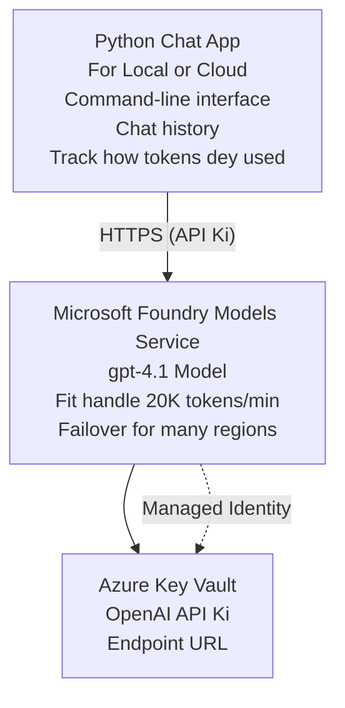

# Microsoft Foundry Models Chat Application

**Learning Path:** Intermediate ⭐⭐ | **Time:** 35-45 minutes | **Cost:** $50-200/month

Na complete Microsoft Foundry Models chat application wey dem deploy using Azure Developer CLI (azd). Dis example dey show how to deploy gpt-4.1, secure API access, and build simple chat interface.

## 🎯 Wetin You Go Learn

- Deploy Microsoft Foundry Models Service wit gpt-4.1 model
- Secure OpenAI API keys inside Key Vault
- Build simple chat interface wit Python
- Monitor token usage and costs
- Implement rate limiting and handle errors

## 📦 Wetin Dey Included

✅ **Microsoft Foundry Models Service** - gpt-4.1 model deployment  
✅ **Python Chat App** - Simple command-line chat interface  
✅ **Key Vault Integration** - Secure API key storage  
✅ **ARM Templates** - Complete infrastructure as code  
✅ **Cost Monitoring** - Token usage tracking  
✅ **Rate Limiting** - Prevent quota exhaustion  

## Architecture



## Prerequisites

### Required

- **Azure Developer CLI (azd)** - [Install guide](https://learn.microsoft.com/azure/developer/azure-developer-cli/install-azd)
- **Azure subscription** with OpenAI access - [Request access](https://aka.ms/oai/access)
- **Python 3.9+** - [Install Python](https://www.python.org/downloads/)

### Verify Prerequisites

```bash
# Check azd version (gats 1.5.0 or pass)
azd version

# Confirm say you don login for Azure
azd auth login

# Make you check Python version
python --version  # or python3 --version

# Confirm say you get OpenAI access (check for am inside Azure Portal)
az cognitiveservices account list-skus \
  --kind OpenAI \
  --location eastus
```

> **⚠️ Important:** Microsoft Foundry Models dey require application approval. If you never apply, visit [aka.ms/oai/access](https://aka.ms/oai/access). Approval usually dey take 1-2 business days.

## ⏱️ Deployment Timeline

| Phase | Duration | Wetin dey happen |
|-------|----------|------------------|
| Prerequisites check | 2-3 minutes | Check say OpenAI quota dey available |
| Deploy infrastructure | 8-12 minutes | Create OpenAI, Key Vault, and deploy model |
| Configure application | 2-3 minutes | Set up environment and dependencies |
| **Total** | **12-18 minutes** | Ready to chat wit gpt-4.1 |

**Note:** If na your first time to deploy OpenAI, e fit take longer because dem dey provision model.

## Quick Start

```bash
# Go to di example
cd examples/azure-openai-chat

# Set up di environment
azd env new myopenai

# Deploy everytin (infrastructure + configuration)
azd up
# Dem go ask you to:
# 1. Select di Azure subscription
# 2. Choose location wey OpenAI dey available (e.g., eastus, eastus2, westus)
# 3. Wait 12-18 minutes make deployment finish

# Install di Python dependencies
pip install -r requirements.txt

# Begin to dey chat!
python chat.py
```

**Wetin you suppose see:**
```
🤖 Microsoft Foundry Models Chat Application
Connected to: gpt-4.1 (eastus)
Type your message (or 'quit' to exit)

You: Hello! Tell me about Microsoft Foundry Models.
Assistant: Microsoft Foundry Models Service provides REST API access to OpenAI's powerful language models including gpt-4.1, GPT-3.5-Turbo, and Embeddings...

[Tokens used: 145 | Estimated cost: $0.0044]
```

## ✅ Verify Deployment

### Step 1: Check Azure Resources

```bash
# See resources wey don deploy
azd show

# Wetin you suppose see:
# - OpenAI Service: (resource name)
# - Key Vault: (resource name)
# - Deployment: gpt-4.1
# - Location: eastus (or the region wey you choose)
```

### Step 2: Test OpenAI API

```bash
# Find di OpenAI endpoint and key
OPENAI_ENDPOINT=$(azd env get-value AZURE_OPENAI_ENDPOINT)
OPENAI_KEY=$(azd env get-value AZURE_OPENAI_API_KEY)

# Test di API call
curl "$OPENAI_ENDPOINT/openai/deployments/gpt-4.1/chat/completions?api-version=2024-08-01-preview" \
  -H "Content-Type: application/json" \
  -H "api-key: $OPENAI_KEY" \
  -d '{
    "messages": [{"role": "user", "content": "Say hello!"}],
    "max_tokens": 50
  }'
```

**Wetin you suppose get as response:**
```json
{
  "choices": [
    {
      "message": {
        "role": "assistant",
        "content": "Hello! How can I assist you today?"
      }
    }
  ],
  "usage": {
    "prompt_tokens": 8,
    "completion_tokens": 9,
    "total_tokens": 17
  }
}
```

### Step 3: Verify Key Vault Access

```bash
# List di secrets wey dey for Key Vault
KV_NAME=$(azd env get-value AZURE_KEY_VAULT_NAME)

az keyvault secret list \
  --vault-name $KV_NAME \
  --query "[].name" \
  --output table
```

**Secrets wey suppose dey:**
- `openai-api-key`
- `openai-endpoint`

**How you go sabi say e work:**
- ✅ OpenAI service don deploy wit gpt-4.1
- ✅ API call dey return valid completion
- ✅ Secrets don store for Key Vault
- ✅ Token usage tracking dey work

## Project Structure

```
azure-openai-chat/
├── README.md                   ✅ This guide
├── azure.yaml                  ✅ AZD configuration
├── infra/                      ✅ Infrastructure as Code
│   ├── main.bicep             ✅ Main Bicep template
│   ├── main.parameters.json   ✅ Parameters
│   └── openai.bicep           ✅ OpenAI resource definition
├── src/                        ✅ Application code
│   ├── chat.py                ✅ Chat interface
│   ├── config.py              ✅ Configuration loader
│   └── requirements.txt       ✅ Python dependencies
└── .gitignore                  ✅ Git ignore rules
```

## Application Features

### Chat Interface (`chat.py`)

Di chat application get:

- **Conversation History** - E dey keep context across messages
- **Token Counting** - E dey track usage and estimate costs
- **Error Handling** - E dey handle rate limits and API errors well
- **Cost Estimation** - Real-time cost calculation per message
- **Streaming Support** - Optional streaming responses

### Commands

When you dey chat, you fit use:
- `quit` or `exit` - End the session
- `clear` - Clear conversation history
- `tokens` - Show total token usage
- `cost` - Show estimated total cost

### Configuration (`config.py`)

E dey load configuration from environment variables:
```python
AZURE_OPENAI_ENDPOINT  # Na Key Vault
AZURE_OPENAI_API_KEY   # Na Key Vault
AZURE_OPENAI_MODEL     # Di default: gpt-4.1
AZURE_OPENAI_MAX_TOKENS # Di default: 800
```

## Usage Examples

### Basic Chat

```bash
python chat.py
```

### Chat with Custom Model

```bash
export AZURE_OPENAI_MODEL=gpt-35-turbo
python chat.py
```

### Chat with Streaming

```bash
python chat.py --stream
```

### Example Conversation

```
You: Explain Microsoft Foundry Models Service in 3 sentences.
Assistant: Microsoft Foundry Models Service is Microsoft Azure's cloud platform offering 
that provides access to OpenAI's powerful language models. It enables developers 
to integrate capabilities like gpt-4.1 into their applications with enterprise-grade 
security and compliance. The service includes features for content filtering, 
abuse monitoring, and responsible AI practices.

[Tokens used: 89 | Estimated cost: $0.0027]

You: What models are available?
Assistant: Microsoft Foundry Models Service offers several model families including gpt-4.1 
(most capable), GPT-3.5-Turbo (faster and cost-effective), and Embeddings models 
for vector search. Each model has different capabilities, pricing, and token limits.

[Tokens used: 67 | Estimated cost: $0.0020]

Total session: 156 tokens | $0.0047
```

## Cost Management

### Token Pricing (gpt-4.1)

| Model | Input (per 1K tokens) | Output (per 1K tokens) |
|-------|----------------------|------------------------|
| gpt-4.1 | $0.03 | $0.06 |
| GPT-3.5-Turbo | $0.0015 | $0.002 |

### Estimated Monthly Costs

Based on usage patterns:

| Usage Level | Messages/Day | Tokens/Day | Monthly Cost |
|-------------|--------------|------------|--------------|
| **Light** | 20 messages | 3,000 tokens | $3-5 |
| **Moderate** | 100 messages | 15,000 tokens | $15-25 |
| **Heavy** | 500 messages | 75,000 tokens | $75-125 |

**Base Infrastructure Cost:** $1-2/month (Key Vault + minimal compute)

### Cost Optimization Tips

```bash
# 1. Use GPT-3.5-Turbo for small work (e cheaper 20x)
export AZURE_OPENAI_MODEL=gpt-35-turbo

# 2. Reduce max tokens make response dem short
export AZURE_OPENAI_MAX_TOKENS=400

# 3. Dey monitor how tokens dey used
python chat.py --show-tokens

# 4. Put budget alerts make dem dey notify you
az consumption budget create \
  --budget-name "openai-budget" \
  --amount 50 \
  --time-grain Monthly
```

## Monitoring

### View Token Usage

```bash
# For di Azure Portal:
# OpenAI Resource → Metrics → Choose "Token Transaction"

# Or you fit use Azure CLI:
az monitor metrics list \
  --resource $(azd env get-value AZURE_OPENAI_RESOURCE_ID) \
  --metric "TokenTransaction" \
  --start-time $(date -u -d '1 hour ago' '+%Y-%m-%dT%H:%M:%S') \
  --interval PT1M
```

### View API Logs

```bash
# Dey stream di diagnostic logs
az monitor diagnostic-settings create \
  --resource $(azd env get-value AZURE_OPENAI_RESOURCE_ID) \
  --name openai-logs \
  --logs '[{"category": "Audit", "enabled": true}]' \
  --workspace $(azd env get-value LOG_ANALYTICS_WORKSPACE_ID)

# Logs wey show di queries
az monitor log-analytics query \
  --workspace $(azd env get-value LOG_ANALYTICS_WORKSPACE_ID) \
  --analytics-query "AzureDiagnostics | where Category == 'Audit' | top 10 by TimeGenerated"
```

## Troubleshooting

### Issue: "Access Denied" Error

**Symptoms:** 403 Forbidden when calling API

**Solutions:**
```bash
# 1. Confirm say OpenAI access don get approval
az cognitiveservices account show \
  --name $(azd env get-value AZURE_OPENAI_NAME) \
  --resource-group $(azd env get-value AZURE_RESOURCE_GROUP)

# 2. Check say API key dey correct
azd env get-value AZURE_OPENAI_API_KEY

# 3. Confirm say endpoint URL dey correct format
azd env get-value AZURE_OPENAI_ENDPOINT
# E suppose be: https://[name].openai.azure.com/
```

### Issue: "Rate Limit Exceeded"

**Symptoms:** 429 Too Many Requests

**Solutions:**
```bash
# 1. Check di current quota
az cognitiveservices account deployment show \
  --name $(azd env get-value AZURE_OPENAI_NAME) \
  --resource-group $(azd env get-value AZURE_RESOURCE_GROUP) \
  --deployment-name gpt-4.1

# 2. Ask make dem increase quota (if e need)
# Waka go Azure Portal → OpenAI Resource → Quotas → Request Increase

# 3. Add retry logic (e don already dey for chat.py)
# Di application dey automatically retry wit exponential backoff
```

### Issue: "Model Not Found"

**Symptoms:** 404 error for deployment

**Solutions:**
```bash
# 1. List di deployments wey dey
az cognitiveservices account deployment list \
  --name $(azd env get-value AZURE_OPENAI_NAME) \
  --resource-group $(azd env get-value AZURE_RESOURCE_GROUP)

# 2. Confirm di model name for di environment
echo $AZURE_OPENAI_MODEL

# 3. Update am to di correct deployment name
export AZURE_OPENAI_MODEL=gpt-4.1  # oba gpt-35-turbo
```

### Issue: High Latency

**Symptoms:** Slow response times (>5 seconds)

**Solutions:**
```bash
# 1. Make you check how latency dey for each region
# Deploy to the region wey dey closest to users

# 2. Reduce max_tokens make responses dey faster
export AZURE_OPENAI_MAX_TOKENS=400

# 3. Use streaming make user experience dey beta
python chat.py --stream
```

## Security Best Practices

### 1. Protect API Keys

```bash
# No put keys for source control
# Use Key Vault (dem don configure am)

# Dey rotate keys regular
az cognitiveservices account keys regenerate \
  --name $(azd env get-value AZURE_OPENAI_NAME) \
  --resource-group $(azd env get-value AZURE_RESOURCE_GROUP) \
  --key-name key1
```

### 2. Implement Content Filtering

```python
# Microsoft Foundry Models get built-in content filtering
# Set am for Azure Portal:
# OpenAI Resource → Content Filters → Make Custom Filter

# Category dem: Hate, Sexual, Violence, Self-harm
# Level dem: Low, Medium, High filtering
```

### 3. Use Managed Identity (Production)

```bash
# When you dey deploy for production, make you use managed identity
# No use API keys (e require say app dey hosted for Azure)

# Update infra/openai.bicep make e include:
# identity: { type: 'SystemAssigned' }
```

## Development

### Run Locally

```bash
# Install di dependencies
pip install -r src/requirements.txt

# Set di environment variables
export AZURE_OPENAI_ENDPOINT="https://[name].openai.azure.com/"
export AZURE_OPENAI_API_KEY="your-api-key"
export AZURE_OPENAI_MODEL="gpt-4.1"

# Run di application
python src/chat.py
```

### Run Tests

```bash
# Install di test dependencies
pip install pytest pytest-cov

# Run di tests
pytest tests/ -v

# Wit coverage
pytest tests/ --cov=src --cov-report=html
```

### Update Model Deployment

```bash
# Deploy different version of di model
az cognitiveservices account deployment create \
  --name $(azd env get-value AZURE_OPENAI_NAME) \
  --resource-group $(azd env get-value AZURE_RESOURCE_GROUP) \
  --deployment-name gpt-35-turbo \
  --model-name gpt-35-turbo \
  --model-version "0613" \
  --model-format OpenAI \
  --sku-capacity 20 \
  --sku-name "Standard"
```

## Clean Up

```bash
# Comot all Azure resources
azd down --force --purge

# Dis go remove:
# - OpenAI Service
# - Key Vault (wey get 90-day soft delete)
# - Resource Group
# - All di deployments and configurations
```

## Next Steps

### Expand This Example

1. **Add Web Interface** - Build React/Vue frontend
   ```bash
   # Add frontend service go inside azure.yaml
   # Deploy am go Azure Static Web Apps
   ```

2. **Implement RAG** - Add document search with Azure AI Search
   ```python
   # Make Azure AI Search dey work together
   # Upload documents and make vector index
   ```

3. **Add Function Calling** - Enable tool use
   ```python
   # Make di functions for chat.py
   # Make gpt-4.1 fit call external API dem
   ```

4. **Multi-Model Support** - Deploy multiple models
   ```bash
   # Add gpt-35-turbo and di embeddings models
   # Make di logic wey go route di models
   ```

### Related Examples

- **[Retail Multi-Agent](../retail-scenario.md)** - Advanced multi-agent architecture
- **[Database App](../../../../examples/database-app)** - Add persistent storage
- **[Container Apps](../../../../examples/container-app)** - Deploy as containerized service

### Learning Resources

- 📚 [AZD For Beginners Course](../../README.md) - Main course home
- 📚 [Microsoft Foundry Models Documentation](https://learn.microsoft.com/azure/ai-services/openai/) - Official docs
- 📚 [OpenAI API Reference](https://platform.openai.com/docs/api-reference) - API details
- 📚 [Responsible AI](https://www.microsoft.com/ai/responsible-ai) - Best practices

## Additional Resources

### Documentation
- **[Microsoft Foundry Models Service](https://learn.microsoft.com/azure/ai-services/openai/)** - Complete guide
- **[gpt-4.1 Models](https://learn.microsoft.com/azure/ai-services/openai/concepts/models)** - Model capabilities
- **[Content Filtering](https://learn.microsoft.com/azure/ai-services/openai/concepts/content-filter)** - Safety features
- **[Azure Developer CLI](https://learn.microsoft.com/azure/developer/azure-developer-cli/)** - azd reference

### Tutorials
- **[OpenAI Quickstart](https://learn.microsoft.com/azure/ai-services/openai/quickstart)** - First deployment
- **[Chat Completions](https://learn.microsoft.com/azure/ai-services/openai/how-to/chatgpt)** - Building chat apps
- **[Function Calling](https://learn.microsoft.com/azure/ai-services/openai/how-to/function-calling)** - Advanced features

### Tools
- **[Microsoft Foundry Models Studio](https://oai.azure.com/)** - Web-based playground
- **[Prompt Engineering Guide](https://platform.openai.com/docs/guides/prompt-engineering)** - Writing better prompts
- **[Token Calculator](https://platform.openai.com/tokenizer)** - Estimate token usage

### Community
- **[Azure AI Discord](https://discord.gg/azure)** - Get help from community
- **[GitHub Discussions](https://github.com/Azure-Samples/openai/discussions)** - Q&A forum
- **[Azure Blog](https://azure.microsoft.com/blog/tag/azure-openai-service/)** - Latest updates

---

**🎉 Success!** You don deploy Microsoft Foundry Models and build working chat application. Start to explore gpt-4.1 capabilities and try different prompts and use cases.

**Questions?** [Open an issue](https://github.com/microsoft/AZD-for-beginners/issues) or check the [FAQ](../../resources/faq.md)

**Cost Alert:** Make sure say you run `azd down` when you don finish testing so you no go carry on dey pay charges (~$50-100/month for active usage).

---

<!-- CO-OP TRANSLATOR DISCLAIMER START -->
**Disclaimer**:
Dis document don translate wit AI translation service [Co-op Translator](https://github.com/Azure/co-op-translator). Even tho we dey try make am correct, abeg make you know say automated translation fit get errors or mistakes. Di original document for dia own language na im be di correct source. For important info, make person wey sabi human translation do am. We no go responsible for any misunderstanding or wrong understanding wey fit happen because of dis translation.
<!-- CO-OP TRANSLATOR DISCLAIMER END -->