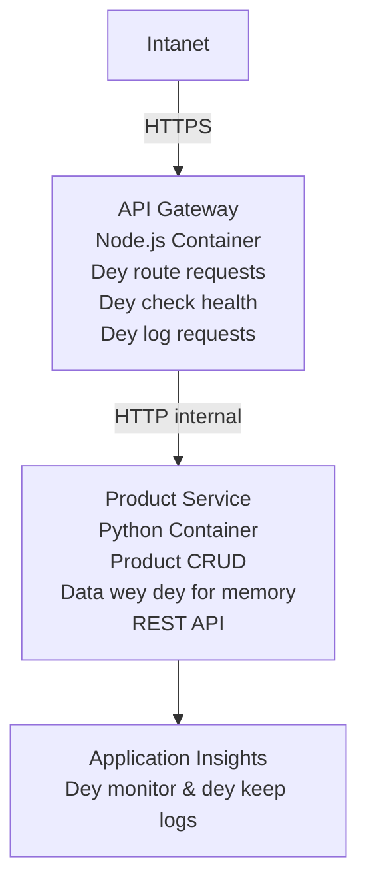

# Microservices Architecture - Container App Example

⏱️ **How Long E Go Tek (Estimated Time)**: 25-35 minutes | 💰 **How Much E Go Cost (Estimated Cost)**: ~$50-100/month | ⭐ **Complexity**: Advanced

Na **simplified but functional** microservices architecture wey dem don deploy for Azure Container Apps using AZD CLI. Dis example dey show how services dey talk to each other, container orchestration, and monitoring with one practical 2-service setup.

> **📚 How You Go Learn**: Dis example dey start with small 2-service architecture (API Gateway + Backend Service) wey you fit really deploy and learn from. After you don sabi dis foundation, we go give guidance on how to expand am to full microservices ecosystem.

## Wetin You Go Learn

If you finish dis example, you go:
- Deploy multiple containers to Azure Container Apps
- Implement service-to-service communication with internal networking
- Configure environment-based scaling and health checks
- Monitor distributed applications with Application Insights
- Understand microservices deployment patterns and best practices
- Learn how to grow from simple to complex architectures step-by-step

## Architecture

### Phase 1: Wetin We Dey Build (Included in This Example)


**Why Start Simple?**
- ✅ Deploy and understand quick (25-35 minutes)
- ✅ Learn core microservices patterns without wahala
- ✅ Working code wey you fit modify and experiment with
- ✅ Cheap for learning (~$50-100/month vs $300-1400/month)
- ✅ Build confidence before you add databases and message queues

**Analogy**: Think am like learning to drive. You go start for empty parking lot (2 services), master the basics, then enter city traffic (5+ services with databases).

### Phase 2: Future Expansion (Reference Architecture)

Once you don master the 2-service architecture, you fit expand to:

```
Full Architecture (Not Included - For Reference)
├── API Gateway (✅ Included)
├── Product Service (✅ Included)
├── Order Service (🔜 Add next)
├── User Service (🔜 Add next)
├── Notification Service (🔜 Add last)
├── Azure Service Bus (🔜 For async communication)
├── Cosmos DB (🔜 For product persistence)
├── Azure SQL (🔜 For order management)
└── Azure Storage (🔜 For file storage)
```

See "Expansion Guide" section for step-by-step instructions for the next moves.

## Features Included

✅ **Service Discovery**: Automatic DNS-based discovery between containers  
✅ **Load Balancing**: Built-in load balancing across replicas  
✅ **Auto-scaling**: Each service fit scale on im own based on HTTP requests  
✅ **Health Monitoring**: Liveness and readiness probes for both services  
✅ **Distributed Logging**: Centralized logging with Application Insights  
✅ **Internal Networking**: Secure service-to-service communication  
✅ **Container Orchestration**: Automatic deployment and scaling  
✅ **Zero-Downtime Updates**: Rolling updates with revision management  

## Prerequisites

### Required Tools

Before you start, make sure say you get these tools installed:

1. **[Azure Developer CLI (azd)](https://learn.microsoft.com/azure/developer/azure-developer-cli/install-azd)** (version 1.0.0 or higher)
   ```bash
   azd version
   # Wetin we dey expect make e show: azd version 1.0.0 wey pass dat
   ```

2. **[Azure CLI](https://learn.microsoft.com/cli/azure/install-azure-cli)** (version 2.50.0 or higher)
   ```bash
   az --version
   # Wetin suppose show: azure-cli 2.50.0 or pass
   ```

3. **[Docker](https://www.docker.com/get-started)** (for local development/testing - optional)
   ```bash
   docker --version
   # Wetin we expect make e show: Docker version 20.10 wey pass
   ```

### Azure Requirements

- Active **Azure subscription** ([create a free account](https://azure.microsoft.com/free/))
- Permissions to create resources for your subscription
- **Contributor** role on the subscription or resource group

### Knowledge Prerequisites

Dis one na **advanced-level** example. You suppose get:
- Completed the [Simple Flask API example](../../../../../examples/container-app/simple-flask-api) 
- Basic understanding of microservices architecture
- Familiarity with REST APIs and HTTP
- Understanding of container concepts

**New to Container Apps?** Start with the [Simple Flask API example](../../../../../examples/container-app/simple-flask-api) first to learn the basics.

## Quick Start (Step-by-Step)

### Step 1: Clone and Navigate

```bash
git clone https://github.com/microsoft/AZD-for-beginners.git
cd AZD-for-beginners/examples/container-app/microservices
```

**✓ Success Check**: Make sure you see `azure.yaml`:
```bash
ls
# We dey expect: README.md, azure.yaml, infra/, src/
```

### Step 2: Authenticate with Azure

```bash
azd auth login
```

This one go open your browser make you sign in to Azure. Use your Azure credentials to sign in.

**✓ Success Check**: You suppose see:
```
Logged in to Azure.
```

### Step 3: Initialize the Environment

```bash
azd init
```

**Prompts wey you go see**:
- **Environment name**: Put one short name (e.g., `microservices-dev`)
- **Azure subscription**: Choose your subscription
- **Azure location**: Choose region (e.g., `eastus`, `westeurope`)

**✓ Success Check**: You suppose see:
```
SUCCESS: New project initialized!
```

### Step 4: Deploy Infrastructure and Services

```bash
azd up
```

**Wetin go happen** (e go take 8-12 minutes):
1. E go create Container Apps environment
2. E go create Application Insights for monitoring
3. E go build API Gateway container (Node.js)
4. E go build Product Service container (Python)
5. E go deploy both containers to Azure
6. E go configure networking and health checks
7. E go setup monitoring and logging

**✓ Success Check**: You suppose see:
```
SUCCESS: Your application was deployed to Azure in X minutes Y seconds.
Endpoint: https://api-gateway-<unique-id>.azurecontainerapps.io
```

**⏱️ Time**: 8-12 minutes

### Step 5: Test the Deployment

```bash
# Get di gateway endpoint
GATEWAY_URL=$(azd env get-values | grep API_GATEWAY_URL | cut -d '=' -f2 | tr -d '"')

# Check if di API Gateway dey healthy
curl $GATEWAY_URL/health

# Wetin we expect for output:
# {"status":"dey healthy","service":"api-gateway","timestamp":"2025-11-19T10:30:00Z"}
```

**Test product service through gateway**:
```bash
# List product dem
curl $GATEWAY_URL/api/products

# Wetin suppose comot:
# [
#   {"id":1,"name":"Laptop","price":999.99,"stock":50},
#   {"id":2,"name":"Mouse","price":29.99,"stock":200},
#   {"id":3,"name":"Keyboard","price":79.99,"stock":150}
# ]
```

**✓ Success Check**: Both endpoints go return JSON data without errors.

---

**🎉 Congrats!** You don deploy microservices architecture for Azure!

## Project Structure

All implementation files dey included—dis na complete, working example:

```
microservices/
│
├── README.md                         # This file
├── azure.yaml                        # AZD configuration
├── .gitignore                        # Git ignore patterns
│
├── infra/                           # Infrastructure as Code (Bicep)
│   ├── main.bicep                   # Main orchestration
│   ├── abbreviations.json           # Naming conventions
│   ├── core/                        # Shared infrastructure
│   │   ├── container-apps-environment.bicep  # Container environment + registry
│   │   └── monitor.bicep            # Application Insights + Log Analytics
│   └── app/                         # Service definitions
│       ├── api-gateway.bicep        # API Gateway container app
│       └── product-service.bicep    # Product Service container app
│
└── src/                             # Application source code
    ├── api-gateway/                 # Node.js API Gateway
    │   ├── app.js                   # Express server with routing
    │   ├── package.json             # Node dependencies
    │   └── Dockerfile               # Container definition
    └── product-service/             # Python Product Service
        ├── main.py                  # Flask API with product data
        ├── requirements.txt         # Python dependencies
        └── Dockerfile               # Container definition
```

**Wetin Each Component Dey Do:**

**Infrastructure (infra/)**:
- `main.bicep`: Orchestrates all Azure resources and their dependencies
- `core/container-apps-environment.bicep`: Creates the Container Apps environment and Azure Container Registry
- `core/monitor.bicep`: Sets up Application Insights for distributed logging
- `app/*.bicep`: Individual container app definitions with scaling and health checks

**API Gateway (src/api-gateway/)**:
- Public-facing service wey dey route requests to backend services
- Implements logging, error handling, and request forwarding
- Shows service-to-service HTTP communication

**Product Service (src/product-service/)**:
- Internal service wey get product catalog (in-memory to keep am simple)
- REST API with health checks
- Example of backend microservice pattern

## Services Overview

### API Gateway (Node.js/Express)

**Port**: 8080  
**Access**: Public (external ingress)  
**Purpose**: E dey route incoming requests to the correct backend services  

**Endpoints**:
- `GET /` - Service information
- `GET /health` - Health check endpoint
- `GET /api/products` - Forward to product service (list all)
- `GET /api/products/:id` - Forward to product service (get by ID)

**Key Features**:
- Request routing with axios
- Centralized logging
- Error handling and timeout management
- Service discovery via environment variables
- Application Insights integration

**Code Highlight** (`src/api-gateway/app.js`):
```javascript
// Inside di service communication
app.get('/api/products', async (req, res) => {
  const response = await axios.get(`${PRODUCT_SERVICE_URL}/products`);
  res.json(response.data);
});
```

### Product Service (Python/Flask)

**Port**: 8000  
**Access**: Internal only (no external ingress)  
**Purpose**: E dey manage product catalog with in-memory data  

**Endpoints**:
- `GET /` - Service information
- `GET /health` - Health check endpoint
- `GET /products` - List all products
- `GET /products/<id>` - Get product by ID

**Key Features**:
- RESTful API with Flask
- In-memory product store (simple, no database needed)
- Health monitoring with probes
- Structured logging
- Application Insights integration

**Data Model**:
```python
{
  "id": 1,
  "name": "Laptop",
  "description": "High-performance laptop",
  "price": 999.99,
  "stock": 50
}
```

**Why Internal Only?**
Product service no dey exposed to public. All requests must pass through API Gateway, wey dey give:
- Security: Controlled access point
- Flexibility: You fit change backend without disturbing clients
- Monitoring: Centralized request logging

## Understanding Service Communication

### How Services Dey Talk to Each Other

For this example, the API Gateway dey talk to Product Service using **internal HTTP calls**:

```javascript
// API Gateway (src/api-gateway/app.js)
const PRODUCT_SERVICE_URL = process.env.PRODUCT_SERVICE_URL;

// Send HTTP request wey dey inside
const response = await axios.get(`${PRODUCT_SERVICE_URL}/products`);
```

**Key Points**:

1. **DNS-Based Discovery**: Container Apps dey automatically provide DNS for internal services
   - Product Service FQDN: `product-service.internal.<environment>.azurecontainerapps.io`
   - Simplified as: `http://product-service` (Container Apps go resolve am)

2. **No Public Exposure**: Product Service get `external: false` for Bicep
   - E dey accessible only inside the Container Apps environment
   - Internet no fit reach am directly

3. **Environment Variables**: Service URLs dem inject at deployment time
   - Bicep dey pass the internal FQDN to the gateway
   - No hardcoded URLs for application code

**Analogy**: Think am like office rooms. API Gateway na reception desk (public-facing), and Product Service na office room (internal only). Visitors must go through reception to enter any office.

## Deployment Options

### Full Deployment (Recommended)

```bash
# Set up di infrastructure an di two services
azd up
```

Dis one deploys:
1. Container Apps environment
2. Application Insights
3. Container Registry
4. API Gateway container
5. Product Service container

**Time**: 8-12 minutes

### Deploy Individual Service

```bash
# Deploy only one service (after you don run azd up)
azd deploy api-gateway

# Or you fit deploy di product service
azd deploy product-service
```

**Use Case**: If you don update code for one service and you wan redeploy only that service.

### Update Configuration

```bash
# Change di scaling parameters
azd env set GATEWAY_MAX_REPLICAS 30

# Redeploy wit di new configuration
azd up
```

## Configuration

### Scaling Configuration

Both services configure HTTP-based autoscaling inside their Bicep files:

**API Gateway**:
- Min replicas: 2 (always at least 2 for availability)
- Max replicas: 20
- Scale trigger: 50 concurrent requests per replica

**Product Service**:
- Min replicas: 1 (fit scale to zero if needed)
- Max replicas: 10
- Scale trigger: 100 concurrent requests per replica

**Customize Scaling** (in `infra/app/*.bicep`):
```bicep
scale: {
  minReplicas: 1
  maxReplicas: 10
  rules: [
    {
      name: 'http-scale-rule'
      http: {
        metadata: {
          concurrentRequests: '100'  // Adjust this
        }
      }
    }
  ]
}
```

### Resource Allocation

**API Gateway**:
- CPU: 1.0 vCPU
- Memory: 2 GiB
- Reason: E dey handle all external traffic

**Product Service**:
- CPU: 0.5 vCPU
- Memory: 1 GiB
- Reason: Lightweight in-memory operations

### Health Checks

Both services get liveness and readiness probes:

```bicep
probes: [
  {
    type: 'Liveness'
    httpGet: {
      path: '/health'
      port: 8080
    }
    initialDelaySeconds: 10
    periodSeconds: 30
  }
  {
    type: 'Readiness'
    httpGet: {
      path: '/health'
      port: 8080
    }
    initialDelaySeconds: 5
    periodSeconds: 10
  }
]
```

**Wetin Dis Mean**:
- **Liveness**: If health check fail, Container Apps go restart the container
- **Readiness**: If not ready, Container Apps go stop routing traffic to that replica


## Monitoring & Observability

### View Service Logs

```bash
# Use azd monitor make you fit see logs
azd monitor --logs

# Or use Azure CLI for di specific Container Apps:
# Stream logs from di API Gateway
az containerapp logs show --name api-gateway --resource-group $RG_NAME --follow

# See di recent product service logs
az containerapp logs show --name product-service --resource-group $RG_NAME --tail 100
```

**Expected Output**:
```
[api-gateway] API Gateway listening on port 8080
[api-gateway] Product Service URL: http://product-service
[api-gateway] GET /api/products 200 - 45ms
[product-service] Retrieved 5 products
```

### Application Insights Queries

Open Application Insights for the app inside Azure Portal, then run these queries:

**Find Slow Requests**:
```kusto
requests
| where timestamp > ago(1h)
| where duration > 1000  // Requests taking >1 second
| summarize count() by name, cloud_RoleName
| order by count_ desc
```

**Track Service-to-Service Calls**:
```kusto
dependencies
| where timestamp > ago(1h)
| where type == "Http"
| project timestamp, name, target, duration, success
| order by timestamp desc
```

**Error Rate by Service**:
```kusto
exceptions
| where timestamp > ago(24h)
| summarize errorCount = count() by cloud_RoleName, type
| order by errorCount desc
```

**Request Volume Over Time**:
```kusto
requests
| where timestamp > ago(1h)
| summarize requestCount = count() by bin(timestamp, 5m), cloud_RoleName
| render timechart
```

### Access Monitoring Dashboard

```bash
# Get di Application Insights details
azd env get-values | grep APPLICATIONINSIGHTS

# Open di Azure Portal monitoring
az monitor app-insights component show \
  --app $(azd env get-values | grep APPLICATIONINSIGHTS_CONNECTION_STRING | cut -d '=' -f2) \
  --resource-group $(azd env get-values | grep AZURE_RESOURCE_GROUP | cut -d '=' -f2) \
  --query "appId" -o tsv
```

### Live Metrics

1. Go to Application Insights inside Azure Portal
2. Click "Live Metrics"
3. You go see real-time requests, failures, and performance
4. Test by running: `curl $(azd env get-values | grep API_GATEWAY_URL | cut -d '=' -f2 | tr -d '"')/api/products`

## Practical Exercises

[Note: See full exercises above in the "Practical Exercises" section for detailed step-by-step exercises including deployment verification, data modification, autoscaling tests, error handling, and adding a third service.]

## Cost Analysis

### Estimated Monthly Costs (For This 2-Service Example)

| Resource | Configuration | Estimated Cost |
|----------|--------------|----------------|
| API Gateway | 2-20 replicas, 1 vCPU, 2GB RAM | $30-150 |
| Product Service | 1-10 replicas, 0.5 vCPU, 1GB RAM | $15-75 |
| Container Registry | Basic tier | $5 |
| Application Insights | 1-2 GB/month | $5-10 |
| Log Analytics | 1 GB/month | $3 |
| **Total** | | **$58-243/month** |

**Cost Breakdown by Usage**:
- **Light traffic** (testing/learning): ~$60/month
- **Moderate traffic** (small production): ~$120/month
- **High traffic** (busy periods): ~$240/month

### Cost Optimization Tips

1. **Scale to Zero for Development**:
   ```bicep
   scale: {
     minReplicas: 0  // Save $30-40/month when not in use
     maxReplicas: 10
   }
   ```

2. **Use Consumption Plan for Cosmos DB** (when you add it):
   - Pay only for wetin you use
   - No minimum charge

3. **Set Application Insights Sampling**:
   ```javascript
   appInsights.defaultClient.config.samplingPercentage = 50; // Take 50% of di requests
   ```

4. **Clean Up When Not Needed**:
   ```bash
   azd down
   ```

### Free Tier Options

For learning/testing, consider:
- Use Azure free credits (di first 30 days)
- Keep replicas to di minimum
- Delete afta you don test (no ongoing charges)

---

## Cleanup

Make sure say you no go dey pay ongoing charges, delete all resources:

```bash
azd down --force --purge
```

**Confirmation Prompt**:
```
? Total resources to delete: 6, are you sure you want to continue? (y/N)
```

Type `y` to confirm.

**Wetin Go Dey Delete**:
- Container Apps Environment
- Both Container Apps (gateway & product service)
- Container Registry
- Application Insights
- Log Analytics Workspace
- Resource Group

**✓ Verify Cleanup**:
```bash
az group list --query "[?starts_with(name,'rg-microservices')]" --output table
```

E suppose return empty.

---

## Expansion Guide: From 2 to 5+ Services

Once you don sabi dis 2-service architecture, dis na how to expand:

### Phase 1: Add Database Persistence (Next Step)

**Add Cosmos DB for Product Service**:

1. Create `infra/core/cosmos.bicep`:
   ```bicep
   resource cosmosAccount 'Microsoft.DocumentDB/databaseAccounts@2023-04-15' = {
     name: name
     location: location
     kind: 'GlobalDocumentDB'
     properties: {
       databaseAccountOfferType: 'Standard'
       locations: [{ locationName: location, failoverPriority: 0 }]
     }
   }
   ```

2. Update product service make e use Cosmos DB instead of in-memory data

3. Estimated additional cost: ~$25/month (serverless)

### Phase 2: Add Third Service (Order Management)

**Create Order Service**:

1. New folder: `src/order-service/` (Python/Node.js/C#)
2. New Bicep: `infra/app/order-service.bicep`
3. Update API Gateway to route `/api/orders`
4. Add Azure SQL Database for order persistence

**Architecture becomes**:
```
API Gateway → Product Service (Cosmos DB)
           → Order Service (Azure SQL)
```

### Phase 3: Add Async Communication (Service Bus)

**Implement Event-Driven Architecture**:

1. Add Azure Service Bus: `infra/core/servicebus.bicep`
2. Product Service go publish "ProductCreated" events
3. Order Service go subscribe to product events
4. Add Notification Service to process events

**Pattern**: Request/Response (HTTP) + Event-Driven (Service Bus)

### Phase 4: Add User Authentication

**Implement User Service**:

1. Create `src/user-service/` (Go/Node.js)
2. Add Azure AD B2C or custom JWT authentication
3. API Gateway go validate tokens
4. Services go check user permissions

### Phase 5: Production Readiness

**Add These Components**:
- Azure Front Door (global load balancing)
- Azure Key Vault (secret management)
- Azure Monitor Workbooks (custom dashboards)
- CI/CD Pipeline (GitHub Actions)
- Blue-Green Deployments
- Managed Identity for all services

**Full Production Architecture Cost**: ~$300-1,400/month

---

## Learn More

### Related Documentation
- [Azure Container Apps Documentation](https://learn.microsoft.com/azure/container-apps/)
- [Microservices Architecture Guide](https://learn.microsoft.com/azure/architecture/guide/architecture-styles/microservices)
- [Application Insights for Distributed Tracing](https://learn.microsoft.com/azure/azure-monitor/app/distributed-tracing)
- [Azure Developer CLI Documentation](https://learn.microsoft.com/azure/developer/azure-developer-cli/)

### Next Steps in This Course
- ← Previous: [Simple Flask API](../../../../../examples/container-app/simple-flask-api) - Beginner single-container example
- → Next: [AI Integration Guide](../../../../../examples/docs/ai-foundry) - Add AI capabilities
- 🏠 [Course Home](../../README.md)

### Comparison: When to Use What

**Single Container App** (Simple Flask API example):
- ✅ Simple applications
- ✅ Monolithic architecture
- ✅ Fast to deploy
- ❌ Limited scalability
- **Cost**: ~$15-50/month

**Microservices** (This example):
- ✅ For complex applications
- ✅ Independent scaling per service
- ✅ Team autonomy (different services, different teams)
- ❌ More complex to manage
- **Cost**: ~$60-250/month

**Kubernetes (AKS)**:
- ✅ Maximum control and flexibility
- ✅ Multi-cloud portability
- ✅ Advanced networking
- ❌ Requires Kubernetes expertise
- **Cost**: ~$150-500/month minimum

**Recommendation**: Start with Container Apps (dis example), move to AKS only if you need Kubernetes-specific features.

---

## Frequently Asked Questions

**Q: Why only 2 services instead of 5+?**  
A: Educational progression. Make you master di fundamentals (service communication, monitoring, scaling) with a simple example before you add more complexity. Di patterns wey you learn here go still apply for 100-service architectures.

**Q: Can I add more services myself?**  
A: Sure! Follow di expansion guide above. Each new service go follow di same pattern: create src folder, create Bicep file, update azure.yaml, deploy.

**Q: Is this production-ready?**  
A: E good as foundation. For production, add: managed identity, Key Vault, persistent databases, CI/CD pipeline, monitoring alerts, and backup strategy.

**Q: Why not use Dapr or other service mesh?**  
A: Keep am simple for learning. Once you sabi native Container Apps networking, you fit add Dapr for advanced scenarios.

**Q: How do I debug locally?**  
A: Run services locally with Docker:
```bash
cd src/api-gateway
docker build -t local-gateway .
docker run -p 8080:8080 -e PRODUCT_SERVICE_URL=http://localhost:8000 local-gateway
```

**Q: Can I use different programming languages?**  
A: Yes! Dis example show Node.js (gateway) + Python (product service). You fit mix any languages wey fit run in containers.

**Q: What if I don't have Azure credits?**  
A: Use Azure free tier (di first 30 days with new accounts) or deploy for short testing periods and delete immediately.

---

> **🎓 Learning Path Summary**: You don learn how to deploy multi-service architecture with automatic scaling, internal networking, centralized monitoring, and production-ready patterns. Dis foundation go prepare you for complex distributed systems and enterprise microservices architectures.

**📚 Course Navigation:**
- ← Previous: [Simple Flask API](../../../../../examples/container-app/simple-flask-api)
- → Next: [Database Integration Example](../../../../../examples/database-app)
- 🏠 [Course Home](../../../README.md)
- 📖 [Container Apps Best Practices](../../../docs/chapter-04-infrastructure/deployment-guide.md)

---

<!-- CO-OP TRANSLATOR DISCLAIMER START -->
Disclaimer:
Dis dokument don translate wit AI translation service Co-op Translator (https://github.com/Azure/co-op-translator). Even tho we dey try make am correct, abeg sabi say machine translation fit get mistake or no pure correct. Di original dokument for im own language na di main, authoritative source. If na serious/important mata, better make una use professional human translator. We no dey responsible for any misunderstanding or wrong interpretation wey fit come from dis translation.
<!-- CO-OP TRANSLATOR DISCLAIMER END -->