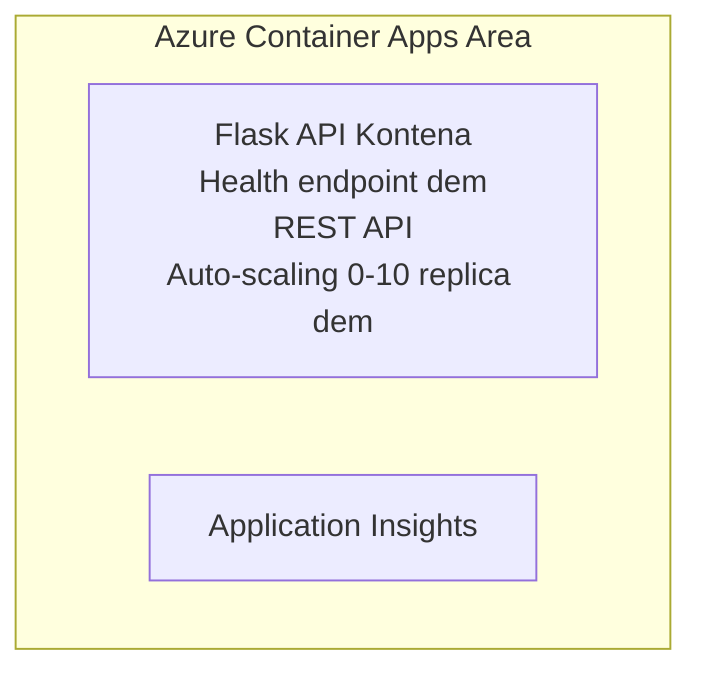

# Simple Flask API - Container App Example

**Learning Path:** Beginner ⭐ | **Time:** 25-35 minutes | **Cost:** $0-15/month

Na complete, dey work Python Flask REST API wey dem don deploy for Azure Container Apps using Azure Developer CLI (azd). Dis example dey show how dem dey deploy container, auto-scaling, and basic monitoring.

## 🎯 Wetin You Go Learn

- How to deploy Python app wey dey inside container go Azure
- How to configure auto-scaling wey fit scale to zero
- How to set health probes and readiness checks
- How to monitor application logs and metrics
- How to use Azure Developer CLI for quick deployment

## 📦 Wetin Dey Included

✅ **Flask Application** - Complete REST API wey get CRUD operations (`src/app.py`)  
✅ **Dockerfile** - Container configuration wey ready for production  
✅ **Bicep Infrastructure** - Container Apps environment and API deployment  
✅ **AZD Configuration** - Setup wey you fit deploy with one command  
✅ **Health Probes** - Liveness and readiness checks don configure  
✅ **Auto-scaling** - 0-10 replicas based on HTTP load  

## Architecture


## Prerequisites

### Wetin Dem Require
- **Azure Developer CLI (azd)** - [Install guide](https://learn.microsoft.com/azure/developer/azure-developer-cli/install-azd)
- **Azure subscription** - [Free account](https://azure.microsoft.com/free/)
- **Docker Desktop** - [Install Docker](https://www.docker.com/products/docker-desktop/) (for local testing)

### How to Verify Say Everything Dey

```bash
# Make sure say azd version dey 1.5.0 or pass
azd version

# Make sure say you don log in to Azure
azd auth login

# Check Docker (optional, if you wan test locally)
docker --version
```

## ⏱️ Deployment Timeline

| Phase | Duration | Wetin Go Happen |
|-------|----------|--------------||
| Environment setup | 30 seconds | Create azd environment |
| Build container | 2-3 minutes | Docker build Flask app |
| Provision infrastructure | 3-5 minutes | Create Container Apps, registry, monitoring |
| Deploy application | 2-3 minutes | Push image and deploy to Container Apps |
| **Total** | **8-12 minutes** | Complete deployment ready |

## Quick Start

```bash
# Go to di example
cd examples/container-app/simple-flask-api

# Set up di environment (pick one unique name)
azd env new myflaskapi

# Deploy everytin (infrastructure + application)
azd up
# Dem go ask you to:
# 1. Choose Azure subscription
# 2. Choose location (e.g., eastus2)
# 3. Wait 8-12 minutes make di deployment finish

# Collect your API endpoint
azd env get-values

# Test di API
curl $(azd env get-value API_ENDPOINT)/health
```

**Wetin you suppose see:**
```json
{
  "status": "healthy",
  "timestamp": "2025-11-19T10:30:00Z",
  "service": "simple-flask-api",
  "version": "1.0.0"
}
```

## ✅ Verify Deployment

### Step 1: Check Deployment Status

```bash
# See di services wey don deploy
azd show

# Wetin expected output go show:
# - Service: api
# - Endpoint: https://ca-api-[env].xxx.azurecontainerapps.io
# - Status: Dey run
```

### Step 2: Test API Endpoints

```bash
# Get di API endpoint
API_URL=$(azd env get-value API_ENDPOINT)

# Check if e dey
curl $API_URL/health

# Check di root endpoint
curl $API_URL/

# Create wan item
curl -X POST $API_URL/api/items \
  -H "Content-Type: application/json" \
  -d '{"name": "Test Item", "description": "My first item"}'

# Get all di items
curl $API_URL/api/items
```

**Success Criteria:**
- ✅ Health endpoint go return HTTP 200
- ✅ Root endpoint go show API information
- ✅ POST go create item and return HTTP 201
- ✅ GET go return the items wey dem create

### Step 3: View Logs

```bash
# Stream live logs wit azd monitor
azd monitor --logs

# Or you fit use Azure CLI:
az containerapp logs show --name api --resource-group $RG_NAME --follow

# You go see:
# - Gunicorn messages wey show as e dey start
# - Logs wey dey show HTTP request dem
# - Logs wey dey show application info
```

## Project Structure

```
simple-flask-api/
├── azure.yaml              # AZD configuration
├── infra/
│   ├── main.bicep         # Main infrastructure
│   ├── main.parameters.json
│   └── app/
│       ├── container-env.bicep
│       └── api.bicep
└── src/
    ├── app.py             # Flask application
    ├── requirements.txt
    └── Dockerfile
```

## API Endpoints

| Endpoint | Method | Description |
|----------|--------|-------------|
| `/health` | GET | Health check |
| `/api/items` | GET | List all items |
| `/api/items` | POST | Create new item |
| `/api/items/{id}` | GET | Get specific item |
| `/api/items/{id}` | PUT | Update item |
| `/api/items/{id}` | DELETE | Delete item |

## Configuration

### Environment Variables

```bash
# Set kustom konfigureshon
azd env set PORT 8000
azd env set LOG_LEVEL info
azd env set MAX_REPLICAS 20
```

### Scaling Configuration

The API go automatically scale based on HTTP traffic:
- **Min Replicas**: 0 (e go scale go zero when idle)
- **Max Replicas**: 10
- **Concurrent Requests per Replica**: 50

## Development

### Run Locally

```bash
# Install di dependencies
cd src
pip install -r requirements.txt

# Run di app
python app.py

# Test am locally
curl http://localhost:8000/health
```

### Build and Test Container

```bash
# Make di Docker image
docker build -t flask-api:local ./src

# Run di container for your computer
docker run -p 8000:8000 flask-api:local

# Test di container
curl http://localhost:8000/health
```

## Deployment

### Full Deployment

```bash
# Deploy di infrastructure an di application
azd up
```

### Code-Only Deployment

```bash
# Deploy only di application code (infrastructure no go change)
azd deploy api
```

### Update Configuration

```bash
# Update di environment variables
azd env set API_KEY "new-api-key"

# Redeploy wit di new configuration
azd deploy api
```

## Monitoring

### View Logs

```bash
# Stream di live logs wit azd monitor
azd monitor --logs

# Or you fit use Azure CLI for Container Apps:
az containerapp logs show --name api --resource-group $RG_NAME --follow

# See di last 100 lines
az containerapp logs show --name api --resource-group $RG_NAME --tail 100
```

### Monitor Metrics

```bash
# Open di Azure Monitor dashboard
azd monitor --overview

# See di specific metrics
az monitor metrics list \
  --resource $(azd show --output json | jq -r '.services.api.resourceId') \
  --metric "Requests,ResponseTime"
```

## Testing

### Health Check

```bash
curl $(azd show --output json | jq -r '.services.api.endpoint')/health
```

Expected response:
```json
{
  "status": "healthy",
  "timestamp": "2025-11-19T10:30:00Z"
}
```

### Create Item

```bash
curl -X POST $(azd show --output json | jq -r '.services.api.endpoint')/api/items \
  -H "Content-Type: application/json" \
  -d '{"name": "Test Item", "description": "A test item"}'
```

### Get All Items

```bash
curl $(azd show --output json | jq -r '.services.api.endpoint')/api/items
```

## Cost Optimization

This deployment use scale-to-zero, so you go dey pay only when the API dey process requests:

- **Idle cost**: ~$0/month (scaled to zero)
- **Active cost**: ~$0.000024/second per replica
- **Expected monthly cost** (light usage): $5-15

### Reduce Costs Further

```bash
# Make di max replicas small for dev
azd env set MAX_REPLICAS 3

# Use shorta idle timeout
azd env set SCALE_TO_ZERO_TIMEOUT 300  # 5 minutes
```

## Troubleshooting

### Container Won't Start

```bash
# Use Azure CLI check di container logs
az containerapp logs show --name api --resource-group $RG_NAME --tail 100

# Check say Docker image dey build for local machine
docker build -t test ./src
```

### API Not Accessible

```bash
# Confirm say ingress dey external
az containerapp show --name api --resource-group rg-simple-flask-api \
  --query properties.configuration.ingress.external
```

### High Response Times

```bash
# Check how CPU/Memory dey used
az monitor metrics list \
  --resource $(azd show --output json | jq -r '.services.api.resourceId') \
  --metric "CPUPercentage,MemoryPercentage"

# Add more resources if e need am
az containerapp update --name api --resource-group rg-simple-flask-api \
  --cpu 1.0 --memory 2Gi
```

## Clean Up

```bash
# Comot all di resources
azd down --force --purge
```

## Next Steps

### Expand This Example

1. **Add Database** - Integrate Azure Cosmos DB or SQL Database
   ```bash
   # Put Cosmos DB module for infra/main.bicep
   # Update app.py make e connect to database
   ```

2. **Add Authentication** - Implement Azure AD or API keys
   ```python
   # Put authentication middleware for app.py
   from functools import wraps
   ```

3. **Set Up CI/CD** - GitHub Actions workflow
   ```yaml
   # Create .github/workflows/deploy.yml
   name: Deploy to Azure
   on: [push]
   ```

4. **Add Managed Identity** - Secure access to Azure services
   ```bicep
   # Update infra/app/api.bicep
   identity: { type: 'SystemAssigned' }
   ```

### Related Examples

- **[Database App](../../../../../examples/database-app)** - Complete example wey get SQL Database
- **[Microservices](../../../../../examples/container-app/microservices)** - Architecture wey get multiple services
- **[Container Apps Master Guide](../README.md)** - All container patterns

### Learning Resources

- 📚 [AZD For Beginners Course](../../../README.md) - Main course home
- 📚 [Container Apps Patterns](../README.md) - More deployment patterns
- 📚 [AZD Templates Gallery](https://azure.github.io/awesome-azd/) - Community templates

## Additional Resources

### Documentation
- **[Flask Documentation](https://flask.palletsprojects.com/)** - Guide for the Flask framework
- **[Azure Container Apps](https://learn.microsoft.com/azure/container-apps/)** - Official Azure docs
- **[Azure Developer CLI](https://learn.microsoft.com/azure/developer/azure-developer-cli/)** - azd command reference

### Tutorials
- **[Container Apps Quickstart](https://learn.microsoft.com/azure/container-apps/quickstart-portal)** - Deploy your first app
- **[Python on Azure](https://learn.microsoft.com/azure/developer/python/)** - Python development guide
- **[Bicep Language](https://learn.microsoft.com/azure/azure-resource-manager/bicep/)** - Infrastructure as code

### Tools
- **[Azure Portal](https://portal.azure.com)** - Manage resources visually
- **[VS Code Azure Extension](https://marketplace.visualstudio.com/items?itemName=ms-azuretools.vscode-azurecontainerapps)** - IDE integration

---

**🎉 Congratulations!** You don deploy production-ready Flask API go Azure Container Apps wey get auto-scaling and monitoring.

**Questions?** [Open an issue](https://github.com/microsoft/AZD-for-beginners/issues) abi check the [FAQ](../../../resources/faq.md)

---

<!-- CO-OP TRANSLATOR DISCLAIMER START -->
Abeg read (Disclaimer):
Dis dokument don translate wit AI translation service (Co-op Translator: https://github.com/Azure/co-op-translator). Even though we dey try make am correct, abeg sabi say machine translations fit get mistakes or no too correct. Di original dokument for dia original language na di correct/official source. If na serious matter, make you use professional human translator. We no go responsible for any wrong understanding or wrong interpretation wey fit come from dis translation.
<!-- CO-OP TRANSLATOR DISCLAIMER END -->