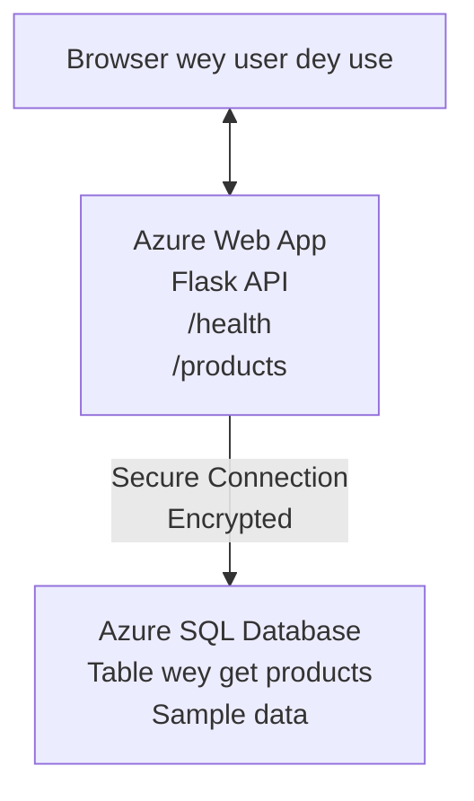

# How to deploy Microsoft SQL Database and Web App wit AZD

⏱️ **Taim wey e go take**: 20-30 minutes | 💰 **Cost wey e go cost**: ~$15-25/month | ⭐ **How e hard**: Medium

Dis **complete, working example** dey show how to use the [Azure Developer CLI (azd)](https://learn.microsoft.com/azure/developer/azure-developer-cli/) to deploy one Python Flask web application wit Microsoft SQL Database go Azure. All code dey included and tested—no external dependencies needed.

## Wetin You Go Learn

By complete dis example, you go:
- Deploy one multi-tier application (web app + database) using infrastructure-as-code
- Set up secure database connections wey no hardcode secrets
- Monitor application health wit Application Insights
- Manage Azure resources well wit AZD CLI
- Follow Azure best practices for security, cost optimization, and observability

## Scenario Overview
- **Web App**: Python Flask REST API wit database connectivity
- **Database**: Azure SQL Database wit sample data
- **Infrastructure**: Provisioned using Bicep (modular, reusable templates)
- **Deployment**: Fully automated wit `azd` commands
- **Monitoring**: Application Insights for logs and telemetry

## Prerequisites

### Required Tools

Before you start, make sure say you don install these tools:

1. **[Azure CLI](https://learn.microsoft.com/cli/azure/install-azure-cli)** (version 2.50.0 or higher)
   ```sh
   az --version
   # Wetin suppose show: azure-cli 2.50.0 or anything wey higher
   ```

2. **[Azure Developer CLI (azd)](https://learn.microsoft.com/azure/developer/azure-developer-cli/install-azd)** (version 1.0.0 or higher)
   ```sh
   azd version
   # Wetin suppose show: azd version 1.0.0 or pass
   ```

3. **[Python 3.8+](https://www.python.org/downloads/)** (for local development)
   ```sh
   python --version
   # Wetin we dey expect for output: Python 3.8 or pass
   ```

4. **[Docker](https://www.docker.com/get-started)** (optional, for local container development)
   ```sh
   docker --version
   # Wetin suppose show: Docker version 20.10 or pass
   ```

### Azure Requirements

- An active **Azure subscription** ([create a free account](https://azure.microsoft.com/free/))
- Permission to create resources for your subscription
- **Owner** or **Contributor** role on the subscription or resource group

### Knowledge Prerequisites

Dis na an **intermediate-level** example. You suppose sabi:
- Basic command-line operations
- Fundamental cloud concepts (resources, resource groups)
- Basic understanding of web applications and databases

**New to AZD?** Start with the [Getting Started guide](../../docs/chapter-01-foundation/azd-basics.md) first.

## Architecture

Dis example go deploy two-tier architecture wey get web application and SQL database:



**Resource Deployment:**
- **Resource Group**: Container for all resources
- **App Service Plan**: Linux-based hosting (B1 tier for cost efficiency)
- **Web App**: Python 3.11 runtime with Flask application
- **SQL Server**: Managed database server with TLS 1.2 minimum
- **SQL Database**: Basic tier (2GB, suitable for development/testing)
- **Application Insights**: Monitoring and logging
- **Log Analytics Workspace**: Centralized log storage

**Analogy**: Make you think am like one restaurant (web app) wey get one walk-in freezer (database). Customers order from the menu (API endpoints), and the kitchen (Flask app) go carry ingredients (data) from the freezer. The restaurant manager (Application Insights) dey track everything wey dey happen.

## Folder Structure

All files dey inside dis example—no external dependencies required:

```
examples/database-app/
│
├── README.md                    # This file
├── azure.yaml                   # AZD configuration file
├── .env.sample                  # Sample environment variables
├── .gitignore                   # Git ignore patterns
│
├── infra/                       # Infrastructure as Code (Bicep)
│   ├── main.bicep              # Main orchestration template
│   ├── abbreviations.json      # Azure naming conventions
│   └── resources/              # Modular resource templates
│       ├── sql-server.bicep    # SQL Server configuration
│       ├── sql-database.bicep  # Database configuration
│       ├── app-service-plan.bicep  # Hosting plan
│       ├── app-insights.bicep  # Monitoring setup
│       └── web-app.bicep       # Web application
│
└── src/
    └── web/                    # Application source code
        ├── app.py              # Flask REST API
        ├── requirements.txt    # Python dependencies
        └── Dockerfile          # Container definition
```

**Wetin Each File Dey Do:**
- **azure.yaml**: Tell AZD wetin to deploy and where
- **infra/main.bicep**: Orchestrate all Azure resources
- **infra/resources/*.bicep**: Individual resource definitions (modular for reuse)
- **src/web/app.py**: Flask application with database logic
- **requirements.txt**: Python package dependencies
- **Dockerfile**: Containerization instructions for deployment

## Quickstart (Step-by-Step)

### Step 1: Clone and Navigate

```sh
git clone https://github.com/microsoft/AZD-for-beginners.git
cd AZD-for-beginners/examples/database-app
```

**✓ Success Check**: Make sure you fit see `azure.yaml` and `infra/` folder:
```sh
ls
# Wetin dem expect: README.md, azure.yaml, infra/, src/
```

### Step 2: Authenticate with Azure

```sh
azd auth login
```

This go open your browser for Azure authentication. Sign in with your Azure credentials.

**✓ Success Check**: You go see:
```
Logged in to Azure.
```

### Step 3: Initialize the Environment

```sh
azd init
```

**What happens**: AZD go create a local configuration for your deployment.

**Prompts wey you go see**:
- **Environment name**: Enter a short name (e.g., `dev`, `myapp`)
- **Azure subscription**: Select your subscription from the list
- **Azure location**: Choose a region (e.g., `eastus`, `westeurope`)

**✓ Success Check**: You go see:
```
SUCCESS: New project initialized!
```

### Step 4: Provision Azure Resources

```sh
azd provision
```

**What happens**: AZD go deploy all infrastructure (go take 5-8 minutes):
1. E go create resource group
2. E go create SQL Server and Database
3. E go create App Service Plan
4. E go create Web App
5. E go create Application Insights
6. E go configure networking and security

**Them go ask you for**:
- **SQL admin username**: Enter a username (e.g., `sqladmin`)
- **SQL admin password**: Enter a strong password (save am!)

**✓ Success Check**: You go see:
```
SUCCESS: Your application was provisioned in Azure in X minutes Y seconds.
You can view the resources created under the resource group rg-<env-name> in Azure Portal:
https://portal.azure.com/#@/resource/subscriptions/.../resourceGroups/rg-<env-name>
```

**⏱️ Taim**: 5-8 minutes

### Step 5: Deploy the Application

```sh
azd deploy
```

**What happens**: AZD go build and deploy your Flask application:
1. E go package the Python application
2. E go build the Docker container
3. E go push to Azure Web App
4. E go initialize the database with sample data
5. E go start the application

**✓ Success Check**: You go see:
```
SUCCESS: Your application was deployed to Azure in X minutes Y seconds.
You can view the resources created under the resource group rg-<env-name> in Azure Portal:
https://portal.azure.com/#@/resource/subscriptions/.../resourceGroups/rg-<env-name>
```

**⏱️ Taim**: 3-5 minutes

### Step 6: Browse the Application

```sh
azd browse
```

This go open your deployed web app for the browser at `https://app-<unique-id>.azurewebsites.net`

**✓ Success Check**: You go see JSON output:
```json
{
  "message": "Welcome to the Database App API",
  "endpoints": {
    "/": "This help message",
    "/health": "Health check endpoint",
    "/products": "List all products",
    "/products/<id>": "Get product by ID"
  }
}
```

### Step 7: Test the API Endpoints

**Health Check** (check database connection):
```sh
curl https://app-<your-id>.azurewebsites.net/health
```

**Wetin you suppose see**:
```json
{
  "status": "healthy",
  "database": "connected"
}
```

**List Products** (sample data):
```sh
curl https://app-<your-id>.azurewebsites.net/products
```

**Wetin you suppose see**:
```json
[
  {
    "id": 1,
    "name": "Laptop",
    "description": "High-performance laptop",
    "price": 1299.99,
    "created_at": "2025-11-19T10:30:00"
  },
  ...
]
```

**Get Single Product**:
```sh
curl https://app-<your-id>.azurewebsites.net/products/1
```

**✓ Success Check**: All endpoints go return JSON data without errors.

---

**🎉 Congratulations!** You don successfully deploy web application wit database to Azure using AZD.

## Configuration Deep-Dive

### Environment Variables

Secrets dey managed securely via Azure App Service configuration—**no ever hardcode am inside source code**.

**Configured Automatically by AZD**:
- `SQL_CONNECTION_STRING`: Database connection wey credentials don encrypt
- `APPLICATIONINSIGHTS_CONNECTION_STRING`: Monitoring telemetry endpoint
- `SCM_DO_BUILD_DURING_DEPLOYMENT`: Enables automatic dependency installation

**Where dem dey store secrets**:
1. During `azd provision`, you go provide SQL credentials via secure prompts
2. AZD go store these for your local `.azure/<env-name>/.env` file (git-ignored)
3. AZD go inject them into Azure App Service configuration (encrypted at rest)
4. Application go read them via `os.getenv()` at runtime

### Local Development

For local testing, create a `.env` file from the sample:

```sh
cp .env.sample .env
# Change .env, put your local database connection inside
```

**How local development dey go**:
```sh
# Install di dependencies
cd src/web
pip install -r requirements.txt

# Set di environment variable dem
export SQL_CONNECTION_STRING="your-local-connection-string"

# Run di application
python app.py
```

**Test for local**:
```sh
curl http://localhost:8000/health
# We dey expect: {"status": "fine", "database": "don connect"}
```

### Infrastructure as Code

All Azure resources dey defined in **Bicep templates** (`infra/` folder):

- **Modular Design**: Each resource get im own file so you fit reuse am
- **Parameterized**: Customize SKUs, regions, naming conventions
- **Best Practices**: Follow Azure naming standards and security defaults
- **Version Controlled**: Infrastructure changes dey tracked in Git

**Customization Example**:
If you wan change the database tier, edit `infra/resources/sql-database.bicep`:
```bicep
sku: {
  name: 'Standard'  // Changed from 'Basic'
  tier: 'Standard'
  capacity: 10
}
```

## Security Best Practices

Dis example follow Azure security best practices:

### 1. **No Secrets in Source Code**
- ✅ Credentials dey stored in Azure App Service configuration (encrypted)
- ✅ `.env` files excluded from Git via `.gitignore`
- ✅ Secrets dey passed via secure parameters during provisioning

### 2. **Encrypted Connections**
- ✅ TLS 1.2 minimum for SQL Server
- ✅ HTTPS-only enforced for Web App
- ✅ Database connections use encrypted channels

### 3. **Network Security**
- ✅ SQL Server firewall configured to allow Azure services only
- ✅ Public network access restricted (fit lock am down more wit Private Endpoints)
- ✅ FTPS disabled on Web App

### 4. **Authentication & Authorization**
- ⚠️ **Current**: SQL authentication (username/password)
- ✅ **Production Recommendation**: Use Azure Managed Identity for passwordless authentication

**To Upgrade to Managed Identity** (for production):
1. Enable managed identity on Web App
2. Grant identity SQL permissions
3. Update connection string to use managed identity
4. Remove password-based authentication

### 5. **Auditing & Compliance**
- ✅ Application Insights log dey capture all requests and errors
- ✅ SQL Database auditing enabled (fit configure for compliance)
- ✅ All resources tagged for governance

**Security Checklist Before Production**:
- [ ] Enable Azure Defender for SQL
- [ ] Configure Private Endpoints for SQL Database
- [ ] Enable Web Application Firewall (WAF)
- [ ] Implement Azure Key Vault for secret rotation
- [ ] Configure Microsoft Entra ID authentication
- [ ] Enable diagnostic logging for all resources

## Cost Optimization

**Estimated Monthly Costs** (as of November 2025):

| Resource | SKU/Tier | Estimated Cost |
|----------|----------|----------------|
| App Service Plan | B1 (Basic) | ~$13/month |
| SQL Database | Basic (2GB) | ~$5/month |
| Application Insights | Pay-as-you-go | ~$2/month (low traffic) |
| **Total** | | **~$20/month** |

**💡 Cost-Saving Tips**:

1. **Use Free Tier for Learning**:
   - App Service: F1 tier (free, limited hours)
   - SQL Database: Use Azure SQL Database serverless
   - Application Insights: 5GB/month free ingestion

2. **Stop Resources When Not in Use**:
   ```sh
   # Stop di web app (database go still dey charge)
   az webapp stop --name <app-name> --resource-group <rg-name>
   
   # Restart am when you need am
   az webapp start --name <app-name> --resource-group <rg-name>
   ```

3. **Delete Everything After Testing**:
   ```sh
   azd down
   ```
   This one go remove ALL resources and stop charges.

4. **Development vs. Production SKUs**:
   - **Development**: Basic tier (used in this example)
   - **Production**: Standard/Premium tier with redundancy

**Cost Monitoring**:
- View costs in [Azure Cost Management](https://portal.azure.com/#view/Microsoft_Azure_CostManagement)
- Set up cost alerts make you no surprised
- Tag all resources with `azd-env-name` for tracking

**Free Tier Alternative**:
For learning, you fit modify `infra/resources/app-service-plan.bicep`:
```bicep
sku: {
  name: 'F1'  // Free tier
  tier: 'Free'
}
```
**Note**: Free tier get limitations (60 min/day CPU, no always-on).

## Monitoring & Observability

### Application Insights Integration

Dis example include **Application Insights** for full monitoring:

**Wetin dem dey monitor**:
- ✅ HTTP requests (latency, status codes, endpoints)
- ✅ Application errors and exceptions
- ✅ Custom logging from Flask app
- ✅ Database connection health
- ✅ Performance metrics (CPU, memory)

**How to access Application Insights**:
1. Open [Azure Portal](https://portal.azure.com)
2. Go to your resource group (`rg-<env-name>`)
3. Click on Application Insights resource (`appi-<unique-id>`)

**Useful Queries** (Application Insights → Logs):

**View All Requests**:
```kusto
requests
| where timestamp > ago(1h)
| order by timestamp desc
| project timestamp, name, url, resultCode, duration
```

**Find Errors**:
```kusto
exceptions
| where timestamp > ago(24h)
| order by timestamp desc
| project timestamp, type, outerMessage, operation_Name
```

**Check Health Endpoint**:
```kusto
requests
| where name contains "health"
| summarize count() by resultCode, bin(timestamp, 1h)
```

### SQL Database Auditing

**SQL Database auditing dey enabled** to track:
- Database access patterns
- Failed login attempts
- Schema changes
- Data access (for compliance)

**How to access Audit Logs**:
1. Azure Portal → SQL Database → Auditing
2. View logs in Log Analytics workspace

### Real-Time Monitoring

**View Live Metrics**:
1. Application Insights → Live Metrics
2. See requests, failures, and performance in real-time

**Set Up Alerts**:
Create alerts for critical events:
- HTTP 500 errors > 5 in 5 minutes
- Database connection failures
- High response times (>2 seconds)

**Example Alert Creation**:
```sh
az monitor metrics alert create \
  --name "High-Response-Time" \
  --resource-group <rg-name> \
  --scopes <app-insights-resource-id> \
  --condition "avg requests/duration > 2000" \
  --description "Alert when response time exceeds 2 seconds"
```

## Troubleshooting
### Common Wahala an How to Fix Dem

#### 1. `azd provision` no work an e show "Location not available"

**Wetin dey happen**:
```
Error: The subscription is not registered for the resource type 'components' in the location 'centralus'.
```

**How to fix am**:
Pick anoda Azure region or register the resource provider:
```sh
az provider register --namespace Microsoft.Insights
```

#### 2. SQL Connection No Connect During Deployment

**Wetin dey happen**:
```
pyodbc.OperationalError: ('08001', '[08001] [Microsoft][ODBC Driver 18 for SQL Server]TCP Provider...')
```

**How to fix am**:
- Make sure say SQL Server firewall dey allow Azure services (dem configure am automatically)
- Make sure say SQL admin password enter correct during `azd provision`
- Make sure SQL Server don fully provision (fit take 2-3 minutes)

**Check Connection**:
```sh
# For Azure Portal, go to SQL Database → Query editor
# Try make you connect wit your login details
```

#### 3. Web App Dey Show "Application Error"

**Wetin dey happen**:
Browser dey show generic error page.

**How to fix am**:
Check app logs:
```sh
# See di recent logs
az webapp log tail --name <app-name> --resource-group <rg-name>
```

**Main causes**:
- Environment variables dey miss (check App Service → Configuration)
- Python package installation fail (check deployment logs)
- Database initialization wahala (check SQL connectivity)

#### 4. `azd deploy` No Work an e show "Build Error"

**Wetin dey happen**:
```
Error: Failed to build project
```

**How to fix am**:
- Make sure `requirements.txt` no get syntax errors
- Check say Python 3.11 dey specified in `infra/resources/web-app.bicep`
- Make sure Dockerfile get correct base image

**Debug locally**:
```sh
cd src/web
docker build -t test-app .
docker run -p 8000:8000 test-app
```

#### 5. "Unauthorized" When You Dey Run AZD Commands

**Wetin dey happen**:
```
ERROR: (Unauthorized) The client '<id>' with object id '<id>' does not have authorization
```

**How to fix am**:
Sign in again to Azure:
```sh
# E dey necessary for AZD workflows
azd auth login

# E no necessary if you dey also use Azure CLI commands direct
az login
```

Make sure say you get correct permissions (Contributor role) on the subscription.

#### 6. Database Cost Don High

**Wetin dey happen**:
Azure bill wey you no expect.

**How to fix am**:
- Check if you forget to run `azd down` after testing
- Make sure SQL Database dey use Basic tier (no be Premium)
- Check costs for Azure Cost Management
- Setup cost alerts

### How to get help

**See all AZD environment variables**:
```sh
azd env get-values
```

**Check deployment status**:
```sh
az webapp show --name <app-name> --resource-group <rg-name> --query state
```

**Access application logs**:
```sh
az webapp log download --name <app-name> --resource-group <rg-name> --log-file app-logs.zip
```

**Need more help?**
- [AZD Troubleshooting Guide](../../docs/chapter-07-troubleshooting/common-issues.md)
- [Azure App Service Troubleshooting](https://learn.microsoft.com/azure/app-service/troubleshoot-diagnostic-logs)
- [Azure SQL Troubleshooting](https://learn.microsoft.com/azure/azure-sql/database/troubleshoot-common-errors-issues)

## Practical Exercises

### Exercise 1: Check Your Deployment (Beginner)

**Goal**: Make sure say all resources don deploy an the app dey work.

**Steps**:
1. List all resources wey dey for your resource group:
   ```sh
   az resource list --resource-group rg-<env-name> --output table
   ```
   **Wetin to expect**: 6-7 resources (Web App, SQL Server, SQL Database, App Service Plan, Application Insights, Log Analytics)

2. Test all API endpoints:
   ```sh
   curl https://app-<your-id>.azurewebsites.net/
   curl https://app-<your-id>.azurewebsites.net/health
   curl https://app-<your-id>.azurewebsites.net/products
   curl https://app-<your-id>.azurewebsites.net/products/1
   ```
   **Wetin to expect**: Dem go return valid JSON without errors

3. Check Application Insights:
   - Go to Application Insights for Azure Portal
   - Open "Live Metrics"
   - Refresh your browser on the web app
   **Wetin to expect**: You go see requests dey appear in real-time

**Success Criteria**: All 6-7 resources dey, all endpoints dey return data, Live Metrics dey show activity.

---

### Exercise 2: Add New API Endpoint (Intermediate)

**Goal**: Extend the Flask app with new endpoint.

**Starter Code**: Current endpoints for `src/web/app.py`

**Steps**:
1. Edit `src/web/app.py` and add new endpoint after the `get_product()` function:
   ```python
   @app.route('/products/search/<keyword>')
   def search_products(keyword):
       """Search products by name or description."""
       try:
           conn = get_db_connection()
           cursor = conn.cursor()
           cursor.execute(
               "SELECT id, name, description, price, created_at FROM products WHERE name LIKE ? OR description LIKE ?",
               (f'%{keyword}%', f'%{keyword}%')
           )
           
           products = []
           for row in cursor.fetchall():
               products.append({
                   'id': row[0],
                   'name': row[1],
                   'description': row[2],
                   'price': float(row[3]) if row[3] else None,
                   'created_at': row[4].isoformat() if row[4] else None
               })
           
           cursor.close()
           conn.close()
           
           logger.info(f"Search for '{keyword}' returned {len(products)} results")
           return jsonify(products), 200
           
       except Exception as e:
           logger.error(f"Error searching products: {str(e)}")
           return jsonify({'error': str(e)}), 500
   ```

2. Deploy the updated app:
   ```sh
   azd deploy
   ```

3. Test the new endpoint:
   ```sh
   curl https://app-<your-id>.azurewebsites.net/products/search/laptop
   ```
   **Wetin to expect**: Returns products wey match "laptop"

**Success Criteria**: New endpoint dey work, e return filtered results, e dey show for Application Insights logs.

---

### Exercise 3: Add Monitoring and Alerts (Advanced)

**Goal**: Set up proactive monitoring with alerts.

**Steps**:
1. Create alert for HTTP 500 errors:
   ```sh
   # Make we get Application Insights resource ID
   AI_ID=$(az monitor app-insights component show \
     --app appi-<your-id> \
     --resource-group rg-<env-name> \
     --query id -o tsv)
   
   # Make alert
   az monitor metrics alert create \
     --name "High-Error-Rate" \
     --resource-group rg-<env-name> \
     --scopes $AI_ID \
     --condition "count requests/failed > 5" \
     --window-size 5m \
     --evaluation-frequency 1m \
     --description "Alert when >5 failed requests in 5 minutes"
   ```

2. Trigger the alert by causing errors:
   ```sh
   # Ask for product wey no dey
   for i in {1..10}; do curl https://app-<your-id>.azurewebsites.net/products/999; done
   ```

3. Check if alert fire:
   - Azure Portal → Alerts → Alert Rules
   - Check your email (if you don configure am)

**Success Criteria**: Alert rule don create, e dey trigger on errors, notifications dey land.

---

### Exercise 4: Database Schema Changes (Advanced)

**Goal**: Add new table and change app to use am.

**Steps**:
1. Connect to SQL Database via Azure Portal Query Editor

2. Create new `categories` table:
   ```sql
   CREATE TABLE categories (
       id INT PRIMARY KEY IDENTITY(1,1),
       name NVARCHAR(50) NOT NULL,
       description NVARCHAR(200)
   );
   
   INSERT INTO categories (name, description) VALUES
   ('Electronics', 'Electronic devices and accessories'),
   ('Office Supplies', 'Office equipment and supplies');
   
   -- Add category to products table
   ALTER TABLE products ADD category_id INT;
   UPDATE products SET category_id = 1; -- Set all to Electronics
   ```

3. Update `src/web/app.py` to include category information in responses

4. Deploy and test

**Success Criteria**: New table dey, products dey show category information, app still dey work.

---

### Exercise 5: Implement Caching (Expert)

**Goal**: Add Azure Redis Cache to make performance better.

**Steps**:
1. Add Redis Cache to `infra/main.bicep`
2. Update `src/web/app.py` to cache product queries
3. Measure performance improvement with Application Insights
4. Compare response times before/after caching

**Success Criteria**: Redis don deploy, caching dey work, response times improve by >50%.

**Hint**: Start with [Azure Cache for Redis documentation](https://learn.microsoft.com/azure/azure-cache-for-redis/).

---

## Cleanup

So that you no continue dey pay, delete all resources when you don finish:

```sh
azd down
```

**Confirmation prompt**:
```
? Total resources to delete: 7, are you sure you want to continue? (y/N)
```

Type `y` to confirm.

**✓ Success Check**: 
- All resources don delete from Azure Portal
- No more ongoing charges
- Local `.azure/<env-name>` folder fit delete

**Alternative** (keep infrastructure, delete data):
```sh
# Comot only di resource group (leave AZD config)
az group delete --name rg-<env-name> --yes
```
## Learn More

### Related Documentation
- [Azure Developer CLI Documentation](https://learn.microsoft.com/azure/developer/azure-developer-cli/)
- [Azure SQL Database Documentation](https://learn.microsoft.com/azure/azure-sql/database/)
- [Azure App Service Documentation](https://learn.microsoft.com/azure/app-service/)
- [Application Insights Documentation](https://learn.microsoft.com/azure/azure-monitor/app/app-insights-overview)
- [Bicep Language Reference](https://learn.microsoft.com/azure/azure-resource-manager/bicep/)

### Next Steps for This Course
- **[Container Apps Example](../../../../examples/container-app)**: Deploy microservices with Azure Container Apps
- **[AI Integration Guide](../../../../docs/ai-foundry)**: Add AI capabilities to your app
- **[Deployment Best Practices](../../docs/chapter-04-infrastructure/deployment-guide.md)**: Production deployment patterns

### Advanced Topics
- **Managed Identity**: Remove passwords and use Microsoft Entra ID authentication
- **Private Endpoints**: Secure database connections inside virtual network
- **CI/CD Integration**: Automate deployments with GitHub Actions or Azure DevOps
- **Multi-Environment**: Set up dev, staging, and production environments
- **Database Migrations**: Use Alembic or Entity Framework for schema versioning

### Comparison to Other Approaches

**AZD vs. ARM Templates**:
- ✅ AZD: Higher-level abstraction, simpler commands
- ⚠️ ARM: More verbose, more granular control

**AZD vs. Terraform**:
- ✅ AZD: Azure-native, integrated with Azure services
- ⚠️ Terraform: Multi-cloud support, bigger ecosystem

**AZD vs. Azure Portal**:
- ✅ AZD: Repeatable, version-controlled, automatable
- ⚠️ Portal: Manual clicks, e hard to reproduce

**Think of AZD as**: Docker Compose for Azure—simplified configuration for complex deployments.

---

## Frequently Asked Questions

**Q: I fit use different programming language?**  
A: Yes! Replace `src/web/` with Node.js, C#, Go, or any language. Update `azure.yaml` and Bicep like you suppose.

**Q: How I fit add more databases?**  
A: Add another SQL Database module in `infra/main.bicep` or use PostgreSQL/MySQL from Azure Database services.

**Q: I fit use this for production?**  
A: This one na starting point. For production, add: managed identity, private endpoints, redundancy, backup strategy, WAF, and better monitoring.

**Q: Wetin if I wan use containers instead of code deployment?**  
A: Check the [Container Apps Example](../../../../examples/container-app) wey dey use Docker containers throughout.

**Q: How I go connect to the database from my local machine?**  
A: Add your IP to the SQL Server firewall:
```sh
az sql server firewall-rule create \
  --resource-group rg-<env-name> \
  --server sql-<unique-id> \
  --name AllowMyIP \
  --start-ip-address <your-ip> \
  --end-ip-address <your-ip>
```

**Q: I fit use existing database instead of create new one?**  
A: Yes, modify `infra/main.bicep` to reference existing SQL Server and update the connection string parameters.

---

> **Note:** This example dey show best practices for deploying web app with database using AZD. E get working code, complete documentation, and practical exercises wey go help you learn. For production deployments, check security, scaling, compliance, and cost needs wey correct for your organization.

**📚 Course Navigation:**
- ← Previous: [Container Apps Example](../../../../examples/container-app)
- → Next: [AI Integration Guide](../../../../docs/ai-foundry)
- 🏠 [Course Home](../../README.md)

---

<!-- CO-OP TRANSLATOR DISCLAIMER START -->
**Disclaimer**:
Dis document don translate wit AI translation service [Co-op Translator](https://github.com/Azure/co-op-translator). Even tho we dey try make am correct, abeg make you know say automated translation fit get errors or mistakes. Di original document for dia own language na im be di correct source. For important info, make person wey sabi human translation do am. We no go responsible for any misunderstanding or wrong understanding wey fit happen because of dis translation.
<!-- CO-OP TRANSLATOR DISCLAIMER END -->