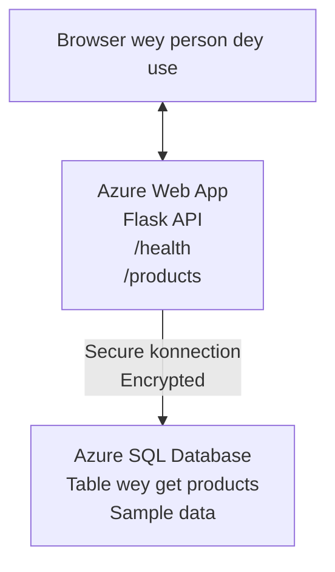

# How to Deploy Microsoft SQL Database and Web App wit AZD

⏱️ **Time wey e go take**: 20-30 minutes | 💰 **Estimated Cost**: ~$15-25/month | ⭐ **Complexity**: Medium

Dis **complete, wey dey work example** show how you go take use the [Azure Developer CLI (azd)](https://learn.microsoft.com/azure/developer/azure-developer-cli/) deploy Python Flask web application wey get Microsoft SQL Database for Azure. All code dey inside and dem don test am—no extra dependency wey you need.

## Wetin You Go Learn

By finishin dis example, you go:
- Deploy multi-tier application (web app + database) using infrastructure-as-code
- Configure secure database connections without hardcoding secrets
- Monitor application health with Application Insights
- Manage Azure resources sharply with AZD CLI
- Follow Azure best practices for security, cost optimization, and observability

## Scenario Overview
- **Web App**: Python Flask REST API wey get database connectivity
- **Database**: Azure SQL Database with sample data
- **Infrastructure**: Provisioned using Bicep (modular, reusable templates)
- **Deployment**: Fully automated with `azd` commands
- **Monitoring**: Application Insights for logs and telemetry

## Prerequisites

### Required Tools

Before you start, make sure say you don install these tools:

1. **[Azure CLI](https://learn.microsoft.com/cli/azure/install-azure-cli)** (version 2.50.0 or higher)
   ```sh
   az --version
   # Output wey dem expect: azure-cli 2.50.0 or pass am
   ```

2. **[Azure Developer CLI (azd)](https://learn.microsoft.com/azure/developer/azure-developer-cli/install-azd)** (version 1.0.0 or higher)
   ```sh
   azd version
   # Wetin we dey expect as output: azd version 1.0.0 or anything wey higher
   ```

3. **[Python 3.8+](https://www.python.org/downloads/)** (for local development)
   ```sh
   python --version
   # Wetin dem expect: Python 3.8 or pass
   ```

4. **[Docker](https://www.docker.com/get-started)** (optional, for local containerized development)
   ```sh
   docker --version
   # Wetin suppose show: Docker version 20.10 or wey pass
   ```

### Azure Requirements

- An active **Azure subscription** ([create a free account](https://azure.microsoft.com/free/))
- Permissions to create resources for your subscription
- **Owner** or **Contributor** role on the subscription or resource group

### Knowledge Prerequisites

Dis one na **intermediate-level** example. You suppose sabi:
- Basic command-line operations
- Fundamental cloud concepts (resources, resource groups)
- Basic understanding of web applications and databases

**New to AZD?** Start with the [Getting Started guide](../../docs/chapter-01-foundation/azd-basics.md) first.

## Architecture

Dis example go deploy two-tier architecture wey get web application and SQL database:


**Resource Deployment:**
- **Resource Group**: Container for all resources
- **App Service Plan**: Linux-based hosting (B1 tier for cost efficiency)
- **Web App**: Python 3.11 runtime with Flask application
- **SQL Server**: Managed database server wey use TLS 1.2 minimum
- **SQL Database**: Basic tier (2GB, good for development/testing)
- **Application Insights**: Monitoring and logging
- **Log Analytics Workspace**: Central log storage

**Analogy**: Make you reason am like restaurant (web app) wey get walk-in freezer (database). Customers dey order from menu (API endpoints), and kitchen (Flask app) dey collect ingredients (data) from the freezer. Restaurant manager (Application Insights) dey watch everything wey dey happen.

## Folder Structure

All files dey this example—no extra dependencies required:

```
examples/database-app/
│
├── README.md                    # This file
├── azure.yaml                   # AZD configuration file
├── .env.sample                  # Sample environment variables
├── .gitignore                   # Git ignore patterns
│
├── infra/                       # Infrastructure as Code (Bicep)
│   ├── main.bicep              # Main orchestration template
│   ├── abbreviations.json      # Azure naming conventions
│   └── resources/              # Modular resource templates
│       ├── sql-server.bicep    # SQL Server configuration
│       ├── sql-database.bicep  # Database configuration
│       ├── app-service-plan.bicep  # Hosting plan
│       ├── app-insights.bicep  # Monitoring setup
│       └── web-app.bicep       # Web application
│
└── src/
    └── web/                    # Application source code
        ├── app.py              # Flask REST API
        ├── requirements.txt    # Python dependencies
        └── Dockerfile          # Container definition
```

**Wetin Each File Dey Do:**
- **azure.yaml**: Tells AZD wetin to deploy and where
- **infra/main.bicep**: Orchestrate all Azure resources
- **infra/resources/*.bicep**: Individual resource definitions (modular for reuse)
- **src/web/app.py**: Flask application with database logic
- **requirements.txt**: Python package dependencies
- **Dockerfile**: Containerization instructions for deployment

## Quickstart (Step-by-Step)

### Step 1: Clone and Navigate

```sh
git clone https://github.com/microsoft/AZD-for-beginners.git
cd AZD-for-beginners/examples/database-app
```

**✓ Success Check**: Make sure say you dey see `azure.yaml` and `infra/` folder:
```sh
ls
# We dey expect: README.md, azure.yaml, infra/, src/
```

### Step 2: Authenticate with Azure

```sh
azd auth login
```

Dis go open your browser make you sign in to Azure. Use your Azure credentials to sign in.

**✓ Success Check**: You suppose see:
```
Logged in to Azure.
```

### Step 3: Initialize the Environment

```sh
azd init
```

**Wetin go happen**: AZD go create local configuration for your deployment.

**Prompts wey you go see**:
- **Environment name**: Put short name (e.g., `dev`, `myapp`)
- **Azure subscription**: Choose your subscription from list
- **Azure location**: Choose region (e.g., `eastus`, `westeurope`)

**✓ Success Check**: You suppose see:
```
SUCCESS: New project initialized!
```

### Step 4: Provision Azure Resources

```sh
azd provision
```

**Wetin go happen**: AZD go deploy all infrastructure (e fit take 5-8 minutes):
1. Creates resource group
2. Creates SQL Server and Database
3. Creates App Service Plan
4. Creates Web App
5. Creates Application Insights
6. Configures networking and security

**You go be asked for**:
- **SQL admin username**: Enter username (e.g., `sqladmin`)
- **SQL admin password**: Enter strong password (save am!)

**✓ Success Check**: You suppose see:
```
SUCCESS: Your application was provisioned in Azure in X minutes Y seconds.
You can view the resources created under the resource group rg-<env-name> in Azure Portal:
https://portal.azure.com/#@/resource/subscriptions/.../resourceGroups/rg-<env-name>
```

**⏱️ Time**: 5-8 minutes

### Step 5: Deploy the Application

```sh
azd deploy
```

**Wetin go happen**: AZD go build and deploy your Flask application:
1. Packages the Python application
2. Builds the Docker container
3. Pushes to Azure Web App
4. Initializes the database with sample data
5. Starts the application

**✓ Success Check**: You suppose see:
```
SUCCESS: Your application was deployed to Azure in X minutes Y seconds.
You can view the resources created under the resource group rg-<env-name> in Azure Portal:
https://portal.azure.com/#@/resource/subscriptions/.../resourceGroups/rg-<env-name>
```

**⏱️ Time**: 3-5 minutes

### Step 6: Browse the Application

```sh
azd browse
```

Dis one go open your deployed web app for browser at `https://app-<unique-id>.azurewebsites.net`

**✓ Success Check**: You suppose see JSON output:
```json
{
  "message": "Welcome to the Database App API",
  "endpoints": {
    "/": "This help message",
    "/health": "Health check endpoint",
    "/products": "List all products",
    "/products/<id>": "Get product by ID"
  }
}
```

### Step 7: Test the API Endpoints

**Health Check** (verify database connection):
```sh
curl https://app-<your-id>.azurewebsites.net/health
```

**Expected Response**:
```json
{
  "status": "healthy",
  "database": "connected"
}
```

**List Products** (sample data):
```sh
curl https://app-<your-id>.azurewebsites.net/products
```

**Expected Response**:
```json
[
  {
    "id": 1,
    "name": "Laptop",
    "description": "High-performance laptop",
    "price": 1299.99,
    "created_at": "2025-11-19T10:30:00"
  },
  ...
]
```

**Get Single Product**:
```sh
curl https://app-<your-id>.azurewebsites.net/products/1
```

**✓ Success Check**: All endpoints suppose return JSON data without errors.

---

**🎉 Congrats!** You don deploy web app with database go Azure using AZD.

## Configuration Deep-Dive

### Environment Variables

Secrets dey managed securely via Azure App Service configuration—**no ever hardcode secrets for source code**.

**Configured Automatically by AZD**:
- `SQL_CONNECTION_STRING`: Database connection with encrypted credentials
- `APPLICATIONINSIGHTS_CONNECTION_STRING`: Monitoring telemetry endpoint
- `SCM_DO_BUILD_DURING_DEPLOYMENT`: Enables automatic dependency installation

**Where Secrets Dey Stored**:
1. During `azd provision`, you go provide SQL credentials via secure prompts
2. AZD go store dem for your local `.azure/<env-name>/.env` file (git-ignored)
3. AZD go inject dem into Azure App Service configuration (encrypted at rest)
4. Application go read dem via `os.getenv()` at runtime

### Local Development

For local testing, create `.env` file from sample:

```sh
cp .env.sample .env
# Edit .env, put your local database connection inside am
```

**Local Development Workflow**:
```sh
# Install di dependencies
cd src/web
pip install -r requirements.txt

# Set di environment variables
export SQL_CONNECTION_STRING="your-local-connection-string"

# Run di application
python app.py
```

**Test locally**:
```sh
curl http://localhost:8000/health
# Wetin e suppose be: {"status": "fine", "database": "don connect"}
```

### Infrastructure as Code

All Azure resources dey define for **Bicep templates** (`infra/` folder):

- **Modular Design**: Each resource type get im own file make e reusable
- **Parameterized**: You fit customize SKUs, regions, naming conventions
- **Best Practices**: Follow Azure naming standards and security defaults
- **Version Controlled**: Infrastructure changes dey tracked in Git

**Customization Example**:
To change the database tier, edit `infra/resources/sql-database.bicep`:
```bicep
sku: {
  name: 'Standard'  // Changed from 'Basic'
  tier: 'Standard'
  capacity: 10
}
```

## Security Best Practices

Dis example follow Azure security best practices:

### 1. **No Secrets in Source Code**
- ✅ Credentials dey stored in Azure App Service configuration (encrypted)
- ✅ `.env` files dey excluded from Git via `.gitignore`
- ✅ Secrets dey passed via secure parameters during provisioning

### 2. **Encrypted Connections**
- ✅ TLS 1.2 minimum for SQL Server
- ✅ HTTPS-only dey enforced for Web App
- ✅ Database connections dey use encrypted channels

### 3. **Network Security**
- ✅ SQL Server firewall configured to allow Azure services only
- ✅ Public network access dey restricted (you fit lock am more with Private Endpoints)
- ✅ FTPS dey disabled on Web App

### 4. **Authentication & Authorization**
- ⚠️ **Current**: SQL authentication (username/password)
- ✅ **Production Recommendation**: Use Azure Managed Identity for passwordless authentication

**To Upgrade to Managed Identity** (for production):
1. Enable managed identity on Web App
2. Grant identity SQL permissions
3. Update connection string to use managed identity
4. Remove password-based authentication

### 5. **Auditing & Compliance**
- ✅ Application Insights dey log all requests and errors
- ✅ SQL Database auditing enabled (fit configure for compliance)
- ✅ All resources tagged for governance

**Security Checklist Before Production**:
- [ ] Enable Azure Defender for SQL
- [ ] Configure Private Endpoints for SQL Database
- [ ] Enable Web Application Firewall (WAF)
- [ ] Implement Azure Key Vault for secret rotation
- [ ] Configure Azure AD authentication
- [ ] Enable diagnostic logging for all resources

## Cost Optimization

**Estimated Monthly Costs** (as of November 2025):

| Resource | SKU/Tier | Estimated Cost |
|----------|----------|----------------|
| App Service Plan | B1 (Basic) | ~$13/month |
| SQL Database | Basic (2GB) | ~$5/month |
| Application Insights | Pay-as-you-go | ~$2/month (low traffic) |
| **Total** | | **~$20/month** |

**💡 Cost-Saving Tips**:

1. **Use Free Tier for Learning**:
   - App Service: F1 tier (free, limited hours)
   - SQL Database: Use Azure SQL Database serverless
   - Application Insights: 5GB/month free ingestion

2. **Stop Resources When Not in Use**:
   ```sh
   # Stop di web app (database still dey charge)
   az webapp stop --name <app-name> --resource-group <rg-name>
   
   # Restart wen you need am
   az webapp start --name <app-name> --resource-group <rg-name>
   ```

3. **Delete Everything After Testing**:
   ```sh
   azd down
   ```
   Dis one go remove ALL resources and stop charges.

4. **Development vs. Production SKUs**:
   - **Development**: Basic tier (wey dem use for this example)
   - **Production**: Standard/Premium tier wit redundancy

**Cost Monitoring**:
- View costs for [Azure Cost Management](https://portal.azure.com/#view/Microsoft_Azure_CostManagement)
- Set up cost alerts make you no get surprise
- Tag all resources with `azd-env-name` for tracking

**Free Tier Alternative**:
For learning, you fit modify `infra/resources/app-service-plan.bicep`:
```bicep
sku: {
  name: 'F1'  // Free tier
  tier: 'Free'
}
```
**Note**: Free tier get limitations (60 min/day CPU, no always-on).

## Monitoring & Observability

### Application Insights Integration

Dis example include **Application Insights** for proper monitoring:

**Wetin Dem Dey Monitor**:
- ✅ HTTP requests (latency, status codes, endpoints)
- ✅ Application errors and exceptions
- ✅ Custom logging from Flask app
- ✅ Database connection health
- ✅ Performance metrics (CPU, memory)

**How to Access Application Insights**:
1. Open [Azure Portal](https://portal.azure.com)
2. Go your resource group (`rg-<env-name>`)
3. Click on Application Insights resource (`appi-<unique-id>`)

**Useful Queries** (Application Insights → Logs):

**View All Requests**:
```kusto
requests
| where timestamp > ago(1h)
| order by timestamp desc
| project timestamp, name, url, resultCode, duration
```

**Find Errors**:
```kusto
exceptions
| where timestamp > ago(24h)
| order by timestamp desc
| project timestamp, type, outerMessage, operation_Name
```

**Check Health Endpoint**:
```kusto
requests
| where name contains "health"
| summarize count() by resultCode, bin(timestamp, 1h)
```

### SQL Database Auditing

**SQL Database auditing dey enabled** to track:
- Database access patterns
- Failed login attempts
- Schema changes
- Data access (for compliance)

**How to Access Audit Logs**:
1. Azure Portal → SQL Database → Auditing
2. View logs for Log Analytics workspace

### Real-Time Monitoring

**View Live Metrics**:
1. Application Insights → Live Metrics
2. See requests, failures, and performance for real-time

**Set Up Alerts**:
Create alerts for critical events:
- HTTP 500 errors > 5 in 5 minutes
- Database connection failures
- High response times (>2 seconds)

**Example Alert Creation**:
```sh
az monitor metrics alert create \
  --name "High-Response-Time" \
  --resource-group <rg-name> \
  --scopes <app-insights-resource-id> \
  --condition "avg requests/duration > 2000" \
  --description "Alert when response time exceeds 2 seconds"
```

## Troubleshooting
### Common Wahala and How to Solve Dem

#### 1. `azd provision` fails with "Location not available"

**Wetin Dey Happen**:
```
Error: The subscription is not registered for the resource type 'components' in the location 'centralus'.
```

**How to Fix Am**:
Pick another Azure region or register the resource provider:
```sh
az provider register --namespace Microsoft.Insights
```

#### 2. SQL Connection Dey Fail During Deployment

**Wetin Dey Happen**:
```
pyodbc.OperationalError: ('08001', '[08001] [Microsoft][ODBC Driver 18 for SQL Server]TCP Provider...')
```

**How to Fix Am**:
- Make sure say SQL Server firewall dey allow Azure services (e dey configure am automatically)
- Check say the SQL admin password enter correct during `azd provision`
- Make sure SQL Server don fully provision (fit take 2-3 minutes)

**Check Connection**:
```sh
# For Azure Portal, waka go SQL Database → Query editor
# Try connect wit your credentials
```

#### 3. Web App Dey Show "Application Error"

**Wetin Dey Happen**:
Browser dey show generic error page.

**How to Fix Am**:
Check the application logs:
```sh
# See di logs wey don happen recently
az webapp log tail --name <app-name> --resource-group <rg-name>
```

**Wetin dey usually cause am**:
- Environment variables no set (check App Service → Configuration)
- Python package installation fail (check deployment logs)
- Database initialization error (check SQL connectivity)

#### 4. `azd deploy` Dey Fail with "Build Error"

**Wetin Dey Happen**:
```
Error: Failed to build project
```

**How to Fix Am**:
- Make sure `requirements.txt` get no syntax errors
- Check say Python 3.11 dey specified in `infra/resources/web-app.bicep`
- Verify Dockerfile get correct base image

**Debug locally**:
```sh
cd src/web
docker build -t test-app .
docker run -p 8000:8000 test-app
```

#### 5. "Unauthorized" When Running AZD Commands

**Wetin Dey Happen**:
```
ERROR: (Unauthorized) The client '<id>' with object id '<id>' does not have authorization
```

**How to Fix Am**:
Log in again to Azure:
```sh
# Na compulsory for AZD workflows
azd auth login

# E no compulsory if you dey also use Azure CLI commands directly
az login
```

Make sure say you get the correct permissions (Contributor role) on the subscription.

#### 6. Database Costs Wey High

**Wetin Dey Happen**:
You get unexpected Azure bill.

**How to Fix Am**:
- Check say you no forget to run `azd down` after testing
- Make sure SQL Database dey use Basic tier (no be Premium)
- Review costs in Azure Cost Management
- Set up cost alerts

### How to Get Help

**See All AZD Environment Variables**:
```sh
azd env get-values
```

**Check Deployment Status**:
```sh
az webapp show --name <app-name> --resource-group <rg-name> --query state
```

**Access Application Logs**:
```sh
az webapp log download --name <app-name> --resource-group <rg-name> --log-file app-logs.zip
```

**Need More Help?**
- [AZD Troubleshooting Guide](../../docs/chapter-07-troubleshooting/common-issues.md)
- [Azure App Service Troubleshooting](https://learn.microsoft.com/azure/app-service/troubleshoot-diagnostic-logs)
- [Azure SQL Troubleshooting](https://learn.microsoft.com/azure/azure-sql/database/troubleshoot-common-errors-issues)

## Practical Exercises

### Exercise 1: Make Sure Say Your Deployment Dey Work (Beginner)

**Goal**: Confirm say all resources don deploy and the application dey work.

**Steps**:
1. List all resources wey dey your resource group:
   ```sh
   az resource list --resource-group rg-<env-name> --output table
   ```
   **Wetin You Suppose See**: 6-7 resources (Web App, SQL Server, SQL Database, App Service Plan, Application Insights, Log Analytics)

2. Test all API endpoints:
   ```sh
   curl https://app-<your-id>.azurewebsites.net/
   curl https://app-<your-id>.azurewebsites.net/health
   curl https://app-<your-id>.azurewebsites.net/products
   curl https://app-<your-id>.azurewebsites.net/products/1
   ```
   **Wetin You Suppose See**: All go return valid JSON without error

3. Check Application Insights:
   - Go to Application Insights inside Azure Portal
   - Go to "Live Metrics"
   - Refresh your browser on the web app
   **Wetin You Suppose See**: You go see requests dey appear in real-time

**How You Go Know Say Na Success**: All 6-7 resources dey, all endpoints dey return data, Live Metrics dey show activity.

---

### Exercise 2: Add a New API Endpoint (Intermediate)

**Goal**: Add one new endpoint to the Flask application.

**Starter Code**: Current endpoints in `src/web/app.py`

**Steps**:
1. Edit `src/web/app.py` and add a new endpoint after the `get_product()` function:
   ```python
   @app.route('/products/search/<keyword>')
   def search_products(keyword):
       """Search products by name or description."""
       try:
           conn = get_db_connection()
           cursor = conn.cursor()
           cursor.execute(
               "SELECT id, name, description, price, created_at FROM products WHERE name LIKE ? OR description LIKE ?",
               (f'%{keyword}%', f'%{keyword}%')
           )
           
           products = []
           for row in cursor.fetchall():
               products.append({
                   'id': row[0],
                   'name': row[1],
                   'description': row[2],
                   'price': float(row[3]) if row[3] else None,
                   'created_at': row[4].isoformat() if row[4] else None
               })
           
           cursor.close()
           conn.close()
           
           logger.info(f"Search for '{keyword}' returned {len(products)} results")
           return jsonify(products), 200
           
       except Exception as e:
           logger.error(f"Error searching products: {str(e)}")
           return jsonify({'error': str(e)}), 500
   ```

2. Deploy the updated application:
   ```sh
   azd deploy
   ```

3. Test the new endpoint:
   ```sh
   curl https://app-<your-id>.azurewebsites.net/products/search/laptop
   ```
   **Wetin You Suppose See**: Go return products wey match "laptop"

**How You Go Know Say Na Success**: New endpoint dey work, dey return filtered results, dey show for Application Insights logs.

---

### Exercise 3: Add Monitoring and Alerts (Advanced)

**Goal**: Set up proactive monitoring with alerts.

**Steps**:
1. Create an alert for HTTP 500 errors:
   ```sh
   # Find di Application Insights resource ID
   AI_ID=$(az monitor app-insights component show \
     --app appi-<your-id> \
     --resource-group rg-<env-name> \
     --query id -o tsv)
   
   # Make di alert
   az monitor metrics alert create \
     --name "High-Error-Rate" \
     --resource-group rg-<env-name> \
     --scopes $AI_ID \
     --condition "count requests/failed > 5" \
     --window-size 5m \
     --evaluation-frequency 1m \
     --description "Alert when >5 failed requests in 5 minutes"
   ```

2. Trigger the alert by causing errors:
   ```sh
   # Ask for product wey no dey
   for i in {1..10}; do curl https://app-<your-id>.azurewebsites.net/products/999; done
   ```

3. Check if the alert fired:
   - Azure Portal → Alerts → Alert Rules
   - Check your email (if you configure am)

**How You Go Know Say Na Success**: Alert rule don create, e go trigger on errors, notifications don reach you.

---

### Exercise 4: Make Database Schema Changes (Advanced)

**Goal**: Add a new table and modify the application to use am.

**Steps**:
1. Connect to SQL Database via Azure Portal Query Editor

2. Create a new `categories` table:
   ```sql
   CREATE TABLE categories (
       id INT PRIMARY KEY IDENTITY(1,1),
       name NVARCHAR(50) NOT NULL,
       description NVARCHAR(200)
   );
   
   INSERT INTO categories (name, description) VALUES
   ('Electronics', 'Electronic devices and accessories'),
   ('Office Supplies', 'Office equipment and supplies');
   
   -- Add category to products table
   ALTER TABLE products ADD category_id INT;
   UPDATE products SET category_id = 1; -- Set all to Electronics
   ```

3. Update `src/web/app.py` make e include category information in responses

4. Deploy and test

**How You Go Know Say Na Success**: New table dey, products dey show category information, application still dey work.

---

### Exercise 5: Implement Caching (Expert)

**Goal**: Add Azure Redis Cache to improve performance.

**Steps**:
1. Add Redis Cache to `infra/main.bicep`
2. Update `src/web/app.py` to cache product queries
3. Measure performance improvement with Application Insights
4. Compare response times before/after caching

**How You Go Know Say Na Success**: Redis don deploy, caching dey work, response times don improve by >50%.

**Hint**: Start with [Azure Cache for Redis documentation](https://learn.microsoft.com/azure/azure-cache-for-redis/).

---

## Cleanup

To avoid ongoing charges, delete all resources when you finish:

```sh
azd down
```

**Confirmation prompt**:
```
? Total resources to delete: 7, are you sure you want to continue? (y/N)
```

Type `y` to confirm.

**✓ Success Check**: 
- All resources don delete for Azure Portal
- No more ongoing charges
- Local `.azure/<env-name>` folder fit delete

**Alternative** (keep infrastructure, delete data):
```sh
# Comot na only di resource group (no touch AZD config)
az group delete --name rg-<env-name> --yes
```
## Learn More

### Related Documentation
- [Azure Developer CLI Documentation](https://learn.microsoft.com/azure/developer/azure-developer-cli/)
- [Azure SQL Database Documentation](https://learn.microsoft.com/azure/azure-sql/database/)
- [Azure App Service Documentation](https://learn.microsoft.com/azure/app-service/)
- [Application Insights Documentation](https://learn.microsoft.com/azure/azure-monitor/app/app-insights-overview)
- [Bicep Language Reference](https://learn.microsoft.com/azure/azure-resource-manager/bicep/)

### Next Steps in This Course
- **[Container Apps Example](../../../../examples/container-app)**: Deploy microservices with Azure Container Apps
- **[AI Integration Guide](../../../../docs/ai-foundry)**: Add AI capabilities to your app
- **[Deployment Best Practices](../../docs/chapter-04-infrastructure/deployment-guide.md)**: Production deployment patterns

### Advanced Topics
- **Managed Identity**: Remove passwords and use Azure AD authentication
- **Private Endpoints**: Secure database connections within a virtual network
- **CI/CD Integration**: Automate deployments with GitHub Actions or Azure DevOps
- **Multi-Environment**: Set up dev, staging, and production environments
- **Database Migrations**: Use Alembic or Entity Framework for schema versioning

### Comparison to Other Approaches

**AZD vs. ARM Templates**:
- ✅ AZD: Higher-level abstraction, simpler commands
- ⚠️ ARM: More verbose, granular control

**AZD vs. Terraform**:
- ✅ AZD: Azure-native, integrated with Azure services
- ⚠️ Terraform: Multi-cloud support, larger ecosystem

**AZD vs. Azure Portal**:
- ✅ AZD: Repeatable, version-controlled, automatable
- ⚠️ Portal: Manual clicks, difficult to reproduce

**Think of AZD as**: Docker Compose for Azure—simplified configuration for complex deployments.

---

## Frequently Asked Questions

**Q: Fit I use different programming language?**  
A: Yes! Replace `src/web/` with Node.js, C#, Go, or any language. Update `azure.yaml` and Bicep accordingly.

**Q: How I go add more databases?**  
A: Add another SQL Database module in `infra/main.bicep` or use PostgreSQL/MySQL from Azure Database services.

**Q: Fit I use this for production?**  
A: This na starting point. For production, add: managed identity, private endpoints, redundancy, backup strategy, WAF, and enhanced monitoring.

**Q: Wetin if I want to use containers instead of code deployment?**  
A: Check out the [Container Apps Example](../../../../examples/container-app) wey dey use Docker containers throughout.

**Q: How I go connect to the database from my local machine?**  
A: Add your IP to the SQL Server firewall:
```sh
az sql server firewall-rule create \
  --resource-group rg-<env-name> \
  --server sql-<unique-id> \
  --name AllowMyIP \
  --start-ip-address <your-ip> \
  --end-ip-address <your-ip>
```

**Q: Fit I use existing database instead of create new one?**  
A: Yes, modify `infra/main.bicep` to reference an existing SQL Server and update the connection string parameters.

---

> **Note:** Dis example dey show best practices for deploying a web app with a database using AZD. E include working code, full documentation, and practical exercises to help learning. For production deployments, review security, scaling, compliance, and cost requirements wey concern your organization.

**📚 Course Navigation:**
- ← Previous: [Container Apps Example](../../../../examples/container-app)
- → Next: [AI Integration Guide](../../../../docs/ai-foundry)
- 🏠 [Course Home](../../README.md)

---

<!-- CO-OP TRANSLATOR DISCLAIMER START -->
**Disclaimer**:
Dis document don translate with AI translation service [Co-op Translator](https://github.com/Azure/co-op-translator). Even though we dey try make am correct, abeg sabi say automated translations fit get errors or mistakes. Di original document for im native language suppose be di authoritative source. For critical information, we recommend say professional human translation make dem do am. We no dey liable for any misunderstandings or misinterpretations wey fit arise from di use of this translation.
<!-- CO-OP TRANSLATOR DISCLAIMER END -->