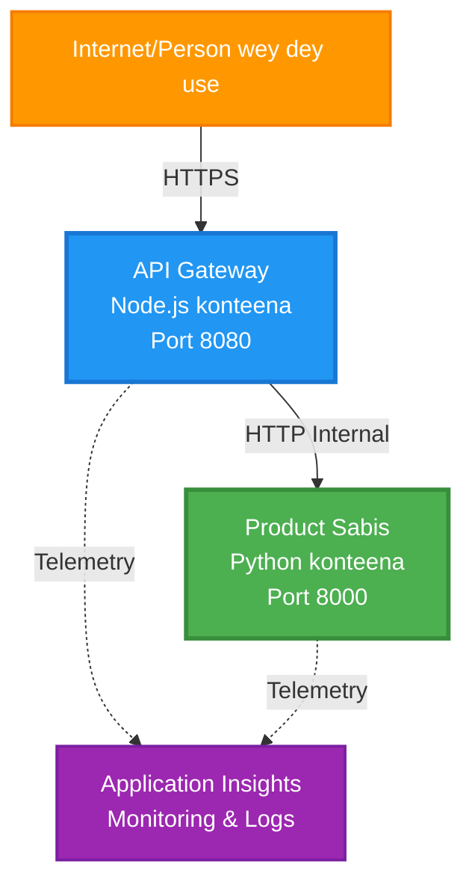
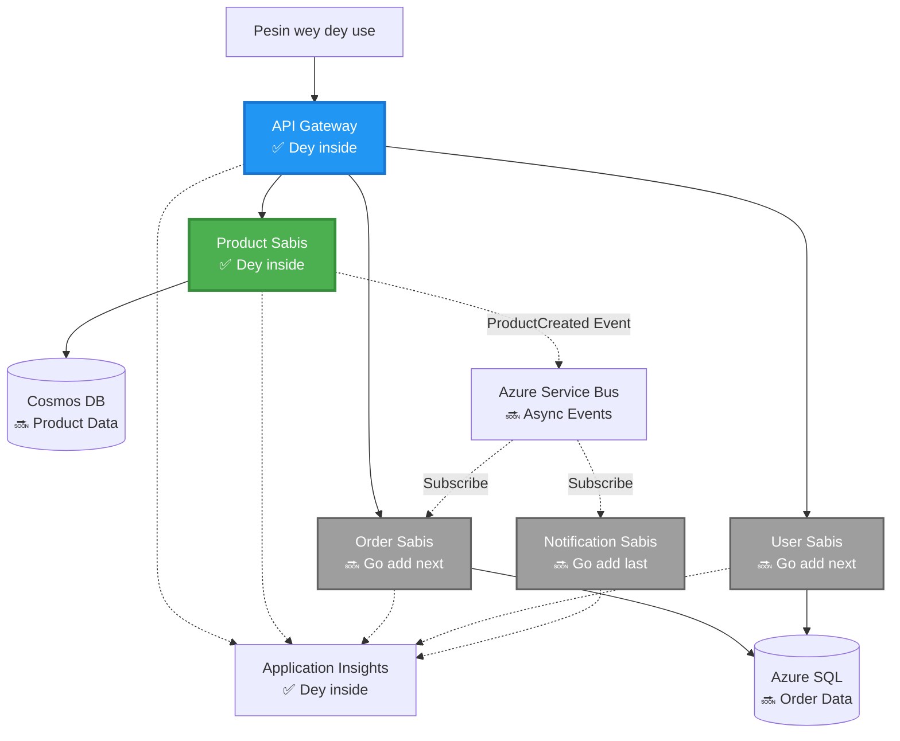
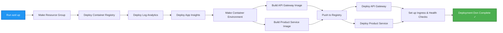
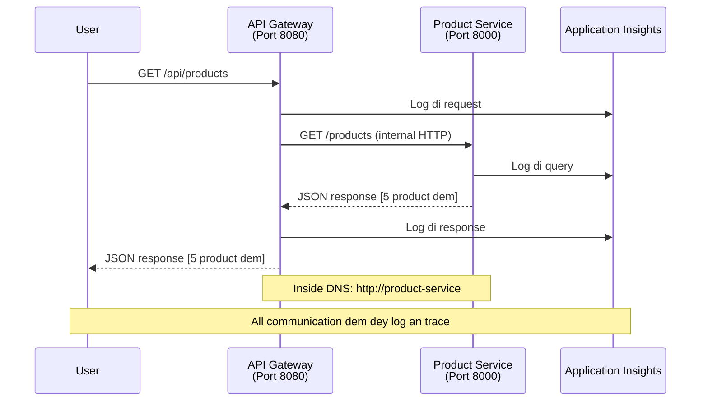

# Microservices Architecture - Container App Example

⏱️ **How long e go take**: 25-35 minutes | 💰 **How much e fit cost**: ~$50-100/month | ⭐ **Level**: Advanced

**📚 Learning Path:**
- ← Previous: [Simple Flask API](../../../../examples/container-app/simple-flask-api) - Single container basics
- 🎯 **You dey here**: Microservices Architecture (2-service foundation)
- → Next: [AI Integration](../../../../docs/ai-foundry) - Add intelligence to your services
- 🏠 [Course Home](../../README.md)

---

Na **simplified but e dey work** microservices architecture wey dem deploy for Azure Container Apps using AZD CLI. Dis example dey show how service-to-service communication dey work, container orchestration, and monitoring with one practical 2-service setup.

> **📚 Learning Approach**: Dis example start with minimal 2-service architecture (API Gateway + Backend Service) wey you fit actually deploy and learn from. After you sabi this foundation, we go show how to expand am to full microservices ecosystem.

## Wetin You Go Learn

By finishing dis example, you go:
- Deploy multiple containers to Azure Container Apps
- Implement service-to-service communication with internal networking
- Configure environment-based scaling and health checks
- Monitor distributed applications with Application Insights
- Understand microservices deployment patterns and best practices
- Learn how to expand step-by-step from simple to complex architectures

## Architecture

### Phase 1: Wetin We Dey Build (Included in This Example)


```mermaid
graph TB
    Internet[Internet/Person wey dey use]
    Gateway[API Gateway<br/>Node.js konteena<br/>Port 8080]
    Product[Product Sabis<br/>Python konteena<br/>Port 8000]
    AppInsights[Application Insights<br/>Monitoring & Logs]
    
    Internet -->|HTTPS| Gateway
    Gateway -->|HTTP Internal| Product
    Gateway -.->|Telemetry| AppInsights
    Product -.->|Telemetry| AppInsights
    
    style Gateway fill:#2196F3,stroke:#1976D2,stroke-width:3px,color:#fff
    style Product fill:#4CAF50,stroke:#388E3C,stroke-width:3px,color:#fff
    style Internet fill:#FF9800,stroke:#F57C00,stroke-width:2px,color:#fff
    style AppInsights fill:#9C27B0,stroke:#7B1FA2,stroke-width:2px,color:#fff
```
**Component Details:**

| Component | Purpose | Access | Resources |
|-----------|---------|--------|-----------|
| **API Gateway** | Routes external requests to backend services | Public (HTTPS) | 1 vCPU, 2GB RAM, 2-20 replicas |
| **Product Service** | Manages product catalog with in-memory data | Internal only | 0.5 vCPU, 1GB RAM, 1-10 replicas |
| **Application Insights** | Centralized logging and distributed tracing | Azure Portal | 1-2 GB/month data ingestion |

**Why Start Simple?**
- ✅ Deploy and understand quick (25-35 minutes)
- ✅ Learn core microservices patterns without too much wahala
- ✅ Working code wey you fit modify and experiment with
- ✅ Lower cost for learning (~$50-100/month vs $300-1400/month)
- ✅ Build confidence before you add databases and message queues

**Analogy**: Think am like learning to drive. You go start for empty parking lot (2 services), master the basics, then move go city traffic (5+ services with databases).

### Phase 2: Future Expansion (Reference Architecture)

Once you don master the 2-service architecture, you fit expand to:


```mermaid
graph TB
    User[Pesin wey dey use]
    Gateway[API Gateway<br/>✅ Dey inside]
    Product[Product Sabis<br/>✅ Dey inside]
    Order[Order Sabis<br/>🔜 Go add next]
    UserSvc[User Sabis<br/>🔜 Go add next]
    Notify[Notification Sabis<br/>🔜 Go add last]
    
    CosmosDB[(Cosmos DB<br/>🔜 Product Data)]
    AzureSQL[(Azure SQL<br/>🔜 Order Data)]
    ServiceBus[Azure Service Bus<br/>🔜 Async Events]
    AppInsights[Application Insights<br/>✅ Dey inside]
    
    User --> Gateway
    Gateway --> Product
    Gateway --> Order
    Gateway --> UserSvc
    
    Product --> CosmosDB
    Order --> AzureSQL
    UserSvc --> AzureSQL
    
    Product -.->|ProductCreated Event| ServiceBus
    ServiceBus -.->|Subscribe| Notify
    ServiceBus -.->|Subscribe| Order
    
    Gateway -.-> AppInsights
    Product -.-> AppInsights
    Order -.-> AppInsights
    UserSvc -.-> AppInsights
    Notify -.-> AppInsights
    
    style Product fill:#4CAF50,stroke:#388E3C,stroke-width:3px,color:#fff
    style Gateway fill:#2196F3,stroke:#1976D2,stroke-width:3px,color:#fff
    style Order fill:#9E9E9E,stroke:#616161,stroke-width:2px,color:#fff
    style UserSvc fill:#9E9E9E,stroke:#616161,stroke-width:2px,color:#fff
    style Notify fill:#9E9E9E,stroke:#616161,stroke-width:2px,color:#fff
```
See "Expansion Guide" section at the end for step-by-step instructions.

## Features Included

✅ **Service Discovery**: Automatic DNS-based discovery between containers  
✅ **Load Balancing**: Built-in load balancing across replicas  
✅ **Auto-scaling**: Independent scaling per service based on HTTP requests  
✅ **Health Monitoring**: Liveness and readiness probes for both services  
✅ **Distributed Logging**: Centralized logging with Application Insights  
✅ **Internal Networking**: Secure service-to-service communication  
✅ **Container Orchestration**: Automatic deployment and scaling  
✅ **Zero-Downtime Updates**: Rolling updates with revision management  

## Prerequisites

### Required Tools

Before you start, make sure say you get these tools installed:

1. **[Azure Developer CLI (azd)](https://learn.microsoft.com/azure/developer/azure-developer-cli/install-azd)** (version 1.0.0 or higher)
   ```bash
   azd version
   # Wetin e suppose show: azd version 1.0.0 or pass
   ```

2. **[Azure CLI](https://learn.microsoft.com/cli/azure/install-azure-cli)** (version 2.50.0 or higher)
   ```bash
   az --version
   # Wetin suppose show: azure-cli 2.50.0 or pass am
   ```

3. **[Docker](https://www.docker.com/get-started)** (for local development/testing - optional)
   ```bash
   docker --version
   # Wetin suppose show: Docker version 20.10 wey pass
   ```

### Verify Your Setup

Run these commands make sure say you ready:

```bash
# Confirm say Azure Developer CLI dey
azd version
# ✅ We dey expect: azd version 1.0.0 or pass

# Confirm say Azure CLI dey
az --version
# ✅ We dey expect: azure-cli 2.50.0 or pass

# Confirm say Docker dey (no compulsory)
docker --version
# ✅ We dey expect: Docker version 20.10 or pass
```

**Success Criteria**: All commands go return version numbers wey match or pass the minimum.

### Azure Requirements

- One active **Azure subscription** ([create a free account](https://azure.microsoft.com/free/))
- Permissions to create resources for your subscription
- **Contributor** role on the subscription or resource group

### Knowledge Prerequisites

Dis example na **advanced-level**. You suppose:
- Don finish the [Simple Flask API example](../../../../examples/container-app/simple-flask-api) 
- Get basic understanding of microservices architecture
- Sabi REST APIs and HTTP
- Understand container concepts

**New to Container Apps?** Start with the [Simple Flask API example](../../../../examples/container-app/simple-flask-api) first to get the basics.

## Quick Start (Step-by-Step)

### Step 1: Clone and Navigate

```bash
git clone https://github.com/microsoft/AZD-for-beginners.git
cd AZD-for-beginners/examples/microservices
```

**✓ Success Check**: Make sure you fit see `azure.yaml`:
```bash
ls
# Wetin dem expect: README.md, azure.yaml, infra/, src/
```

### Step 2: Authenticate with Azure

```bash
azd auth login
```

This one go open your browser make you sign in for Azure. Use your Azure credentials.

**✓ Success Check**: You suppose see:
```
Logged in to Azure.
```

### Step 3: Initialize the Environment

```bash
azd init
```

**Prompts wey you go see**:
- **Environment name**: Enter one short name (e.g., `microservices-dev`)
- **Azure subscription**: Select your subscription
- **Azure location**: Choose region (e.g., `eastus`, `westeurope`)

**✓ Success Check**: You suppose see:
```
SUCCESS: New project initialized!
```

### Step 4: Deploy Infrastructure and Services

```bash
azd up
```

**Wetin go happen** (e go take 8-12 minutes):


```mermaid
graph LR
    A[Run azd up] --> B[Make Resource Group]
    B --> C[Deploy Container Registry]
    C --> D[Deploy Log Analytics]
    D --> E[Deploy App Insights]
    E --> F[Make Container Environment]
    F --> G[Build API Gateway Image]
    F --> H[Build Product Service Image]
    G --> I[Push to Registry]
    H --> I
    I --> J[Deploy API Gateway]
    I --> K[Deploy Product Service]
    J --> L[Set up Ingress & Health Checks]
    K --> L
    L --> M[Deployment Don Complete ✓]
    
    style A fill:#2196F3,stroke:#1976D2,stroke-width:3px,color:#fff
    style M fill:#4CAF50,stroke:#388E3C,stroke-width:3px,color:#fff
```
**✓ Success Check**: You suppose see:
```
SUCCESS: Your application was deployed to Azure in X minutes Y seconds.
Endpoint: https://api-gateway-<unique-id>.azurecontainerapps.io
```

**⏱️ Time**: 8-12 minutes

### Step 5: Test the Deployment

```bash
# Find di gateway endpoint
GATEWAY_URL=$(azd env get-values | grep API_GATEWAY_URL | cut -d '=' -f2 | tr -d '"')

# Test di API Gateway make sure e dey okay
curl $GATEWAY_URL/health
```

**✅ Expected output:**
```json
{
  "status": "healthy",
  "service": "api-gateway",
  "timestamp": "2025-11-19T10:30:00Z"
}
```

**Test product service through gateway**:
```bash
# Show product dem
curl $GATEWAY_URL/api/products
```

**✅ Expected output:**
```json
[
  {"id":1,"name":"Laptop","price":999.99,"stock":50},
  {"id":2,"name":"Mouse","price":29.99,"stock":200},
  {"id":3,"name":"Keyboard","price":79.99,"stock":150}
]
```

**✓ Success Check**: Both endpoints suppose return JSON data without errors.

---

**🎉 Congratulations!** You don deploy microservices architecture for Azure!

## Project Structure

All implementation files dey included—dis na complete, working example:

```
microservices/
│
├── README.md                         # This file
├── azure.yaml                        # AZD configuration
├── .gitignore                        # Git ignore patterns
│
├── infra/                           # Infrastructure as Code (Bicep)
│   ├── main.bicep                   # Main orchestration
│   ├── abbreviations.json           # Naming conventions
│   ├── core/                        # Shared infrastructure
│   │   ├── container-apps-environment.bicep  # Container environment + registry
│   │   └── monitor.bicep            # Application Insights + Log Analytics
│   └── app/                         # Service definitions
│       ├── api-gateway.bicep        # API Gateway container app
│       └── product-service.bicep    # Product Service container app
│
└── src/                             # Application source code
    ├── api-gateway/                 # Node.js API Gateway
    │   ├── app.js                   # Express server with routing
    │   ├── package.json             # Node dependencies
    │   └── Dockerfile               # Container definition
    └── product-service/             # Python Product Service
        ├── main.py                  # Flask API with product data
        ├── requirements.txt         # Python dependencies
        └── Dockerfile               # Container definition
```

**What Each Component Does:**

**Infrastructure (infra/)**:
- `main.bicep`: Orchestrate all Azure resources and their dependencies
- `core/container-apps-environment.bicep`: Create the Container Apps environment and Azure Container Registry
- `core/monitor.bicep`: Set up Application Insights for distributed logging
- `app/*.bicep`: Individual container app definitions with scaling and health checks

**API Gateway (src/api-gateway/)**:
- Public-facing service wey dey route requests to backend services
- Implements logging, error handling, and request forwarding
- Show how service-to-service HTTP communication dey work

**Product Service (src/product-service/)**:
- Internal service wey get product catalog (in-memory for simplicity)
- REST API with health checks
- Example of backend microservice pattern

## Services Overview

### API Gateway (Node.js/Express)

**Port**: 8080  
**Access**: Public (external ingress)  
**Purpose**: Routes incoming requests to appropriate backend services  

**Endpoints**:
- `GET /` - Service information
- `GET /health` - Health check endpoint
- `GET /api/products` - Forward to product service (list all)
- `GET /api/products/:id` - Forward to product service (get by ID)

**Key Features**:
- Request routing with axios
- Centralized logging
- Error handling and timeout management
- Service discovery via environment variables
- Application Insights integration

**Code Highlight** (`src/api-gateway/app.js`):
```javascript
// How di inside services dem dey communicate
app.get('/api/products', async (req, res) => {
  const response = await axios.get(`${PRODUCT_SERVICE_URL}/products`, {
    timeout: 5000
  });
  res.json(response.data);
});
```

### Product Service (Python/Flask)

**Port**: 8000  
**Access**: Internal only (no external ingress)  
**Purpose**: Manages product catalog with in-memory data  

**Endpoints**:
- `GET /` - Service information
- `GET /health` - Health check endpoint
- `GET /products` - List all products
- `GET /products/<id>` - Get product by ID

**Key Features**:
- RESTful API with Flask
- In-memory product store (simple, no database needed)
- Health monitoring with probes
- Structured logging
- Application Insights integration

**Data Model**:
```python
{
  "id": 1,
  "name": "Laptop",
  "description": "High-performance laptop",
  "price": 999.99,
  "stock": 50
}
```

**Why Internal Only?**
Product service no dey exposed to public. All requests gots pass through API Gateway, wey dey give:
- Security: Controlled access point
- Flexibility: Fit change backend without shaking clients
- Monitoring: Centralized request logging

## Understanding Service Communication

### How Services Talk to Each Other


```mermaid
sequenceDiagram
    participant User
    participant Gateway as API Gateway<br/>(Port 8080)
    participant Product as Product Service<br/>(Port 8000)
    participant AI as Application Insights
    
    User->>Gateway: GET /api/products
    Gateway->>AI: Log di request
    Gateway->>Product: GET /products (internal HTTP)
    Product->>AI: Log di query
    Product-->>Gateway: JSON response [5 product dem]
    Gateway->>AI: Log di response
    Gateway-->>User: JSON response [5 product dem]
    
    Note over Gateway,Product: Inside DNS: http://product-service
    Note over User,AI: All communication dem dey log an trace
```
For dis example, the API Gateway dey communicate with the Product Service using **internal HTTP calls**:

```javascript
// API Gateway (src/api-gateway/app.js)
const PRODUCT_SERVICE_URL = process.env.PRODUCT_SERVICE_URL;

// Make HTTP request inside di system
const response = await axios.get(`${PRODUCT_SERVICE_URL}/products`);
```

**Key Points**:

1. **DNS-Based Discovery**: Container Apps automatically provide DNS for internal services
   - Product Service FQDN: `product-service.internal.<environment>.azurecontainerapps.io`
   - Simplified as: `http://product-service` (Container Apps resolves am)

2. **No Public Exposure**: Product Service get `external: false` for Bicep
   - Only accessible inside the Container Apps environment
   - Nobody fit reach am from internet

3. **Environment Variables**: Service URLs dey injected at deployment time
   - Bicep dey pass the internal FQDN to the gateway
   - No hardcoded URLs inside application code

**Analogy**: Think am like office rooms. The API Gateway na reception desk (public-facing), and the Product Service na office room (internal only). Visitors must pass reception before dem fit reach any office.

## Deployment Options

### Full Deployment (Recommended)

```bash
# Deploy di infrastructure an di two services
azd up
```

Dis one go deploy:
1. Container Apps environment
2. Application Insights
3. Container Registry
4. API Gateway container
5. Product Service container

**Time**: 8-12 minutes

### Deploy Individual Service

```bash
# Deploy only one service (after you don run azd up)
azd deploy api-gateway

# Or deploy di product service
azd deploy product-service
```

**Use Case**: When you don update code for one service and you wan redeploy only that service.

### Update Configuration

```bash
# Change di scaling parameters
azd env set GATEWAY_MAX_REPLICAS 30

# Deploy again wit di new configuration
azd up
```

## Configuration

### Scaling Configuration

Both services dem configure HTTP-based autoscaling for their Bicep files:

**API Gateway**:
- Min replicas: 2 (always at least 2 for availability)
- Max replicas: 20
- Scale trigger: 50 concurrent requests per replica

**Product Service**:
- Min replicas: 1 (fit scale to zero if needed)
- Max replicas: 10
- Scale trigger: 100 concurrent requests per replica

**Customize Scaling** (in `infra/app/*.bicep`):
```bicep
scale: {
  minReplicas: 1
  maxReplicas: 10
  rules: [
    {
      name: 'http-scale-rule'
      http: {
        metadata: {
          concurrentRequests: '100'  // Adjust this
        }
      }
    }
  ]
}
```

### Resource Allocation

**API Gateway**:
- CPU: 1.0 vCPU
- Memory: 2 GiB
- Reason: E dey handle all external traffic

**Product Service**:
- CPU: 0.5 vCPU
- Memory: 1 GiB
- Reason: Lightweight in-memory operations

### Health Checks

Both services get liveness and readiness probes:

```bicep
probes: [
  {
    type: 'Liveness'
    httpGet: {
      path: '/health'
      port: 8080
    }
    initialDelaySeconds: 10
    periodSeconds: 30
  }
  {
    type: 'Readiness'
    httpGet: {
      path: '/health'
      port: 8080
    }
    initialDelaySeconds: 5
    periodSeconds: 10
  }
]
```

**Wetin Dis Mean**:
- **Liveness**: If health check fail, Container Apps go restart the container
- **Readiness**: If container no ready, Container Apps go stop to route traffic to that replica

## Monitoring & Observability

### View Service Logs

```bash
# Use azd monitor make you fit see logs
azd monitor --logs

# Abi use Azure CLI if na for specific Container Apps:
# Dey stream logs from API Gateway
az containerapp logs show --name api-gateway --resource-group $RG_NAME --follow

# See recent product service logs
az containerapp logs show --name product-service --resource-group $RG_NAME --tail 100
```

**Expected Output**:
```
[api-gateway] API Gateway listening on port 8080
[api-gateway] Product Service URL: http://product-service
[api-gateway] GET /api/products 200 - 45ms
[product-service] Retrieved 5 products
```

### Application Insights Queries

Open Application Insights for your app inside Azure Portal, then run these queries:

**Find Slow Requests**:
```kusto
requests
| where timestamp > ago(1h)
| where duration > 1000  // Requests taking >1 second
| summarize count() by name, cloud_RoleName
| order by count_ desc
```

**Track Service-to-Service Calls**:
```kusto
dependencies
| where timestamp > ago(1h)
| where type == "Http"
| project timestamp, name, target, duration, success
| order by timestamp desc
```

**Error Rate by Service**:
```kusto
exceptions
| where timestamp > ago(24h)
| summarize errorCount = count() by cloud_RoleName, type
| order by errorCount desc
```

**Request Volume Over Time**:
```kusto
requests
| where timestamp > ago(1h)
| summarize requestCount = count() by bin(timestamp, 5m), cloud_RoleName
| render timechart
```

### Access Monitoring Dashboard

```bash
# Make we get Application Insights details
azd env get-values | grep APPLICATIONINSIGHTS

# Open Azure Portal make we check monitoring
az monitor app-insights component show \
  --app $(azd env get-values | grep APPLICATIONINSIGHTS_CONNECTION_STRING | cut -d '=' -f2) \
  --resource-group $(azd env get-values | grep AZURE_RESOURCE_GROUP | cut -d '=' -f2) \
  --query "appId" -o tsv
```

### Live Metrics

1. Go to Application Insights inside Azure Portal
2. Click "Live Metrics"
3. You go see real-time requests, failures, and performance
4. Test by running: `curl $(azd env get-values | grep API_GATEWAY_URL | cut -d '=' -f2 | tr -d '"')/api/products`

## Practical Exercises

### Exercise 1: Add a New Product Endpoint ⭐ (Easy)

**Goal**: Add a POST endpoint to create new products

**Starting Point**: `src/product-service/main.py`

**Steps**:

1. Add this endpoint after the `get_product` function in `main.py`:

```python
@app.route('/products', methods=['POST'])
def create_product():
    """Create a new product"""
    data = request.get_json()
    
    # Make sure say di required fields correct
    if not data or 'name' not in data or 'price' not in data:
        return jsonify({'error': 'Missing required fields: name, price'}), 400
    
    new_id = max(p['id'] for p in products) + 1
    new_product = {
        'id': new_id,
        'name': data['name'],
        'description': data.get('description', ''),
        'price': float(data['price']),
        'stock': int(data.get('stock', 0))
    }
    products.append(new_product)
    logger.info(f"Created product {new_id}")
    return jsonify(new_product), 201
```

2. Add POST route to API Gateway (`src/api-gateway/app.js`):

```javascript
// Put dis after di GET /api/products route
app.post('/api/products', async (req, res) => {
  try {
    console.log(`Forwarding POST request to ${PRODUCT_SERVICE_URL}/products`);
    const response = await axios.post(`${PRODUCT_SERVICE_URL}/products`, req.body, {
      timeout: 5000
    });
    res.status(201).json(response.data);
  } catch (error) {
    console.error('Error calling product service:', error.message);
    res.status(503).json({
      error: 'Product service unavailable',
      message: error.message
    });
  }
});
```

3. Redeploy di two services:

```bash
azd deploy product-service
azd deploy api-gateway
```

4. Test di new endpoint:

```bash
GATEWAY_URL=$(azd env get-values | grep API_GATEWAY_URL | cut -d '=' -f2 | tr -d '"')

# Make wan new product
curl -X POST $GATEWAY_URL/api/products \
  -H "Content-Type: application/json" \
  -d '{"name":"USB Cable","price":9.99,"stock":500}'
```

**✅ Wetin you suppose see:**
```json
{"id":6,"name":"USB Cable","description":"","price":9.99,"stock":500}
```

5. Confirm say e dey for di list:

```bash
curl $GATEWAY_URL/api/products
# E suppose dey show 6 products now, including di new USB Cable
```

**Criteria wey show success**:
- ✅ POST request go return HTTP 201
- ✅ New product go show for GET /api/products list
- ✅ Product get auto-incremented ID

**Time**: 10-15 minutes

---

### Exercise 2: Change di Autoscaling Rules ⭐⭐ (Medium)

**Goal**: Make Product Service dey scale more aggressive

**Starting Point**: `infra/app/product-service.bicep`

**Steps**:

1. Open `infra/app/product-service.bicep` and find di `scale` block (around line 95)

2. Change from:
```bicep
scale: {
  minReplicas: 1
  maxReplicas: 10
  rules: [
    {
      name: 'http-scale-rule'
      http: {
        metadata: {
          concurrentRequests: '100'  // OLD
        }
      }
    }
  ]
}
```

To:
```bicep
scale: {
  minReplicas: 2  // Always have 2 running
  maxReplicas: 20  // Allow more scaling
  rules: [
    {
      name: 'http-scale-rule'
      http: {
        metadata: {
          concurrentRequests: '20'  // Scale at lower threshold
        }
      }
    }
  ]
}
```

3. Redeploy di infrastructure:

```bash
azd up
```

4. Confirm di new scaling configuration:

```bash
az containerapp show \
  --name $(azd env get-values | grep PRODUCT_SERVICE | head -1 | cut -d '/' -f5) \
  --resource-group $(azd env get-values | grep AZURE_RESOURCE_GROUP | cut -d '=' -f2 | tr -d '"') \
  --query "properties.template.scale" -o json
```

**✅ Wetin you suppose see:**
```json
{
  "minReplicas": 2,
  "maxReplicas": 20,
  "rules": [...]
}
```

5. Test autoscaling by adding load:

```bash
# Send plenty requests at di same time
for i in {1..500}; do curl $GATEWAY_URL/api/products & done

# Dey watch as e dey scale wit Azure CLI
az containerapp logs show --name product-service --resource-group $RG_NAME --follow
# Dey look for: Container Apps scaling events
```

**Criteria wey show success**:
- ✅ Product Service go always dey run at least 2 replicas
- ✅ When heavy load, e go scale pass 2 replicas
- ✅ Azure Portal go show di new scaling rules

**Time**: 15-20 minutes

---

### Exercise 3: Add Custom Monitoring Query ⭐⭐ (Medium)

**Goal**: Create one custom Application Insights query wey go track product API performance

**Steps**:

1. Navigate to Application Insights in Azure Portal:
   - Go to Azure Portal
   - Find your resource group (rg-microservices-*)
   - Click di Application Insights resource

2. Click "Logs" for di left menu

3. Create dis query:

```kusto
requests
| where timestamp > ago(1h)
| where name contains "products"
| summarize 
    RequestCount = count(),
    AvgDuration = avg(duration),
    P95Duration = percentile(duration, 95),
    SuccessRate = 100.0 * countif(success == true) / count()
  by bin(timestamp, 5m)
| render timechart
```

4. Click "Run" to execute di query

5. Save di query:
   - Click "Save"
   - Name: "Product API Performance"
   - Category: "Performance"

6. Generate test traffic:

```bash
for i in {1..100}; do curl $GATEWAY_URL/api/products; sleep 1; done
```

7. Refresh di query make you see data

**✅ Wetin you suppose see:**
- Chart wey show request counts over time
- Average duration < 500ms
- Success rate = 100%
- Time bins of 5 minutes

**Success Criteria**:
- ✅ Query go show 100+ requests
- ✅ Success rate na 100%
- ✅ Average duration < 500ms
- ✅ Chart go display 5-minute time bins

**Learning Outcome**: You go sabi how to monitor service performance with custom queries

**Time**: 10-15 minutes

---

### Exercise 4: Implement Retry Logic ⭐⭐⭐ (Advanced)

**Goal**: Add retry logic to API Gateway when Product Service dey temporarily unavailable

**Starting Point**: `src/api-gateway/app.js`

**Steps**:

1. Install retry library:

```bash
cd src/api-gateway
npm install axios-retry --save
cd ../..
```

2. Update `src/api-gateway/app.js` (add after axios import):

```javascript
const axiosRetry = require('axios-retry');

// Set how retry dem go work
axiosRetry(axios, {
  retries: 3,
  retryDelay: (retryCount) => {
    return retryCount * 1000; // 1s, 2s, 3s
  },
  retryCondition: (error) => {
    // Try again if network error happen or if response be 5xx
    return axiosRetry.isNetworkOrIdempotentRequestError(error) ||
           (error.response && error.response.status >= 500);
  }
});

console.log('Retry logic configured: 3 retries with exponential backoff');
```

3. Redeploy API Gateway:

```bash
azd deploy api-gateway
```

4. Test di retry behavior by simulating service failure:

```bash
# Put product service to 0 (make e look like say e don fail)
az containerapp update \
  --name $(azd env get-values | grep PRODUCT_SERVICE | head -1 | cut -d '/' -f5) \
  --resource-group $(azd env get-values | grep AZURE_RESOURCE_GROUP | cut -d '=' -f2 | tr -d '"') \
  --min-replicas 0 \
  --max-replicas 0

# Try access products (e go retry 3 times)
time curl -v $GATEWAY_URL/api/products
# Notice say response dey take about 6 seconds (1s + 2s + 3s for di retries)

# Bring product service back
az containerapp update \
  --name $(azd env get-values | grep PRODUCT_SERVICE | head -1 | cut -d '/' -f5) \
  --resource-group $(azd env get-values | grep AZURE_RESOURCE_GROUP | cut -d '=' -f2 | tr -d '"') \
  --min-replicas 1 \
  --max-replicas 10
```

5. View di retry logs:

```bash
az containerapp logs show --name api-gateway --resource-group $RG_NAME --tail 50
# Find: messages wey dey try again
```

**✅ Wetin you suppose see:**
- Requests go retry 3 times before e fail
- Each retry go wait longer (1s, 2s, 3s)
- Requests fit succeed after service restarts
- Logs go show retry attempts

**Success Criteria**:
- ✅ Requests retry 3 times before failing
- ✅ Each retry waits longer (exponential backoff)
- ✅ Successful requests after service restarts
- ✅ Logs show retry attempts

**Learning Outcome**: You go understand resilience patterns for microservices (circuit breakers, retries, timeouts)

**Time**: 20-25 minutes

---

## Knowledge Checkpoint

After you don finish dis example, make you verify wetin you understand:

### 1. Service Communication ✓

Test your knowledge:
- [ ] Fit you explain how API Gateway dey find di Product Service? (DNS-based service discovery)
- [ ] Wetin go happen if Product Service down? (Gateway go return 503 error)
- [ ] How you go add a third service? (Create new Bicep file, add to main.bicep, create src folder)

**Hands-On Verification:**
```bash
# Mek e look like say service don fail
az containerapp update --name <product-service-name> --min-replicas 0 --max-replicas 0
curl $GATEWAY_URL/api/products
# ✅ E suppose be: 503 Service no dey available

# Mek service dey again
az containerapp update --name <product-service-name> --min-replicas 1 --max-replicas 10
```

### 2. Monitoring & Observability ✓

Test your knowledge:
- [ ] Where you dey see distributed logs? (Application Insights in Azure Portal)
- [ ] How you go track slow requests? (Kusto query: `requests | where duration > 1000`)
- [ ] Fit you find which service cause an error? (Check `cloud_RoleName` field in logs)

**Hands-On Verification:**
```bash
# Make one simulation wey go imitate slow request
curl "$GATEWAY_URL/api/products?delay=2000"

# Run query for Application Insights make e show slow requests
# Go to Azure Portal → Application Insights → Logs
# Run: requests | where duration > 1000 | project timestamp, name, duration, cloud_RoleName
```

### 3. Scaling & Performance ✓

Test your knowledge:
- [ ] Wetin dey trigger autoscaling? (HTTP concurrent request rules: 50 for gateway, 100 for product)
- [ ] How many replicas dey run now? (Check with `az containerapp revision list`)
- [ ] How you go scale Product Service to 5 replicas? (Update minReplicas in Bicep)

**Hands-On Verification:**
```bash
# Make load so we fit test autoscaling
for i in {1..1000}; do curl $GATEWAY_URL/api/products & done

# Dey watch as replicas go dey increase with Azure CLI
az containerapp logs show --name api-gateway --resource-group $RG_NAME --follow
# ✅ Wetin we dey expect: you go see scaling events for di logs
```

**Success Criteria**: You fit answer all questions and verify with hands-on commands.

---

## Cost Analysis

### Estimated Monthly Costs (For This 2-Service Example)

| Resource | Configuration | Estimated Cost |
|----------|--------------|----------------|
| API Gateway | 2-20 replicas, 1 vCPU, 2GB RAM | $30-150 |
| Product Service | 1-10 replicas, 0.5 vCPU, 1GB RAM | $15-75 |
| Container Registry | Basic tier | $5 |
| Application Insights | 1-2 GB/month | $5-10 |
| Log Analytics | 1 GB/month | $3 |
| **Total** | | **$58-243/month** |

### Cost Breakdown by Usage

**Light traffic** (testing/learning): ~$60/month
- API Gateway: 2 replicas × 24/7 = $30
- Product Service: 1 replica × 24/7 = $15
- Monitoring + Registry = $13

**Moderate traffic** (small production): ~$120/month
- API Gateway: 5 avg replicas = $75
- Product Service: 3 avg replicas = $45
- Monitoring + Registry = $13

**High traffic** (busy periods): ~$240/month
- API Gateway: 15 avg replicas = $225
- Product Service: 8 avg replicas = $120
- Monitoring + Registry = $13

### Cost Optimization Tips

1. Scale to zero for development:
   ```bicep
   scale: {
     minReplicas: 0  // Save $30-40/month when not in use
     maxReplicas: 10
   }
   ```

2. Use Consumption Plan for Cosmos DB (when you add it):
   - Pay only for wetin you use
   - No minimum charge

3. Set Application Insights Sampling:
   ```javascript
   appInsights.defaultClient.config.samplingPercentage = 50; // Take 50% of di requests
   ```

4. Clean Up When Not Needed:
   ```bash
   azd down --force --purge
   ```

### Free Tier Options

For learning/testing, consider:
- ✅ Use Azure free credits ($200 for first 30 days with new accounts)
- ✅ Keep minimum replicas (go save ~50% costs)
- ✅ Delete after testing (no ongoing charges)
- ✅ Scale to zero between learning sessions

**Example**: If you run dis example 2 hours/day × 30 days = ~$5/month instead of $60/month

---

## Troubleshooting Quick Reference

### Problem: `azd up` fail with "Subscription not found"

**Solution**:
```bash
# Make you log in again wit explicit subscription
az account set --subscription <your-subscription-id>
azd env set AZURE_SUBSCRIPTION_ID <your-subscription-id>
azd up
```

### Problem: API Gateway returns 503 "Product service unavailable"

**Diagnose**:
```bash
# Use Azure CLI make you check product service logs
az containerapp logs show --name product-service --resource-group $RG_NAME --tail 50

# Check if product service dey okay
az containerapp show \
  --name $(azd env get-values | grep PRODUCT_SERVICE | head -1 | cut -d '/' -f5) \
  --resource-group $(azd env get-values | grep AZURE_RESOURCE_GROUP | cut -d '=' -f2 | tr -d '"') \
  --query "properties.runningStatus"
```

**Common Causes**:
1. Product service never start (check logs for Python errors)
2. Health check fail (verify `/health` endpoint dey work)
3. Container image build fail (check registry for image)

### Problem: Autoscaling not working

**Diagnose**:
```bash
# Check how many replicas dey now
az containerapp revision list \
  --name $(azd env get-values | grep API_GATEWAY | head -1 | cut -d '/' -f5) \
  --resource-group $(azd env get-values | grep AZURE_RESOURCE_GROUP | cut -d '=' -f2 | tr -d '"') \
  --query "[].properties.replicas"

# Make some load to test
for i in {1..1000}; do curl $GATEWAY_URL/api/products & done

# Dey watch scaling events wit Azure CLI
az containerapp logs show --name api-gateway --resource-group $RG_NAME --follow | grep -i scale
```

**Common Causes**:
1. Load no high enough to trigger scale rule (need >50 concurrent requests)
2. Max replicas don reach (check Bicep configuration)
3. Scale rule misconfigured in Bicep (verify concurrentRequests value)

### Problem: Application Insights not showing logs

**Diagnose**:
```bash
# Confirm say connection string don set
azd env get-values | grep APPLICATIONINSIGHTS

# Check if services dey send telemetry
az monitor app-insights component show \
  --app $(azd env get-values | grep APPLICATIONINSIGHTS_NAME | cut -d '=' -f2 | tr -d '"') \
  --resource-group $(azd env get-values | grep AZURE_RESOURCE_GROUP | cut -d '=' -f2 | tr -d '"') \
  --query "properties.InstrumentationKey"
```

**Common Causes**:
1. Connection string no pass to container (check environment variables)
2. Application Insights SDK no configured (verify imports in code)
3. Firewall dey block telemetry (rare, check network rules)

### Problem: Docker build fails locally

**Diagnose**:
```bash
# Test di API Gateway build
cd src/api-gateway
docker build -t test-gateway .

# Test di Product Service build
cd ../product-service
docker build -t test-product .
```

**Common Causes**:
1. Missing dependencies in package.json/requirements.txt
2. Dockerfile syntax errors
3. Network wahala downloading dependencies

**Still dey stuck?** See [Common Issues Guide](../../docs/chapter-07-troubleshooting/common-issues.md) or [Azure Container Apps Troubleshooting](https://learn.microsoft.com/azure/container-apps/troubleshooting)

---

## Cleanup

Make you delete all resources so e no go dey charge you again:

```bash
azd down --force --purge
```

**Confirmation Prompt**:
```
? Total resources to delete: 6, are you sure you want to continue? (y/N)
```

Type `y` to confirm.

**Wetin go get deleted**:
- Container Apps Environment
- Both Container Apps (gateway & product service)
- Container Registry
- Application Insights
- Log Analytics Workspace
- Resource Group

**✓ Verify Cleanup**:
```bash
az group list --query "[?starts_with(name,'rg-microservices')]" --output table
```

E suppose return empty.

---

## Expansion Guide: From 2 to 5+ Services

Once you don master dis 2-service architecture, na so you go expand:

### Phase 1: Add Database Persistence (Next Step)

**Add Cosmos DB for Product Service**:

1. Create `infra/core/cosmos.bicep`:
   ```bicep
   resource cosmosAccount 'Microsoft.DocumentDB/databaseAccounts@2023-04-15' = {
     name: name
     location: location
     kind: 'GlobalDocumentDB'
     properties: {
       databaseAccountOfferType: 'Standard'
       consistencyPolicy: { defaultConsistencyLevel: 'Session' }
       locations: [{ locationName: location, failoverPriority: 0 }]
     }
   }
   ```

2. Update product service make e use Azure Cosmos DB Python SDK instead of in-memory data

3. Estimated additional cost: ~$25/month (serverless)

### Phase 2: Add Third Service (Order Management)

**Create Order Service**:

1. Create new folder: `src/order-service/` (Python/Node.js/C#)
2. New Bicep: `infra/app/order-service.bicep`
3. Update API Gateway to route `/api/orders`
4. Add Azure SQL Database for order persistence

**Architecture go become**:
```
API Gateway → Product Service (Cosmos DB)
           → Order Service (Azure SQL)
```

### Phase 3: Add Async Communication (Service Bus)

**Implement Event-Driven Architecture**:

1. Add Azure Service Bus: `infra/core/servicebus.bicep`
2. Product Service go publish "ProductCreated" events
3. Order Service go subscribe to product events
4. Add Notification Service to process events

**Pattern**: Request/Response (HTTP) + Event-Driven (Service Bus)

### Phase 4: Add User Authentication

**Implement User Service**:

1. Create `src/user-service/` (Go/Node.js)
2. Add Azure AD B2C or custom JWT authentication
3. API Gateway go validate tokens before routing
4. Services go check user permissions

### Phase 5: Production Readiness

**Add These Components**:
- ✅ Azure Front Door (global load balancing)
- ✅ Azure Key Vault (secret management)
- ✅ Azure Monitor Workbooks (custom dashboards)
- ✅ CI/CD Pipeline (GitHub Actions)
- ✅ Blue-Green Deployments
- ✅ Managed Identity for all services

**Full Production Architecture Cost**: ~$300-1,400/month

---

## Learn More

### Related Documentation
- [Azure Container Apps Documentation](https://learn.microsoft.com/azure/container-apps/)
- [Microservices Architecture Guide](https://learn.microsoft.com/azure/architecture/guide/architecture-styles/microservices)
- [Application Insights for Distributed Tracing](https://learn.microsoft.com/azure/azure-monitor/app/distributed-tracing)
- [Azure Developer CLI Documentation](https://learn.microsoft.com/azure/developer/azure-developer-cli/)

### Next Steps in This Course
- ← Previous: [Simple Flask API](../../../../examples/container-app/simple-flask-api) - Beginner single-container example
- → Next: [AI Integration Guide](../../../../docs/ai-foundry) - Add AI capabilities
- 🏠 [Course Home](../../README.md)

### Comparison: When to Use What

| Feature | Single Container | Microservices (This) | Kubernetes (AKS) |
|---------|-----------------|---------------------|------------------|
| **Use Case** | Simple apps | Complex apps | Enterprise apps |
| **Scalability** | Single service | Per-service scaling | Maximum flexibility |
| **Complexity** | Low | Medium | High |
| **Team Size** | 1-3 developers | 3-10 developers | 10+ developers |
| **Cost** | ~$15-50/month | ~$60-250/month | ~$150-500/month |
| **Deployment Time** | 5-10 minutes | 8-12 minutes | 15-30 minutes |
| **Beta For** | MVPs, prototypes | Apps wey ready for production | Multi-cloud, networking wey advanced |

**Wetin I Rekomend:** Start with Container Apps (dis example), shift go AKS only if you need features wey specific to Kubernetes.

---

## Questions wey people dey ask

**Q: Why na only 2 services instead of 5+?**  
A: Na make learning steady. Master di fundamentals (how services dey communicate, monitoring, scaling) with one simple example before you add more complexity. Di patterns wey you learn here fit apply to 100-service architectures.

**Q: I fit add more services by myself?**  
A: Sure! Follow di expansion guide wey dey above. Every new service go follow di same pattern: create src folder, create Bicep file, update azure.yaml, deploy.

**Q: Dis one dey production-ready?**  
A: Na solid foundation e be. For production, add: managed identity, Key Vault, persistent databases, CI/CD pipeline, monitoring alerts, and backup strategy.

**Q: Why we no use Dapr or other service mesh?**  
A: Make am simple for learning. Once you don understand native Container Apps networking, you fit add Dapr for advanced scenarios (state management, pub/sub, bindings).

**Q: How I go debug locally?**  
A: Run di services locally wit Docker:  
```bash
cd src/api-gateway
docker build -t local-gateway .
docker run -p 8080:8080 -e PRODUCT_SERVICE_URL=http://localhost:8000 local-gateway
```

**Q: I fit use different programming languages?**  
A: Yes! Dis example dey show Node.js (gateway) + Python (product service). You fit mix any languages wey run in containers: C#, Go, Java, Ruby, PHP, etc.

**Q: Wetin if I no get Azure credits?**  
A: Use Azure free tier (first 30 days for new accounts dem go get $200 credits) or deploy for short testing periods and delete quick. Dis example dey cost about ~$2/day.

**Q: How dis one different from Azure Kubernetes Service (AKS)?**  
A: Container Apps dey simpler (no Kubernetes knowledge needed) but e no too flexible. AKS go give you full Kubernetes control but e require more expertise. Start with Container Apps, later move go AKS if you need am.

**Q: I fit use dis with existing Azure services?**  
A: Yes! You fit connect to existing databases, storage accounts, Service Bus, etc. Update Bicep files make dem reference existing resources instead of creating new ones.

---

> **🎓 Summary of Wetin You Learn**: You don learn how to deploy a multi-service architecture wey get automatic scaling, internal networking, centralized monitoring, and production-ready patterns. Dis foundation go prepare you for complex distributed systems and enterprise microservices architectures.

**📚 How to navigate di course:**
- ← Previous: [Simple Flask API](../../../../examples/container-app/simple-flask-api)
- → Next: [Database Integration Example](../../../../database-app)
- 🏠 [Course Home](../../README.md)
- 📖 [Container Apps Best Practices](../../docs/chapter-04-infrastructure/deployment-guide.md)

---

**✨ Big Congrats!** You don complete the microservices example. You don sabi how to build, deploy, and monitor distributed applications on Azure Container Apps. Ready to add AI capabilities? Check out the [AI Integration Guide](../../../../docs/ai-foundry)!

---

<!-- CO-OP TRANSLATOR DISCLAIMER START -->
Disclaimer:
Dis document dem don translate wit AI translation service [Co-op Translator]. Even though we dey try make am correct, abeg sabi say automatic translations fit get errors or wrong meanings. Di original document for im original language na im be the official source. If na important information, na professional human translation we recommend. We no responsible for any misunderstanding or wrong interpretation wey fit come from using dis translation.
<!-- CO-OP TRANSLATOR DISCLAIMER END -->