# Microservices Architecture - Container App Example

⏱️ **Estimated Time**: 25-35 minutes | 💰 **Estimated Cost**: ~$50-100/month | ⭐ **Complexity**: Advanced

**📚 Learning Path:**
- ← Previous: [Simple Flask API](../../../../examples/container-app/simple-flask-api) - Single container basics
- 🎯 **You Are Here**: Microservices Architecture (2-service foundation)
- → Next: [AI Integration](../../../../docs/ai-foundry) - Add intelligence to your services
- 🏠 [Course Home](../../README.md)

---

Dis na **simple but e dey work** microservices architecture wey dem deploy go Azure Container Apps using AZD CLI. Dis example go show how services dey talk to each oda, container orchestration, and monitoring with practical 2-service setup.

> **📚 Learning Approach**: Dis example dey start with small 2-service architecture (API Gateway + Backend Service) wey you fit deploy and learn from. After you sabi dis foundation well, we go show you how you fit expand am go full microservices ecosystem.

## Wetin You Go Learn

If you complete dis example, you go sabi:
- How to deploy plenty containers go Azure Container Apps
- How to make services dey talk to each oda with internal networking
- How to configure scaling and health checks based on environment
- How to monitor distributed applications with Application Insights
- Microservices deployment patterns and best practices
- How to move from simple to complex architectures step by step

## Architecture

### Phase 1: Wetin We Dey Build (Dis Example Get Am)


**Component Details:**

| Component | Purpose | Access | Resources |
|-----------|---------|--------|-----------|
| **API Gateway** | E dey route external requests go backend services | Public (HTTPS) | 1 vCPU, 2GB RAM, 2-20 replicas |
| **Product Service** | E dey manage product catalog with in-memory data | Internal only | 0.5 vCPU, 1GB RAM, 1-10 replicas |
| **Application Insights** | Centralized logging and distributed tracing | Azure Portal | 1-2 GB/month data ingestion |

**Why Start Simple?**
- ✅ Deploy am quick and understand am (25-35 minutes)
- ✅ Learn core microservices patterns without wahala
- ✅ Working code wey you fit modify and test
- ✅ E cheap for learning (~$50-100/month vs $300-1400/month)
- ✅ Build confidence before you add database and message queues

**Analogy**: E be like when you dey learn how to drive. You go start for empty parking lot (2 services), sabi the basics, then move go city traffic (5+ services with database).

### Phase 2: Future Expansion (Reference Architecture)

Once you don sabi the 2-service architecture, you fit expand am go:

```mermaid
graph TB
    User[User]
    Gateway[API Gateway<br/>✅ E dey]
    Product[Product Service<br/>✅ E dey]
    Order[Order Service<br/>🔜 Add am next]
    UserSvc[User Service<br/>🔜 Add am next]
    Notify[Notification Service<br/>🔜 Add am last]
    
    CosmosDB[(Cosmos DB<br/>🔜 Product Data)]
    AzureSQL[(Azure SQL<br/>🔜 Order Data)]
    ServiceBus[Azure Service Bus<br/>🔜 Async Events]
    AppInsights[Application Insights<br/>✅ E dey]
    
    User --> Gateway
    Gateway --> Product
    Gateway --> Order
    Gateway --> UserSvc
    
    Product --> CosmosDB
    Order --> AzureSQL
    UserSvc --> AzureSQL
    
    Product -.->|ProductCreated Event| ServiceBus
    ServiceBus -.->|Subscribe| Notify
    ServiceBus -.->|Subscribe| Order
    
    Gateway -.-> AppInsights
    Product -.-> AppInsights
    Order -.-> AppInsights
    UserSvc -.-> AppInsights
    Notify -.-> AppInsights
    
    style Product fill:#4CAF50,stroke:#388E3C,stroke-width:3px,color:#fff
    style Gateway fill:#2196F3,stroke:#1976D2,stroke-width:3px,color:#fff
    style Order fill:#9E9E9E,stroke:#616161,stroke-width:2px,color:#fff
    style UserSvc fill:#9E9E9E,stroke:#616161,stroke-width:2px,color:#fff
    style Notify fill:#9E9E9E,stroke:#616161,stroke-width:2px,color:#fff
```


Check "Expansion Guide" section for step-by-step instructions.

## Features We Include

✅ **Service Discovery**: Automatic DNS-based discovery between containers  
✅ **Load Balancing**: Built-in load balancing across replicas  
✅ **Auto-scaling**: Independent scaling per service based on HTTP requests  
✅ **Health Monitoring**: Liveness and readiness probes for both services  
✅ **Distributed Logging**: Centralized logging with Application Insights  
✅ **Internal Networking**: Secure service-to-service communication  
✅ **Container Orchestration**: Automatic deployment and scaling  
✅ **Zero-Downtime Updates**: Rolling updates with revision management  

## Wetin You Need Before You Start

### Tools Wey You Go Need

Before you start, make sure say you get dis tools for your system:

1. **[Azure Developer CLI (azd)](https://learn.microsoft.com/azure/developer/azure-developer-cli/install-azd)** (version 1.0.0 or higher)
   ```bash
   azd version
   # Expected output: azd version 1.0.0 or higher
   ```

2. **[Azure CLI](https://learn.microsoft.com/cli/azure/install-azure-cli)** (version 2.50.0 or higher)
   ```bash
   az --version
   # Expected output: azure-cli 2.50.0 or higher
   ```

3. **[Docker](https://www.docker.com/get-started)** (for local development/testing - optional)
   ```bash
   docker --version
   # Expected output: Docker version 20.10 or higher
   ```

### Verify Your Setup

Run dis commands to confirm say you dey ready:

```bash
# Check Azure Developer CLI
azd version
# ✅ Expected: azd version 1.0.0 or higher

# Check Azure CLI
az --version
# ✅ Expected: azure-cli 2.50.0 or higher

# Check Docker (optional)
docker --version
# ✅ Expected: Docker version 20.10 or higher
```

**Success Criteria**: All commands go show version numbers wey match or pass minimum.

### Azure Requirements

- You go need active **Azure subscription** ([create free account](https://azure.microsoft.com/free/))
- Permission to create resources for your subscription
- **Contributor** role for subscription or resource group

### Knowledge Wey You Go Need

Dis example na **advanced-level**. You suppose don:
- Complete [Simple Flask API example](../../../../examples/container-app/simple-flask-api) 
- Sabi small about microservices architecture
- Understand REST APIs and HTTP
- Sabi container concepts

**New to Container Apps?** Start with [Simple Flask API example](../../../../examples/container-app/simple-flask-api) first to learn the basics.

## Quick Start (Step-by-Step)

### Step 1: Clone and Navigate

```bash
git clone https://github.com/microsoft/AZD-for-beginners.git
cd AZD-for-beginners/examples/microservices
```

**✓ Success Check**: Make sure say you see `azure.yaml`:
```bash
ls
# Expected: README.md, azure.yaml, infra/, src/
```

### Step 2: Authenticate with Azure

```bash
azd auth login
```

Dis go open your browser for Azure authentication. Sign in with your Azure credentials.

**✓ Success Check**: You suppose see:
```
Logged in to Azure.
```

### Step 3: Initialize the Environment

```bash
azd init
```

**Prompts wey you go see**:
- **Environment name**: Enter short name (e.g., `microservices-dev`)
- **Azure subscription**: Select your subscription
- **Azure location**: Choose region (e.g., `eastus`, `westeurope`)

**✓ Success Check**: You suppose see:
```
SUCCESS: New project initialized!
```

### Step 4: Deploy Infrastructure and Services

```bash
azd up
```

**Wetin go happen** (e go take 8-12 minutes):


**✓ Success Check**: You suppose see:
```
SUCCESS: Your application was deployed to Azure in X minutes Y seconds.
Endpoint: https://api-gateway-<unique-id>.azurecontainerapps.io
```

**⏱️ Time**: 8-12 minutes

### Step 5: Test the Deployment

```bash
# Collect gateway endpoint
GATEWAY_URL=$(azd env get-values | grep API_GATEWAY_URL | cut -d '=' -f2 | tr -d '"')

# Check API Gateway health
curl $GATEWAY_URL/health
```

**✅ Expected output:**
```json
{
  "status": "healthy",
  "service": "api-gateway",
  "timestamp": "2025-11-19T10:30:00Z"
}
```

**Test product service through gateway**:
```bash
# List products
curl $GATEWAY_URL/api/products
```

**✅ Expected output:**
```json
[
  {"id":1,"name":"Laptop","price":999.99,"stock":50},
  {"id":2,"name":"Mouse","price":29.99,"stock":200},
  {"id":3,"name":"Keyboard","price":79.99,"stock":150}
]
```

**✓ Success Check**: Both endpoints go return JSON data without errors.

---

**🎉 Congratulations!** You don deploy microservices architecture go Azure!

## Project Structure

All implementation files dey included—dis na complete, working example:

```
microservices/
│
├── README.md                         # This file
├── azure.yaml                        # AZD configuration
├── .gitignore                        # Git ignore patterns
│
├── infra/                           # Infrastructure as Code (Bicep)
│   ├── main.bicep                   # Main orchestration
│   ├── abbreviations.json           # Naming conventions
│   ├── core/                        # Shared infrastructure
│   │   ├── container-apps-environment.bicep  # Container environment + registry
│   │   └── monitor.bicep            # Application Insights + Log Analytics
│   └── app/                         # Service definitions
│       ├── api-gateway.bicep        # API Gateway container app
│       └── product-service.bicep    # Product Service container app
│
└── src/                             # Application source code
    ├── api-gateway/                 # Node.js API Gateway
    │   ├── app.js                   # Express server with routing
    │   ├── package.json             # Node dependencies
    │   └── Dockerfile               # Container definition
    └── product-service/             # Python Product Service
        ├── main.py                  # Flask API with product data
        ├── requirements.txt         # Python dependencies
        └── Dockerfile               # Container definition
```

**Wetin Each Component Dey Do:**

**Infrastructure (infra/)**:
- `main.bicep`: E dey arrange all Azure resources and their dependencies
- `core/container-apps-environment.bicep`: E dey create Container Apps environment and Azure Container Registry
- `core/monitor.bicep`: E dey setup Application Insights for distributed logging
- `app/*.bicep`: Individual container app definitions with scaling and health checks

**API Gateway (src/api-gateway/)**:
- Public-facing service wey dey route requests go backend services
- E dey implement logging, error handling, and request forwarding
- E dey show service-to-service HTTP communication

**Product Service (src/product-service/)**:
- Internal service wey get product catalog (in-memory for simplicity)
- REST API with health checks
- Example of backend microservice pattern

## Services Overview

### API Gateway (Node.js/Express)

**Port**: 8080  
**Access**: Public (external ingress)  
**Purpose**: E dey route incoming requests go backend services  

**Endpoints**:
- `GET /` - Service information
- `GET /health` - Health check endpoint
- `GET /api/products` - Forward go product service (list all)
- `GET /api/products/:id` - Forward go product service (get by ID)

**Key Features**:
- Request routing with axios
- Centralized logging
- Error handling and timeout management
- Service discovery via environment variables
- Application Insights integration

**Code Highlight** (`src/api-gateway/app.js`):
```javascript
// Internal service dey talk to each oda
app.get('/api/products', async (req, res) => {
  const response = await axios.get(`${PRODUCT_SERVICE_URL}/products`, {
    timeout: 5000
  });
  res.json(response.data);
});
```

### Product Service (Python/Flask)

**Port**: 8000  
**Access**: Internal only (no external ingress)  
**Purpose**: E dey manage product catalog with in-memory data  

**Endpoints**:
- `GET /` - Service information
- `GET /health` - Health check endpoint
- `GET /products` - List all products
- `GET /products/<id>` - Get product by ID

**Key Features**:
- RESTful API with Flask
- In-memory product store (simple, no database needed)
- Health monitoring with probes
- Structured logging
- Application Insights integration

**Data Model**:
```python
{
  "id": 1,
  "name": "Laptop",
  "description": "High-performance laptop",
  "price": 999.99,
  "stock": 50
}
```

**Why Internal Only?**
Product service no dey exposed publicly. All requests must pass through API Gateway wey dey provide:
- Security: Controlled access point
- Flexibility: Fit change backend without affecting clients
- Monitoring: Centralized request logging

## Understanding Service Communication

### How Services Dey Talk to Each Oda


For dis example, API Gateway dey communicate with Product Service using **internal HTTP calls**:

```javascript
// API Gateway (src/api-gateway/app.js)
const PRODUCT_SERVICE_URL = process.env.PRODUCT_SERVICE_URL;

// Make internal HTTP request
const response = await axios.get(`${PRODUCT_SERVICE_URL}/products`);
```

**Key Points**:

1. **DNS-Based Discovery**: Container Apps dey automatically provide DNS for internal services
   - Product Service FQDN: `product-service.internal.<environment>.azurecontainerapps.io`
   - Simplified as: `http://product-service` (Container Apps go resolve am)

2. **No Public Exposure**: Product Service get `external: false` for Bicep
   - E dey accessible only inside Container Apps environment
   - Internet no fit reach am

3. **Environment Variables**: Service URLs dey injected during deployment
   - Bicep dey pass internal FQDN go gateway
   - No hardcoded URLs for application code

**Analogy**: E be like office rooms. API Gateway na reception desk (public-facing), and Product Service na office room (internal only). Visitors must pass through reception to reach any office.

## Deployment Options

### Full Deployment (Recommended)

```bash
# Set up di infrastructure and di two services
azd up
```

Dis go deploy:
1. Container Apps environment
2. Application Insights
3. Container Registry
4. API Gateway container
5. Product Service container

**Time**: 8-12 minutes

### Deploy Individual Service

```bash
# Deploy only one service (afta di first azd up)
azd deploy api-gateway

# Or deploy product service
azd deploy product-service
```

**Use Case**: If you don update code for one service and you wan redeploy only dat service.

### Update Configuration

```bash
# Change di scaling parameters
azd env set GATEWAY_MAX_REPLICAS 30

# Redeploy wit new configuration
azd up
```

## Configuration

### Scaling Configuration

Both services dey configured with HTTP-based autoscaling for their Bicep files:

**API Gateway**:
- Min replicas: 2 (always at least 2 for availability)
- Max replicas: 20
- Scale trigger: 50 concurrent requests per replica

**Product Service**:
- Min replicas: 1 (fit scale to zero if needed)
- Max replicas: 10
- Scale trigger: 100 concurrent requests per replica

**Customize Scaling** (for `infra/app/*.bicep`):
```bicep
scale: {
  minReplicas: 1
  maxReplicas: 10
  rules: [
    {
      name: 'http-scale-rule'
      http: {
        metadata: {
          concurrentRequests: '100'  // Adjust this
        }
      }
    }
  ]
}
```

### Resource Allocation

**API Gateway**:
- CPU: 1.0 vCPU
- Memory: 2 GiB
- Reason: E dey handle all external traffic

**Product Service**:
- CPU: 0.5 vCPU
- Memory: 1 GiB
- Reason: E dey do lightweight in-memory operations

### Health Checks

Both services get liveness and readiness probes:

```bicep
probes: [
  {
    type: 'Liveness'
    httpGet: {
      path: '/health'
      port: 8080
    }
    initialDelaySeconds: 10
    periodSeconds: 30
  }
  {
    type: 'Readiness'
    httpGet: {
      path: '/health'
      port: 8080
    }
    initialDelaySeconds: 5
    periodSeconds: 10
  }
]
```

**Wetin Dis Mean**:
- **Liveness**: If health check fail, Container Apps go restart the container
- **Readiness**: If e no ready, Container Apps go stop to route traffic go dat replica

## Monitoring & Observability

### View Service Logs

```bash
# Stream logs from API Gateway
azd logs api-gateway --follow

# See di recent logs for product service
azd logs product-service --tail 100

# See all logs from di two services
azd logs --follow
```

**Expected Output**:
```
[api-gateway] API Gateway listening on port 8080
[api-gateway] Product Service URL: http://product-service
[api-gateway] GET /api/products 200 - 45ms
[product-service] Retrieved 5 products
```

### Application Insights Queries

Enter Application Insights for Azure Portal, then run dis queries:

**Find Slow Requests**:
```kusto
requests
| where timestamp > ago(1h)
| where duration > 1000  // Requests taking >1 second
| summarize count() by name, cloud_RoleName
| order by count_ desc
```

**Track Service-to-Service Calls**:
```kusto
dependencies
| where timestamp > ago(1h)
| where type == "Http"
| project timestamp, name, target, duration, success
| order by timestamp desc
```

**Error Rate by Service**:
```kusto
exceptions
| where timestamp > ago(24h)
| summarize errorCount = count() by cloud_RoleName, type
| order by errorCount desc
```

**Request Volume Over Time**:
```kusto
requests
| where timestamp > ago(1h)
| summarize requestCount = count() by bin(timestamp, 5m), cloud_RoleName
| render timechart
```

### Access Monitoring Dashboard

```bash
# Collect Application Insights details
azd env get-values | grep APPLICATIONINSIGHTS

# Open Azure Portal monitoring
az monitor app-insights component show \
  --app $(azd env get-values | grep APPLICATIONINSIGHTS_CONNECTION_STRING | cut -d '=' -f2) \
  --resource-group $(azd env get-values | grep AZURE_RESOURCE_GROUP | cut -d '=' -f2) \
  --query "appId" -o tsv
```

### Live Metrics

1. Enter Application Insights for Azure Portal
2. Click "Live Metrics"
3. See real-time requests, failures, and performance
4. Test by running: `curl $(azd env get-values | grep API_GATEWAY_URL | cut -d '=' -f2 | tr -d '"')/api/products`

## Practical Exercises

### Exercise 1: Add New Product Endpoint ⭐ (Easy)

**Goal**: Add POST endpoint to create new products

**Starting Point**: `src/product-service/main.py`

**Steps**:

1. Add dis endpoint after `get_product` function for `main.py`:

```python
@app.route('/products', methods=['POST'])
def create_product():
    """Create a new product"""
    data = request.get_json()
    
    # Check say all di fields wey dem need dey correct
    if not data or 'name' not in data or 'price' not in data:
        return jsonify({'error': 'Missing required fields: name, price'}), 400
    
    new_id = max(p['id'] for p in products) + 1
    new_product = {
        'id': new_id,
        'name': data['name'],
        'description': data.get('description', ''),
        'price': float(data['price']),
        'stock': int(data.get('stock', 0))
    }
    products.append(new_product)
    logger.info(f"Created product {new_id}")
    return jsonify(new_product), 201
```

2. Add POST route to API Gateway (`src/api-gateway/app.js`):

```javascript
// Add dis one afta di GET /api/products route
app.post('/api/products', async (req, res) => {
  try {
    console.log(`Forwarding POST request to ${PRODUCT_SERVICE_URL}/products`);
    const response = await axios.post(`${PRODUCT_SERVICE_URL}/products`, req.body, {
      timeout: 5000
    });
    res.status(201).json(response.data);
  } catch (error) {
    console.error('Error calling product service:', error.message);
    res.status(503).json({
      error: 'Product service unavailable',
      message: error.message
    });
  }
});
```

3. Deploy di two services again:

```bash
azd deploy product-service
azd deploy api-gateway
```

4. Test di new endpoint:

```bash
GATEWAY_URL=$(azd env get-values | grep API_GATEWAY_URL | cut -d '=' -f2 | tr -d '"')

# Make new product
curl -X POST $GATEWAY_URL/api/products \
  -H "Content-Type: application/json" \
  -d '{"name":"USB Cable","price":9.99,"stock":500}'
```

**✅ Wetin we dey expect:**
```json
{"id":6,"name":"USB Cable","description":"","price":9.99,"stock":500}
```

5. Check say e dey show for di list:

```bash
curl $GATEWAY_URL/api/products
# E go show 6 products now, including di new USB Cable
```

**Success Criteria**:
- ✅ POST request go return HTTP 201
- ✅ New product go show for GET /api/products list
- ✅ Product go get auto-incremented ID

**Time**: 10-15 minutes

---

### Exercise 2: Change Autoscaling Rules ⭐⭐ (Medium)

**Goal**: Make Product Service scale more aggressive

**Starting Point**: `infra/app/product-service.bicep`

**Steps**:

1. Open `infra/app/product-service.bicep` and find di `scale` block (around line 95)

2. Change am from:
```bicep
scale: {
  minReplicas: 1
  maxReplicas: 10
  rules: [
    {
      name: 'http-scale-rule'
      http: {
        metadata: {
          concurrentRequests: '100'  // OLD
        }
      }
    }
  ]
}
```

To:
```bicep
scale: {
  minReplicas: 2  // Always have 2 running
  maxReplicas: 20  // Allow more scaling
  rules: [
    {
      name: 'http-scale-rule'
      http: {
        metadata: {
          concurrentRequests: '20'  // Scale at lower threshold
        }
      }
    }
  ]
}
```

3. Deploy di infrastructure again:

```bash
azd up
```

4. Confirm di new scaling configuration:

```bash
az containerapp show \
  --name $(azd env get-values | grep PRODUCT_SERVICE | head -1 | cut -d '/' -f5) \
  --resource-group $(azd env get-values | grep AZURE_RESOURCE_GROUP | cut -d '=' -f2 | tr -d '"') \
  --query "properties.template.scale" -o json
```

**✅ Wetin we dey expect:**
```json
{
  "minReplicas": 2,
  "maxReplicas": 20,
  "rules": [...]
}
```

5. Test autoscaling with load:

```bash
# Generate request wey go run at the same time
for i in {1..500}; do curl $GATEWAY_URL/api/products & done

# Dey observe as e dey scale
azd logs product-service --follow
# Check for: Container Apps scaling events
```

**Success Criteria**:
- ✅ Product Service go always run at least 2 replicas
- ✅ Under load, e go scale pass 2 replicas
- ✅ Azure Portal go show di new scaling rules

**Time**: 15-20 minutes

---

### Exercise 3: Add Custom Monitoring Query ⭐⭐ (Medium)

**Goal**: Create custom Application Insights query to track product API performance

**Steps**:

1. Go Application Insights for Azure Portal:
   - Enter Azure Portal
   - Find your resource group (rg-microservices-*)
   - Click Application Insights resource

2. Click "Logs" for di left menu

3. Create dis query:

```kusto
requests
| where timestamp > ago(1h)
| where name contains "products"
| summarize 
    RequestCount = count(),
    AvgDuration = avg(duration),
    P95Duration = percentile(duration, 95),
    SuccessRate = 100.0 * countif(success == true) / count()
  by bin(timestamp, 5m)
| render timechart
```

4. Click "Run" to run di query

5. Save di query:
   - Click "Save"
   - Name: "Product API Performance"
   - Category: "Performance"

6. Generate test traffic:

```bash
for i in {1..100}; do curl $GATEWAY_URL/api/products; sleep 1; done
```

7. Refresh di query to see data

**✅ Wetin we dey expect:**
- Chart go show request counts over time
- Average duration < 500ms
- Success rate = 100%
- Time bins of 5 minutes

**Success Criteria**:
- ✅ Query go show 100+ requests
- ✅ Success rate go be 100%
- ✅ Average duration < 500ms
- ✅ Chart go display 5-minute time bins

**Learning Outcome**: Understand how to monitor service performance with custom queries

**Time**: 10-15 minutes

---

### Exercise 4: Add Retry Logic ⭐⭐⭐ (Advanced)

**Goal**: Add retry logic to API Gateway when Product Service no dey available

**Starting Point**: `src/api-gateway/app.js`

**Steps**:

1. Install retry library:

```bash
cd src/api-gateway
npm install axios-retry --save
cd ../..
```

2. Update `src/api-gateway/app.js` (add am after axios import):

```javascript
const axiosRetry = require('axios-retry');

// Set retry plan
axiosRetry(axios, {
  retries: 3,
  retryDelay: (retryCount) => {
    return retryCount * 1000; // 1s, 2s, 3s
  },
  retryCondition: (error) => {
    // Try again if network wahala or 5xx response
    return axiosRetry.isNetworkOrIdempotentRequestError(error) ||
           (error.response && error.response.status >= 500);
  }
});

console.log('Retry logic configured: 3 retries with exponential backoff');
```

3. Deploy API Gateway again:

```bash
azd deploy api-gateway
```

4. Test retry behavior by simulating service failure:

```bash
# Scale product service to 0 (make e look like say e don fail)
az containerapp update \
  --name $(azd env get-values | grep PRODUCT_SERVICE | head -1 | cut -d '/' -f5) \
  --resource-group $(azd env get-values | grep AZURE_RESOURCE_GROUP | cut -d '=' -f2 | tr -d '"') \
  --min-replicas 0 \
  --max-replicas 0

# Try to access products (e go try 3 times)
time curl -v $GATEWAY_URL/api/products
# Observe: Response dey take ~6 seconds (1s + 2s + 3s retries)

# Restore product service
az containerapp update \
  --name $(azd env get-values | grep PRODUCT_SERVICE | head -1 | cut -d '/' -f5) \
  --resource-group $(azd env get-values | grep AZURE_RESOURCE_GROUP | cut -d '=' -f2 | tr -d '"') \
  --min-replicas 1 \
  --max-replicas 10
```

5. Check retry logs:

```bash
azd logs api-gateway --tail 50
# Check for: Retry attempt messages
```

**✅ Wetin we dey expect:**
- Requests go retry 3 times before e fail
- Each retry go wait longer (1s, 2s, 3s)
- Successful requests after service restart
- Logs go show retry attempts

**Success Criteria**:
- ✅ Requests go retry 3 times before e fail
- ✅ Each retry go wait longer (exponential backoff)
- ✅ Successful requests after service restart
- ✅ Logs go show retry attempts

**Learning Outcome**: Understand resilience patterns for microservices (circuit breakers, retries, timeouts)

**Time**: 20-25 minutes

---

## Knowledge Checkpoint

After you don finish dis example, check wetin you sabi:

### 1. Service Communication ✓

Test yourself:
- [ ] You fit explain how API Gateway dey find Product Service? (DNS-based service discovery)
- [ ] Wetin go happen if Product Service no dey? (Gateway go return 503 error)
- [ ] How you go add third service? (Create new Bicep file, add am to main.bicep, create src folder)

**Hands-On Verification:**
```bash
# Simulate service wey no dey work
az containerapp update --name <product-service-name> --min-replicas 0 --max-replicas 0
curl $GATEWAY_URL/api/products
# ✅ Wetin we dey expect: 503 Service no dey available

# Make service dey work again
az containerapp update --name <product-service-name> --min-replicas 1 --max-replicas 10
```

### 2. Monitoring & Observability ✓

Test yourself:
- [ ] Where you fit see distributed logs? (Application Insights for Azure Portal)
- [ ] How you go track slow requests? (Kusto query: `requests | where duration > 1000`)
- [ ] You fit identify which service cause error? (Check `cloud_RoleName` field for logs)

**Hands-On Verification:**
```bash
# Generate slow request simulation
curl "$GATEWAY_URL/api/products?delay=2000"

# Query Application Insights for slow requests
# Go Azure Portal → Application Insights → Logs
# Run: requests | where duration > 1000 | project timestamp, name, duration, cloud_RoleName
```

### 3. Scaling & Performance ✓

Test yourself:
- [ ] Wetin dey trigger autoscaling? (HTTP concurrent request rules: 50 for gateway, 100 for product)
- [ ] How many replicas dey run now? (Check with `az containerapp revision list`)
- [ ] How you go scale Product Service to 5 replicas? (Update minReplicas for Bicep)

**Hands-On Verification:**
```bash
# Generate load to test autoscaling
for i in {1..1000}; do curl $GATEWAY_URL/api/products & done

# Dey watch as replicas go dey increase
azd logs api-gateway --follow
# ✅ Wetin we dey expect: See scaling events for logs
```

**Success Criteria**: You fit answer all di questions and confirm with hands-on commands.

---

## Cost Analysis

### Estimated Monthly Costs (For Dis 2-Service Example)

| Resource | Configuration | Estimated Cost |
|----------|--------------|----------------|
| API Gateway | 2-20 replicas, 1 vCPU, 2GB RAM | $30-150 |
| Product Service | 1-10 replicas, 0.5 vCPU, 1GB RAM | $15-75 |
| Container Registry | Basic tier | $5 |
| Application Insights | 1-2 GB/month | $5-10 |
| Log Analytics | 1 GB/month | $3 |
| **Total** | | **$58-243/month** |

### Cost Breakdown by Usage

**Light traffic** (testing/learning): ~$60/month
- API Gateway: 2 replicas × 24/7 = $30
- Product Service: 1 replica × 24/7 = $15
- Monitoring + Registry = $13

**Moderate traffic** (small production): ~$120/month
- API Gateway: 5 avg replicas = $75
- Product Service: 3 avg replicas = $45
- Monitoring + Registry = $13

**High traffic** (busy periods): ~$240/month
- API Gateway: 15 avg replicas = $225
- Product Service: 8 avg replicas = $120
- Monitoring + Registry = $13

### Cost Optimization Tips

1. **Scale to Zero for Development**:
   ```bicep
   scale: {
     minReplicas: 0  // Save $30-40/month when not in use
     maxReplicas: 10
   }
   ```

2. **Use Consumption Plan for Cosmos DB** (when you add am):
   - Pay only for wetin you use
   - No minimum charge

3. **Set Application Insights Sampling**:
   ```javascript
   appInsights.defaultClient.config.samplingPercentage = 50; // Sample 50% of requests
   ```

4. **Clean Up When You No Need Am**:
   ```bash
   azd down --force --purge
   ```

### Free Tier Options

For learning/testing, consider:
- ✅ Use Azure free credits ($200 for first 30 days with new accounts)
- ✅ Keep to minimum replicas (saves ~50% costs)
- ✅ Delete after testing (no ongoing charges)
- ✅ Scale to zero between learning sessions

**Example**: Run dis example for 2 hours/day × 30 days = ~$5/month instead of $60/month

---

## Troubleshooting Quick Reference

### Problem: `azd up` fail with "Subscription not found"

**Solution**:
```bash
# Login again wit clear subscription
az account set --subscription <your-subscription-id>
azd env set AZURE_SUBSCRIPTION_ID <your-subscription-id>
azd up
```

### Problem: API Gateway dey return 503 "Product service unavailable"

**Diagnose**:
```bash
# Check product service logs
azd logs product-service --tail 50

# Check product service health
az containerapp show \
  --name $(azd env get-values | grep PRODUCT_SERVICE | head -1 | cut -d '/' -f5) \
  --resource-group $(azd env get-values | grep AZURE_RESOURCE_GROUP | cut -d '=' -f2 | tr -d '"') \
  --query "properties.runningStatus"
```

**Common Causes**:
1. Product service no start (check logs for Python errors)
2. Health check dey fail (confirm `/health` endpoint dey work)
3. Container image build fail (check registry for image)

### Problem: Autoscaling no dey work

**Diagnose**:
```bash
# Check how many replica dey now
az containerapp revision list \
  --name $(azd env get-values | grep API_GATEWAY | head -1 | cut -d '/' -f5) \
  --resource-group $(azd env get-values | grep AZURE_RESOURCE_GROUP | cut -d '=' -f2 | tr -d '"') \
  --query "[].properties.replicas"

# Create load to test am
for i in {1..1000}; do curl $GATEWAY_URL/api/products & done

# Look scaling events
azd logs api-gateway --follow | grep -i scale
```

**Common Causes**:
1. Load no high enough to trigger scale rule (need >50 concurrent requests)
2. Max replicas don reach already (check Bicep configuration)
3. Scale rule no correct for Bicep (confirm concurrentRequests value)

### Problem: Application Insights no dey show logs

**Diagnose**:
```bash
# Make sure say connection string dey set
azd env get-values | grep APPLICATIONINSIGHTS

# Check if services dey send telemetry
az monitor app-insights component show \
  --app $(azd env get-values | grep APPLICATIONINSIGHTS_NAME | cut -d '=' -f2 | tr -d '"') \
  --resource-group $(azd env get-values | grep AZURE_RESOURCE_GROUP | cut -d '=' -f2 | tr -d '"') \
  --query "properties.InstrumentationKey"
```

**Common Causes**:
1. Connection string no pass to container (check environment variables)
2. Application Insights SDK no configure (confirm imports for code)
3. Firewall dey block telemetry (rare, check network rules)

### Problem: Docker build dey fail locally

**Diagnose**:
```bash
# Test API Gateway build
cd src/api-gateway
docker build -t test-gateway .

# Test Product Service build
cd ../product-service
docker build -t test-product .
```

**Common Causes**:
1. Dependencies dey miss for package.json/requirements.txt
2. Dockerfile get syntax errors
3. Network issues dey download dependencies

**Still Stuck?** See [Common Issues Guide](../../docs/troubleshooting/common-issues.md) or [Azure Container Apps Troubleshooting](https://learn.microsoft.com/azure/container-apps/troubleshooting)

---

## Cleanup

To avoid ongoing charges, delete all resources:

```bash
azd down --force --purge
```

**Confirmation Prompt**:
```
? Total resources to delete: 6, are you sure you want to continue? (y/N)
```

Type `y` to confirm.

**Wetin Go Delete**:
- Container Apps Environment
- Di two Container Apps (gateway & product service)
- Container Registry
- Application Insights
- Log Analytics Workspace
- Resource Group

**✓ Confirm Cleanup**:
```bash
az group list --query "[?starts_with(name,'rg-microservices')]" --output table
```

E suppose return empty.

---

## Expansion Guide: From 2 to 5+ Services

Once you don master dis 2-service architecture, here’s how to expand:

### Phase 1: Add Database Persistence (Next Step)

**Add Cosmos DB for Product Service**:

1. Create `infra/core/cosmos.bicep`:
   ```bicep
   resource cosmosAccount 'Microsoft.DocumentDB/databaseAccounts@2023-04-15' = {
     name: name
     location: location
     kind: 'GlobalDocumentDB'
     properties: {
       databaseAccountOfferType: 'Standard'
       consistencyPolicy: { defaultConsistencyLevel: 'Session' }
       locations: [{ locationName: location, failoverPriority: 0 }]
     }
   }
   ```

2. Update product service to use Azure Cosmos DB Python SDK instead of in-memory data

3. Estimated additional cost: ~$25/month (serverless)

### Phase 2: Add Third Service (Order Management)

**Create Order Service**:

1. New folder: `src/order-service/` (Python/Node.js/C#)
2. New Bicep: `infra/app/order-service.bicep`
3. Update API Gateway to route `/api/orders`
4. Add Azure SQL Database for order persistence

**Architecture go be**:
```
API Gateway → Product Service (Cosmos DB)
           → Order Service (Azure SQL)
```

### Phase 3: Add Async Communication (Service Bus)

**Implement Event-Driven Architecture**:

1. Add Azure Service Bus: `infra/core/servicebus.bicep`
2. Product Service go publish "ProductCreated" events
3. Order Service go subscribe to product events
4. Add Notification Service to process events

**Pattern**: Request/Response (HTTP) + Event-Driven (Service Bus)

### Phase 4: Add User Authentication

**Implement User Service**:

1. Create `src/user-service/` (Go/Node.js)
2. Add Azure AD B2C or custom JWT authentication
3. API Gateway go validate tokens before e route
4. Services go check user permissions

### Phase 5: Production Readiness

**Add These Components**:
- ✅ Azure Front Door (global load balancing)
- ✅ Azure Key Vault (secret management)
- ✅ Azure Monitor Workbooks (custom dashboards)
- ✅ CI/CD Pipeline (GitHub Actions)
- ✅ Blue-Green Deployments
- ✅ Managed Identity for all services

**Full Production Architecture Cost**: ~$300-1,400/month

---

## Learn More

### Related Documentation
- [Azure Container Apps Documentation](https://learn.microsoft.com/azure/container-apps/)
- [Microservices Architecture Guide](https://learn.microsoft.com/azure/architecture/guide/architecture-styles/microservices)
- [Application Insights for Distributed Tracing](https://learn.microsoft.com/azure/azure-monitor/app/distributed-tracing)
- [Azure Developer CLI Documentation](https://learn.microsoft.com/azure/developer/azure-developer-cli/)

### Next Steps in This Course
- ← Previous: [Simple Flask API](../../../../examples/container-app/simple-flask-api) - Beginner single-container example
- → Next: [AI Integration Guide](../../../../docs/ai-foundry) - Add AI capabilities
- 🏠 [Course Home](../../README.md)

### Comparison: When to Use Wetin

| Feature | Single Container | Microservices (Dis) | Kubernetes (AKS) |
|---------|-----------------|---------------------|------------------|
| **Use Case** | Simple apps | Complex apps | Enterprise apps |
| **Scalability** | Single service | Per-service scaling | Maximum flexibility |
| **Complexity** | Low | Medium | High |
| **Team Size** | 1-3 developers | 3-10 developers | 10+ developers |
| **Cost** | ~$15-50/month | ~$60-250/month | ~$150-500/month |
| **Deployment Time** | 5-10 minutes | 8-12 minutes | 15-30 minutes |
| **Best For** | MVPs, prototypes | Production apps | Multi-cloud, advanced networking |

**Recommendation**: Start wit Container Apps (dis example), move go AKS only if you need Kubernetes-specific features.

---

## Frequently Asked Questions

**Q: Why na only 2 services instead of 5+?**  
A: Na for better learning. Make sure say you sabi di basics (service communication, monitoring, scaling) wit simple example before you add more wahala. Di pattern wey you go learn here fit work for 100-service architectures.

**Q: I fit add more services by myself?**  
A: Sure! Follow di expansion guide wey dey above. Any new service go follow di same pattern: create src folder, create Bicep file, update azure.yaml, deploy.

**Q: Dis one fit work for production?**  
A: E be solid foundation. But for production, you go need add: managed identity, Key Vault, persistent databases, CI/CD pipeline, monitoring alerts, and backup strategy.

**Q: Why I no go use Dapr or other service mesh?**  
A: Make e simple for learning. Once you sabi di native Container Apps networking, you fit add Dapr for advanced things like state management, pub/sub, bindings.

**Q: How I go fit debug am for my computer?**  
A: Run di services for your computer wit Docker:
```bash
cd src/api-gateway
docker build -t local-gateway .
docker run -p 8080:8080 -e PRODUCT_SERVICE_URL=http://localhost:8000 local-gateway
```

**Q: I fit use different programming languages?**  
A: Yes! Dis example dey show Node.js (gateway) + Python (product service). You fit mix any language wey dey run for container: C#, Go, Java, Ruby, PHP, etc.

**Q: Wetin I go do if I no get Azure credits?**  
A: Use Azure free tier (di first 30 days for new accounts go give you $200 credits) or deploy am for short testing time and delete am quick quick. Dis example go cost you about ~$2/day.

**Q: Wetin make dis one different from Azure Kubernetes Service (AKS)?**  
A: Container Apps dey simple (you no need sabi Kubernetes) but e no dey flexible like AKS. AKS go give you full Kubernetes control but e need more expertise. Start wit Container Apps, move go AKS if you need am.

**Q: I fit use dis one wit di Azure services wey I don already get?**  
A: Yes! You fit connect am to di databases, storage accounts, Service Bus, etc wey you don already get. Just update di Bicep files to reference di resources wey dey already instead of creating new ones.

---

> **🎓 Learning Path Summary**: You don learn how to deploy multi-service architecture wey get automatic scaling, internal networking, centralized monitoring, and production-ready patterns. Dis foundation go prepare you for complex distributed systems and enterprise microservices architectures.

**📚 Course Navigation:**
- ← Previous: [Simple Flask API](../../../../examples/container-app/simple-flask-api)
- → Next: [Database Integration Example](../../../../database-app)
- 🏠 [Course Home](../../README.md)
- 📖 [Container Apps Best Practices](../../docs/deployment/deployment-guide.md)

---

**✨ Congratulations!** You don complete di microservices example. You don sabi how to build, deploy, and monitor distributed applications for Azure Container Apps. Ready to add AI capabilities? Check di [AI Integration Guide](../../../../docs/ai-foundry)!

---

<!-- CO-OP TRANSLATOR DISCLAIMER START -->
**Disclaimer**:  
Dis dokyument don use AI transleto service [Co-op Translator](https://github.com/Azure/co-op-translator) do di translation. Even as we dey try make am correct, abeg sabi say machine translation fit get mistake or no dey accurate well. Di original dokyument wey dey for im native language na di main source wey you go fit trust. For important mata, e good make professional human transleto check am. We no go fit take blame for any misunderstanding or wrong interpretation wey fit happen because you use dis translation.
<!-- CO-OP TRANSLATOR DISCLAIMER END -->