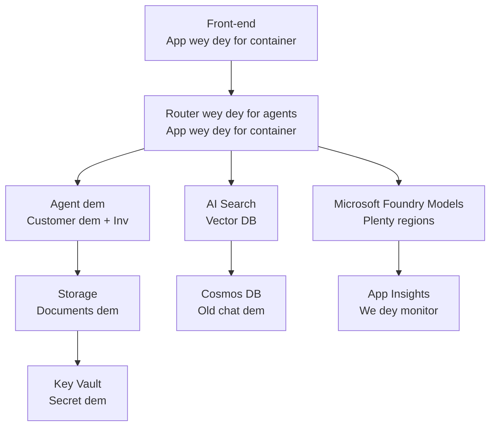

# Retail Multi-Agent Solution - Infrastructure Template

**Chapta 5: Production Deployment Package**
- **📚 Course Home**: [AZD For Beginners](../../README.md)
- **📖 Related Chapta**: [Chapta 5: Multi-Agent AI Solutions](../../README.md#-chapter-5-multi-agent-ai-solutions-advanced)
- **📝 Scenario Guide**: [Complete Architecture](../retail-scenario.md)
- **🎯 Quick Deploy**: [One-Click Deployment](../../../../examples/retail-multiagent-arm-template)

> **⚠️ INFRASTRUCTURE TEMPLATE ONLY**  
> Dis ARM template go deploy **Azure resources** for multi-agent system.  
>  
> **Wetyn dis one go deploy (15-25 minutes):**
> - ✅ Microsoft Foundry Models (gpt-4.1, gpt-4.1-mini, embeddings across 3 regions)
> - ✅ AI Search service (empty, ready for index creation)
> - ✅ Container Apps (placeholder images, ready for your code)
> - ✅ Storage, Cosmos DB, Key Vault, Application Insights
>  
> **Wetyn NO dey inside (you go still need do development):**
> - ❌ Agent implementation code (Customer Agent, Inventory Agent)
> - ❌ Routing logic and API endpoints
> - ❌ Frontend chat UI
> - ❌ Search index schemas and data pipelines
> - ❌ **Estimated development effort: 80-120 hours**
>  
> **Use dis template if:**
> - ✅ You want provision Azure infrastructure for multi-agent project
> - ✅ You plan to develop agent implementation separate
> - ✅ You need production-ready infrastructure baseline
>  
> **No use if:**
> - ❌ You dey expect a working multi-agent demo immediately
> - ❌ You dey find complete application code examples

## Overview

Dis directory get comprehensive Azure Resource Manager (ARM) template wey go deploy di **infrastructure foundation** of one multi-agent customer support system. Di template go provision all necessary Azure services, configure dem well and connect dem, ready for your application development.

**After deployment, you go get:** Production-ready Azure infrastructure  
**To finish di system, you need:** Agent code, frontend UI, and data configuration (see [Architecture Guide](../retail-scenario.md))

## 🎯 Wetyn Dis One Go Deploy

### Core Infrastructure (Status After Deployment)

✅ **Microsoft Foundry Models Services** (Ready for API calls)
  - Primary region: gpt-4.1 deployment (20K TPM capacity)
  - Secondary region: gpt-4.1-mini deployment (10K TPM capacity)
  - Tertiary region: Text embeddings model (30K TPM capacity)
  - Evaluation region: gpt-4.1 grader model (15K TPM capacity)
  - **Status:** Fully functional - you fit make API calls immediately

✅ **Azure AI Search** (Empty - ready for configuration)
  - Vector search capabilities enabled
  - Standard tier with 1 partition, 1 replica
  - **Status:** Service dey run, but you must create index
  - **Action needed:** Create search index with your schema

✅ **Azure Storage Account** (Empty - ready for uploads)
  - Blob containers: `documents`, `uploads`
  - Secure configuration (HTTPS-only, no public access)
  - **Status:** Ready to receive files
  - **Action needed:** Upload your product data and documents

⚠️ **Container Apps Environment** (Placeholder images deployed)
  - Agent router app (nginx default image)
  - Frontend app (nginx default image)
  - Auto-scaling configured (0-10 instances)
  - **Status:** Running placeholder containers
  - **Action needed:** Build and deploy your agent applications

✅ **Azure Cosmos DB** (Empty - ready for data)
  - Database and container pre-configured
  - Optimized for low-latency operations
  - TTL enabled for automatic cleanup
  - **Status:** Ready to store chat history

✅ **Azure Key Vault** (Optional - ready for secrets)
  - Soft delete enabled
  - RBAC configured for managed identities
  - **Status:** Ready to store API keys and connection strings

✅ **Application Insights** (Optional - monitoring active)
  - Connected to Log Analytics workspace
  - Custom metrics and alerts configured
  - **Status:** Ready to receive telemetry from your apps

✅ **Document Intelligence** (Ready for API calls)
  - S0 tier for production workloads
  - **Status:** Ready to process uploaded documents

✅ **Bing Search API** (Ready for API calls)
  - S1 tier for real-time searches
  - **Status:** Ready for web search queries

### Deployment Modes

| Mode | OpenAI Capacity | Container Instances | Search Tier | Storage Redundancy | Best For |
|------|-----------------|---------------------|-------------|-------------------|----------|
| **Minimal** | 10K-20K TPM | 0-2 replicas | Basic | LRS (Local) | Dev/test, learning, proof-of-concept |
| **Standard** | 30K-60K TPM | 2-5 replicas | Standard | ZRS (Zone) | Production, moderate traffic (<10K users) |
| **Premium** | 80K-150K TPM | 5-10 replicas, zone-redundant | Premium | GRS (Geo) | Enterprise, high traffic (>10K users), 99.99% SLA |

**Cost Impact:**
- **Minimal → Standard:** ~4x cost increase ($100-370/mo → $420-1,450/mo)
- **Standard → Premium:** ~3x cost increase ($420-1,450/mo → $1,150-3,500/mo)
- **Choose based on:** Expected load, SLA requirements, budget constraints

**Capacity Planning:**
- **TPM (Tokens Per Minute):** Total across all model deployments
- **Container Instances:** Auto-scaling range (min-max replicas)
- **Search Tier:** Affects query performance and index size limits

## 📋 Prerequisites

### Required Tools
1. **Azure CLI** (version 2.50.0 or higher)
   ```bash
   az --version  # Check di version
   az login      # Confirm say na you be
   ```

2. **Active Azure subscription** with Owner or Contributor access
   ```bash
   az account show  # Check di subscription
   ```

### Required Azure Quotas

Before deployment, make sure quotas dey enough for your target regions:

```bash
# Check if Microsoft Foundry Models dey available for your region
az cognitiveservices account list-skus \
  --kind OpenAI \
  --location eastus2

# Make sure say OpenAI quota dey (example: gpt-4.1)
az cognitiveservices usage list \
  --location eastus2 \
  --query "[?name.value=='OpenAI.Standard.gpt-4.1']"

# Check if Container Apps get quota
az provider show \
  --namespace Microsoft.App \
  --query "resourceTypes[?resourceType=='managedEnvironments'].locations"
```

**Minimum Required Quotas:**
- **Microsoft Foundry Models:** 3-4 model deployments across regions
  - gpt-4.1: 20K TPM (Tokens Per Minute)
  - gpt-4.1-mini: 10K TPM
  - text-embedding-ada-002: 30K TPM
  - **Note:** gpt-4.1 fit get waitlist for some regions - check [model availability](https://learn.microsoft.com/azure/ai-services/openai/concepts/models)
- **Container Apps:** Managed environment + 2-10 container instances
- **AI Search:** Standard tier (Basic no good for vector search)
- **Cosmos DB:** Standard provisioned throughput

**If quota insufficient:**
1. Go to Azure Portal → Quotas → Request increase
2. Or use Azure CLI:
   ```bash
   az support tickets create \
     --ticket-name "OpenAI-Quota-Increase" \
     --severity "minimal" \
     --description "Request quota increase for Microsoft Foundry Models gpt-4.1 in eastus2"
   ```
3. Consider alternative regions with availability

## 🚀 Quick Deployment

### Option 1: Using Azure CLI

```bash
# Clone or download di template files
git clone <repository-url>
cd examples/retail-multiagent-arm-template

# Make di deployment script executable
chmod +x deploy.sh

# Deploy wit di default settings
./deploy.sh -g myResourceGroup

# Deploy for production wit di premium features
./deploy.sh -g myProdRG -e prod -m premium -l eastus2
```

### Option 2: Using Azure Portal

[](https://portal.azure.com/#create/Microsoft.Template/uri/https%3A%2F%2Fraw.githubusercontent.com%2Fmicrosoft%2Fazd-for-beginners%2Fmain%2Fexamples%2Fretail-multiagent-arm-template%2Fazuredeploy.json)

### Option 3: Using Azure CLI directly

```bash
# Make di resource group
az group create --name myResourceGroup --location eastus2

# Deploy di template
az deployment group create \
  --resource-group myResourceGroup \
  --template-file azuredeploy.json \
  --parameters azuredeploy.parameters.json
```

## ⏱️ Deployment Timeline

### Wetyn You Fit Expect

| Phase | Duration | What Happens |
|-------|----------|--------------||
| **Template Validation** | 30-60 seconds | Azure go validate ARM template syntax and parameters |
| **Resource Group Setup** | 10-20 seconds | Creates resource group (if needed) |
| **OpenAI Provisioning** | 5-8 minutes | Creates 3-4 OpenAI accounts and deploys models |
| **Container Apps** | 3-5 minutes | Creates environment and deploys placeholder containers |
| **Search & Storage** | 2-4 minutes | Provisions AI Search service and storage accounts |
| **Cosmos DB** | 2-3 minutes | Creates database and configures containers |
| **Monitoring Setup** | 2-3 minutes | Sets up Application Insights and Log Analytics |
| **RBAC Configuration** | 1-2 minutes | Configures managed identities and permissions |
| **Total Deployment** | **15-25 minutes** | Complete infrastructure ready |

**After Deployment:**
- ✅ **Infrastructure Ready:** All Azure services don deploy and dey run
- ⏱️ **Application Development:** 80-120 hours (na your work)
- ⏱️ **Index Configuration:** 15-30 minutes (you must provide schema)
- ⏱️ **Data Upload:** Time go depend on dataset size
- ⏱️ **Testing & Validation:** 2-4 hours

---

## ✅ Verify Deployment Success

### Step 1: Check Resource Provisioning (2 minutes)

```bash
# Make sure say all resources don deploy well
az resource list \
  --resource-group myResourceGroup \
  --query "[?provisioningState!='Succeeded'].{Name:name, Status:provisioningState, Type:type}" \
  --output table
```

**Expected:** Empty table (all resources go show "Succeeded" status)

### Step 2: Verify Microsoft Foundry Models Deployments (3 minutes)

```bash
# Make list of all OpenAI accounts
az cognitiveservices account list \
  --resource-group myResourceGroup \
  --query "[?kind=='OpenAI'].{Name:name, Location:location, Status:properties.provisioningState}" \
  --output table

# Check di model deployments for di primary region
OPENAI_NAME=$(az cognitiveservices account list \
  --resource-group myResourceGroup \
  --query "[?kind=='OpenAI'] | [0].name" -o tsv)

az cognitiveservices account deployment list \
  --name $OPENAI_NAME \
  --resource-group myResourceGroup \
  --output table
```

**Expected:** 
- 3-4 OpenAI accounts (primary, secondary, tertiary, evaluation regions)
- 1-2 model deployments per account (gpt-4.1, gpt-4.1-mini, text-embedding-ada-002)

### Step 3: Test Infrastructure Endpoints (5 minutes)

```bash
# Find di Container App URLs
az containerapp list \
  --resource-group myResourceGroup \
  --query "[].{Name:name, URL:properties.configuration.ingress.fqdn, Status:properties.runningStatus}" \
  --output table

# Test di router endpoint (placeholder image go respond)
ROUTER_URL=$(az containerapp show \
  --name retail-router \
  --resource-group myResourceGroup \
  --query "properties.configuration.ingress.fqdn" -o tsv)

echo "Testing: https://$ROUTER_URL"
curl -I https://$ROUTER_URL || echo "Container running (placeholder image - expected)"
```

**Expected:** 
- Container Apps go show "Running" status
- Placeholder nginx go respond with HTTP 200 or 404 (no application code yet)

### Step 4: Verify Microsoft Foundry Models API Access (3 minutes)

```bash
# Find di OpenAI endpoint and key
OPENAI_ENDPOINT=$(az cognitiveservices account show \
  --name $OPENAI_NAME \
  --resource-group myResourceGroup \
  --query "properties.endpoint" -o tsv)

OPENAI_KEY=$(az cognitiveservices account keys list \
  --name $OPENAI_NAME \
  --resource-group myResourceGroup \
  --query "key1" -o tsv)

# Test di gpt-4.1 deployment
curl "${OPENAI_ENDPOINT}openai/deployments/gpt-4.1/chat/completions?api-version=2024-08-01-preview" \
  -H "Content-Type: application/json" \
  -H "api-key: $OPENAI_KEY" \
  -d '{
    "messages": [{"role": "user", "content": "Say hello"}],
    "max_tokens": 10
  }'
```

**Expected:** JSON response with chat completion (confirms OpenAI dey functional)

### Wetyn Dey Work vs Wetyn No Dey Work

**✅ Wetyn Dey Work After Deployment:**
- Microsoft Foundry Models models don deploy and dem dey accept API calls
- AI Search service dey run (empty, no indexes yet)
- Container Apps dey run (placeholder nginx images)
- Storage accounts dey accessible and ready for uploads
- Cosmos DB ready for data operations
- Application Insights dey collect infrastructure telemetry
- Key Vault ready for secret storage

**❌ Wetyn Still No Work (You must do development):**
- Agent endpoints (no application code deploy)
- Chat functionality (you need frontend + backend implementation)
- Search queries (no search index don create)
- Document processing pipeline (no data don upload)
- Custom telemetry (you must add application instrumentation)

**Next Steps:** See [Post-Deployment Configuration](../../../../examples/retail-multiagent-arm-template) to develop and deploy your application

---

## ⚙️ Configuration Options

### Template Parameters

| Parameter | Type | Default | Description |
|-----------|------|---------|-------------|
| `projectName` | string | "retail" | Prefix for all resource names |
| `location` | string | Resource group location | Primary deployment region |
| `secondaryLocation` | string | "westus2" | Secondary region for multi-region deployment |
| `tertiaryLocation` | string | "francecentral" | Region for embeddings model |
| `environmentName` | string | "dev" | Environment designation (dev/staging/prod) |
| `deploymentMode` | string | "standard" | Deployment configuration (minimal/standard/premium) |
| `enableMultiRegion` | bool | true | Enable multi-region deployment |
| `enableMonitoring` | bool | true | Enable Application Insights and logging |
| `enableSecurity` | bool | true | Enable Key Vault and enhanced security |

### Customizing Parameters

Edit `azuredeploy.parameters.json`:

```json
{
  "$schema": "https://schema.management.azure.com/schemas/2019-04-01/deploymentParameters.json#",
  "contentVersion": "1.0.0.0",
  "parameters": {
    "projectName": {
      "value": "mycompany"
    },
    "environmentName": {
      "value": "prod"
    },
    "deploymentMode": {
      "value": "premium"
    },
    "location": {
      "value": "eastus2"
    }
  }
}
```

## 🏗️ Architecture Overview


## 📖 Deployment Script Usage

Di `deploy.sh` script dey give interactive deployment experience:

```bash
# Show how to use am
./deploy.sh --help

# Basic deploy
./deploy.sh -g myResourceGroup

# Advanced deploy wey get custom settings
./deploy.sh \
  -g myProductionRG \
  -p companyname \
  -e prod \
  -m premium \
  -l eastus2

# Development deploy wey no get multi-region
./deploy.sh \
  -g myDevRG \
  -e dev \
  -m minimal \
  --no-multi-region \
  --no-security
```

### Script Features

- ✅ **Prerequisites validation** (Azure CLI, login status, template files)
- ✅ **Resource group management** (go create if e no dey)
- ✅ **Template validation** before deployment
- ✅ **Progress monitoring** with colored output
- ✅ **Deployment outputs** display
- ✅ **Post-deployment guidance**

## 📊 Monitoring Deployment

### Check Deployment Status

```bash
# Show deployments dem
az deployment group list --resource-group myResourceGroup --output table

# Show deployment details dem
az deployment group show \
  --resource-group myResourceGroup \
  --name retail-deployment-YYYYMMDD-HHMMSS

# Dey watch how deployment dey go
az deployment group create \
  --resource-group myResourceGroup \
  --template-file azuredeploy.json \
  --parameters azuredeploy.parameters.json \
  --verbose
```

### Deployment Outputs

After successful deployment, di outputs wey you fit use include:

- **Frontend URL**: Public endpoint for the web interface
- **Router URL**: API endpoint for the agent router
- **OpenAI Endpoints**: Primary and secondary OpenAI service endpoints
- **Search Service**: Azure AI Search service endpoint
- **Storage Account**: Name of the storage account for documents
- **Key Vault**: Name of the Key Vault (if enabled)
- **Application Insights**: Name of the monitoring service (if enabled)

## 🔧 Post-Deployment: Next Steps
> **📝 Important:** Infrastructure don deploy, but na you suppose develop and deploy di application code.

### Phase 1: Develop Agent Applications (Na Your Responsibility)

The ARM template go create **empty Container Apps** wey get placeholder nginx images. You must:

**Required Development:**
1. **Agent Implementation** (30-40 hours)
   - Customer service agent wey get gpt-4.1 integration
   - Inventory agent wey get gpt-4.1-mini integration
   - Agent routing logic

2. **Frontend Development** (20-30 hours)
   - Chat interface UI (React/Vue/Angular)
   - File upload functionality
   - Response rendering and formatting

3. **Backend Services** (12-16 hours)
   - FastAPI or Express router
   - Authentication middleware
   - Telemetry integration

**See:** [Architecture Guide](../retail-scenario.md) for detailed implementation patterns and code examples

### Phase 2: Configure AI Search Index (15-30 minutes)

Create a search index wey match your data model:

```bash
# Find di search service details
SEARCH_NAME=$(az search service list \
  --resource-group myResourceGroup \
  --query "[0].name" -o tsv)

SEARCH_KEY=$(az search admin-key show \
  --service-name $SEARCH_NAME \
  --resource-group myResourceGroup \
  --query "primaryKey" -o tsv)

# Create index wit your schema (example)
curl -X POST "https://${SEARCH_NAME}.search.windows.net/indexes?api-version=2023-11-01" \
  -H "Content-Type: application/json" \
  -H "api-key: ${SEARCH_KEY}" \
  -d '{
    "name": "products",
    "fields": [
      {"name": "id", "type": "Edm.String", "key": true},
      {"name": "title", "type": "Edm.String", "searchable": true},
      {"name": "content", "type": "Edm.String", "searchable": true},
      {"name": "category", "type": "Edm.String", "filterable": true},
      {"name": "content_vector", "type": "Collection(Edm.Single)", 
       "searchable": true, "dimensions": 1536, "vectorSearchProfile": "default"}
    ],
    "vectorSearch": {
      "algorithms": [{"name": "default", "kind": "hnsw"}],
      "profiles": [{"name": "default", "algorithm": "default"}]
    }
  }'
```

**Resources:**
- [AI Search Index Schema Design](https://learn.microsoft.com/azure/search/search-what-is-an-index)
- [Vector Search Configuration](https://learn.microsoft.com/azure/search/vector-search-how-to-create-index)

### Phase 3: Upload Your Data (Time varies)

Once you don get product data and documents:

```bash
# Find di storage account details
STORAGE_NAME=$(az storage account list \
  --resource-group myResourceGroup \
  --query "[0].name" -o tsv)

STORAGE_KEY=$(az storage account keys list \
  --account-name $STORAGE_NAME \
  --resource-group myResourceGroup \
  --query "[0].value" -o tsv)

# Make you upload your documents
az storage blob upload-batch \
  --destination documents \
  --source /path/to/your/product/docs \
  --account-name $STORAGE_NAME \
  --account-key $STORAGE_KEY

# Example: Upload wan file
az storage blob upload \
  --container-name documents \
  --name "product-manual.pdf" \
  --file /path/to/product-manual.pdf \
  --account-name $STORAGE_NAME \
  --account-key $STORAGE_KEY
```

### Phase 4: Build and Deploy Your Applications (8-12 hours)

Once you don develop your agent code:

```bash
# 1. Make Azure Container Registry if you need am
az acr create \
  --name myregistry \
  --resource-group myResourceGroup \
  --sku Basic

# 2. Build and push di agent router image
docker build -t myregistry.azurecr.io/agent-router:v1 /path/to/your/router/code
az acr login --name myregistry
docker push myregistry.azurecr.io/agent-router:v1

# 3. Build and push di frontend image
docker build -t myregistry.azurecr.io/frontend:v1 /path/to/your/frontend/code
docker push myregistry.azurecr.io/frontend:v1

# 4. Update Container Apps wit your images
az containerapp update \
  --name retail-router \
  --resource-group myResourceGroup \
  --image myregistry.azurecr.io/agent-router:v1

az containerapp update \
  --name retail-frontend \
  --resource-group myResourceGroup \
  --image myregistry.azurecr.io/frontend:v1

# 5. Set up di environment variables
az containerapp update \
  --name retail-router \
  --resource-group myResourceGroup \
  --set-env-vars \
    OPENAI_ENDPOINT=secretref:openai-endpoint \
    OPENAI_KEY=secretref:openai-key \
    SEARCH_ENDPOINT=secretref:search-endpoint \
    SEARCH_KEY=secretref:search-key
```

### Phase 5: Test Your Application (2-4 hours)

```bash
# Find ya app URL
ROUTER_URL=$(az containerapp show \
  --name retail-router \
  --resource-group myResourceGroup \
  --query "properties.configuration.ingress.fqdn" -o tsv)

# Test agent endpoint (once ya code don deploy)
curl -X POST "https://${ROUTER_URL}/chat" \
  -H "Content-Type: application/json" \
  -d '{
    "message": "Hello, I need help with my order",
    "agent": "customer"
  }'

# Check ya app logs
az containerapp logs show \
  --name retail-router \
  --resource-group myResourceGroup \
  --follow
```

### Implementation Resources

**Architecture & Design:**
- 📖 [Complete Architecture Guide](../retail-scenario.md) - Detailed implementation patterns
- 📖 [Multi-Agent Design Patterns](https://learn.microsoft.com/azure/architecture/ai-ml/guide/multi-agent-systems)

**Code Examples:**
- 🔗 [Microsoft Foundry Models Chat Sample](https://github.com/Azure-Samples/azure-search-openai-demo) - RAG pattern
- 🔗 [Semantic Kernel](https://github.com/microsoft/semantic-kernel) - Agent framework (C#)
- 🔗 [LangChain Azure](https://github.com/langchain-ai/langchain) - Agent orchestration (Python)
- 🔗 [AutoGen](https://github.com/microsoft/autogen) - Multi-agent conversations

**Estimated Total Effort:**
- Infrastructure deployment: 15-25 minutes (✅ Done)
- Application development: 80-120 hours (🔨 Na your work)
- Testing and optimization: 15-25 hours (🔨 Na your work)

## 🛠️ Troubleshooting

### Common Issues

#### 1. Microsoft Foundry Models Quota Exceeded

```bash
# Check how much quota we don use now
az cognitiveservices usage list --location eastus2

# Ask make dem give more quota
az support tickets create \
  --ticket-name "OpenAI-Quota-Increase" \
  --severity "minimal" \
  --description "Request quota increase for Microsoft Foundry Models in region X"
```

#### 2. Container Apps Deployment Failed

```bash
# Check di container app logs
az containerapp logs show \
  --name retail-router \
  --resource-group myResourceGroup \
  --follow

# Restart di container app
az containerapp revision restart \
  --name retail-router \
  --resource-group myResourceGroup
```

#### 3. Search Service Initialization

```bash
# Check if search service dey
az search service show \
  --name <search-service-name> \
  --resource-group myResourceGroup

# Test if search service connection dey
curl -X GET "https://<search-service-name>.search.windows.net/indexes?api-version=2023-11-01" \
  -H "api-key: <search-admin-key>"
```

### Deployment Validation

```bash
# Make sure say all resources don create
az resource list \
  --resource-group myResourceGroup \
  --output table

# Check if resource dey healthy
az resource list \
  --resource-group myResourceGroup \
  --query "[?provisioningState!='Succeeded'].{Name:name, Status:provisioningState, Type:type}" \
  --output table
```

## 🔐 Security Considerations

### Key Management
- All secrets dey stored for Azure Key Vault (if e enable)
- Container apps dey use managed identity for authentication
- Storage accounts get secure defaults (HTTPS only, no public blob access)

### Network Security
- Container apps dey use internal networking where possible
- Search service configure with private endpoints option
- Cosmos DB configure with minimal necessary permissions

### RBAC Configuration
```bash
# Give di managed identity all di roles wey e need
az role assignment create \
  --assignee <container-app-managed-identity> \
  --role "Cognitive Services OpenAI User" \
  --scope <openai-resource-id>
```

## 💰 Cost Optimization

### Cost Estimates (Monthly, USD)

| Mode | OpenAI | Container Apps | Search | Storage | Total Est. |
|------|--------|----------------|--------|---------|------------|
| Minimal | $50-200 | $20-50 | $25-100 | $5-20 | $100-370 |
| Standard | $200-800 | $100-300 | $100-300 | $20-50 | $420-1450 |
| Premium | $500-2000 | $300-800 | $300-600 | $50-100 | $1150-3500 |

### Cost Monitoring

```bash
# Make alert dem for your bajet
az consumption budget create \
  --account-name <subscription-id> \
  --budget-name "retail-budget" \
  --amount 500 \
  --time-grain Monthly \
  --start-date 2024-01-01 \
  --end-date 2024-12-31
```

## 🔄 Updates and Maintenance

### Template Updates
- Put the ARM template files under version control
- Test changes for development environment first
- Use incremental deployment mode for updates

### Resource Updates
```bash
# Update wit new parameter dem
az deployment group create \
  --resource-group myResourceGroup \
  --template-file azuredeploy.json \
  --parameters azuredeploy.parameters.json \
  --mode Incremental
```

### Backup and Recovery
- Cosmos DB automatic backup dey enabled
- Key Vault soft delete dey enabled
- Container app revisions dey maintained for rollback

## 📞 Support

- **Template Issues**: [GitHub Issues](https://github.com/microsoft/azd-for-beginners/issues)
- **Azure Support**: [Azure Support Portal](https://portal.azure.com/#blade/Microsoft_Azure_Support/HelpAndSupportBlade)
- **Community**: [Azure AI Discord](https://discord.gg/microsoft-azure)

---

**⚡ You ready to deploy your multi-agent solution?**

Start with: `./deploy.sh -g myResourceGroup`

---

<!-- CO-OP TRANSLATOR DISCLAIMER START -->
Disclaimer:
Dis dokument don translate by AI translation service [Co-op Translator] (https://github.com/Azure/co-op-translator). Even though we dey try make am correct, abeg note say automated translations fit get mistakes or no too accurate. Di original dokument for im original language suppose be di main/authoritative source. If na important information, make una use professional human translator. We no dey responsible for any misunderstanding or wrong interpretation wey fit come from this translation.
<!-- CO-OP TRANSLATOR DISCLAIMER END -->