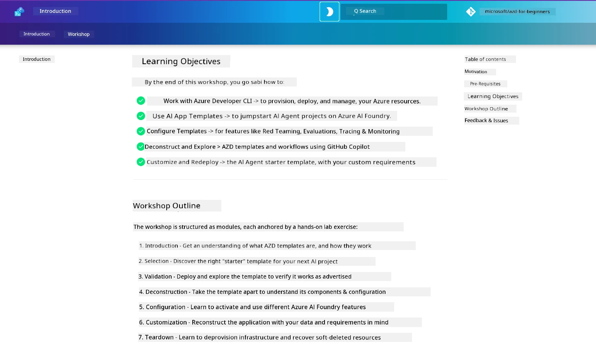

<div align="center">
  <div style="background: linear-gradient(135deg, #0078d4, #106ebe); border-radius: 10px; padding: 20px; margin: 20px 0; box-shadow: 0 4px 15px rgba(0, 120, 212, 0.3); border: 2px solid #005a9e;">
    <h2 style="color: white; margin: 0; font-size: 24px; text-shadow: 1px 1px 2px rgba(0,0,0,0.3);">
      🎯 AZD for AI Developers Workshop
    </h2>
    <p style="color: white; margin: 10px 0 0 0; font-size: 16px; text-shadow: 1px 1px 2px rgba(0,0,0,0.3);">
      <strong>Na hands-on workshop wey go show you how to build AI applications with Azure Developer CLI.</strong><br>
      Finish 7 modules make you sabi AZD templates and how to deploy AI workflows.
    </p>
    <div style="margin-top: 15px;">
      <span style="background: rgba(255,255,255,0.2); padding: 5px 10px; border-radius: 15px; color: white; font-size: 14px;">
        📅 Last Updated: February 2026
      </span>
    </div>
  </div>
</div>

# AZD for AI Developers Workshop

Welcome to the hands-on workshop for learning Azure Developer CLI (AZD) with a focus on AI application deployment. This workshop helps you gain an applied understanding of AZD templates in 3 steps:

1. **Discovery** - find the template that is right for you.
1. **Deployment** - deploy and validate that it works
1. **Customization** - modify and iterate to make it yours!

Over the course of this workshop, you will also be introduced to core developer tools and workflows, to help you streamline your end-to-end development journey.

<br/>

## Browser-Based Guide

The workshop lessons are in Markdown. You can navigate them directly in GitHub - or launch a browser-based preview as shown in the screenshot below.



To use this option - fork the repository to your profile, and launch GitHub Codespaces. Once the VS Code terminal is active, type this command:

```bash title="" linenums="0"
mkdocs serve > /dev/null 2>&1 &
```

In a few seconds, you will see a pop-up dialog. Select the option to `Open in browser`. The web-based guide will now open in a new browser tab. Some benefits of this preview:

1. **Built-in search** - find keywords or lessons quickly.
1. **Copy icon** - hover over codeblocks to see this option
1. **Theme toggle** - switch between dark and light themes
1. **Get help** - click the Discord icon in footer to join!

<br/>

## Workshop Overview

**Duration:** 3-4 hours  
**Level:** Beginner to Intermediate  
**Prerequisites:** Familiarity with Azure, AI concepts, VS Code & command-line tools.

This na hands-on workshop wey you go learn by doing. When you finish the exercises, we recommend make you check the AZD For Beginners curriculum to continue your learning journey into Security and Productivity best practices.

| Time| Module  | Objective |
|:---|:---|:---|
| 15 mins | [Introduction](docs/instructions/0-Introduction.md) | Set di stage, sabi wetin we dey try achieve |
| 30 mins | [Select AI Template](docs/instructions/1-Select-AI-Template.md) | Explore options and pick starter | 
| 30 mins | [Validate AI Template](docs/instructions/2-Validate-AI-Template.md) | Deploy default solution to Azure |
| 30 mins | [Deconstruct AI Template](docs/instructions/3-Deconstruct-AI-Template.md) | Explore structure and configuration |
| 30 mins | [Configure AI Template](docs/instructions/4-Configure-AI-Template.md) | Activate and try available features |
| 30 mins | [Customize AI Template](docs/instructions/5-Customize-AI-Template.md) | Adapt the template to your needs |
| 30 mins | [Teardown Infrastructure](docs/instructions/6-Teardown-Infrastructure.md) | Cleanup and release resources |
| 15 mins | [Wrap-Up & Next Steps](docs/instructions/7-Wrap-up.md) | Learning resources, Workshop challenge |

<br/>

## What You'll Learn

Think of the AZD Template as a learning sandbox to explore various capabilities and tools for end-to-end development on Microsoft Foundry. By the end of this workshop, you should have an intuitive sense for various tools and concepts in this context.

| Concept  | Objective |
|:---|:---|
| **Azure Developer CLI** | Understand tool commands and workflows|
| **AZD Templates**| Understand project structure and config|
| **Azure AI Agent**| Provision & deploy Microsoft Foundry project  |
| **Azure AI Search**| Enable context engineering with agents |
| **Observability**| Explore tracing, monitoring and evaluations |
| **Red Teaming**| Explore adversarial testing and mitigations |

<br/>

## Workshop Structure

The workshop is structured to take you on a journey from template discovery, to deployment, deconstruction, and customization - using the official [Getting Started with AI Agents](https://github.com/Azure-Samples/get-started-with-ai-agents) starter template as the basis.

### [Module 1: Select AI Template](docs/instructions/1-Select-AI-Template.md) (30 mins)

- Wetin be AI Templates?
- Where you fit find AI Templates?
- How you go take start to build AI Agents?
- **Lab**: Quickstart with GitHub Codespaces

### [Module 2: Validate AI Template](docs/instructions/2-Validate-AI-Template.md) (30 mins)

- Wetin be the AI Template Architecture?
- Wetin be the AZD Development Workflow?
- How you fit get help with AZD Development?
- **Lab**: Deploy & Validate AI Agents template

### [Module 3: Deconstruct AI Template](docs/instructions/3-Deconstruct-AI-Template.md) (30 mins)

- Explore your environment in `.azure/` 
- Explore your resource setup in `infra/` 
- Explore your AZD configuration in `azure.yaml`s
- **Lab**: Modify Environment Variables & Redeploy

### [Module 4: Configure AI Template](docs/instructions/4-Configure-AI-Template.md) (30 mins)
- Explore: Retrieval Augmented Generation
- Explore: Agent Evaluation & Red Teaming
- Explore: Tracing & Monitoring
- **Lab**: Explore AI Agent + Observability 

### [Module 5: Customize AI Template](docs/instructions/5-Customize-AI-Template.md) (30 mins)
- Define: PRD with Scenario Requirements
- Configure: Environment Variables for AZD
- Implement: Lifecycle Hooks for added tasks
- **Lab**: Customize template for my scenario

### [Module 6: Teardown Infrastructure](docs/instructions/6-Teardown-Infrastructure.md) (30 mins)
- Recap: What are AZD Templates?
- Recap: Why use Azure Developer CLI?
- Next Steps: Try a different template!
- **Lab**: Deprovision infrastructure & cleanup

<br/>

## Workshop Challenge

Wey you wan challenge yourself do more? Here be some project ideas - or share your own ideas with us!!

| Project | Description |
|:---|:---|
|1. **Deconstruct A Complex AI Template** | Use the workflow and tools we outline make you try deploy, validate, and customize another AI solution template. _Wetin you learn?_|
|2. **Customize With Your Scenario**  | Try write PRD (Product Requirements Document) for another scenario. Then use GitHub Copilot inside your template repo for Agent Model - and ask am to generate a customization workflow for you. _Wetin you learn? How you fit improve these ideas?_|
| | |

## Have feedback?

1. Post an issue on this repo - tag am `Workshop` so e go easy.
1. Join the Microsoft Foundry Discord - connect with other people like you!


| | | 
|:---|:---|
| **📚 Course Home**| [AZD For Beginners](../README.md)|
| **📖 Documentation** | [Get started with AI templates](https://learn.microsoft.com/en-us/azure/ai-foundry/how-to/develop/ai-template-get-started)|
| **🛠️AI Templates** | [Microsoft Foundry Templates](https://ai.azure.com/templates) |
|**🚀 Next Steps** | [Begin Workshop](../../../workshop) |
| | |

<br/>

---

**Navigation:** [Main Course](../README.md) | [Introduction](docs/instructions/0-Introduction.md) | [Module 1: Select Template](docs/instructions/1-Select-AI-Template.md)

**Ready to start building AI applications with AZD?**

[Begin Workshop: Introduction →](docs/instructions/0-Introduction.md)

---

<!-- CO-OP TRANSLATOR DISCLAIMER START -->
Disclaimer:
Dis document na AI translation dem use translate (Co‑op Translator: https://github.com/Azure/co-op-translator). We dey try make everything correct, but abeg note say automated translation fit get mistakes or wrong sense. The original document for im original language na the authority one. If na serious matter, make you use professional human translator. We no dey responsible for any misunderstanding or wrong interpretation wey fit come from this translation.
<!-- CO-OP TRANSLATOR DISCLAIMER END -->