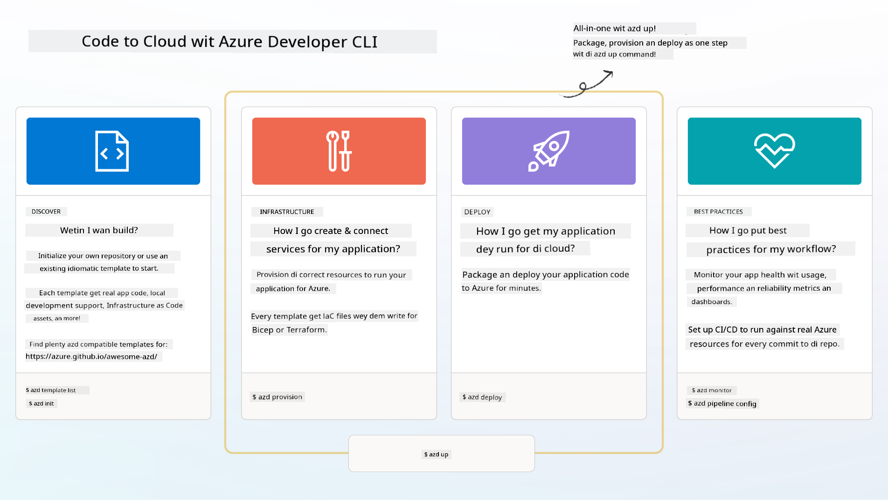

<!--
CO_OP_TRANSLATOR_METADATA:
{
  "original_hash": "06d6207eff634aefcaa41739490a5324",
  "translation_date": "2025-11-18T19:04:06+00:00",
  "source_file": "workshop/docs/instructions/1-Select-AI-Template.md",
  "language_code": "pcm"
}
-->
# 1. Choose Template

!!! tip "BY THE END OF THIS MODULE YOU GO FIT DO"

    - [ ] Explain wetin AZD templates be
    - [ ] Find and use AZD templates for AI
    - [ ] Start work with the AI Agents template
    - [ ] **Lab 1:** AZD Quickstart with GitHub Codespaces

---

## 1. Builder Analogy

To build modern enterprise-ready AI app _from scratch_ fit dey hard. E be like say you wan build your new house by yourself, block by block. Yes, e fit happen! But e no be the best way to get the result wey you dey find!

Instead, we dey start with one _design blueprint_ wey don already dey, then we go work with architect to adjust am to fit our own needs. Na the same way we go take build smart apps. First, find better design architecture wey go fit your problem. Then work with solution architect to adjust and develop the solution for your own case.

But where we go fit find these design blueprints? And how we go fit find architect wey go teach us how to adjust and deploy these blueprints by ourselves? For this workshop, we go answer those questions by introducing you to three technologies:

1. [Azure Developer CLI](https://aka.ms/azd) - open-source tool wey go make developer journey fast from local development (build) to cloud deployment (ship).
1. [Azure AI Foundry Templates](https://ai.azure.com/templates) - open-source repositories wey get sample code, infrastructure and configuration files for deploying AI solution architecture.
1. [GitHub Copilot Agent Mode](https://code.visualstudio.com/docs/copilot/chat/chat-agent-mode) - coding agent wey sabi Azure well, wey fit guide us to understand the codebase and make changes - using natural language.

With these tools, we fit now _find_ the correct template, _deploy_ am to confirm say e dey work, and _adjust_ am to fit our own case. Make we enter and learn how e dey work.

---

## 2. Azure Developer CLI

The [Azure Developer CLI](https://learn.microsoft.com/en-us/azure/developer/azure-developer-cli/) (or `azd`) na open-source commandline tool wey go make your code-to-cloud journey fast with developer-friendly commands wey dey work well for your IDE (development) and CI/CD (devops) environments.

With `azd`, your deployment journey fit be as simple as:

- `azd init` - E go start new AI project from AZD template wey don already dey.
- `azd up` - E go setup infrastructure and deploy your app in one step.
- `azd monitor` - E go give you live monitoring and diagnostics for your deployed app.
- `azd pipeline config` - E go setup CI/CD pipelines to make deployment to Azure automatic.

**🎯 | EXERCISE**: <br/> Try the `azd` commandline tool for your GitHub Codespaces environment now. Start by typing this command to see wetin the tool fit do:

```bash title="" linenums="0"
azd help
```


---

## 3. The AZD Template

For `azd` to work well, e need to know the infrastructure to setup, the configuration settings to use, and the app to deploy. Na here [AZD templates](https://learn.microsoft.com/en-us/azure/developer/azure-developer-cli/azd-templates?tabs=csharp) dey enter.

AZD templates na open-source repositories wey join sample code with infrastructure and configuration files wey dey needed to deploy solution architecture.  
By using _Infrastructure-as-Code_ (IaC) approach, e dey make template resource definitions and configuration settings dey version-controlled (just like app source code) - e dey create reusable and consistent workflows for people wey dey use that project.

When you dey create or dey use AZD template for _your_ case, think about these questions:

1. Wetin you dey build? → E get template wey get starter code for that case?
1. How dem design your solution? → E get template wey get the resources wey you need?
1. How dem dey deploy your solution? → Think `azd deploy` with pre/post-processing hooks!
1. How you fit make am better? → Think built-in monitoring and automation pipelines!

**🎯 | EXERCISE**: <br/> 
Go the [Awesome AZD](https://azure.github.io/awesome-azd/) gallery and use the filters to check the 250+ templates wey dey available. See if you fit find one wey match _your_ case needs.



---

## 4. AI App Templates

---

<!-- CO-OP TRANSLATOR DISCLAIMER START -->
**Disclaimer**:  
Dis dokyument don use AI translation service [Co-op Translator](https://github.com/Azure/co-op-translator) do di translation. Even as we dey try make am accurate, abeg make you sabi say machine translation fit get mistake or no dey correct well. Di original dokyument wey dey im native language na di main source wey you go trust. For important information, e better make professional human translator check am. We no go fit take blame for any misunderstanding or wrong interpretation wey fit happen because you use dis translation.
<!-- CO-OP TRANSLATOR DISCLAIMER END -->