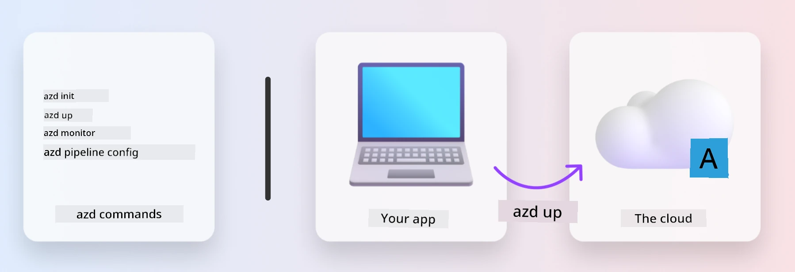
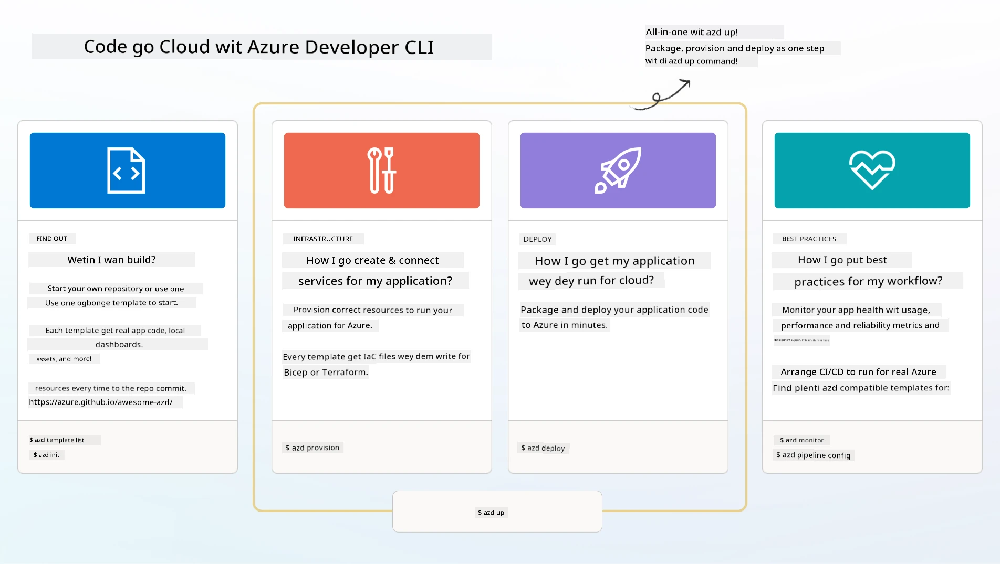

# 1. Choose Template

!!! tip "BY THE END OF THIS MODULE YOU GO FIT DO"

    - [ ] Explain wetin AZD templates be
    - [ ] Find and use AZD templates for AI
    - [ ] Start with the AI Agents template
    - [ ] **Lab 1:** AZD Quickstart with GitHub Codespaces

---

## 1. A Builder Analogy

Building a modern enterprise-ready AI application _from scratch_ fit stress. E small like to dey build your new house by yourself, brick by brick. Yes, e fit happen! But e no be the best way to reach the result wey you want!

Instead, we dey often start with existing _design blueprint_, and work with an architect to customize am to our personal requirements. Na the same approach we dey use when we dey build intelligent applications. First, find correct design architecture wey match your problem space. Then work with solution architect to customize and develop the solution for your specific scenario.

But where we go find these design blueprints? And how we go find architect wey go ready to teach us how to customize and deploy these blueprints by ourselves? For this workshop, we go answer those questions by introducing you to three technologies:

1. [Azure Developer CLI](https://aka.ms/azd) - na open-source tool wey dey accelerate the developer path from local development (build) to cloud deployment (ship).
1. [Microsoft Foundry Templates](https://ai.azure.com/templates) - standardized open-source repositories wey get sample code, infrastructure and configuration files for deploying AI solution architecture.
1. [GitHub Copilot Agent Mode](https://code.visualstudio.com/docs/copilot/chat/chat-agent-mode) - coding agent wey get Azure knowledge inside, wey fit guide us to navigate the codebase and make changes using natural language.

With these tools for hand, we fit now _discover_ the right template, _deploy_ am to confirm say e dey work, and _customize_ am to suit our specific scenarios. Make we dive in and learn how dem dey work.


---

## 2. Azure Developer CLI

The [Azure Developer CLI](https://learn.microsoft.com/en-us/azure/developer/azure-developer-cli/) (or `azd`) na open-source commandline tool wey fit speed up your code-to-cloud journey with set of developer-friendly commands wey dey work steady across your IDE (development) and CI/CD (devops) environments.

With `azd`, your deployment journey fit simple like:

- `azd init` - Set up new AI project from existing AZD template.
- `azd up` - Provision infrastructure and deploy your application for one step.
- `azd monitor` - Get real-time monitoring and diagnostics for your deployed application.
- `azd pipeline config` - Set up CI/CD pipelines to automate deployment to Azure.

**🎯 | EXERCISE**: <br/> Explore the `azd` commandline tool in your GitHub Codespaces environment now. Start by typing this command to see what the tool fit do:

```bash title="" linenums="0"
azd help
```



---

## 3. The AZD Template

For `azd` to do this, e need sabi the infrastructure wey e go provision, the configuration settings wey e go enforce, and the application wey e go deploy. Na there [AZD templates](https://learn.microsoft.com/en-us/azure/developer/azure-developer-cli/azd-templates?tabs=csharp) enter.

AZD templates na open-source repositories wey blend sample code with infrastructure and configuration files wey dem need to deploy the solution architecture. By using _Infrastructure-as-Code_ (IaC) approach, dem allow template resource definitions and configuration settings to dey version-controlled (just like the app source code) - so e create reusable and consistent workflows across people wey dey use that project.

When you dey create or reuse AZD template for _your_ scenario, think about these questions:

1. Wetin you dey build? → De template get starter code for that scenario?
1. How your solution dey architected? → De template get the necessary resources?
1. How your solution dey deployed? → Think `azd deploy` with pre/post-processing hooks!
1. How you fit optimize am further? → Think built-in monitoring and automation pipelines!

**🎯 | EXERCISE**: <br/> 
Visit the [Awesome AZD](https://azure.github.io/awesome-azd/) gallery and use the filters to explore the 250+ templates wey dey available now. See if you fit find one wey align with _your_ scenario requirements.



---

## 4. AI App Templates

For AI-powered applications, Microsoft dey provide specialized templates wey feature **Microsoft Foundry** and **Foundry Agents**. These templates go speed your path to build intelligent, production-ready applications.

### Microsoft Foundry & Foundry Agents Templates

Select template wey dey below to deploy. Each template dey available on [Awesome AZD](https://azure.github.io/awesome-azd/) and you fit initialize am with one command.

| Template | Wetin E Dey Do | Deploy Command |
|----------|----------------|----------------|
| **[AI Chat with RAG](https://azure.github.io/awesome-azd/?tags=ai&tags=rag)** | Chat app wey use Retrieval Augmented Generation (RAG) with Microsoft Foundry | `azd init -t azure-samples/azure-search-openai-demo` |
| **[Foundry Agent Service Starter](https://azure.github.io/awesome-azd/?tags=ai&tags=agents)** | Build AI agents with Foundry Agents for autonomous task execution | `azd init -t azure-samples/foundry-agent-service-starter` |
| **[Multi-Agent Orchestration](https://azure.github.io/awesome-azd/?tags=ai&tags=agents)** | Coordinate multiple Foundry Agents for complex workflows | `azd init -t azure-samples/multi-agent-orchestration` |
| **[AI Document Intelligence](https://azure.github.io/awesome-azd/?tags=ai&tags=document)** | Extract and analyze documents using Microsoft Foundry models | `azd init -t azure-samples/ai-document-processing` |
| **[Conversational AI Bot](https://azure.github.io/awesome-azd/?tags=ai&tags=bot)** | Build intelligent chatbots with Microsoft Foundry integration | `azd init -t azure-samples/ai-chat-protocol` |
| **[AI Image Generation](https://azure.github.io/awesome-azd/?tags=ai&tags=dalle)** | Generate images using DALL-E via Microsoft Foundry | `azd init -t azure-samples/ai-image-generation` |
| **[Semantic Kernel Agent](https://azure.github.io/awesome-azd/?tags=ai&tags=semantic-kernel)** | AI agents wey use Semantic Kernel with Foundry Agents | `azd init -t azure-samples/semantic-kernel-agent` |
| **[AutoGen Multi-Agent](https://azure.github.io/awesome-azd/?tags=ai&tags=autogen)** | Multi-agent systems wey use the AutoGen framework | `azd init -t azure-samples/autogen-multi-agent` |

### Quick Start

1. **Browse templates**: Visit [https://azure.github.io/awesome-azd/](https://azure.github.io/awesome-azd/) and filter by `AI`, `Agents`, or `Microsoft Foundry`
2. **Select your template**: Choose one wey match your use case
3. **Initialize**: Run the `azd init` command for the template wey you choose
4. **Deploy**: Run `azd up` to provision and deploy

**🎯 | EXERCISE**: <br/>
Select one of the templates wey dey above based on your scenario:

- **Building a chatbot?** → Start with **AI Chat with RAG** or **Conversational AI Bot**
- **Need autonomous agents?** → Try **Foundry Agent Service Starter** or **Multi-Agent Orchestration**
- **Processing documents?** → Use **AI Document Intelligence**
- **Want AI coding assistance?** → Explore **Semantic Kernel Agent** or **AutoGen Multi-Agent**

```bash title="Example: Deploy the AI Chat with RAG template" linenums="0"
azd init -t azure-samples/azure-search-openai-demo
azd up
```

!!! info "Find More Templates"
    The [Awesome AZD Gallery](https://azure.github.io/awesome-azd/) get 250+ templates. Use the filters to find templates wey match your specific requirements for language, framework, and Azure services.

---

<!-- CO-OP TRANSLATOR DISCLAIMER START -->
Abeg note:
Dis document don translate by AI translation service Co-op Translator (https://github.com/Azure/co-op-translator). Even though we dey try make am correct, make you sabi say automated translation fit get errors or mistakes. The original document for e original language na the correct source. If na important matter, e better make human professional translator check am. We no dey responsible for any misunderstanding or wrong interpretation wey fit come from this translation.
<!-- CO-OP TRANSLATOR DISCLAIMER END -->