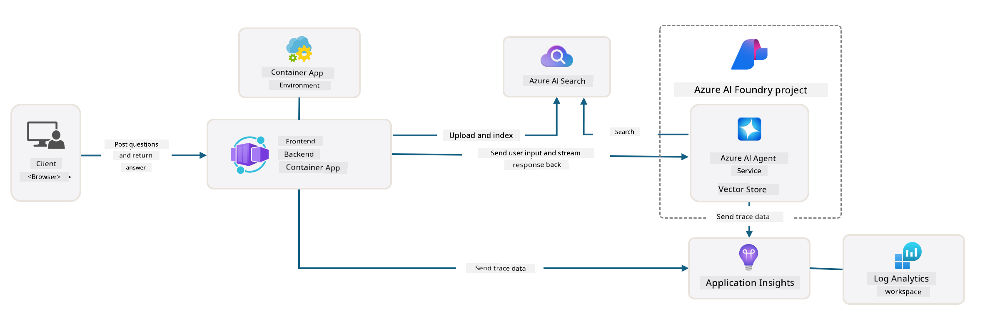
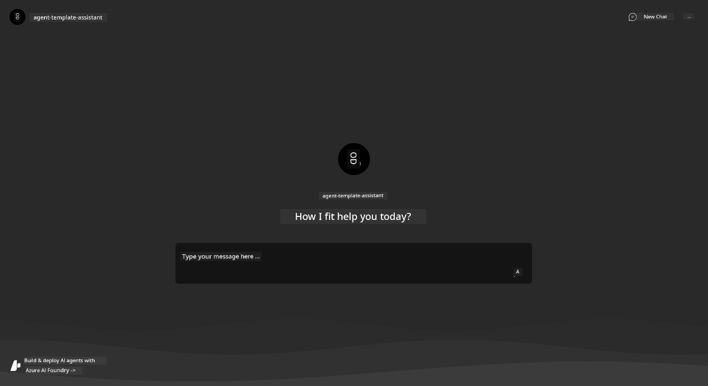
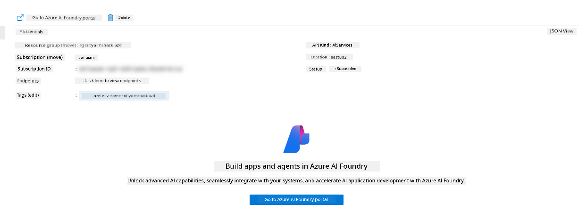
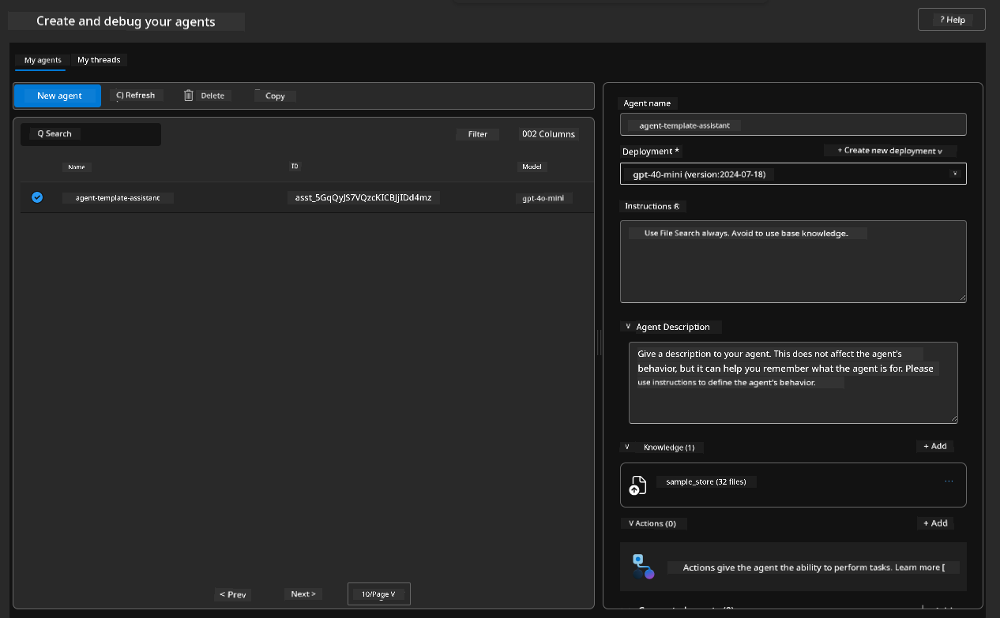
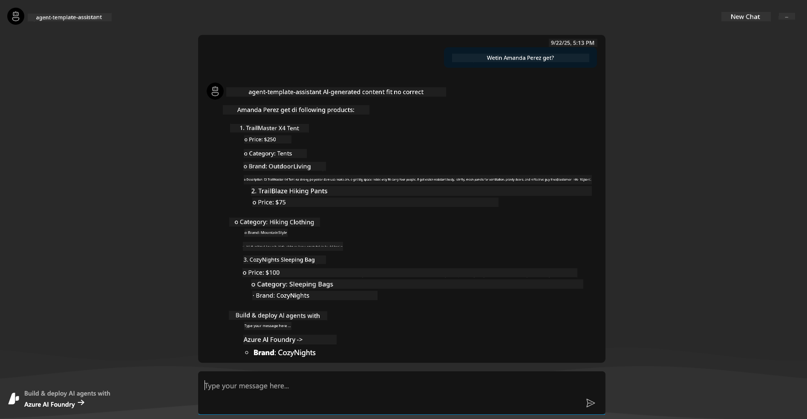
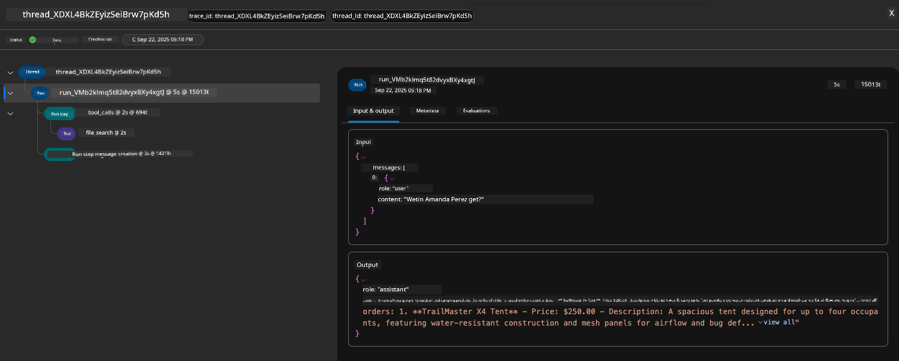

<!--
CO_OP_TRANSLATOR_METADATA:
{
  "original_hash": "7816c6ec50c694c331e7c6092371be4d",
  "translation_date": "2025-11-18T19:05:36+00:00",
  "source_file": "workshop/docs/instructions/2-Validate-AI-Template.md",
  "language_code": "pcm"
}
-->
# 2. Validate Template

!!! tip "BY THE END OF THIS MODULE YOU GO FIT DO"

    - [ ] Check AI Solution Architecture
    - [ ] Understand AZD Deployment Workflow
    - [ ] Use GitHub Copilot to get help for AZD usage
    - [ ] **Lab 2:** Deploy & Validate AI Agents template

---

## 1. Introduction

[Azure Developer CLI](https://learn.microsoft.com/en-us/azure/developer/azure-developer-cli/) or `azd` na open-source commandline tool wey dey make developer workflow easy when dem dey build and deploy apps go Azure.

[AZD Templates](https://learn.microsoft.com/azure/developer/azure-developer-cli/azd-templates) na standard repositories wey get sample app code, _infrastructure as code_ assets, and `azd` configuration files wey dey help create better solution architecture. To provision infrastructure, e go just be one `azd provision` command - and if you use `azd up`, e go provision infrastructure **plus** deploy your app at once!

So, to start your app development process, you fit just find the _AZD Starter template_ wey near your app and infrastructure needs - then adjust the repository to match your requirements.

Before we start, make sure say you don install Azure Developer CLI.

1. Open VS Code terminal and type this command:

      ```bash title="" linenums="0"
      azd version
      ```

1. You go see something like this!

      ```bash title="" linenums="0"
      azd version 1.19.0 (commit b3d68cea969b2bfbaa7b7fa289424428edb93e97)
      ```

**You don ready to select and deploy template with azd**

---

## 2. Template Selection

Azure AI Foundry platform get [recommended AZD templates](https://learn.microsoft.com/en-us/azure/ai-foundry/how-to/develop/ai-template-get-started) wey cover popular solution scenarios like _multi-agent workflow automation_ and _multi-modal content processing_. You fit also find these templates for Azure AI Foundry portal.

1. Visit [https://ai.azure.com/templates](https://ai.azure.com/templates)
1. Log into Azure AI Foundry portal when dem ask - you go see something like this.


The **Basic** options na your starter templates:

1. [ ] [Get Started with AI Chat](https://github.com/Azure-Samples/get-started-with-ai-chat) wey dey deploy basic chat app _with your data_ go Azure Container Apps. Use am to explore basic AI chatbot scenario.
1. [X] [Get Started with AI Agents](https://github.com/Azure-Samples/get-started-with-ai-agents) wey dey deploy standard AI Agent (with Azure AI Agent Service). Use am to sabi agentic AI solutions wey involve tools and models.

Visit the second link for new browser tab (or click `Open in GitHub` for the related card). You go see the repository for this AZD Template. Take one minute check the README. The app architecture go look like this:



---

## 3. Template Activation

Make we try deploy this template and confirm say e dey valid. We go follow the guidelines for [Getting Started](https://github.com/Azure-Samples/get-started-with-ai-agents?tab=readme-ov-file#getting-started) section.

1. Click [this link](https://github.com/codespaces/new/Azure-Samples/get-started-with-ai-agents) - confirm the default action to `Create codespace`
1. This go open new browser tab - wait make GitHub Codespaces session load finish
1. Open VS Code terminal for Codespaces - type this command:

   ```bash title="" linenums="0"
   azd up
   ```

Follow the workflow steps wey this go trigger:

1. Dem go ask you to log into Azure - follow instructions to authenticate
1. Enter unique environment name for yourself - e.g., I use `nitya-mshack-azd`
1. This go create `.azure/` folder - you go see subfolder with the env name
1. Dem go ask you to select subscription name - select the default
1. Dem go ask for location - use `East US 2`

Now, wait make provisioning complete. **E go take 10-15 minutes**

1. When e finish, your console go show SUCCESS message like this:
      ```bash title="" linenums="0"
      SUCCESS: Your up workflow to provision and deploy to Azure completed in 10 minutes 17 seconds.
      ```
1. Your Azure Portal go get provisioned resource group with that env name:

      

1. **You don ready to validate the deployed infrastructure and app**.

---

## 4. Template Validation

1. Visit Azure Portal [Resource Groups](https://portal.azure.com/#browse/resourcegroups) page - log in when dem ask
1. Click RG for your environment name - you go see the page above

      - click Azure Container Apps resource
      - click Application Url for _Essentials_ section (top right)

1. You go see hosted app front-end UI like this:

   

1. Try ask some [sample questions](https://github.com/Azure-Samples/get-started-with-ai-agents/blob/main/docs/sample_questions.md)

      1. Ask: ```What is the capital of France?``` 
      1. Ask: ```What's the best tent under $200 for two people, and what features does it include?```

1. You go get answers wey resemble wetin dey shown below. _But how e dey work?_ 

      

---

## 5. Agent Validation

Azure Container App dey deploy endpoint wey connect to AI Agent wey dem provision for Azure AI Foundry project for this template. Make we check wetin e mean.

1. Go back to Azure Portal _Overview_ page for your resource group

1. Click `Azure AI Foundry` resource for that list

1. You go see this. Click `Go to Azure AI Foundry Portal` button. 
   

1. You go see Foundry Project page for your AI app
   

1. Click `Agents` - you go see default Agent wey dem provision for your project
   

1. Select am - and you go see Agent details. Note these:

      - The agent dey use File Search by default (always)
      - The agent `Knowledge` show say e get 32 files uploaded (for file search)
      

1. Look for `Data+indexes` option for left menu and click for details. 

      - You go see the 32 data files wey dem upload for knowledge.
      - These go match the 12 customer files and 20 product files under `src/files` 
      

**You don validate Agent operation!** 

1. The agent responses dey based on the knowledge for those files. 
1. You fit now ask questions wey relate to that data, and get grounded responses.
1. Example: `customer_info_10.json` dey describe the 3 purchases wey "Amanda Perez" make.

Go back to browser tab with Container App endpoint and ask: `What products does Amanda Perez own?`. You go see something like this:



---

## 6. Agent Playground

Make we try understand more about wetin Azure AI Foundry fit do, by testing the Agent for Agents Playground. 

1. Go back to `Agents` page for Azure AI Foundry - select the default agent
1. Click `Try in Playground` option - you go get Playground UI like this
1. Ask the same question: `What products does Amanda Perez own?`

    

You go get the same (or similar) response - but you go also get extra info wey fit help you understand the quality, cost, and performance of your agentic app. For example:

1. Note say the response dey show data files wey dem use to "ground" the response
1. Hover over any of these file labels - e match your query and displayed response?

You go also see _stats_ row under the response. 

1. Hover over any metric - e.g., Safety. You go see something like this
1. E match your understanding of the response safety level?

      

---x

## 7. Built-in Observability

Observability na about how you go instrument your app to generate data wey fit help you understand, debug, and optimize how e dey work. To get sense for this:

1. Click `View Run Info` button - you go see this view. This na example of [Agent tracing](https://learn.microsoft.com/en-us/azure/ai-foundry/how-to/develop/trace-agents-sdk#view-trace-results-in-the-azure-ai-foundry-agents-playground) in action. _You fit also get this view by clicking Thread Logs for top-level menu_.

   - Get sense for the run steps and tools wey agent use
   - Understand total Token count (vs. output tokens usage) for response
   - Understand latency and where time dey spent for execution

      

1. Click `Metadata` tab to see extra attributes for the run, wey fit help debug issues later.   

      


1. Click `Evaluations` tab to see auto-assessments wey dem make for agent response. These include safety evaluations (e.g., Self-harm) and agent-specific evaluations (e.g., Intent resolution, Task adherence).

      

1. Last one, click `Monitoring` tab for sidebar menu.

      - Select `Resource usage` tab for displayed page - and view the metrics.
      - Track app usage in terms of costs (tokens) and load (requests).
      - Track app latency to first byte (input processing) and last byte (output).

      

---

## 8. Environment Variables

So far, we don go through the deployment for browser - and confirm say our infrastructure don provision and the app dey work. But to work with the app _code-first_, we need configure our local development environment with the correct variables wey we need to work with these resources. Using `azd` dey make am easy.

1. Azure Developer CLI [dey use environment variables](https://learn.microsoft.com/en-us/azure/developer/azure-developer-cli/manage-environment-variables?tabs=bash) to store and manage configuration settings for app deployments.

1. Environment variables dey stored for `.azure/<env-name>/.env` - this dey scope dem to the `env-name` environment wey you use during deployment and e dey help you separate environments between different deployment targets for the same repo.

1. Environment variables dey automatically loaded by `azd` command anytime e dey execute specific command (e.g., `azd up`). Note say `azd` no dey automatically read _OS-level_ environment variables (e.g., set for shell) - instead use `azd set env` and `azd get env` to transfer info inside scripts.


Make we try some commands:

1. Get all the environment variables wey `azd` set for this environment:

      ```bash title="" linenums="0"
      azd env get-values
      ```
      
      You go see something like:

      ```bash title="" linenums="0"
      AZURE_AI_AGENT_DEPLOYMENT_NAME="gpt-4o-mini"
      AZURE_AI_AGENT_NAME="agent-template-assistant"
      AZURE_AI_EMBED_DEPLOYMENT_NAME="text-embedding-3-small"
      AZURE_AI_EMBED_DIMENSIONS=100
      ...
      ```

1. Get specific value - e.g., I wan know if we set `AZURE_AI_AGENT_MODEL_NAME` value

      ```bash title="" linenums="0"
      azd env get-value AZURE_AI_AGENT_MODEL_NAME 
      ```
      
      You go see something like this - e no set by default!

      ```bash title="" linenums="0"
      ERROR: key 'AZURE_AI_AGENT_MODEL_NAME' not found in the environment values
      ```

1. Set new environment variable for `azd`. Here, we go update agent model name. _Note: any changes wey you make go show immediately for `.azure/<env-name>/.env` file.

      ```bash title="" linenums="0"
      azd env set AZURE_AI_AGENT_MODEL_NAME gpt-4.1
      azd env set AZURE_AI_AGENT_MODEL_VERSION 2025-04-14
      azd env set AZURE_AI_AGENT_DEPLOYMENT_CAPACITY 150
      ```

      Now, we go find say the value don set:

      ```bash title="" linenums="0"
      azd env get-value AZURE_AI_AGENT_MODEL_NAME 
      ```

1. Note say some resources dey persistent (e.g., model deployments) and e go need more than just `azd up` to force redeployment. Make we try tear down the original deployment and redeploy with changed env vars.

1. **Refresh** If you don deploy infrastructure before using azd template - you fit _refresh_ the state of your local environment variables based on the current state of your Azure deployment using this command:
      ```bash title="" linenums="0"
      azd env refresh
      ```

      Dis na strong way to _sync_ environment variables for two or more local development environments (e.g., team wey get plenty developers) - e go make di deployed infrastructure be di correct source for env variable state. Team members go just _refresh_ di variables to fit dey in sync again.

---

## 9. Congrats 🏆

You don finish one end-to-end workflow wey you:

- [X] Choose di AZD Template wey you wan use
- [X] Launch di Template with GitHub Codespaces 
- [X] Deploy di Template and confirm say e dey work

---

<!-- CO-OP TRANSLATOR DISCLAIMER START -->
**Disclaimer**:  
Dis dokyument don use AI transleto service [Co-op Translator](https://github.com/Azure/co-op-translator) do di translation. Even though we dey try make am accurate, abeg make you sabi say machine translation fit get mistake or no dey correct well. Di original dokyument wey dey for im native language na di main source wey you go fit trust. For important information, e good make professional human transleto check am. We no go fit take blame for any misunderstanding or wrong interpretation wey fit happen because you use dis translation.
<!-- CO-OP TRANSLATOR DISCLAIMER END -->