# 2. Validate a Template

> Validated against `azd 1.23.12` in March 2026.

!!! tip "BY THE END OF THIS MODULE YOU GO FIT DO"

    - [ ] Analyze the AI Solution Architecture
    - [ ] Understand the AZD Deployment Workflow
    - [ ] Use GitHub Copilot to get help on AZD usage
    - [ ] **Lab 2:** Deploy & Validate the AI Agents template

---


## 1. Introduction

The [Azure Developer CLI](https://learn.microsoft.com/en-us/azure/developer/azure-developer-cli/) or `azd` na open-source command-line tool wey dey make developer workflow easier when una dey build and deploy applications to Azure. 

[AZD Templates](https://learn.microsoft.com/azure/developer/azure-developer-cli/azd-templates) na standardized repositories wey dey include sample application code, _infrastructure-as-code_ assets, and `azd` configuration files for one coherent solution architecture. Provision the infrastructure fit be as simple as running `azd provision` command - while `azd up` go allow you provision infrastructure **and** deploy your application for one go!

As result, to jumpstart your application development fit jus be to find the correct _AZD Starter template_ wey near your application and infrastructure needs - then customize the repo to match your scenario.

Before we start, make sure say you don don install the Azure Developer CLI.

1. Open a VS Code terminal and type this command:

      ```bash title="" linenums="0"
      azd version
      ```

1. You go see something wey be like this!

      ```bash title="" linenums="0"
      azd version 1.23.12 (commit <current-build>)
      ```

**You don ready to select and deploy a template with azd**

---

## 2. Template Selection

The Microsoft Foundry platform get [set of recommended AZD templates](https://learn.microsoft.com/en-us/azure/ai-foundry/how-to/develop/ai-template-get-started) wey cover popular solution scenarios like _multi-agent workflow automation_ and _multi-modal content processing_. You fit also find these templates for the Microsoft Foundry portal.

1. Visit [https://ai.azure.com/templates](https://ai.azure.com/templates)
1. Log into the Microsoft Foundry portal when dem prompt you - you go see something like this.

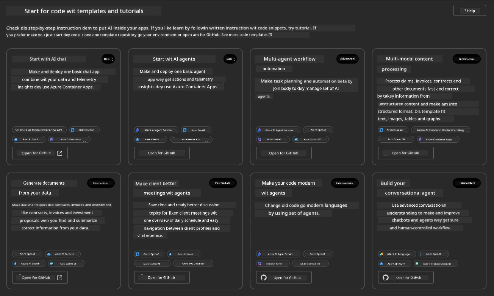


The **Basic** options na your starter templates:

1. [ ] [Get Started with AI Chat](https://github.com/Azure-Samples/get-started-with-ai-chat) wey deploy basic chat application _with your data_ to Azure Container Apps. Use this one to explore basic AI chatbot scenario.
1. [X] [Get Started with AI Agents](https://github.com/Azure-Samples/get-started-with-ai-agents) wey also deploy standard AI Agent (with the Foundry Agents). Use this one to sabi how agentic AI solutions dey work with tools and models.

Open the second link for new browser tab (or click `Open in GitHub` for the card). You go see the repository for this AZD Template. Take small time to check the README. The application architecture dey look like this:

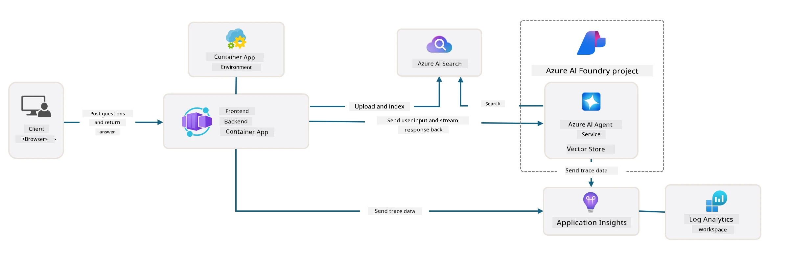

---

## 3. Template Activation

Make we try deploy this template make sure say e valid. We go follow the guidelines for the [Getting Started](https://github.com/Azure-Samples/get-started-with-ai-agents?tab=readme-ov-file#getting-started) section.

1. Choose where you go run the template repo:

      - **GitHub Codespaces**: Click [this link](https://github.com/codespaces/new/Azure-Samples/get-started-with-ai-agents) and confirm `Create codespace`
      - **Local clone or dev container**: Clone `Azure-Samples/get-started-with-ai-agents` and open am for VS Code

1. Wait until VS Code terminal don ready, then type the following command:

   ```bash title="" linenums="0"
   azd up
   ```

Complete the workflow steps wey this one go trigger:

1. Dem go prompt you to log into Azure - follow the instructions to authenticate
1. Enter one unique environment name for yourself - e.g., I use `nitya-mshack-azd`
1. This one go create `.azure/` folder - you go see subfolder wey get the env name
1. Dem go ask you to select subscription name - pick the default
1. Dem go ask you for a location - use `East US 2`

Now, wait make provisioning complete. **This go take 10-15 minutes**

1. When e done, your console go show SUCCESS message wey resemble this:
      ```bash title="" linenums="0"
      SUCCESS: Your up workflow to provision and deploy to Azure completed in 10 minutes 17 seconds.
      ```
1. Your Azure Portal go now get provisioned resource group wey get that env name:

      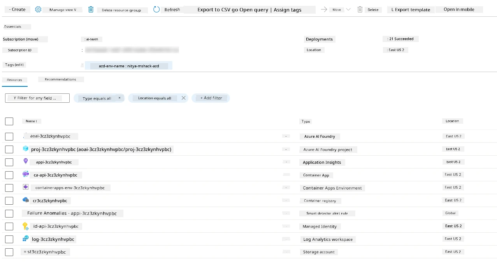

1. **You don ready now to validate the deployed infrastructure and application**.

---

## 4. Template Validation

1. Visit Azure Portal [Resource Groups](https://portal.azure.com/#browse/resourcegroups) page - log in when dem prompt you
1. Click the RG wey get your environment name - you go see the page wey dey above

      - click the Azure Container Apps resource
      - click the Application Url for the _Essentials_ section (top right)

1. You go see hosted application front-end UI wey resemble this:

   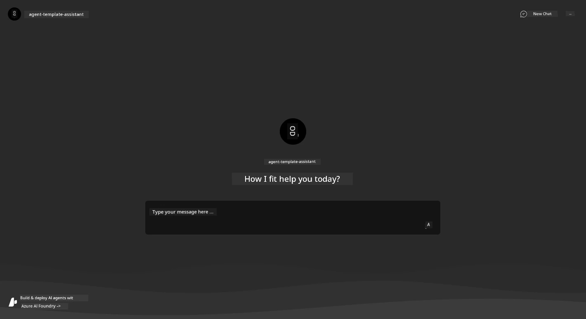

1. Try ask couple [sample questions](https://github.com/Azure-Samples/get-started-with-ai-agents/blob/main/docs/sample_questions.md)

      1. Ask: ```What is the capital of France?``` 
      1. Ask: ```What's the best tent under $200 for two people, and what features does it include?```

1. You go get answers wey similar to wetin dey shown below. _But how this thing dey work?_ 

      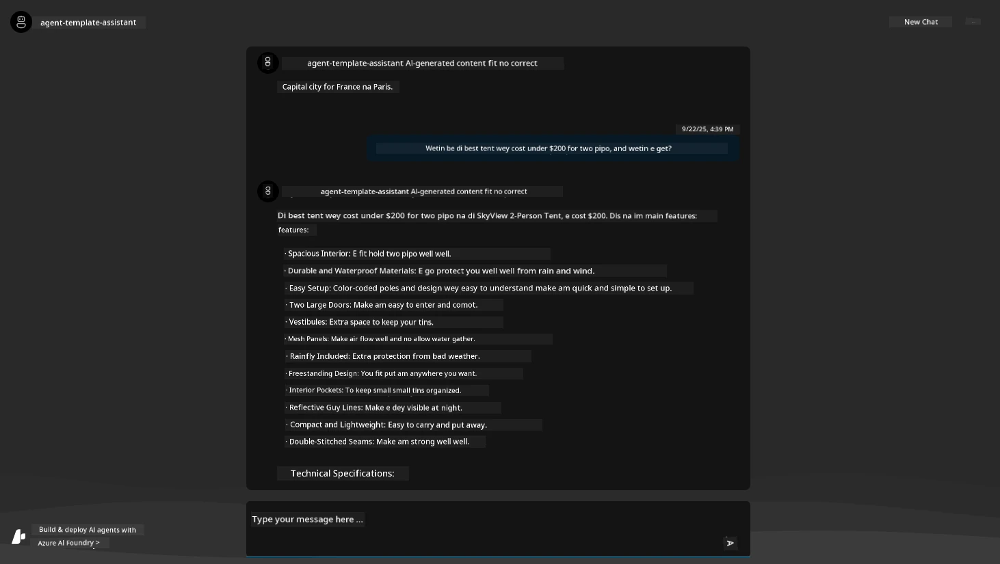

---

## 5.  Agent Validation

The Azure Container App don deploy endpoint wey connect to the AI Agent wey dem provision for the Microsoft Foundry project wey this template use. Make we check wetin that one mean.

1. Go back to the Azure Portal _Overview_ page for your resource group

1. Click the `Microsoft Foundry` resource for the list

1. You go see this. Click the `Go to Microsoft Foundry Portal` button. 
   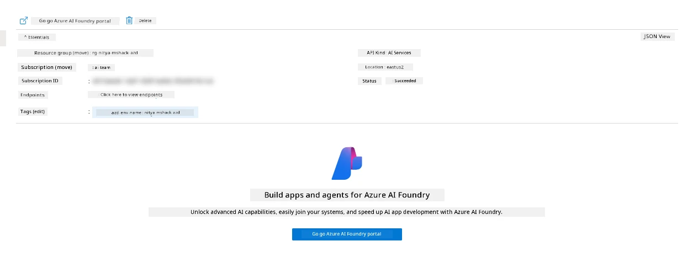

1. You go see the Foundry Project page for your AI application
   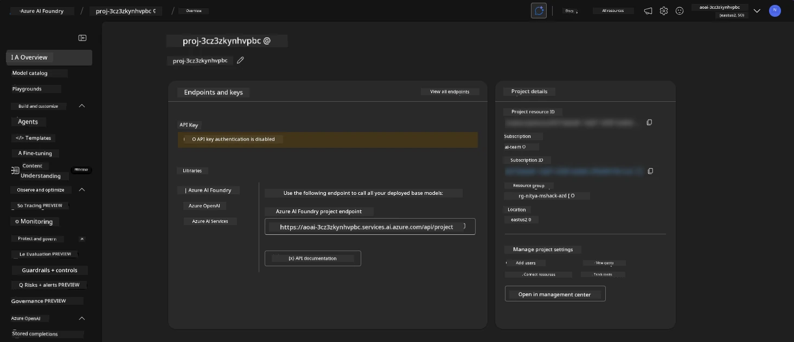

1. Click `Agents` - you go see the default Agent wey dem provision for your project
   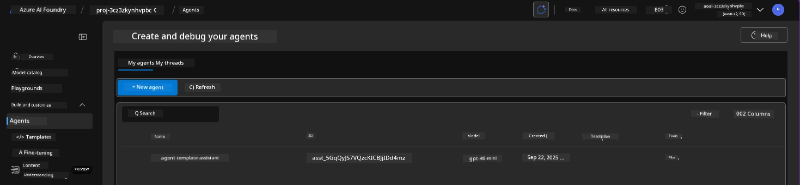

1. Select am - you go see the Agent details. Note these:

      - The agent dey use File Search by default (always)
      - The agent `Knowledge` dey show say e get 32 files uploaded (for file search)
      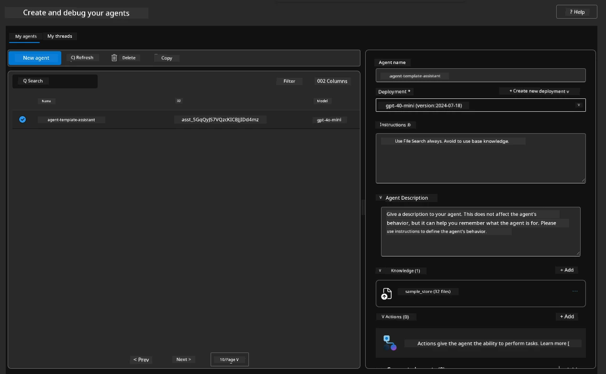

1. Look for `Data+indexes` option for left menu and click am for details. 

      - You go see the 32 data files wey dem upload for knowledge.
      - These ones go correspond to the 12 customer files and 20 product files under `src/files` 
      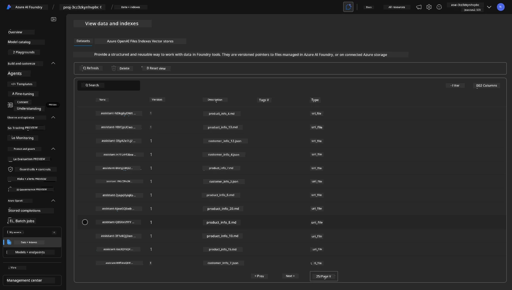

**You don validate Agent operation!** 

1. The agent responses dey grounded for the knowledge wey dey those files. 
1. Now you fit ask questions wey relate to that data, and get grounded responses.
1. Example: `customer_info_10.json` describe the 3 purchases wey "Amanda Perez" do

Return to the browser tab wey get the Container App endpoint and ask: `What products does Amanda Perez own?`. You go see something like this:

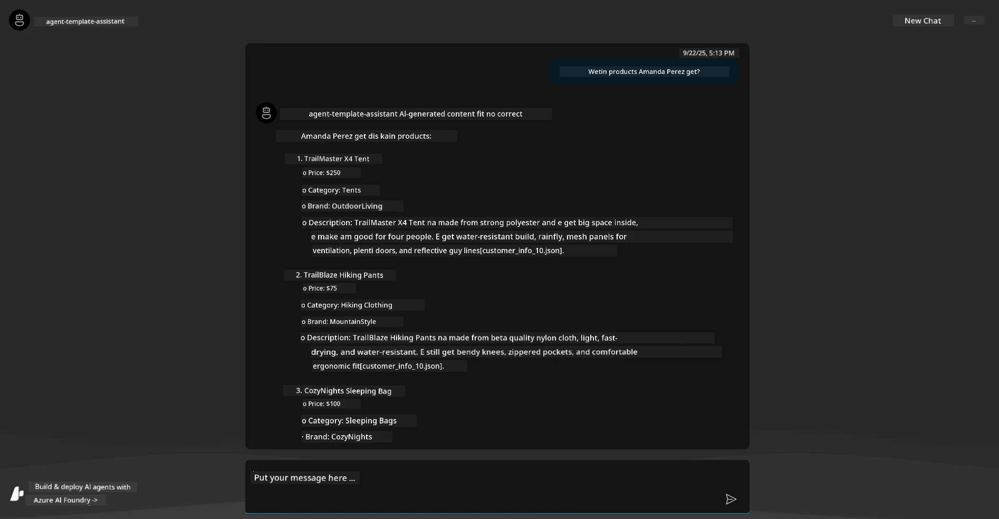

---

## 6. Agent Playground

Make we build small more sense for the capabilities of Microsoft Foundry, by dey run the Agent inside the Agents Playground. 

1. Go back to the `Agents` page for Microsoft Foundry - select the default agent
1. Click the `Try in Playground` option - you go get Playground UI wey look like this
1. Ask the same question: `What products does Amanda Perez own?`

    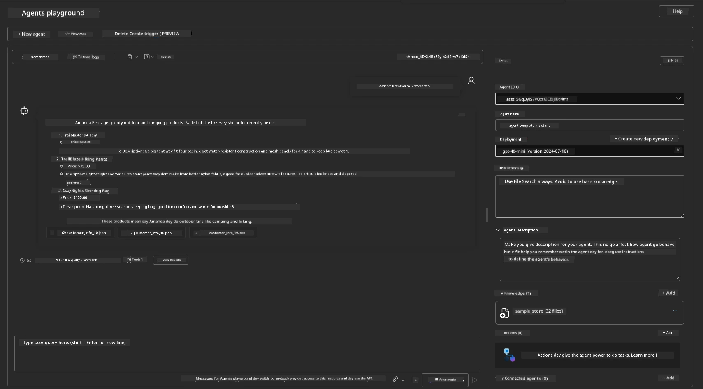

You go get the same (or similar) response - but you go also see extra information wey fit help you understand the quality, cost, and performance of your agentic app. For example:

1. Notice say the response dey cite data files wey dem use to "ground" the response
1. Hover over any of these file labels - the data dey match your query and the displayed response?

You go still see one _stats_ row below the response. 

1. Hover over any metric - e.g., Safety. You go see something like this
1. The assessed rating, e dey match your sense for the response safety level?

      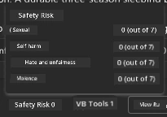

---

## 7. Built-in Observability

Observability mean to instrument your application make e produce data wey fit help you understand, debug, and optimize how e dey run. To get small idea for this:

1. Click the `View Run Info` button - you go see this view. Na example of [Agent tracing](https://learn.microsoft.com/en-us/azure/ai-foundry/how-to/develop/trace-agents-sdk#view-trace-results-in-the-azure-ai-foundry-agents-playground) for action. _You fit also get this view by clicking Thread Logs for the top-level menu_.

   - Try feel the run steps and the tools wey the agent use
   - Understand total Token count (versus output tokens usage) for the response
   - Understand latency and where time dey spent for execution

      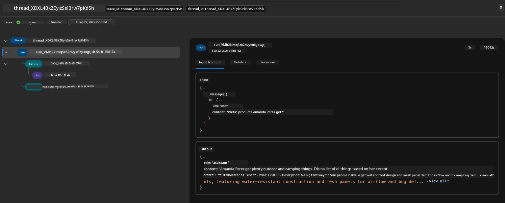

1. Click the `Metadata` tab to see extra attributes for the run, wey fit give useful context for debugging later.   

      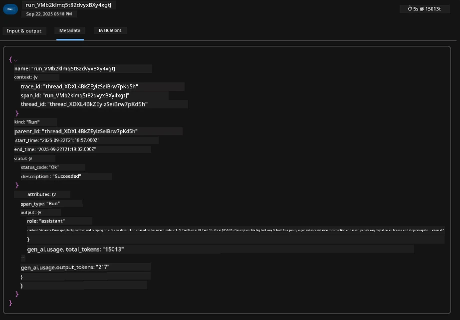


1. Click the `Evaluations` tab to see auto-assessments wey dem do on the agent response. These ones include safety evaluations (e.g., Self-harm) and agent-specific evaluations (e.g., Intent resolution, Task adherence).

      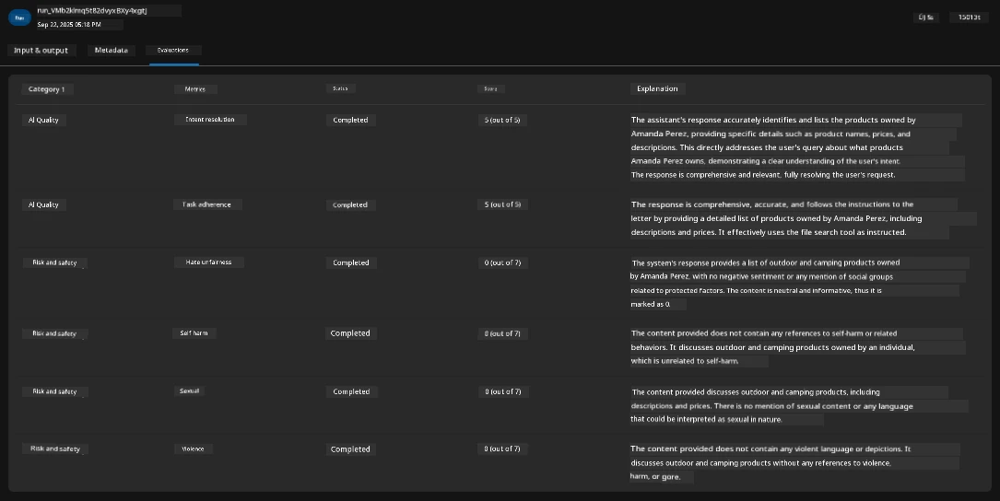

1. Last one, click the `Monitoring` tab for the sidebar menu.

      - Select `Resource usage` tab for the page wey show - then check the metrics.
      - Track application usage in terms of costs (tokens) and load (requests).
      - Track application latency to first byte (input processing) and last byte (output).

      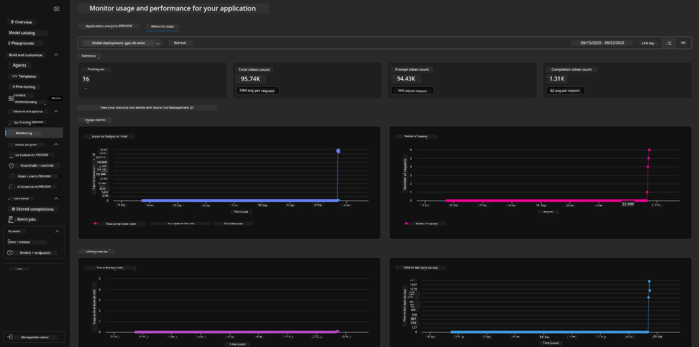

---

## 8. Environment Variables

So far, we don waka through the deployment for the browser - and we don validate say our infrastructure don provision and the application dey work. But to work with the application _code-first_, we need to configure our local development environment with the correct variables wey go allow us work with these resources. Using `azd` make am easier.

1. The Azure Developer CLI [uses environment variables](https://learn.microsoft.com/en-us/azure/developer/azure-developer-cli/manage-environment-variables?tabs=bash) to store and manage configuration settings for the application deployments.

1. Environment variables dey stored for `.azure/<env-name>/.env` - this one scope dem to the `env-name` environment wey you use during deployment and e dey help you isolate environments between different deployment targets inside the same repo.

1. Environment variables dey automatically load by the `azd` command whenever e run specific command (e.g., `azd up`). Note say `azd` no dey automatically read _OS-level_ environment variables (e.g., wey you set for the shell) - instead use `azd set env` and `azd get env` to move information inside scripts.


Make we try few commands:

1. Get all the environment variables wey azd set for this environment:

      ```bash title="" linenums="0"
      azd env get-values
      ```
      
      You go see something like:

      ```bash title="" linenums="0"
      AZURE_AI_AGENT_DEPLOYMENT_NAME="gpt-4.1-mini"
      AZURE_AI_AGENT_NAME="agent-template-assistant"
      AZURE_AI_EMBED_DEPLOYMENT_NAME="text-embedding-3-small"
      AZURE_AI_EMBED_DIMENSIONS=100
      ...
      ```

1. Get specific value - e.g., I wan know if we set the `AZURE_AI_AGENT_MODEL_NAME` value

      ```bash title="" linenums="0"
      azd env get-value AZURE_AI_AGENT_MODEL_NAME 
      ```
      
      You go see something like this - e no set by default!

      ```bash title="" linenums="0"
      ERROR: key 'AZURE_AI_AGENT_MODEL_NAME' not found in the environment values
      ```

1. Set new environment variable for `azd`. Here, we change the agent model name. _Note: any changes wey you make go immediately reflect for the `.azure/<env-name>/.env` file._

      ```bash title="" linenums="0"
      azd env set AZURE_AI_AGENT_MODEL_NAME gpt-4.1
      azd env set AZURE_AI_AGENT_MODEL_VERSION 2025-04-14
      azd env set AZURE_AI_AGENT_DEPLOYMENT_CAPACITY 150
      ```

      Now, we go find say the value don set:

      ```bash title="" linenums="0"
      azd env get-value AZURE_AI_AGENT_MODEL_NAME 
      ```

1. Note say some resources dey persistent (e.g., model deployments) and dem fit need more than `azd up` alone to force redeployment. Make we try tear down the original deployment and redeploy with changed env vars.

1. **Refresh** If you don deploy infrastructure before using an azd template - you fit _refresh_ the state of your local environment variables based on current state of your Azure deployment using this command:

      ```bash title="" linenums="0"
      azd env refresh
      ```

      Dis na powerful way to _sync_ environment variables across two or more local development environments (e.g., team wey get plenty developers) - e go allow the deployed infrastructure make e be the ground truth for env variable state. Team members go just _refresh_ variables to come back in sync.

---

## 9. Una don complete 🏆

You don just complete one end-to-end workflow wey you:

- [X] You don select the AZD Template wey you wan use
- [X] You don open the template inside one supported development environment
- [X] You don deploy the Template and validate say e dey work

---

<!-- CO-OP TRANSLATOR DISCLAIMER START -->
**Disclaimer**:
Dis document don translate using AI translation service [Co-op Translator](https://github.com/Azure/co-op-translator). Even though we dey try make am accurate, abeg sabi say automated translations fit get errors or inaccuracies. Abeg consider the original document wey dey im native language as the authoritative source. If na critical information, make una use professional human translation. We no dey liable for any misunderstandings or misinterpretations wey fit arise from the use of this translation.
<!-- CO-OP TRANSLATOR DISCLAIMER END -->