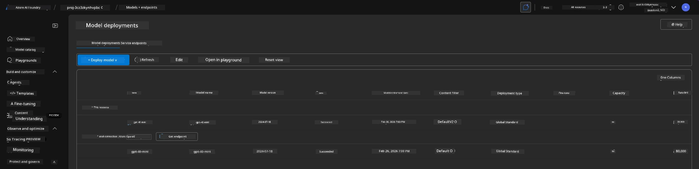
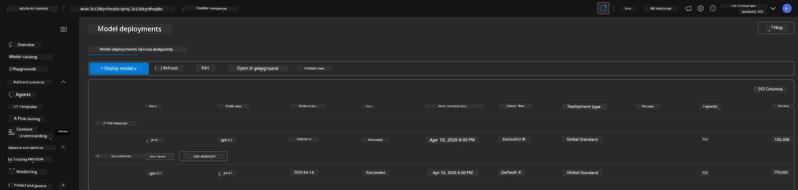

<!--
CO_OP_TRANSLATOR_METADATA:
{
  "original_hash": "6539a34c770f3ceff282370d72ee74dc",
  "translation_date": "2025-11-18T19:06:22+00:00",
  "source_file": "workshop/docs/instructions/6-Teardown-Infrastructure.md",
  "language_code": "pcm"
}
-->
# 6. Teardown Infrastructure

!!! tip "BY THE END OF THIS MODULE YOU GO FIT DO"

    - [ ] Item
    - [ ] Item
    - [ ] Item

---

## Bonus Exercises

Before we go break down di project, take small time do some open-ended exploration.

!!! danger "NITYA-TODO: Make some prompts wey you fit try"

---

## Deprovision Infra

1. To break down di infrastructure na as simple as:
      
      ```bash title="" linenums="0"
      azd down --purge
      ```
1. Di `--purge` flag go make sure say e also clear soft-deleted Cognitive Service resources, so e go free di quota wey dey hold by dis resources. When e finish, you go see something like dis:
      
      ```bash title="" linenums="0"
      ? Total resources to delete: 11, are you sure you want to continue? Yes
      Deleting your resources can take some time.
      (✓) Done: Deleted resource group rg-nitya-mshack-azd
      (✓) Done: Purging Cognitive Account: aoai-3cz3zkynhvpbc

      SUCCESS: Your application was removed from Azure in 11 minutes 4 seconds.
      ```

1. (Optional) If you run `azd up` again now, you go notice say di gpt-4.1 model go deploy because di environment variable don change (and e don save) for di local `.azure` folder. 

      Dis na di model deployments **before**:

      

      And dis na di one **after**:
      

---

<!-- CO-OP TRANSLATOR DISCLAIMER START -->
**Disclaimer**:  
Dis dokyument don use AI transle-shun service [Co-op Translator](https://github.com/Azure/co-op-translator) do di transle-shun. Even as we dey try make am correct, abeg sabi say AI transle-shun fit get mistake or no dey accurate well. Di original dokyument for im native language na di one wey you go take as di correct source. For important mata, e good make professional human transle-shun dey use. We no go fit take blame for any misunderstanding or wrong interpretation wey fit happen because you use dis transle-shun.
<!-- CO-OP TRANSLATOR DISCLAIMER END -->