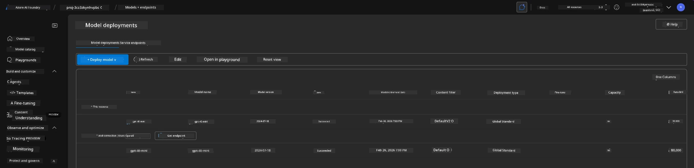
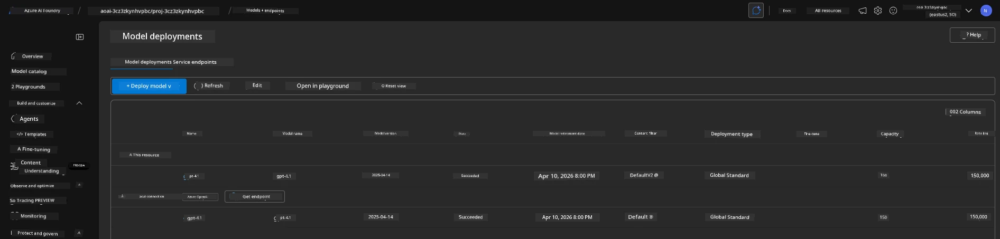

# 6. Comot Infrastructure

!!! tip "BY DE TIME YOU FINISH DIS MODULE YOU GO FIT"

    - [ ] Make you sabi why e important to clean up resources and manage cost
    - [ ] Use `azd down` comot infrastructure safe
    - [ ] Fit recover soft-deleted Cognitive Service resources if e need
    - [ ] **Lab 6:** Remove Azure resources and verify say dem don comot

---

## Bonus Exercises

Before we tear down the project, use few minutes do some open-ended exploration.

!!! info "Try These Exploration Prompts"

    **Experiment with GitHub Copilot:**
    
    1. Ask: `What other AZD templates could I try for multi-agent scenarios?`
    2. Ask: `How can I customize the agent instructions for a healthcare use case?`
    3. Ask: `What environment variables control cost optimization?`
    
    **Explore the Azure Portal:**
    
    1. Check Application Insights metrics wey dey for your deployment
    2. Check the cost analysis for resources wey you provision
    3. Check the Microsoft Foundry portal agent playground again

---

## Deprovision Infra

1. Tearing down infrastructure dey easy like dis:
      
      ```bash title="" linenums="0"
      azd down --purge
      ```
1. The `--purge` flag make sure say e go also purge soft-deleted Cognitive Service resources, so e go release the quota wey those resources dey hold. When e don finish you go see something like dis:
      
      ```bash title="" linenums="0"
      ? Total resources to delete: 11, are you sure you want to continue? Yes
      Deleting your resources can take some time.
      (✓) Done: Deleted resource group rg-nitya-mshack-azd
      (✓) Done: Purging Cognitive Account: aoai-3cz3zkynhvpbc

      SUCCESS: Your application was removed from Azure in 11 minutes 4 seconds.
      ```

1. (Optional) If you run `azd up` again now, you go notice say the gpt-4.1 model go deploy because the environment variable don change (and save) for the local `.azure` folder. 

      Here be the model deployments **bifo**:

      

      And here e be **afta**:
      

---

<!-- CO-OP TRANSLATOR DISCLAIMER START -->
Disclaimer:
Dis document na wetin AI translation service Co-op Translator (https://github.com/Azure/co-op-translator) don translate. Even though we dey try make am correct, abeg note say automated translations fit get mistakes or no too correct. Di original document for e original language suppose be di main, trusted source. If na critical information, make una use professional human translator. We no dey liable for any misunderstanding or wrong interpretation wey fit come from this translation.
<!-- CO-OP TRANSLATOR DISCLAIMER END -->