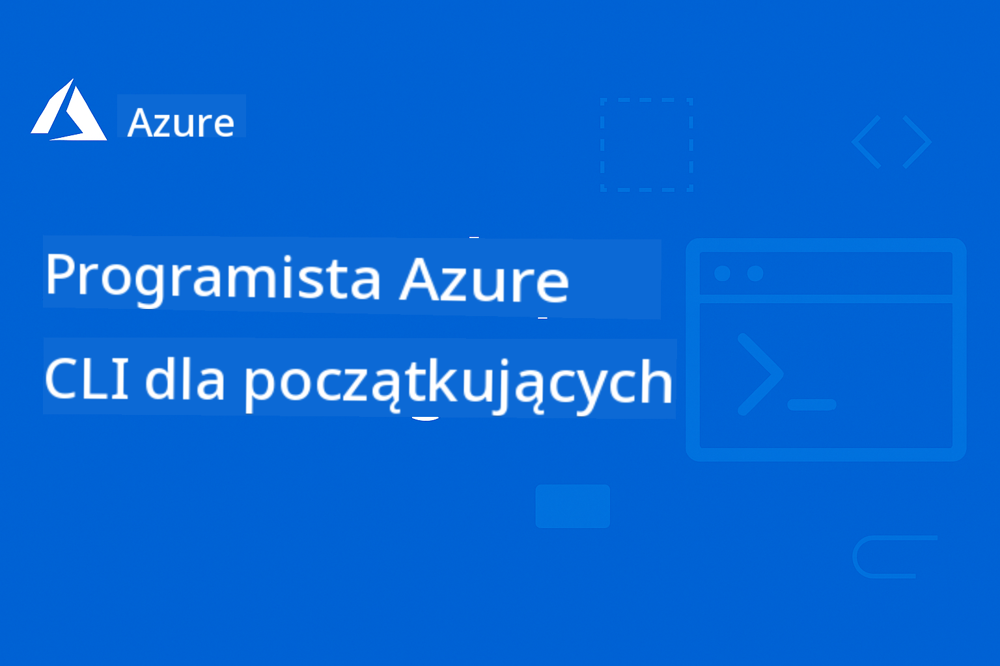

<!--
CO_OP_TRANSLATOR_METADATA:
{
  "original_hash": "6a804be263d09a0fd6f36d6ab251707a",
  "translation_date": "2025-11-25T11:18:03+00:00",
  "source_file": "README.md",
  "language_code": "pl"
}
-->
# AZD dla Początkujących: Strukturalna Ścieżka Nauki

 

[](https://GitHub.com/microsoft/azd-for-beginners/watchers/)
[](https://GitHub.com/microsoft/azd-for-beginners/network/)
[](https://GitHub.com/microsoft/azd-for-beginners/stargazers/)

[](https://discord.gg/microsoft-azure)
[](https://discord.gg/nTYy5BXMWG)

## Rozpoczęcie Kursu

Postępuj zgodnie z poniższymi krokami, aby rozpocząć swoją przygodę z nauką AZD:

1. **Forkuj Repozytorium**: Kliknij [](https://GitHub.com/microsoft/azd-for-beginners/fork)
2. **Sklonuj Repozytorium**: `git clone https://github.com/microsoft/azd-for-beginners.git`
3. **Dołącz do Społeczności**: [Społeczności Azure na Discordzie](https://discord.com/invite/ByRwuEEgH4) dla wsparcia ekspertów
4. **Wybierz Ścieżkę Nauki**: Wybierz rozdział poniżej, który odpowiada Twojemu poziomowi doświadczenia

### Wsparcie Wielojęzyczne

#### Automatyczne Tłumaczenia (Zawsze Aktualne)

<!-- CO-OP TRANSLATOR LANGUAGES TABLE START -->
[Arabic](../ar/README.md) | [Bengali](../bn/README.md) | [Bulgarian](../bg/README.md) | [Burmese (Myanmar)](../my/README.md) | [Chinese (Simplified)](../zh/README.md) | [Chinese (Traditional, Hong Kong)](../hk/README.md) | [Chinese (Traditional, Macau)](../mo/README.md) | [Chinese (Traditional, Taiwan)](../tw/README.md) | [Croatian](../hr/README.md) | [Czech](../cs/README.md) | [Danish](../da/README.md) | [Dutch](../nl/README.md) | [Estonian](../et/README.md) | [Finnish](../fi/README.md) | [French](../fr/README.md) | [German](../de/README.md) | [Greek](../el/README.md) | [Hebrew](../he/README.md) | [Hindi](../hi/README.md) | [Hungarian](../hu/README.md) | [Indonesian](../id/README.md) | [Italian](../it/README.md) | [Japanese](../ja/README.md) | [Kannada](../kn/README.md) | [Korean](../ko/README.md) | [Lithuanian](../lt/README.md) | [Malay](../ms/README.md) | [Malayalam](../ml/README.md) | [Marathi](../mr/README.md) | [Nepali](../ne/README.md) | [Nigerian Pidgin](../pcm/README.md) | [Norwegian](../no/README.md) | [Persian (Farsi)](../fa/README.md) | [Polish](./README.md) | [Portuguese (Brazil)](../br/README.md) | [Portuguese (Portugal)](../pt/README.md) | [Punjabi (Gurmukhi)](../pa/README.md) | [Romanian](../ro/README.md) | [Russian](../ru/README.md) | [Serbian (Cyrillic)](../sr/README.md) | [Slovak](../sk/README.md) | [Slovenian](../sl/README.md) | [Spanish](../es/README.md) | [Swahili](../sw/README.md) | [Swedish](../sv/README.md) | [Tagalog (Filipino)](../tl/README.md) | [Tamil](../ta/README.md) | [Telugu](../te/README.md) | [Thai](../th/README.md) | [Turkish](../tr/README.md) | [Ukrainian](../uk/README.md) | [Urdu](../ur/README.md) | [Vietnamese](../vi/README.md)
<!-- CO-OP TRANSLATOR LANGUAGES TABLE END -->

## Przegląd Kursu

Opanuj Azure Developer CLI (azd) dzięki strukturalnym rozdziałom zaprojektowanym do progresywnej nauki. **Szczególny nacisk na wdrażanie aplikacji AI z integracją Microsoft Foundry.**

### Dlaczego Ten Kurs Jest Kluczowy dla Współczesnych Programistów

Na podstawie wniosków ze społeczności Microsoft Foundry na Discordzie, **45% programistów chce używać AZD do obciążeń AI**, ale napotyka trudności z:
- Złożonymi architekturami AI obejmującymi wiele usług
- Najlepszymi praktykami wdrażania AI w środowisku produkcyjnym  
- Integracją i konfiguracją usług Azure AI
- Optymalizacją kosztów dla obciążeń AI
- Rozwiązywaniem problemów specyficznych dla wdrożeń AI

### Cele Nauki

Po ukończeniu tego kursu:
- **Opanujesz Podstawy AZD**: Kluczowe koncepcje, instalacja i konfiguracja
- **Wdrożysz Aplikacje AI**: Użycie AZD z usługami Microsoft Foundry
- **Zaimplementujesz Infrastrukturę jako Kod**: Zarządzanie zasobami Azure za pomocą szablonów Bicep
- **Rozwiążesz Problemy z Wdrożeniami**: Rozwiązywanie typowych problemów i debugowanie
- **Zoptymalizujesz Produkcję**: Bezpieczeństwo, skalowanie, monitorowanie i zarządzanie kosztami
- **Zbudujesz Rozwiązania Multi-Agentowe**: Wdrożenie złożonych architektur AI

## 📚 Rozdziały Nauki

*Wybierz swoją ścieżkę nauki w zależności od poziomu doświadczenia i celów*

### 🚀 Rozdział 1: Podstawy i Szybki Start
**Wymagania wstępne**: Subskrypcja Azure, podstawowa znajomość wiersza poleceń  
**Czas trwania**: 30-45 minut  
**Poziom trudności**: ⭐

#### Czego Się Nauczysz
- Zrozumienie podstaw Azure Developer CLI
- Instalacja AZD na Twojej platformie
- Twoje pierwsze udane wdrożenie

#### Materiały do Nauki
- **🎯 Zacznij Tutaj**: [Czym jest Azure Developer CLI?](../..)
- **📖 Teoria**: [Podstawy AZD](docs/getting-started/azd-basics.md) - Kluczowe koncepcje i terminologia
- **⚙️ Konfiguracja**: [Instalacja i Konfiguracja](docs/getting-started/installation.md) - Przewodniki specyficzne dla platformy
- **🛠️ Praktyka**: [Twój Pierwszy Projekt](docs/getting-started/first-project.md) - Samouczek krok po kroku
- **📋 Szybka Referencja**: [Arkusz Poleceń](resources/cheat-sheet.md)

#### Ćwiczenia Praktyczne
```bash
# Szybka kontrola instalacji
azd version

# Wdróż swoją pierwszą aplikację
azd init --template todo-nodejs-mongo
azd up
```

**💡 Wynik Rozdziału**: Udane wdrożenie prostej aplikacji webowej na Azure za pomocą AZD

**✅ Walidacja Sukcesu:**
```bash
# Po ukończeniu Rozdziału 1 powinieneś być w stanie:
azd version              # Pokazuje zainstalowaną wersję
azd init --template todo-nodejs-mongo  # Inicjalizuje projekt
azd up                  # Wdraża do Azure
azd show                # Wyświetla URL działającej aplikacji
# Aplikacja otwiera się w przeglądarce i działa
azd down --force --purge  # Czyści zasoby
```

**📊 Inwestycja Czasowa:** 30-45 minut  
**📈 Poziom Umiejętności Po:** Możliwość samodzielnego wdrażania podstawowych aplikacji

**✅ Walidacja Sukcesu:**
```bash
# Po ukończeniu Rozdziału 1 powinieneś być w stanie:
azd version              # Pokazuje zainstalowaną wersję
azd init --template todo-nodejs-mongo  # Inicjalizuje projekt
azd up                  # Wdraża do Azure
azd show                # Wyświetla URL działającej aplikacji
# Aplikacja otwiera się w przeglądarce i działa
azd down --force --purge  # Czyści zasoby
```

**📊 Inwestycja Czasowa:** 30-45 minut  
**📈 Poziom Umiejętności Po:** Możliwość samodzielnego wdrażania podstawowych aplikacji

---

### 🤖 Rozdział 2: Rozwój AI-First (Zalecane dla Programistów AI)
**Wymagania wstępne**: Ukończony Rozdział 1  
**Czas trwania**: 1-2 godziny  
**Poziom trudności**: ⭐⭐

#### Czego Się Nauczysz
- Integracja Microsoft Foundry z AZD
- Wdrażanie aplikacji zasilanych AI
- Zrozumienie konfiguracji usług AI

#### Materiały do Nauki
- **🎯 Zacznij Tutaj**: [Integracja z Microsoft Foundry](docs/microsoft-foundry/microsoft-foundry-integration.md)
- **📖 Wzorce**: [Wdrażanie Modeli AI](docs/microsoft-foundry/ai-model-deployment.md) - Wdrażanie i zarządzanie modelami AI
- **🛠️ Warsztat**: [Laboratorium Warsztatowe AI](docs/microsoft-foundry/ai-workshop-lab.md) - Przygotowanie rozwiązań AI do AZD
- **🎥 Interaktywny Przewodnik**: [Materiały Warsztatowe](workshop/README.md) - Nauka w przeglądarce z MkDocs * DevContainer Environment
- **📋 Szablony**: [Szablony Microsoft Foundry](../..)
- **📝 Przykłady**: [Przykłady Wdrożeń AZD](examples/README.md)

#### Ćwiczenia Praktyczne
```bash
# Wdróż swoją pierwszą aplikację AI
azd init --template azure-search-openai-demo
azd up

# Wypróbuj dodatkowe szablony AI
azd init --template openai-chat-app-quickstart
azd init --template agent-openai-python-prompty
```

**💡 Wynik Rozdziału**: Wdrożenie i konfiguracja aplikacji czatowej z funkcjami RAG

**✅ Walidacja Sukcesu:**
```bash
# Po rozdziale 2 powinieneś być w stanie:
azd init --template azure-search-openai-demo
azd up
# Przetestować interfejs czatu AI
# Zadawać pytania i otrzymywać odpowiedzi wspierane przez AI wraz z źródłami
# Zweryfikować, czy integracja wyszukiwania działa
azd monitor  # Sprawdzić, czy Application Insights pokazuje telemetrię
azd down --force --purge
```

**📊 Inwestycja Czasowa:** 1-2 godziny  
**📈 Poziom Umiejętności Po:** Możliwość wdrażania i konfiguracji aplikacji AI gotowych do produkcji  
**💰 Świadomość Kosztów:** Zrozumienie kosztów $80-150/miesiąc dla dev, $300-3500/miesiąc dla produkcji

#### 💰 Rozważania Kosztowe dla Wdrożeń AI

**Środowisko Deweloperskie (Szacowane $80-150/miesiąc):**
- Azure OpenAI (Pay-as-you-go): $0-50/miesiąc (w zależności od użycia tokenów)
- AI Search (Podstawowy poziom): $75/miesiąc
- Container Apps (Konsumpcja): $0-20/miesiąc
- Storage (Standardowy): $1-5/miesiąc

**Środowisko Produkcyjne (Szacowane $300-3,500+/miesiąc):**
- Azure OpenAI (PTU dla stałej wydajności): $3,000+/miesiąc LUB Pay-as-go przy dużym wolumenie
- AI Search (Standardowy poziom): $250/miesiąc
- Container Apps (Dedykowane): $50-100/miesiąc
- Application Insights: $5-50/miesiąc
- Storage (Premium): $10-50/miesiąc

**💡 Wskazówki Optymalizacji Kosztów:**
- Używaj **Darmowego Poziomu** Azure OpenAI do nauki (50,000 tokenów/miesiąc wliczone)
- Uruchamiaj `azd down`, aby zwolnić zasoby, gdy nie rozwijasz aktywnie
- Zacznij od rozliczeń opartych na konsumpcji, przejdź na PTU tylko dla produkcji
- Używaj `azd provision --preview`, aby oszacować koszty przed wdrożeniem
- Włącz auto-skalowanie: płać tylko za rzeczywiste użycie

**Monitorowanie Kosztów:**
```bash
# Sprawdź szacowane miesięczne koszty
azd provision --preview

# Monitoruj rzeczywiste koszty w Azure Portal
az consumption budget list --resource-group <your-rg>
```

---

### ⚙️ Rozdział 3: Konfiguracja i Uwierzytelnianie
**Wymagania wstępne**: Ukończony Rozdział 1  
**Czas trwania**: 45-60 minut  
**Poziom trudności**: ⭐⭐

#### Czego Się Nauczysz
- Konfiguracja i zarządzanie środowiskiem
- Najlepsze praktyki w zakresie uwierzytelniania i bezpieczeństwa
- Nazewnictwo i organizacja zasobów

#### Materiały do Nauki
- **📖 Konfiguracja**: [Przewodnik Konfiguracji](docs/getting-started/configuration.md) - Ustawienia środowiska
- **🔐 Bezpieczeństwo**: [Wzorce uwierzytelniania i zarządzana tożsamość](docs/getting-started/authsecurity.md) - Wzorce uwierzytelniania
- **📝 Przykłady**: [Przykład Aplikacji Bazodanowej](examples/database-app/README.md) - Przykłady AZD dla baz danych

#### Ćwiczenia Praktyczne
- Konfiguracja wielu środowisk (dev, staging, prod)
- Ustawienie uwierzytelniania za pomocą zarządzanej tożsamości
- Implementacja konfiguracji specyficznych dla środowiska

**💡 Wynik Rozdziału**: Zarządzanie wieloma środowiskami z odpowiednim uwierzytelnianiem i bezpieczeństwem

---

### 🏗️ Rozdział 4: Infrastruktura jako Kod i Wdrożenie
**Wymagania wstępne**: Ukończone Rozdziały 1-3  
**Czas trwania**: 1-1,5 godziny  
**Poziom trudności**: ⭐⭐⭐

#### Czego Się Nauczysz
- Zaawansowane wzorce wdrożeń
- Infrastruktura jako Kod z Bicep
- Strategie zarządzania zasobami

#### Materiały do Nauki
- **📖 Wdrożenie**: [Przewodnik Wdrożeniowy](docs/deployment/deployment-guide.md) - Kompleksowe przepływy pracy
- **🏗️ Zarządzanie Zasobami**: [Zarządzanie Zasobami](docs/deployment/provisioning.md) - Zarządzanie zasobami Azure
- **📝 Przykłady**: [Przykład Aplikacji Kontenerowej](../../examples/container-app) - Wdrożenia konteneryzowane

#### Ćwiczenia Praktyczne
- Tworzenie niestandardowych szablonów Bicep
- Wdrażanie aplikacji obejmujących wiele usług
- Implementacja strategii wdrożeń blue-green

**💡 Wynik Rozdziału**: Wdrożenie złożonych aplikacji obejmujących wiele usług za pomocą niestandardowych szablonów infrastruktury

---

### 🎯 Rozdział 5: Rozwiązania Multi-Agentowe AI (Zaawansowane)
**Wymagania wstępne**: Ukończone Rozdziały 1-2  
**Czas trwania**: 2-3 godziny  
**Poziom trudności**: ⭐⭐⭐⭐

#### Czego Się Nauczysz
- Wzorce architektury multi-agentowej
- Orkiestracja i koordynacja agentów
- Wdrożenia AI gotowe do produkcji

#### Materiały do Nauki
- **🤖 Wyróżniony Projekt**: [Rozwiązanie Multi-Agentowe dla Handlu Detalicznego](examples/retail-scenario.md) - Kompleksowa implementacja
- **🛠️ ARM Templates**: [Pakiet ARM Template](../../examples/retail-multiagent-arm-template) - Jednoklikowa instalacja
- **📖 Architektura**: [Wzorce koordynacji wieloagentowej](/docs/pre-deployment/coordination-patterns.md) - Wzorce

#### Ćwiczenia praktyczne
```bash
# Wdróż kompletną wieloagentową rozwiązanie dla handlu detalicznego
cd examples/retail-multiagent-arm-template
./deploy.sh

# Zbadaj konfiguracje agentów
az deployment group show --resource-group <rg-name> --name <deployment-name>
```

**💡 Wynik rozdziału**: Wdrażanie i zarządzanie gotowym do produkcji rozwiązaniem AI z agentami Klienta i Magazynu

---

### 🔍 Rozdział 6: Walidacja i planowanie przed wdrożeniem
**Wymagania wstępne**: Ukończony rozdział 4  
**Czas trwania**: 1 godzina  
**Poziom trudności**: ⭐⭐

#### Czego się nauczysz
- Planowanie pojemności i walidacja zasobów
- Strategie wyboru SKU
- Kontrole przed wdrożeniem i automatyzacja

#### Materiały edukacyjne
- **📊 Planowanie**: [Planowanie pojemności](docs/pre-deployment/capacity-planning.md) - Walidacja zasobów
- **💰 Wybór**: [Wybór SKU](docs/pre-deployment/sku-selection.md) - Ekonomiczne opcje
- **✅ Walidacja**: [Kontrole przed wdrożeniem](docs/pre-deployment/preflight-checks.md) - Zautomatyzowane skrypty

#### Ćwiczenia praktyczne
- Uruchom skrypty walidacji pojemności
- Optymalizuj wybór SKU pod kątem kosztów
- Wdrażaj zautomatyzowane kontrole przed wdrożeniem

**💡 Wynik rozdziału**: Walidacja i optymalizacja wdrożeń przed ich realizacją

---

### 🚨 Rozdział 7: Rozwiązywanie problemów i debugowanie
**Wymagania wstępne**: Ukończony dowolny rozdział dotyczący wdrożenia  
**Czas trwania**: 1-1,5 godziny  
**Poziom trudności**: ⭐⭐

#### Czego się nauczysz
- Systematyczne podejścia do debugowania
- Typowe problemy i ich rozwiązania
- Rozwiązywanie problemów specyficznych dla AI

#### Materiały edukacyjne
- **🔧 Typowe problemy**: [Typowe problemy](docs/troubleshooting/common-issues.md) - FAQ i rozwiązania
- **🕵️ Debugowanie**: [Przewodnik debugowania](docs/troubleshooting/debugging.md) - Strategie krok po kroku
- **🤖 Problemy AI**: [Rozwiązywanie problemów specyficznych dla AI](docs/troubleshooting/ai-troubleshooting.md) - Problemy z usługami AI

#### Ćwiczenia praktyczne
- Diagnozuj problemy z wdrożeniem
- Rozwiązuj problemy z uwierzytelnianiem
- Debuguj połączenia usług AI

**💡 Wynik rozdziału**: Samodzielne diagnozowanie i rozwiązywanie typowych problemów z wdrożeniem

---

### 🏢 Rozdział 8: Wzorce produkcyjne i korporacyjne
**Wymagania wstępne**: Ukończone rozdziały 1-4  
**Czas trwania**: 2-3 godziny  
**Poziom trudności**: ⭐⭐⭐⭐

#### Czego się nauczysz
- Strategie wdrożeń produkcyjnych
- Wzorce bezpieczeństwa korporacyjnego
- Monitorowanie i optymalizacja kosztów

#### Materiały edukacyjne
- **🏭 Produkcja**: [Najlepsze praktyki AI w produkcji](docs/microsoft-foundry/production-ai-practices.md) - Wzorce korporacyjne
- **📝 Przykłady**: [Przykład mikroserwisów](../../examples/microservices) - Złożone architektury
- **📊 Monitorowanie**: [Integracja z Application Insights](docs/pre-deployment/application-insights.md) - Monitorowanie

#### Ćwiczenia praktyczne
- Wdrażaj wzorce bezpieczeństwa korporacyjnego
- Konfiguruj kompleksowe monitorowanie
- Wdrażaj do produkcji z odpowiednim zarządzaniem

**💡 Wynik rozdziału**: Wdrażanie aplikacji gotowych do produkcji z pełnymi możliwościami korporacyjnymi

---

## 🎓 Przegląd warsztatów: Doświadczenie praktycznej nauki

> **⚠️ STATUS WARSZTATÓW: Aktywny rozwój**  
> Materiały warsztatowe są obecnie rozwijane i udoskonalane. Podstawowe moduły są funkcjonalne, ale niektóre zaawansowane sekcje są niekompletne. Aktywnie pracujemy nad ukończeniem całej zawartości. [Śledź postępy →](workshop/README.md)

### Interaktywne materiały warsztatowe
**Kompleksowe praktyczne doświadczenie z narzędziami przeglądarkowymi i ćwiczeniami z przewodnikiem**

Nasze materiały warsztatowe oferują uporządkowane, interaktywne doświadczenie edukacyjne, które uzupełnia program nauczania oparty na rozdziałach. Warsztat jest zaprojektowany zarówno do nauki samodzielnej, jak i sesji prowadzonych przez instruktorów.

#### 🛠️ Funkcje warsztatu
- **Interfejs przeglądarkowy**: Kompletny warsztat oparty na MkDocs z funkcjami wyszukiwania, kopiowania i motywów
- **Integracja z GitHub Codespaces**: Jednoklikowa konfiguracja środowiska deweloperskiego
- **Struktura nauki**: 7-etapowe ćwiczenia z przewodnikiem (łącznie 3,5 godziny)
- **Odkrywanie → Wdrożenie → Dostosowanie**: Progresywna metodologia
- **Interaktywne środowisko DevContainer**: Wstępnie skonfigurowane narzędzia i zależności

#### 📚 Struktura warsztatu
Warsztat opiera się na metodologii **Odkrywanie → Wdrożenie → Dostosowanie**:

1. **Faza odkrywania** (45 minut)
   - Eksploracja szablonów i usług Microsoft Foundry
   - Zrozumienie wzorców architektury wieloagentowej
   - Przegląd wymagań i warunków wstępnych wdrożenia

2. **Faza wdrożenia** (2 godziny)
   - Praktyczne wdrożenie aplikacji AI za pomocą AZD
   - Konfiguracja usług Azure AI i punktów końcowych
   - Wdrażanie wzorców bezpieczeństwa i uwierzytelniania

3. **Faza dostosowania** (45 minut)
   - Modyfikacja aplikacji dla konkretnych przypadków użycia
   - Optymalizacja pod kątem wdrożenia produkcyjnego
   - Wdrażanie monitorowania i zarządzania kosztami

#### 🚀 Rozpoczęcie warsztatu
```bash
# Opcja 1: GitHub Codespaces (Zalecane)
# Kliknij "Code" → "Create codespace on main" w repozytorium

# Opcja 2: Lokalny rozwój
git clone https://github.com/microsoft/azd-for-beginners.git
cd azd-for-beginners/workshop
# Postępuj zgodnie z instrukcjami konfiguracji w workshop/README.md
```

#### 🎯 Wyniki nauki z warsztatu
Po ukończeniu warsztatu uczestnicy będą:
- **Wdrażać aplikacje AI w produkcji**: Korzystać z AZD i usług Microsoft Foundry
- **Opanowywać architektury wieloagentowe**: Wdrażać skoordynowane rozwiązania AI
- **Wdrażać najlepsze praktyki bezpieczeństwa**: Konfigurować uwierzytelnianie i kontrolę dostępu
- **Optymalizować skalowanie**: Projektować ekonomiczne i wydajne wdrożenia
- **Rozwiązywać problemy z wdrożeniami**: Samodzielnie rozwiązywać typowe problemy

#### 📖 Zasoby warsztatowe
- **🎥 Interaktywny przewodnik**: [Materiały warsztatowe](workshop/README.md) - Środowisko nauki w przeglądarce
- **📋 Instrukcje krok po kroku**: [Ćwiczenia z przewodnikiem](../../workshop/docs/instructions) - Szczegółowe instrukcje
- **🛠️ Laboratorium warsztatowe AI**: [Laboratorium warsztatowe AI](docs/microsoft-foundry/ai-workshop-lab.md) - Ćwiczenia skoncentrowane na AI
- **💡 Szybki start**: [Przewodnik konfiguracji warsztatu](workshop/README.md#quick-start) - Konfiguracja środowiska

**Idealne dla**: Szkolenia korporacyjne, kursy uniwersyteckie, nauka samodzielna i bootcampy dla deweloperów.

---

## 📖 Co to jest Azure Developer CLI?

Azure Developer CLI (azd) to interfejs wiersza poleceń skoncentrowany na deweloperach, który przyspiesza proces budowania i wdrażania aplikacji na platformie Azure. Oferuje:

- **Wdrożenia oparte na szablonach** - Korzystanie z gotowych szablonów dla typowych wzorców aplikacji
- **Infrastruktura jako kod** - Zarządzanie zasobami Azure za pomocą Bicep lub Terraform  
- **Zintegrowane przepływy pracy** - Bezproblemowe tworzenie, wdrażanie i monitorowanie aplikacji
- **Przyjazne dla deweloperów** - Optymalizacja pod kątem produktywności i doświadczenia dewelopera

### **AZD + Microsoft Foundry: Idealne dla rozwiązań AI**

**Dlaczego AZD dla rozwiązań AI?** AZD rozwiązuje najważniejsze wyzwania, z którymi mierzą się deweloperzy AI:

- **Szablony gotowe na AI** - Wstępnie skonfigurowane szablony dla Azure OpenAI, Cognitive Services i obciążeń ML
- **Bezpieczne wdrożenia AI** - Wbudowane wzorce bezpieczeństwa dla usług AI, kluczy API i punktów końcowych modeli  
- **Wzorce produkcyjne AI** - Najlepsze praktyki dla skalowalnych i ekonomicznych wdrożeń aplikacji AI
- **Kompleksowe przepływy pracy AI** - Od tworzenia modeli po wdrożenie produkcyjne z odpowiednim monitorowaniem
- **Optymalizacja kosztów** - Inteligentne strategie alokacji zasobów i skalowania dla obciążeń AI
- **Integracja z Microsoft Foundry** - Bezproblemowe połączenie z katalogiem modeli i punktami końcowymi Microsoft Foundry

---

## 🎯 Biblioteka szablonów i przykładów

### Wyróżnione: Szablony Microsoft Foundry
**Zacznij tutaj, jeśli wdrażasz aplikacje AI!**

> **Uwaga:** Te szablony demonstrują różne wzorce AI. Niektóre są zewnętrznymi przykładami Azure Samples, inne to lokalne implementacje.

| Szablon | Rozdział | Poziom trudności | Usługi | Typ |
|---------|----------|------------------|--------|-----|
| [**Rozpocznij pracę z AI chat**](https://github.com/Azure-Samples/get-started-with-ai-chat) | Rozdział 2 | ⭐⭐ | AzureOpenAI + Azure AI Model Inference API + Azure AI Search + Azure Container Apps + Application Insights | Zewnętrzny |
| [**Rozpocznij pracę z AI agents**](https://github.com/Azure-Samples/get-started-with-ai-agents) | Rozdział 2 | ⭐⭐ | Azure AI Agent Service + AzureOpenAI + Azure AI Search + Azure Container Apps + Application Insights| Zewnętrzny |
| [**Demo Azure Search + OpenAI**](https://github.com/Azure-Samples/azure-search-openai-demo) | Rozdział 2 | ⭐⭐ | AzureOpenAI + Azure AI Search + App Service + Storage | Zewnętrzny |
| [**Szybki start aplikacji OpenAI Chat**](https://github.com/Azure-Samples/openai-chat-app-quickstart) | Rozdział 2 | ⭐ | AzureOpenAI + Container Apps + Application Insights | Zewnętrzny |
| [**Agent OpenAI Python Prompty**](https://github.com/Azure-Samples/agent-openai-python-prompty) | Rozdział 5 | ⭐⭐⭐ | AzureOpenAI + Azure Functions + Prompty | Zewnętrzny |
| [**Contoso Chat RAG**](https://github.com/Azure-Samples/contoso-chat) | Rozdział 8 | ⭐⭐⭐⭐ | AzureOpenAI + AI Search + Cosmos DB + Container Apps | Zewnętrzny |
| [**Rozwiązanie wieloagentowe dla handlu detalicznego**](examples/retail-scenario.md) | Rozdział 5 | ⭐⭐⭐⭐ | AzureOpenAI + AI Search + Storage + Container Apps + Cosmos DB | **Lokalny** |

### Wyróżnione: Kompleksowe scenariusze nauki
**Szablony aplikacji gotowych do produkcji przypisane do rozdziałów nauki**

| Szablon | Rozdział nauki | Poziom trudności | Kluczowe zagadnienia |
|---------|----------------|------------------|-----------------------|
| [**openai-chat-app-quickstart**](https://github.com/Azure-Samples/openai-chat-app-quickstart) | Rozdział 2 | ⭐ | Podstawowe wzorce wdrożenia AI |
| [**azure-search-openai-demo**](https://github.com/Azure-Samples/azure-search-openai-demo) | Rozdział 2 | ⭐⭐ | Implementacja RAG z Azure AI Search |
| [**ai-document-processing**](https://github.com/Azure-Samples/ai-document-processing) | Rozdział 4 | ⭐⭐ | Integracja z Document Intelligence |
| [**agent-openai-python-prompty**](https://github.com/Azure-Samples/agent-openai-python-prompty) | Rozdział 5 | ⭐⭐⭐ | Framework agentów i wywoływanie funkcji |
| [**contoso-chat**](https://github.com/Azure-Samples/contoso-chat) | Rozdział 8 | ⭐⭐⭐ | Orkiestracja AI dla przedsiębiorstw |
| [**retail-multi-agent-solution**](examples/retail-scenario.md) | Rozdział 5 | ⭐⭐⭐⭐ | Architektura wieloagentowa z agentami Klienta i Magazynu |

### Nauka na podstawie typu przykładów

> **📌 Przykłady lokalne vs. zewnętrzne:**  
> **Przykłady lokalne** (w tym repozytorium) = Gotowe do natychmiastowego użycia  
> **Przykłady zewnętrzne** (Azure Samples) = Klonowanie z podlinkowanych repozytoriów

#### Przykłady lokalne (Gotowe do użycia)
- [**Rozwiązanie wieloagentowe dla handlu detalicznego**](examples/retail-scenario.md) - Kompleksowa implementacja gotowa do produkcji z szablonami ARM
  - Architektura wieloagentowa (agenci Klienta + Magazynu)
  - Kompleksowe monitorowanie i ocena
  - Jednoklikowe wdrożenie za pomocą szablonu ARM

#### Przykłady lokalne - Aplikacje kontenerowe (Rozdziały 2-5)
**Kompleksowe przykłady wdrożeń kontenerowych w tym repozytorium:**
- [**Przykłady aplikacji kontenerowych**](examples/container-app/README.md) - Kompletny przewodnik po wdrożeniach kontenerowych
  - [Prosty Flask API](../../examples/container-app/simple-flask-api) - Podstawowy REST API ze skalowaniem do zera
  - [Architektura mikroserwisów](../../examples/container-app/microservices) - Wdrożenie wieloserwisowe gotowe do produkcji
  - Wzorce szybkiego startu, produkcji i zaawansowanego wdrożenia
  - Monitorowanie, bezpieczeństwo i optymalizacja kosztów

#### Przykłady zewnętrzne - Proste aplikacje (Rozdziały 1-2)
**Sklonuj te repozytoria Azure Samples, aby rozpocząć:**
- [Prosta aplikacja webowa - Node.js + MongoDB](https://github.com/Azure-Samples/todo-nodejs-mongo) - Podstawowe wzorce wdrożenia
- [Statyczna strona - React SPA](https://github.com/Azure-Samples/todo-csharp-sql-swa-func) - Wdrożenie treści statycznych
- [Aplikacja kontenerowa - Python Flask](https://github.com/Azure-Samples/container-apps-store-api-microservice) - Wdrożenie REST API

#### Przykłady zewnętrzne - Integracja z bazą danych (Rozdziały 3-4)  
- [Aplikacja bazodanowa - C# + SQL](https://github.com/Azure-Samples/todo-csharp-sql) - Wzorce łączności z bazą danych
- [Funkcje + Cosmos DB](https://github.com/Azure-Samples/todo-python-mongo-swa-func) - Serwerless przepływ danych

#### Przykłady zewnętrzne - Zaawansowane wzorce (Rozdziały 4-8)
- [Java Microservices](https://github.com/Azure-Samples/java-microservices-aca-lab) - Architektury wieloserwisowe
- [Container Apps Jobs](https://github.com/Azure-Samples/container-apps-jobs) - Przetwarzanie w tle  
- [Enterprise ML Pipeline](https://github.com/Azure-Samples/mlops-v2) - Wzorce ML gotowe do produkcji

### Kolekcje szabl
- [**Command Cheat Sheet**](resources/cheat-sheet.md) - Kluczowe polecenia azd zorganizowane według rozdziałów
- [**Glossary**](resources/glossary.md) - Terminologia Azure i azd  
- [**FAQ**](resources/faq.md) - Najczęściej zadawane pytania zorganizowane według rozdziałów nauki
- [**Study Guide**](resources/study-guide.md) - Kompleksowe ćwiczenia praktyczne

### Warsztaty praktyczne
- [**AI Workshop Lab**](docs/microsoft-foundry/ai-workshop-lab.md) - Uczyń swoje rozwiązania AI gotowymi do wdrożenia w AZD (2-3 godziny)
- [**Interactive Workshop Guide**](workshop/README.md) - Warsztat w przeglądarce z MkDocs i środowiskiem DevContainer
- [**Structured Learning Path**](../../workshop/docs/instructions) - 7-etapowe ćwiczenia prowadzone krok po kroku (Odkrycie → Wdrożenie → Dostosowanie)
- [**AZD For Beginners Workshop**](workshop/README.md) - Kompletny materiał warsztatowy z integracją GitHub Codespaces

### Zewnętrzne zasoby edukacyjne
- [Dokumentacja Azure Developer CLI](https://learn.microsoft.com/en-us/azure/developer/azure-developer-cli/)
- [Azure Architecture Center](https://learn.microsoft.com/en-us/azure/architecture/)
- [Kalkulator cen Azure](https://azure.microsoft.com/pricing/calculator/)
- [Status Azure](https://status.azure.com/)

---

## 🔧 Szybki przewodnik rozwiązywania problemów

**Typowe problemy napotykane przez początkujących i ich natychmiastowe rozwiązania:**

### ❌ "azd: command not found"

```bash
# Najpierw zainstaluj AZD
# Windows (PowerShell):
winget install microsoft.azd

# macOS:
brew tap azure/azd && brew install azd

# Linux:
curl -fsSL https://aka.ms/install-azd.sh | bash

# Zweryfikuj instalację
azd version
```

### ❌ "No subscription found" lub "Subscription not set"

```bash
# Wyświetl dostępne subskrypcje
az account list --output table

# Ustaw domyślną subskrypcję
az account set --subscription "<subscription-id-or-name>"

# Ustaw dla środowiska AZD
azd env set AZURE_SUBSCRIPTION_ID "<subscription-id>"

# Zweryfikuj
az account show
```

### ❌ "InsufficientQuota" lub "Quota exceeded"

```bash
# Wypróbuj inny region Azure
azd env set AZURE_LOCATION "westus2"
azd up

# Lub użyj mniejszych SKU w środowisku deweloperskim
# Edytuj infra/main.parameters.json:
{
  "sku": "B1"  // Instead of "P1V2"
}
```

### ❌ "azd up" zatrzymuje się w połowie

```bash
# Opcja 1: Wyczyść i spróbuj ponownie
azd down --force --purge
azd up

# Opcja 2: Napraw tylko infrastrukturę
azd provision

# Opcja 3: Sprawdź szczegółowe logi
azd show
azd logs
```

### ❌ "Authentication failed" lub "Token expired"

```bash
# Ponowna autoryzacja
az logout
az login

azd auth logout
azd auth login

# Zweryfikuj autoryzację
az account show
```

### ❌ "Resource already exists" lub konflikty nazw

```bash
# AZD generuje unikalne nazwy, ale w przypadku konfliktu:
azd down --force --purge

# Następnie spróbuj ponownie z nowym środowiskiem
azd env new dev-v2
azd up
```

### ❌ Wdrażanie szablonu trwa zbyt długo

**Normalny czas oczekiwania:**
- Prosta aplikacja webowa: 5-10 minut
- Aplikacja z bazą danych: 10-15 minut
- Aplikacje AI: 15-25 minut (prowizja OpenAI jest wolna)

```bash
# Sprawdź postęp
azd show

# Jeśli utkniesz >30 minut, sprawdź Azure Portal:
azd monitor
# Poszukaj nieudanych wdrożeń
```

### ❌ "Permission denied" lub "Forbidden"

```bash
# Sprawdź swoją rolę w Azure
az role assignment list --assignee $(az account show --query user.name -o tsv)

# Potrzebujesz co najmniej roli "Współtwórca"
# Poproś administratora Azure o przyznanie:
# - Współtwórca (dla zasobów)
# - Administrator dostępu użytkownika (dla przypisywania ról)
```

### ❌ Nie można znaleźć URL wdrożonej aplikacji

```bash
# Pokaż wszystkie punkty końcowe usług
azd show

# Lub otwórz Azure Portal
azd monitor

# Sprawdź konkretną usługę
azd env get-values
# Poszukaj zmiennych *_URL
```

### 📚 Pełne zasoby rozwiązywania problemów

- **Przewodnik po typowych problemach:** [Szczegółowe rozwiązania](docs/troubleshooting/common-issues.md)
- **Problemy specyficzne dla AI:** [Rozwiązywanie problemów z AI](docs/troubleshooting/ai-troubleshooting.md)
- **Przewodnik debugowania:** [Krok po kroku](docs/troubleshooting/debugging.md)
- **Uzyskaj pomoc:** [Azure Discord](https://discord.gg/microsoft-azure) #azure-developer-cli

---

## 🔧 Szybki przewodnik rozwiązywania problemów

**Typowe problemy napotykane przez początkujących i ich natychmiastowe rozwiązania:**

<details>
<summary><strong>❌ "azd: command not found"</strong></summary>

```bash
# Najpierw zainstaluj AZD
# Windows (PowerShell):
winget install microsoft.azd

# macOS:
brew tap azure/azd && brew install azd

# Linux:
curl -fsSL https://aka.ms/install-azd.sh | bash

# Zweryfikuj instalację
azd version
```
</details>

<details>
<summary><strong>❌ "No subscription found" lub "Subscription not set"</strong></summary>

```bash
# Wyświetl dostępne subskrypcje
az account list --output table

# Ustaw domyślną subskrypcję
az account set --subscription "<subscription-id-or-name>"

# Ustaw dla środowiska AZD
azd env set AZURE_SUBSCRIPTION_ID "<subscription-id>"

# Zweryfikuj
az account show
```
</details>

<details>
<summary><strong>❌ "InsufficientQuota" lub "Quota exceeded"</strong></summary>

```bash
# Spróbuj inny region Azure
azd env set AZURE_LOCATION "westus2"
azd up

# Lub użyj mniejszych SKU w środowisku deweloperskim
# Edytuj infra/main.parameters.json:
{
  "sku": "B1"  // Instead of "P1V2"
}
```
</details>

<details>
<summary><strong>❌ "azd up" zatrzymuje się w połowie</strong></summary>

```bash
# Opcja 1: Wyczyść i spróbuj ponownie
azd down --force --purge
azd up

# Opcja 2: Napraw tylko infrastrukturę
azd provision

# Opcja 3: Sprawdź szczegółowe logi
azd show
azd logs
```
</details>

<details>
<summary><strong>❌ "Authentication failed" lub "Token expired"</strong></summary>

```bash
# Ponowna autoryzacja
az logout
az login

azd auth logout
azd auth login

# Zweryfikuj autoryzację
az account show
```
</details>

<details>
<summary><strong>❌ "Resource already exists" lub konflikty nazw</strong></summary>

```bash
# AZD generuje unikalne nazwy, ale w przypadku konfliktu:
azd down --force --purge

# Następnie spróbuj ponownie z nowym środowiskiem
azd env new dev-v2
azd up
```
</details>

<details>
<summary><strong>❌ Wdrażanie szablonu trwa zbyt długo</strong></summary>

**Normalny czas oczekiwania:**
- Prosta aplikacja webowa: 5-10 minut
- Aplikacja z bazą danych: 10-15 minut
- Aplikacje AI: 15-25 minut (prowizja OpenAI jest wolna)

```bash
# Sprawdź postęp
azd show

# Jeśli utkniesz >30 minut, sprawdź Azure Portal:
azd monitor
# Poszukaj nieudanych wdrożeń
```
</details>

<details>
<summary><strong>❌ "Permission denied" lub "Forbidden"</strong></summary>

```bash
# Sprawdź swoją rolę w Azure
az role assignment list --assignee $(az account show --query user.name -o tsv)

# Potrzebujesz co najmniej roli "Współtwórca"
# Poproś administratora Azure o przyznanie:
# - Współtwórca (dla zasobów)
# - Administrator dostępu użytkownika (dla przypisywania ról)
```
</details>

<details>
<summary><strong>❌ Nie można znaleźć URL wdrożonej aplikacji</strong></summary>

```bash
# Pokaż wszystkie punkty końcowe usług
azd show

# Lub otwórz Azure Portal
azd monitor

# Sprawdź konkretną usługę
azd env get-values
# Poszukaj zmiennych *_URL
```
</details>

### 📚 Pełne zasoby rozwiązywania problemów

- **Przewodnik po typowych problemach:** [Szczegółowe rozwiązania](docs/troubleshooting/common-issues.md)
- **Problemy specyficzne dla AI:** [Rozwiązywanie problemów z AI](docs/troubleshooting/ai-troubleshooting.md)
- **Przewodnik debugowania:** [Krok po kroku](docs/troubleshooting/debugging.md)
- **Uzyskaj pomoc:** [Azure Discord](https://discord.gg/microsoft-azure) #azure-developer-cli

---

## 🎓 Ukończenie kursu i certyfikacja

### Śledzenie postępów
Śledź swoje postępy w nauce przez każdy rozdział:

- [ ] **Rozdział 1**: Podstawy i szybki start ✅
- [ ] **Rozdział 2**: Rozwój AI-First ✅  
- [ ] **Rozdział 3**: Konfiguracja i uwierzytelnianie ✅
- [ ] **Rozdział 4**: Infrastruktura jako kod i wdrożenie ✅
- [ ] **Rozdział 5**: Rozwiązania AI z wieloma agentami ✅
- [ ] **Rozdział 6**: Walidacja przed wdrożeniem i planowanie ✅
- [ ] **Rozdział 7**: Rozwiązywanie problemów i debugowanie ✅
- [ ] **Rozdział 8**: Wzorce produkcyjne i korporacyjne ✅

### Weryfikacja nauki
Po ukończeniu każdego rozdziału zweryfikuj swoją wiedzę poprzez:
1. **Ćwiczenie praktyczne**: Wykonaj wdrożenie praktyczne dla rozdziału
2. **Sprawdzenie wiedzy**: Przejrzyj sekcję FAQ dla swojego rozdziału
3. **Dyskusja społecznościowa**: Podziel się swoimi doświadczeniami na Azure Discord
4. **Następny rozdział**: Przejdź na kolejny poziom złożoności

### Korzyści z ukończenia kursu
Po ukończeniu wszystkich rozdziałów zdobędziesz:
- **Doświadczenie produkcyjne**: Wdrożone rzeczywiste aplikacje AI na Azure
- **Umiejętności zawodowe**: Zdolności do wdrożeń na poziomie korporacyjnym  
- **Uznanie społeczności**: Aktywny członek społeczności deweloperów Azure
- **Rozwój kariery**: Pożądane umiejętności wdrożeniowe AZD i AI

---

## 🤝 Społeczność i wsparcie

### Uzyskaj pomoc i wsparcie
- **Problemy techniczne**: [Zgłaszaj błędy i prośby o funkcje](https://github.com/microsoft/azd-for-beginners/issues)
- **Pytania dotyczące nauki**: [Społeczność Microsoft Azure Discord](https://discord.gg/microsoft-azure) oraz [](https://discord.gg/nTYy5BXMWG)
- **Pomoc specyficzna dla AI**: Dołącz do [](https://discord.gg/nTYy5BXMWG)
- **Dokumentacja**: [Oficjalna dokumentacja Azure Developer CLI](https://learn.microsoft.com/en-us/azure/developer/azure-developer-cli/)

### Wgląd społecznościowy z Microsoft Foundry Discord

**Najnowsze wyniki ankiety z kanału #Azure:**
- **45%** deweloperów chce używać AZD do obciążeń AI
- **Największe wyzwania**: Wdrożenia wielousługowe, zarządzanie poświadczeniami, gotowość produkcyjna  
- **Najczęściej wymagane**: Szablony specyficzne dla AI, przewodniki rozwiązywania problemów, najlepsze praktyki

**Dołącz do naszej społeczności, aby:**
- Podzielić się swoimi doświadczeniami z AZD + AI i uzyskać pomoc
- Uzyskać wczesny dostęp do nowych szablonów AI
- Współtworzyć najlepsze praktyki wdrożeniowe AI
- Wpływać na rozwój przyszłych funkcji AI + AZD

### Wkład w kurs
Zapraszamy do współtworzenia! Przeczytaj nasz [Przewodnik dla współtwórców](CONTRIBUTING.md), aby dowiedzieć się więcej o:
- **Ulepszaniu treści**: Poprawa istniejących rozdziałów i przykładów
- **Nowych przykładach**: Dodawanie scenariuszy i szablonów z rzeczywistego świata  
- **Tłumaczeniu**: Pomoc w utrzymaniu wsparcia wielojęzycznego
- **Zgłaszaniu błędów**: Poprawa dokładności i przejrzystości
- **Standardach społecznościowych**: Przestrzeganie naszych inkluzywnych zasad społecznościowych

---

## 📄 Informacje o kursie

### Licencja
Ten projekt jest licencjonowany na podstawie licencji MIT - zobacz plik [LICENSE](../../LICENSE) dla szczegółów.

### Powiązane zasoby edukacyjne Microsoft

Nasz zespół tworzy inne kompleksowe kursy edukacyjne:

<!-- CO-OP TRANSLATOR OTHER COURSES START -->
### Azure / Edge / MCP / Agents
[](https://github.com/microsoft/AZD-for-beginners?WT.mc_id=academic-105485-koreyst)
[](https://github.com/microsoft/edgeai-for-beginners?WT.mc_id=academic-105485-koreyst)
[](https://github.com/microsoft/mcp-for-beginners?WT.mc_id=academic-105485-koreyst)
[](https://github.com/microsoft/ai-agents-for-beginners?WT.mc_id=academic-105485-koreyst)

---
 
### Generative AI Series
[](https://github.com/microsoft/generative-ai-for-beginners?WT.mc_id=academic-105485-koreyst)
[-9333EA?style=for-the-badge&labelColor=E5E7EB&color=9333EA)](https://github.com/microsoft/Generative-AI-for-beginners-dotnet?WT.mc_id=academic-105485-koreyst)
[-C084FC?style=for-the-badge&labelColor=E5E7EB&color=C084FC)](https://github.com/microsoft/generative-ai-for-beginners-java?WT.mc_id=academic-105485-koreyst)
[-E879F9?style=for-the-badge&labelColor=E5E7EB&color=E879F9)](https://github.com/microsoft/generative-ai-with-javascript?WT.mc_id=academic-105485-koreyst)

---
 
### Core Learning
[](https://aka.ms/ml-beginners?WT.mc_id=academic-105485-koreyst)
[](https://aka.ms/datascience-beginners?WT.mc_id=academic-105485-koreyst)
[](https://aka.ms/ai-beginners?WT.mc_id=academic-105485-koreyst)
[](https://github.com/microsoft/Security-101?WT.mc_id=academic-96948-sayoung)
[](https://aka.ms/webdev-beginners?WT.mc_id=academic-105485-koreyst)  
[](https://aka.ms/iot-beginners?WT.mc_id=academic-105485-koreyst)  
[](https://github.com/microsoft/xr-development-for-beginners?WT.mc_id=academic-105485-koreyst)

---

### Seria Copilot  
[](https://aka.ms/GitHubCopilotAI?WT.mc_id=academic-105485-koreyst)  
[](https://github.com/microsoft/mastering-github-copilot-for-dotnet-csharp-developers?WT.mc_id=academic-105485-koreyst)  
[](https://github.com/microsoft/CopilotAdventures?WT.mc_id=academic-105485-koreyst)  
<!-- CO-OP TRANSLATOR OTHER COURSES END -->

---

## 🗺️ Nawigacja po Kursie

**🚀 Gotowy, aby zacząć naukę?**

**Dla Początkujących**: Zacznij od [Rozdziału 1: Podstawy i Szybki Start](../..)  
**Dla Twórców AI**: Przejdź do [Rozdziału 2: Rozwój z AI na Pierwszym Miejscu](../..)  
**Dla Doświadczonych Programistów**: Rozpocznij od [Rozdziału 3: Konfiguracja i Uwierzytelnianie](../..)

**Kolejne Kroki**: [Rozpocznij Rozdział 1 - Podstawy AZD](docs/getting-started/azd-basics.md) →

---

<!-- CO-OP TRANSLATOR DISCLAIMER START -->
**Zastrzeżenie**:  
Ten dokument został przetłumaczony za pomocą usługi tłumaczenia AI [Co-op Translator](https://github.com/Azure/co-op-translator). Chociaż staramy się zapewnić dokładność, prosimy pamiętać, że automatyczne tłumaczenia mogą zawierać błędy lub nieścisłości. Oryginalny dokument w jego rodzimym języku powinien być uznawany za autorytatywne źródło. W przypadku informacji krytycznych zaleca się skorzystanie z profesjonalnego tłumaczenia przez człowieka. Nie ponosimy odpowiedzialności za jakiekolwiek nieporozumienia lub błędne interpretacje wynikające z użycia tego tłumaczenia.
<!-- CO-OP TRANSLATOR DISCLAIMER END -->