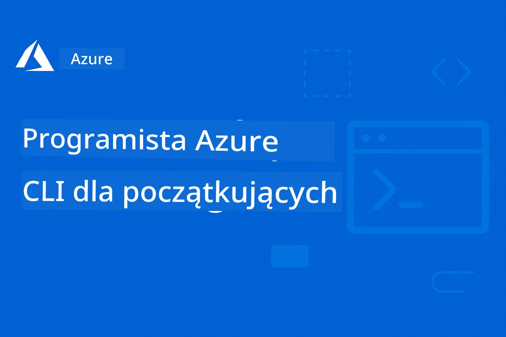

# AZD dla początkujących: Ustrukturyzowana ścieżka nauki

 

[](https://GitHub.com/microsoft/azd-for-beginners/watchers/)
[](https://GitHub.com/microsoft/azd-for-beginners/network/)
[](https://GitHub.com/microsoft/azd-for-beginners/stargazers/)

[](https://discord.gg/microsoft-azure)
[](https://discord.gg/nTYy5BXMWG)

## Pierwsze kroki z tym kursem

Wykonaj te kroki, aby rozpocząć swoją naukę AZD:

1. **Wykonaj fork repozytorium**: Kliknij [](https://GitHub.com/microsoft/azd-for-beginners/fork)
2. **Sklonuj repozytorium**: `git clone https://github.com/microsoft/azd-for-beginners.git`
3. **Dołącz do społeczności**: [Azure Discord Communities](https://discord.com/invite/ByRwuEEgH4) dla wsparcia ekspertów
4. **Wybierz swoją ścieżkę nauki**: Wybierz rozdział poniżej, który odpowiada Twojemu poziomowi doświadczenia

### Wsparcie wielojęzyczne

#### Automatyczne tłumaczenia (zawsze aktualne)

<!-- CO-OP TRANSLATOR LANGUAGES TABLE START -->
[Arabskie](../ar/README.md) | [Bengalski](../bn/README.md) | [Bułgarski](../bg/README.md) | [Birmański (Myanmar)](../my/README.md) | [Chiński (uproszczony)](../zh-CN/README.md) | [Chiński (tradycyjny, Hong Kong)](../zh-HK/README.md) | [Chiński (tradycyjny, Makau)](../zh-MO/README.md) | [Chiński (tradycyjny, Tajwan)](../zh-TW/README.md) | [Chorwacki](../hr/README.md) | [Czeski](../cs/README.md) | [Duński](../da/README.md) | [Niderlandzki](../nl/README.md) | [Estoński](../et/README.md) | [Fiński](../fi/README.md) | [Francuski](../fr/README.md) | [Niemiecki](../de/README.md) | [Grecki](../el/README.md) | [Hebrajski](../he/README.md) | [Hindi](../hi/README.md) | [Węgierski](../hu/README.md) | [Indonezyjski](../id/README.md) | [Włoski](../it/README.md) | [Japoński](../ja/README.md) | [Kannada](../kn/README.md) | [Koreański](../ko/README.md) | [Litewski](../lt/README.md) | [Malajski](../ms/README.md) | [Malajalam](../ml/README.md) | [Marathi](../mr/README.md) | [Nepalski](../ne/README.md) | [Nigeryjski pidgin](../pcm/README.md) | [Norweski](../no/README.md) | [Perski (Farsi)](../fa/README.md) | [Polski](./README.md) | [Portugalski (Brazylia)](../pt-BR/README.md) | [Portugalski (Portugalia)](../pt-PT/README.md) | [Pendżabski (Gurmukhi)](../pa/README.md) | [Rumuński](../ro/README.md) | [Rosyjski](../ru/README.md) | [Serbski (cyrylica)](../sr/README.md) | [Słowacki](../sk/README.md) | [Słoweński](../sl/README.md) | [Hiszpański](../es/README.md) | [Suahili](../sw/README.md) | [Szwedzki](../sv/README.md) | [Tagalog (Filipiński)](../tl/README.md) | [Tamilski](../ta/README.md) | [Telugu](../te/README.md) | [Tajski](../th/README.md) | [Turecki](../tr/README.md) | [Ukraiński](../uk/README.md) | [Urdu](../ur/README.md) | [Wietnamski](../vi/README.md)

> **Wolisz klonować lokalnie?**

> To repozytorium zawiera tłumaczenia na ponad 50 języków, co znacznie zwiększa rozmiar pobierania. Aby sklonować bez tłumaczeń, użyj sparse checkout:
> ```bash
> git clone --filter=blob:none --sparse https://github.com/microsoft/AZD-for-beginners.git
> cd AZD-for-beginners
> git sparse-checkout set --no-cone '/*' '!translations' '!translated_images'
> ```
> Dzięki temu pobierzesz wszystko, co potrzebne do ukończenia kursu, przy znacznie szybszym pobieraniu.
<!-- CO-OP TRANSLATOR LANGUAGES TABLE END -->

## Przegląd kursu

Opanuj Azure Developer CLI (azd) poprzez ustrukturyzowane rozdziały zaprojektowane dla stopniowej nauki. **Specjalny nacisk na wdrażanie aplikacji AI z integracją Microsoft Foundry.**

### Dlaczego ten kurs jest niezbędny dla nowoczesnych deweloperów

Na podstawie spostrzeżeń z społeczności Microsoft Foundry Discord, **45% deweloperów chce używać AZD do obciążeń AI**, ale napotyka wyzwania z:
- Złożonymi wielousługowymi architekturami AI
- Najlepszymi praktykami wdrażania AI w produkcji  
- Integracją i konfiguracją usług AI w Azure
- Optymalizacją kosztów obciążeń AI
- Rozwiązywaniem problemów specyficznych dla wdrożeń AI

### Cele nauki

Po ukończeniu tego ustrukturyzowanego kursu będziesz:
- **Opanować podstawy AZD**: Kluczowe koncepcje, instalacja i konfiguracja
- **Wdrażać aplikacje AI**: Korzystać z AZD i usług Microsoft Foundry
- **Implementować Infrastrukturę jako Kod**: Zarządzać zasobami Azure za pomocą szablonów Bicep
- **Rozwiązywać problemy z wdrożeniami**: Usuwać typowe błędy i debugować problemy
- **Optymalizować do produkcji**: Bezpieczeństwo, skalowanie, monitorowanie i zarządzanie kosztami
- **Budować rozwiązania Multi-Agentowe AI**: Wdrażać złożone architektury AI

## 📚 Rozdziały edukacyjne

*Wybierz swoją ścieżkę nauki na podstawie poziomu doświadczenia i celów*

### 🚀 Rozdział 1: Podstawy i szybki start
**Wymagania wstępne**: subskrypcja Azure, podstawowa znajomość wiersza poleceń  
**Czas trwania**: 30-45 minut  
**Poziom trudności**: ⭐

#### Czego się nauczysz
- Zrozumienie podstaw Azure Developer CLI
- Instalacja AZD na twojej platformie
- Twoje pierwsze udane wdrożenie

#### Materiały do nauki
- **🎯 Zacznij tutaj**: [Czym jest Azure Developer CLI?](../..)
- **📖 Teoria**: [Podstawy AZD](docs/getting-started/azd-basics.md) – Podstawowe pojęcia i terminologia
- **⚙️ Ustawienia**: [Instalacja i konfiguracja](docs/getting-started/installation.md) – Przewodniki dla platform
- **🛠️ Praktyka**: [Twój pierwszy projekt](docs/getting-started/first-project.md) – Samouczek krok po kroku
- **📋 Szybka ściąga**: [Cheat Sheet z poleceniami](resources/cheat-sheet.md)

#### Ćwiczenia praktyczne
```bash
# Szybka kontrola instalacji
azd version

# Wdróż swoją pierwszą aplikację
azd init --template todo-nodejs-mongo
azd up
```

**💡 Efekt rozdziału**: Pomyślnie wdrożysz prostą aplikację webową w Azure za pomocą AZD

**✅ Potwierdzenie sukcesu:**
```bash
# Po ukończeniu Rozdziału 1 powinieneś być w stanie:
azd version              # Pokazuje zainstalowaną wersję
azd init --template todo-nodejs-mongo  # Inicjalizuje projekt
azd up                  # Wdraża na Azure
azd show                # Wyświetla URL działającej aplikacji
# Aplikacja otwiera się w przeglądarce i działa
azd down --force --purge  # Usuwa zasoby
```

**📊 Czas pracy:** 30-45 minut  
**📈 Poziom po ukończeniu:** Potrafi samodzielnie wdrażać podstawowe aplikacje

**✅ Potwierdzenie sukcesu:**
```bash
# Po ukończeniu Rozdziału 1 powinieneś być w stanie:
azd version              # Pokazuje zainstalowaną wersję
azd init --template todo-nodejs-mongo  # Inicjuje projekt
azd up                  # Wdraża do Azure
azd show                # Wyświetla URL działającej aplikacji
# Aplikacja otwiera się w przeglądarce i działa
azd down --force --purge  # Czyści zasoby
```

**📊 Czas pracy:** 30-45 minut  
**📈 Poziom po ukończeniu:** Potrafi samodzielnie wdrażać podstawowe aplikacje

---

### 🤖 Rozdział 2: Rozwój AI w pierwszej kolejności (zalecany dla deweloperów AI)
**Wymagania wstępne**: ukończenie Rozdziału 1  
**Czas trwania**: 1-2 godziny  
**Poziom trudności**: ⭐⭐

#### Czego się nauczysz
- Integracja Microsoft Foundry z AZD
- Wdrażanie aplikacji zasilanych AI
- Zrozumienie konfiguracji usług AI

#### Materiały do nauki
- **🎯 Zacznij tutaj**: [Integracja Microsoft Foundry](docs/microsoft-foundry/microsoft-foundry-integration.md)
- **📖 Wzorce**: [Wdrożenie modelu AI](docs/microsoft-foundry/ai-model-deployment.md) – Wdrażanie i zarządzanie modelami AI
- **🛠️ Warsztat**: [Laboratorium AI](docs/microsoft-foundry/ai-workshop-lab.md) – Przygotuj swoje rozwiązania AI do AZD
- **🎥 Przewodnik interaktywny**: [Materiały warsztatowe](workshop/README.md) – Nauka w przeglądarce z MkDocs * Środowisko DevContainer
- **📋 Szablony**: [Szablony Microsoft Foundry](../..)
- **📝 Przykłady**: [Przykłady wdrożeń AZD](examples/README.md)

#### Ćwiczenia praktyczne
```bash
# Wdróż swoją pierwszą aplikację AI
azd init --template azure-search-openai-demo
azd up

# Wypróbuj dodatkowe szablony AI
azd init --template openai-chat-app-quickstart
azd init --template agent-openai-python-prompty
```

**💡 Efekt rozdziału**: Wdrożysz i skonfigurujesz aplikację czatu zasilaną AI z funkcjami RAG

**✅ Potwierdzenie sukcesu:**
```bash
# Po rozdziale 2 powinieneś być w stanie:
azd init --template azure-search-openai-demo
azd up
# Przetestować interfejs rozmowy AI
# Zadawać pytania i otrzymywać odpowiedzi oparte na AI wraz z źródłami
# Sprawdzić, czy integracja wyszukiwania działa
azd monitor  # Sprawdzić, czy Application Insights pokazuje telemetrię
azd down --force --purge
```

**📊 Czas pracy:** 1-2 godziny  
**📈 Poziom po ukończeniu:** Potrafi wdrażać i konfigurować aplikacje AI gotowe do produkcji  
**💰 Świadomość kosztów:** Rozumie koszty dev $80-150/mies., produkcji $300-3500/mies.

#### 💰 Rozważania kosztów wdrożeń AI

**Środowisko deweloperskie (szacunkowo $80-150/mies.):**
- Azure OpenAI (płać za użycie): $0-50/mies. (w zależności od tokenów)
- AI Search (poziom podstawowy): $75/mies.
- Container Apps (konsumpcja): $0-20/mies.
- Storage (standard): $1-5/mies.

**Środowisko produkcyjne (szacunkowo $300-3,500+/mies.):**
- Azure OpenAI (PTU dla stabilnej wydajności): $3,000+/mies. LUB płatność według użycia przy dużych wolumenach
- AI Search (poziom standard): $250/mies.
- Container Apps (dedykowane): $50-100/mies.
- Application Insights: $5-50/mies.
- Storage (premium): $10-50/mies.

**💡 Wskazówki optymalizacji kosztów:**
- Korzystaj z **Bezpłatnego poziomu** Azure OpenAI do nauki (50,000 tokenów miesięcznie wliczone)
- Używaj `azd down` aby zwolnić zasoby, gdy nie rozwijasz aktywnie
- Zacznij od modelu rozliczeń na podstawie zużycia, na PTU przejdź dopiero do produkcji
- Użyj `azd provision --preview` by oszacować koszty przed wdrożeniem
- Włącz autoskalowanie: płać tylko za rzeczywiste użycie

**Monitorowanie kosztów:**
```bash
# Sprawdź szacunkowe miesięczne koszty
azd provision --preview

# Monitoruj rzeczywiste koszty w portalu Azure
az consumption budget list --resource-group <your-rg>
```

---

### ⚙️ Rozdział 3: Konfiguracja i uwierzytelnianie
**Wymagania wstępne**: ukończenie Rozdziału 1  
**Czas trwania**: 45-60 minut  
**Poziom trudności**: ⭐⭐

#### Czego się nauczysz
- Konfiguracja i zarządzanie środowiskami
- Najlepsze praktyki uwierzytelniania i bezpieczeństwa
- Nazewnictwo i organizacja zasobów

#### Materiały do nauki
- **📖 Konfiguracja**: [Przewodnik konfiguracji](docs/getting-started/configuration.md) – Konfiguracja środowiska
- **🔐 Bezpieczeństwo**: [Wzorce uwierzytelniania i tożsamość zarządzana](docs/getting-started/authsecurity.md) – Wzorce uwierzytelniania
- **📝 Przykłady**: [Przykład aplikacji bazodanowej](examples/database-app/README.md) – Przykłady bazy AZD

#### Ćwiczenia praktyczne
- Konfiguracja wielu środowisk (dev, staging, prod)
- Ustawienie uwierzytelniania tożsamości zarządzanej
- Implementacja konfiguracji specyficznych dla środowiska

**💡 Efekt rozdziału**: Zarządzanie wieloma środowiskami z prawidłowym uwierzytelnianiem i bezpieczeństwem

---

### 🏗️ Rozdział 4: Infrastruktura jako kod i wdrożenie
**Wymagania wstępne**: ukończenie Rozdziałów 1-3  
**Czas trwania**: 1-1.5 godziny  
**Poziom trudności**: ⭐⭐⭐

#### Czego się nauczysz
- Zaawansowane wzorce wdrożeń
- Infrastruktura jako kod z Bicep
- Strategie provisioningu zasobów

#### Materiały do nauki
- **📖 Wdrożenie**: [Przewodnik wdrożeń](docs/deployment/deployment-guide.md) – Kompleksowe przepływy pracy
- **🏗️ Provisioning**: [Provisioning zasobów](docs/deployment/provisioning.md) – Zarządzanie zasobami Azure
- **📝 Przykłady**: [Przykład Container App](../../examples/container-app) – Wdrożenia kontenerowe

#### Ćwiczenia praktyczne
- Tworzenie niestandardowych szablonów Bicep
- Wdrażanie aplikacji multi-usługowych
- Implementacja strategii wdrożeń blue-green

**💡 Efekt rozdziału**: Wdrażanie złożonych aplikacji multi-usługowych przy użyciu niestandardowych szablonów infrastruktury

---

### 🎯 Rozdział 5: Wieloagentowe rozwiązania AI (zaawansowane)
**Wymagania wstępne**: ukończenie Rozdziałów 1-2  
**Czas trwania**: 2-3 godziny  
**Poziom trudności**: ⭐⭐⭐⭐
#### Czego się nauczysz
- Wzorce architektury wieloagentowej
- Orkiestracja i koordynacja agentów
- Produkcyjne wdrożenia AI

#### Zasoby do nauki
- **🤖 Prezentowany projekt**: [Rozwiązanie wieloagentowe dla detalistów](examples/retail-scenario.md) - Kompletna implementacja
- **🛠️ Szablony ARM**: [Pakiet szablonów ARM](../../examples/retail-multiagent-arm-template) - Wdrożenie jednym kliknięciem
- **📖 Architektura**: [Wzorce koordynacji wieloagentowej](/docs/pre-deployment/coordination-patterns.md) - Wzorce

#### Ćwiczenia praktyczne
```bash
# Wdróż kompletną wieloagentową rozwiązanie dla handlu detalicznego
cd examples/retail-multiagent-arm-template
./deploy.sh

# Zbadaj konfiguracje agentów
az deployment group show --resource-group <rg-name> --name <deployment-name>
```

**💡 Cel rozdziału**: Wdróż i zarządzaj produkcyjnym rozwiązaniem AI wieloagentowym z agentami Klienta i Magazynu

---

### 🔍 Rozdział 6: Walidacja i planowanie przed wdrożeniem
**Wymagania wstępne**: Rozdział 4 ukończony  
**Czas trwania**: 1 godzina  
**Złożoność**: ⭐⭐

#### Czego się nauczysz
- Planowanie zdolności i walidacja zasobów
- Strategie wyboru SKU
- Kontrole przedwdrożeniowe i automatyzacja

#### Zasoby do nauki
- **📊 Planowanie**: [Planowanie zdolności](docs/pre-deployment/capacity-planning.md) - Walidacja zasobów
- **💰 Wybór**: [Wybór SKU](docs/pre-deployment/sku-selection.md) - Kosztowo efektywne decyzje
- **✅ Walidacja**: [Kontrole przedwdrożeniowe](docs/pre-deployment/preflight-checks.md) - Skrypty automatyczne

#### Ćwiczenia praktyczne
- Uruchomienie skryptów walidacji zasobów
- Optymalizacja wyboru SKU pod kątem kosztów
- Implementacja automatycznych kontroli przed wdrożeniem

**💡 Cel rozdziału**: Zweryfikuj i zoptymalizuj wdrożenia przed wykonaniem

---

### 🚨 Rozdział 7: Rozwiązywanie problemów i debugowanie
**Wymagania wstępne**: Ukończony dowolny rozdział dotyczący wdrożeń  
**Czas trwania**: 1-1,5 godziny  
**Złożoność**: ⭐⭐

#### Czego się nauczysz
- Systematyczne podejścia do debugowania
- Typowe problemy i ich rozwiązania
- Specyficzne problemy AI

#### Zasoby do nauki
- **🔧 Typowe problemy**: [Typowe problemy](docs/troubleshooting/common-issues.md) - FAQ i rozwiązania
- **🕵️ Debugowanie**: [Przewodnik debugowania](docs/troubleshooting/debugging.md) - Strategie krok po kroku
- **🤖 Problemy AI**: [Rozwiązywanie problemów AI](docs/troubleshooting/ai-troubleshooting.md) - Problemy usług AI

#### Ćwiczenia praktyczne
- Diagnoza awarii wdrożeń
- Rozwiązywanie problemów z uwierzytelnianiem
- Debugowanie łączności usług AI

**💡 Cel rozdziału**: Samodzielnie diagnozuj i rozwiązuj typowe problemy wdrożeniowe

---

### 🏢 Rozdział 8: Wzorce produkcyjne i korporacyjne
**Wymagania wstępne**: Rozdziały 1-4 ukończone  
**Czas trwania**: 2-3 godziny  
**Złożoność**: ⭐⭐⭐⭐

#### Czego się nauczysz
- Strategie wdrożeń produkcyjnych
- Wzorce bezpieczeństwa korporacyjnego
- Monitorowanie i optymalizacja kosztów

#### Zasoby do nauki
- **🏭 Produkcja**: [Najlepsze praktyki AI w produkcji](docs/microsoft-foundry/production-ai-practices.md) - Wzorce korporacyjne
- **📝 Przykłady**: [Przykład mikrousług](../../examples/microservices) - Złożone architektury
- **📊 Monitorowanie**: [Integracja Application Insights](docs/pre-deployment/application-insights.md) - Monitorowanie

#### Ćwiczenia praktyczne
- Wdrożenie wzorców bezpieczeństwa korporacyjnego
- Skonfigurowanie kompleksowego monitoringu
- Wdrożenie aplikacji produkcyjnej z odpowiednim zarządzaniem

**💡 Cel rozdziału**: Uruchom aplikacje gotowe do produkcji z pełnymi funkcjami produkcyjnymi

---

## 🎓 Przegląd warsztatu: Praktyczne doświadczenie w nauce

> **⚠️ STATUS WARSZTATU: Aktywny rozwój**  
> Materiały warsztatowe są obecnie opracowywane i udoskonalane. Podstawowe moduły działają, jednak niektóre zaawansowane części są niekompletne. Aktywnie pracujemy nad ukończeniem całej zawartości. [Śledź postęp →](workshop/README.md)

### Interaktywne materiały warsztatowe
**Kompleksowa, praktyczna nauka z narzędziami działającymi w przeglądarce i ćwiczeniami prowadzonymi**

Nasze materiały warsztatowe oferują uporządkowane, interaktywne doświadczenie nauki, które uzupełnia opisany wyżej program rozdziałów. Warsztat jest zaprojektowany zarówno do samodzielnej nauki, jak i sesji prowadzonych przez instruktora.

#### 🛠️ Cechy warsztatu
- **Interfejs przeglądarkowy**: Kompletny warsztat oparty na MkDocs z wyszukiwaniem, kopiowaniem i funkcjami motywu
- **Integracja GitHub Codespaces**: Konfiguracja środowiska deweloperskiego jednym kliknięciem
- **Struktura nauki w 7 krokach**: Prowadzone ćwiczenia (łącznie 3,5 godziny)
- **Odkrywanie → Wdrożenie → Personalizacja**: Progresywna metodologia
- **Interaktywne środowisko DevContainer**: Przedkonfigurowane narzędzia i zależności

#### 📚 Struktura warsztatu
Warsztat realizuje metodologię **Odkrywanie → Wdrożenie → Personalizacja**:

1. **Faza odkrywania** (45 min)
   - Eksploracja szablonów i usług Microsoft Foundry
   - Zrozumienie wzorców architektury wieloagentowej
   - Przegląd wymagań i warunków wstępnych wdrożenia

2. **Faza wdrożenia** (2 godziny)
   - Praktyczne wdrażanie aplikacji AI z AZD
   - Konfiguracja usług Azure AI i punktów końcowych
   - Implementacja wzorców bezpieczeństwa i uwierzytelniania

3. **Faza personalizacji** (45 min)
   - Modyfikacja aplikacji na potrzeby konkretnych zastosowań
   - Optymalizacja do wdrożenia produkcyjnego
   - Implementacja monitoringu i zarządzania kosztami

#### 🚀 Rozpoczęcie pracy z warsztatem
```bash
# Opcja 1: GitHub Codespaces (zalecane)
# Kliknij "Code" → "Create codespace on main" w repozytorium

# Opcja 2: Lokalny rozwój
git clone https://github.com/microsoft/azd-for-beginners.git
cd azd-for-beginners/workshop
# Postępuj zgodnie z instrukcjami konfiguracji w workshop/README.md
```

#### 🎯 Cele warsztatu
Po ukończeniu warsztatu uczestnicy będą potrafili:
- **Wdróż produkcyjne aplikacje AI**: Używając AZD oraz usług Microsoft Foundry
- **Opanuj architektury wieloagentowe**: Implementuj skoordynowane rozwiązania z agentami AI
- **Wdróż najlepsze praktyki bezpieczeństwa**: Konfiguruj uwierzytelnianie i kontrolę dostępu
- **Optymalizuj skalowanie**: Projektuj wdrożenia kosztowo efektywne i wydajne
- **Rozwiązuj problemy wdrożeń**: Samodzielnie diagnozuj i usuwaj typowe problemy

#### 📖 Zasoby warsztatowe
- **🎥 Przewodnik interaktywny**: [Materiały warsztatowe](workshop/README.md) - Środowisko nauki w przeglądarce
- **📋 Instrukcje krok po kroku**: [Prowadzone ćwiczenia](../../workshop/docs/instructions) - Szczegółowe instrukcje
- **🛠️ Laboratorium AI**: [Laboratorium AI](docs/microsoft-foundry/ai-workshop-lab.md) - Ćwiczenia skoncentrowane na AI
- **💡 Szybki start**: [Przewodnik konfiguracji warsztatu](workshop/README.md#quick-start) - Konfiguracja środowiska

**Idealne dla**: szkoleń korporacyjnych, kursów uniwersyteckich, samodzielnej nauki i bootcampów dla programistów.

---

## 📖 Czym jest Azure Developer CLI?

Azure Developer CLI (azd) to interfejs wiersza poleceń skoncentrowany na deweloperze, który przyspiesza proces budowania i wdrażania aplikacji na platformie Azure. Oferuje:

- **Wdrożenia oparte na szablonach** – korzystaj z gotowych szablonów dla powszechnych wzorców aplikacji
- **Infrastruktura jako kod** – zarządzaj zasobami Azure za pomocą Bicep lub Terraform  
- **Zintegrowane przepływy pracy** – płynne provisionowanie, wdrażanie i monitorowanie aplikacji
- **Przyjazne dla dewelopera** – zoptymalizowane dla produktywności i doświadczenia programisty

### **AZD + Microsoft Foundry: idealne do wdrożeń AI**

**Dlaczego AZD dla rozwiązań AI?** AZD rozwiązuje największe wyzwania, z jakimi mierzą się programiści AI:

- **Szablony gotowe do AI** – Wstępnie skonfigurowane szablony dla Azure OpenAI, Cognitive Services i obciążeń ML
- **Bezpieczne wdrożenia AI** – Wbudowane wzorce bezpieczeństwa dla usług AI, kluczy API i punktów końcowych modeli  
- **Wzorce produkcyjne AI** – Najlepsze praktyki skalowalnych i kosztowo efektywnych wdrożeń aplikacji AI
- **Kompleksowe przepływy AI** – Od rozwoju modeli po wdrożenie produkcyjne z monitorowaniem
- **Optymalizacja kosztów** – Inteligentne alokacje zasobów i strategie skalowania dla obciążeń AI
- **Integracja z Microsoft Foundry** – Bezproblemowe połączenie z katalogiem modeli i punktami końcowymi Microsoft Foundry

---

## 🎯 Biblioteka szablonów i przykładów

### Polecane: Szablony Microsoft Foundry
**Zacznij tutaj, jeśli wdrażasz aplikacje AI!**

> **Uwaga:** Te szablony demonstrują różne wzorce AI. Niektóre to zewnętrzne próbki Azure, inne to lokalne implementacje.

| Szablon | Rozdział | Złożoność | Usługi | Typ |
|----------|---------|------------|----------|------|
| [**Get started with AI chat**](https://github.com/Azure-Samples/get-started-with-ai-chat) | Rozdział 2 | ⭐⭐ | AzureOpenAI + Azure AI Model Inference API + Azure AI Search + Azure Container Apps + Application Insights | Zewnętrzny |
| [**Get started with AI agents**](https://github.com/Azure-Samples/get-started-with-ai-agents) | Rozdział 2 | ⭐⭐ | Azure AI Agent Service + AzureOpenAI + Azure AI Search + Azure Container Apps + Application Insights| Zewnętrzny |
| [**Azure Search + OpenAI Demo**](https://github.com/Azure-Samples/azure-search-openai-demo) | Rozdział 2 | ⭐⭐ | AzureOpenAI + Azure AI Search + App Service + Storage | Zewnętrzny |
| [**OpenAI Chat App Quickstart**](https://github.com/Azure-Samples/openai-chat-app-quickstart) | Rozdział 2 | ⭐ | AzureOpenAI + Container Apps + Application Insights | Zewnętrzny |
| [**Agent OpenAI Python Prompty**](https://github.com/Azure-Samples/agent-openai-python-prompty) | Rozdział 5 | ⭐⭐⭐ | AzureOpenAI + Azure Functions + Prompty | Zewnętrzny |
| [**Contoso Chat RAG**](https://github.com/Azure-Samples/contoso-chat) | Rozdział 8 | ⭐⭐⭐⭐ | AzureOpenAI + AI Search + Cosmos DB + Container Apps | Zewnętrzny |
| [**Retail Multi-Agent Solution**](examples/retail-scenario.md) | Rozdział 5 | ⭐⭐⭐⭐ | AzureOpenAI + AI Search + Storage + Container Apps + Cosmos DB | **Lokalny** |

### Polecane: Kompleksowe scenariusze szkoleniowe
**Szablony aplikacji produkcyjnych powiązane z rozdziałami**

| Szablon | Rozdział szkoleniowy | Złożoność | Kluczowa nauka |
|----------|------------------|------------|--------------|
| [**openai-chat-app-quickstart**](https://github.com/Azure-Samples/openai-chat-app-quickstart) | Rozdział 2 | ⭐ | Podstawowe wzorce wdrożeń AI |
| [**azure-search-openai-demo**](https://github.com/Azure-Samples/azure-search-openai-demo) | Rozdział 2 | ⭐⭐ | Implementacja RAG z Azure AI Search |
| [**ai-document-processing**](https://github.com/Azure-Samples/ai-document-processing) | Rozdział 4 | ⭐⭐ | Integracja inteligencji dokumentów |
| [**agent-openai-python-prompty**](https://github.com/Azure-Samples/agent-openai-python-prompty) | Rozdział 5 | ⭐⭐⭐ | Framework agentów i wywoływanie funkcji |
| [**contoso-chat**](https://github.com/Azure-Samples/contoso-chat) | Rozdział 8 | ⭐⭐⭐ | Orkiestracja AI dla przedsiębiorstw |
| [**retail-multi-agent-solution**](examples/retail-scenario.md) | Rozdział 5 | ⭐⭐⭐⭐ | Architektura wieloagentowa z agentami Klienta i Magazynu |

### Nauka na przykładach według typu

> **📌 Przykłady lokalne vs. Zewnętrzne:**  
> **Przykłady lokalne** (w tym repozytorium) = Gotowe do użycia od razu  
> **Przykłady zewnętrzne** (Azure Samples) = Klonuj z powiązanych repozytoriów

#### Przykłady lokalne (gotowe do użycia)
- [**Rozwiązanie wieloagentowe dla detalistów**](examples/retail-scenario.md) - Kompletny, produkcyjny przykład z szablonami ARM
  - Architektura wieloagentowa (agenci Klienta i Magazynu)
  - Kompleksowe monitorowanie i ewaluacja
  - Wdrożenie jednym kliknięciem przez szablon ARM

#### Przykłady lokalne - aplikacje kontenerowe (rozdziały 2-5)
**Kompleksowe przykłady wdrożeń kontenerów w tym repozytorium:**
- [**Przykłady aplikacji kontenerowych**](examples/container-app/README.md) - Kompletny przewodnik wdrożeń konteneryzowanych
  - [Proste API Flask](../../examples/container-app/simple-flask-api) - Podstawowe REST API ze skalowalnością do zera
  - [Architektura mikrousług](../../examples/container-app/microservices) - Produkcyjne wdrożenia wielousługowe
  - Szybki start, produkcja i zaawansowane wzorce wdrożeń
  - Wytyczne dot. monitorowania, zabezpieczeń i optymalizacji kosztów

#### Przykłady zewnętrzne - proste aplikacje (rozdziały 1-2)
**Klonuj te repozytoria Azure Samples, by zacząć:**
- [Prosta aplikacja webowa - Node.js + MongoDB](https://github.com/Azure-Samples/todo-nodejs-mongo) - Podstawowe wzorce wdrożeń
- [Statyczna strona - React SPA](https://github.com/Azure-Samples/todo-csharp-sql-swa-func) - Wdrożenie zawartości statycznej
- [Aplikacja kontenerowa - Python Flask](https://github.com/Azure-Samples/container-apps-store-api-microservice) - Wdrożenie REST API

#### Przykłady zewnętrzne - integracja bazy danych (rozdziały 3-4)  
- [Aplikacja bazodanowa - C# + SQL](https://github.com/Azure-Samples/todo-csharp-sql) - Wzorce łączności z bazą danych
- [Funkcje + Cosmos DB](https://github.com/Azure-Samples/todo-python-mongo-swa-func) - Workflow danych bezserwerowych

#### Przykłady zewnętrzne - wzorce zaawansowane (rozdziały 4-8)
- [Mikrousługi Java](https://github.com/Azure-Samples/java-microservices-aca-lab) - Architektury wielousługowe
- [Zadania w Container Apps](https://github.com/Azure-Samples/container-apps-jobs) - Przetwarzanie w tle  
- [Enterprise ML Pipeline](https://github.com/Azure-Samples/mlops-v2) - Produkcyjne wzorce ML

### Zewnętrzne kolekcje szablonów
- [**Oficjalna galeria szablonów AZD**](https://azure.github.io/awesome-azd/) - Zbiór oficjalnych i społecznościowych szablonów
- [**Szablony Azure Developer CLI**](https://learn.microsoft.com/en-us/azure/developer/azure-developer-cli/azd-templates) - Dokumentacja szablonów Microsoft Learn
- [**Katalog przykładów**](examples/README.md) - Lokalne przykłady do nauki z szczegółowymi objaśnieniami

---

## 📚 Materiały do nauki i odniesienia

### Szybkie odniesienia
- [**Skrót poleceń**](resources/cheat-sheet.md) - Kluczowe polecenia azd zorganizowane według rozdziałów
- [**Słownik**](resources/glossary.md) - Terminologia Azure i azd  
- [**FAQ**](resources/faq.md) - Najczęstsze pytania zorganizowane według rozdziałów
- [**Przewodnik nauki**](resources/study-guide.md) - Kompleksowe ćwiczenia praktyczne

### Warsztaty praktyczne
- [**Laboratorium warsztatowe AI**](docs/microsoft-foundry/ai-workshop-lab.md) - Uczyń swoje rozwiązania AI możliwymi do wdrożenia przez AZD (2-3 godziny)
- [**Interaktywny przewodnik warsztatowy**](workshop/README.md) - Warsztat w przeglądarce z MkDocs i środowiskiem DevContainer
- [**Strukturalna ścieżka nauczania**](../../workshop/docs/instructions) - 7-etapowe ćwiczenia prowadzane (Odkrywanie → Wdrożenie → Dostosowanie)
- [**Warsztat AZD dla początkujących**](workshop/README.md) - Kompletny materiał warsztatowy z integracją GitHub Codespaces

### Zewnętrzne zasoby edukacyjne
- Dokumentacja Azure Developer CLI (https://learn.microsoft.com/en-us/azure/developer/azure-developer-cli/)
- Centrum architektury Azure (https://learn.microsoft.com/en-us/azure/architecture/)
- Kalkulator cen Azure (https://azure.microsoft.com/pricing/calculator/)
- Status Azure (https://status.azure.com/)

---

## 🔧 Szybki przewodnik rozwiązywania problemów

**Typowe problemy, z którymi borykają się początkujący, i szybkie rozwiązania:**

### ❌ "azd: command not found"

```bash
# Najpierw zainstaluj AZD
# Windows (PowerShell):
winget install microsoft.azd

# macOS:
brew tap azure/azd && brew install azd

# Linux:
curl -fsSL https://aka.ms/install-azd.sh | bash

# Sprawdź instalację
azd version
```

### ❌ "No subscription found" lub "Subscription not set"

```bash
# Wyświetl dostępne subskrypcje
az account list --output table

# Ustaw domyślną subskrypcję
az account set --subscription "<subscription-id-or-name>"

# Ustaw dla środowiska AZD
azd env set AZURE_SUBSCRIPTION_ID "<subscription-id>"

# Zweryfikuj
az account show
```

### ❌ "InsufficientQuota" lub "Quota exceeded"

```bash
# Wypróbuj inny region Azure
azd env set AZURE_LOCATION "westus2"
azd up

# Lub użyj mniejszych SKU podczas rozwoju
# Edytuj infra/main.parameters.json:
{
  "sku": "B1"  // Instead of "P1V2"
}
```

### ❌ "azd up" przerywa działanie w połowie

```bash
# Opcja 1: Wyczyść i spróbuj ponownie
azd down --force --purge
azd up

# Opcja 2: Napraw tylko infrastrukturę
azd provision

# Opcja 3: Sprawdź szczegółowe logi
azd show
azd logs
```

### ❌ "Authentication failed" lub "Token expired"

```bash
# Ponownie uwierzytelnij
az logout
az login

azd auth logout
azd auth login

# Zweryfikuj uwierzytelnienie
az account show
```

### ❌ "Resource already exists" lub konflikty nazewnictwa

```bash
# AZD generuje unikalne nazwy, ale w przypadku konfliktu:
azd down --force --purge

# Następnie spróbuj ponownie ze świeżym środowiskiem
azd env new dev-v2
azd up
```

### ❌ Wdrażanie szablonu trwa zbyt długo

**Normalny czas oczekiwania:**
- Prosta aplikacja internetowa: 5-10 minut
- Aplikacja z bazą danych: 10-15 minut
- Aplikacje AI: 15-25 minut (prowizjonowanie OpenAI jest wolne)

```bash
# Sprawdź postęp
azd show

# Jeśli utknąłeś na >30 minut, sprawdź portal Azure:
azd monitor
# Szukaj nieudanych wdrożeń
```

### ❌ "Permission denied" lub "Forbidden"

```bash
# Sprawdź swoją rolę w Azure
az role assignment list --assignee $(az account show --query user.name -o tsv)

# Potrzebujesz co najmniej roli "Contributor"
# Poproś administratora Azure o przyznanie:
# - Contributor (dla zasobów)
# - User Access Administrator (dla przypisań ról)
```

### ❌ Nie można znaleźć URL wdrożonej aplikacji

```bash
# Pokaż wszystkie punkty końcowe usług
azd show

# Lub otwórz portal Azure
azd monitor

# Sprawdź konkretną usługę
azd env get-values
# Szukaj zmiennych *_URL
```

### 📚 Pełne materiały pomocy technicznej

- **Przewodnik po typowych problemach:** [Szczegółowe rozwiązania](docs/troubleshooting/common-issues.md)
- **Problemy specyficzne dla AI:** [Rozwiązywanie problemów z AI](docs/troubleshooting/ai-troubleshooting.md)
- **Przewodnik debugowania:** [Krok po kroku debugowanie](docs/troubleshooting/debugging.md)
- **Uzyskaj pomoc:** [Azure Discord](https://discord.gg/microsoft-azure) #azure-developer-cli

---

## 🔧 Szybki przewodnik rozwiązywania problemów

**Typowe problemy, z którymi borykają się początkujący, i szybkie rozwiązania:**

<details>
<summary><strong>❌ "azd: command not found"</strong></summary>

```bash
# Najpierw zainstaluj AZD
# Windows (PowerShell):
winget install microsoft.azd

# macOS:
brew tap azure/azd && brew install azd

# Linux:
curl -fsSL https://aka.ms/install-azd.sh | bash

# Zweryfikuj instalację
azd version
```
</details>

<details>
<summary><strong>❌ "No subscription found" lub "Subscription not set"</strong></summary>

```bash
# Wyświetl dostępne subskrypcje
az account list --output table

# Ustaw domyślną subskrypcję
az account set --subscription "<subscription-id-or-name>"

# Ustaw dla środowiska AZD
azd env set AZURE_SUBSCRIPTION_ID "<subscription-id>"

# Zweryfikuj
az account show
```
</details>

<details>
<summary><strong>❌ "InsufficientQuota" lub "Quota exceeded"</strong></summary>

```bash
# Wypróbuj inny region Azure
azd env set AZURE_LOCATION "westus2"
azd up

# Lub użyj mniejszych SKU podczas tworzenia
# Edytuj infra/main.parameters.json:
{
  "sku": "B1"  // Instead of "P1V2"
}
```
</details>

<details>
<summary><strong>❌ "azd up" przerywa działanie w połowie</strong></summary>

```bash
# Opcja 1: Wyczyść i spróbuj ponownie
azd down --force --purge
azd up

# Opcja 2: Napraw tylko infrastrukturę
azd provision

# Opcja 3: Sprawdź szczegółowe logi
azd show
azd logs
```
</details>

<details>
<summary><strong>❌ "Authentication failed" lub "Token expired"</strong></summary>

```bash
# Ponowna autoryzacja
az logout
az login

azd auth logout
azd auth login

# Weryfikuj uwierzytelnianie
az account show
```
</details>

<details>
<summary><strong>❌ "Resource already exists" lub konflikty nazewnictwa</strong></summary>

```bash
# AZD generuje unikalne nazwy, ale w przypadku konfliktu:
azd down --force --purge

# Następnie spróbuj ponownie z nowym środowiskiem
azd env new dev-v2
azd up
```
</details>

<details>
<summary><strong>❌ Wdrażanie szablonu trwa zbyt długo</strong></summary>

**Normalny czas oczekiwania:**
- Prosta aplikacja internetowa: 5-10 minut
- Aplikacja z bazą danych: 10-15 minut
- Aplikacje AI: 15-25 minut (prowizjonowanie OpenAI jest wolne)

```bash
# Sprawdź postęp
azd show

# Jeśli utkniesz na ponad 30 minut, sprawdź portal Azure:
azd monitor
# Szukaj nieudanych wdrożeń
```
</details>

<details>
<summary><strong>❌ "Permission denied" lub "Forbidden"</strong></summary>

```bash
# Sprawdź swoją rolę w Azure
az role assignment list --assignee $(az account show --query user.name -o tsv)

# Potrzebujesz przynajmniej roli "Współtwórca"
# Poproś administratora Azure o przyznanie:
# - Współtwórca (dla zasobów)
# - Administrator dostępu użytkownika (dla przypisań ról)
```
</details>

<details>
<summary><strong>❌ Nie można znaleźć URL wdrożonej aplikacji</strong></summary>

```bash
# Pokaż wszystkie punkty końcowe usług
azd show

# Lub otwórz portal Azure
azd monitor

# Sprawdź konkretną usługę
azd env get-values
# Szukaj zmiennych *_URL
```
</details>

### 📚 Pełne materiały pomocy technicznej

- **Przewodnik po typowych problemach:** [Szczegółowe rozwiązania](docs/troubleshooting/common-issues.md)
- **Problemy specyficzne dla AI:** [Rozwiązywanie problemów z AI](docs/troubleshooting/ai-troubleshooting.md)
- **Przewodnik debugowania:** [Krok po kroku debugowanie](docs/troubleshooting/debugging.md)
- **Uzyskaj pomoc:** [Azure Discord](https://discord.gg/microsoft-azure) #azure-developer-cli

---

## 🎓 Ukończenie kursu i certyfikacja

### Śledzenie postępów
Śledź swój postęp w nauce w każdym rozdziale:

- [ ] **Rozdział 1**: Podstawy i szybki start ✅
- [ ] **Rozdział 2**: AI-First Development ✅  
- [ ] **Rozdział 3**: Konfiguracja i uwierzytelnianie ✅
- [ ] **Rozdział 4**: Infrastruktura jako kod i wdrożenie ✅
- [ ] **Rozdział 5**: Rozwiązania AI z wieloma agentami ✅
- [ ] **Rozdział 6**: Walidacja i planowanie przed wdrożeniem ✅
- [ ] **Rozdział 7**: Rozwiązywanie problemów i debugowanie ✅
- [ ] **Rozdział 8**: Wzorce produkcyjne i korporacyjne ✅

### Weryfikacja nauki
Po ukończeniu każdego rozdziału potwierdź swoją wiedzę poprzez:
1. **Ćwiczenie praktyczne**: Ukończ praktyczne wdrożenie rozdziału
2. **Sprawdzenie wiedzy**: Przejrzyj sekcję FAQ dla swojego rozdziału
3. **Dyskusje społeczności**: Podziel się doświadczeniem na Azure Discord
4. **Następny rozdział**: Przejdź do kolejnego poziomu zaawansowania

### Korzyści z ukończenia kursu
Po ukończeniu wszystkich rozdziałów zyskasz:
- **Doświadczenie produkcyjne**: Wdrożone realne aplikacje AI na Azure
- **Umiejętności zawodowe**: Gotowość do wdrożeń na poziomie przedsiębiorstwa  
- **Uznanie w społeczności**: Aktywny członek społeczności deweloperów Azure
- **Postęp w karierze**: Poszukiwane umiejętności wdrożeń AZD i AI

---

## 🤝 Społeczność i wsparcie

### Uzyskaj pomoc i wsparcie
- **Problemy techniczne**: [Zgłaszaj błędy i prośby o funkcje](https://github.com/microsoft/azd-for-beginners/issues)
- **Pytania dotyczące nauki**: [Społeczność Microsoft Azure Discord](https://discord.gg/microsoft-azure) oraz [](https://discord.gg/nTYy5BXMWG)
- **Pomoc dotycząca AI**: Dołącz do [](https://discord.gg/nTYy5BXMWG)
- **Dokumentacja**: [Oficjalna dokumentacja Azure Developer CLI](https://learn.microsoft.com/en-us/azure/developer/azure-developer-cli/)

### Spojrzenie w społeczność Microsoft Foundry Discord

**Najnowsze wyniki ankiety z kanału #Azure:**
- **45%** deweloperów chce używać AZD do obciążeń AI
- **Główne wyzwania**: wdrożenia wieloserwisowe, zarządzanie poświadczeniami, gotowość produkcyjna  
- **Najczęściej proszone o**: szablony specyficzne dla AI, przewodniki rozwiązywania problemów, najlepsze praktyki

**Dołącz do naszej społeczności, aby:**
- Dzielenie się doświadczeniami AZD + AI i uzyskiwać pomoc
- Uzyskać wczesny dostęp do nowych szablonów AI
- Współtworzyć najlepsze praktyki wdrożeń AI
- Wpływać na przyszły rozwój funkcji AI + AZD

### Wkład w kurs
Zapraszamy do współpracy! Przeczytaj nasz [Przewodnik współtworzenia](CONTRIBUTING.md), aby dowiedzieć się więcej o:
- **Ulepszaniu treści**: Rozbudowa istniejących rozdziałów i przykładów
- **Nowych przykładach**: Dodawanie rzeczywistych scenariuszy i szablonów  
- **Tłumaczeniu**: Pomoc w utrzymaniu wsparcia wielojęzycznego
- **Zgłoszeniach błędów**: Poprawa dokładności i jasności
- **Standardach społeczności**: Przestrzeganie naszych inkluzywnych wytycznych społeczności

---

## 📄 Informacje o kursie

### Licencja
Projekt jest udostępniony na licencji MIT - szczegóły w pliku [LICENSE](../../LICENSE).

### Powiązane materiały Microsoft Learn

Nasz zespół tworzy inne kompleksowe kursy edukacyjne:

<!-- CO-OP TRANSLATOR OTHER COURSES START -->
### LangChain
[](https://aka.ms/langchain4j-for-beginners)
[](https://aka.ms/langchainjs-for-beginners?WT.mc_id=m365-94501-dwahlin)
[](https://github.com/microsoft/langchain-for-beginners?WT.mc_id=m365-94501-dwahlin)
---

### Azure / Edge / MCP / Agenci
[](https://github.com/microsoft/AZD-for-beginners?WT.mc_id=academic-105485-koreyst)
[](https://github.com/microsoft/edgeai-for-beginners?WT.mc_id=academic-105485-koreyst)
[](https://github.com/microsoft/mcp-for-beginners?WT.mc_id=academic-105485-koreyst)
[](https://github.com/microsoft/ai-agents-for-beginners?WT.mc_id=academic-105485-koreyst)

---
 
### Seria Generatywnej AI
[](https://github.com/microsoft/generative-ai-for-beginners?WT.mc_id=academic-105485-koreyst)
[-9333EA?style=for-the-badge&labelColor=E5E7EB&color=9333EA)](https://github.com/microsoft/Generative-AI-for-beginners-dotnet?WT.mc_id=academic-105485-koreyst)
[-C084FC?style=for-the-badge&labelColor=E5E7EB&color=C084FC)](https://github.com/microsoft/generative-ai-for-beginners-java?WT.mc_id=academic-105485-koreyst)
[-E879F9?style=for-the-badge&labelColor=E5E7EB&color=E879F9)](https://github.com/microsoft/generative-ai-with-javascript?WT.mc_id=academic-105485-koreyst)

---
 
### Niezbędna nauka

[](https://aka.ms/ml-beginners?WT.mc_id=academic-105485-koreyst)
[](https://aka.ms/datascience-beginners?WT.mc_id=academic-105485-koreyst)
[](https://aka.ms/ai-beginners?WT.mc_id=academic-105485-koreyst)
[](https://github.com/microsoft/Security-101?WT.mc_id=academic-96948-sayoung)
[](https://aka.ms/webdev-beginners?WT.mc_id=academic-105485-koreyst)
[](https://aka.ms/iot-beginners?WT.mc_id=academic-105485-koreyst)
[](https://github.com/microsoft/xr-development-for-beginners?WT.mc_id=academic-105485-koreyst)

---
 
### Seria Copilot
[](https://aka.ms/GitHubCopilotAI?WT.mc_id=academic-105485-koreyst)
[](https://github.com/microsoft/mastering-github-copilot-for-dotnet-csharp-developers?WT.mc_id=academic-105485-koreyst)
[](https://github.com/microsoft/CopilotAdventures?WT.mc_id=academic-105485-koreyst)
<!-- CO-OP TRANSLATOR OTHER COURSES END -->

---

## 🗺️ Nawigacja po kursie

**🚀 Gotowy, aby zacząć naukę?**

**Początkujący**: Zacznij od [Rozdział 1: Podstawy i szybki start](../..)  
**Deweloperzy AI**: Przejdź do [Rozdział 2: Rozwój AI jako pierwszy wybór](../..)  
**Doświadczeni deweloperzy**: Zacznij od [Rozdział 3: Konfiguracja i uwierzytelnianie](../..)

**Następne kroki**: [Rozpocznij Rozdział 1 - Podstawy AZD](docs/getting-started/azd-basics.md) →

---

<!-- CO-OP TRANSLATOR DISCLAIMER START -->
**Zrzeczenie się odpowiedzialności**:  
Ten dokument został przetłumaczony za pomocą usługi tłumaczeń AI [Co-op Translator](https://github.com/Azure/co-op-translator). Chociaż staramy się zapewnić dokładność, prosimy mieć na uwadze, że automatyczne tłumaczenia mogą zawierać błędy lub nieścisłości. Oryginalny dokument w języku źródłowym powinien być uważany za źródło wiarygodne. W przypadku informacji krytycznych zalecane jest skorzystanie z profesjonalnego tłumaczenia przez człowieka. Nie ponosimy odpowiedzialności za jakiekolwiek nieporozumienia lub błędne interpretacje wynikające z wykorzystania tego tłumaczenia.
<!-- CO-OP TRANSLATOR DISCLAIMER END -->