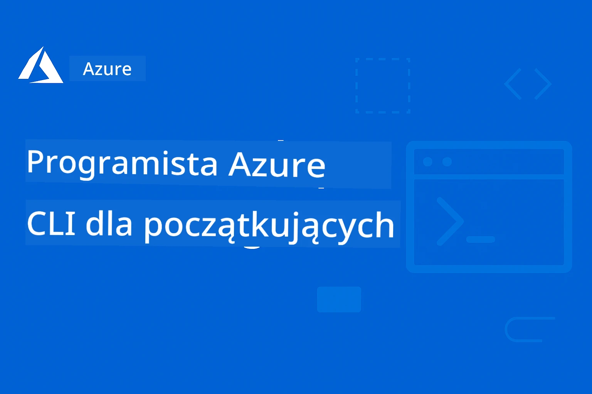

# AZD dla początkujących: Ustrukturyzowana ścieżka nauki

 

[](https://GitHub.com/microsoft/azd-for-beginners/watchers/)
[](https://GitHub.com/microsoft/azd-for-beginners/network/)
[](https://GitHub.com/microsoft/azd-for-beginners/stargazers/)

[](https://discord.gg/microsoft-azure)
[](https://discord.gg/nTYy5BXMWG)

---

### Automatyczne tłumaczenia (zawsze aktualne)

<!-- CO-OP TRANSLATOR LANGUAGES TABLE START -->
[Arabski](../ar/README.md) | [Bengalski](../bn/README.md) | [Bułgarski](../bg/README.md) | [Birmański (Myanmar)](../my/README.md) | [Chiński (uproszczony)](../zh-CN/README.md) | [Chiński (tradycyjny, Hongkong)](../zh-HK/README.md) | [Chiński (tradycyjny, Makau)](../zh-MO/README.md) | [Chiński (tradycyjny, Tajwan)](../zh-TW/README.md) | [Chorwacki](../hr/README.md) | [Czeski](../cs/README.md) | [Duński](../da/README.md) | [Holenderski](../nl/README.md) | [Estoński](../et/README.md) | [Fiński](../fi/README.md) | [Francuski](../fr/README.md) | [Niemiecki](../de/README.md) | [Grecki](../el/README.md) | [Hebrajski](../he/README.md) | [Hindi](../hi/README.md) | [Węgierski](../hu/README.md) | [Indonezyjski](../id/README.md) | [Włoski](../it/README.md) | [Japoński](../ja/README.md) | [Kannada](../kn/README.md) | [Koreański](../ko/README.md) | [Litewski](../lt/README.md) | [Malajski](../ms/README.md) | [Malajalam](../ml/README.md) | [Marathi](../mr/README.md) | [Nepalski](../ne/README.md) | [Nigeryjski pidgin](../pcm/README.md) | [Norweski](../no/README.md) | [Perski (Farsi)](../fa/README.md) | [Polski](./README.md) | [Portugalski (Brazylia)](../pt-BR/README.md) | [Portugalski (Portugalia)](../pt-PT/README.md) | [Pendżabski (Gurmukhi)](../pa/README.md) | [Rumuński](../ro/README.md) | [Rosyjski](../ru/README.md) | [Serbski (cyrylica)](../sr/README.md) | [Słowacki](../sk/README.md) | [Słoweński](../sl/README.md) | [Hiszpański](../es/README.md) | [Suahili](../sw/README.md) | [Szwedzki](../sv/README.md) | [Tagalog (Filipiński)](../tl/README.md) | [Tamilski](../ta/README.md) | [Telugu](../te/README.md) | [Tajski](../th/README.md) | [Turecki](../tr/README.md) | [Ukraiński](../uk/README.md) | [Urdu](../ur/README.md) | [Wietnamski](../vi/README.md)

> **Wolisz sklonować lokalnie?**
>
> To repozytorium zawiera tłumaczenia na ponad 50 języków, co znacząco zwiększa rozmiar do pobrania. Aby sklonować bez tłumaczeń, użyj sparse checkout:
>
> **Bash / macOS / Linux:**
> ```bash
> git clone --filter=blob:none --sparse https://github.com/microsoft/AZD-for-beginners.git
> cd AZD-for-beginners
> git sparse-checkout set --no-cone '/*' '!translations' '!translated_images'
> ```
>
> **CMD (Windows):**
> ```cmd
> git clone --filter=blob:none --sparse https://github.com/microsoft/AZD-for-beginners.git
> cd AZD-for-beginners
> git sparse-checkout set --no-cone "/*" "!translations" "!translated_images"
> ```
>
> To zapewni Ci wszystko, czego potrzebujesz do ukończenia kursu, a pobieranie będzie znacznie szybsze.
<!-- CO-OP TRANSLATOR LANGUAGES TABLE END -->

## 🚀 Czym jest Azure Developer CLI (azd)?

**Azure Developer CLI (azd)** to przyjazne dla programistów narzędzie wiersza poleceń, które ułatwia wdrażanie aplikacji w Azure. Zamiast ręcznie tworzyć i łączyć dziesiątki zasobów Azure, możesz wdrożyć całe aplikacje jednym poleceniem.

### Magia `azd up`

```bash
# To pojedyncze polecenie robi wszystko:
# ✅ Tworzy wszystkie zasoby Azure
# ✅ Konfiguruje sieć i zabezpieczenia
# ✅ Buduje kod twojej aplikacji
# ✅ Wdraża do Azure
# ✅ Dostarcza działający adres URL
azd up
```

**To wszystko!** Żadnego klikania w Azure Portal, żadnych skomplikowanych szablonów ARM do nauki, żadnej ręcznej konfiguracji - po prostu działające aplikacje w Azure.

---

## ❓ Azure Developer CLI a Azure CLI: Jaka jest różnica?

To najczęściej zadawane pytanie przez początkujących. Oto prosta odpowiedź:

| Funkcja | **Azure CLI (`az`)** | **Azure Developer CLI (`azd`)** |
|---------|---------------------|--------------------------------|
| **Cel** | Zarządzanie pojedynczymi zasobami Azure | Wdrażanie kompletnych aplikacji |
| **Podejście** | Skoncentrowane na infrastrukturze | Skoncentrowane na aplikacji |
| **Przykład** | `az webapp create --name myapp...` | `azd up` |
| **Krzywa nauki** | Trzeba znać usługi Azure | Wystarczy znać swoją aplikację |
| **Dla kogo najlepsze** | DevOps, infrastruktura | Programiści, prototypowanie |

### Prosta analogia

- **Azure CLI** to jak posiadanie wszystkich narzędzi do budowy domu - młotki, piły, gwoździe. Możesz zbudować wszystko, ale musisz znać się na budownictwie.
- **Azure Developer CLI** to jak zatrudnienie wykonawcy - opisujesz, co chcesz, a on zajmuje się budową.

### Kiedy używać którego?

| Scenariusz | Użyj tego |
|------------|-----------|
| "Chcę szybko wdrożyć moją aplikację webową" | `azd up` |
| "Potrzebuję tylko stworzyć konto magazynu" | `az storage account create` |
| "Buduję pełną aplikację AI" | `azd init --template azure-search-openai-demo` |
| "Muszę debugować konkretny zasób Azure" | `az resource show` |
| "Chcę produkcyjne wdrożenie w kilka minut" | `azd up --environment production` |

### Działają razem!

AZD korzysta z Azure CLI pod spodem. Możesz używać obu:
```bash
# Wdróż aplikację przy użyciu AZD
azd up

# Następnie dopracuj konkretne zasoby za pomocą Azure CLI
az webapp config set --name myapp --always-on true
```

---

## 🌟 Znajdź szablony w Awesome AZD

Nie zaczynaj od zera! **Awesome AZD** to społecznościowa kolekcja gotowych szablonów do wdrożenia:

| Zasób | Opis |
|-------|-------|
| 🔗 [**Galeria Awesome AZD**](https://azure.github.io/awesome-azd/) | Przeglądaj ponad 200 szablonów z możliwością wdrożenia jednym kliknięciem |
| 🔗 [**Dodaj szablon**](https://github.com/Azure/awesome-azd/issues) | Dołóż swój własny szablon dla społeczności |
| 🔗 [**Repozytorium GitHub**](https://github.com/Azure/awesome-azd) | Oceniaj i eksploruj źródła |

### Popularne szablony AI z Awesome AZD

```bash
# Czat RAG z Azure OpenAI i AI Search
azd init --template azure-search-openai-demo

# Szybka aplikacja do czatu AI
azd init --template openai-chat-app-quickstart

# Agenci AI z Foundry Agents
azd init --template get-started-with-ai-agents
```

---

## 🎯 Rozpocznij w 3 krokach

### Krok 1: Zainstaluj AZD (2 minuty)

**Windows:**
```powershell
winget install microsoft.azd
```

**macOS:**
```bash
brew tap azure/azd && brew install azd
```

**Linux:**
```bash
curl -fsSL https://aka.ms/install-azd.sh | bash
```

### Krok 2: Zaloguj się do Azure

```bash
azd auth login
```

### Krok 3: Wdróż swoją pierwszą aplikację

```bash
# Zainicjalizuj z szablonu
azd init --template todo-nodejs-mongo

# Wdróż na Azure (tworzy wszystko!)
azd up
```

**🎉 To wszystko!** Twoja aplikacja jest teraz dostępna na Azure.

### Sprzątanie (nie zapomnij!)

```bash
# Remove all resources when done experimenting
azd down --force --purge
```

---

## 📚 Jak korzystać z tego kursu

Ten kurs jest zaprojektowany do **postępującej nauki** - zacznij tam, gdzie czujesz się komfortowo, i rozwijaj się stopniowo:

| Twoje doświadczenie | Zacznij tutaj |
|---------------------|--------------|
| **Nowicjusz w Azure** | [Rozdział 1: Podstawy](../..) |
| **Znajomość Azure, nowy w AZD** | [Rozdział 1: Podstawy](../..) |
| **Chcesz wdrażać aplikacje AI** | [Rozdział 2: AI-First Development](../..) |
| **Chcesz praktykować praktycznie** | [🎓 Warsztaty interaktywne](workshop/README.md) - 3-4 godzinne ćwiczenia z przewodnikiem |
| **Potrzebujesz wzorców produkcyjnych** | [Rozdział 8: Produkcja i przedsiębiorstwo](../..) |

### Szybka konfiguracja

1. **Zrób fork repozytorium**: [](https://GitHub.com/microsoft/azd-for-beginners/fork)
2. **Sklonuj repozytorium**: `git clone https://github.com/YOUR-USERNAME/azd-for-beginners.git`
3. **Uzyskaj pomoc**: [Społeczność Azure na Discord](https://discord.com/invite/ByRwuEEgH4)

> **Wolisz sklonować lokalnie?**

> To repozytorium zawiera tłumaczenia na ponad 50 języków, co znacząco zwiększa rozmiar do pobrania. Aby sklonować bez tłumaczeń, użyj sparse checkout:
> ```bash
> git clone --filter=blob:none --sparse https://github.com/microsoft/AZD-for-beginners.git
> cd AZD-for-beginners
> git sparse-checkout set --no-cone '/*' '!translations' '!translated_images'
> ```
> To zapewni Ci wszystko, czego potrzebujesz do ukończenia kursu, a pobieranie będzie znacznie szybsze.


## Przegląd kursu

Opanuj Azure Developer CLI (azd) przez ustrukturyzowane rozdziały zaprojektowane do postępującej nauki. **Szczególny nacisk na wdrażanie aplikacji AI z integracją Microsoft Foundry.**

### Dlaczego ten kurs jest niezbędny dla nowoczesnych programistów

Na podstawie wniosków ze społeczności Microsoft Foundry Discord, **45% programistów chce korzystać z AZD do obciążeń AI**, ale napotyka problemy z:
- Złożonymi, wielousługowymi architekturami AI
- Najlepszymi praktykami produkcyjnego wdrażania AI  
- Integracją i konfiguracją usług Azure AI
- Optymalizacją kosztów dla obciążeń AI
- Rozwiązywaniem problemów specyficznych dla wdrażania AI

### Cele nauki

Po ukończeniu tego ustrukturyzowanego kursu będziesz:
- **Mistrzem podstaw AZD**: Podstawowe pojęcia, instalacja i konfiguracja
- **Wdrażać aplikacje AI**: Używać AZD z usługami Microsoft Foundry
- **Wdrażać infrastrukturę jako kod**: Zarządzać zasobami Azure za pomocą szablonów Bicep
- **Rozwiązywać problemy wdrożeń**: Usuwać typowe błędy i debugować problemy
- **Optymalizować na potrzeby produkcji**: Bezpieczeństwo, skalowanie, monitorowanie i zarządzanie kosztami
- **Budować rozwiązania wieloagentowe**: Wdrażać złożone architektury AI

## 🗺️ Mapa kursu: szybka nawigacja według rozdziałów

Każdy rozdział ma dedykowany README z celami, szybkim startem i ćwiczeniami:

| Rozdział | Temat | Lekcje | Czas trwania | Trudność |
|----------|-------|--------|--------------|----------|
| **[Rozdział 1: Podstawy](docs/chapter-01-foundation/README.md)** | Pierwsze kroki | [Podstawy AZD](docs/chapter-01-foundation/azd-basics.md) &#124; [Instalacja](docs/chapter-01-foundation/installation.md) &#124; [Pierwszy projekt](docs/chapter-01-foundation/first-project.md) | 30-45 min | ⭐ |
| **[Rozdział 2: Rozwój AI](docs/chapter-02-ai-development/README.md)** | Aplikacje AI na pierwszym miejscu | [Integracja Foundry](docs/chapter-02-ai-development/microsoft-foundry-integration.md) &#124; [Agenci AI](docs/chapter-02-ai-development/agents.md) &#124; [Wdrażanie modeli AI](docs/chapter-02-ai-development/ai-model-deployment.md) &#124; [Warsztaty](docs/chapter-02-ai-development/ai-workshop-lab.md) | 1-2 godz. | ⭐⭐ |
| **[Rozdział 3: Konfiguracja](docs/chapter-03-configuration/README.md)** | Uwierzytelnianie i bezpieczeństwo | [Konfiguracja](docs/chapter-03-configuration/configuration.md) &#124; [Uwierzytelnianie i bezpieczeństwo](docs/chapter-03-configuration/authsecurity.md) | 45-60 min | ⭐⭐ |
| **[Rozdział 4: Infrastruktura](docs/chapter-04-infrastructure/README.md)** | IaC i Wdrażanie | [Przewodnik po wdrożeniu](docs/chapter-04-infrastructure/deployment-guide.md) &#124; [Provisioning](docs/chapter-04-infrastructure/provisioning.md) | 1-1.5 godziny | ⭐⭐⭐ |
| **[Rozdział 5: Wieloagentowy](docs/chapter-05-multi-agent/README.md)** | Rozwiązania Agentów AI | [Scenariusz detaliczny](examples/retail-scenario.md) &#124; [Wzorce koordynacji](docs/chapter-06-pre-deployment/coordination-patterns.md) | 2-3 godziny | ⭐⭐⭐⭐ |
| **[Rozdział 6: Przed wdrożeniem](docs/chapter-06-pre-deployment/README.md)** | Planowanie i Walidacja | [Kontrole przed startem](docs/chapter-06-pre-deployment/preflight-checks.md) &#124; [Planowanie pojemności](docs/chapter-06-pre-deployment/capacity-planning.md) &#124; [Wybór SKU](docs/chapter-06-pre-deployment/sku-selection.md) &#124; [App Insights](docs/chapter-06-pre-deployment/application-insights.md) | 1 godzina | ⭐⭐ |
| **[Rozdział 7: Rozwiązywanie problemów](docs/chapter-07-troubleshooting/README.md)** | Debugowanie i Naprawa | [Typowe problemy](docs/chapter-07-troubleshooting/common-issues.md) &#124; [Debugowanie](docs/chapter-07-troubleshooting/debugging.md) &#124; [Problemy z AI](docs/chapter-07-troubleshooting/ai-troubleshooting.md) | 1-1.5 godziny | ⭐⭐ |
| **[Rozdział 8: Produkcja](docs/chapter-08-production/README.md)** | Wzorce korporacyjne | [Praktyki produkcyjne](docs/chapter-08-production/production-ai-practices.md) | 2-3 godziny | ⭐⭐⭐⭐ |
| **[🎓 Warsztat](workshop/README.md)** | Laboratorium praktyczne | [Wstęp](workshop/docs/instructions/0-Introduction.md) &#124; [Wybór](workshop/docs/instructions/1-Select-AI-Template.md) &#124; [Walidacja](workshop/docs/instructions/2-Validate-AI-Template.md) &#124; [Deconstruct](workshop/docs/instructions/3-Deconstruct-AI-Template.md) &#124; [Konfiguracja](workshop/docs/instructions/4-Configure-AI-Template.md) &#124; [Dostosowanie](workshop/docs/instructions/5-Customize-AI-Template.md) &#124; [Demontaż](workshop/docs/instructions/6-Teardown-Infrastructure.md) &#124; [Podsumowanie](workshop/docs/instructions/7-Wrap-up.md) | 3-4 godziny | ⭐⭐ |

**Całkowity czas kursu:** ~10-14 godzin | **Poziom umiejętności:** Początkujący → Gotowy do produkcji

---

## 📚 Rozdziały do nauki

*Wybierz ścieżkę nauki odpowiednią do poziomu doświadczenia i celów*

### 🚀 Rozdział 1: Podstawy i szybki start
**Wymagania wstępne**: Subskrypcja Azure, podstawowa znajomość wiersza poleceń  
**Czas trwania**: 30-45 minut  
**Poziom trudności**: ⭐

#### Czego się nauczysz
- Podstawy Azure Developer CLI
- Instalacja AZD na Twojej platformie
- Twoje pierwsze udane wdrożenie

#### Materiały do nauki
- **🎯 Zacznij tutaj**: [Czym jest Azure Developer CLI?](../..)
- **📖 Teoria**: [Podstawy AZD](docs/chapter-01-foundation/azd-basics.md) - Kluczowe pojęcia i terminologia
- **⚙️ Instalacja**: [Instalacja i konfiguracja](docs/chapter-01-foundation/installation.md) - Przewodniki specyficzne dla platformy
- **🛠️ Praktyka**: [Twój pierwszy projekt](docs/chapter-01-foundation/first-project.md) - Krok po kroku
- **📋 Szybkie odniesienie**: [Skrót poleceń](resources/cheat-sheet.md)

#### Ćwiczenia praktyczne
```bash
# Szybka kontrola instalacji
azd version

# Wdróż swoją pierwszą aplikację
azd init --template todo-nodejs-mongo
azd up
```

**💡 Efekt rozdziału**: Pomyślnie wdrożysz prostą aplikację webową na Azure za pomocą AZD

**✅ Weryfikacja sukcesu:**
```bash
# Po ukończeniu rozdziału 1 powinieneś być w stanie:
azd version              # Pokazuje zainstalowaną wersję
azd init --template todo-nodejs-mongo  # Inicjalizuje projekt
azd up                  # Wdraża do Azure
azd show                # Wyświetla URL działającej aplikacji
# Aplikacja otwiera się w przeglądarce i działa
azd down --force --purge  # Czyści zasoby
```

**📊 Czas inwestycji:** 30-45 minut  
**📈 Poziom umiejętności po:** Potrafi samodzielnie wdrażać podstawowe aplikacje

**✅ Weryfikacja sukcesu:**
```bash
# Po ukończeniu Rozdziału 1 powinieneś być w stanie:
azd version              # Pokazuje zainstalowaną wersję
azd init --template todo-nodejs-mongo  # Inicjalizuje projekt
azd up                  # Wdraża do Azure
azd show                # Wyświetla adres URL działającej aplikacji
# Aplikacja otwiera się w przeglądarce i działa
azd down --force --purge  # Sprząta zasoby
```

**📊 Czas inwestycji:** 30-45 minut  
**📈 Poziom umiejętności po:** Potrafi samodzielnie wdrażać podstawowe aplikacje

---

### 🤖 Rozdział 2: Rozwój AI jako pierwszy (zalecany dla deweloperów AI)
**Wymagania wstępne**: Rozdział 1 ukończony  
**Czas trwania**: 1-2 godziny  
**Poziom trudności**: ⭐⭐

#### Czego się nauczysz
- Integracja Microsoft Foundry z AZD
- Wdrażanie aplikacji zasilanych AI
- Zrozumienie konfiguracji usług AI

#### Materiały do nauki
- **🎯 Zacznij tutaj**: [Integracja Microsoft Foundry](docs/chapter-02-ai-development/microsoft-foundry-integration.md)
- **🤖 Agenci AI**: [Przewodnik po agentach AI](docs/chapter-02-ai-development/agents.md) - Wdrażanie inteligentnych agentów z AZD
- **📖 Wzorce**: [Wdrażanie modeli AI](docs/chapter-02-ai-development/ai-model-deployment.md) - Zarządzanie modelami AI
- **🛠️ Warsztat**: [Laboratorium AI](docs/chapter-02-ai-development/ai-workshop-lab.md) - Przygotuj rozwiązania AI do AZD
- **🎥 Przewodnik interaktywny**: [Materiały warsztatowe](workshop/README.md) - Nauka w przeglądarce z MkDocs * środowisko DevContainer
- **📋 Szablony**: [Szablony Microsoft Foundry](../..)
- **📝 Przykłady**: [Przykłady wdrożeń AZD](examples/README.md)

#### Ćwiczenia praktyczne
```bash
# Wdróż swoją pierwszą aplikację AI
azd init --template azure-search-openai-demo
azd up

# Wypróbuj dodatkowe szablony AI
azd init --template openai-chat-app-quickstart
azd init --template agent-openai-python-prompty
```

**💡 Efekt rozdziału**: Wdrożenie i konfiguracja aplikacji czatu zasilanej AI z funkcjami RAG

**✅ Weryfikacja sukcesu:**
```bash
# Po rozdziale 2 powinieneś być w stanie:
azd init --template azure-search-openai-demo
azd up
# Testować interfejs czatu AI
# Zadawać pytania i otrzymywać odpowiedzi wspomagane przez AI wraz z źródłami
# Sprawdzić, czy integracja wyszukiwania działa
azd monitor  # Sprawdzić, czy Application Insights pokazuje telemetrię
azd down --force --purge
```

**📊 Czas inwestycji:** 1-2 godziny  
**📈 Poziom umiejętności po:** Potrafi wdrażać i konfigurować produkcyjne aplikacje AI  
**💰 Świadomość kosztów:** Rozumie koszty rozwojowe $80-150/miesiąc, koszty produkcyjne $300-3500/miesiąc

#### 💰 Rozważania dotyczące kosztów wdrożeń AI

**Środowisko deweloperskie (szacunkowo $80-150/miesiąc):**
- Azure OpenAI (płatność za użycie): $0-50/miesiąc (w zależności od zużycia tokenów)
- AI Search (podstawowy poziom): $75/miesiąc
- Container Apps (consumption): $0-20/miesiąc
- Storage (standardowy): $1-5/miesiąc

**Środowisko produkcyjne (szacunkowo $300-3500+/miesiąc):**
- Azure OpenAI (PTU dla stabilnej wydajności): $3000+/miesiąc LUB płatność za użycie przy dużym wolumenie
- AI Search (standardowy poziom): $250/miesiąc
- Container Apps (dedykowane): $50-100/miesiąc
- Application Insights: $5-50/miesiąc
- Storage (premium): $10-50/miesiąc

**💡 Wskazówki optymalizacji kosztów:**
- Korzystaj z **bezpłatnego poziomu** Azure OpenAI do nauki (50,000 tokenów/miesiąc wliczone)
- Uruchom `azd down` aby zwolnić zasoby, gdy nie rozwijasz aktywnie
- Zacznij od rozliczenia za zużycie, przejdź na PTU tylko w produkcji
- Użyj `azd provision --preview` aby oszacować koszty przed wdrożeniem
- Włącz auto-skalowanie: płacisz tylko za rzeczywiste użycie

**Monitorowanie kosztów:**
```bash
# Sprawdź szacowane miesięczne koszty
azd provision --preview

# Monitoruj rzeczywiste koszty w Azure Portal
az consumption budget list --resource-group <your-rg>
```

---

### ⚙️ Rozdział 3: Konfiguracja i uwierzytelnianie
**Wymagania wstępne**: Rozdział 1 ukończony  
**Czas trwania**: 45-60 minut  
**Poziom trudności**: ⭐⭐

#### Czego się nauczysz
- Konfiguracja i zarządzanie środowiskiem
- Najlepsze praktyki autoryzacji i bezpieczeństwa
- Nazewnictwo i organizacja zasobów

#### Materiały do nauki
- **📖 Konfiguracja**: [Przewodnik konfiguracji](docs/chapter-03-configuration/configuration.md) - Ustawienia środowiska
- **🔐 Bezpieczeństwo**: [Wzorce uwierzytelniania i managed identity](docs/chapter-03-configuration/authsecurity.md)
- **📝 Przykłady**: [Przykład aplikacji bazodanowej](examples/database-app/README.md) - Przykłady baz danych dla AZD

#### Ćwiczenia praktyczne
- Konfiguracja wielu środowisk (dev, staging, prod)
- Konfiguracja uwierzytelniania z managed identity
- Implementacja środowiskowo-specyficznych ustawień

**💡 Efekt rozdziału**: Zarządzanie wieloma środowiskami z właściwym uwierzytelnianiem i zabezpieczeniami

---

### 🏗️ Rozdział 4: Infrastruktura jako kod i wdrażanie
**Wymagania wstępne**: Rozdziały 1-3 ukończone  
**Czas trwania**: 1-1.5 godziny  
**Poziom trudności**: ⭐⭐⭐

#### Czego się nauczysz
- Zaawansowane wzorce wdrożeń
- Infrastruktura jako kod z użyciem Bicep
- Strategie provisioningu zasobów

#### Materiały do nauki
- **📖 Wdrożenie**: [Przewodnik wdrożenia](docs/chapter-04-infrastructure/deployment-guide.md) - Kompleksowe przepływy pracy
- **🏗️ Provisioning**: [Provisioning zasobów](docs/chapter-04-infrastructure/provisioning.md) - Zarządzanie zasobami Azure
- **📝 Przykłady**: [Przykład aplikacji kontenerowej](../../examples/container-app) - Wdrożenia kontenerowe

#### Ćwiczenia praktyczne
- Tworzenie niestandardowych szablonów Bicep
- Wdrażanie aplikacji wielosystemowych
- Implementacja strategii blue-green deployment

**💡 Efekt rozdziału**: Wdrażanie złożonych aplikacji wielosystemowych przy użyciu niestandardowych szablonów infrastruktury

---

### 🎯 Rozdział 5: Wieloagentowe rozwiązania AI (zaawansowane)
**Wymagania wstępne**: Rozdziały 1-2 ukończone  
**Czas trwania**: 2-3 godziny  
**Poziom trudności**: ⭐⭐⭐⭐

#### Czego się nauczysz
- Wzorce architektury wieloagentowej
- Orkiestracja i koordynacja agentów
- Produkcyjne wdrożenia AI

#### Materiały do nauki
- **🤖 Projekt wyróżniony**: [Wieloagentowe rozwiązanie detaliczne](examples/retail-scenario.md) - Kompleksowa implementacja
- **🛠️ Szablony ARM**: [Pakiet szablonów ARM wieloagentowych](../../examples/retail-multiagent-arm-template) - Wdrażanie jednym kliknięciem
- **📖 Architektura**: [Wzorce koordynacji multiagentów](docs/chapter-06-pre-deployment/coordination-patterns.md) - Wzorce

#### Ćwiczenia praktyczne
```bash
# Wdróż kompletne rozwiązanie wieloagentowe dla handlu detalicznego
cd examples/retail-multiagent-arm-template
./deploy.sh

# Eksploruj konfiguracje agentów
az deployment group show --resource-group <rg-name> --name <deployment-name>
```

**💡 Efekt rozdziału**: Wdrożenie i zarządzanie produkcyjnym rozwiązaniem AI wieloagentowym z agentami Klienta i Zapasu

---

### 🔍 Rozdział 6: Walidacja i planowanie przed wdrożeniem
**Wymagania wstępne**: Rozdział 4 ukończony  
**Czas trwania**: 1 godzina  
**Poziom trudności**: ⭐⭐

#### Czego się nauczysz
- Planowanie pojemności i walidacja zasobów
- Strategie wyboru SKU
- Kontrole przed startem i automatyzacja

#### Materiały do nauki
- **📊 Planowanie**: [Planowanie pojemności](docs/chapter-06-pre-deployment/capacity-planning.md) - Walidacja zasobów
- **💰 Wybór**: [Wybór SKU](docs/chapter-06-pre-deployment/sku-selection.md) - Opłacalne opcje
- **✅ Walidacja**: [Kontrole przed startem](docs/chapter-06-pre-deployment/preflight-checks.md) - Skrypty automatyczne

#### Ćwiczenia praktyczne
- Uruchom skrypty walidacyjne pojemności
- Optymalizuj wybór SKU pod kątem kosztów
- Implementuj automatyczne kontrole przed wdrożeniem

**💡 Efekt rozdziału**: Walidacja i optymalizacja wdrożeń przed ich wykonaniem

---

### 🚨 Rozdział 7: Rozwiązywanie problemów i debugowanie
**Wymagania wstępne**: Dowolny rozdział wdrożeniowy ukończony  
**Czas trwania**: 1-1.5 godziny  
**Poziom trudności**: ⭐⭐

#### Czego się nauczysz
- Systematyczne podejście do debugowania
- Typowe problemy i ich rozwiązania
- Rozwiązywanie problemów specyficznych dla AI

#### Materiały do nauki
- **🔧 Typowe problemy**: [Typowe problemy](docs/chapter-07-troubleshooting/common-issues.md) - FAQ i rozwiązania
- **🕵️ Debugowanie**: [Przewodnik debugowania](docs/chapter-07-troubleshooting/debugging.md) - Strategie krok po kroku
- **🤖 Problemy AI**: [Problemy z AI](docs/chapter-07-troubleshooting/ai-troubleshooting.md) - Problemy z usługami AI

#### Ćwiczenia praktyczne
- Diagnozuj awarie wdrożeń
- Rozwiązuj problemy z uwierzytelnianiem
- Debuguj łączność usług AI

**💡 Efekt rozdziału**: Samodzielne diagnozowanie i rozwiązywanie typowych problemów wdrożeniowych

---

### 🏢 Rozdział 8: Produkcja i wzorce korporacyjne
**Wymagania wstępne**: Rozdziały 1-4 ukończone  
**Czas trwania**: 2-3 godziny  
**Poziom trudności**: ⭐⭐⭐⭐

#### Czego się nauczysz
- Strategie wdrożenia produkcyjnego
- Wzorce zabezpieczeń korporacyjnych
- Monitorowanie i optymalizacja kosztów

#### Materiały do nauki
- **🏭 Produkcja**: [Najlepsze praktyki AI w produkcji](docs/chapter-08-production/production-ai-practices.md) - Wzorce korporacyjne
- **📝 Przykłady**: [Przykład mikroserwisów](../../examples/microservices) - Złożone architektury
- **📊 Monitorowanie**: [Integracja Application Insights](docs/chapter-06-pre-deployment/application-insights.md) - Monitorowanie

#### Ćwiczenia praktyczne
- Implementuj wzorce zabezpieczeń korporacyjnych
- Konfiguruj kompleksowe monitorowanie
- Wdrażaj produkcyjnie z odpowiednim zarządzaniem

**💡 Efekt rozdziału**: Wdrażanie aplikacji gotowych do produkcji z pełną funkcjonalnością produkcyjną

---

## 🎓 Przegląd warsztatu: Praktyczne doświadczenie nauki

> **⚠️ STATUS WARSZTATU: Aktywny rozwój**  

> Materiały do warsztatów są obecnie opracowywane i udoskonalane. Moduły podstawowe działają, ale niektóre zaawansowane sekcje są niekompletne. Intensywnie pracujemy nad ukończeniem całej zawartości. [Śledź postępy →](workshop/README.md)

### Interaktywne Materiały Warsztatowe
**Kompleksowa, praktyczna nauka z narzędziami działającymi w przeglądarce oraz prowadzonymi ćwiczeniami**

Nasze materiały warsztatowe oferują uporządkowane, interaktywne doświadczenie edukacyjne, które uzupełnia powyższy podział na rozdziały. Warsztat jest przeznaczony zarówno do nauki we własnym tempie, jak i prowadzonej przez instruktora.

#### 🛠️ Cechy Warsztatów
- **Interfejs w przeglądarce**: Kompletny warsztat bazujący na MkDocs z funkcjami wyszukiwania, kopiowania i motywów
- **Integracja z GitHub Codespaces**: Jedno kliknięcie, aby uruchomić środowisko deweloperskie
- **Struktura ścieżki nauki**: 8 modułów prowadzonych ćwiczeń (3-4 godziny łącznie)
- **Metodologia progresywna**: Wprowadzenie → Wybór → Walidacja → Dekonstrukcja → Konfiguracja → Personalizacja → Zamknięcie → Podsumowanie
- **Interaktywne środowisko DevContainer**: Wstępnie skonfigurowane narzędzia i zależności

#### 📚 Struktura Modułów Warsztatowych
Warsztat opiera się na **8-modułowej progresywnej metodologii**, która prowadzi Cię od odkrywania do mistrzostwa w wdrażaniu:

| Moduł | Temat | Co będziesz robić | Czas trwania |
|--------|-------|-------------------|--------------|
| **0. Wprowadzenie** | Przegląd warsztatów | Poznaj cele nauki, wymagania wstępne oraz strukturę warsztatu | 15 min |
| **1. Wybór** | Odkrywanie szablonów | Poznaj szablony AZD i wybierz odpowiedni szablon AI do swojego scenariusza | 20 min |
| **2. Walidacja** | Wdrażanie i weryfikacja | Wdróż szablon za pomocą `azd up` i potwierdź działanie infrastruktury | 30 min |
| **3. Dekonstrukcja** | Poznaj strukturę | Użyj GitHub Copilot do eksploracji architektury szablonu, plików Bicep i organizacji kodu | 30 min |
| **4. Konfiguracja** | Szczegóły azure.yaml | Opanuj konfigurację `azure.yaml`, haki cyklu życia i zmienne środowiskowe | 30 min |
| **5. Personalizacja** | Dostosuj do siebie | Aktywuj AI Search, śledzenie, ewaluację i dopasuj scenariusz do swoich potrzeb | 45 min |
| **6. Zamknięcie** | Sprzątanie | Bezpiecznie usuń zasoby poleceniem `azd down --purge` | 15 min |
| **7. Podsumowanie** | Kolejne kroki | Przejrzyj osiągnięcia, kluczowe koncepcje i kontynuuj swoją przygodę z nauką | 15 min |

**Przebieg Warsztatu:**  
```
Introduction → Selection → Validation → Deconstruction → Configuration → Customization → Teardown → Wrap-up
     ↓            ↓           ↓              ↓               ↓              ↓            ↓           ↓
  Overview    Find the     Deploy &      Explore        Master         Customize     Clean up    Review &
             right        verify        code &        azure.yaml      for your      resources   next steps
             template                   structure                     scenario
```
  
#### 🚀 Rozpoczęcie warsztatu  
```bash
# Opcja 1: GitHub Codespaces (zalecane)
# Kliknij "Code" → "Create codespace on main" w repozytorium

# Opcja 2: Lokalny rozwój
git clone https://github.com/microsoft/azd-for-beginners.git
cd azd-for-beginners/workshop
# Postępuj zgodnie z instrukcjami instalacji w workshop/README.md
```
  
#### 🎯 Efekty nauki po warsztacie  
Po ukończeniu warsztatu uczestnicy będą potrafili:  
- **Wdrażać produkcyjne aplikacje AI**: Używać AZD z usługami Microsoft Foundry  
- **Opanować architekturę wieloagentową**: Implementować skoordynowane rozwiązania AI z agentami  
- **Wdrażać najlepsze praktyki bezpieczeństwa**: Konfigurować uwierzytelnianie i kontrolę dostępu  
- **Optymalizować pod kątem skalowalności**: Projektować ekonomiczne i wydajne wdrożenia  
- **Rozwiązywać problemy z wdrożeniami**: Samodzielnie diagnozować i naprawiać typowe błędy  

#### 📖 Materiały warsztatowe  
- **🎥 Interaktywny przewodnik**: [Materiały warsztatowe](workshop/README.md) - środowisko nauki w przeglądarce  
- **📋 Instrukcje moduł po module**:  
  - [0. Wprowadzenie](workshop/docs/instructions/0-Introduction.md) - Przegląd i cele warsztatu  
  - [1. Wybór](workshop/docs/instructions/1-Select-AI-Template.md) - Znajdź i wybierz szablony AI  
  - [2. Walidacja](workshop/docs/instructions/2-Validate-AI-Template.md) - Wdrażaj i weryfikuj szablony  
  - [3. Dekonstrukcja](workshop/docs/instructions/3-Deconstruct-AI-Template.md) - Eksploruj architekturę szablonu  
  - [4. Konfiguracja](workshop/docs/instructions/4-Configure-AI-Template.md) - Opanuj `azure.yaml`  
  - [5. Personalizacja](workshop/docs/instructions/5-Customize-AI-Template.md) - Dostosuj do swojego scenariusza  
  - [6. Zamknięcie](workshop/docs/instructions/6-Teardown-Infrastructure.md) - Sprzątaj zasoby  
  - [7. Podsumowanie](workshop/docs/instructions/7-Wrap-up.md) - Podsumowanie i kolejne kroki  
- **🛠️ Laboratorium AI**: [AI Workshop Lab](docs/chapter-02-ai-development/ai-workshop-lab.md) - Ćwiczenia skoncentrowane na AI  
- **💡 Szybki Start**: [Przewodnik konfiguracji warsztatu](workshop/README.md#quick-start) - Konfiguracja środowiska  

**Idealne dla**: szkoleń korporacyjnych, kursów akademickich, nauki we własnym tempie i bootcampów dla programistów.

---

## 📖 Szczegółowo: Możliwości AZD

Poza podstawami, AZD oferuje potężne funkcje do produkcyjnych wdrożeń:

- **Wdrożenia oparte na szablonach** - Korzystaj z gotowych szablonów dla popularnych wzorców aplikacji  
- **Infrastruktura jako kod** - Zarządzaj zasobami Azure za pomocą Bicep lub Terraform  
- **Zintegrowane przepływy pracy** - Bezproblemowe provisionowanie, wdrażanie i monitorowanie aplikacji  
- **Przyjazne dla deweloperów** - Optymalizacja wydajności pracy i doświadczenia programisty  

### **AZD + Microsoft Foundry: Idealne dla wdrożeń AI**

**Dlaczego AZD do rozwiązań AI?** AZD rozwiązuje najważniejsze wyzwania programistów AI:

- **Szablony gotowe na AI** - Wstępnie skonfigurowane szablony dla Azure OpenAI, Cognitive Services i obciążeń ML  
- **Bezpieczne wdrożenia AI** - Wbudowane wzorce bezpieczeństwa dla usług AI, kluczy API i punktów końcowych modeli  
- **Produkcjne wzorce AI** - Najlepsze praktyki dla skalowalnych i ekonomicznych wdrożeń AI  
- **Kompleksowe przepływy AI** - Od rozwoju modeli po produkcyjne wdrożenie z odpowiednim monitoringiem  
- **Optymalizacja kosztów** - Inteligentne przydzielanie zasobów i skalowanie dla AI  
- **Integracja z Microsoft Foundry** - Bezproblemowe połączenie z katalogiem modeli i punktami końcowymi Foundry  

---

## 🎯 Biblioteka szablonów i przykładów

### Polecane: Szablony Microsoft Foundry  
**Zacznij tutaj, jeśli wdrażasz aplikacje AI!**

> **Uwaga:** Te szablony pokazują różne wzorce AI. Niektóre pochodzą z zewnętrznych Azure Samples, inne są lokalnymi implementacjami.

| Szablon | Rozdział | Złożoność | Usługi | Rodzaj |
|----------|---------|------------|----------|--------|
| [**Get started with AI chat**](https://github.com/Azure-Samples/get-started-with-ai-chat) | Rozdział 2 | ⭐⭐ | AzureOpenAI + Azure AI Model Inference API + Azure AI Search + Azure Container Apps + Application Insights | Zewnętrzny |
| [**Get started with AI agents**](https://github.com/Azure-Samples/get-started-with-ai-agents) | Rozdział 2 | ⭐⭐ | Foundry Agents + AzureOpenAI + Azure AI Search + Azure Container Apps + Application Insights| Zewnętrzny |
| [**Azure Search + OpenAI Demo**](https://github.com/Azure-Samples/azure-search-openai-demo) | Rozdział 2 | ⭐⭐ | AzureOpenAI + Azure AI Search + App Service + Storage | Zewnętrzny |
| [**OpenAI Chat App Quickstart**](https://github.com/Azure-Samples/openai-chat-app-quickstart) | Rozdział 2 | ⭐ | AzureOpenAI + Container Apps + Application Insights | Zewnętrzny |
| [**Agent OpenAI Python Prompty**](https://github.com/Azure-Samples/agent-openai-python-prompty) | Rozdział 5 | ⭐⭐⭐ | AzureOpenAI + Azure Functions + Prompty | Zewnętrzny |
| [**Contoso Chat RAG**](https://github.com/Azure-Samples/contoso-chat) | Rozdział 8 | ⭐⭐⭐⭐ | AzureOpenAI + AI Search + Cosmos DB + Container Apps | Zewnętrzny |
| [**Retail Multi-Agent Solution**](examples/retail-scenario.md) | Rozdział 5 | ⭐⭐⭐⭐ | AzureOpenAI + AI Search + Storage + Container Apps + Cosmos DB | **Lokalny** |

### Polecane: Kompleksowe scenariusze nauki  
**Szablony produkcyjnych aplikacji mapowane do rozdziałów nauki**

| Szablon | Rozdział nauki | Złożoność | Kluczowe zagadnienia |
|----------|----------------|-----------|----------------------|
| [**openai-chat-app-quickstart**](https://github.com/Azure-Samples/openai-chat-app-quickstart) | Rozdział 2 | ⭐ | Podstawowe wzorce wdrażania AI |
| [**azure-search-openai-demo**](https://github.com/Azure-Samples/azure-search-openai-demo) | Rozdział 2 | ⭐⭐ | Implementacja RAG z Azure AI Search |
| [**ai-document-processing**](https://github.com/Azure-Samples/ai-document-processing) | Rozdział 4 | ⭐⭐ | Integracja inteligencji dokumentów |
| [**agent-openai-python-prompty**](https://github.com/Azure-Samples/agent-openai-python-prompty) | Rozdział 5 | ⭐⭐⭐ | Framework agentów i wywołania funkcji |
| [**contoso-chat**](https://github.com/Azure-Samples/contoso-chat) | Rozdział 8 | ⭐⭐⭐ | Orkiestracja AI w przedsiębiorstwie |
| [**retail-multi-agent-solution**](examples/retail-scenario.md) | Rozdział 5 | ⭐⭐⭐⭐ | Architektura wieloagentowa z agentami Klient i Magazyn |

### Nauka poprzez przykłady według typu

> **📌 Przykłady lokalne vs. zewnętrzne:**  
> **Przykłady lokalne** (w tym repozytorium) = Gotowe do natychmiastowego użycia  
> **Przykłady zewnętrzne** (Azure Samples) = Klonuj z podlinkowanych repozytoriów

#### Przykłady lokalne (gotowe do użycia)
- [**Retail Multi-Agent Solution**](examples/retail-scenario.md) - Kompletny produkcyjny wdrożenie z szablonami ARM  
  - Architektura wieloagentowa (agent Klienta + Magazynu)  
  - Kompleksowy monitoring i ewaluacja  
  - Wdrożenie jednym kliknięciem przez szablon ARM  

#### Przykłady lokalne - Aplikacje kontenerowe (rozdziały 2-5)  
**Kompleksowe przykłady wdrożeń kontenerowych w tym repozytorium:**  
- [**Przykłady aplikacji kontenerowych**](examples/container-app/README.md) - Kompletny przewodnik po wdrożeniach kontenerowych  
  - [Proste API Flask](../../examples/container-app/simple-flask-api) - Podstawowe REST API ze skalowaniem do zera  
  - [Architektura mikrousług](../../examples/container-app/microservices) - Produkcyjne wdrożenia wielu usług  
  - Szybki start, wzorce produkcyjne i zaawansowane  
  - Wskazówki dotyczące monitoringu, bezpieczeństwa i optymalizacji kosztów  

#### Przykłady zewnętrzne - Proste aplikacje (rozdziały 1-2)  
**Klonuj te repozytoria Azure Samples, aby zacząć:**  
- [Prosta aplikacja webowa - Node.js + MongoDB](https://github.com/Azure-Samples/todo-nodejs-mongo) - Podstawowe wzorce wdrożeń  
- [Statyczna strona - React SPA](https://github.com/Azure-Samples/todo-csharp-sql-swa-func) - Wdrożenie statycznej zawartości  
- [Aplikacja kontenerowa - Python Flask](https://github.com/Azure-Samples/container-apps-store-api-microservice) - Wdrożenie REST API  

#### Przykłady zewnętrzne - Integracja bazy danych (rozdziały 3-4)  
- [Aplikacja bazodanowa - C# + SQL](https://github.com/Azure-Samples/todo-csharp-sql) - Wzorce łączenia się z bazą danych  
- [Funkcje + Cosmos DB](https://github.com/Azure-Samples/todo-python-mongo-swa-func) - Serverless workflow danych  

#### Przykłady zewnętrzne - Zaawansowane wzory (rozdziały 4-8)  
- [Mikrousługi Java](https://github.com/Azure-Samples/java-microservices-aca-lab) - Architektury multi-service  
- [Zadania Container Apps](https://github.com/Azure-Samples/container-apps-jobs) - Przetwarzanie w tle  
- [Pipeline ML dla przedsiębiorstw](https://github.com/Azure-Samples/mlops-v2) - Produkcyjne wzorce ML  

### Kolekcje zewnętrznych szablonów  
- [**Oficjalna galeria szablonów AZD**](https://azure.github.io/awesome-azd/) - Kuracja oficjalnych i społecznościowych szablonów  
- [**Szablony Azure Developer CLI**](https://learn.microsoft.com/en-us/azure/developer/azure-developer-cli/azd-templates) - Dokumentacja szablonów Microsoft Learn  
- [**Katalog przykładów**](examples/README.md) - Lokalne przykłady edukacyjne z objaśnieniami  

---

## 📚 Źródła nauki i odniesienia

### Szybkie odniesienia  
- [**Skrót poleceń**](resources/cheat-sheet.md) - Najważniejsze polecenia azd zorganizowane wg rozdziałów  
- [**Słownik pojęć**](resources/glossary.md) - Terminologia Azure i azd  
- [**FAQ**](resources/faq.md) - Najczęściej zadawane pytania według rozdziałów nauki  
- [**Przewodnik ćwiczeń**](resources/study-guide.md) - Kompletne ćwiczenia praktyczne  

### Warsztaty praktyczne  
- [**Laboratorium AI**](docs/chapter-02-ai-development/ai-workshop-lab.md) - Przygotuj swoje rozwiązania AI do wdrożenia przez AZD (2-3 godziny)  
- [**Interaktywny warsztat**](workshop/README.md) - 8-modułowe ćwiczenia prowadzone z MkDocs i GitHub Codespaces  
  - Przebieg: Wprowadzenie → Wybór → Walidacja → Dekonstrukcja → Konfiguracja → Personalizacja → Zamknięcie → Podsumowanie  

### Zewnętrzne zasoby nauki  
- [Dokumentacja Azure Developer CLI](https://learn.microsoft.com/en-us/azure/developer/azure-developer-cli/)  
- [Azure Architecture Center](https://learn.microsoft.com/en-us/azure/architecture/)  
- [Kalkulator cen Azure](https://azure.microsoft.com/pricing/calculator/)  
- [Status Azure](https://status.azure.com/)  

---

## 🔧 Szybki przewodnik po rozwiązywaniu problemów

**Typowe problemy początkujących oraz natychmiastowe rozwiązania:**

<details>
<summary><strong>❌ "azd: command not found"</strong></summary>

```bash
# Najpierw zainstaluj AZD
# Windows (PowerShell):
winget install microsoft.azd

# macOS:
brew tap azure/azd && brew install azd

# Linux:
curl -fsSL https://aka.ms/install-azd.sh | bash

# Zweryfikuj instalację
azd version
```
</details>

<details>
<summary><strong>❌ "No subscription found" or "Subscription not set"</strong></summary>

```bash
# Wyświetl dostępne subskrypcje
az account list --output table

# Ustaw domyślną subskrypcję
az account set --subscription "<subscription-id-or-name>"

# Ustaw dla środowiska AZD
azd env set AZURE_SUBSCRIPTION_ID "<subscription-id>"

# Zweryfikuj
az account show
```
</details>
<details>
<summary><strong>❌ "Niewystarczający limit" lub "Limit przekroczony"</strong></summary>

```bash
# Wypróbuj inny region Azure
azd env set AZURE_LOCATION "westus2"
azd up

# Lub użyj mniejszych SKU w środowisku deweloperskim
# Edytuj infra/main.parameters.json:
{
  "sku": "B1"  // Instead of "P1V2"
}
```
</details>

<details>
<summary><strong>❌ "azd up" kończy się niepowodzeniem w połowie</strong></summary>

```bash
# Opcja 1: Wyczyść i spróbuj ponownie
azd down --force --purge
azd up

# Opcja 2: Napraw tylko infrastrukturę
azd provision

# Opcja 3: Sprawdź szczegółowy status
azd show

# Opcja 4: Sprawdź logi w Azure Monitor
azd monitor --logs
```
</details>

<details>
<summary><strong>❌ "Niepowodzenie uwierzytelniania" lub "Token wygasł"</strong></summary>

```bash
# Ponownie uwierzytelnij
az logout
az login

azd auth logout
azd auth login

# Zweryfikuj uwierzytelnianie
az account show
```
</details>

<details>
<summary><strong>❌ "Zasób już istnieje" lub konflikty nazw</strong></summary>

```bash
# AZD generuje unikalne nazwy, ale w przypadku konfliktu:
azd down --force --purge

# Następnie spróbuj ponownie z nowym środowiskiem
azd env new dev-v2
azd up
```
</details>

<details>
<summary><strong>❌ Wdrażanie szablonu trwa zbyt długo</strong></summary>

**Normalne czasy oczekiwania:**
- Prosta aplikacja webowa: 5-10 minut
- Aplikacja z bazą danych: 10-15 minut
- Aplikacje AI: 15-25 minut (prowizjonowanie OpenAI jest wolne)

```bash
# Sprawdź postęp
azd show

# Jeśli zablokowano na ponad 30 minut, sprawdź portal Azure:
azd monitor
# Szukaj nieudanych wdrożeń
```
</details>

<details>
<summary><strong>❌ "Brak uprawnień" lub "Odmowa dostępu"</strong></summary>

```bash
# Sprawdź swoją rolę w Azure
az role assignment list --assignee $(az account show --query user.name -o tsv)

# Potrzebujesz co najmniej roli "Współtwórca"
# Poproś administratora Azure o przyznanie:
# - Współtwórca (dla zasobów)
# - Administrator dostępu użytkowników (dla przypisań ról)
```
</details>

<details>
<summary><strong>❌ Nie można znaleźć adresu URL wdrożonej aplikacji</strong></summary>

```bash
# Pokaż wszystkie punkty końcowe usług
azd show

# Lub otwórz portal Azure
azd monitor

# Sprawdź konkretną usługę
azd env get-values
# Szukaj zmiennych *_URL
```
</details>

### 📚 Pełne zasoby rozwiązywania problemów

- **Przewodnik po typowych problemach:** [Szczegółowe rozwiązania](docs/chapter-07-troubleshooting/common-issues.md)
- **Problemy specyficzne dla AI:** [Rozwiązywanie problemów z AI](docs/chapter-07-troubleshooting/ai-troubleshooting.md)
- **Przewodnik debugowania:** [Debugowanie krok po kroku](docs/chapter-07-troubleshooting/debugging.md)
- **Uzyskaj pomoc:** [Azure Discord](https://discord.gg/microsoft-azure) #azure-developer-cli

---

## 🎓 Ukończenie kursu i certyfikacja

### Śledzenie postępów
Śledź postępy w nauce przez każdy rozdział:

- [ ] **Rozdział 1**: Podstawy i szybki start ✅
- [ ] **Rozdział 2**: Rozwój z podejściem AI ✅  
- [ ] **Rozdział 3**: Konfiguracja i uwierzytelnianie ✅
- [ ] **Rozdział 4**: Infrastruktura jako kod i wdrażanie ✅
- [ ] **Rozdział 5**: Rozwiązania AI z wieloma agentami ✅
- [ ] **Rozdział 6**: Walidacja i planowanie przed wdrożeniem ✅
- [ ] **Rozdział 7**: Rozwiązywanie problemów i debugowanie ✅
- [ ] **Rozdział 8**: Wzorce produkcyjne i korporacyjne ✅

### Weryfikacja nauki
Po ukończeniu każdego rozdziału zweryfikuj swoją wiedzę poprzez:
1. **Ćwiczenie praktyczne**: Wykonaj praktyczne wdrożenie z rozdziału
2. **Sprawdzenie wiedzy**: Przejrzyj sekcję FAQ dla swojego rozdziału
3. **Dyskusja społecznościowa**: Podziel się swoimi doświadczeniami na Azure Discord
4. **Następny rozdział**: Przejdź do kolejnego poziomu złożoności

### Korzyści z ukończenia kursu
Po ukończeniu wszystkich rozdziałów będziesz mieć:
- **Doświadczenie produkcyjne**: Wdrożone rzeczywiste aplikacje AI na Azure
- **Umiejętności zawodowe**: Gotowość do wdrożeń korporacyjnych  
- **Uznanie społeczności**: Aktywny członek społeczności deweloperów Azure
- **Awans zawodowy**: Poszukiwana wiedza AZD i wdrażania AI

---

## 🤝 Społeczność i wsparcie

### Uzyskaj pomoc i wsparcie
- **Problemy techniczne**: [Zgłaszaj błędy i prośby o funkcje](https://github.com/microsoft/azd-for-beginners/issues)
- **Pytania dotyczące nauki**: [Społeczność Microsoft Azure Discord](https://discord.gg/microsoft-azure) oraz [](https://discord.gg/nTYy5BXMWG)
- **Pomoc dotycząca AI**: Dołącz do [](https://discord.gg/nTYy5BXMWG)
- **Dokumentacja**: [Oficjalna dokumentacja Azure Developer CLI](https://learn.microsoft.com/en-us/azure/developer/azure-developer-cli/)

### Wgląd społeczności z Microsoft Foundry Discord

**Najnowsze wyniki ankiety z kanału #Azure:**
- **45%** deweloperów chce używać AZD do obciążeń AI
- **Największe wyzwania**: wdrożenia wielu usług, zarządzanie poświadczeniami, gotowość produkcyjna  
- **Najczęściej proszone**: szablony do AI, przewodniki rozwiązywania problemów, najlepsze praktyki

**Dołącz do naszej społeczności, aby:**
- Dzielić się doświadczeniami AZD + AI i uzyskać pomoc
- Uzyskać wczesny dostęp do nowych szablonów AI
- Współtworzyć najlepsze praktyki wdrażania AI
- Wpływać na przyszły rozwój funkcji AI + AZD

### Wkład w kurs
Zapraszamy do współtworzenia! Prosimy o zapoznanie się z naszym [Przewodnikiem wnoszenia wkładu](CONTRIBUTING.md), w którym znajdziesz informacje o:
- **Ulepszaniu treści**: Rozwijanie istniejących rozdziałów i przykładów
- **Nowych przykładach**: Dodawanie scenariuszy z życia i szablonów  
- **Tłumaczeniach**: Pomoc w utrzymaniu wsparcia wielojęzycznego
- **Zgłaszaniu błędów**: Poprawa dokładności i czytelności
- **Standardach społeczności**: Przestrzeganie naszych wytycznych inkluzywności

---

## 📄 Informacje o kursie

### Licencja
Projekt jest udostępniony na licencji MIT - zobacz plik [LICENSE](../../LICENSE) po szczegóły.

### Powiązane zasoby edukacyjne Microsoft

Nasz zespół tworzy inne kompleksowe kursy edukacyjne:

<!-- CO-OP TRANSLATOR OTHER COURSES START -->
### LangChain
[](https://aka.ms/langchain4j-for-beginners)
[](https://aka.ms/langchainjs-for-beginners?WT.mc_id=m365-94501-dwahlin)
[](https://github.com/microsoft/langchain-for-beginners?WT.mc_id=m365-94501-dwahlin)
---

### Azure / Edge / MCP / Agents
[](https://github.com/microsoft/AZD-for-beginners?WT.mc_id=academic-105485-koreyst)
[](https://github.com/microsoft/edgeai-for-beginners?WT.mc_id=academic-105485-koreyst)
[](https://github.com/microsoft/mcp-for-beginners?WT.mc_id=academic-105485-koreyst)
[](https://github.com/microsoft/ai-agents-for-beginners?WT.mc_id=academic-105485-koreyst)

---
 
### Seria Generative AI
[](https://github.com/microsoft/generative-ai-for-beginners?WT.mc_id=academic-105485-koreyst)
[-9333EA?style=for-the-badge&labelColor=E5E7EB&color=9333EA)](https://github.com/microsoft/Generative-AI-for-beginners-dotnet?WT.mc_id=academic-105485-koreyst)
[-C084FC?style=for-the-badge&labelColor=E5E7EB&color=C084FC)](https://github.com/microsoft/generative-ai-for-beginners-java?WT.mc_id=academic-105485-koreyst)
[-E879F9?style=for-the-badge&labelColor=E5E7EB&color=E879F9)](https://github.com/microsoft/generative-ai-with-javascript?WT.mc_id=academic-105485-koreyst)

---
 
### Podstawowa nauka
[](https://aka.ms/ml-beginners?WT.mc_id=academic-105485-koreyst)
[](https://aka.ms/datascience-beginners?WT.mc_id=academic-105485-koreyst)
[](https://aka.ms/ai-beginners?WT.mc_id=academic-105485-koreyst)
[](https://github.com/microsoft/Security-101?WT.mc_id=academic-96948-sayoung)
[](https://aka.ms/webdev-beginners?WT.mc_id=academic-105485-koreyst)
[](https://aka.ms/iot-beginners?WT.mc_id=academic-105485-koreyst)
[](https://github.com/microsoft/xr-development-for-beginners?WT.mc_id=academic-105485-koreyst)

---
 
### Seria Copilot
[](https://aka.ms/GitHubCopilotAI?WT.mc_id=academic-105485-koreyst)
[](https://github.com/microsoft/mastering-github-copilot-for-dotnet-csharp-developers?WT.mc_id=academic-105485-koreyst)
[](https://github.com/microsoft/CopilotAdventures?WT.mc_id=academic-105485-koreyst)
<!-- CO-OP TRANSLATOR OTHER COURSES END -->

---
## 🗺️ Nawigacja po kursie

**🚀 Gotowy, aby zacząć naukę?**

**Początkujący**: Zacznij od [Rozdział 1: Podstawy i szybki start](../..)  
**Deweloperzy AI**: Przejdź do [Rozdział 2: AI-First Development](../..)  
**Doświadczeni deweloperzy**: Zacznij od [Rozdział 3: Konfiguracja i uwierzytelnianie](../..)

**Kolejne kroki**: [Rozpocznij Rozdział 1 - Podstawy AZD](docs/chapter-01-foundation/azd-basics.md) →

---

<!-- CO-OP TRANSLATOR DISCLAIMER START -->
**Zastrzeżenie**:  
Niniejszy dokument został przetłumaczony przy użyciu automatycznej usługi tłumaczeniowej AI [Co-op Translator](https://github.com/Azure/co-op-translator). Chociaż staramy się o jak największą dokładność, prosimy mieć na uwadze, że tłumaczenia automatyczne mogą zawierać błędy lub niedokładności. Oryginalny dokument w jego języku źródłowym powinien być uważany za źródło wiążące. W przypadku informacji krytycznych zalecane jest skorzystanie z profesjonalnego tłumaczenia wykonanego przez człowieka. Nie ponosimy odpowiedzialności za jakiekolwiek nieporozumienia lub błędne interpretacje wynikające z użycia tego tłumaczenia.
<!-- CO-OP TRANSLATOR DISCLAIMER END -->