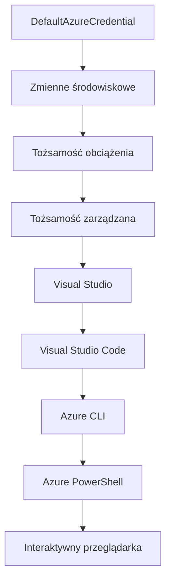

# Podstawy AZD - Zrozumienie Azure Developer CLI

# Podstawy AZD - Kluczowe Koncepcje i Fundamenty

**Nawigacja po rozdziale:**
- **📚 Strona główna kursu**: [AZD dla początkujących](../../README.md)
- **📖 Bieżący rozdział**: Rozdział 1 - Fundamenty i szybki start
- **⬅️ Poprzedni**: [Przegląd kursu](../../README.md#-chapter-1-foundation--quick-start)
- **➡️ Następny**: [Instalacja i konfiguracja](installation.md)
- **🚀 Następny rozdział**: [Rozdział 2: Rozwój AI-First](../chapter-02-ai-development/microsoft-foundry-integration.md)

## Wprowadzenie

Ta lekcja wprowadza Cię do Azure Developer CLI (azd), potężnego narzędzia wiersza poleceń, które przyspiesza Twoją drogę od lokalnego developmentu do wdrożenia na Azure. Dowiesz się podstawowych pojęć, głównych funkcji oraz zrozumiesz, jak azd upraszcza wdrażanie aplikacji natywnych dla chmury.

## Cele nauki

Po zakończeniu tej lekcji będziesz:
- Rozumieć, czym jest Azure Developer CLI i jaką pełni główną rolę
- Poznawać podstawowe koncepcje szablonów, środowisk i usług
- Odkrywać kluczowe funkcje, takie jak rozwój oparty na szablonach i Infrastrukturę jako Kod
- Zrozumieć strukturę projektu azd i przepływ pracy
- Być przygotowany do instalacji i konfiguracji azd w swoim środowisku deweloperskim

## Efekty nauki

Po ukończeniu tej lekcji będziesz w stanie:
- Wyjaśnić rolę azd we współczesnych przepływach pracy chmurowych
- Zidentyfikować komponenty struktury projektu azd
- Opisać, jak szablony, środowiska i usługi współdziałają
- Zrozumieć korzyści z Infrastruktury jako Kod w azd
- Rozpoznać różne polecenia azd i ich przeznaczenie

## Czym jest Azure Developer CLI (azd)?

Azure Developer CLI (azd) to narzędzie wiersza poleceń zaprojektowane, aby przyspieszyć Twoją drogę od lokalnego developmentu do wdrożenia na Azure. Upraszcza proces budowania, wdrażania i zarządzania aplikacjami natywnymi dla chmury na Azure.

### Co można wdrażać za pomocą azd?

azd obsługuje szeroki zakres obciążeń — i lista ciągle rośnie. Dziś możesz użyć azd do wdrażania:

| Typ obciążenia | Przykłady | Ten sam przepływ pracy? |
|----------------|-----------|-------------------------|
| **Tradycyjne aplikacje** | Aplikacje webowe, REST API, statyczne strony | ✅ `azd up` |
| **Usługi i mikrousługi** | Container Apps, Function Apps, wielousługowe backendy | ✅ `azd up` |
| **Aplikacje zasilane AI** | Aplikacje czatu z Microsoft Foundry Models, rozwiązania RAG z AI Search | ✅ `azd up` |
| **Inteligentne agenty** | Agenty hostowane przez Foundry, orkiestracje wielu agentów | ✅ `azd up` |

Kluczową kwestią jest to, że **cykl życia azd pozostaje taki sam bez względu na to, co wdrażasz**. Inicjujesz projekt, tworzysz infrastrukturę, wdrażasz kod, monitorujesz aplikację i sprzątasz — niezależnie czy to prosta strona, czy zaawansowany agent AI.

Ta ciągłość jest zaprojektowana celowo. azd traktuje możliwości AI jak inny rodzaj usługi, której może używać Twoja aplikacja, a nie coś zasadniczo innego. Punkt końcowy czatu wspierany przez Microsoft Foundry Models z perspektywy azd jest po prostu kolejną usługą do skonfigurowania i wdrożenia.

### 🎯 Dlaczego używać AZD? Porównanie w praktyce

Porównajmy wdrożenie prostej aplikacji webowej z bazą danych:

#### ❌ BEZ AZD: Ręczne wdrożenie w Azure (30+ minut)

```bash
# Krok 1: Utwórz grupę zasobów
az group create --name myapp-rg --location eastus

# Krok 2: Utwórz plan usługi aplikacji
az appservice plan create --name myapp-plan \
  --resource-group myapp-rg \
  --sku B1 --is-linux

# Krok 3: Utwórz aplikację internetową
az webapp create --name myapp-web-unique123 \
  --resource-group myapp-rg \
  --plan myapp-plan \
  --runtime "NODE:18-lts"

# Krok 4: Utwórz konto Cosmos DB (10-15 minut)
az cosmosdb create --name myapp-cosmos-unique123 \
  --resource-group myapp-rg \
  --kind MongoDB

# Krok 5: Utwórz bazę danych
az cosmosdb mongodb database create \
  --account-name myapp-cosmos-unique123 \
  --resource-group myapp-rg \
  --name tododb

# Krok 6: Utwórz kolekcję
az cosmosdb mongodb collection create \
  --account-name myapp-cosmos-unique123 \
  --resource-group myapp-rg \
  --database-name tododb \
  --name todos

# Krok 7: Pobierz łańcuch połączenia
CONN_STR=$(az cosmosdb keys list \
  --name myapp-cosmos-unique123 \
  --resource-group myapp-rg \
  --type connection-strings \
  --query "connectionStrings[0].connectionString" -o tsv)

# Krok 8: Skonfiguruj ustawienia aplikacji
az webapp config appsettings set \
  --name myapp-web-unique123 \
  --resource-group myapp-rg \
  --settings MONGODB_URI="$CONN_STR"

# Krok 9: Włącz logowanie
az webapp log config --name myapp-web-unique123 \
  --resource-group myapp-rg \
  --application-logging filesystem \
  --detailed-error-messages true

# Krok 10: Skonfiguruj Application Insights
az monitor app-insights component create \
  --app myapp-insights \
  --location eastus \
  --resource-group myapp-rg

# Krok 11: Powiąż App Insights z aplikacją internetową
INSTRUMENTATION_KEY=$(az monitor app-insights component show \
  --app myapp-insights \
  --resource-group myapp-rg \
  --query "instrumentationKey" -o tsv)

az webapp config appsettings set \
  --name myapp-web-unique123 \
  --resource-group myapp-rg \
  --settings APPINSIGHTS_INSTRUMENTATIONKEY="$INSTRUMENTATION_KEY"

# Krok 12: Zbuduj aplikację lokalnie
npm install
npm run build

# Krok 13: Utwórz pakiet wdrożeniowy
zip -r app.zip . -x "*.git*" "node_modules/*"

# Krok 14: Wdróż aplikację
az webapp deployment source config-zip \
  --resource-group myapp-rg \
  --name myapp-web-unique123 \
  --src app.zip

# Krok 15: Poczekaj i módl się, aby działało 🙏
# (Brak automatycznej walidacji, wymagana ręczna weryfikacja)
```

**Problemy:**
- ❌ 15+ poleceń do zapamiętania i wykonania w odpowiedniej kolejności
- ❌ 30-45 minut pracy ręcznej
- ❌ Łatwo popełnić błędy (literówki, złe parametry)
- ❌ Łańcuchy połączeń widoczne w historii terminala
- ❌ Brak automatycznego wycofania w przypadku błędu
- ❌ Trudno odtworzyć dla współpracowników
- ❌ Za każdym razem inne (niepowtarzalne)

#### ✅ Z AZD: Automatyczne wdrożenie (5 poleceń, 10-15 minut)

```bash
# Krok 1: Inicjalizacja z szablonu
azd init --template todo-nodejs-mongo

# Krok 2: Uwierzytelnianie
azd auth login

# Krok 3: Utwórz środowisko
azd env new dev

# Krok 4: Podgląd zmian (opcjonalne, ale zalecane)
azd provision --preview

# Krok 5: Wdróż wszystko
azd up

# ✨ Gotowe! Wszystko zostało wdrożone, skonfigurowane i monitorowane
```

**Korzyści:**
- ✅ **5 poleceń** zamiast 15+ kroków ręcznych
- ✅ **10-15 minut** całkowitego czasu (przeważnie oczekiwanie na Azure)
- ✅ **Mniej błędów ręcznych** - spójny, oparty na szablonach przepływ pracy
- ✅ **Bezpieczne zarządzanie sekretami** - wiele szablonów używa Azure do przechowywania sekretów
- ✅ **Wielokrotność wdrożeń** - ten sam przepływ za każdym razem
- ✅ **W pełni powtarzalne** - ten sam wynik zawsze
- ✅ **Gotowe dla zespołu** - każdy może wdrożyć tymi samymi poleceniami
- ✅ **Infrastruktura jako Kod** - wersjonowane szablony Bicep
- ✅ **Wbudowany monitoring** - Application Insights konfigurowany automatycznie

### 📊 Redukcja czasu i błędów

| Metrika | Ręczne wdrożenie | Wdrożenie z AZD | Poprawa |
|:--------|:-----------------|:----------------|:--------|
| **Polecenia** | 15+ | 5 | 67% mniej |
| **Czas** | 30-45 min | 10-15 min | 60% szybciej |
| **Wskaźnik błędów** | ~40% | <5% | 88% mniej |
| **Spójność** | Niska (ręczne) | 100% (automatyczne) | Idealna |
| **Onboarding zespołu** | 2-4 godziny | 30 minut | 75% szybciej |
| **Czas wycofania** | 30+ min (ręcznie) | 2 min (automatyczne) | 93% szybciej |

## Kluczowe koncepcje

### Szablony
Szablony to podstawa azd. Zawierają:
- **Kod aplikacji** - Twój kod źródłowy i zależności
- **Definicje infrastruktury** - zasoby Azure zdefiniowane w Bicep lub Terraform
- **Pliki konfiguracyjne** - ustawienia i zmienne środowiskowe
- **Skrypty wdrożeniowe** - zautomatyzowane przepływy wdrożeń

### Środowiska
Środowiska reprezentują różne cele wdrożeniowe:
- **Development** - do testów i rozwoju
- **Staging** - środowisko przedprodukcyjne
- **Production** - środowisko produkcyjne na żywo

Każde środowisko utrzymuje własne:
- Grupę zasobów Azure
- Ustawienia konfiguracyjne
- Stan wdrożenia

### Usługi
Usługi to podstawowe elementy Twojej aplikacji:
- **Frontend** - aplikacje webowe, SPA
- **Backend** - API, mikrousługi
- **Baza danych** - rozwiązania do przechowywania danych
- **Storage** - magazyny plików i blobów

## Kluczowe funkcje

### 1. Rozwój oparty na szablonach
```bash
# Przeglądaj dostępne szablony
azd template list

# Zainicjuj z szablonu
azd init --template <template-name>
```

### 2. Infrastruktura jako Kod
- **Bicep** - specyficzny język Azure
- **Terraform** - narzędzie wielochmurowe
- **Szablony ARM** - szablony Azure Resource Manager

### 3. Zintegrowane przepływy pracy
```bash
# Kompletny proces wdrażania
azd up            # Provision + Wdrożenie, to jest bezobsługowe przy pierwszej konfiguracji

# 🧪 NOWOŚĆ: Podgląd zmian w infrastrukturze przed wdrożeniem (BEZPIECZNE)
azd provision --preview    # Symuluj wdrożenie infrastruktury bez wprowadzania zmian

azd provision     # Twórz zasoby Azure, jeśli aktualizujesz infrastrukturę, użyj tego
azd deploy        # Wdróż kod aplikacji lub ponownie wdroż aplikację po aktualizacji
azd down          # Posprzątaj zasoby
```

#### 🛡️ Bezpieczne planowanie infrastruktury z podglądem
Polecenie `azd provision --preview` to przełom w bezpiecznych wdrożeniach:
- **Analiza próby** - pokazuje, co zostanie utworzone, zmodyfikowane lub usunięte
- **Zero ryzyka** - żadnych faktycznych zmian w środowisku Azure
- **Współpraca zespołowa** - dziel wyniki podglądu przed wdrożeniem
- **Szacowanie kosztów** - poznaj koszty zasobów przed zaangażowaniem

```bash
# Przykładowy podgląd przepływu pracy
azd provision --preview           # Zobacz, co się zmieni
# Przejrzyj wynik, omów z zespołem
azd provision                     # Zastosuj zmiany z pewnością siebie
```

### 📊 Wizualizacja: Przepływ pracy developmentu AZD


**Wyjaśnienie przepływu:**
1. **Init** - rozpocznij od szablonu lub nowego projektu
2. **Auth** - uwierzytelnij się w Azure
3. **Environment** - utwórz izolowane środowisko wdrożeniowe
4. **Preview** - 🆕 Zawsze najpierw podglądaj zmiany infrastruktury (bezpieczna praktyka)
5. **Provision** - utwórz/aktualizuj zasoby Azure
6. **Deploy** - wypchnij kod aplikacji
7. **Monitor** - obserwuj działanie aplikacji
8. **Iterate** - wprowadzaj zmiany i ponownie wdrażaj kod
9. **Cleanup** - usuń zasoby po zakończeniu

### 4. Zarządzanie środowiskami
```bash
# Twórz i zarządzaj środowiskami
azd env new <environment-name>
azd env select <environment-name>
azd env list
```

### 5. Rozszerzenia i polecenia AI

azd używa systemu rozszerzeń, aby dodawać możliwości wykraczające poza podstawowe CLI. Jest to szczególnie przydatne dla obciążeń AI:

```bash
# Wymień dostępne rozszerzenia
azd extension list

# Zainstaluj rozszerzenie agentów Foundry
azd extension install azure.ai.agents

# Zainicjuj projekt agenta AI na podstawie manifestu
azd ai agent init -m agent-manifest.yaml

# Uruchom serwer MCP do wspomaganego rozwoju AI (Alfa)
azd mcp start
```

> Rozszerzenia są szczegółowo omówione w [Rozdziale 2: Rozwój AI-First](../chapter-02-ai-development/agents.md) oraz w referencji [AZD AI CLI Commands](../chapter-08-production/production-ai-practices.md#azd-ai-cli-commands-and-extensions).

## 📁 Struktura projektu

Typowa struktura projektu azd:
```
my-app/
├── .azd/                    # azd configuration
│   └── config.json
├── .azure/                  # Azure deployment artifacts
├── .devcontainer/          # Development container config
├── .github/workflows/      # GitHub Actions
├── .vscode/               # VS Code settings
├── infra/                 # Infrastructure code
│   ├── main.bicep        # Main infrastructure template
│   ├── main.parameters.json
│   └── modules/          # Reusable modules
├── src/                  # Application source code
│   ├── api/             # Backend services
│   └── web/             # Frontend application
├── azure.yaml           # azd project configuration
└── README.md
```

## 🔧 Pliki konfiguracyjne

### azure.yaml
Główny plik konfiguracyjny projektu:
```yaml
name: my-awesome-app
metadata:
  template: my-template@1.0.0

services:
  web:
    project: ./src/web
    language: js
    host: appservice
  api:
    project: ./src/api
    language: js
    host: appservice

hooks:
  preprovision:
    shell: pwsh
    run: echo "Preparing to provision..."
```

### .azure/config.json
Konfiguracja specyficzna dla środowiska:
```json
{
  "version": 1,
  "defaultEnvironment": "dev",
  "environments": {
    "dev": {
      "subscriptionId": "your-subscription-id",
      "location": "eastus"
    }
  }
}
```

## 🎪 Typowe przepływy pracy z ćwiczeniami praktycznymi

> **💡 Wskazówka:** Postępuj według tych ćwiczeń, aby stopniowo rozwijać swoje umiejętności w AZD.

### 🎯 Ćwiczenie 1: Inicjalizacja pierwszego projektu

**Cel:** Utwórz projekt AZD i poznaj jego strukturę

**Kroki:**
```bash
# Użyj sprawdzonego szablonu
azd init --template todo-nodejs-mongo

# Przeglądaj wygenerowane pliki
ls -la  # Pokaż wszystkie pliki, włączając ukryte

# Utworzone kluczowe pliki:
# - azure.yaml (główna konfiguracja)
# - infra/ (kod infrastruktury)
# - src/ (kod aplikacji)
```

**✅ Sukces:** Masz katalogi azure.yaml, infra/ i src/

---

### 🎯 Ćwiczenie 2: Wdrożenie do Azure

**Cel:** Kompleksowe wdrożenie end-to-end

**Kroki:**
```bash
# 1. Uwierzytelnij się
az login && azd auth login

# 2. Utwórz środowisko
azd env new dev
azd env set AZURE_LOCATION eastus

# 3. Podejrzyj zmiany (ZALECANE)
azd provision --preview

# 4. Wdróż wszystko
azd up

# 5. Zweryfikuj wdrożenie
azd show    # Zobacz adres URL swojej aplikacji
```

**Oczekiwany czas:** 10-15 minut  
**✅ Sukces:** URL aplikacji otwiera się w przeglądarce

---

### 🎯 Ćwiczenie 3: Wielu środowisk

**Cel:** Wdróż do dev i staging

**Kroki:**
```bash
# Masz już dev, utwórz staging
azd env new staging
azd env set AZURE_LOCATION westus2
azd up

# Przełączaj się między nimi
azd env list
azd env select dev
```

**✅ Sukces:** Dwie oddzielne grupy zasobów w Azure Portal

---

### 🛡️ Czyszczenie: `azd down --force --purge`

Gdy potrzebujesz całkowicie zacząć od nowa:

```bash
azd down --force --purge
```

**Co robi:**
- `--force`: Brak pytań o potwierdzenie
- `--purge`: Usuwa cały lokalny stan i zasoby Azure

**Używaj gdy:**
- Wdrożenie przerwane w trakcie
- Zmiana projektu
- Potrzebujesz czystego startu

---

## 🎪 Oryginalny odniesienie przepływu pracy

### Rozpoczęcie nowego projektu
```bash
# Metoda 1: Użyj istniejącego szablonu
azd init --template todo-nodejs-mongo

# Metoda 2: Zacznij od zera
azd init

# Metoda 3: Użyj bieżącego katalogu
azd init .
```

### Cykl rozwoju
```bash
# Skonfiguruj środowisko deweloperskie
azd auth login
azd env new dev
azd env select dev

# Wdróż wszystko
azd up

# Wprowadź zmiany i wdroż ponownie
azd deploy

# Posprzątaj po zakończeniu
azd down --force --purge # polecenie w Azure Developer CLI to **twardy reset** środowiska—szczególnie przydatny podczas rozwiązywania problemów z nieudanymi wdrożeniami, sprzątania porzuconych zasobów lub przygotowywania do nowego wdrożenia.
```

## Zrozumienie `azd down --force --purge`
Polecenie `azd down --force --purge` jest potężnym sposobem na całkowite rozebranie środowiska azd i wszystkich powiązanych zasobów. Oto co robi każdy przełącznik:
```
--force
```
- Pomija zapytania o potwierdzenie.
- Przydatne w automatyzacji lub skryptach, gdzie ręczna interakcja nie jest możliwa.
- Zapewnia, że usuwanie przebiega bez przerywania, nawet jeśli CLI napotka niespójności.

```
--purge
```
Usuwa **wszystkie powiązane metadane**, w tym:
Stan środowiska
Lokalny folder `.azure`
Buforowane informacje o wdrożeniu
Zapobiega "pamiętaniu" przez azd poprzednich wdrożeń, co może powodować problemy takie jak niezgodne grupy zasobów lub stare odwołania do rejestrów.

### Dlaczego używać obu?
Gdy napotkasz problemy z `azd up` spowodowane zalegającym stanem lub częściowymi wdrożeniami, ta kombinacja gwarantuje **czysty start**.

Jest to szczególnie przydatne po ręcznym usunięciu zasobów w Azure Portal lub podczas zmiany szablonów, środowisk lub konwencji nazewnictwa grup zasobów.

### Zarządzanie wieloma środowiskami
```bash
# Utwórz środowisko staging
azd env new staging
azd env select staging
azd up

# Przełącz się z powrotem na dev
azd env select dev

# Porównaj środowiska
azd env list
```

## 🔐 Uwierzytelnianie i poświadczenia

Zrozumienie uwierzytelniania jest kluczowe dla sukcesu wdrożeń azd. Azure wykorzystuje wiele metod uwierzytelniania, a azd korzysta z tego samego łańcucha kredencyjnego, co inne narzędzia Azure.

### Uwierzytelnianie w Azure CLI (`az login`)

Przed użyciem azd musisz się uwierzytelnić w Azure. Najpopularniejszą metodą jest użycie Azure CLI:

```bash
# Interaktywne logowanie (otwiera przeglądarkę)
az login

# Logowanie z określonym najemcą
az login --tenant <tenant-id>

# Logowanie za pomocą głównego podmiotu usługi
az login --service-principal -u <app-id> -p <password> --tenant <tenant-id>

# Sprawdź aktualny stan logowania
az account show

# Wyświetl dostępne subskrypcje
az account list --output table

# Ustaw domyślną subskrypcję
az account set --subscription <subscription-id>
```

### Przepływ uwierzytelniania
1. **Logowanie interaktywne**: Otwiera domyślną przeglądarkę do uwierzytelnienia
2. **Device Code Flow**: Dla środowisk bez dostępu do przeglądarki
3. **Service Principal**: Dla scenariuszy automatyzacji i CI/CD
4. **Managed Identity**: Dla aplikacji hostowanych na Azure

### Łańcuch DefaultAzureCredential

`DefaultAzureCredential` to typ poświadczeń, który upraszcza doświadczenie uwierzytelniania, próbując automatycznie wiele źródeł poświadczeń w określonej kolejności:

#### Kolejność w łańcuchu poświadczeń

#### 1. Zmienne środowiskowe
```bash
# Ustaw zmienne środowiskowe dla głównego podmiotu usługi
export AZURE_CLIENT_ID="<app-id>"
export AZURE_CLIENT_SECRET="<password>"
export AZURE_TENANT_ID="<tenant-id>"
```

#### 2. Workload Identity (Kubernetes/GitHub Actions)
Używane automatycznie w:
- Azure Kubernetes Service (AKS) z Workload Identity
- GitHub Actions z federacją OIDC
- Innych scenariuszach federacji tożsamości

#### 3. Managed Identity
Dla zasobów Azure takich jak:
- Maszyny wirtualne
- App Service
- Azure Functions
- Container Instances

```bash
# Sprawdź, czy działa na zasobie Azure z zarządzaną tożsamością
az account show --query "user.type" --output tsv
# Zwraca: "servicePrincipal", jeśli używana jest zarządzana tożsamość
```

#### 4. Integracja z narzędziami deweloperskimi
- **Visual Studio**: automatycznie używa zalogowanego konta
- **VS Code**: używa poświadczeń rozszerzenia Azure Account
- **Azure CLI**: używa poświadczeń z `az login` (najczęściej dla lokalnego developmentu)

### Konfiguracja uwierzytelniania AZD

```bash
# Metoda 1: Użyj Azure CLI (zalecane dla rozwoju)
az login
azd auth login  # Używa istniejących poświadczeń Azure CLI

# Metoda 2: Bezpośrednia autoryzacja azd
azd auth login --use-device-code  # Dla środowisk bez interfejsu graficznego

# Metoda 3: Sprawdź status uwierzytelniania
azd auth login --check-status

# Metoda 4: Wyloguj się i uwierzytelnij ponownie
azd auth logout
azd auth login
```

### Najlepsze praktyki uwierzytelniania

#### Dla lokalnego developmentu
```bash
# 1. Zaloguj się za pomocą Azure CLI
az login

# 2. Zweryfikuj prawidłową subskrypcję
az account show
az account set --subscription "Your Subscription Name"

# 3. Użyj azd z istniejącymi poświadczeniami
azd auth login
```

#### Dla pipeline'ów CI/CD
```yaml
# GitHub Actions example
- name: Azure Login
  uses: azure/login@v1
  with:
    creds: ${{ secrets.AZURE_CREDENTIALS }}

- name: Deploy with azd
  run: |
    azd auth login --client-id ${{ secrets.AZURE_CLIENT_ID }} \
                    --client-secret ${{ secrets.AZURE_CLIENT_SECRET }} \
                    --tenant-id ${{ secrets.AZURE_TENANT_ID }}
    azd up --no-prompt
```

#### Dla środowisk produkcyjnych
- Używaj **Managed Identity** przy uruchamianiu na zasobach Azure
- Używaj **Service Principal** w scenariuszach automatyzacji
- Unikaj przechowywania poświadczeń w kodzie czy plikach konfiguracyjnych
- Korzystaj z **Azure Key Vault** do bezpiecznej konfiguracji

### Typowe problemy z uwierzytelnianiem i rozwiązania

#### Problem: "No subscription found"
```bash
# Rozwiązanie: Ustaw domyślną subskrypcję
az account list --output table
az account set --subscription "<subscription-id>"
azd env set AZURE_SUBSCRIPTION_ID "<subscription-id>"
```

#### Problem: "Insufficient permissions"
```bash
# Rozwiązanie: Sprawdź i przypisz wymagane role
az role assignment list --assignee $(az account show --query user.name --output tsv)

# Wspólne wymagane role:
# - Współautor (do zarządzania zasobami)
# - Administrator dostępu użytkowników (do przydzielania ról)
```

#### Problem: "Token expired"
```bash
# Rozwiązanie: Ponowna autoryzacja
az logout
az login
azd auth logout
azd auth login
```

### Uwierzytelnianie w różnych scenariuszach

#### Lokalny development
```bash
# Konto rozwoju osobistego
az login
azd auth login
```

#### Praca zespołowa
```bash
# Użyj konkretnego najemcy dla organizacji
az login --tenant contoso.onmicrosoft.com
azd auth login
```

#### Scenariusze multi-tenant
```bash
# Przełącz między najemcami
az login --tenant tenant1.onmicrosoft.com
# Wdróż do najemcy 1
azd up

az login --tenant tenant2.onmicrosoft.com  
# Wdróż do najemcy 2
azd up
```

### Rozważania dotyczące bezpieczeństwa
1. **Przechowywanie poświadczeń**: Nigdy nie przechowuj poświadczeń w kodzie źródłowym  
2. **Ograniczenie zakresu**: Stosuj zasadę najmniejszych uprawnień dla service principals  
3. **Rotacja tokenów**: Regularnie rotuj sekrety service principal  
4. **Ścieżka audytu**: Monitoruj działania uwierzytelniania i wdrażania  
5. **Bezpieczeństwo sieci**: Używaj prywatnych punktów końcowych, gdy to możliwe

### Rozwiązywanie problemów z uwierzytelnianiem

```bash
# Rozwiązywanie problemów z uwierzytelnianiem
azd auth login --check-status
az account show
az account get-access-token

# Typowe polecenia diagnostyczne
whoami                          # Bieżący kontekst użytkownika
az ad signed-in-user show      # Szczegóły użytkownika Azure AD
az group list                  # Test dostępu do zasobów
```

## Zrozumienie `azd down --force --purge`

### Odkrywanie
```bash
azd template list              # Przeglądaj szablony
azd template show <template>   # Szczegóły szablonu
azd init --help               # Opcje inicjalizacji
```

### Zarządzanie projektem
```bash
azd show                     # Przegląd projektu
azd env list                # Dostępne środowiska i wybrane domyślne
azd config show            # Ustawienia konfiguracyjne
```

### Monitoring
```bash
azd monitor                  # Otwórz monitorowanie portalu Azure
azd monitor --logs           # Wyświetl logi aplikacji
azd monitor --live           # Zobacz metryki na żywo
azd pipeline config          # Skonfiguruj CI/CD
```

## Najlepsze praktyki

### 1. Używaj znaczących nazw
```bash
# Dobry
azd env new production-east
azd init --template web-app-secure

# Unikaj
azd env new env1
azd init --template template1
```

### 2. Wykorzystaj szablony
- Zacznij od istniejących szablonów  
- Dostosuj do swoich potrzeb  
- Twórz wielokrotnego użytku szablony dla swojej organizacji  

### 3. Izolacja środowiska
- Używaj oddzielnych środowisk dla dev/staging/prod  
- Nigdy nie wdrażaj bezpośrednio na produkcję z lokalnej maszyny  
- Używaj pipeline’ów CI/CD do wdrożeń produkcyjnych  

### 4. Zarządzanie konfiguracją
- Używaj zmiennych środowiskowych dla danych wrażliwych  
- Przechowuj konfigurację w systemie kontroli wersji  
- Dokumentuj ustawienia specyficzne dla środowiska  

## Postęp w nauce

### Początkujący (tydzień 1-2)
1. Zainstaluj azd i uwierzytelnij się  
2. Wdróż prosty szablon  
3. Zrozum strukturę projektu  
4. Naucz się podstawowych poleceń (up, down, deploy)  

### Średniozaawansowany (tydzień 3-4)
1. Dostosuj szablony  
2. Zarządzaj wieloma środowiskami  
3. Zrozum kod infrastruktury  
4. Skonfiguruj pipeline’y CI/CD  

### Zaawansowany (tydzień 5+)
1. Twórz własne szablony  
2. Zaawansowane wzorce infrastruktury  
3. Wdrażanie w wielu regionach  
4. Konfiguracje na poziomie korporacyjnym  

## Kolejne kroki

**📖 Kontynuuj naukę rozdziału 1:**  
- [Instalacja i konfiguracja](installation.md) - Zainstaluj i skonfiguruj azd  
- [Twój pierwszy projekt](first-project.md) - Przejdź praktyczny tutorial  
- [Przewodnik po konfiguracji](configuration.md) - Zaawansowane opcje konfiguracji  

**🎯 Gotowy na następny rozdział?**  
- [Rozdział 2: AI-First Development](../chapter-02-ai-development/microsoft-foundry-integration.md) - Zacznij budować aplikacje AI  

## Dodatkowe zasoby

- [Przegląd Azure Developer CLI](https://learn.microsoft.com/en-us/azure/developer/azure-developer-cli/)  
- [Galeria szablonów](https://azure.github.io/awesome-azd/)  
- [Przykłady społeczności](https://github.com/Azure-Samples)  

---

## 🙋 Najczęściej zadawane pytania

### Pytania ogólne

**P: Jaka jest różnica między AZD a Azure CLI?**

O: Azure CLI (`az`) służy do zarządzania pojedynczymi zasobami Azure. AZD (`azd`) służy do zarządzania całymi aplikacjami:

```bash
# Azure CLI - zarządzanie zasobami na niskim poziomie
az webapp create --name myapp --resource-group rg
az sql server create --name myserver --resource-group rg
# ...wiele więcej potrzebnych poleceń

# AZD - zarządzanie na poziomie aplikacji
azd up  # Wdraża całą aplikację ze wszystkimi zasobami
```

**Pomyśl o tym tak:**  
- `az` = Operowanie pojedynczymi klockami Lego  
- `azd` = Praca z całymi zestawami Lego  

---

**P: Czy muszę znać Bicep lub Terraform, aby używać AZD?**

O: Nie! Zacznij od szablonów:  
```bash
# Użyj istniejącego szablonu - nie jest wymagana znajomość IaC
azd init --template todo-nodejs-mongo
azd up
```
  
Możesz później nauczyć się Bicep, by dostosować infrastrukturę. Szablony dają działające przykłady do nauki.

---

**P: Ile kosztuje uruchamianie szablonów AZD?**

O: Koszty różnią się w zależności od szablonu. Większość szablonów deweloperskich kosztuje 50-150 USD miesięcznie:

```bash
# Podgląd kosztów przed wdrożeniem
azd provision --preview

# Zawsze sprzątaj, gdy nie używasz
azd down --force --purge  # Usuwa wszystkie zasoby
```
  
**Wskazówka eksperta:** Korzystaj z darmowych poziomów, gdzie dostępne:  
- App Service: poziom F1 (bezpłatny)  
- Microsoft Foundry Models: Azure OpenAI 50 000 tokenów/miesiąc za darmo  
- Cosmos DB: darmowy poziom 1000 RU/s  

---

**P: Czy mogę używać AZD z istniejącymi zasobami Azure?**

O: Tak, ale łatwiej zacząć od początku. AZD działa najlepiej, gdy zarządza pełnym cyklem życia. Dla istniejących zasobów:

```bash
# Opcja 1: Importuj istniejące zasoby (zaawansowane)
azd init
# Następnie zmodyfikuj infra/, aby odwoływała się do istniejących zasobów

# Opcja 2: Zacznij od nowa (zalecane)
azd init --template matching-your-stack
azd up  # Tworzy nowe środowisko
```
  
---

**P: Jak udostępnić mój projekt kolegom z zespołu?**

O: Przekaż projekt AZD do Gita (ale NIE folder `.azure`):

```bash
# Już domyślnie w .gitignore
.azure/        # Zawiera tajne dane i dane środowiskowe
*.env          # Zmienne środowiskowe

# Członkowie zespołu następnie:
git clone <your-repo>
azd auth login
azd env new <their-name>-dev
azd up
```
  
Wszyscy mają identyczną infrastrukturę z tych samych szablonów.

---

### Pytania dotyczące rozwiązywania problemów

**P: „azd up” zakończył się niepowodzeniem w połowie. Co robić?**

O: Sprawdź błąd, napraw go, a potem spróbuj ponownie:

```bash
# Zobacz szczegółowe logi
azd show

# Typowe rozwiązania:

# 1. Jeśli przekroczono limit:
azd env set AZURE_LOCATION "westus2"  # Spróbuj inny region

# 2. Jeśli konflikt nazwy zasobu:
azd down --force --purge  # Wyczyść
azd up  # Spróbuj ponownie

# 3. Jeśli wygasła autoryzacja:
az login
azd auth login
azd up
```
  
**Najczęstszy problem:** Wybrano niewłaściwy subskrypcję Azure  
```bash
az account list --output table
az account set --subscription "<correct-subscription>"
```
  
---

**P: Jak wdrożyć tylko zmiany w kodzie bez reprowizji?**

O: Użyj `azd deploy` zamiast `azd up`:

```bash
azd up          # Pierwszy raz: przygotowanie + wdrożenie (wolne)

# Wprowadź zmiany w kodzie...

azd deploy      # Kolejne razy: tylko wdrożenie (szybkie)
```
  
Porównanie szybkości:  
- `azd up`: 10-15 minut (prowizjonowanie infrastruktury)  
- `azd deploy`: 2-5 minut (tylko kod)  

---

**P: Czy mogę dostosować szablony infrastruktury?**

O: Tak! Edytuj pliki Bicep w katalogu `infra/`:

```bash
# Po azd init
cd infra/
code main.bicep  # Edytuj w VS Code

# Podgląd zmian
azd provision --preview

# Zastosuj zmiany
azd provision
```
  
**Wskazówka:** Zacznij od małych zmian – najpierw zmień SKU:  
```bicep
// infra/main.bicep
sku: {
  name: 'B1'  // Change to 'P1V2' for production
}
```
  
---

**P: Jak usunąć wszystko, co stworzył AZD?**

O: Jedno polecenie usuwa wszystkie zasoby:

```bash
azd down --force --purge

# To usuwa:
# - Wszystkie zasoby Azure
# - Grupę zasobów
# - Lokalny stan środowiska
# - Buforowane dane wdrożenia
```
  
**Uruchamiaj zawsze gdy:**  
- Testowanie szablonu zakończone  
- Przechodzisz do innego projektu  
- Chcesz zacząć od nowa  

**Oszczędność kosztów:** Usuwanie nieużywanych zasobów = 0 opłat  

---

**P: Co jeśli przypadkiem usunąłem zasoby w Azure Portal?**

O: Stan AZD może być niespójny. Podejście "czysta karta":

```bash
# 1. Usuń lokalny stan
azd down --force --purge

# 2. Zacznij od nowa
azd up

# Alternatywa: Pozwól AZD wykryć i naprawić
azd provision  # Utworzy brakujące zasoby
```
  
---

### Pytania zaawansowane

**P: Czy mogę używać AZD w pipeline’ach CI/CD?**

O: Tak! Przykład GitHub Actions:

```yaml
# .github/workflows/deploy.yml
name: Deploy with AZD

on:
  push:
    branches: [main]

jobs:
  deploy:
    runs-on: ubuntu-latest
    steps:
      - uses: actions/checkout@v2
      
      - name: Install azd
        run: curl -fsSL https://aka.ms/install-azd.sh | bash
      
      - name: Azure Login
        run: |
          azd auth login \
            --client-id ${{ secrets.AZURE_CLIENT_ID }} \
            --client-secret ${{ secrets.AZURE_CLIENT_SECRET }} \
            --tenant-id ${{ secrets.AZURE_TENANT_ID }}
      
      - name: Deploy
        run: azd up --no-prompt
```
  
---

**P: Jak obsługiwać sekrety i dane wrażliwe?**

O: AZD automatycznie integruje się z Azure Key Vault:

```bash
# Sekrety są przechowywane w Key Vault, nie w kodzie
azd env set DATABASE_PASSWORD "$(openssl rand -base64 32)"

# AZD automatycznie:
# 1. Tworzy Key Vault
# 2. Przechowuje sekret
# 3. Przyznaje aplikacji dostęp za pomocą Managed Identity
# 4. Wstrzykuje w czasie działania
```
  
**Nigdy nie commituj:**  
- folderu `.azure/` (zawiera dane środowiska)  
- plików `.env` (lokalne sekrety)  
- łańcuchów połączeń  

---

**P: Czy mogę wdrażać do wielu regionów?**

O: Tak, utwórz środowisko dla każdego regionu:

```bash
# Środowisko Wschodniego USA
azd env new prod-eastus
azd env set AZURE_LOCATION eastus
azd up

# Środowisko Zachodniej Europy
azd env new prod-westeurope
azd env set AZURE_LOCATION westeurope
azd up

# Każde środowisko jest niezależne
azd env list
```
  
Dla prawdziwych aplikacji wieloregionalnych, dostosuj szablony Bicep, aby jednocześnie wdrażać do wielu regionów.

---

**P: Gdzie mogę uzyskać pomoc, jeśli utknę?**

1. **Dokumentacja AZD:** https://learn.microsoft.com/azure/developer/azure-developer-cli/  
2. **GitHub Issues:** https://github.com/Azure/azure-dev/issues  
3. **Discord:** [Azure Discord](https://discord.gg/microsoft-azure) - kanał #azure-developer-cli  
4. **Stack Overflow:** tag `azure-developer-cli`  
5. **Ten kurs:** [Przewodnik rozwiązywania problemów](../chapter-07-troubleshooting/common-issues.md)  

**Wskazówka:** Przed zadaniem pytania, uruchom:  
```bash
azd show       # Pokazuje bieżący stan
azd version    # Pokazuje twoją wersję
```
  
Dołącz te informacje do pytania, by uzyskać szybszą pomoc.

---

## 🎓 Co dalej?

Teraz rozumiesz podstawy AZD. Wybierz swoją ścieżkę:

### 🎯 Dla początkujących:  
1. **Następny krok:** [Instalacja i konfiguracja](installation.md) – zainstaluj AZD na swoim komputerze  
2. **Potem:** [Twój pierwszy projekt](first-project.md) – wdroż pierwszą aplikację  
3. **Ćwicz:** Wykonaj wszystkie 3 ćwiczenia z tej lekcji  

### 🚀 Dla deweloperów AI:  
1. **Przejdź do:** [Rozdział 2: AI-First Development](../chapter-02-ai-development/microsoft-foundry-integration.md)  
2. **Wdróż:** Zacznij od `azd init --template get-started-with-ai-chat`  
3. **Ucz się:** Buduj aplikację podczas wdrożenia  

### 🏗️ Dla doświadczonych deweloperów:  
1. **Przejrzyj:** [Przewodnik po konfiguracji](configuration.md) – ustawienia zaawansowane  
2. **Poznaj:** [Infrastructure as Code](../chapter-04-infrastructure/provisioning.md) – głębsze omówienie Bicep  
3. **Buduj:** Twórz własne szablony dla swojego stosu technologicznego  

---

**Nawigacja po rozdziałach:**  
- **📚 Strona główna kursu:** [AZD dla początkujących](../../README.md)  
- **📖 Aktualny rozdział:** Rozdział 1 - Fundamenty i szybki start  
- **⬅️ Poprzedni:** [Przegląd kursu](../../README.md#-chapter-1-foundation--quick-start)  
- **➡️ Następny:** [Instalacja i konfiguracja](installation.md)  
- **🚀 Następny rozdział:** [Rozdział 2: AI-First Development](../chapter-02-ai-development/microsoft-foundry-integration.md)

---

<!-- CO-OP TRANSLATOR DISCLAIMER START -->
**Zastrzeżenie**:  
Ten dokument został przetłumaczony za pomocą usługi tłumaczenia AI [Co-op Translator](https://github.com/Azure/co-op-translator). Chociaż dążymy do dokładności, prosimy mieć na uwadze, że automatyczne tłumaczenia mogą zawierać błędy lub nieścisłości. Oryginalny dokument w jego rodzimym języku powinien być uznawany za źródło wiarygodne. W przypadku informacji krytycznych zalecane jest skorzystanie z profesjonalnego, ludzkiego tłumaczenia. Nie ponosimy odpowiedzialności za jakiekolwiek nieporozumienia lub błędne interpretacje wynikające z użycia tego tłumaczenia.
<!-- CO-OP TRANSLATOR DISCLAIMER END -->