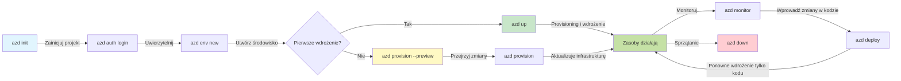
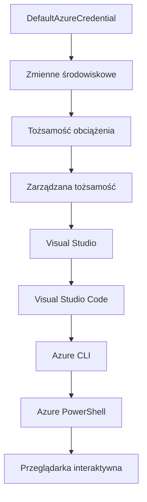

# AZD Basics - Zrozumienie Azure Developer CLI

# AZD Basics - Podstawowe Koncepcje i Fundamenty

**Nawigacja po rozdziale:**
- **📚 Strona kursu**: [AZD dla początkujących](../../README.md)
- **📖 Aktualny rozdział**: Rozdział 1 - Fundamenty i szybki start
- **⬅️ Poprzedni**: [Przegląd kursu](../../README.md#-chapter-1-foundation--quick-start)
- **➡️ Następny**: [Instalacja i konfiguracja](installation.md)
- **🚀 Następny rozdział**: [Rozdział 2: Rozwój AI-First](../chapter-02-ai-development/microsoft-foundry-integration.md)

## Wprowadzenie

Ta lekcja wprowadza Cię do Azure Developer CLI (azd), potężnego narzędzia wiersza poleceń, które przyspiesza Twoją drogę od lokalnego rozwoju do wdrożenia w Azure. Poznasz podstawowe koncepcje, kluczowe funkcje oraz zrozumiesz, jak azd upraszcza wdrażanie natywnych dla chmury aplikacji.

## Cele nauki

Pod koniec tej lekcji będziesz:
- Rozumieć, czym jest Azure Developer CLI i jaki ma główny cel
- Poznawać podstawowe koncepcje szablonów, środowisk i usług
- Eksplorować kluczowe funkcje, w tym rozwój oparty na szablonach i Infrastruktura jako Kod
- Zrozumieć strukturę projektu azd oraz jego przepływ pracy
- Być przygotowanym do instalacji i konfiguracji azd w swoim środowisku deweloperskim

## Oczekiwane efekty nauki

Po ukończeniu tej lekcji będziesz w stanie:
- Wyjaśnić rolę azd w nowoczesnych przepływach pracy rozwoju chmurowego
- Zidentyfikować elementy struktury projektu azd
- Opisać, jak działają razem szablony, środowiska i usługi
- Zrozumieć korzyści z Infrastruktury jako Kodu za pomocą azd
- Rozpoznać różne polecenia azd i ich zastosowanie

## Czym jest Azure Developer CLI (azd)?

Azure Developer CLI (azd) to narzędzie wiersza poleceń, które ma na celu przyspieszenie Twojej ścieżki od lokalnego rozwoju do wdrożenia w Azure. Upraszcza proces tworzenia, wdrażania i zarządzania natywnymi aplikacjami chmurowymi na platformie Azure.

### Co możesz wdrożyć za pomocą azd?

azd obsługuje szeroki zakres obciążeń – i lista ta stale się powiększa. Obecnie możesz użyć azd do wdrażania:

| Typ obciążenia | Przykłady | Ten sam przepływ pracy? |
|---------------|----------|----------------|
| **Tradycyjne aplikacje** | Aplikacje webowe, REST API, strony statyczne | ✅ `azd up` |
| **Usługi i mikroserwisy** | Container Apps, Function Apps, wielousługowe backendy | ✅ `azd up` |
| **Aplikacje wspomagane AI** | Aplikacje czatu z modelami Microsoft Foundry, rozwiązania RAG z AI Search | ✅ `azd up` |
| **Inteligentni agenci** | Agenci hostowani w Foundry, orkiestracje wieloagentowe | ✅ `azd up` |

Kluczową obserwacją jest, że **cykl życia azd pozostaje taki sam niezależnie od tego, co wdrażasz**. Inicjujesz projekt, przygotowujesz infrastrukturę, wdrażasz kod, monitorujesz aplikację i sprzątasz – niezależnie, czy jest to prosta strona internetowa, czy zaawansowany agent AI.

Ta ciągłość jest zaprojektowana celowo. azd traktuje możliwości AI jako kolejny rodzaj usługi, z której może korzystać Twoja aplikacja, a nie jako coś zasadniczo innego. Punkt końcowy chatu oparty na modelach Microsoft Foundry jest, z perspektywy azd, po prostu kolejną usługą do skonfigurowania i wdrożenia.

### 🎯 Dlaczego warto używać AZD? Porównanie z rzeczywistości

Porównajmy wdrożenie prostej aplikacji webowej z bazą danych:

#### ❌ BEZ AZD: Ręczne wdrożenie w Azure (30+ minut)

```bash
# Krok 1: Utwórz grupę zasobów
az group create --name myapp-rg --location eastus

# Krok 2: Utwórz plan usługi aplikacji
az appservice plan create --name myapp-plan \
  --resource-group myapp-rg \
  --sku B1 --is-linux

# Krok 3: Utwórz aplikację internetową
az webapp create --name myapp-web-unique123 \
  --resource-group myapp-rg \
  --plan myapp-plan \
  --runtime "NODE:18-lts"

# Krok 4: Utwórz konto Cosmos DB (10-15 minut)
az cosmosdb create --name myapp-cosmos-unique123 \
  --resource-group myapp-rg \
  --kind MongoDB

# Krok 5: Utwórz bazę danych
az cosmosdb mongodb database create \
  --account-name myapp-cosmos-unique123 \
  --resource-group myapp-rg \
  --name tododb

# Krok 6: Utwórz kolekcję
az cosmosdb mongodb collection create \
  --account-name myapp-cosmos-unique123 \
  --resource-group myapp-rg \
  --database-name tododb \
  --name todos

# Krok 7: Pobierz łańcuch połączenia
CONN_STR=$(az cosmosdb keys list \
  --name myapp-cosmos-unique123 \
  --resource-group myapp-rg \
  --type connection-strings \
  --query "connectionStrings[0].connectionString" -o tsv)

# Krok 8: Skonfiguruj ustawienia aplikacji
az webapp config appsettings set \
  --name myapp-web-unique123 \
  --resource-group myapp-rg \
  --settings MONGODB_URI="$CONN_STR"

# Krok 9: Włącz logowanie
az webapp log config --name myapp-web-unique123 \
  --resource-group myapp-rg \
  --application-logging filesystem \
  --detailed-error-messages true

# Krok 10: Skonfiguruj Application Insights
az monitor app-insights component create \
  --app myapp-insights \
  --location eastus \
  --resource-group myapp-rg

# Krok 11: Połącz App Insights z aplikacją internetową
INSTRUMENTATION_KEY=$(az monitor app-insights component show \
  --app myapp-insights \
  --resource-group myapp-rg \
  --query "instrumentationKey" -o tsv)

az webapp config appsettings set \
  --name myapp-web-unique123 \
  --resource-group myapp-rg \
  --settings APPINSIGHTS_INSTRUMENTATIONKEY="$INSTRUMENTATION_KEY"

# Krok 12: Zbuduj aplikację lokalnie
npm install
npm run build

# Krok 13: Utwórz pakiet wdrożeniowy
zip -r app.zip . -x "*.git*" "node_modules/*"

# Krok 14: Wdróż aplikację
az webapp deployment source config-zip \
  --resource-group myapp-rg \
  --name myapp-web-unique123 \
  --src app.zip

# Krok 15: Poczekaj i módl się, żeby to zadziałało 🙏
# (Brak automatycznej walidacji, wymagane testy ręczne)
```

**Problemy:**
- ❌ Ponad 15 poleceń do zapamiętania i wykonania w odpowiedniej kolejności
- ❌ 30-45 minut ręcznej pracy
- ❌ Łatwo o błędy (literówki, złe parametry)
- ❌ Łańcuchy połączeń widoczne w historii terminala
- ❌ Brak automatycznego cofania w razie niepowodzenia
- ❌ Trudne do odtworzenia przez członków zespołu
- ❌ Za każdym razem inne (nieodtwarzalne)

#### ✅ Z AZD: Automatyczne wdrożenie (5 poleceń, 10-15 minut)

```bash
# Krok 1: Inicjalizacja z szablonu
azd init --template todo-nodejs-mongo

# Krok 2: Uwierzytelnienie
azd auth login

# Krok 3: Utwórz środowisko
azd env new dev

# Krok 4: Podgląd zmian (opcjonalne, ale zalecane)
azd provision --preview

# Krok 5: Wdrażaj wszystko
azd up

# ✨ Gotowe! Wszystko jest wdrożone, skonfigurowane i monitorowane
```

**Korzyści:**
- ✅ **5 poleceń** kontra ponad 15 manualnych kroków
- ✅ **10-15 minut** całkowitego czasu (głównie oczekiwanie na Azure)
- ✅ **Zero błędów** - zautomatyzowane i przetestowane
- ✅ **Sekrety zarządzane bezpiecznie** za pomocą Key Vault
- ✅ **Automatyczne cofanie** przy niepowodzeniach
- ✅ **W pełni odtwarzalne** - ten sam wynik za każdym razem
- ✅ **Gotowe dla zespołu** - każdy może wdrożyć przy pomocy tych samych poleceń
- ✅ **Infrastruktura jako kod** - szablony Bicep w systemie kontroli wersji
- ✅ **Wbudowany monitoring** - Application Insights konfigurowany automatycznie

### 📊 Skrócenie czasu i zmniejszenie błędów

| Wskaźnik | Ręczne wdrożenie | Wdrożenie AZD | Poprawa |
|:-------|:------------------|:---------------|:------------|
| **Polecenia** | 15+ | 5 | 67% mniej |
| **Czas** | 30-45 min | 10-15 min | 60% szybciej |
| **Błędy** | ~40% | <5% | 88% spadek |
| **Spójność** | Niska (manualna) | 100% (zautomatyzowana) | Idealna |
| **Wprowadzenie zespołu** | 2-4 godziny | 30 minut | 75% szybciej |
| **Czas cofania** | 30+ min (manualnie) | 2 min (automatycznie) | 93% szybciej |

## Podstawowe koncepcje

### Szablony
Szablony są podstawą azd. Zawierają:
- **Kod aplikacji** - Twój kod źródłowy i zależności
- **Definicje infrastruktury** - zasoby Azure zdefiniowane w Bicep lub Terraform
- **Pliki konfiguracyjne** - ustawienia i zmienne środowiskowe
- **Skrypty wdrożeniowe** - zautomatyzowane przepływy wdrożeń

### Środowiska
Środowiska reprezentują różne cele wdrożeń:
- **Development** - do testów i rozwoju
- **Staging** - środowisko przedprodukcyjne
- **Production** - środowisko produkcyjne na żywo

Każde środowisko utrzymuje własne:
- grupę zasobów Azure
- ustawienia konfiguracyjne
- stan wdrożenia

### Usługi
Usługi są budulcem Twojej aplikacji:
- **Frontend** - aplikacje webowe, SPA
- **Backend** - API, mikroserwisy
- **Baza danych** - rozwiązania do przechowywania danych
- **Storage** - przechowywanie plików i obiektów blob

## Kluczowe funkcje

### 1. Rozwój oparty na szablonach
```bash
# Przeglądaj dostępne szablony
azd template list

# Inicjalizuj z szablonu
azd init --template <template-name>
```

### 2. Infrastruktura jako kod
- **Bicep** - specyficzny język Azure
- **Terraform** - narzędzie multi-chmurowe do infrastruktury
- **Szablony ARM** - szablony Azure Resource Manager

### 3. Zintegrowane przepływy pracy
```bash
# Kompletny proces wdrażania
azd up            # Provision + Wdrażanie, jest to bezobsługowe podczas pierwszej konfiguracji

# 🧪 NOWOŚĆ: Podgląd zmian infrastruktury przed wdrożeniem (BEZPIECZNE)
azd provision --preview    # Symuluj wdrażanie infrastruktury bez wprowadzania zmian

azd provision     # Twórz zasoby Azure, jeśli aktualizujesz infrastrukturę użyj tego
azd deploy        # Wdróż kod aplikacji lub wdróż ponownie kod aplikacji po aktualizacji
azd down          # Sprzątaj zasoby
```

#### 🛡️ Bezpieczne planowanie infrastruktury za pomocą podglądu
Polecenie `azd provision --preview` to przełom w bezpiecznych wdrożeniach:
- **Symulacja sucha (dry-run)** - pokazuje, co zostanie stworzone, zmodyfikowane lub usunięte
- **Zero ryzyka** - bez faktycznych zmian w środowisku Azure
- **Współpraca zespołowa** - dzielenie się wynikami podglądu przed wdrożeniem
- **Szacowanie kosztów** - poznaj koszty zasobów przed zobowiązaniem

```bash
# Przykładowy podgląd przepływu pracy
azd provision --preview           # Zobacz, co się zmieni
# Przejrzyj wynik, omów z zespołem
azd provision                     # Zastosuj zmiany z pewnością
```

### 📊 Wizualizacja: Przepływ pracy AZD


**Wyjaśnienie przepływu:**
1. **Init** - rozpocznij ze szablonem lub nowym projektem
2. **Auth** - uwierzytelnij się w Azure
3. **Environment** - utwórz izolowane środowisko wdrożeniowe
4. **Preview** - 🆕 Zawsze najpierw podglądaj zmiany infrastruktury (bezpieczna praktyka)
5. **Provision** - twórz/aktualizuj zasoby Azure
6. **Deploy** - wypchnij kod aplikacji
7. **Monitor** - obserwuj wydajność aplikacji
8. **Iterate** - wprowadzaj zmiany i ponownie wdrażaj kod
9. **Cleanup** - usuń zasoby po zakończeniu

### 4. Zarządzanie środowiskami
```bash
# Twórz i zarządzaj środowiskami
azd env new <environment-name>
azd env select <environment-name>
azd env list
```

### 5. Rozszerzenia i polecenia AI

azd korzysta z systemu rozszerzeń, aby dodać możliwości wykraczające poza podstawowe CLI. Szczególnie przydatne przy obciążeniach AI:

```bash
# Wyświetl dostępne rozszerzenia
azd extension list

# Zainstaluj rozszerzenie agentów Foundry
azd extension install azure.ai.agents

# Zainicjuj projekt agenta AI na podstawie manifestu
azd ai agent init -m agent-manifest.yaml

# Uruchom serwer MCP do wspomaganego rozwoju AI (Alpha)
azd mcp start
```

> Rozszerzenia są szczegółowo omówione w [Rozdziale 2: Rozwój AI-First](../chapter-02-ai-development/agents.md) oraz w referencji [AZD AI CLI Commands](../chapter-08-production/production-ai-practices.md#azd-ai-cli-commands-and-extensions).

## 📁 Struktura projektu

Typowa struktura projektu azd:
```
my-app/
├── .azd/                    # azd configuration
│   └── config.json
├── .azure/                  # Azure deployment artifacts
├── .devcontainer/          # Development container config
├── .github/workflows/      # GitHub Actions
├── .vscode/               # VS Code settings
├── infra/                 # Infrastructure code
│   ├── main.bicep        # Main infrastructure template
│   ├── main.parameters.json
│   └── modules/          # Reusable modules
├── src/                  # Application source code
│   ├── api/             # Backend services
│   └── web/             # Frontend application
├── azure.yaml           # azd project configuration
└── README.md
```

## 🔧 Pliki konfiguracyjne

### azure.yaml
Główny plik konfiguracyjny projektu:
```yaml
name: my-awesome-app
metadata:
  template: my-template@1.0.0

services:
  web:
    project: ./src/web
    language: js
    host: appservice
  api:
    project: ./src/api
    language: js
    host: appservice

hooks:
  preprovision:
    shell: pwsh
    run: echo "Preparing to provision..."
```

### .azure/config.json
Konfiguracja specyficzna dla środowiska:
```json
{
  "version": 1,
  "defaultEnvironment": "dev",
  "environments": {
    "dev": {
      "subscriptionId": "your-subscription-id",
      "location": "eastus"
    }
  }
}
```

## 🎪 Typowe przepływy pracy z ćwiczeniami praktycznymi

> **💡 Wskazówka naukowa:** Wykonuj te ćwiczenia po kolei, aby stopniowo rozwijać swoje umiejętności AZD.

### 🎯 Ćwiczenie 1: Inicjalizacja pierwszego projektu

**Cel:** Utwórz projekt AZD i poznaj jego strukturę

**Kroki:**
```bash
# Użyj sprawdzonego szablonu
azd init --template todo-nodejs-mongo

# Przeglądaj wygenerowane pliki
ls -la  # Wyświetl wszystkie pliki, łącznie z ukrytymi

# Utworzone kluczowe pliki:
# - azure.yaml (główna konfiguracja)
# - infra/ (kod infrastruktury)
# - src/ (kod aplikacji)
```

**✅ Sukces:** Masz katalogi azure.yaml, infra/ i src/

---

### 🎯 Ćwiczenie 2: Wdrożenie do Azure

**Cel:** Ukończ pełne wdrożenie end-to-end

**Kroki:**
```bash
# 1. Uwierzytelnij się
az login && azd auth login

# 2. Utwórz środowisko
azd env new dev
azd env set AZURE_LOCATION eastus

# 3. Podejrzyj zmiany (ZALECANE)
azd provision --preview

# 4. Wdróż wszystko
azd up

# 5. Zweryfikuj wdrożenie
azd show    # Wyświetl URL aplikacji
```

**Szacowany czas:** 10-15 minut  
**✅ Sukces:** Adres URL aplikacji otwiera się w przeglądarce

---

### 🎯 Ćwiczenie 3: Wiele środowisk

**Cel:** Wdrażaj do dev i staging

**Kroki:**
```bash
# Masz już dev, utwórz staging
azd env new staging
azd env set AZURE_LOCATION westus2
azd up

# Przełączaj się między nimi
azd env list
azd env select dev
```

**✅ Sukces:** Dwie oddzielne grupy zasobów w portalu Azure

---

### 🛡️ Czysta karta: `azd down --force --purge`

Gdy potrzebujesz całkowitego resetu:

```bash
azd down --force --purge
```

**Co robi:**
- `--force`: Brak potwierdzeń
- `--purge`: Usuwa cały lokalny stan i zasoby Azure

**Używaj gdy:**
- Wdrożenie nie powiodło się w trakcie
- Zmieniasz projekty
- Potrzebujesz świeżego startu

---

## 🎪 Oryginalna referencja przepływu pracy

### Rozpoczynanie nowego projektu
```bash
# Metoda 1: Użyj istniejącego szablonu
azd init --template todo-nodejs-mongo

# Metoda 2: Zacznij od zera
azd init

# Metoda 3: Użyj bieżącego katalogu
azd init .
```

### Cykl rozwoju
```bash
# Skonfiguruj środowisko programistyczne
azd auth login
azd env new dev
azd env select dev

# Wdróż wszystko
azd up

# Wprowadź zmiany i ponownie wdroż
azd deploy

# Posprzątaj po zakończeniu
azd down --force --purge # polecenie w Azure Developer CLI to **twardy reset** twojego środowiska — szczególnie przydatne podczas rozwiązywania problemów z nieudanymi wdrożeniami, sprzątania osieroconych zasobów lub przygotowywania się do świeżego wdrożenia.
```

## Zrozumienie `azd down --force --purge`
Polecenie `azd down --force --purge` to potężny sposób na całkowite usunięcie środowiska azd i wszystkich powiązanych zasobów. Oto co robi każda flaga:
```
--force
```
- Pomija pytania o potwierdzenie.
- Przydatne do automatyzacji lub skryptów, gdzie ręczna interakcja jest niemożliwa.
- Zapewnia nieprzerwane usuwanie, nawet jeśli CLI wykryje niespójności.

```
--purge
```
Usuwa **wszystkie powiązane metadane**, w tym:
Stan środowiska
Lokalny folder `.azure`
Buforowane informacje o wdrożeniu
Zapobiega "zapamiętywaniu" poprzednich wdrożeń przez azd, co może powodować problemy, takie jak niespójne grupy zasobów lub przestarzałe odniesienia do rejestru.

### Dlaczego używać obu?

Gdy napotkasz problemy z `azd up` z powodu pozostałego stanu lub częściowych wdrożeń, ta kombinacja zapewnia **czystą kartę**.

Jest to szczególnie przydatne po ręcznym usunięciu zasobów w portalu Azure lub przy zmianach szablonów, środowisk lub konwencji nazewnictwa grup zasobów.

### Zarządzanie wieloma środowiskami
```bash
# Utwórz środowisko testowe
azd env new staging
azd env select staging
azd up

# Przełącz się z powrotem na środowisko deweloperskie
azd env select dev

# Porównaj środowiska
azd env list
```

## 🔐 Uwierzytelnianie i poświadczenia

Zrozumienie uwierzytelniania jest kluczowe dla udanych wdrożeń azd. Azure wykorzystuje wiele metod uwierzytelniania, a azd korzysta z tego samego łańcucha poświadczeń, co inne narzędzia Azure.

### Uwierzytelnianie Azure CLI (`az login`)

Przed użyciem azd musisz się uwierzytelnić w Azure. Najczęstszą metodą jest korzystanie z Azure CLI:

```bash
# Logowanie interaktywne (otwiera przeglądarkę)
az login

# Logowanie z określonym tenantem
az login --tenant <tenant-id>

# Logowanie za pomocą service principal
az login --service-principal -u <app-id> -p <password> --tenant <tenant-id>

# Sprawdź aktualny status logowania
az account show

# Wyświetl dostępne subskrypcje
az account list --output table

# Ustaw domyślną subskrypcję
az account set --subscription <subscription-id>
```

### Przepływ uwierzytelniania
1. **Interaktywne logowanie**: otwiera przeglądarkę domyślną w celu uwierzytelnienia
2. **Device Code Flow**: dla środowisk bez dostępu do przeglądarki
3. **Service Principal**: do automatyzacji i scenariuszy CI/CD
4. **Managed Identity**: dla aplikacji hostowanych w Azure

### Łańcuch DefaultAzureCredential

`DefaultAzureCredential` to typ poświadczeń zapewniający uproszczony proces uwierzytelniania przez automatyczne próby wielu źródeł poświadczeń w określonej kolejności:

#### Kolejność łańcucha poświadczeń

#### 1. Zmienne środowiskowe
```bash
# Ustaw zmienne środowiskowe dla głównego podmiotu usługi
export AZURE_CLIENT_ID="<app-id>"
export AZURE_CLIENT_SECRET="<password>"
export AZURE_TENANT_ID="<tenant-id>"
```

#### 2. Tożsamość obciążenia (Workload Identity) (Kubernetes/GitHub Actions)
Używane automatycznie w:
- Azure Kubernetes Service (AKS) z Workload Identity
- GitHub Actions z federacją OIDC
- Innych scenariuszach federacji tożsamości

#### 3. Managed Identity
Dla zasobów Azure jak:
- Maszyny wirtualne
- App Service
- Azure Functions
- Container Instances

```bash
# Sprawdź, czy działa na zasobie Azure z zarządzaną tożsamością
az account show --query "user.type" --output tsv
# Zwraca: "servicePrincipal", jeśli używana jest zarządzana tożsamość
```

#### 4. Integracja z narzędziami deweloperskimi
- **Visual Studio**: automatycznie używa konta zalogowanego
- **VS Code**: używa poświadczeń rozszerzenia Azure Account
- **Azure CLI**: używa poświadczeń z `az login` (najczęstsze dla lokalnego rozwoju)

### Konfiguracja uwierzytelniania AZD

```bash
# Metoda 1: Użyj Azure CLI (zalecane do rozwoju)
az login
azd auth login  # Używa istniejących poświadczeń Azure CLI

# Metoda 2: Bezpośrednia autoryzacja azd
azd auth login --use-device-code  # Dla środowisk bez interfejsu użytkownika

# Metoda 3: Sprawdź status uwierzytelnienia
azd auth login --check-status

# Metoda 4: Wyloguj się i ponownie uwierzytelnij
azd auth logout
azd auth login
```

### Najlepsze praktyki uwierzytelniania

#### Dla lokalnego rozwoju
```bash
# 1. Zaloguj się za pomocą Azure CLI
az login

# 2. Sprawdź poprawną subskrypcję
az account show
az account set --subscription "Your Subscription Name"

# 3. Użyj azd z istniejącymi poświadczeniami
azd auth login
```

#### Dla pipeline'ów CI/CD
```yaml
# GitHub Actions example
- name: Azure Login
  uses: azure/login@v1
  with:
    creds: ${{ secrets.AZURE_CREDENTIALS }}

- name: Deploy with azd
  run: |
    azd auth login --client-id ${{ secrets.AZURE_CLIENT_ID }} \
                    --client-secret ${{ secrets.AZURE_CLIENT_SECRET }} \
                    --tenant-id ${{ secrets.AZURE_TENANT_ID }}
    azd up --no-prompt
```

#### Dla środowisk produkcyjnych
- Używaj **Managed Identity** podczas uruchamiania na zasobach Azure
- Używaj **Service Principal** do scenariuszy automatyzacji
- Unikaj przechowywania poświadczeń w kodzie lub plikach konfiguracyjnych
- Korzystaj z **Azure Key Vault** dla wrażliwych konfiguracji

### Typowe problemy z uwierzytelnianiem i ich rozwiązania

#### Problem: „Nie znaleziono subskrypcji”
```bash
# Rozwiązanie: Ustaw domyślną subskrypcję
az account list --output table
az account set --subscription "<subscription-id>"
azd env set AZURE_SUBSCRIPTION_ID "<subscription-id>"
```

#### Problem: „Niewystarczające uprawnienia”
```bash
# Rozwiązanie: Sprawdź i przypisz wymagane role
az role assignment list --assignee $(az account show --query user.name --output tsv)

# Typowe wymagane role:
# - Współtwórca (do zarządzania zasobami)
# - Administrator dostępu użytkowników (do przypisywania ról)
```

#### Problem: „Token wygasł”
```bash
# Rozwiązanie: Ponowna autoryzacja
az logout
az login
azd auth logout
azd auth login
```

### Uwierzytelnianie w różnych scenariuszach

#### Lokalny rozwój
```bash
# Konto rozwoju osobistego
az login
azd auth login
```

#### Praca zespołowa
```bash
# Użyj konkretnego najemcy dla organizacji
az login --tenant contoso.onmicrosoft.com
azd auth login
```

#### Scenariusze wielonajemcy
```bash
# Przełącz między tenantami
az login --tenant tenant1.onmicrosoft.com
# Wdróż do tenanta 1
azd up

az login --tenant tenant2.onmicrosoft.com  
# Wdróż do tenanta 2
azd up
```

### Rozważania dotyczące bezpieczeństwa
1. **Przechowywanie poświadczeń**: Nigdy nie przechowuj poświadczeń w kodzie źródłowym  
2. **Ograniczenie zakresu**: Stosuj zasadę najmniejszych uprawnień dla tożsamości usługowych  
3. **Rotacja tokenów**: Regularnie rotuj sekrety tożsamości usługowych  
4. **Ścieżka audytu**: Monitoruj działania uwierzytelniania i wdrażania  
5. **Bezpieczeństwo sieci**: Używaj prywatnych punktów końcowych, jeśli to możliwe  

### Rozwiązywanie problemów z uwierzytelnianiem

```bash
# Debuguj problemy z uwierzytelnianiem
azd auth login --check-status
az account show
az account get-access-token

# Typowe polecenia diagnostyczne
whoami                          # Bieżący kontekst użytkownika
az ad signed-in-user show      # Szczegóły użytkownika Azure AD
az group list                  # Testuj dostęp do zasobu
```
  
## Zrozumienie `azd down --force --purge`  

### Odkrywanie  
```bash
azd template list              # Przeglądaj szablony
azd template show <template>   # Szczegóły szablonu
azd init --help               # Opcje inicjalizacji
```
  
### Zarządzanie projektem  
```bash
azd show                     # Przegląd projektu
azd env show                 # Aktualne środowisko
azd config list             # Ustawienia konfiguracyjne
```
  
### Monitorowanie  
```bash
azd monitor                  # Otwórz monitorowanie portalu Azure
azd monitor --logs           # Przejrzyj logi aplikacji
azd monitor --live           # Wyświetl metryki na żywo
azd pipeline config          # Skonfiguruj CI/CD
```
  
## Najlepsze praktyki  

### 1. Używaj sensownych nazw  
```bash
# Dobry
azd env new production-east
azd init --template web-app-secure

# Unikaj
azd env new env1
azd init --template template1
```
  
### 2. Wykorzystuj szablony  
- Zacznij od istniejących szablonów  
- Dostosuj do swoich potrzeb  
- Twórz wielokrotnego użytku szablony dla swojej organizacji  

### 3. Izolacja środowisk  
- Używaj oddzielnych środowisk dla dev/staging/prod  
- Nigdy nie wdrażaj bezpośrednio na produkcję z lokalnej maszyny  
- Wykorzystuj pipeline CI/CD do wdrożeń produkcyjnych  

### 4. Zarządzanie konfiguracją  
- Używaj zmiennych środowiskowych dla danych wrażliwych  
- Przechowuj konfigurację w kontroli wersji  
- Dokumentuj ustawienia specyficzne dla środowiska  

## Postęp nauki  

### Początkujący (Tydzień 1-2)  
1. Zainstaluj azd i uwierzytelnij się  
2. Wdróż prosty szablon  
3. Poznaj strukturę projektu  
4. Naucz się podstawowych poleceń (up, down, deploy)  

### Średniozaawansowany (Tydzień 3-4)  
1. Dostosuj szablony  
2. Zarządzaj wieloma środowiskami  
3. Zrozum kod infrastruktury  
4. Konfiguruj pipeline CI/CD  

### Zaawansowany (Tydzień 5+)  
1. Twórz własne szablony  
2. Stosuj zaawansowane wzorce infrastruktury  
3. Wdrażaj aplikacje wieloregionalne  
4. Konfiguracje klasy enterprise  

## Kolejne kroki  

**📖 Kontynuuj naukę rozdziału 1:**  
- [Instalacja i konfiguracja](installation.md) - Zainstaluj i skonfiguruj azd  
- [Twój pierwszy projekt](first-project.md) - Kompletny tutorial praktyczny  
- [Przewodnik konfiguracji](configuration.md) - Zaawansowane opcje konfiguracji  

**🎯 Gotowy na kolejny rozdział?**  
- [Rozdział 2: Rozwój z AI w centrum](../chapter-02-ai-development/microsoft-foundry-integration.md) - Zacznij tworzyć aplikacje AI  

## Dodatkowe zasoby  

- [Przegląd Azure Developer CLI](https://learn.microsoft.com/en-us/azure/developer/azure-developer-cli/)  
- [Galeria szablonów](https://azure.github.io/awesome-azd/)  
- [Przykłady społeczności](https://github.com/Azure-Samples)  

---

## 🙋 Najczęściej zadawane pytania  

### Pytania ogólne  

**P: Jaka jest różnica między AZD a Azure CLI?**  

O: Azure CLI (`az`) służy do zarządzania pojedynczymi zasobami Azure. AZD (`azd`) umożliwia zarządzanie całymi aplikacjami:

```bash
# Azure CLI - Zarządzanie zasobami na niskim poziomie
az webapp create --name myapp --resource-group rg
az sql server create --name myserver --resource-group rg
# ...wiele więcej potrzebnych poleceń

# AZD - Zarządzanie na poziomie aplikacji
azd up  # Wdraża całą aplikację ze wszystkimi zasobami
```
  
**Pomyśl o tym tak:**  
- `az` = Operacje na pojedynczych klockach Lego  
- `azd` = Praca z kompletnymi zestawami Lego  

---

**P: Czy muszę znać Bicep lub Terraform, aby korzystać z AZD?**  

O: Nie! Zacznij od szablonów:  
```bash
# Użyj istniejącego szablonu - nie jest wymagana znajomość IaC
azd init --template todo-nodejs-mongo
azd up
```
  
Nauczysz się Bicep później, aby dostosowywać infrastrukturę. Szablony dostarczają działających przykładów do nauki.  

---

**P: Ile kosztuje uruchomienie szablonów AZD?**  

O: Koszty zależą od szablonu. Większość szablonów deweloperskich kosztuje $50-150 miesięcznie:  

```bash
# Podgląd kosztów przed wdrożeniem
azd provision --preview

# Zawsze sprzątaj po użyciu
azd down --force --purge  # Usuwa wszystkie zasoby
```
  
**Wskazówka:** Korzystaj z darmowych warstw tam, gdzie to możliwe:  
- App Service: warstwa F1 (darmowa)  
- Modele Microsoft Foundry: Azure OpenAI 50,000 tokenów/miesiąc za darmo  
- Cosmos DB: darmowa warstwa 1000 RU/s  

---

**P: Czy mogę używać AZD z istniejącymi zasobami Azure?**  

O: Tak, ale łatwiej zacząć od nowa. AZD najlepiej działa, gdy zarządza pełnym cyklem życia. Dla istniejących zasobów:  

```bash
# Opcja 1: Importuj istniejące zasoby (zaawansowane)
azd init
# Następnie zmodyfikuj infra/, aby odwoływać się do istniejących zasobów

# Opcja 2: Zacznij od nowa (zalecane)
azd init --template matching-your-stack
azd up  # Tworzy nowe środowisko
```
  
---

**P: Jak udostępnić projekt współpracownikom?**  

O: Zacommituj projekt AZD do Gita (ale NIE folderu .azure):  

```bash
# Już domyślnie w .gitignore
.azure/        # Zawiera sekrety i dane środowiskowe
*.env          # Zmienne środowiskowe

# Członkowie zespołu wtedy:
git clone <your-repo>
azd auth login
azd env new <their-name>-dev
azd up
```
  
Wszyscy mają identyczną infrastrukturę dzięki tym samym szablonom.  

---

### Pytania dotyczące rozwiązywania problemów  

**P: "azd up" zakończyło się niepowodzeniem w połowie. Co robić?**  

O: Sprawdź błąd, napraw go i spróbuj ponownie:  

```bash
# Wyświetl szczegółowe logi
azd show

# Typowe naprawy:

# 1. Jeśli przekroczono limit:
azd env set AZURE_LOCATION "westus2"  # Spróbuj inny region

# 2. Jeśli konflikt nazwy zasobu:
azd down --force --purge  # Wyczyść wszystko
azd up  # Spróbuj ponownie

# 3. Jeśli uwierzytelnianie wygasło:
az login
azd auth login
azd up
```
  
**Najczęstszy problem:** Wybrano niewłaściwą subskrypcję Azure  
```bash
az account list --output table
az account set --subscription "<correct-subscription>"
```
  
---

**P: Jak wdrożyć tylko zmiany w kodzie bez reprowizji infrastruktury?**  

O: Użyj `azd deploy` zamiast `azd up`:  

```bash
azd up          # Pierwszy raz: przygotowanie + wdrożenie (wolno)

# Wprowadź zmiany w kodzie...

azd deploy      # Kolejne razy: tylko wdrożenie (szybko)
```
  
Porównanie szybkości:  
- `azd up`: 10-15 minut (prowizjonuje infrastrukturę)  
- `azd deploy`: 2-5 minut (tylko kod)  

---

**P: Czy mogę dostosować szablony infrastruktury?**  

O: Tak! Edytuj pliki Bicep w `infra/`:  

```bash
# Po inicjalizacji azd
cd infra/
code main.bicep  # Edytuj w VS Code

# Podgląd zmian
azd provision --preview

# Zastosuj zmiany
azd provision
```
  
**Wskazówka:** Zacznij od małych zmian – najpierw zmień SKU:  
```bicep
// infra/main.bicep
sku: {
  name: 'B1'  // Change to 'P1V2' for production
}
```
  
---

**P: Jak usunąć wszystko, co stworzyło AZD?**  

O: Jedno polecenie usuwa wszystkie zasoby:  

```bash
azd down --force --purge

# To usuwa:
# - Wszystkie zasoby Azure
# - Grupę zasobów
# - Lokalny stan środowiska
# - Buforowane dane wdrożenia
```
  
**Uruchamiaj je zawsze, gdy:**  
- Testujesz szablon i kończysz testy  
- Przechodzisz do innego projektu  
- Chcesz zacząć od nowa  

**Oszczędność kosztów:** Usuwanie nieużywanych zasobów = $0 opłat  

---

**P: Co zrobić, jeśli przypadkowo usunąłem zasoby w Azure Portal?**  

O: Stan AZD może się rozjechać. Podejście "czysta karta":  

```bash
# 1. Usuń lokalny stan
azd down --force --purge

# 2. Zacznij od nowa
azd up

# Alternatywa: Pozwól AZD wykryć i naprawić
azd provision  # Utworzy brakujące zasoby
```
  
---

### Pytania zaawansowane  

**P: Czy mogę używać AZD w pipeline’ach CI/CD?**  

O: Tak! Przykład z GitHub Actions:  

```yaml
# .github/workflows/deploy.yml
name: Deploy with AZD

on:
  push:
    branches: [main]

jobs:
  deploy:
    runs-on: ubuntu-latest
    steps:
      - uses: actions/checkout@v2
      
      - name: Install azd
        run: curl -fsSL https://aka.ms/install-azd.sh | bash
      
      - name: Azure Login
        run: |
          azd auth login \
            --client-id ${{ secrets.AZURE_CLIENT_ID }} \
            --client-secret ${{ secrets.AZURE_CLIENT_SECRET }} \
            --tenant-id ${{ secrets.AZURE_TENANT_ID }}
      
      - name: Deploy
        run: azd up --no-prompt
```
  
---

**P: Jak zarządzać sekretami i danymi wrażliwymi?**  

O: AZD integruje się automatycznie z Azure Key Vault:  

```bash
# Sekrety są przechowywane w Key Vault, nie w kodzie
azd env set DATABASE_PASSWORD "$(openssl rand -base64 32)"

# AZD automatycznie:
# 1. Tworzy Key Vault
# 2. Przechowuje sekret
# 3. Przyznaje aplikacji dostęp za pomocą Managed Identity
# 4. Wstrzykuje podczas działania programu
```
  
**Nigdy nie commituj:**  
- folderu `.azure/` (zawiera dane środowiska)  
- plików `.env` (lokalne sekrety)  
- łańcuchów połączeń  

---

**P: Czy można wdrażać do wielu regionów?**  

O: Tak, utwórz środowisko dla każdego regionu:  

```bash
# Środowisko wschodnie USA
azd env new prod-eastus
azd env set AZURE_LOCATION eastus
azd up

# Środowisko zachodnia Europa
azd env new prod-westeurope
azd env set AZURE_LOCATION westeurope
azd up

# Każde środowisko jest niezależne
azd env list
```
  
Dla prawdziwych aplikacji wieloregionalnych dostosuj szablony Bicep do wdrożeń równoległych w wielu regionach.  

---

**P: Gdzie mogę uzyskać pomoc, jeśli utknę?**  

1. **Dokumentacja AZD:** https://learn.microsoft.com/azure/developer/azure-developer-cli/  
2. **GitHub Issues:** https://github.com/Azure/azure-dev/issues  
3. **Discord:** [Azure Discord](https://discord.gg/microsoft-azure) - kanał #azure-developer-cli  
4. **Stack Overflow:** tag `azure-developer-cli`  
5. **Ten kurs:** [Przewodnik rozwiązywania problemów](../chapter-07-troubleshooting/common-issues.md)  

**Wskazówka:** Przed zadaniem pytania uruchom:  
```bash
azd show       # Pokazuje aktualny stan
azd version    # Pokazuje Twoją wersję
```
Include this info in your question for faster help.  

---

## 🎓 Co dalej?  

Znajomość podstaw AZD masz już za sobą. Wybierz swoją ścieżkę:  

### 🎯 Dla początkujących:  
1. **Dalej:** [Instalacja i konfiguracja](installation.md) - Zainstaluj AZD na swojej maszynie  
2. **Następnie:** [Twój pierwszy projekt](first-project.md) - Wdróż swoją pierwszą aplikację  
3. **Ćwiczenie:** Wykonaj wszystkie 3 ćwiczenia w tej lekcji  

### 🚀 Dla twórców AI:  
1. **Przejdź do:** [Rozdział 2: Rozwój z AI w centrum](../chapter-02-ai-development/microsoft-foundry-integration.md)  
2. **Deploy:** Zacznij od `azd init --template get-started-with-ai-chat`  
3. **Ucz się:** Buduj podczas wdrażania  

### 🏗️ Dla doświadczonych programistów:  
1. **Przejrzyj:** [Przewodnik konfiguracji](configuration.md) - Zaawansowane ustawienia  
2. **Poznaj:** [Infrastruktura jako kod](../chapter-04-infrastructure/provisioning.md) - Głębokie zanurzenie w Bicep  
3. **Buduj:** Twórz własne szablony dla swojego stosu technologicznego  

---

**Nawigacja po rozdziale:**  
- **📚 Start kursu:** [AZD dla początkujących](../../README.md)  
- **📖 Aktualny rozdział:** Rozdział 1 - Podstawy i szybki start  
- **⬅️ Poprzedni:** [Przegląd kursu](../../README.md#-chapter-1-foundation--quick-start)  
- **➡️ Następny:** [Instalacja i konfiguracja](installation.md)  
- **🚀 Następny rozdział:** [Rozdział 2: Rozwój z AI w centrum](../chapter-02-ai-development/microsoft-foundry-integration.md)

---

<!-- CO-OP TRANSLATOR DISCLAIMER START -->
**Zrzeczenie się odpowiedzialności**:  
Niniejszy dokument został przetłumaczony przy użyciu usługi tłumaczenia AI [Co-op Translator](https://github.com/Azure/co-op-translator). Chociaż dążymy do dokładności, prosimy pamiętać, że tłumaczenia automatyczne mogą zawierać błędy lub niedokładności. Oryginalny dokument w języku źródłowym powinien być uważany za autorytatywne źródło. W przypadku informacji krytycznych zaleca się profesjonalne tłumaczenie wykonane przez człowieka. Nie ponosimy odpowiedzialności za jakiekolwiek nieporozumienia lub błędne interpretacje wynikające z korzystania z tego tłumaczenia.
<!-- CO-OP TRANSLATOR DISCLAIMER END -->