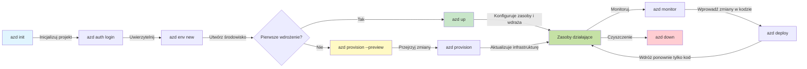
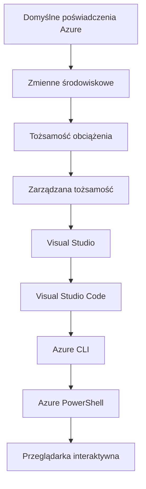

# AZD Basics - Zrozumienie Azure Developer CLI

# AZD Basics - Kluczowe koncepcje i podstawy

**Nawigacja po rozdziale:**
- **📚 Strona kursu**: [AZD Dla Początkujących](../../README.md)
- **📖 Bieżący rozdział**: Rozdział 1 - Podstawy i szybki start
- **⬅️ Poprzedni**: [Przegląd kursu](../../README.md#-chapter-1-foundation--quick-start)
- **➡️ Następny**: [Instalacja i konfiguracja](installation.md)
- **🚀 Następny rozdział**: [Rozdział 2: Rozwój z naciskiem na AI](../chapter-02-ai-development/microsoft-foundry-integration.md)

## Wprowadzenie

Ta lekcja wprowadza Azure Developer CLI (azd), potężne narzędzie wiersza poleceń, które przyspiesza Twoją drogę od lokalnego tworzenia do wdrożenia w Azure. Nauczysz się podstawowych koncepcji, głównych funkcji i zrozumiesz, jak azd upraszcza wdrażanie aplikacji natywnych dla chmury.

## Cele nauki

Do końca tej lekcji będziesz:
- Zrozumieć, czym jest Azure Developer CLI i jakie ma główne przeznaczenie
- Poznać podstawowe koncepcje szablonów, środowisk i usług
- Zbadać kluczowe funkcje, w tym rozwój oparty na szablonach i Infrastructure as Code
- Zrozumieć strukturę projektu azd i przepływ pracy
- Być przygotowanym do zainstalowania i skonfigurowania azd w swoim środowisku deweloperskim

## Efekty nauki

Po ukończeniu tej lekcji będziesz umiał:
- Wyjaśnić rolę azd we współczesnych przepływach pracy związanych z rozwojem chmurowym
- Zidentyfikować komponenty struktury projektu azd
- Opisać, jak szablony, środowiska i usługi współpracują ze sobą
- Zrozumieć korzyści płynące z użycia Infrastructure as Code z azd
- Rozpoznać różne polecenia azd i ich przeznaczenie

## Czym jest Azure Developer CLI (azd)?

Azure Developer CLI (azd) to narzędzie wiersza poleceń zaprojektowane, aby przyspieszyć proces od lokalnego tworzenia do wdrożenia w Azure. Upraszcza proces budowania, wdrażania i zarządzania aplikacjami natywnymi dla chmury na platformie Azure.

### 🎯 Dlaczego warto używać AZD? Porównanie praktyczne

Porównajmy wdrożenie prostej aplikacji sieciowej z bazą danych:

#### ❌ BEZ AZD: Ręczne wdrożenie w Azure (30+ minut)

```bash
# Krok 1: Utwórz grupę zasobów
az group create --name myapp-rg --location eastus

# Krok 2: Utwórz plan App Service
az appservice plan create --name myapp-plan \
  --resource-group myapp-rg \
  --sku B1 --is-linux

# Krok 3: Utwórz aplikację webową
az webapp create --name myapp-web-unique123 \
  --resource-group myapp-rg \
  --plan myapp-plan \
  --runtime "NODE:18-lts"

# Krok 4: Utwórz konto Cosmos DB (10-15 minut)
az cosmosdb create --name myapp-cosmos-unique123 \
  --resource-group myapp-rg \
  --kind MongoDB

# Krok 5: Utwórz bazę danych
az cosmosdb mongodb database create \
  --account-name myapp-cosmos-unique123 \
  --resource-group myapp-rg \
  --name tododb

# Krok 6: Utwórz kolekcję
az cosmosdb mongodb collection create \
  --account-name myapp-cosmos-unique123 \
  --resource-group myapp-rg \
  --database-name tododb \
  --name todos

# Krok 7: Pobierz ciąg połączenia
CONN_STR=$(az cosmosdb keys list \
  --name myapp-cosmos-unique123 \
  --resource-group myapp-rg \
  --type connection-strings \
  --query "connectionStrings[0].connectionString" -o tsv)

# Krok 8: Skonfiguruj ustawienia aplikacji
az webapp config appsettings set \
  --name myapp-web-unique123 \
  --resource-group myapp-rg \
  --settings MONGODB_URI="$CONN_STR"

# Krok 9: Włącz logowanie
az webapp log config --name myapp-web-unique123 \
  --resource-group myapp-rg \
  --application-logging filesystem \
  --detailed-error-messages true

# Krok 10: Skonfiguruj Application Insights
az monitor app-insights component create \
  --app myapp-insights \
  --location eastus \
  --resource-group myapp-rg

# Krok 11: Połącz Application Insights z aplikacją webową
INSTRUMENTATION_KEY=$(az monitor app-insights component show \
  --app myapp-insights \
  --resource-group myapp-rg \
  --query "instrumentationKey" -o tsv)

az webapp config appsettings set \
  --name myapp-web-unique123 \
  --resource-group myapp-rg \
  --settings APPINSIGHTS_INSTRUMENTATIONKEY="$INSTRUMENTATION_KEY"

# Krok 12: Zbuduj aplikację lokalnie
npm install
npm run build

# Krok 13: Utwórz pakiet wdrożeniowy
zip -r app.zip . -x "*.git*" "node_modules/*"

# Krok 14: Wdróż aplikację
az webapp deployment source config-zip \
  --resource-group myapp-rg \
  --name myapp-web-unique123 \
  --src app.zip

# Krok 15: Poczekaj i módl się, żeby to zadziałało 🙏
# (Brak automatycznej walidacji, wymagane testy ręczne)
```

**Problemy:**
- ❌ 15+ poleceń do zapamiętania i wykonania w określonej kolejności
- ❌ 30–45 minut ręcznej pracy
- ❌ Łatwo popełnić błędy (literówki, złe parametry)
- ❌ Ciągi połączeń ujawnione w historii terminala
- ❌ Brak automatycznego wycofania w razie awarii
- ❌ Trudne do odtworzenia dla członków zespołu
- ❌ Za każdym razem inne (nieodtwarzalne)

#### ✅ Z AZD: Zautomatyzowane wdrożenie (5 poleceń, 10-15 minut)

```bash
# Krok 1: Zainicjalizuj z szablonu
azd init --template todo-nodejs-mongo

# Krok 2: Uwierzytelnij się
azd auth login

# Krok 3: Utwórz środowisko
azd env new dev

# Krok 4: Podejrzyj zmiany (opcjonalne, ale zalecane)
azd provision --preview

# Krok 5: Wdróż wszystko
azd up

# ✨ Gotowe! Wszystko zostało wdrożone, skonfigurowane i monitorowane
```

**Korzyści:**
- ✅ **5 poleceń** vs. 15+ ręcznych kroków
- ✅ **10-15 minut** łącznego czasu (głównie oczekiwanie na Azure)
- ✅ **Zero błędów** - zautomatyzowane i przetestowane
- ✅ **Sekrety zarządzane bezpiecznie** za pomocą Key Vault
- ✅ **Automatyczne wycofanie** przy awariach
- ✅ **W pełni odtwarzalne** - ten sam wynik za każdym razem
- ✅ **Gotowe dla zespołu** - każdy może wdrożyć używając tych samych poleceń
- ✅ **Infrastructure as Code** - szablony Bicep kontrolowane w wersjach
- ✅ **Wbudowany monitoring** - Application Insights skonfigurowany automatycznie

### 📊 Skrócenie czasu i zmniejszenie błędów

| Metryka | Ręczne wdrożenie | Wdrożenie z AZD | Ulepszenie |
|:-------|:------------------|:---------------|:------------|
| **Polecenia** | 15+ | 5 | 67% mniej |
| **Czas** | 30-45 min | 10-15 min | 60% szybciej |
| **Wskaźnik błędów** | ~40% | <5% | 88% zmniejszenie |
| **Spójność** | Niska (ręczne) | 100% (zautomatyzowane) | Perfekcyjna |
| **Wprowadzenie zespołu** | 2-4 godziny | 30 minut | 75% szybciej |
| **Czas wycofania** | 30+ min (ręczne) | 2 min (zautomatyzowane) | 93% szybciej |

## Kluczowe koncepcje

### Szablony
Szablony są fundamentem azd. Zawierają:
- **Kod aplikacji** - Twój kod źródłowy i zależności
- **Definicje infrastruktury** - zasoby Azure zdefiniowane w Bicep lub Terraform
- **Pliki konfiguracyjne** - ustawienia i zmienne środowiskowe
- **Skrypty wdrożeniowe** - zautomatyzowane procesy wdrożeniowe

### Środowiska
Środowiska reprezentują różne cele wdrożenia:
- **Development** - Do testów i rozwoju
- **Staging** - Środowisko przedprodukcyjne
- **Production** - Środowisko produkcyjne

Każde środowisko utrzymuje własne:
- Azure resource group
- Configuration settings
- Deployment state

### Usługi
Usługi są elementami składowymi Twojej aplikacji:
- **Frontend** - aplikacje sieciowe, SPA
- **Backend** - API, mikroserwisy
- **Baza danych** - rozwiązania do przechowywania danych
- **Storage** - przechowywanie plików i blobów

## Kluczowe funkcje

### 1. Rozwój oparty na szablonach
```bash
# Przeglądaj dostępne szablony
azd template list

# Zainicjalizuj z szablonu
azd init --template <template-name>
```

### 2. Infrastruktura jako kod
- **Bicep** - język specyficzny dla platformy Azure
- **Terraform** - narzędzie infrastrukturalne wielochmurowe
- **ARM Templates** - szablony Azure Resource Manager

### 3. Zintegrowane przepływy pracy
```bash
# Pełny proces wdrożenia
azd up            # Provision + Deploy — bezobsługowe rozwiązanie do konfiguracji początkowej

# 🧪 NOWOŚĆ: Podejrzyj zmiany w infrastrukturze przed wdrożeniem (BEZPIECZNE)
azd provision --preview    # Symuluj wdrożenie infrastruktury bez wprowadzania zmian

azd provision     # Utwórz zasoby Azure; jeśli aktualizujesz infrastrukturę, użyj tego
azd deploy        # Wdróż kod aplikacji lub wdroż go ponownie po aktualizacji
azd down          # Usuń zasoby
```

#### 🛡️ Bezpieczne planowanie infrastruktury z podglądem
Polecenie `azd provision --preview` to przełomowe rozwiązanie dla bezpiecznych wdrożeń:
- **Analiza próby (dry-run)** - pokazuje, co zostanie utworzone, zmodyfikowane lub usunięte
- **Brak ryzyka** - żadne rzeczywiste zmiany nie są wprowadzane w Twoim środowisku Azure
- **Współpraca zespołowa** - dzielenie się wynikami podglądu przed wdrożeniem
- **Szacowanie kosztów** - zrozumienie kosztów zasobów przed podjęciem zobowiązania

```bash
# Przykładowy przebieg podglądu
azd provision --preview           # Zobacz, co się zmieni
# Przejrzyj wynik, omów z zespołem
azd provision                     # Wprowadzaj zmiany z pewnością
```

### 📊 Wizualizacja: Przepływ pracy AZD


**Wyjaśnienie przepływu pracy:**
1. **Init** - Zacznij od szablonu lub nowego projektu
2. **Auth** - Uwierzytelnij się w Azure
3. **Environment** - Utwórz izolowane środowisko wdrożeniowe
4. **Preview** - 🆕 Zawsze najpierw podglądaj zmiany infrastruktury (bezpieczna praktyka)
5. **Provision** - Twórz/aktualizuj zasoby Azure
6. **Deploy** - Wdróż kod aplikacji
7. **Monitor** - Obserwuj wydajność aplikacji
8. **Iterate** - Wprowadzaj zmiany i ponownie wdrażaj kod
9. **Cleanup** - Usuń zasoby po zakończeniu

### 4. Zarządzanie środowiskami
```bash
# Twórz i zarządzaj środowiskami
azd env new <environment-name>
azd env select <environment-name>
azd env list
```

## 📁 Struktura projektu

Typowa struktura projektu azd:
```
my-app/
├── .azd/                    # azd configuration
│   └── config.json
├── .azure/                  # Azure deployment artifacts
├── .devcontainer/          # Development container config
├── .github/workflows/      # GitHub Actions
├── .vscode/               # VS Code settings
├── infra/                 # Infrastructure code
│   ├── main.bicep        # Main infrastructure template
│   ├── main.parameters.json
│   └── modules/          # Reusable modules
├── src/                  # Application source code
│   ├── api/             # Backend services
│   └── web/             # Frontend application
├── azure.yaml           # azd project configuration
└── README.md
```

## 🔧 Pliki konfiguracyjne

### azure.yaml
Główny plik konfiguracyjny projektu:
```yaml
name: my-awesome-app
metadata:
  template: my-template@1.0.0

services:
  web:
    project: ./src/web
    language: js
    host: appservice
  api:
    project: ./src/api
    language: js
    host: appservice

hooks:
  preprovision:
    shell: pwsh
    run: echo "Preparing to provision..."
```

### .azure/config.json
Konfiguracja specyficzna dla środowiska:
```json
{
  "version": 1,
  "defaultEnvironment": "dev",
  "environments": {
    "dev": {
      "subscriptionId": "your-subscription-id",
      "location": "eastus"
    }
  }
}
```

## 🎪 Typowe przepływy pracy z ćwiczeniami praktycznymi

> **💡 Wskazówka:** Wykonuj te ćwiczenia w kolejności, aby stopniowo rozwijać umiejętności związane z AZD.

### 🎯 Ćwiczenie 1: Zainicjalizuj swój pierwszy projekt

**Cel:** Utwórz projekt AZD i zbadaj jego strukturę

**Kroki:**
```bash
# Użyj sprawdzonego szablonu
azd init --template todo-nodejs-mongo

# Przejrzyj wygenerowane pliki
ls -la  # Wyświetl wszystkie pliki, w tym ukryte

# Utworzone kluczowe pliki:
# - azure.yaml (główna konfiguracja)
# - infra/ (kod infrastruktury)
# - src/ (kod aplikacji)
```

**✅ Sukces:** Masz azure.yaml, infra/ i src/

---

### 🎯 Ćwiczenie 2: Wdróż do Azure

**Cel:** Kompleksowe wdrożenie end-to-end

**Kroki:**
```bash
# 1. Uwierzytelnij się
az login && azd auth login

# 2. Utwórz środowisko
azd env new dev
azd env set AZURE_LOCATION eastus

# 3. Podejrzyj zmiany (ZALECANE)
azd provision --preview

# 4. Wdróż wszystko
azd up

# 5. Zweryfikuj wdrożenie
azd show    # Wyświetl adres URL swojej aplikacji
```

**Oczekiwany czas:** 10-15 minut  
**✅ Sukces:** URL aplikacji otwiera się w przeglądarce

---

### 🎯 Ćwiczenie 3: Wiele środowisk

**Cel:** Wdrożenie do dev i staging

**Kroki:**
```bash
# Dev już istnieje, utwórz staging
azd env new staging
azd env set AZURE_LOCATION westus2
azd up

# Przełączaj się między nimi
azd env list
azd env select dev
```

**✅ Sukces:** Dwie oddzielne grupy zasobów w Azure Portal

---

### 🛡️ Czyszczenie: `azd down --force --purge`

Gdy musisz całkowicie zresetować:

```bash
azd down --force --purge
```

**Co robi:**
- `--force`: Brak monitów o potwierdzenie
- `--purge`: Usuwa cały stan lokalny i zasoby Azure

**Użyj gdy:**
- Wdrożenie zakończyło się niepowodzeniem w połowie
- Zmiana projektów
- Potrzebujesz świeżego startu

---

## 🎪 Oryginalny schemat przepływu pracy

### Rozpoczynanie nowego projektu
```bash
# Metoda 1: Użyj istniejącego szablonu
azd init --template todo-nodejs-mongo

# Metoda 2: Zacznij od zera
azd init

# Metoda 3: Użyj bieżącego katalogu
azd init .
```

### Cykl rozwoju
```bash
# Skonfiguruj środowisko deweloperskie
azd auth login
azd env new dev
azd env select dev

# Wdróż wszystko
azd up

# Wprowadź zmiany i wdroż ponownie
azd deploy

# Posprzątaj po zakończeniu
azd down --force --purge # polecenie w Azure Developer CLI jest **twardym resetem** dla twojego środowiska—szczególnie przydatne, gdy rozwiązujesz problemy z nieudanymi wdrożeniami, usuwasz porzucone zasoby lub przygotowujesz się do ponownego, czystego wdrożenia.
```

## Zrozumienie `azd down --force --purge`
Polecenie `azd down --force --purge` to potężny sposób na całkowite zniszczenie środowiska azd i wszystkich powiązanych zasobów. Oto rozbicie, co robi każdy z parametrów:
```
--force
```
- Pomija monity o potwierdzenie.
- Przydatne do automatyzacji lub skryptów, gdzie ręczne wprowadzanie nie jest możliwe.
- Zapewnia, że rozbiórka przebiega bez przerwań, nawet jeśli CLI wykryje niespójności.

```
--purge
```
Usuwa **wszystkie powiązane metadane**, w tym:
- Stan środowiska
- Lokalny folder `.azure`
- Zbuforowane informacje o wdrożeniu
Uniemożliwia azd „zapamiętywanie” poprzednich wdrożeń, co może powodować problemy, takie jak niezgodności grup zasobów lub przestarzałe odniesienia do rejestru.


### Dlaczego używać obu?
Gdy utkniesz z `azd up` z powodu zalegającego stanu lub częściowych wdrożeń, to połączenie zapewnia **czysty start**.

Jest szczególnie przydatne po ręcznym usunięciu zasobów w portalu Azure lub przy zmianie szablonów, środowisk lub konwencji nazywania grup zasobów.


### Zarządzanie wieloma środowiskami
```bash
# Utwórz środowisko staging
azd env new staging
azd env select staging
azd up

# Przełącz z powrotem na dev
azd env select dev

# Porównaj środowiska
azd env list
```

## 🔐 Uwierzytelnianie i poświadczenia

Zrozumienie uwierzytelniania jest kluczowe dla udanych wdrożeń azd. Azure używa wielu metod uwierzytelniania, a azd korzysta z tego samego łańcucha poświadczeń, co inne narzędzia Azure.

### Uwierzytelnianie Azure CLI (`az login`)

Zanim użyjesz azd, musisz się uwierzytelnić w Azure. Najczęstszą metodą jest użycie Azure CLI:

```bash
# Logowanie interaktywne (otwiera przeglądarkę)
az login

# Logowanie przy użyciu określonego dzierżawcy
az login --tenant <tenant-id>

# Logowanie przy użyciu konta usługi
az login --service-principal -u <app-id> -p <password> --tenant <tenant-id>

# Sprawdź aktualny stan logowania
az account show

# Wyświetl dostępne subskrypcje
az account list --output table

# Ustaw domyślną subskrypcję
az account set --subscription <subscription-id>
```

### Przepływ uwierzytelniania
1. **Interaktywne logowanie**: Otwiera domyślną przeglądarkę do uwierzytelnienia
2. **Device Code Flow**: Dla środowisk bez dostępu do przeglądarki
3. **Service Principal**: Dla automatyzacji i scenariuszy CI/CD
4. **Managed Identity**: Dla aplikacji hostowanych w Azure

### Łańcuch DefaultAzureCredential

`DefaultAzureCredential` to typ poświadczeń, który zapewnia uproszczone doświadczenie uwierzytelniania, automatycznie próbując kilka źródeł poświadczeń w określonej kolejności:

#### Kolejność łańcucha poświadczeń

#### 1. Zmienne środowiskowe
```bash
# Ustaw zmienne środowiskowe dla konta usługi
export AZURE_CLIENT_ID="<app-id>"
export AZURE_CLIENT_SECRET="<password>"
export AZURE_TENANT_ID="<tenant-id>"
```

#### 2. Workload Identity (Kubernetes/GitHub Actions)
Używane automatycznie w:
- Azure Kubernetes Service (AKS) z Workload Identity
- GitHub Actions z federacją OIDC
- Inne scenariusze tożsamości federowanej

#### 3. Managed Identity
Dla zasobów Azure takich jak:
- Maszyny wirtualne
- App Service
- Azure Functions
- Instancje kontenerów

```bash
# Sprawdź, czy działa na zasobie Azure z zarządzaną tożsamością
az account show --query "user.type" --output tsv
# Zwraca: "servicePrincipal" jeśli używana jest zarządzana tożsamość
```

#### 4. Integracja z narzędziami deweloperskimi
- **Visual Studio**: automatycznie używa zalogowanego konta
- **VS Code**: używa poświadczeń rozszerzenia Azure Account
- **Azure CLI**: używa poświadczeń z `az login` (najczęstsze w rozwoju lokalnym)

### Konfiguracja uwierzytelniania w AZD

```bash
# Metoda 1: Użyj Azure CLI (zalecane w środowisku deweloperskim)
az login
azd auth login  # Używa istniejących poświadczeń Azure CLI

# Metoda 2: Bezpośrednie uwierzytelnianie azd
azd auth login --use-device-code  # Dla środowisk bez interfejsu graficznego

# Metoda 3: Sprawdź status uwierzytelniania
azd auth login --check-status

# Metoda 4: Wyloguj się i zaloguj ponownie
azd auth logout
azd auth login
```

### Najlepsze praktyki uwierzytelniania

#### Dla rozwoju lokalnego
```bash
# 1. Zaloguj się za pomocą Azure CLI
az login

# 2. Zweryfikuj poprawną subskrypcję
az account show
az account set --subscription "Your Subscription Name"

# 3. Użyj azd z istniejącymi poświadczeniami
azd auth login
```

#### Dla potoków CI/CD
```yaml
# GitHub Actions example
- name: Azure Login
  uses: azure/login@v1
  with:
    creds: ${{ secrets.AZURE_CREDENTIALS }}

- name: Deploy with azd
  run: |
    azd auth login --client-id ${{ secrets.AZURE_CLIENT_ID }} \
                    --client-secret ${{ secrets.AZURE_CLIENT_SECRET }} \
                    --tenant-id ${{ secrets.AZURE_TENANT_ID }}
    azd up --no-prompt
```

#### Dla środowisk produkcyjnych
- Używaj **Managed Identity** podczas uruchamiania na zasobach Azure
- Używaj **Service Principal** do scenariuszy automatyzacji
- Unikaj przechowywania poświadczeń w kodzie lub plikach konfiguracyjnych
- Używaj **Azure Key Vault** do wrażliwej konfiguracji

### Częste problemy z uwierzytelnianiem i rozwiązania

#### Problem: "No subscription found"
```bash
# Rozwiązanie: Ustaw domyślną subskrypcję
az account list --output table
az account set --subscription "<subscription-id>"
azd env set AZURE_SUBSCRIPTION_ID "<subscription-id>"
```

#### Problem: "Insufficient permissions"
```bash
# Rozwiązanie: Sprawdź i przypisz wymagane role
az role assignment list --assignee $(az account show --query user.name --output tsv)

# Najczęściej wymagane role:
# - Contributor (do zarządzania zasobami)
# - User Access Administrator (do przypisywania ról)
```

#### Problem: "Token expired"
```bash
# Rozwiązanie: Ponowne uwierzytelnienie
az logout
az login
azd auth logout
azd auth login
```

### Uwierzytelnianie w różnych scenariuszach

#### Rozwój lokalny
```bash
# Konto rozwoju osobistego
az login
azd auth login
```

#### Praca zespołowa
```bash
# Użyj konkretnego dzierżawcy dla organizacji
az login --tenant contoso.onmicrosoft.com
azd auth login
```

#### Scenariusze wielotenantowe
```bash
# Przełączaj między najemcami
az login --tenant tenant1.onmicrosoft.com
# Wdróż do najemcy 1
azd up

az login --tenant tenant2.onmicrosoft.com  
# Wdróż do najemcy 2
azd up
```

### Aspekty bezpieczeństwa

1. **Przechowywanie poświadczeń**: Nigdy nie przechowuj poświadczeń w kodzie źródłowym
2. **Ograniczanie zakresu uprawnień**: Stosuj zasadę najmniejszych uprawnień dla service principals
3. **Rotacja tokenów**: Regularnie rotuj sekrety service principali
4. **Ścieżka audytu**: Monitoruj działania związane z uwierzytelnianiem i wdrożeniami
5. **Bezpieczeństwo sieci**: Używaj prywatnych punktów końcowych, gdy to możliwe

### Rozwiązywanie problemów z uwierzytelnianiem

```bash
# Debugowanie problemów z uwierzytelnianiem
azd auth login --check-status
az account show
az account get-access-token

# Typowe polecenia diagnostyczne
whoami                          # Bieżący kontekst użytkownika
az ad signed-in-user show      # Szczegóły użytkownika Azure AD
az group list                  # Test dostępu do zasobów
```

## Zrozumienie `azd down --force --purge`

### Odkrywanie
```bash
azd template list              # Przeglądaj szablony
azd template show <template>   # Szczegóły szablonu
azd init --help               # Opcje inicjalizacji
```

### Zarządzanie projektem
```bash
azd show                     # Przegląd projektu
azd env show                 # Aktualne środowisko
azd config list             # Ustawienia konfiguracji
```

### Monitorowanie
```bash
azd monitor                  # Otwórz monitorowanie w portalu Azure
azd monitor --logs           # Wyświetl dzienniki aplikacji
azd monitor --live           # Wyświetl metryki na żywo
azd pipeline config          # Skonfiguruj CI/CD
```

## Najlepsze praktyki

### 1. Używaj znaczących nazw
```bash
# Dobry
azd env new production-east
azd init --template web-app-secure

# Unikać
azd env new env1
azd init --template template1
```

### 2. Wykorzystuj szablony
- Zacznij od istniejących szablonów
- Dostosuj do swoich potrzeb
- Twórz wielokrotnego użytku szablony dla swojej organizacji

### 3. Izolacja środowisk
- Używaj oddzielnych środowisk dla dev/staging/prod
- Nigdy nie wdrażaj bezpośrednio na produkcję z maszyny lokalnej
- Używaj potoków CI/CD do wdrożeń produkcyjnych

### 4. Zarządzanie konfiguracją
- Używaj zmiennych środowiskowych dla danych wrażliwych
- Przechowuj konfigurację w kontroli wersji
- Dokumentuj ustawienia specyficzne dla środowiska

## Postęp nauki

### Początkujący (Tydzień 1-2)
1. Zainstaluj azd i uwierzytelnij się
2. Wdróż prosty szablon
3. Zrozum strukturę projektu
4. Poznaj podstawowe polecenia (up, down, deploy)

### Średniozaawansowany (Tydzień 3-4)
1. Dostosuj szablony
2. Zarządzaj wieloma środowiskami
3. Zrozum kod infrastruktury
4. Skonfiguruj potoki CI/CD

### Zaawansowany (Tydzień 5+)
1. Twórz niestandardowe szablony
2. Zaawansowane wzorce infrastruktury
3. Wdrożenia wieloregionalne
4. Konfiguracje klasy korporacyjnej

## Kolejne kroki

**📖 Kontynuuj naukę rozdziału 1:**
- [Instalacja i konfiguracja](installation.md) - Zainstaluj i skonfiguruj azd
- [Twój pierwszy projekt](first-project.md) - Kompletny praktyczny samouczek
- [Przewodnik po konfiguracji](configuration.md) - Zaawansowane opcje konfiguracji

**🎯 Gotowy na następny rozdział?**
- [Rozdział 2: Rozwój ukierunkowany na AI](../chapter-02-ai-development/microsoft-foundry-integration.md) - Zacznij budować aplikacje AI

## Dodatkowe zasoby

- [Przegląd Azure Developer CLI](https://learn.microsoft.com/en-us/azure/developer/azure-developer-cli/)
- [Galeria szablonów](https://azure.github.io/awesome-azd/)
- [Przykłady społeczności](https://github.com/Azure-Samples)

---

## 🙋 Najczęściej zadawane pytania

### Ogólne pytania

**Q: Jaka jest różnica między AZD a Azure CLI?**

A: Azure CLI (`az`) służy do zarządzania pojedynczymi zasobami Azure. AZD (`azd`) służy do zarządzania całymi aplikacjami:

```bash
# Azure CLI - zarządzanie zasobami niskiego poziomu
az webapp create --name myapp --resource-group rg
az sql server create --name myserver --resource-group rg
# ...potrzeba znacznie więcej poleceń

# AZD - zarządzanie na poziomie aplikacji
azd up  # Wdraża całą aplikację wraz ze wszystkimi zasobami
```

**Pomyśl o tym w ten sposób:**
- `az` = Operowanie pojedynczymi klockami Lego
- `azd` = Praca z kompletnymi zestawami Lego

---

**Q: Czy muszę znać Bicep lub Terraform, aby używać AZD?**

A: Nie! Zacznij od szablonów:
```bash
# Użyj istniejącego szablonu - nie jest wymagana znajomość IaC
azd init --template todo-nodejs-mongo
azd up
```

Możesz później nauczyć się Bicep, aby dostosować infrastrukturę. Szablony dostarczają działających przykładów, z których możesz się uczyć.

---

**Q: Ile kosztuje uruchomienie szablonów AZD?**

A: Koszty zależą od szablonu. Większość szablonów deweloperskich kosztuje 50-150 USD/miesiąc:

```bash
# Podejrzyj koszty przed wdrożeniem
azd provision --preview

# Zawsze sprzątaj, gdy nie używasz
azd down --force --purge  # Usuwa wszystkie zasoby
```

**Przydatna wskazówka:** Korzystaj z darmowych poziomów tam, gdzie to możliwe:
- App Service: warstwa F1 (darmowa)
- Azure OpenAI: 50,000 tokenów/miesiąc za darmo
- Cosmos DB: warstwa 1000 RU/s (darmowa)

---

**Q: Czy mogę używać AZD z istniejącymi zasobami Azure?**

A: Tak, ale łatwiej jest zacząć od nowa. AZD działa najlepiej, gdy zarządza pełnym cyklem życia. Dla istniejących zasobów:
```bash
# Opcja 1: Importuj istniejące zasoby (zaawansowane)
azd init
# Następnie zmodyfikuj infra/, aby odwoływać się do istniejących zasobów

# Opcja 2: Zacznij od nowa (zalecane)
azd init --template matching-your-stack
azd up  # Tworzy nowe środowisko
```

---

**Q: Jak udostępnić mój projekt współpracownikom?**

A: Zacommituj projekt AZD do Gita (ale NIE folderu .azure):
```bash
# Już domyślnie w .gitignore
.azure/        # Zawiera sekrety i dane środowiskowe
*.env          # Zmienne środowiskowe

# Członkowie zespołu wtedy:
git clone <your-repo>
azd auth login
azd env new <their-name>-dev
azd up
```

Wszyscy otrzymują identyczną infrastrukturę z tych samych szablonów.

---

### Pytania dotyczące rozwiązywania problemów

**Q: "azd up" nie powiodło się w połowie. Co zrobić?**

A: Sprawdź błąd, napraw go, a następnie spróbuj ponownie:
```bash
# Wyświetl szczegółowe logi
azd show

# Typowe rozwiązania:

# 1. Jeśli przekroczono limit:
azd env set AZURE_LOCATION "westus2"  # Spróbuj innego regionu

# 2. Jeśli konflikt nazwy zasobu:
azd down --force --purge  # Rozpocznij od nowa
azd up  # Spróbuj ponownie

# 3. Jeśli uwierzytelnienie wygasło:
az login
azd auth login
azd up
```

**Najczęstszy problem:** Wybrano niewłaściwą subskrypcję Azure
```bash
az account list --output table
az account set --subscription "<correct-subscription>"
```

---

**Q: Jak wdrożyć tylko zmiany w kodzie bez ponownego tworzenia infrastruktury?**

A: Użyj `azd deploy` zamiast `azd up`:
```bash
azd up          # Po raz pierwszy: przygotowanie zasobów + wdrożenie (wolne)

# Wprowadź zmiany w kodzie...

azd deploy      # Kolejne razy: tylko wdrożenie (szybkie)
```

Porównanie czasu:
- `azd up`: 10-15 minut (tworzy infrastrukturę)
- `azd deploy`: 2-5 minut (tylko kod)

---

**Q: Czy mogę dostosować szablony infrastruktury?**

A: Tak! Edytuj pliki Bicep w `infra/`:
```bash
# Po wykonaniu azd init
cd infra/
code main.bicep  # Edytuj w VS Code

# Podgląd zmian
azd provision --preview

# Zastosuj zmiany
azd provision
```

**Wskazówka:** Zacznij od małych zmian - zmień najpierw SKU:
```bicep
// infra/main.bicep
sku: {
  name: 'B1'  // Change to 'P1V2' for production
}
```

---

**Q: Jak usunąć wszystko, co utworzył AZD?**

A: Jedno polecenie usuwa wszystkie zasoby:
```bash
azd down --force --purge

# To usuwa:
# - Wszystkie zasoby Azure
# - Grupę zasobów
# - Lokalny stan środowiska
# - Zbuforowane dane wdrożenia
```

**Zawsze uruchamiaj to, gdy:**
- Gdy skończysz testować szablon
- Gdy przechodzisz do innego projektu
- Gdy chcesz zacząć od nowa

**Oszczędność kosztów:** Usuwanie nieużywanych zasobów = 0 USD opłat

---

**Q: Co zrobić, jeśli zasoby zostały przypadkowo usunięte w Azure Portal?**

A: Stan AZD może się rozjechać. Podejście 'czystego startu':
```bash
# 1. Usuń stan lokalny
azd down --force --purge

# 2. Zacznij od nowa
azd up

# Alternatywnie: Pozwól AZD wykryć i naprawić
azd provision  # Utworzy brakujące zasoby
```

---

### Zaawansowane pytania

**Q: Czy mogę używać AZD w potokach CI/CD?**

A: Tak! Przykład GitHub Actions:
```yaml
# .github/workflows/deploy.yml
name: Deploy with AZD

on:
  push:
    branches: [main]

jobs:
  deploy:
    runs-on: ubuntu-latest
    steps:
      - uses: actions/checkout@v2
      
      - name: Install azd
        run: curl -fsSL https://aka.ms/install-azd.sh | bash
      
      - name: Azure Login
        run: |
          azd auth login \
            --client-id ${{ secrets.AZURE_CLIENT_ID }} \
            --client-secret ${{ secrets.AZURE_CLIENT_SECRET }} \
            --tenant-id ${{ secrets.AZURE_TENANT_ID }}
      
      - name: Deploy
        run: azd up --no-prompt
```

---

**Q: Jak obsługiwać sekrety i dane wrażliwe?**

A: AZD integruje się z Azure Key Vault automatycznie:
```bash
# Sekrety są przechowywane w Key Vault, nie w kodzie
azd env set DATABASE_PASSWORD "$(openssl rand -base64 32)"

# AZD automatycznie:
# 1. Tworzy Key Vault
# 2. Przechowuje sekret
# 3. Przyznaje aplikacji dostęp za pomocą Managed Identity
# 4. Wstrzykuje w czasie wykonywania
```

**Nigdy nie commituj:**
- `.azure/` folder (zawiera dane środowiska)
- `.env` files (lokalne sekrety)
- ciągi połączeń

---

**Q: Czy mogę wdrożyć do wielu regionów?**

A: Tak, utwórz środowisko dla każdego regionu:
```bash
# Środowisko Wschodnich USA
azd env new prod-eastus
azd env set AZURE_LOCATION eastus
azd up

# Środowisko Zachodniej Europy
azd env new prod-westeurope
azd env set AZURE_LOCATION westeurope
azd up

# Każde środowisko jest niezależne
azd env list
```

Dla prawdziwych aplikacji wieloregionowych dostosuj szablony Bicep, aby wdrożyć do wielu regionów jednocześnie.

---

**Q: Gdzie mogę uzyskać pomoc, jeśli utknę?**

1. **Dokumentacja AZD:** https://learn.microsoft.com/azure/developer/azure-developer-cli/
2. **Zgłoszenia GitHub:** https://github.com/Azure/azure-dev/issues
3. **Discord:** [Azure Discord](https://discord.gg/microsoft-azure) - kanał #azure-developer-cli
4. **Stack Overflow:** tag `azure-developer-cli`
5. **Ten kurs:** [Przewodnik rozwiązywania problemów](../chapter-07-troubleshooting/common-issues.md)

**Przydatna wskazówka:** Zanim zapytasz, wykonaj:
```bash
azd show       # Pokazuje bieżący stan
azd version    # Pokazuje twoją wersję
```
Dołącz te informacje do swojego pytania, aby uzyskać szybszą pomoc.

---

## 🎓 Co dalej?

Teraz rozumiesz podstawy AZD. Wybierz swoją ścieżkę:

### 🎯 Dla początkujących:
1. **Dalej:** [Instalacja i konfiguracja](installation.md) - Zainstaluj AZD na swoim komputerze
2. **Następnie:** [Twój pierwszy projekt](first-project.md) - Wdróż swoją pierwszą aplikację
3. **Praktyka:** Wykonaj wszystkie 3 ćwiczenia w tej lekcji

### 🚀 Dla deweloperów AI:
1. **Przejdź do:** [Rozdział 2: Rozwój ukierunkowany na AI](../chapter-02-ai-development/microsoft-foundry-integration.md)
2. **Wdróż:** Zacznij od `azd init --template get-started-with-ai-chat`
3. **Ucz się:** Buduj podczas wdrażania

### 🏗️ Dla doświadczonych deweloperów:
1. **Przejrzyj:** [Przewodnik po konfiguracji](configuration.md) - Zaawansowane ustawienia
2. **Zbadaj:** [Infrastruktura jako kod](../chapter-04-infrastructure/provisioning.md) - Dogłębne omówienie Bicep
3. **Buduj:** Twórz niestandardowe szablony dla swojego stosu

---

**Nawigacja między rozdziałami:**
- **📚 Strona główna kursu**: [AZD dla początkujących](../../README.md)
- **📖 Aktualny rozdział**: Rozdział 1 - Podstawy i szybki start  
- **⬅️ Poprzedni**: [Przegląd kursu](../../README.md#-chapter-1-foundation--quick-start)
- **➡️ Następny**: [Instalacja i konfiguracja](installation.md)
- **🚀 Następny rozdział**: [Rozdział 2: Rozwój ukierunkowany na AI](../chapter-02-ai-development/microsoft-foundry-integration.md)

---

<!-- CO-OP TRANSLATOR DISCLAIMER START -->
Zastrzeżenie:
Niniejszy dokument został przetłumaczony przy użyciu usługi tłumaczenia AI Co-op Translator (https://github.com/Azure/co-op-translator). Chociaż dokładamy wszelkich starań, aby zapewnić dokładność tłumaczenia, prosimy pamiętać, że automatyczne przekłady mogą zawierać błędy lub nieścisłości. Oryginalny dokument w języku źródłowym należy traktować jako źródło autorytatywne. W przypadku informacji o istotnym znaczeniu zalecane jest skorzystanie z profesjonalnego tłumaczenia wykonanego przez człowieka. Nie ponosimy odpowiedzialności za jakiekolwiek nieporozumienia lub błędne interpretacje wynikające z użycia tego tłumaczenia.
<!-- CO-OP TRANSLATOR DISCLAIMER END -->