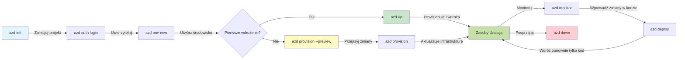
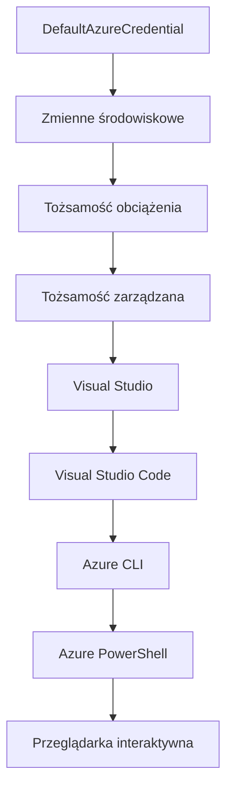

# AZD Basics - Zrozumienie Azure Developer CLI

# AZD Basics - Podstawowe Koncepcje i Fundamenty

**Nawigacja po rozdziale:**
- **📚 Strona kursu**: [AZD dla początkujących](../../README.md)
- **📖 Obecny rozdział**: Rozdział 1 - Fundamenty i szybki start
- **⬅️ Poprzedni**: [Przegląd kursu](../../README.md#-chapter-1-foundation--quick-start)
- **➡️ Następny**: [Instalacja i konfiguracja](installation.md)
- **🚀 Następny rozdział**: [Rozdział 2: Rozwój AI-First](../chapter-02-ai-development/microsoft-foundry-integration.md)

## Wprowadzenie

Ta lekcja wprowadza Cię do Azure Developer CLI (azd), potężnego narzędzia linii poleceń, które przyspiesza Twoją drogę od lokalnego rozwoju do wdrożenia w Azure. Poznasz podstawowe koncepcje, kluczowe funkcje i zrozumiesz, jak azd upraszcza wdrażanie aplikacji natywnych dla chmury.

## Cele nauki

Pod koniec tej lekcji będziesz:
- Rozumieć, czym jest Azure Developer CLI i jaki jest jego główny cel
- Poznasz podstawowe koncepcje szablonów, środowisk i usług
- Poznasz kluczowe funkcje, w tym rozwój oparty na szablonach i Infrastrukturę jako Kod
- Zrozumiesz strukturę projektu azd i przebieg pracy
- Będziesz przygotowany do instalacji i konfiguracji azd w swoim środowisku programistycznym

## Wyniki nauki

Po ukończeniu tej lekcji będziesz potrafił:
- Wyjaśnić rolę azd we współczesnych workflowach rozwoju chmurowego
- Zidentyfikować komponenty struktury projektu azd
- Opisać, jak szablony, środowiska i usługi współpracują ze sobą
- Zrozumieć korzyści płynące z Infrastrukturą jako Kod z azd
- Rozpoznać różne polecenia azd i ich przeznaczenie

## Czym jest Azure Developer CLI (azd)?

Azure Developer CLI (azd) to narzędzie wiersza poleceń zaprojektowane, aby przyspieszyć Twoją drogę od lokalnego rozwoju do wdrożenia w Azure. Upraszcza proces budowania, wdrażania i zarządzania aplikacjami chmurowymi native w Azure.

### Co możesz wdrożyć za pomocą azd?

azd obsługuje szeroki zakres obciążeń — i lista ta stale rośnie. Dziś możesz użyć azd do wdrożenia:

| Typ obciążenia | Przykłady | Ten sam przebieg pracy? |
|---------------|----------|----------------|
| **Tradycyjne aplikacje** | Aplikacje internetowe, REST API, witryny statyczne | ✅ `azd up` |
| **Usługi i mikrousługi** | Container Apps, Function Apps, wielousługowe backendy | ✅ `azd up` |
| **Aplikacje wykorzystujące AI** | Aplikacje czatu z Microsoft Foundry Models, rozwiązania RAG z AI Search | ✅ `azd up` |
| **Inteligentne agenty** | Agenty hostowane w Foundry, orkiestracje wieloagentowe | ✅ `azd up` |

Kluczowym spostrzeżeniem jest to, że **cykl życia azd pozostaje taki sam niezależnie od tego, co wdrażasz**. Inicjujesz projekt, tworzysz infrastrukturę, wdrażasz kod, monitorujesz aplikację i sprzątasz — czy to prosta strona internetowa, czy zaawansowany agent AI.

Ta ciągłość jest celowa. azd traktuje funkcje AI jako kolejny typ usługi, z której Twoja aplikacja może korzystać, a nie coś zasadniczo innego. Punkt końcowy czatu oparty na Microsoft Foundry Models jest, z perspektywy azd, po prostu kolejną usługą do skonfigurowania i wdrożenia.

### 🎯 Dlaczego warto używać AZD? Porównanie z rzeczywistością

Porównajmy wdrożenie prostej aplikacji webowej z bazą danych:

#### ❌ BEZ AZD: Ręczne wdrożenie Azure (30+ minut)

```bash
# Krok 1: Utwórz grupę zasobów
az group create --name myapp-rg --location eastus

# Krok 2: Utwórz plan usługi aplikacji
az appservice plan create --name myapp-plan \
  --resource-group myapp-rg \
  --sku B1 --is-linux

# Krok 3: Utwórz aplikację internetową
az webapp create --name myapp-web-unique123 \
  --resource-group myapp-rg \
  --plan myapp-plan \
  --runtime "NODE:18-lts"

# Krok 4: Utwórz konto Cosmos DB (10-15 minut)
az cosmosdb create --name myapp-cosmos-unique123 \
  --resource-group myapp-rg \
  --kind MongoDB

# Krok 5: Utwórz bazę danych
az cosmosdb mongodb database create \
  --account-name myapp-cosmos-unique123 \
  --resource-group myapp-rg \
  --name tododb

# Krok 6: Utwórz kolekcję
az cosmosdb mongodb collection create \
  --account-name myapp-cosmos-unique123 \
  --resource-group myapp-rg \
  --database-name tododb \
  --name todos

# Krok 7: Pobierz ciąg połączenia
CONN_STR=$(az cosmosdb keys list \
  --name myapp-cosmos-unique123 \
  --resource-group myapp-rg \
  --type connection-strings \
  --query "connectionStrings[0].connectionString" -o tsv)

# Krok 8: Skonfiguruj ustawienia aplikacji
az webapp config appsettings set \
  --name myapp-web-unique123 \
  --resource-group myapp-rg \
  --settings MONGODB_URI="$CONN_STR"

# Krok 9: Włącz logowanie
az webapp log config --name myapp-web-unique123 \
  --resource-group myapp-rg \
  --application-logging filesystem \
  --detailed-error-messages true

# Krok 10: Skonfiguruj Application Insights
az monitor app-insights component create \
  --app myapp-insights \
  --location eastus \
  --resource-group myapp-rg

# Krok 11: Połącz Application Insights z aplikacją internetową
INSTRUMENTATION_KEY=$(az monitor app-insights component show \
  --app myapp-insights \
  --resource-group myapp-rg \
  --query "instrumentationKey" -o tsv)

az webapp config appsettings set \
  --name myapp-web-unique123 \
  --resource-group myapp-rg \
  --settings APPINSIGHTS_INSTRUMENTATIONKEY="$INSTRUMENTATION_KEY"

# Krok 12: Zbuduj aplikację lokalnie
npm install
npm run build

# Krok 13: Utwórz pakiet wdrożeniowy
zip -r app.zip . -x "*.git*" "node_modules/*"

# Krok 14: Wdróż aplikację
az webapp deployment source config-zip \
  --resource-group myapp-rg \
  --name myapp-web-unique123 \
  --src app.zip

# Krok 15: Poczekaj i módl się, aby zadziałało 🙏
# (Brak automatycznej walidacji, wymaga testów ręcznych)
```

**Problemy:**
- ❌ Ponad 15 poleceń do zapamiętania i wykonania w odpowiedniej kolejności
- ❌ 30-45 minut ręcznej pracy
- ❌ Łatwo o błędy (literówki, złe parametry)
- ❌ Łańcuchy połączeń widoczne w historii terminala
- ❌ Brak automatycznego cofania w razie błędu
- ❌ Trudne do odtworzenia przez członków zespołu
- ❌ Za każdym razem różne (niepowtarzalne)

#### ✅ Z AZD: Zautomatyzowane wdrożenie (5 poleceń, 10-15 minut)

```bash
# Krok 1: Inicjalizacja z szablonu
azd init --template todo-nodejs-mongo

# Krok 2: Uwierzetylnianie
azd auth login

# Krok 3: Utwórz środowisko
azd env new dev

# Krok 4: Podgląd zmian (opcjonalne, ale zalecane)
azd provision --preview

# Krok 5: Wdróż wszystko
azd up

# ✨ Gotowe! Wszystko zostało wdrożone, skonfigurowane i monitorowane
```

**Korzyści:**
- ✅ **5 poleceń** vs. ponad 15 ręcznych kroków
- ✅ **10-15 minut** całkowitego czasu (głównie oczekiwanie na Azure)
- ✅ **Mniej błędów manualnych** — spójny przebieg pracy oparty na szablonach
- ✅ **Bezpieczne zarządzanie sekretami** — wiele szablonów korzysta z Azure-managed secret storage
- ✅ **Powtarzalne wdrożenia** — ten sam przebieg pracy za każdym razem
- ✅ **W pełni odtwarzalne** — taki sam rezultat za każdym razem
- ✅ **Przygotowane dla zespołu** — każdy może wdrożyć za pomocą tych samych poleceń
- ✅ **Infrastruktura jako Kod** — kontrolowane wersjonowanie szablonów Bicep
- ✅ **Wbudowany monitoring** — automatycznie skonfigurowany Application Insights

### 📊 Redukcja czasu i błędów

| Metryka | Ręczne wdrożenie | Wdrożenie AZD | Poprawa |
|:-------|:------------------|:---------------|:------------|
| **Polecenia** | 15+ | 5 | 67% mniej |
| **Czas** | 30-45 min | 10-15 min | 60% szybciej |
| **Wskaźnik błędów** | ~40% | <5% | 88% redukcji |
| **Spójność** | Niska (manualne) | 100% (automatyczne) | Idealna |
| **Wprowadzenie zespołu** | 2-4 godziny | 30 minut | 75% szybciej |
| **Czas cofania** | 30+ min (manualne) | 2 min (automatyczne) | 93% szybciej |

## Podstawowe koncepcje

### Szablony
Szablony są fundamentem azd. Zawierają:
- **Kod aplikacji** - Twój kod źródłowy i zależności
- **Definicje infrastruktury** - Zasoby Azure zdefiniowane w Bicep lub Terraform
- **Pliki konfiguracyjne** - Ustawienia i zmienne środowiskowe
- **Skrypty wdrożeniowe** - Zautomatyzowane workflowy wdrożeniowe

### Środowiska
Środowiska reprezentują różne cele wdrożeniowe:
- **Development** - Do testowania i rozwoju
- **Staging** - Środowisko przedprodukcyjne
- **Production** - Żywe środowisko produkcyjne

Każde środowisko posiada własne:
- Grupa zasobów Azure
- Ustawienia konfiguracji
- Stan wdrożenia

### Usługi
Usługi to budulce Twojej aplikacji:
- **Frontend** - Aplikacje webowe, SPA
- **Backend** - API, mikrousługi
- **Baza danych** - Rozwiązania do przechowywania danych
- **Storage** - Przechowywanie plików i blobów

## Kluczowe funkcje

### 1. Rozwój oparty na szablonach
```bash
# Przeglądaj dostępne szablony
azd template list

# Inicjalizuj z szablonu
azd init --template <template-name>
```

### 2. Infrastruktura jako Kod
- **Bicep** - Dedykowany język Azure
- **Terraform** - Narzędzie multi-cloud do zarządzania infrastrukturą
- **ARM Templates** - Szablony Azure Resource Manager

### 3. Zintegrowane workflowy
```bash
# Kompletny proces wdrożenia
azd up            # Provision + Deploy to automatyczne działanie przy pierwszej konfiguracji

# 🧪 NOWOŚĆ: Podgląd zmian infrastruktury przed wdrożeniem (BEZPIECZNE)
azd provision --preview    # Symuluj wdrożenie infrastruktury bez dokonywania zmian

azd provision     # Twórz zasoby Azure, jeśli aktualizujesz infrastrukturę, użyj tego
azd deploy        # Wdróż kod aplikacji lub wdroż ponownie kod aplikacji po aktualizacji
azd down          # Sprzątaj zasoby
```

#### 🛡️ Bezpieczne planowanie infrastruktury z podglądem
Polecenie `azd provision --preview` to przełom w bezpiecznych wdrożeniach:
- **Symulacja** - Pokazuje, co zostanie utworzone, zmodyfikowane lub usunięte
- **Zero ryzyka** - Żadne zmiany nie są faktycznie wprowadzane w środowisku Azure
- **Współpraca zespołowa** - Możliwość dzielenia się wynikami podglądu przed wdrożeniem
- **Szacowanie kosztów** - Zrozumienie kosztów zasobów przed zaangażowaniem

```bash
# Przykładowy podgląd przepływu pracy
azd provision --preview           # Zobacz, co się zmieni
# Przejrzyj wynik, omów z zespołem
azd provision                     # Zastosuj zmiany pewnie
```

### 📊 Wizualizacja: Workflow rozwoju AZD



**Wyjaśnienie workflow:**
1. **Init** - Zacznij od szablonu lub nowego projektu
2. **Auth** - Uwierzytelnij się w Azure
3. **Environment** - Utwórz izolowane środowisko wdrożeniowe
4. **Preview** - 🆕 Zawsze najpierw podglądaj zmiany infrastruktury (bezpieczne podejście)
5. **Provision** - Twórz/aktualizuj zasoby Azure
6. **Deploy** - Wypchnij kod aplikacji
7. **Monitor** - Obserwuj działanie aplikacji
8. **Iterate** - Wprowadzaj zmiany i ponownie wdrażaj kod
9. **Cleanup** - Usuń zasoby po zakończeniu

### 4. Zarządzanie środowiskami
```bash
# Twórz i zarządzaj środowiskami
azd env new <environment-name>
azd env select <environment-name>
azd env list
```

### 5. Rozszerzenia i polecenia AI

azd korzysta z systemu rozszerzeń, aby dodać możliwości wykraczające poza podstawową funkcjonalność CLI. Jest to szczególnie użyteczne dla obciążeń AI:

```bash
# Wyświetl dostępne rozszerzenia
azd extension list

# Zainstaluj rozszerzenie agentów Foundry
azd extension install azure.ai.agents

# Zainicjuj projekt agenta AI na podstawie manifestu
azd ai agent init -m agent-manifest.yaml

# Przetestuj wdrożonego agenta (pokazuje opóźnienie i czas do pierwszego bajtu)
azd ai agent invoke

# Uruchom serwer MCP do rozwoju wspomaganego AI (Alpha)
azd mcp start
```

**Cykl życia agenta, krok po kroku.** Po zainstalowaniu `azure.ai.agents`, jeden workflow prowadzi Cię od pomysłu do działającego, monitorowanego agenta. Nie musisz od razu znać wszystkich tych poleceń — po prostu wiedz, że istnieją:

| Etap | Polecenie | Co robi |
|-------|---------|--------------|
| **Scaffold** | `azd ai agent init -m <manifest>` | Generuje projekt agenta na podstawie manifestu |
| **Test** | `azd ai agent invoke` | Wywołuje agenta i wyświetla czas odpowiedzi |
| **Measure** | `azd ai agent eval generate` | Tworzy zestaw danych ewaluacyjnych dla agenta |
| **Improve** | `azd ai agent optimize` | Optymalizuje instrukcje agenta na podstawie Twoich danych |
| **Inspect** | `azd ai agent endpoint show` | Wyświetla konfigurację działającego punktu końcowego |
| **Clean up** | `azd ai agent delete` | Usuwa hostowanego agenta i wszystkie jego wersje |

> Rozszerzenia są omówione szczegółowo w [Rozdziale 2: Rozwój AI-First](../chapter-02-ai-development/agents.md) oraz w referencji [AZD AI CLI Commands](../chapter-08-production/production-ai-practices.md#azd-ai-cli-commands-and-extensions).

## 📁 Struktura projektu

Typowa struktura projektu azd:
```
my-app/
├── .azd/                    # azd configuration
│   └── config.json
├── .azure/                  # Azure deployment artifacts
├── .devcontainer/          # Development container config
├── .github/workflows/      # GitHub Actions
├── .vscode/               # VS Code settings
├── infra/                 # Infrastructure code
│   ├── main.bicep        # Main infrastructure template
│   ├── main.parameters.json
│   └── modules/          # Reusable modules
├── src/                  # Application source code
│   ├── api/             # Backend services
│   └── web/             # Frontend application
├── azure.yaml           # azd project configuration
└── README.md
```

## 🔧 Pliki konfiguracyjne

### azure.yaml
Główny plik konfiguracyjny projektu:
```yaml
name: my-awesome-app
metadata:
  template: my-template@1.0.0

services:
  web:
    project: ./src/web
    language: js
    host: appservice
  api:
    project: ./src/api
    language: js
    host: appservice

hooks:
  preprovision:
    shell: pwsh
    run: echo "Preparing to provision..."
```

### .azure/config.json
Konfiguracja specyficzna dla środowiska:
```json
{
  "version": 1,
  "defaultEnvironment": "dev",
  "environments": {
    "dev": {
      "subscriptionId": "your-subscription-id",
      "location": "eastus"
    }
  }
}
```

## 🎪 Typowe workflowy z ćwiczeniami praktycznymi

> **💡 Wskazówka do nauki:** Wykonuj te ćwiczenia kolejno, aby stopniowo rozwijać umiejętności AZD.

### 🎯 Ćwiczenie 1: Inicjalizacja pierwszego projektu

**Cel:** Utwórz projekt AZD i poznaj jego strukturę

**Kroki:**
```bash
# Użyj sprawdzonego szablonu
azd init --template todo-nodejs-mongo

# Przeglądaj wygenerowane pliki
ls -la  # Wyświetl wszystkie pliki, w tym ukryte

# Utworzone kluczowe pliki:
# - azure.yaml (główna konfiguracja)
# - infra/ (kod infrastruktury)
# - src/ (kod aplikacji)
```

**✅ Sukces:** Masz katalogi azure.yaml, infra/ i src/

---

### 🎯 Ćwiczenie 2: Wdrożenie do Azure

**Cel:** Kompleksowe wdrożenie end-to-end

**Kroki:**
```bash
# 1. Uwierzytelnij się
az login && azd auth login

# 2. Utwórz środowisko
azd env new dev
azd env set AZURE_LOCATION eastus

# 3. Podejrzyj zmiany (ZALecane)
azd provision --preview

# 4. Wdróż wszystko
azd up

# 5. Zweryfikuj wdrożenie
azd show    # Wyświetl URL swojej aplikacji
```

**Przewidywany czas:** 10-15 minut  
**✅ Sukces:** URL aplikacji otwiera się w przeglądarce

---

### 🎯 Ćwiczenie 3: Wiele środowisk

**Cel:** Wdrożenie na dev i staging

**Kroki:**
```bash
# Masz już dev, utwórz staging
azd env new staging
azd env set AZURE_LOCATION westus2
azd up

# Przełączaj się między nimi
azd env list
azd env select dev
```

**✅ Sukces:** Dwie oddzielne grupy zasobów w Azure Portal

---

### 🛡️ Czysty start: `azd down --force --purge`

Gdy potrzebujesz całkowicie zresetować:

```bash
azd down --force --purge
```

**Co robi:**
- `--force`: Brak pytań o potwierdzenie
- `--purge`: Usuwa cały stan lokalny i zasoby Azure

**Używaj gdy:**
- Wdrożenie zakończyło się niepowodzeniem w trakcie
- Zmieniasz projekt
- Potrzebujesz czystego startu

---

## 🎪 Oryginalna referencja workflow

### Rozpoczęcie nowego projektu
```bash
# Metoda 1: Użyj istniejącego szablonu
azd init --template todo-nodejs-mongo

# Metoda 2: Zacznij od zera
azd init

# Metoda 3: Użyj bieżącego katalogu
azd init .
```

### Cykl rozwoju
```bash
# Skonfiguruj środowisko programistyczne
azd auth login
azd env new dev
azd env select dev

# Wdróż wszystko
azd up

# Wprowadź zmiany i ponownie wdroż
azd deploy

# Posprzątaj po zakończeniu
azd down --force --purge # polecenie w Azure Developer CLI to **twardy reset** Twojego środowiska — szczególnie przydatny podczas rozwiązywania problemów z nieudanymi wdrożeniami, sprzątania porzuconych zasobów lub przygotowywania się do nowego wdrożenia.
```

## Zrozumienie `azd down --force --purge`
Polecenie `azd down --force --purge` to potężny sposób na całkowite usunięcie środowiska azd i wszystkich powiązanych zasobów. Oto rozbicie funkcji poszczególnych flag:
```
--force
```
- Pomija pytania o potwierdzenie.  
- Przydatne w automatyzacji lub skryptach, gdzie manualne potwierdzenie nie jest możliwe.  
- Zapewnia, że proces usuwania przebiega bez przerw, nawet jeśli CLI wykryje niespójności.

```
--purge
```
Usuwa **wszystkie powiązane metadane**, w tym:  
Stan środowiska  
Lokalny folder `.azure`  
Buforowane informacje o wdrożeniach  
Zapobiega, by azd „pamiętało” poprzednie wdrożenia, co może powodować problemy takie jak niepasujące grupy zasobów czy przeterminowane referencje rejestru.

### Dlaczego warto używać obu?
Gdy napotkasz problemy z `azd up` z powodu zalegającego stanu lub częściowych wdrożeń, to połączenie zapewnia **czysty start**.

Jest szczególnie przydatne po ręcznym usuwaniu zasobów w portalu Azure lub przy zmianie szablonów, środowisk albo konwencji nazewnictwa grup zasobów.

### Zarządzanie wieloma środowiskami
```bash
# Utwórz środowisko stagingowe
azd env new staging
azd env select staging
azd up

# Przełącz się z powrotem na dev
azd env select dev

# Porównaj środowiska
azd env list
```

## 🔐 Uwierzytelnianie i poświadczenia

Zrozumienie uwierzytelniania jest kluczowe dla udanych wdrożeń azd. Azure stosuje różne metody uwierzytelniania, a azd korzysta z tej samej łańcuchowej metody uwierzytelniania, co inne narzędzia Azure.

### Uwierzytelnianie Azure CLI (`az login`)

Przed użyciem azd musisz uwierzytelnić się w Azure. Najpopularniejszą metodą jest wykorzystanie Azure CLI:

```bash
# Interaktywne logowanie (otwiera przeglądarkę)
az login

# Logowanie z określonym najemcą
az login --tenant <tenant-id>

# Logowanie za pomocą usługi principal
az login --service-principal -u <app-id> -p <password> --tenant <tenant-id>

# Sprawdź aktualny stan logowania
az account show

# Wyświetl dostępne subskrypcje
az account list --output table

# Ustaw domyślną subskrypcję
az account set --subscription <subscription-id>
```

### Przebieg uwierzytelniania
1. **Logowanie interaktywne**: Otwiera domyślną przeglądarkę do uwierzytelnienia
2. **Device Code Flow**: Dla środowisk bez dostępu do przeglądarki
3. **Service Principal**: Dla scenariuszy automatyzacji i CI/CD
4. **Managed Identity**: Dla aplikacji hostowanych w Azure

### Łańcuch poświadczeń DefaultAzureCredential

`DefaultAzureCredential` to typ poświadczeń, który upraszcza proces uwierzytelniania, automatycznie próbując różnych źródeł poświadczeń w określonej kolejności:

#### Kolejność łańcucha poświadczeń


#### 1. Zmienne środowiskowe
```bash
# Ustaw zmienne środowiskowe dla głównego użytkownika usługi
export AZURE_CLIENT_ID="<app-id>"
export AZURE_CLIENT_SECRET="<password>"
export AZURE_TENANT_ID="<tenant-id>"
```

#### 2. Tożsamość obciążenia (Workload Identity) (Kubernetes/GitHub Actions)
Automatycznie używane w:
- Azure Kubernetes Service (AKS) z Workload Identity
- GitHub Actions z federacją OIDC
- Innych scenariuszach federowanej tożsamości

#### 3. Managed Identity
Dla zasobów Azure takich jak:
- Maszyny wirtualne
- App Service
- Azure Functions
- Container Instances

```bash
# Sprawdź, czy działa na zasobie Azure z zarządzaną tożsamością
az account show --query "user.type" --output tsv
# Zwraca: "servicePrincipal", jeśli używana jest zarządzana tożsamość
```

#### 4. Integracja z narzędziami programistycznymi
- **Visual Studio**: Automatycznie używa konta zalogowanego użytkownika
- **VS Code**: Korzysta z poświadczeń rozszerzenia Azure Account
- **Azure CLI**: Używa poświadczeń z `az login` (najczęściej stosowane dla lokalnego rozwoju)

### Konfiguracja uwierzytelniania AZD

```bash
# Metoda 1: Użyj Azure CLI (zalecane dla środowiska deweloperskiego)
az login
azd auth login  # Używa istniejących poświadczeń Azure CLI

# Metoda 2: Bezpośrednia autoryzacja azd
azd auth login --use-device-code  # Dla środowisk bez interfejsu graficznego

# Metoda 3: Sprawdź status uwierzytelniania
azd auth login --check-status

# Metoda 4: Wyloguj się i ponownie uwierzytelnij
azd auth logout
azd auth login
```

### Najlepsze praktyki uwierzytelniania

#### Dla rozwoju lokalnego
```bash
# 1. Zaloguj się za pomocą Azure CLI
az login

# 2. Zweryfikuj poprawną subskrypcję
az account show
az account set --subscription "Your Subscription Name"

# 3. Użyj azd z istniejącymi poświadczeniami
azd auth login
```

#### Dla pipeline'ów CI/CD
```yaml
# GitHub Actions example
- name: Azure Login
  uses: azure/login@v1
  with:
    creds: ${{ secrets.AZURE_CREDENTIALS }}

- name: Deploy with azd
  run: |
    azd auth login --client-id ${{ secrets.AZURE_CLIENT_ID }} \
                    --client-secret ${{ secrets.AZURE_CLIENT_SECRET }} \
                    --tenant-id ${{ secrets.AZURE_TENANT_ID }}
    azd up --no-prompt
```

#### Dla środowisk produkcyjnych
- Używaj **Managed Identity** podczas działania na zasobach Azure
- Używaj **Service Principal** do scenariuszy automatyzacji
- Unikaj przechowywania poświadczeń w kodzie lub plikach konfiguracyjnych
- Używaj **Azure Key Vault** dla poufnych ustawień konfiguracyjnych

### Najczęstsze problemy z uwierzytelnianiem i rozwiązania

#### Problem: "No subscription found"
```bash
# Rozwiązanie: Ustaw domyślną subskrypcję
az account list --output table
az account set --subscription "<subscription-id>"
azd env set AZURE_SUBSCRIPTION_ID "<subscription-id>"
```

#### Problem: "Insufficient permissions"
```bash
# Rozwiązanie: Sprawdź i przypisz wymagane role
az role assignment list --assignee $(az account show --query user.name --output tsv)

# Typowe wymagane role:
# - Współautor (do zarządzania zasobami)
# - Administrator dostępu użytkowników (do przypisywania ról)
```

#### Problem: "Token expired"
```bash
# Rozwiązanie: Ponownie się uwierzytelnij
az logout
az login
azd auth logout
azd auth login
```

### Uwierzytelnianie w różnych scenariuszach

#### Lokalny rozwój
```bash
# Konto rozwoju osobistego
az login
azd auth login
```

#### Praca zespołowa
```bash
# Użyj konkretnego najemcy dla organizacji
az login --tenant contoso.onmicrosoft.com
azd auth login
```

#### Scenariusze wielonajemcy (multi-tenant)
```bash
# Przełącz między najemcami
az login --tenant tenant1.onmicrosoft.com
# Wdróż do najemcy 1
azd up

az login --tenant tenant2.onmicrosoft.com  
# Wdróż do najemcy 2
azd up
```

### Aspekty bezpieczeństwa

1. **Przechowywanie poświadczeń**: Nigdy nie przechowuj poświadczeń w kodzie źródłowym
2. **Ograniczenie zakresu uprawnień**: Stosuj zasadę najmniejszych uprawnień dla service principal
3. **Rotacja tokenów**: Regularnie rotuj sekrety service principal
4. **Śledzenie aktywności**: Monitoruj działania związane z uwierzytelnianiem i wdrożeniami
5. **Bezpieczeństwo sieci**: Używaj prywatnych punktów końcowych, gdy to możliwe

### Rozwiązywanie problemów z uwierzytelnianiem

```bash
# Debuguj problemy z uwierzytelnianiem
azd auth login --check-status
az account show
az account get-access-token

# Typowe polecenia diagnostyczne
whoami                          # Bieżący kontekst użytkownika
az ad signed-in-user show      # Szczegóły użytkownika Microsoft Entra ID
az group list                  # Testuj dostęp do zasobów
```

## Zrozumienie `azd down --force --purge`

### Odkrywanie
```bash
azd template list              # Przeglądaj szablony
azd template show <template>   # Szczegóły szablonu
azd init --help               # Opcje inicjalizacji
```

### Zarządzanie projektem
```bash
azd show                     # Przegląd projektu
azd env list                # Dostępne środowiska i wybrane domyślne
azd config show            # Ustawienia konfiguracji
```

### Monitorowanie
```bash
azd monitor                  # Otwórz monitorowanie portalu Azure
azd monitor --logs           # Wyświetl dzienniki aplikacji
azd monitor --live           # Wyświetl metryki na żywo
azd pipeline config          # Skonfiguruj CI/CD
```

## Najlepsze praktyki

### 1. Używaj znaczących nazw
```bash
# Dobre
azd env new production-east
azd init --template web-app-secure

# Unikać
azd env new env1
azd init --template template1
```

### 2. Wykorzystuj szablony
- Zacznij od istniejących szablonów
- Dostosuj je do swoich potrzeb
- Twórz wielokrotnego użytku szablony dla swojej organizacji

### 3. Izolacja środowisk
- Używaj osobnych środowisk dla dev/staging/prod
- Nigdy nie wdrażaj bezpośrednio na produkcję z lokalnej maszyny
- Używaj pipeline’ów CI/CD do wdrożeń produkcyjnych

### 4. Zarządzanie konfiguracją
- Używaj zmiennych środowiskowych dla danych poufnych
- Przechowuj konfiguracje w systemie kontroli wersji
- Dokumentuj ustawienia specyficzne dla środowisk

## Postęp w nauce

### Początkujący (tydzień 1-2)
1. Zainstaluj azd i uwierzytelnij się
2. Wdróż prosty szablon
3. Zrozum strukturę projektu
4. Naucz się podstawowych poleceń (up, down, deploy)

### Średniozaawansowany (tydzień 3-4)
1. Dostosuj szablony
2. Zarządzaj wieloma środowiskami
3. Zrozum kod infrastruktury
4. Skonfiguruj pipeline’y CI/CD

### Zaawansowany (tydzień 5+)
1. Twórz własne szablony
2. Zaawansowane wzorce infrastruktury
3. Wdrożenia wieloregionowe
4. Konfiguracje klasy korporacyjnej

## Kolejne kroki

**📖 Kontynuuj naukę z Rozdziału 1:**
- [Instalacja i konfiguracja](installation.md) - Zainstaluj i skonfiguruj azd
- [Twój pierwszy projekt](first-project.md) - Praktyczny tutorial krok po kroku
- [Przewodnik konfiguracji](configuration.md) - Zaawansowane opcje konfiguracji

**🎯 Gotowy na następny rozdział?**
- [Rozdział 2: AI-First Development](../chapter-02-ai-development/microsoft-foundry-integration.md) - Zacznij tworzyć aplikacje AI

## Dodatkowe zasoby

- [Przegląd Azure Developer CLI](https://learn.microsoft.com/en-us/azure/developer/azure-developer-cli/)
- [Galeria szablonów](https://azure.github.io/awesome-azd/)
- [Przykłady społeczności](https://github.com/Azure-Samples)

---

## 🙋 Najczęściej zadawane pytania

### Pytania ogólne

**P: Jaka jest różnica między AZD a Azure CLI?**

O: Azure CLI (`az`) służy do zarządzania pojedynczymi zasobami Azure. AZD (`azd`) zarządza całymi aplikacjami:

```bash
# Azure CLI - Niskopoziomowe zarządzanie zasobami
az webapp create --name myapp --resource-group rg
az sql server create --name myserver --resource-group rg
# ...wiele więcej potrzebnych poleceń

# AZD - Zarządzanie na poziomie aplikacji
azd up  # Wdraża całą aplikację ze wszystkimi zasobami
```

**Myśl o tym tak:**
- `az` = operowanie pojedynczymi klockami Lego
- `azd` = praca z kompletnymi zestawami Lego

---

**P: Czy muszę znać Bicep lub Terraform, żeby korzystać z AZD?**

O: Nie! Zacznij od szablonów:
```bash
# Użyj istniejącego szablonu - nie jest wymagana znajomość IaC
azd init --template todo-nodejs-mongo
azd up
```

Później możesz nauczyć się Bicep, aby dostosować infrastrukturę. Szablony zapewniają działające przykłady do nauki.

---

**P: Ile kosztuje uruchamianie szablonów AZD?**

O: Koszty zależą od szablonu. Większość szablonów developerskich kosztuje 50-150 USD/miesiąc:

```bash
# Podejrzyj koszty przed wdrożeniem
azd provision --preview

# Zawsze sprzątaj, gdy nie używasz
azd down --force --purge  # Usuwa wszystkie zasoby
```

**Pro tip:** Korzystaj z darmowych warstw, jeśli są dostępne:
- App Service: warstwa F1 (darmowa)
- Modele Microsoft Foundry: Azure OpenAI 50 000 tokenów/miesiąc za darmo
- Cosmos DB: darmowa warstwa o 1000 RU/s

---

**P: Czy mogę używać AZD z istniejącymi zasobami Azure?**

O: Tak, ale łatwiej zacząć od nowa. AZD działa najlepiej, gdy zarządza pełnym cyklem życia. Dla istniejących zasobów:

```bash
# Opcja 1: Importuj istniejące zasoby (zaawansowane)
azd init
# Następnie zmodyfikuj infra/, aby odwoływać się do istniejących zasobów

# Opcja 2: Zacznij od nowa (zalecane)
azd init --template matching-your-stack
azd up  # Tworzy nowe środowisko
```

---

**P: Jak podzielić się projektem z zespołem?**

O: Zacommituj projekt AZD do Gita (ale NIE folderu .azure):

```bash
# Już domyślnie w .gitignore
.azure/        # Zawiera sekrety i dane środowiskowe
*.env          # Zmienne środowiskowe

# Członkowie zespołu wtedy:
git clone <your-repo>
azd auth login
azd env new <their-name>-dev
azd up
```

Wszyscy uzyskują identyczną infrastrukturę z tych samych szablonów.

---

### Pytania dotyczące rozwiązywania problemów

**P: „azd up” przerwał się w połowie. Co robić?**

O: Sprawdź błąd, napraw go, a potem spróbuj ponownie:

```bash
# Wyświetl szczegółowe logi
azd show

# Typowe poprawki:

# 1. Jeśli przekroczono limit:
azd env set AZURE_LOCATION "westus2"  # Spróbuj inny region

# 2. Jeśli konflikt nazwy zasobu:
azd down --force --purge  # Wyczyść stan
azd up  # Spróbuj ponownie

# 3. Jeśli wygasło uwierzytelnienie:
az login
azd auth login
azd up
```

**Najczęstszy problem:** wybrano niewłaściwą subskrypcję Azure
```bash
az account list --output table
az account set --subscription "<correct-subscription>"
```

---

**P: Jak wdrożyć tylko zmiany w kodzie bez reprowizji infrastruktury?**

O: Użyj `azd deploy` zamiast `azd up`:

```bash
azd up          # Pierwszy raz: przygotowanie + wdrażanie (wolno)

# Wprowadź zmiany w kodzie...

azd deploy      # Kolejne razy: tylko wdrażanie (szybko)
```

Porównanie czasu:
- `azd up`: 10-15 minut (prowizjonowanie infrastruktury)
- `azd deploy`: 2-5 minut (tylko kod)

---

**P: Czy mogę dostosować szablony infrastruktury?**

O: Tak! Edytuj pliki Bicep w `infra/`:

```bash
# Po azd init
cd infra/
code main.bicep  # Edytuj w VS Code

# Podgląd zmian
azd provision --preview

# Zastosuj zmiany
azd provision
```

**Wskazówka:** Zacznij od małych zmian - najpierw zmień SKU:
```bicep
// infra/main.bicep
sku: {
  name: 'B1'  // Change to 'P1V2' for production
}
```

---

**P: Jak usunąć wszystko, co utworzył AZD?**

O: Jednym poleceniem usuniesz wszystkie zasoby:

```bash
azd down --force --purge

# To usuwa:
# - Wszystkie zasoby Azure
# - Grupę zasobów
# - Lokalny stan środowiska
# - Buforowane dane wdrożeniowe
```

**Używaj tego zawsze gdy:**
- skończysz testować szablon
- zmieniasz projekt
- chcesz zacząć od nowa

**Oszczędność kosztów:** usuwanie nieużywanych zasobów = $0 opłat

---

**P: Co jeśli przypadkowo usunąłem zasoby w Azure Portal?**

O: Stan AZD może się rozjechać. Rozpocznij na czysto:

```bash
# 1. Usuń lokalny stan
azd down --force --purge

# 2. Zacznij od nowa
azd up

# Alternatywa: Pozwól AZD wykryć i naprawić
azd provision  # Utworzy brakujące zasoby
```

---

### Pytania zaawansowane

**P: Czy mogę używać AZD w pipeline'ach CI/CD?**

O: Tak! Przykład GitHub Actions:

```yaml
# .github/workflows/deploy.yml
name: Deploy with AZD

on:
  push:
    branches: [main]

jobs:
  deploy:
    runs-on: ubuntu-latest
    steps:
      - uses: actions/checkout@v2
      
      - name: Install azd
        run: curl -fsSL https://aka.ms/install-azd.sh | bash
      
      - name: Azure Login
        run: |
          azd auth login \
            --client-id ${{ secrets.AZURE_CLIENT_ID }} \
            --client-secret ${{ secrets.AZURE_CLIENT_SECRET }} \
            --tenant-id ${{ secrets.AZURE_TENANT_ID }}
      
      - name: Deploy
        run: azd up --no-prompt
```

---

**P: Jak obsługiwać sekrety i dane wrażliwe?**

O: AZD integruje się automatycznie z Azure Key Vault:

```bash
# Sekrety są przechowywane w Key Vault, a nie w kodzie
azd env set DATABASE_PASSWORD "$(openssl rand -base64 32)"

# AZD automatycznie:
# 1. Tworzy Key Vault
# 2. Przechowuje sekret
# 3. Przyznaje aplikacji dostęp przez Managed Identity
# 4. Wstrzykuje podczas działania programu
```

**Nigdy nie commituj:**
- folderu `.azure/` (zawiera dane środowiska)
- plików `.env` (lokalne sekrety)
- connection strings

---

**P: Czy mogę wdrażać w wielu regionach?**

O: Tak, utwórz środowisko dla każdego regionu:

```bash
# Środowisko wschodniego USA
azd env new prod-eastus
azd env set AZURE_LOCATION eastus
azd up

# Środowisko zachodniej Europy
azd env new prod-westeurope
azd env set AZURE_LOCATION westeurope
azd up

# Każde środowisko jest niezależne
azd env list
```

Dla prawdziwych aplikacji wieloregionowych dostosuj szablony Bicep, by wdrażać jednocześnie do wielu regionów.

---

**P: Gdzie mogę uzyskać pomoc, gdy utknę?**

1. **Dokumentacja AZD:** https://learn.microsoft.com/azure/developer/azure-developer-cli/
2. **GitHub Issues:** https://github.com/Azure/azure-dev/issues
3. **Discord:** [Azure Discord](https://discord.gg/microsoft-azure) - kanał #azure-developer-cli
4. **Stack Overflow:** Tag `azure-developer-cli`
5. **Ten kurs:** [Przewodnik po rozwiązywaniu problemów](../chapter-07-troubleshooting/common-issues.md)

**Pro tip:** Zanim zapytasz, uruchom:
```bash
azd show       # Pokazuje obecny stan
azd version    # Pokazuje twoją wersję
```
Dołącz te informacje do pytania, aby szybciej uzyskać pomoc.

---

## 🎓 Co dalej?

Teraz znasz podstawy AZD. Wybierz swoją ścieżkę:

### 🎯 Dla początkujących:
1. **Dalej:** [Instalacja i konfiguracja](installation.md) - Zainstaluj AZD na swoim komputerze
2. **Następnie:** [Twój pierwszy projekt](first-project.md) - Wdróż swoją pierwszą aplikację
3. **Ćwicz:** Wykonaj wszystkie 3 ćwiczenia w tej lekcji

### 🚀 Dla deweloperów AI:
1. **Przejdź do:** [Rozdział 2: AI-First Development](../chapter-02-ai-development/microsoft-foundry-integration.md)
2. **Wdróż:** Zacznij od `azd init --template get-started-with-ai-chat`
3. **Ucz się:** Buduj jednocześnie z wdrożeniem

### 🏗️ Dla doświadczonych programistów:
1. **Przejrzyj:** [Przewodnik konfiguracji](configuration.md) - Zaawansowane ustawienia
2. **Poznaj:** [Infrastructure as Code](../chapter-04-infrastructure/provisioning.md) - Zaawansowana praca z Bicep
3. **Buduj:** Twórz własne szablony dla swojej platformy

---

**Nawigacja po rozdziałach:**
- **📚 Strona kursu:** [AZD Dla początkujących](../../README.md)
- **📖 Aktualny rozdział:** Rozdział 1 - Podstawy i szybki start  
- **⬅️ Poprzedni:** [Przegląd kursu](../../README.md#-chapter-1-foundation--quick-start)
- **➡️ Następny:** [Instalacja i konfiguracja](installation.md)
- **🚀 Następny rozdział:** [Rozdział 2: AI-First Development](../chapter-02-ai-development/microsoft-foundry-integration.md)

---

<!-- CO-OP TRANSLATOR DISCLAIMER START -->
**Zastrzeżenie**:
Niniejszy dokument został przetłumaczony za pomocą usługi tłumaczenia AI [Co-op Translator](https://github.com/Azure/co-op-translator). Choć dążymy do dokładności, prosimy pamiętać, że automatyczne tłumaczenia mogą zawierać błędy lub niedokładności. Oryginalny dokument w jego języku źródłowym należy uznawać za autorytatywne źródło. W przypadku informacji krytycznych zalecane jest skorzystanie z profesjonalnego tłumaczenia wykonanego przez człowieka. Nie ponosimy odpowiedzialności za jakiekolwiek nieporozumienia lub błędne interpretacje wynikające z użycia tego tłumaczenia.
<!-- CO-OP TRANSLATOR DISCLAIMER END -->