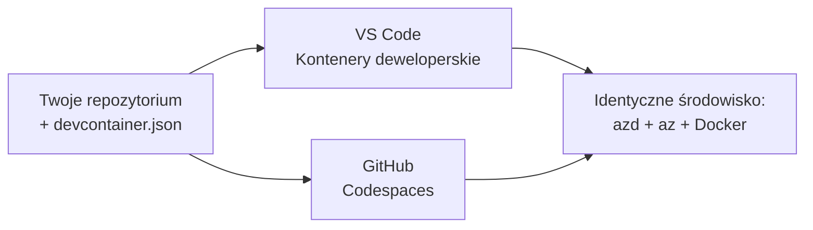

# Dev Containers & GitHub Codespaces for azd

**Chapter Navigation:**
- **📚 Course Home**: [AZD dla początkujących](../../README.md)
- **📖 Current Chapter**: Rozdział 1 - Podstawy i szybki start
- **⬅️ Previous**: [Użyj własnej aplikacji](bring-your-own-app.md)
- **🚀 Next Chapter**: [Rozdział 2: Rozwój z naciskiem na AI](../chapter-02-ai-development/README.md)

> Weryfikowano z `azd 1.25.6` w czerwcu 2026.

## Wprowadzenie

Instalowanie azd, odpowiedniego środowiska uruchomieniowego języka, Dockera i Azure CLI na każdym komputerze jest uciążliwe — i jest głównym powodem, dla którego samouczek, który "działa na moim komputerze", zawodzi u kogoś innego. Kontener deweloperski rozwiązuje to, opisując cały zestaw narzędzi w pliku. Każdy, kto otworzy projekt w VS Code lub GitHub Codespaces, otrzyma dokładnie takie samo środowisko, z już zainstalowanym azd. Ta lekcja pokaże, jak dodać taki plik.

## Cele lekcji

Po zakończeniu tej lekcji będziesz:
- Zrozumieć, czym jest kontener deweloperski i dlaczego pomaga w pracy z azd
- Dodać minimalny plik `.devcontainer/devcontainer.json` do projektu
- Uwzględnić azd, Azure CLI i Docker przez Dev Container *features*
- Otworzyć projekt w GitHub Codespaces lub VS Code

## Rezultaty nauki

Po ukończeniu tej lekcji będziesz potrafić:
- Napisać `devcontainer.json` dla projektu azd
- Dodać azd i narzędzia Azure bez ręcznej instalacji
- Uruchomić `azd up` z wnętrza kontenera lub Codespace

---

## Czym jest kontener deweloperski?

Kontener deweloperski to środowisko programistyczne oparte na Dockerze, zdefiniowane przez plik `.devcontainer/devcontainer.json` w twoim repozytorium. Gdy otworzysz projekt:

- **VS Code** (z rozszerzeniem Dev Containers) buduje kontener i dołącza do niego.
- **GitHub Codespaces** buduje ten sam kontener w chmurze i udostępnia edytor w przeglądarce.

Tak czy inaczej, każdy współpracownik otrzymuje identyczne narzędzia—koniec z pytaniami „zainstalowałeś azd?”.



---

## Krok 1: Utwórz plik devcontainer

Utwórz `.devcontainer/devcontainer.json` w katalogu głównym swojego projektu:

```json
{
  "name": "azd-project",
  "image": "mcr.microsoft.com/devcontainers/base:bookworm",
  "features": {
    "ghcr.io/devcontainers/features/azure-cli:1": {},
    "ghcr.io/azure/azure-dev/azd:latest": {},
    "ghcr.io/devcontainers/features/docker-in-docker:2": {},
    "ghcr.io/devcontainers/features/node:1": {}
  },
  "customizations": {
    "vscode": {
      "extensions": [
        "ms-azuretools.azure-dev",
        "ms-azuretools.vscode-bicep"
      ]
    }
  },
  "forwardPorts": [3000],
  "postCreateCommand": "azd version"
}
```

Co robi każda część:

| Key | Purpose |
|-----|---------|
| `image` | The base OS for the container |
| `features` | Wstępnie przygotowane instalatory — tutaj: Azure CLI, **azd**, Docker i Node.js |
| `customizations.vscode.extensions` | Automatycznie instaluje rozszerzenia VS Code: azd i Bicep |
| `forwardPorts` | Udostępnia port aplikacji w przeglądarce |
| `postCreateCommand` | Uruchamia się raz po zbudowaniu kontenera (tutaj: kontrola poprawności) |

> Funkcja `ghcr.io/azure/azure-dev/azd:latest` jest oficjalnym sposobem na uzyskanie azd w kontenerze. Jeśli potrzebujesz powtarzalności, przypnij konkretną wersję (np. `azd:1.25.6`).

---

## Krok 2: Dopasuj funkcję do języka swojej aplikacji

Zastąp funkcję `node` tą, której używa twoja aplikacja:

```jsonc
// Python project
"ghcr.io/devcontainers/features/python:1": {},

// .NET project
"ghcr.io/devcontainers/features/dotnet:2": {},

// Java project
"ghcr.io/devcontainers/features/java:1": {},

// Go project
"ghcr.io/devcontainers/features/go:1": {}
```

Zachowaj `docker-in-docker`, jeśli twój `host` to `containerapp`, `aks` lub cokolwiek, co buduje obraz kontenera — azd potrzebuje Dockera do budowania i wypychania obrazów.

---

## Krok 3: Otwórz projekt

**W VS Code:**
1. Zainstaluj rozszerzenie **Dev Containers**.
2. Otwórz folder projektu.
3. Kliknij **Reopen in Container** gdy pojawi się monit (lub uruchom *Dev Containers: Reopen in Container*).

**W GitHub Codespaces:**
1. Wypchnij repozytorium na GitHub.
2. Kliknij **Code → Codespaces → Create codespace on main**.
3. Poczekaj, aż kontener się zbuduje—azd będzie gotowy w terminalu.

---

## Krok 4: Wdróż z wnętrza kontenera

Kontener ma preinstalowany azd, więc normalny przepływ pracy po prostu działa:

```bash
azd auth login --use-device-code   # kod urządzenia jest przydatny w Codespaces
azd up
```

> **Dlaczego `--use-device-code`?** W zdalnym kontenerze lub Codespace nie ma lokalnej przeglądarki, do której dałoby się przekierować, więc logowanie przez device-code jest niezawodne. Wkleisz kod do zakładki w przeglądarce, aby zakończyć logowanie.

---

## Typowe pułapki

| Problem | Rozwiązanie |
|---------|-------------|
| `azd up` nie może zbudować obrazu | Dodaj funkcję `docker-in-docker` |
| Logowanie przez przeglądarkę zawiesza się w Codespaces | Użyj `azd auth login --use-device-code` |
| Narzędzia różnią się między członkami zespołu | Przypnij wersje funkcji (np. `azd:1.25.6`) |
| Aplikacja niedostępna w przeglądarce | Dodaj port do `forwardPorts` |

---

## Podsumowanie

- Kontener deweloperski sprawia, że zestaw narzędzi azd jest powtarzalny dla wszystkich.
- Dodaj azd, Azure CLI i Docker za pomocą Dev Container *features*.
- Dopasuj funkcję języka do swojej aplikacji i zachowaj `docker-in-docker` dla hostów kontenerów.
- Używaj logowania przez device-code podczas pracy w Codespaces.

---

## 🔗 Nawigacja

| Kierunek | Zasób |
|-----------|----------|
| **Poprzedni** | [Użyj własnej aplikacji](bring-your-own-app.md) |
| **Strona rozdziału** | [Rozdział 1: Podstawy i szybki start](README.md) |
| **Następny rozdział** | [Rozdział 2: Rozwój z naciskiem na AI](../chapter-02-ai-development/README.md) |

## 📖 Powiązane zasoby

- [Instalacja i konfiguracja](installation.md)
- [Skrót poleceń](../../resources/cheat-sheet.md)
- [Oficjalna specyfikacja Dev Containers](https://containers.dev/)
- [Funkcja Dev Container azd](https://github.com/Azure/azure-dev/tree/main/ext/devcontainer)

---

<!-- CO-OP TRANSLATOR DISCLAIMER START -->
**Zastrzeżenie**:
Niniejszy dokument został przetłumaczony za pomocą usługi tłumaczenia AI [Co-op Translator](https://github.com/Azure/co-op-translator). Choć dążymy do dokładności, prosimy pamiętać, że automatyczne tłumaczenia mogą zawierać błędy lub niedokładności. Oryginalny dokument w jego języku źródłowym należy uznawać za autorytatywne źródło. W przypadku informacji krytycznych zalecane jest skorzystanie z profesjonalnego tłumaczenia wykonanego przez człowieka. Nie ponosimy odpowiedzialności za jakiekolwiek nieporozumienia lub błędne interpretacje wynikające z użycia tego tłumaczenia.
<!-- CO-OP TRANSLATOR DISCLAIMER END -->