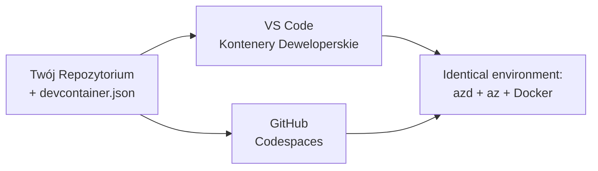

# Kontenery deweloperskie i GitHub Codespaces dla azd

**Nawigacja po rozdziale:**
- **📚 Strona kursu**: [AZD dla początkujących](../../README.md)
- **📖 Aktualny rozdział**: Rozdział 1 - Podstawy i szybki start
- **⬅️ Poprzedni**: [Przynieś własną aplikację](bring-your-own-app.md)
- **🚀 Następny rozdział**: [Rozdział 2: Rozwój AI-First](../chapter-02-ai-development/README.md)

> Zweryfikowano pod kątem `azd 1.27.1` w lipcu 2026.

## Wprowadzenie

Instalacja azd, odpowiedniego środowiska uruchomieniowego języka, Dockera i Azure CLI na każdej maszynie to uciążliwe zadanie — i to główny powód, dla którego tutorial działający "na mojej maszynie" nie działa dla kogoś innego. **Kontener deweloperski** rozwiązuje to przez opisanie całego ciągu narzędzi w pliku. Każdy, kto otworzy projekt w VS Code lub GitHub Codespaces, otrzymuje dokładnie takie samo środowisko, z już zainstalowanym azd. Ta lekcja pokaże, jak dodać taki kontener.

## Cele nauki

Pod koniec tej lekcji będziesz:
- Rozumieć, czym jest kontener deweloperski i dlaczego pomaga z azd
- Dodać minimalny plik `.devcontainer/devcontainer.json` do projektu
- Uwzględnić azd, Azure CLI i Dockera poprzez *features* Kontenera Deweloperskiego
- Otworzyć projekt w GitHub Codespaces lub VS Code

## Wyniki nauki

Po ukończeniu tej lekcji będziesz umiał:
- Napisać `devcontainer.json` dla projektu azd
- Dodać azd i narzędzia Azure bez instalacji ręcznej
- Uruchomić `azd up` wewnątrz kontenera lub Codespace

---

## Co to jest kontener deweloperski?

Kontener deweloperski to środowisko deweloperskie oparte na Dockerze, zdefiniowane przez plik `.devcontainer/devcontainer.json` w twoim repozytorium. Gdy otwierasz projekt:

- **VS Code** (z rozszerzeniem Dev Containers) buduje kontener i do niego się podłącza.
- **GitHub Codespaces** buduje ten sam kontener w chmurze i daje ci edytor w przeglądarce.

W obu przypadkach każdy współtwórca ma identyczne narzędzia — koniec z pytaniami "czy zainstalowałeś azd?" przy rozwiązywaniu problemów.



---

## Krok 1: Utwórz plik devcontainer

Utwórz `.devcontainer/devcontainer.json` w katalogu głównym twojego projektu:

```json
{
  "name": "azd-project",
  "image": "mcr.microsoft.com/devcontainers/base:bookworm",
  "features": {
    "ghcr.io/devcontainers/features/azure-cli:1": {},
    "ghcr.io/azure/azure-dev/azd:latest": {},
    "ghcr.io/devcontainers/features/docker-in-docker:2": {},
    "ghcr.io/devcontainers/features/node:1": {}
  },
  "customizations": {
    "vscode": {
      "extensions": [
        "ms-azuretools.azure-dev",
        "ms-azuretools.vscode-bicep"
      ]
    }
  },
  "forwardPorts": [3000],
  "postCreateCommand": "azd version"
}
```

Co robi każda część:

| Klucz | Cel |
|-----|---------|
| `image` | Bazowy system operacyjny kontenera |
| `features` | Wstępnie przygotowane instalatory — tutaj: Azure CLI, **azd**, Docker i Node.js |
| `customizations.vscode.extensions` | Automatycznie instaluje rozszerzenia VS Code azd i Bicep |
| `forwardPorts` | Udostępnia port twojej aplikacji w przeglądarce |
| `postCreateCommand` | Wykonuje się raz po zbudowaniu kontenera (tutaj, kontrola sanity) |

> Feature `ghcr.io/azure/azure-dev/azd:latest` to oficjalny sposób na uzyskanie azd w kontenerze. Przypnij konkretną wersję (np. `azd:1.27.1`) jeśli potrzebujesz powtarzalności.

---

## Krok 2: Dopasuj funkcję do języka twojej aplikacji

Zamień funkcję `node` na tę właściwą dla używanego przez ciebie języka:

```jsonc
// Python project
"ghcr.io/devcontainers/features/python:1": {},

// .NET project
"ghcr.io/devcontainers/features/dotnet:2": {},

// Java project
"ghcr.io/devcontainers/features/java:1": {},

// Go project
"ghcr.io/devcontainers/features/go:1": {}
```

Zachowaj `docker-in-docker`, jeśli twoim `host` jest `containerapp`, `aks` lub cokolwiek, co buduje obraz kontenera — azd potrzebuje Dockera do budowy i wypychania obrazów.

---

## Krok 3: Otwórz projekt

**W VS Code:**
1. Zainstaluj rozszerzenie **Dev Containers**.
2. Otwórz folder projektu.
3. Kliknij **Reopen in Container** gdy pojawi się monit (lub uruchom *Dev Containers: Reopen in Container*).

**W GitHub Codespaces:**
1. Wypchnij repozytorium na GitHub.
2. Kliknij **Code → Codespaces → Create codespace on main**.
3. Poczekaj na zbudowanie kontenera — azd jest gotowy w terminalu.

---

## Krok 4: Wdróż z wnętrza kontenera

Kontener ma azd wcześniej zainstalowany, więc standardowy proces po prostu działa:

```bash
azd auth login --use-device-code   # kod urządzenia jest przydatny wewnątrz Codespaces
azd up
```

> **Dlaczego `--use-device-code`?** W zdalnym kontenerze lub Codespace nie ma lokalnej przeglądarki do przekierowania, więc logowanie za pomocą kodu urządzenia jest niezawodną metodą. Wkleisz kod w kartę przeglądarki, aby zakończyć logowanie.

---

## Typowe pułapki

| Pułapka | Rozwiązanie |
|---------|-----|
| `azd up` nie może zbudować obrazu | Dodaj funkcję `docker-in-docker` |
| Logowanie przez przeglądarkę zawiesza się w Codespaces | Użyj `azd auth login --use-device-code` |
| Narzędzia różnią się między współpracownikami | Przypnij wersje funkcji (np. `azd:1.27.1`) |
| Aplikacja jest niedostępna w przeglądarce | Dodaj port do `forwardPorts` |

---

## Podsumowanie

- Kontener deweloperski sprawia, że twój ciąg narzędzi azd jest odtwarzalny dla każdego.
- Dodaj azd, Azure CLI i Dockera za pomocą *features* Kontenera Deweloperskiego.
- Dopasuj funkcję językową do swojej aplikacji i zachowaj `docker-in-docker` dla hostów kontenerów.
- Używaj logowania przez kod urządzenia podczas pracy w Codespaces.

---

## 🔗 Nawigacja

| Kierunek | Zasób |
|-----------|----------|
| **Poprzedni** | [Przynieś własną aplikację](bring-your-own-app.md) |
| **Strona rozdziału** | [Rozdział 1: Podstawy i szybki start](README.md) |
| **Następny rozdział** | [Rozdział 2: Rozwój AI-First](../chapter-02-ai-development/README.md) |

## 📖 Powiązane zasoby

- [Instalacja i konfiguracja](installation.md)
- [ściąga poleceń](../../resources/cheat-sheet.md)
- [Oficjalna specyfikacja Dev Containers](https://containers.dev/)
- [Feature azd Dev Container](https://github.com/Azure/azure-dev/tree/main/ext/devcontainer)

---

<!-- CO-OP TRANSLATOR DISCLAIMER START -->
**Zastrzeżenie**:
Niniejszy dokument został przetłumaczony za pomocą usługi tłumaczenia AI [Co-op Translator](https://github.com/Azure/co-op-translator). Choć dążymy do dokładności, prosimy pamiętać, że automatyczne tłumaczenia mogą zawierać błędy lub niedokładności. Oryginalny dokument w jego języku źródłowym należy uznawać za autorytatywne źródło. W przypadku informacji krytycznych zalecane jest skorzystanie z profesjonalnego tłumaczenia wykonanego przez człowieka. Nie ponosimy odpowiedzialności za jakiekolwiek nieporozumienia lub błędne interpretacje wynikające z użycia tego tłumaczenia.
<!-- CO-OP TRANSLATOR DISCLAIMER END -->