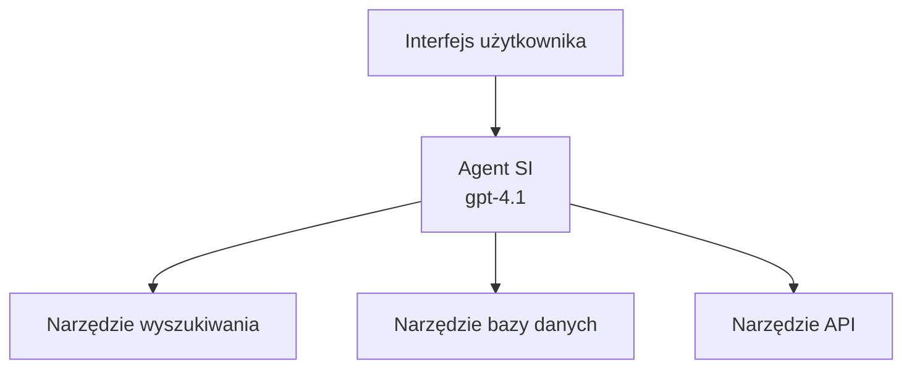
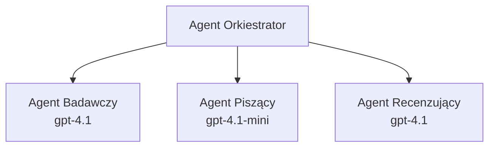

# Agenci AI z Azure Developer CLI

**Nawigacja po rozdziale:**
- **📚 Strona kursu głównego**: [AZD Dla Początkujących](../../README.md)
- **📖 Bieżący rozdział**: Rozdział 2 - Rozwój zorientowany na AI
- **⬅️ Poprzedni**: [Integracja Microsoft Foundry](microsoft-foundry-integration.md)
- **➡️ Następny**: [Wdrażanie modeli AI](ai-model-deployment.md)
- **🚀 Zaawansowane**: [Rozwiązania wieloagentowe](../../examples/retail-scenario.md)

---

## Wprowadzenie

Agenci AI to autonomiczne programy, które potrafią postrzegać swoje środowisko, podejmować decyzje i wykonywać działania w celu osiągnięcia określonych celów. W odróżnieniu od prostych chatbotów, które odpowiadają na zapytania, agenci mogą:

- **Korzystać z narzędzi** - wywoływać interfejsy API, przeszukiwać bazy danych, wykonywać kod
- **Planować i rozumować** - dzielić złożone zadania na kroki
- **Uczyć się na podstawie kontekstu** - zachować pamięć i dostosowywać zachowanie
- **Współpracować** - pracować z innymi agentami (systemy wieloagentowe)

Ten przewodnik pokazuje, jak wdrożyć agentów AI w Azure przy użyciu Azure Developer CLI (azd).

> **Uwaga dotycząca weryfikacji (2026-03-25):** Ten przewodnik został zweryfikowany z `azd` w wersji `1.23.12` oraz `azure.ai.agents` w wersji `0.1.18-preview`. Doświadczenie `azd ai` jest nadal w fazie preview, więc sprawdź pomoc rozszerzenia, jeśli posiadasz inne flagi instalacji.

## Cele nauki

Po ukończeniu tego przewodnika będziesz:
- Rozumieć czym są agenci AI i jak różnią się od chatbotów
- Wdrażać gotowe szablony agentów AI przy użyciu AZD
- Konfigurować agentów Foundry dla własnych agentów
- Implementować podstawowe wzorce agentów (użycie narzędzi, RAG, systemy wielu agentów)
- Monitorować i debugować wdrożone agenty

## Wyniki nauki

Po zakończeniu będziesz potrafił:
- Wdrażać aplikacje agentów AI na Azure jednym poleceniem
- Konfigurować narzędzia i funkcjonalności agenta
- Implementować retrieval-augmented generation (RAG) z agentami
- Projektować architektury wieloagentowe dla złożonych przepływów pracy
- Rozwiązywać typowe problemy z wdrażaniem agentów

---

## 🤖 Co odróżnia Agenta od Chatbota?

| Cecha | Chatbot | Agent AI |
|-------|---------|----------|
| **Zachowanie** | Odpowiada na zapytania | Wykonuje autonomiczne działania |
| **Narzędzia** | Brak | Może wywoływać API, wyszukiwać, wykonywać kod |
| **Pamięć** | Tylko sesyjna | Utrwalona pamięć między sesjami |
| **Planowanie** | Pojedyncza odpowiedź | Wieloetapowe rozumowanie |
| **Współpraca** | Pojedynczy podmiot | Może współpracować z innymi agentami |

### Prosta analogia

- **Chatbot** = Osoba pomocna odpowiadająca na pytania przy informacji
- **Agent AI** = Asystent osobisty, który może dzwonić, umawiać spotkania i wykonywać zadania za Ciebie

---

## 🚀 Szybki start: Wdroż swój pierwszy agent

### Opcja 1: Szablon Foundry Agents (zalecane)

```bash
# Inicjalizuj szablon agentów AI
azd init --template get-started-with-ai-agents

# Wdróż na Azure
azd up
```

**Co jest wdrażane:**
- ✅ Foundry Agents
- ✅ Modele Microsoft Foundry (gpt-4.1)
- ✅ Azure AI Search (dla RAG)
- ✅ Azure Container Apps (interfejs webowy)
- ✅ Application Insights (monitorowanie)

**Czas:** ~15-20 minut  
**Koszt:** ~100-150 USD/miesiąc (środowisko deweloperskie)

### Opcja 2: Agent OpenAI z Prompty

```bash
# Inicjalizuj szablon agenta opartego na Prompty
azd init --template agent-openai-python-prompty

# Wdróż do Azure
azd up
```

**Co jest wdrażane:**
- ✅ Azure Functions (serwerless do uruchamiania agenta)
- ✅ Modele Microsoft Foundry
- ✅ Pliki konfiguracyjne Prompty
- ✅ Przykładowa implementacja agenta

**Czas:** ~10-15 minut  
**Koszt:** ~50-100 USD/miesiąc (środowisko deweloperskie)

### Opcja 3: Agent czatu RAG

```bash
# Inicjalizuj szablon czatu RAG
azd init --template azure-search-openai-demo

# Wdróż na Azure
azd up
```

**Co jest wdrażane:**
- ✅ Modele Microsoft Foundry
- ✅ Azure AI Search z przykładowymi danymi
- ✅ Pipeline przetwarzania dokumentów
- ✅ Interfejs czatu z cytowaniami

**Czas:** ~15-25 minut  
**Koszt:** ~80-150 USD/miesiąc (środowisko deweloperskie)

### Opcja 4: Inicjalizacja agenta AI AZD (preview oparty na manifeście lub szablonie)

Jeśli posiadasz plik manifestu agenta, możesz użyć polecenia `azd ai` do scaffoldu projektu Foundry Agent Service bezpośrednio. Ostatnie wersje preview dodały również wsparcie dla inicjalizacji opartej na szablonach, więc dokładny przebieg może się nieco różnić w zależności od wersji rozszerzenia.

```bash
# Zainstaluj rozszerzenie agentów AI
azd extension install azure.ai.agents

# Opcjonalnie: zweryfikuj zainstalowaną wersję podglądową
azd extension show azure.ai.agents

# Zainicjuj na podstawie manifestu agenta
azd ai agent init -m agent-manifest.yaml

# Wdróż do Azure
azd up
```

**Kiedy używać `azd ai agent init` a kiedy `azd init --template`:**

| Podejście | Najlepsze dla | Jak to działa |
|-----------|---------------|--------------|
| `azd init --template` | Rozpoczęcie od działającej aplikacji przykładowej | Klonuje cały repozytorium z kodem i infrastrukturą |
| `azd ai agent init -m` | Budowa na podstawie własnego manifestu agenta | Generuje strukturę projektu na podstawie definicji agenta |

> **Wskazówka:** Używaj `azd init --template` podczas nauki (Opcje 1-3 powyżej). Użyj `azd ai agent init` przy budowie produkcyjnych agentów z własnymi manifestami. Pełna referencja: [Polecenia AZD AI CLI](../chapter-08-production/production-ai-practices.md#azd-ai-cli-commands-and-extensions).

---

## 🏗️ Wzorce architektury agentów

### Wzorzec 1: Pojedynczy agent z narzędziami

Najprostszy wzorzec agenta - jeden agent korzystający z wielu narzędzi.


**Najlepsze dla:**
- Boty wsparcia klienta
- Asystenci badawczy
- Agenci analiz danych

**Szablon AZD:** `azure-search-openai-demo`

### Wzorzec 2: Agent RAG (retrieval-augmented generation)

Agent pobierający odpowiednie dokumenty przed wygenerowaniem odpowiedzi.


**Najlepsze dla:**
- Firmowe bazy wiedzy
- Systemy Q&A na dokumentach
- Badania prawne i zgodności

**Szablon AZD:** `azure-search-openai-demo`

### Wzorzec 3: System wieloagentowy

Wiele wyspecjalizowanych agentów współpracujących nad złożonymi zadaniami.


**Najlepsze dla:**
- Zaawansowane generowanie treści
- Wieloetapowe przepływy pracy
- Zadania wymagające różnych specjalizacji

**Dowiedz się więcej:** [Wzorce koordynacji wieloagentowej](../chapter-06-pre-deployment/coordination-patterns.md)

---

## ⚙️ Konfiguracja narzędzi dla agentów

Agenci stają się potężni, gdy mogą korzystać z narzędzi. Oto jak skonfigurować popularne narzędzia:

### Konfiguracja narzędzi w Foundry Agents

```python
# agent_config.py
from azure.ai.projects import AIProjectClient
from azure.ai.projects.models import FunctionTool, CodeInterpreterTool

# Definiuj niestandardowe narzędzia
search_tool = FunctionTool(
    name="search_knowledge_base",
    description="Search the company knowledge base for relevant documents",
    parameters={
        "type": "object",
        "properties": {
            "query": {
                "type": "string",
                "description": "The search query"
            }
        },
        "required": ["query"]
    }
)

# Utwórz agenta z narzędziami
agent = project_client.agents.create_agent(
    model="gpt-4.1",
    name="Support Agent",
    instructions="You are a helpful support agent. Use the search tool to find relevant information.",
    tools=[search_tool, CodeInterpreterTool()]
)
```

### Konfiguracja środowiska

```bash
# Ustaw zmienne środowiskowe specyficzne dla agenta
azd env set AZURE_OPENAI_MODEL "gpt-4.1"
azd env set AGENT_INSTRUCTIONS "You are a helpful assistant..."
azd env set ENABLE_CODE_INTERPRETER "true"
azd env set ENABLE_FILE_SEARCH "true"

# Wdróż z zaktualizowaną konfiguracją
azd deploy
```

---

## 📊 Monitorowanie agentów

### Integracja z Application Insights

Wszystkie szablony agentów AZD zawierają Application Insights do monitorowania:

```bash
# Otwórz pulpit monitorowania
azd monitor --overview

# Wyświetl bieżące logi
azd monitor --logs

# Wyświetl bieżące metryki
azd monitor --live
```

### Kluczowe metryki do śledzenia

| Metryka | Opis | Cel |
|---------|------|-----|
| Opóźnienie odpowiedzi | Czas generowania odpowiedzi | < 5 sekund |
| Wykorzystanie tokenów | Tokeny na zapytanie | Monitoruj koszty |
| Sukces wywołań narzędzi | % udanych wywołań | > 95% |
| Wskaźnik błędów | Nieudane zapytania agenta | < 1% |
| Satysfakcja użytkownika | Wyniki opinii | > 4.0/5.0 |

### Niestandardowe logowanie dla agentów

```python
import os
from azure.monitor.opentelemetry import configure_azure_monitor
from opentelemetry import trace

# Skonfiguruj Azure Monitor z OpenTelemetry
configure_azure_monitor(
    connection_string=os.environ["APPLICATIONINSIGHTS_CONNECTION_STRING"]
)

tracer = trace.get_tracer(__name__)

def log_agent_interaction(user_query, agent_response, tools_used, latency_ms):
    with tracer.start_as_current_span("agent_interaction") as span:
        span.set_attributes({
            "user_query": user_query,
            "response_length": len(agent_response),
            "tools_used": tools_used,
            "latency_ms": latency_ms
        })
```

> **Uwaga:** Zainstaluj wymagane pakiety: `pip install azure-monitor-opentelemetry opentelemetry`

---

## 💰 Rozważania dotyczące kosztów

### Szacowane miesięczne koszty wg wzorca

| Wzorzec | Środowisko deweloperskie | Produkcja |
|---------|--------------------------|-----------|
| Pojedynczy agent | 50-100 USD | 200-500 USD |
| Agent RAG | 80-150 USD | 300-800 USD |
| Wieloagentowy (2-3 agentów) | 150-300 USD | 500-1500 USD |
| Wieloagentowy korporacyjny | 300-500 USD | 1500-5000+ USD |

### Wskazówki optymalizacyjne kosztów

1. **Używaj gpt-4.1-mini do prostych zadań**  
   ```bash
   azd env set AZURE_OPENAI_MODEL "gpt-4.1-mini"
   ```
  
2. **Implementuj cache dla powtarzających się zapytań**  
   ```python
   from functools import lru_cache
   
   @lru_cache(maxsize=1000)
   def get_cached_response(query_hash):
       return agent.run(query_hash)
   ```
  
3. **Ustaw limity tokenów na przebieg**  
   ```python
   # Ustaw max_completion_tokens podczas uruchamiania agenta, nie podczas tworzenia
   run = project_client.agents.create_run(
       thread_id=thread.id,
       agent_id=agent.id,
       max_completion_tokens=1000  # Ogranicz długość odpowiedzi
   )
   ```
  
4. **Skaluj do zera, gdy nie jest używany**  
   ```bash
   # Aplikacje kontenerowe automatycznie skalują się do zera
   azd env set MIN_REPLICAS "0"
   ```
  
---

## 🔧 Rozwiązywanie problemów z agentami

### Typowe problemy i rozwiązania

<details>
<summary><strong>❌ Agent nie odpowiada na wywołania narzędzi</strong></summary>

```bash
# Sprawdź, czy narzędzia są poprawnie zarejestrowane
azd show

# Zweryfikuj wdrożenie OpenAI
az cognitiveservices account deployment list \
  --name $AZURE_OPENAI_NAME \
  --resource-group $RG_NAME

# Sprawdź logi agenta
azd monitor --logs
```

**Typowe przyczyny:**
- Niedopasowanie sygnatury funkcji narzędzia
- Brak wymaganych uprawnień
- Niedostępny endpoint API
</details>

<details>
<summary><strong>❌ Wysokie opóźnienie w odpowiedziach agenta</strong></summary>

```bash
# Sprawdź Application Insights pod kątem wąskich gardeł
azd monitor --live

# Rozważ użycie szybszego modelu
azd env set AZURE_OPENAI_MODEL "gpt-4.1-mini"
azd deploy
```

**Wskazówki optymalizacyjne:**
- Użyj odpowiedzi strumieniowanych
- Wprowadź cache odpowiedzi
- Zmniejsz rozmiar okna kontekstu
</details>

<details>
<summary><strong>❌ Agent zwraca błędne lub zmyślone informacje</strong></summary>

```python
# Ulepsz za pomocą lepszych promptów systemowych
instructions = """
You are a helpful assistant. IMPORTANT:
- Only answer based on provided context
- If you don't know, say "I don't know"
- Always cite your sources
- Never make up information
"""

# Dodaj wyszukiwanie dla ugruntowania
agent = project_client.agents.create_agent(
    model="gpt-4.1",
    instructions=instructions,
    tools=[FileSearchTool()]  # Ugruntuj odpowiedzi w dokumentach
)
```
</details>

<details>
<summary><strong>❌ Błędy przekroczenia limitu tokenów</strong></summary>

```python
# Zaimplementuj zarządzanie oknem kontekstu
def truncate_context(messages, max_tokens=8000, model="gpt-4.1"):
    """Keep only recent messages within token limit."""
    import tiktoken
    encoding = tiktoken.encoding_for_model(model)
    total_tokens = 0
    truncated = []
    
    for msg in reversed(messages):
        msg_tokens = len(encoding.encode(msg.content))
        if total_tokens + msg_tokens > max_tokens:
            break
        truncated.insert(0, msg)
        total_tokens += msg_tokens
    
    return truncated
```
</details>

---

## 🎓 Ćwiczenia praktyczne

### Ćwiczenie 1: Wdrożenie podstawowego agenta (20 minut)

**Cel:** Wdroż swój pierwszy agenta AI za pomocą AZD

```bash
# Krok 1: Inicjalizuj szablon
azd init --template get-started-with-ai-agents

# Krok 2: Zaloguj się do Azure
azd auth login
# Jeśli pracujesz w wielu dzierżawach, dodaj --tenant-id <tenant-id>

# Krok 3: Wdróż
azd up

# Krok 4: Przetestuj agenta
# Oczekiwany wynik po wdrożeniu:
#   Wdrożenie zakończone!
#   Punkt końcowy: https://<app-name>.<region>.azurecontainerapps.io
# Otwórz URL pokazany w wyniku i spróbuj zadać pytanie

# Krok 5: Przeglądaj monitorowanie
azd monitor --overview

# Krok 6: Sprzątanie
azd down --force --purge
```

**Kryteria sukcesu:**
- [ ] Agent odpowiada na pytania
- [ ] Dostęp do panelu monitoringu przez `azd monitor`
- [ ] Zasoby zostały poprawnie usunięte

### Ćwiczenie 2: Dodanie własnego narzędzia (30 minut)

**Cel:** Rozszerz agenta o własne narzędzie

1. Wdroż szablon agenta:  
   ```bash
   azd init --template get-started-with-ai-agents
   azd up
   ```
  
2. Utwórz nową funkcję narzędzia w kodzie agenta:  
   ```python
   def get_weather(location: str) -> str:
       """Get current weather for a location."""
       # Wywołanie API do serwisu pogodowego
       return f"Weather in {location}: Sunny, 72°F"
   ```
  
3. Zarejestruj narzędzie w agencie:  
   ```python
   from azure.ai.projects.models import FunctionTool

   weather_tool = FunctionTool(
       name="get_weather",
       description="Get current weather for a location",
       parameters={
           "type": "object",
           "properties": {
               "location": {"type": "string", "description": "City name"}
           },
           "required": ["location"]
       }
   )

   agent = project_client.agents.create_agent(
       model="gpt-4.1",
       name="Weather Agent",
       tools=[weather_tool]
   )
   ```
  
4. Wdroż ponownie i przetestuj:  
   ```bash
   azd deploy
   # Zapytaj: "Jaka jest pogoda w Seattle?"
   # Oczekiwane: Agent wywołuje get_weather("Seattle") i zwraca informacje o pogodzie
   ```
  
**Kryteria sukcesu:**
- [ ] Agent rozpoznaje zapytania o pogodę
- [ ] Narzędzie jest prawidłowo wywoływane
- [ ] Odpowiedź zawiera informacje o pogodzie

### Ćwiczenie 3: Stworzenie agenta RAG (45 minut)

**Cel:** Stwórz agenta odpowiadającego na pytania na podstawie Twoich dokumentów

```bash
# Krok 1: Wdróż szablon RAG
azd init --template azure-search-openai-demo
azd up

# Krok 2: Prześlij swoje dokumenty
# Umieść pliki PDF/TXT w katalogu data/, następnie uruchom:
python scripts/prepdocs.py

# Krok 3: Testuj z pytaniami specyficznymi dla domeny
# Otwórz adres URL aplikacji webowej z wyniku polecenia azd up
# Zadawaj pytania dotyczące przesłanych dokumentów
# Odpowiedzi powinny zawierać odwołania do cytatów, np. [doc.pdf]
```

**Kryteria sukcesu:**
- [ ] Agent odpowiada na podstawie przesłanych dokumentów
- [ ] Odpowiedzi zawierają cytowania
- [ ] Brak zmyśleń na pytania spoza zakresu

---

## 📚 Kolejne kroki

Teraz, gdy rozumiesz agentów AI, poznaj te zaawansowane tematy:

| Temat | Opis | Link |
|-------|------|------|
| **Systemy wieloagentowe** | Buduj systemy z wieloma współpracującymi agentami | [Przykład wieloagentowy dla retail](../../examples/retail-scenario.md) |
| **Wzorce koordynacji** | Poznaj wzorce orkiestracji i komunikacji | [Wzorce koordynacji](../chapter-06-pre-deployment/coordination-patterns.md) |
| **Wdrażanie produkcyjne** | Wdrażanie agentów gotowych do produkcji | [Praktyki AI w produkcji](../chapter-08-production/production-ai-practices.md) |
| **Ewaluacja agentów** | Testowanie i ocena działania agentów | [Rozwiązywanie problemów AI](../chapter-07-troubleshooting/ai-troubleshooting.md) |
| **Warsztaty AI** | Praktycznie: przygotuj rozwiązanie AI do AZD | [Warsztat AI](ai-workshop-lab.md) |

---

## 📖 Dodatkowe zasoby

### Oficjalna dokumentacja
- [Azure AI Agent Service](https://learn.microsoft.com/azure/ai-services/agents/)
- [Azure AI Foundry Agent Service Szybki start](https://learn.microsoft.com/azure/ai-services/agents/quickstart)
- [Semantic Kernel Agent Framework](https://learn.microsoft.com/semantic-kernel/)

### Szablony AZD dla agentów
- [Rozpocznij z agentami AI](https://github.com/Azure-Samples/get-started-with-ai-agents)
- [Agent OpenAI Python Prompty](https://github.com/Azure-Samples/agent-openai-python-prompty)
- [Azure Search OpenAI Demo](https://github.com/Azure-Samples/azure-search-openai-demo)

### Zasoby społeczności
- [Awesome AZD - szablony agentów](https://azure.github.io/awesome-azd/?tags=ai-agents)
- [Discord Azure AI](https://discord.gg/microsoft-azure)
- [Discord Microsoft Foundry](https://discord.gg/nTYy5BXMWG)

### Umiejętności agentów do Twojego edytora
- [**Microsoft Azure Agent Skills**](https://skills.sh/microsoft/github-copilot-for-azure) - Instaluj wielokrotnego użytku umiejętności agentów AI dla rozwoju Azure w GitHub Copilot, Cursor lub dowolnym obsługiwanym agencie. Zawiera umiejętności dla [Azure AI](https://skills.sh/microsoft/github-copilot-for-azure/azure-ai), [Microsoft Foundry](https://skills.sh/microsoft/github-copilot-for-azure/microsoft-foundry), [wdrażanie](https://skills.sh/microsoft/github-copilot-for-azure/azure-deploy) oraz [diagnostyka](https://skills.sh/microsoft/github-copilot-for-azure/azure-diagnostics):
  ```bash
  npx skills add microsoft/github-copilot-for-azure
  ```

---

**Nawigacja**
- **Poprzednia lekcja**: [Integracja Microsoft Foundry](microsoft-foundry-integration.md)
- **Następna lekcja**: [Wdrażanie modeli AI](ai-model-deployment.md)

---

<!-- CO-OP TRANSLATOR DISCLAIMER START -->
**Wyłączenie odpowiedzialności**:  
Niniejszy dokument został przetłumaczony za pomocą usługi tłumaczenia AI [Co-op Translator](https://github.com/Azure/co-op-translator). Chociaż staramy się zapewnić dokładność, prosimy pamiętać, że automatyczne tłumaczenia mogą zawierać błędy lub niedokładności. Oryginalny dokument w języku źródłowym powinien być uważany za wiarygodne źródło. W przypadku informacji krytycznych zaleca się skorzystanie z profesjonalnego tłumaczenia wykonane przez człowieka. Nie ponosimy odpowiedzialności za jakiekolwiek nieporozumienia lub błędne interpretacje wynikłe z korzystania z tego tłumaczenia.
<!-- CO-OP TRANSLATOR DISCLAIMER END -->