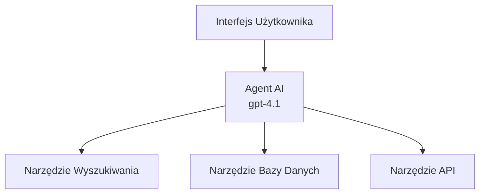
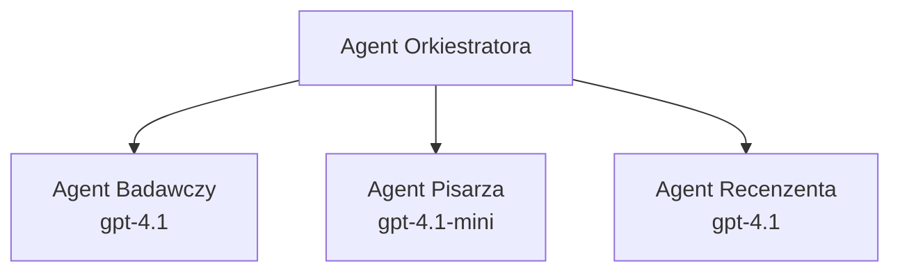

# Agent AI z Azure Developer CLI

**Nawigacja po rozdziale:**
- **📚 Strona kursu**: [AZD dla początkujących](../../README.md)
- **📖 Bieżący rozdział**: Rozdział 2 - Rozwój AI-First
- **⬅️ Poprzedni**: [Integracja Microsoft Foundry](microsoft-foundry-integration.md)
- **➡️ Następny**: [Wdrożenie modelu AI](ai-model-deployment.md)
- **🚀 Zaawansowane**: [Rozwiązania multi-agentowe](../../examples/retail-scenario.md)

---

## Wprowadzenie

Agenci AI to autonomiczne programy, które potrafią obserwować swoje otoczenie, podejmować decyzje i wykonywać działania w celu osiągnięcia określonych celów. W przeciwieństwie do prostych chatbotów odpowiadających na polecenia, agenci mogą:

- **Używać narzędzi** - Wywoływać API, przeszukiwać bazy danych, wykonywać kod
- **Planować i rozumować** - Dzielić złożone zadania na kroki
- **Uczyć się z kontekstu** - Zachowywać pamięć i adaptować zachowanie
- **Współpracować** - Pracować z innymi agentami (systemy multi-agentowe)

Ten przewodnik pokazuje, jak wdrożyć agentów AI na platformie Azure przy użyciu Azure Developer CLI (azd).

## Cele nauki

Po ukończeniu tego przewodnika będziesz potrafił:
- Zrozumieć, czym są agenci AI i czym różnią się od chatbotów
- Wdrażać gotowe szablony agentów AI za pomocą AZD
- Konfigurować Foundry Agents dla niestandardowych agentów
- Implementować podstawowe wzorce agentów (użycie narzędzi, RAG, multi-agent)
- Monitorować i debugować wdrożone agenty

## Rezultaty nauki

Po ukończeniu będziesz w stanie:
- Wdrażać aplikacje agentów AI na Azure za pomocą jednego polecenia
- Konfigurować narzędzia i możliwości agentów
- Implementować generowanie wspomagane wyszukiwaniem (RAG) z agentami
- Projektować architektury multi-agentowe do złożonych procesów
- Rozwiązywać typowe problemy z wdrożeniem agentów

---

## 🤖 Co odróżnia agenta od chatbota?

| Cechy | Chatbot | Agent AI |
|---------|---------|----------|
| **Zachowanie** | Odpowiada na polecenia | Podejmuje autonomiczne działania |
| **Narzędzia** | Brak | Może wywoływać API, przeszukiwać, wykonywać kod |
| **Pamięć** | Tylko sesyjna | Trwała pamięć między sesjami |
| **Planowanie** | Pojedyncza odpowiedź | Wieloetapowe rozumowanie |
| **Współpraca** | Pojedyncza jednostka | Może współpracować z innymi agentami |

### Proste porównanie

- **Chatbot** = Osoba udzielająca pomocy przy stanowisku informacyjnym
- **Agent AI** = Asystent osobisty, który może dzwonić, umawiać wizyty i wykonywać zadania za Ciebie

---

## 🚀 Szybki start: Wdróż swojego pierwszego agenta

### Opcja 1: Szablon Foundry Agents (zalecane)

```bash
# Inicjalizuj szablon agentów AI
azd init --template get-started-with-ai-agents

# Wdróż na Azure
azd up
```

**Co jest wdrażane:**
- ✅ Foundry Agents
- ✅ Modele Microsoft Foundry (gpt-4.1)
- ✅ Azure AI Search (do RAG)
- ✅ Azure Container Apps (interfejs webowy)
- ✅ Application Insights (monitorowanie)

**Czas:** ~15-20 minut  
**Koszt:** ~100-150 USD/miesiąc (na środowisko deweloperskie)

### Opcja 2: Agent OpenAI z Prompty

```bash
# Zainicjuj szablon agenta opartego na Prompty
azd init --template agent-openai-python-prompty

# Wdróż na Azure
azd up
```

**Co jest wdrażane:**
- ✅ Azure Functions (serwerless do wykonywania agenta)
- ✅ Modele Microsoft Foundry
- ✅ Pliki konfiguracyjne Prompty
- ✅ Przykładowa implementacja agenta

**Czas:** ~10-15 minut  
**Koszt:** ~50-100 USD/miesiąc (na środowisko deweloperskie)

### Opcja 3: Agent RAG (generowanie wspomagane wyszukiwaniem)

```bash
# Inicjalizuj szablon czatu RAG
azd init --template azure-search-openai-demo

# Wdrożenie do Azure
azd up
```

**Co jest wdrażane:**
- ✅ Modele Microsoft Foundry
- ✅ Azure AI Search z przykładowymi danymi
- ✅ Pipeline przetwarzania dokumentów
- ✅ Interfejs czatu z cytowaniami

**Czas:** ~15-25 minut  
**Koszt:** ~80-150 USD/miesiąc (na środowisko deweloperskie)

### Opcja 4: Inicjalizacja agenta AI AZD (na podstawie manifestu)

Jeśli posiadasz plik manifestu agenta, możesz użyć polecenia `azd ai` do wygenerowania projektu Foundry Agent Service bezpośrednio:

```bash
# Zainstaluj rozszerzenie agentów AI
azd extension install azure.ai.agents

# Zainicjuj z manifestu agenta
azd ai agent init -m agent-manifest.yaml

# Wdróż do Azure
azd up
```

**Kiedy używać `azd ai agent init` a kiedy `azd init --template`:**

| Podejście | Najlepsze dla | Jak działa |
|----------|----------|------|
| `azd init --template` | Rozpoczęcie od działającej przykładowej aplikacji | Klonuje pełne repozytorium szablonu z kodem i infrastrukturą |
| `azd ai agent init -m` | Budowa na podstawie własnego manifestu agenta | Tworzy strukturę projektu zgodnie z definicją agenta |

> **Wskazówka:** Używaj `azd init --template` do nauki (opcje 1-3 powyżej). Używaj `azd ai agent init` do budowy produkcyjnych agentów z własnymi manifestami. Zobacz [AZD AI CLI Commands](../chapter-08-production/production-ai-practices.md#azd-ai-cli-commands-and-extensions) dla pełnego odniesienia.

---

## 🏗️ Wzorce architektury agentów

### Wzorzec 1: Pojedynczy agent z narzędziami

Najprostszy wzorzec agenta - jeden agent, który może korzystać z wielu narzędzi.


**Najlepsze zastosowania:**
- Boty wsparcia klienta
- Asystenci badawczy
- Agenci analiz danych

**Szablon AZD:** `azure-search-openai-demo`

### Wzorzec 2: Agent RAG (generowanie wspomagane wyszukiwaniem)

Agent wyszukujący odpowiednie dokumenty przed generowaniem odpowiedzi.


**Najlepsze zastosowania:**
- Bazy wiedzy w przedsiębiorstwach
- Systemy Q&A oparte na dokumentach
- Badania zgodności i prawne

**Szablon AZD:** `azure-search-openai-demo`

### Wzorzec 3: System multi-agentowy

Wiele specjalizowanych agentów współpracujących przy złożonych zadaniach.


**Najlepsze zastosowania:**
- Złożone generowanie treści
- Wieloetapowe procesy
- Zadania wymagające różnych specjalizacji

**Dowiedz się więcej:** [Wzorce koordynacji multi-agentów](../chapter-06-pre-deployment/coordination-patterns.md)

---

## ⚙️ Konfiguracja narzędzi agenta

Agenci stają się potężni, gdy mogą używać narzędzi. Oto jak skonfigurować popularne narzędzia:

### Konfiguracja narzędzi w Foundry Agents

```python
# agent_config.py
from azure.ai.projects import AIProjectClient
from azure.ai.projects.models import FunctionTool, CodeInterpreterTool

# Definiuj niestandardowe narzędzia
search_tool = FunctionTool(
    name="search_knowledge_base",
    description="Search the company knowledge base for relevant documents",
    parameters={
        "type": "object",
        "properties": {
            "query": {
                "type": "string",
                "description": "The search query"
            }
        },
        "required": ["query"]
    }
)

# Utwórz agenta z narzędziami
agent = project_client.agents.create_agent(
    model="gpt-4.1",
    name="Support Agent",
    instructions="You are a helpful support agent. Use the search tool to find relevant information.",
    tools=[search_tool, CodeInterpreterTool()]
)
```

### Konfiguracja środowiska

```bash
# Ustaw zmienne środowiskowe specyficzne dla agenta
azd env set AZURE_OPENAI_MODEL "gpt-4.1"
azd env set AGENT_INSTRUCTIONS "You are a helpful assistant..."
azd env set ENABLE_CODE_INTERPRETER "true"
azd env set ENABLE_FILE_SEARCH "true"

# Wdróż z zaktualizowaną konfiguracją
azd deploy
```

---

## 📊 Monitorowanie agentów

### Integracja z Application Insights

Wszystkie szablony agentów AZD zawierają Application Insights do monitorowania:

```bash
# Otwórz pulpit monitorowania
azd monitor --overview

# Wyświetl bieżące logi
azd monitor --logs

# Wyświetl bieżące metryki
azd monitor --live
```

### Kluczowe metryki do śledzenia

| Metryka | Opis | Cel |
|--------|-------------|--------|
| Opóźnienie odpowiedzi | Czas generowania odpowiedzi | < 5 sekund |
| Zużycie tokenów | Tokeny na zapytanie | Monitoruj koszty |
| Wskaźnik udanych wywołań narzędzi | % udanych wykonanych wywołań narzędzi | > 95% |
| Wskaźnik błędów | Nieudane zapytania agenta | < 1% |
| Satysfakcja użytkownika | Oceny opinii zwrotnych | > 4.0/5.0 |

### Niestandardowe logowanie dla agentów

```python
import os
from azure.monitor.opentelemetry import configure_azure_monitor
from opentelemetry import trace

# Konfiguracja Azure Monitor za pomocą OpenTelemetry
configure_azure_monitor(
    connection_string=os.environ["APPLICATIONINSIGHTS_CONNECTION_STRING"]
)

tracer = trace.get_tracer(__name__)

def log_agent_interaction(user_query, agent_response, tools_used, latency_ms):
    with tracer.start_as_current_span("agent_interaction") as span:
        span.set_attributes({
            "user_query": user_query,
            "response_length": len(agent_response),
            "tools_used": tools_used,
            "latency_ms": latency_ms
        })
```

> **Uwaga:** Zainstaluj wymagane pakiety: `pip install azure-monitor-opentelemetry opentelemetry`

---

## 💰 Rozważania kosztowe

### Szacowane miesięczne koszty według wzorca

| Wzorzec | Środowisko deweloperskie | Produkcja |
|---------|-----------------|------------|
| Pojedynczy agent | 50-100 USD | 200-500 USD |
| Agent RAG | 80-150 USD | 300-800 USD |
| Multi-agent (2-3 agentów) | 150-300 USD | 500-1,500 USD |
| Przedsiębiorstwowy multi-agent | 300-500 USD | 1,500-5,000+ USD |

### Wskazówki optymalizacji kosztów

1. **Używaj gpt-4.1-mini do prostych zadań**  
   ```bash
   azd env set AZURE_OPENAI_MODEL "gpt-4.1-mini"
   ```

2. **Wdrażaj cache dla powtarzających się zapytań**  
   ```python
   from functools import lru_cache
   
   @lru_cache(maxsize=1000)
   def get_cached_response(query_hash):
       return agent.run(query_hash)
   ```

3. **Ustawiaj limity tokenów na przebieg**  
   ```python
   # Ustaw max_completion_tokens podczas uruchamiania agenta, nie podczas tworzenia
   run = project_client.agents.create_run(
       thread_id=thread.id,
       agent_id=agent.id,
       max_completion_tokens=1000  # Ogranicz długość odpowiedzi
   )
   ```

4. **Skaluj do zera, gdy nie jest używane**  
   ```bash
   # Aplikacje kontenerowe automatycznie skalują się do zera
   azd env set MIN_REPLICAS "0"
   ```

---

## 🔧 Rozwiązywanie problemów z agentami

### Typowe problemy i rozwiązania

<details>
<summary><strong>❌ Agent nie odpowiada na wywołania narzędzi</strong></summary>

```bash
# Sprawdź, czy narzędzia są poprawnie zarejestrowane
azd show

# Zweryfikuj wdrożenie OpenAI
az cognitiveservices account deployment list \
  --name $AZURE_OPENAI_NAME \
  --resource-group $RG_NAME

# Sprawdź logi agenta
azd monitor --logs
```

**Typowe przyczyny:**
- Nieprawidłowa sygnatura funkcji narzędzia
- Brak wymaganych uprawnień
- Niedostępność punktu końcowego API
</details>

<details>
<summary><strong>❌ Wysokie opóźnienia w odpowiedziach agenta</strong></summary>

```bash
# Sprawdź Application Insights pod kątem wąskich gardeł
azd monitor --live

# Rozważ użycie szybszego modelu
azd env set AZURE_OPENAI_MODEL "gpt-4.1-mini"
azd deploy
```

**Wskazówki optymalizacyjne:**
- Używaj strumieniowych odpowiedzi
- Implementuj cache dla odpowiedzi
- Zmniejsz rozmiar okna kontekstu
</details>

<details>
<summary><strong>❌ Agent zwraca nieprawidłowe lub halucynowane informacje</strong></summary>

```python
# Ulepsz za pomocą lepszych podpowiedzi systemowych
instructions = """
You are a helpful assistant. IMPORTANT:
- Only answer based on provided context
- If you don't know, say "I don't know"
- Always cite your sources
- Never make up information
"""

# Dodaj wyszukiwanie do podstawienia
agent = project_client.agents.create_agent(
    model="gpt-4.1",
    instructions=instructions,
    tools=[FileSearchTool()]  # Podstaw odpowiedzi w dokumentach
)
```
</details>

<details>
<summary><strong>❌ Błędy przekroczenia limitu tokenów</strong></summary>

```python
# Zaimplementuj zarządzanie oknem kontekstu
def truncate_context(messages, max_tokens=8000, model="gpt-4.1"):
    """Keep only recent messages within token limit."""
    import tiktoken
    encoding = tiktoken.encoding_for_model(model)
    total_tokens = 0
    truncated = []
    
    for msg in reversed(messages):
        msg_tokens = len(encoding.encode(msg.content))
        if total_tokens + msg_tokens > max_tokens:
            break
        truncated.insert(0, msg)
        total_tokens += msg_tokens
    
    return truncated
```
</details>

---

## 🎓 Ćwiczenia praktyczne

### Ćwiczenie 1: Wdróż podstawowego agenta (20 minut)

**Cel:** Wdróż swojego pierwszego agenta AI za pomocą AZD

```bash
# Krok 1: Inicjalizuj szablon
azd init --template get-started-with-ai-agents

# Krok 2: Zaloguj się do Azure
azd auth login

# Krok 3: Wdróż
azd up

# Krok 4: Przetestuj agenta
# Oczekiwany rezultat po wdrożeniu:
#   Wdrożenie zakończone!
#   Punkt końcowy: https://<app-name>.<region>.azurecontainerapps.io
# Otwórz adres URL pokazany w wyniku i spróbuj zadać pytanie

# Krok 5: Wyświetl monitorowanie
azd monitor --overview

# Krok 6: Posprzątaj
azd down --force --purge
```

**Kryteria sukcesu:**
- [ ] Agent odpowiada na pytania
- [ ] Możliwość dostępu do panelu monitoringu przez `azd monitor`
- [ ] Zasoby zostały poprawnie zwolnione

### Ćwiczenie 2: Dodaj niestandardowe narzędzie (30 minut)

**Cel:** Rozszerz agenta o niestandardowe narzędzie

1. Wdróż szablon agenta:  
   ```bash
   azd init --template get-started-with-ai-agents
   azd up
   ```
2. Utwórz nową funkcję narzędzia w kodzie agenta:  
   ```python
   def get_weather(location: str) -> str:
       """Get current weather for a location."""
       # Wywołanie API do serwisu pogodowego
       return f"Weather in {location}: Sunny, 72°F"
   ```
3. Zarejestruj narzędzie u agenta:  
   ```python
   from azure.ai.projects.models import FunctionTool

   weather_tool = FunctionTool(
       name="get_weather",
       description="Get current weather for a location",
       parameters={
           "type": "object",
           "properties": {
               "location": {"type": "string", "description": "City name"}
           },
           "required": ["location"]
       }
   )

   agent = project_client.agents.create_agent(
       model="gpt-4.1",
       name="Weather Agent",
       tools=[weather_tool]
   )
   ```
4. Ponownie wdroż i przetestuj:  
   ```bash
   azd deploy
   # Zapytaj: "Jaka jest pogoda w Seattle?"
   # Oczekiwane: Agent wywołuje get_weather("Seattle") i zwraca informacje o pogodzie
   ```

**Kryteria sukcesu:**
- [ ] Agent rozpoznaje pytania związane z pogodą
- [ ] Narzędzie jest wywoływane poprawnie
- [ ] Odpowiedź zawiera informacje o pogodzie

### Ćwiczenie 3: Zbuduj agenta RAG (45 minut)

**Cel:** Stwórz agenta odpowiadającego na pytania na podstawie Twoich dokumentów

```bash
# Krok 1: Wdróż szablon RAG
azd init --template azure-search-openai-demo
azd up

# Krok 2: Prześlij swoje dokumenty
# Umieść pliki PDF/TXT w katalogu data/, a następnie uruchom:
python scripts/prepdocs.py

# Krok 3: Testuj za pomocą pytań specyficznych dla domeny
# Otwórz adres URL aplikacji webowej z wyniku azd up
# Zadawaj pytania dotyczące swoich przesłanych dokumentów
# Odpowiedzi powinny zawierać odwołania do cytowań, np. [doc.pdf]
```

**Kryteria sukcesu:**
- [ ] Agent odpowiada na podstawie przesłanych dokumentów
- [ ] Odpowiedzi zawierają cytaty
- [ ] Brak halucynacji w pytaniach wykraczających poza zakres

---

## 📚 Kolejne kroki

Teraz, gdy rozumiesz agentów AI, poznaj te zaawansowane tematy:

| Temat | Opis | Link |
|-------|-------------|------|
| **Systemy multi-agentowe** | Buduj systemy z wieloma współpracującymi agentami | [Przykład Multi-Agent w Retail](../../examples/retail-scenario.md) |
| **Wzorce koordynacji** | Poznaj wzorce orkiestracji i komunikacji | [Wzorce koordynacji](../chapter-06-pre-deployment/coordination-patterns.md) |
| **Wdrożenia produkcyjne** | Gotowe do produkcji wdrożenia agentów | [Praktyki AI w produkcji](../chapter-08-production/production-ai-practices.md) |
| **Ocena agentów** | Testuj i oceniaj wydajność agentów | [Rozwiązywanie problemów AI](../chapter-07-troubleshooting/ai-troubleshooting.md) |
| **Lab Warsztatowy AI** | Praktycznie: przygotuj swoje rozwiązanie AI do AZD | [Lab Warsztatowy AI](ai-workshop-lab.md) |

---

## 📖 Dodatkowe zasoby

### Oficjalna dokumentacja
- [Azure AI Agent Service](https://learn.microsoft.com/azure/ai-services/agents/)
- [Azure AI Foundry Agent Service Quickstart](https://learn.microsoft.com/azure/ai-services/agents/quickstart)
- [Semantic Kernel Agent Framework](https://learn.microsoft.com/semantic-kernel/)

### Szablony AZD dla agentów
- [Rozpocznij pracę z agentami AI](https://github.com/Azure-Samples/get-started-with-ai-agents)
- [Agent OpenAI Python Prompty](https://github.com/Azure-Samples/agent-openai-python-prompty)
- [Azure Search OpenAI Demo](https://github.com/Azure-Samples/azure-search-openai-demo)

### Zasoby społeczności
- [Awesome AZD - Szablony agentów](https://azure.github.io/awesome-azd/?tags=ai-agents)
- [Azure AI Discord](https://discord.gg/microsoft-azure)
- [Microsoft Foundry Discord](https://discord.gg/nTYy5BXMWG)

### Umiejętności agentów do Twojego edytora
- [**Microsoft Azure Agent Skills**](https://skills.sh/microsoft/github-copilot-for-azure) - Instaluj wielokrotnego użytku umiejętności agentów AI dla rozwoju na Azure w GitHub Copilot, Cursor lub dowolnym obsługiwanym agencie. Zawiera umiejętności dla [Azure AI](https://skills.sh/microsoft/github-copilot-for-azure/azure-ai), [Microsoft Foundry](https://skills.sh/microsoft/github-copilot-for-azure/microsoft-foundry), [wdrożeń](https://skills.sh/microsoft/github-copilot-for-azure/azure-deploy) i [diagnostyki](https://skills.sh/microsoft/github-copilot-for-azure/azure-diagnostics):  
  ```bash
  npx skills add microsoft/github-copilot-for-azure
  ```

---

**Nawigacja**  
- **Poprzednia lekcja**: [Integracja Microsoft Foundry](microsoft-foundry-integration.md)  
- **Następna lekcja**: [Wdrożenie modelu AI](ai-model-deployment.md)

---

<!-- CO-OP TRANSLATOR DISCLAIMER START -->
**Zastrzeżenie**:  
Niniejszy dokument został przetłumaczony przy użyciu automatycznej usługi tłumaczeniowej [Co-op Translator](https://github.com/Azure/co-op-translator). Choć dokładamy starań, aby zapewnić poprawność, prosimy mieć na uwadze, że tłumaczenia automatyczne mogą zawierać błędy lub niedokładności. Oryginalny dokument w języku źródłowym powinien być uznawany za wiarygodne źródło informacji. W przypadku informacji o krytycznym znaczeniu zalecane jest skorzystanie z profesjonalnego tłumaczenia wykonanego przez człowieka. Nie ponosimy odpowiedzialności za jakiekolwiek nieporozumienia lub błędne interpretacje wynikające z korzystania z tego tłumaczenia.
<!-- CO-OP TRANSLATOR DISCLAIMER END -->