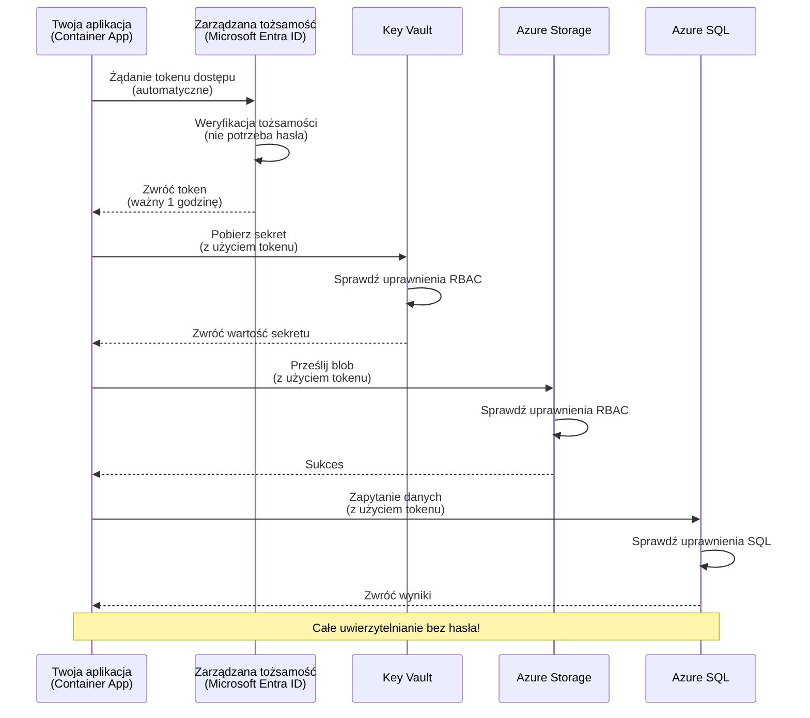
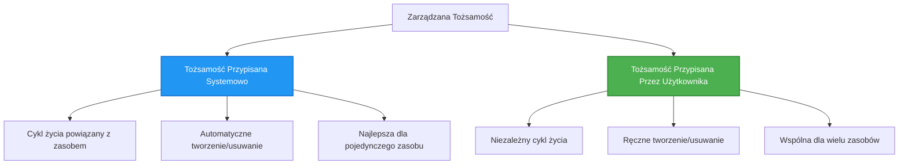

# Wzorce uwierzytelniania i zarządzane tożsamości

⏱️ **Szacowany czas**: 45-60 minut | 💰 **Wpływ na koszty**: Bezpłatne (bez dodatkowych opłat) | ⭐ **Poziom złożoności**: Średniozaawansowany

**📚 Ścieżka nauki:**
- ← Poprzedni: [Zarządzanie konfiguracją](configuration.md) - Zarządzanie zmiennymi środowiskowymi i sekretami
- 🎯 **Jesteś tutaj**: Uwierzytelnianie i bezpieczeństwo (Zarządzana tożsamość, Key Vault, bezpieczne wzorce)
- → Następny: [Pierwszy projekt](first-project.md) - Zbuduj swoją pierwszą aplikację AZD
- 🏠 [Strona główna kursu](../../README.md)

---

## Czego się nauczysz

Po ukończeniu tej lekcji:
- Zrozumiesz wzorce uwierzytelniania Azure (klucze, connection stringi, zarządzana tożsamość)
- Wdrożysz **zarządzaną tożsamość** do uwierzytelniania bez hasła
- Zabezpieczysz sekrety dzięki integracji z **Azure Key Vault**
- Skonfigurujesz **kontrolę dostępu opartą na rolach (RBAC)** dla wdrożeń AZD
- Zastosujesz najlepsze praktyki bezpieczeństwa w Container Apps i usługach Azure
- Migrujesz z uwierzytelniania opartego na kluczach na uwierzytelnianie oparte na tożsamości

## Dlaczego zarządzana tożsamość jest ważna

### Problem: Tradycyjne uwierzytelnianie

**Przed zarządzaną tożsamością:**
```javascript
// ❌ RYZYKO BEZPIECZEŃSTWA: Utwardzone sekrety w kodzie
const connectionString = "Server=mydb.database.windows.net;User=admin;Password=P@ssw0rd123";
const storageKey = "xK7mN9pQ2wR5tY8uI0oP3aS6dF1gH4jK...";
const cosmosKey = "C2x7B9n4M1p8Q5w3E6r0T2y5U8i1O4p7...";
```

**Problemy:**
- 🔴 **Sekrety ujawnione** w kodzie, plikach konfiguracyjnych, zmiennych środowiskowych
- 🔴 **Rotacja poświadczeń** wymaga zmian w kodzie i redeploymentu
- 🔴 **Koszmary audytowe** - kto, co i kiedy uzyskał dostęp?
- 🔴 **Rozproszenie** - sekrety rozrzucone po wielu systemach
- 🔴 **Ryzyko zgodności** - niezgodność z audytami bezpieczeństwa

### Rozwiązanie: Zarządzana tożsamość

**Po wprowadzeniu zarządzanej tożsamości:**
```javascript
// ✅ BEZPIECZNE: Brak sekretów w kodzie
const credential = new DefaultAzureCredential();
const client = new BlobServiceClient(
  "https://mystorageaccount.blob.core.windows.net",
  credential  // Azure automatycznie obsługuje uwierzytelnianie
);
```

**Korzyści:**
- ✅ **Brak sekretów** w kodzie lub konfiguracji
- ✅ **Automatyczna rotacja** – obsługiwana przez Azure
- ✅ **Pełny ślad audytowy** w logach Microsoft Entra ID
- ✅ **Centralne zarządzanie bezpieczeństwem** w Azure Portal
- ✅ **Gotowość do audytów** – spełnia standardy bezpieczeństwa

**Analogicznie**: Tradycyjne uwierzytelnianie to jak noszenie wielu fizycznych kluczy do różnych drzwi. Zarządzana tożsamość to jak posiadanie identyfikatora bezpieczeństwa, który automatycznie nadaje dostęp w zależności od tego, kim jesteś — brak kluczy do zgubienia, kopiowania lub rotacji.

---

## Przegląd architektury

### Przepływ uwierzytelniania z zarządzaną tożsamością



### Typy zarządzanych tożsamości



| Cecha | Przypisana do systemu | Przypisana do użytkownika |
|-------|----------------------|---------------------------|
| **Cykl życia** | Powiązana z zasobem | Niezależna |
| **Tworzenie** | Automatyczne z zasobem | Ręczne tworzenie |
| **Usuwanie** | Usuwana z zasobem | Pozostaje po usunięciu zasobu |
| **Udostępnianie** | Jeden zasób | Wielokrotne zasoby |
| **Zastosowanie** | Proste scenariusze | Złożone scenariusze wielozasobowe |
| **Domyślnie w AZD** | ✅ Zalecane | Opcjonalne |

---

## Wymagania wstępne

### Wymagane narzędzia

Powinieneś mieć już zainstalowane z poprzednich lekcji:

```bash
# Zweryfikuj Azure Developer CLI
azd version
# ✅ Oczekiwane: azd wersja 1.0.0 lub wyższa

# Zweryfikuj Azure CLI
az --version
# ✅ Oczekiwane: azure-cli 2.50.0 lub wyższa
```

### Wymagania Azure

- Aktywna subskrypcja Azure
- Uprawnienia do:
  - Tworzenia zarządzanych tożsamości
  - Przypisywania ról RBAC
  - Tworzenia zasobów Key Vault
  - Wdrażania Container Apps

### Wymagana wiedza

Powinieneś ukończyć:
- [Przewodnik instalacji](installation.md) - konfiguracja AZD
- [Podstawy AZD](azd-basics.md) - podstawowe koncepcje
- [Zarządzanie konfiguracją](configuration.md) - zmienne środowiskowe

---

## Lekcja 1: Zrozumienie wzorców uwierzytelniania

### Wzorzec 1: Connection Strings (Dziedziczny – unikać)

**Jak działa:**
```bash
# Łańcuch połączenia zawiera dane uwierzytelniające
STORAGE_CONNECTION_STRING="DefaultEndpointsProtocol=https;AccountName=myaccount;AccountKey=xK7mN9pQ2wR5..."
COSMOS_CONNECTION_STRING="AccountEndpoint=https://myaccount.documents.azure.com:443/;AccountKey=C2x7..."
SQL_CONNECTION_STRING="Server=myserver.database.windows.net;User=admin;Password=P@ssw0rd..."
```

**Problemy:**
- ❌ Sekrety widoczne w zmiennych środowiskowych
- ❌ Logowane w systemach wdrożeniowych
- ❌ Trudne do rotacji
- ❌ Brak śladu audytowego dostępu

**Kiedy używać:** Tylko do lokalnego rozwoju, nigdy do produkcji.

---

### Wzorzec 2: Odwołania do Key Vault (Lepsze)

**Jak działa:**
```bicep
// Store secret in Key Vault
resource keyVault 'Microsoft.KeyVault/vaults@2023-02-01' = {
  name: 'mykv'
  properties: {
    enableRbacAuthorization: true
  }
}

// Reference in Container App
env: [
  {
    name: 'STORAGE_KEY'
    secretRef: 'storage-key'  // References Key Vault
  }
]
```

**Korzyści:**
- ✅ Sekrety przechowywane bezpiecznie w Key Vault
- ✅ Centralne zarządzanie sekretami
- ✅ Rotacja bez zmian w kodzie

**Ograniczenia:**
- ⚠️ Nadal używa kluczy/hasła
- ⚠️ Wymaga zarządzania dostępem do Key Vault

**Kiedy używać:** Etap przejściowy z connection stringów na zarządzaną tożsamość.

---

### Wzorzec 3: Zarządzana tożsamość (Najlepsza praktyka)

**Jak działa:**
```bicep
// Enable managed identity
resource containerApp 'Microsoft.App/containerApps@2023-05-01' = {
  name: 'myapp'
  identity: {
    type: 'SystemAssigned'  // Automatically creates identity
  }
}

// Grant permissions
resource roleAssignment 'Microsoft.Authorization/roleAssignments@2022-04-01' = {
  scope: storageAccount
  properties: {
    roleDefinitionId: storageBlobDataContributorRole
    principalId: containerApp.identity.principalId
  }
}
```

**Kod aplikacji:**
```javascript
// Nie są potrzebne żadne tajemnice!
const { DefaultAzureCredential } = require('@azure/identity');
const { BlobServiceClient } = require('@azure/storage-blob');

const credential = new DefaultAzureCredential();
const blobServiceClient = new BlobServiceClient(
  'https://mystorageaccount.blob.core.windows.net',
  credential
);
```

**Korzyści:**
- ✅ Brak sekretów w kodzie/konfiguracji
- ✅ Automatyczna rotacja poświadczeń
- ✅ Pełny ślad audytowy
- ✅ Uprawnienia oparte na RBAC
- ✅ Gotowość do audytów

**Kiedy używać:** Zawsze, w aplikacjach produkcyjnych.

---

### Wzorzec 4: Service Principal (CI/CD i automatyzacja)

Zarządzana tożsamość jest złotym standardem *dla zasobów działających w ramach Azure*. Ale co z tym, co działa **poza** Azure — np. pipeline CI/CD na agencie budowania lub skrypt na twoim laptopie, który nie może użyć interaktywnego logowania? Tutaj wkracza **service principal**: tożsamość nieludzka z własnymi poświadczeniami, na które może się logować proces automatyczny.

**Jak działa:**

Utwórz service principal przypisany do grupy zasobów (zasada najmniejszego uprzywilejowania):

```bash
az ad sp create-for-rbac \
  --name "myapp-cicd" \
  --role contributor \
  --scopes /subscriptions/<sub-id>/resourceGroups/<rg-name>
```

To wyświetli identyfikator klienta, sekret klienta i identyfikator dzierżawy. azd może logować się nimi bez interakcji:

```bash
azd auth login \
  --client-id "<appId>" \
  --client-secret "<password>" \
  --tenant-id "<tenant>"
```

**Preferuj poświadczenia federowane (OIDC) zamiast sekretów.** Zamiast długo ważnego sekretu klienta, skonfiguruj poświadczenie federowane, aby pipeline wymieniał krótko ważny token — brak możliwości wycieku lub rotacji sekretu:

```bash
azd auth login \
  --client-id "<appId>" \
  --federated-credential-provider "github" \
  --tenant-id "<tenant>"
```

> `azd pipeline config` ustawia to automatycznie. Zobacz przewodniki CI/CD w [Rozdziale 8](../chapter-08-production/production-ai-practices.md).

**Korzyści:**
- ✅ Działa poza Azure (agenty budowania, środowiska lokalne, inne chmury)
- ✅ Można przypisać do pojedynczej grupy zasobów z jedną rolą
- ✅ Wariant federowany (OIDC) nie wymaga przechowywania sekretu

**Negatywy:**
- ⚠️ Wariant oparty na sekrecie wymaga starannego przechowywania i rotacji
- ⚠️ Wykradziony sekret daje pełne uprawnienia service principal — utrzymuj ograniczone zakresy

**Kiedy używać:** Pipeline CI/CD i automatyzacja, które nie mogą używać zarządzanej tożsamości. Zawsze preferuj wariant **federowany/OIDC** zamiast sekretu klienta i preferuj zarządzaną tożsamość jeśli obciążenie działa w Azure.

**Bezpieczne przechowywanie poświadczeń:**
- Nigdy nie commituj sekretów — używaj magazynu sekretów pipeline'u (sekrety GitHub Actions, grupy zmiennych Azure DevOps / Key Vault).
- Przypisz service principal tylko do najmniejszej wymaganej roli i grupy zasobów.
- Ustaw datę wygaśnięcia i rotuj, lub wyeliminuj sekret całkowicie przy pomocy OIDC.

---

## Lekcja 2: Wdrażanie zarządzanej tożsamości z AZD

### Implementacja krok po kroku

Zbudujmy bezpieczną aplikację Container App, która wykorzystuje zarządzaną tożsamość do dostępu do Azure Storage i Key Vault.

### Struktura projektu

```
secure-app/
├── azure.yaml                 # AZD configuration
├── infra/
│   ├── main.bicep            # Main infrastructure
│   ├── core/
│   │   ├── identity.bicep    # Managed identity setup
│   │   ├── keyvault.bicep    # Key Vault configuration
│   │   └── storage.bicep     # Storage with RBAC
│   └── app/
│       └── container-app.bicep
└── src/
    ├── app.js                # Application code
    ├── package.json
    └── Dockerfile
```

### 1. Konfiguracja AZD (azure.yaml)

```yaml
name: secure-app
metadata:
  template: secure-app@1.0.0

services:
  api:
    project: ./src
    language: js
    host: containerapp

# Enable managed identity (AZD handles this automatically)
```

### 2. Infrastruktura: Włączanie zarządzanej tożsamości

**Plik: `infra/main.bicep`**

```bicep
targetScope = 'subscription'

param environmentName string
param location string = 'eastus'

var tags = { 'azd-env-name': environmentName }

// Resource group
resource rg 'Microsoft.Resources/resourceGroups@2021-04-01' = {
  name: 'rg-${environmentName}'
  location: location
  tags: tags
}

// Storage Account
module storage './core/storage.bicep' = {
  name: 'storage'
  scope: rg
  params: {
    name: 'st${uniqueString(rg.id)}'
    location: location
    tags: tags
  }
}

// Key Vault
module keyVault './core/keyvault.bicep' = {
  name: 'keyvault'
  scope: rg
  params: {
    name: 'kv-${uniqueString(rg.id)}'
    location: location
    tags: tags
  }
}

// Container App with Managed Identity
module containerApp './app/container-app.bicep' = {
  name: 'container-app'
  scope: rg
  params: {
    name: 'ca-${environmentName}'
    location: location
    tags: tags
    storageAccountName: storage.outputs.name
    keyVaultName: keyVault.outputs.name
  }
}

// Grant Container App access to Storage
module storageRoleAssignment './core/role-assignment.bicep' = {
  name: 'storage-role'
  scope: rg
  params: {
    principalId: containerApp.outputs.identityPrincipalId
    roleDefinitionId: 'ba92f5b4-2d11-453d-a403-e96b0029c9fe'  // Storage Blob Data Contributor
    targetResourceId: storage.outputs.id
  }
}

// Grant Container App access to Key Vault
module kvRoleAssignment './core/role-assignment.bicep' = {
  name: 'kv-role'
  scope: rg
  params: {
    principalId: containerApp.outputs.identityPrincipalId
    roleDefinitionId: '4633458b-17de-408a-b874-0445c86b69e6'  // Key Vault Secrets User
    targetResourceId: keyVault.outputs.id
  }
}

// Outputs
output AZURE_STORAGE_ACCOUNT_NAME string = storage.outputs.name
output AZURE_KEY_VAULT_NAME string = keyVault.outputs.name
output APP_URL string = containerApp.outputs.url
```

### 3. Container App z tożsamością przypisaną przez system

**Plik: `infra/app/container-app.bicep`**

```bicep
param name string
param location string
param tags object = {}
param storageAccountName string
param keyVaultName string

resource containerApp 'Microsoft.App/containerApps@2023-05-01' = {
  name: name
  location: location
  tags: tags
  identity: {
    type: 'SystemAssigned'  // 🔑 Enable managed identity
  }
  properties: {
    configuration: {
      ingress: {
        external: true
        targetPort: 3000
      }
    }
    template: {
      containers: [
        {
          name: 'api'
          image: 'myregistry.azurecr.io/api:latest'
          resources: {
            cpu: json('0.5')
            memory: '1Gi'
          }
          env: [
            {
              name: 'AZURE_STORAGE_ACCOUNT_NAME'
              value: storageAccountName
            }
            {
              name: 'AZURE_KEY_VAULT_NAME'
              value: keyVaultName
            }
            // 🔑 No secrets - managed identity handles authentication!
          ]
        }
      ]
    }
  }
}

// Output the identity for RBAC assignments
output identityPrincipalId string = containerApp.identity.principalId
output id string = containerApp.id
output url string = 'https://${containerApp.properties.configuration.ingress.fqdn}'
```

### 4. Moduł przypisania roli RBAC

**Plik: `infra/core/role-assignment.bicep`**

```bicep
param principalId string
param roleDefinitionId string  // Azure built-in role ID
param targetResourceId string

resource roleAssignment 'Microsoft.Authorization/roleAssignments@2022-04-01' = {
  name: guid(principalId, roleDefinitionId, targetResourceId)
  scope: resourceId('Microsoft.Resources/resourceGroups', resourceGroup().name)
  properties: {
    roleDefinitionId: subscriptionResourceId('Microsoft.Authorization/roleDefinitions', roleDefinitionId)
    principalId: principalId
    principalType: 'ServicePrincipal'
  }
}

output id string = roleAssignment.id
```

### 5. Kod aplikacji z zarządzaną tożsamością

**Plik: `src/app.js`**

```javascript
const express = require('express');
const { DefaultAzureCredential } = require('@azure/identity');
const { BlobServiceClient } = require('@azure/storage-blob');
const { SecretClient } = require('@azure/keyvault-secrets');

const app = express();
const PORT = process.env.PORT || 3000;

// 🔑 Inicjalizacja poświadczeń (działa automatycznie z tożsamością zarządzaną)
const credential = new DefaultAzureCredential();

// Konfiguracja Azure Storage
const storageAccountName = process.env.AZURE_STORAGE_ACCOUNT_NAME;
const blobServiceClient = new BlobServiceClient(
  `https://${storageAccountName}.blob.core.windows.net`,
  credential  // Klucze nie są potrzebne!
);

// Konfiguracja Key Vault
const keyVaultName = process.env.AZURE_KEY_VAULT_NAME;
const secretClient = new SecretClient(
  `https://${keyVaultName}.vault.azure.net`,
  credential  // Klucze nie są potrzebne!
);

// Sprawdzenie stanu zdrowia
app.get('/health', (req, res) => {
  res.json({ status: 'healthy', authentication: 'managed-identity' });
});

// Prześlij plik do magazynu blobów
app.post('/upload', async (req, res) => {
  try {
    const containerClient = blobServiceClient.getContainerClient('uploads');
    await containerClient.createIfNotExists();
    
    const blobName = `file-${Date.now()}.txt`;
    const blockBlobClient = containerClient.getBlockBlobClient(blobName);
    
    await blockBlobClient.upload('Hello from managed identity!', 30);
    
    res.json({
      success: true,
      blobName: blobName,
      message: 'File uploaded using managed identity!'
    });
  } catch (error) {
    console.error('Upload error:', error);
    res.status(500).json({ error: error.message });
  }
});

// Pobierz sekret z Key Vault
app.get('/secret/:name', async (req, res) => {
  try {
    const secretName = req.params.name;
    const secret = await secretClient.getSecret(secretName);
    
    res.json({
      name: secretName,
      value: secret.value,
      message: 'Secret retrieved using managed identity!'
    });
  } catch (error) {
    console.error('Secret error:', error);
    res.status(500).json({ error: error.message });
  }
});

// Wyświetl listę kontenerów blobów (pokazuje dostęp do odczytu)
app.get('/containers', async (req, res) => {
  try {
    const containers = [];
    for await (const container of blobServiceClient.listContainers()) {
      containers.push(container.name);
    }
    
    res.json({
      containers: containers,
      count: containers.length,
      message: 'Containers listed using managed identity!'
    });
  } catch (error) {
    console.error('List error:', error);
    res.status(500).json({ error: error.message });
  }
});

app.listen(PORT, () => {
  console.log(`Secure API listening on port ${PORT}`);
  console.log('Authentication: Managed Identity (passwordless)');
});
```

**Plik: `src/package.json`**

```json
{
  "name": "secure-app",
  "version": "1.0.0",
  "dependencies": {
    "express": "^4.18.2",
    "@azure/identity": "^4.0.0",
    "@azure/storage-blob": "^12.17.0",
    "@azure/keyvault-secrets": "^4.7.0"
  },
  "scripts": {
    "start": "node app.js"
  }
}
```

### 6. Deploy i testowanie

```bash
# Inicjalizuj środowisko AZD
azd init

# Wdróż infrastrukturę i aplikację
azd up

# Pobierz adres URL aplikacji
APP_URL=$(azd env get-values | grep APP_URL | cut -d '=' -f2 | tr -d '"')

# Przetestuj kontrolę stanu zdrowia
curl $APP_URL/health
```

**✅ Oczekiwany rezultat:**
```json
{
  "status": "healthy",
  "authentication": "managed-identity"
}
```

**Test przesyłania blobu:**
```bash
curl -X POST $APP_URL/upload
```

**✅ Oczekiwany rezultat:**
```json
{
  "success": true,
  "blobName": "file-1700404800000.txt",
  "message": "File uploaded using managed identity!"
}
```

**Test listowania kontenerów:**
```bash
curl $APP_URL/containers
```

**✅ Oczekiwany rezultat:**
```json
{
  "containers": ["uploads"],
  "count": 1,
  "message": "Containers listed using managed identity!"
}
```

---

## Popularne role Azure RBAC

### Wbudowane identyfikatory ról dla zarządzanej tożsamości

| Usługa | Nazwa roli | Identyfikator roli | Uprawnienia |
|--------|------------|-------------------|-------------|
| **Storage** | Storage Blob Data Reader | `2a2b9908-6b94-4a3d-8e5a-a7d8f8cc8a12` | Odczyt blobów i kontenerów |
| **Storage** | Storage Blob Data Contributor | `ba92f5b4-2d11-453d-a403-e96b0029c9fe` | Odczyt, zapis, usuwanie blobów |
| **Storage** | Storage Queue Data Contributor | `974c5e8b-45b9-4653-ba55-5f855dd0fb88` | Odczyt, zapis, usuwanie wiadomości z kolejki |
| **Key Vault** | Key Vault Secrets User | `4633458b-17de-408a-b874-0445c86b69e6` | Odczyt sekretów |
| **Key Vault** | Key Vault Secrets Officer | `b86a8fe4-44ce-4948-aee5-eccb2c155cd7` | Odczyt, zapis, usuwanie sekretów |
| **Cosmos DB** | Cosmos DB Built-in Data Reader | `00000000-0000-0000-0000-000000000001` | Odczyt danych Cosmos DB |
| **Cosmos DB** | Cosmos DB Built-in Data Contributor | `00000000-0000-0000-0000-000000000002` | Odczyt, zapis danych Cosmos DB |
| **SQL Database** | SQL DB Contributor | `9b7fa17d-e63e-47b0-bb0a-15c516ac86ec` | Zarządzanie bazami SQL |
| **Service Bus** | Azure Service Bus Data Owner | `090c5cfd-751d-490a-894a-3ce6f1109419` | Wysyłanie, odbieranie, zarządzanie wiadomościami |

### Jak znaleźć identyfikatory ról

```bash
# Wyświetl wszystkie wbudowane role
az role definition list --query "[].{Name:roleName, ID:name}" --output table

# Wyszukaj konkretną rolę
az role definition list --query "[?contains(roleName, 'Storage Blob')].{Name:roleName, ID:name}" --output table

# Pobierz szczegóły roli
az role definition list --name "Storage Blob Data Contributor"
```

---

## Ćwiczenia praktyczne

### Ćwiczenie 1: Włącz zarządzaną tożsamość dla istniejącej aplikacji ⭐⭐ (Średniozaawansowane)

**Cel**: Dodaj zarządzaną tożsamość do istniejącego wdrożenia Container App

**Scenariusz**: Masz Container App korzystającą z connection stringów. Przekształć ją na zarządzaną tożsamość.

**Stan początkowy**: Container App z konfiguracją:

```bicep
// ❌ Current: Using connection string
env: [
  {
    name: 'STORAGE_CONNECTION_STRING'
    secretRef: 'storage-connection'
  }
]
```

**Kroki**:

1. **Włącz zarządzaną tożsamość w Bicep:**

```bicep
resource containerApp 'Microsoft.App/containerApps@2023-05-01' = {
  name: 'myapp'
  identity: {
    type: 'SystemAssigned'  // Add this
  }
  // ... rest of configuration
}
```

2. **Nadaj dostęp do Storage:**

```bicep
// Get storage account reference
resource storageAccount 'Microsoft.Storage/storageAccounts@2023-01-01' existing = {
  name: storageAccountName
}

// Assign role
resource roleAssignment 'Microsoft.Authorization/roleAssignments@2022-04-01' = {
  name: guid(containerApp.id, 'ba92f5b4-2d11-453d-a403-e96b0029c9fe', storageAccount.id)
  scope: storageAccount
  properties: {
    roleDefinitionId: subscriptionResourceId('Microsoft.Authorization/roleDefinitions', 'ba92f5b4-2d11-453d-a403-e96b0029c9fe')
    principalId: containerApp.identity.principalId
    principalType: 'ServicePrincipal'
  }
}
```

3. **Zaktualizuj kod aplikacji:**

**Przed (connection string):**
```javascript
const { BlobServiceClient } = require('@azure/storage-blob');

const blobServiceClient = BlobServiceClient.fromConnectionString(
  process.env.STORAGE_CONNECTION_STRING
);
```

**Po (zarządzana tożsamość):**
```javascript
const { DefaultAzureCredential } = require('@azure/identity');
const { BlobServiceClient } = require('@azure/storage-blob');

const credential = new DefaultAzureCredential();
const blobServiceClient = new BlobServiceClient(
  `https://${process.env.STORAGE_ACCOUNT_NAME}.blob.core.windows.net`,
  credential
);
```

4. **Zaktualizuj zmienne środowiskowe:**

```bicep
env: [
  {
    name: 'STORAGE_ACCOUNT_NAME'
    value: storageAccountName  // Just the name, no secrets!
  }
  // Remove STORAGE_CONNECTION_STRING
]
```

5. **Wdróż i przetestuj:**

```bash
# Ponowne wdrożenie
azd up

# Sprawdź, czy nadal działa
curl https://myapp.azurecontainerapps.io/upload
```

**✅ Kryteria sukcesu:**
- ✅ Aplikacja wdraża się bez błędów
- ✅ Operacje na Storage działają (wysyłanie, listowanie, pobieranie)
- ✅ Brak connection stringów w zmiennych środowiskowych
- ✅ Tożsamość widoczna w Azure Portal na karcie „Identity”

**Weryfikacja:**

```bash
# Sprawdź, czy zarządzana tożsamość jest włączona
az containerapp show \
  --name myapp \
  --resource-group rg-myapp \
  --query "identity.type"
# ✅ Oczekiwane: "SystemAssigned"

# Sprawdź przypisanie roli
az role assignment list \
  --assignee $(az containerapp show --name myapp --resource-group rg-myapp --query "identity.principalId" -o tsv) \
  --scope /subscriptions/{sub-id}/resourceGroups/rg-myapp/providers/Microsoft.Storage/storageAccounts/mystorageaccount
# ✅ Oczekiwane: Pokazuje rolę "Storage Blob Data Contributor"
```

**Czas**: 20-30 minut

---

### Ćwiczenie 2: Dostęp wielu usług z tożsamością przypisaną użytkownikowi ⭐⭐⭐ (Zaawansowane)

**Cel**: Utwórz zarządzaną tożsamość przypisaną użytkownikowi współdzieloną przez wiele Container Apps

**Scenariusz**: Masz 3 mikroserwisy, które potrzebują dostępu do tego samego konta Storage oraz Key Vault.

**Kroki**:

1. **Utwórz tożsamość przypisaną użytkownikowi:**

**Plik: `infra/core/identity.bicep`**

```bicep
param name string
param location string
param tags object = {}

resource userAssignedIdentity 'Microsoft.ManagedIdentity/userAssignedIdentities@2023-01-31' = {
  name: name
  location: location
  tags: tags
}

output id string = userAssignedIdentity.id
output principalId string = userAssignedIdentity.properties.principalId
output clientId string = userAssignedIdentity.properties.clientId
```

2. **Przypisz role do tożsamości przypisanej użytkownikowi:**

```bicep
// In main.bicep
module userIdentity './core/identity.bicep' = {
  name: 'user-identity'
  scope: rg
  params: {
    name: 'id-${environmentName}'
    location: location
    tags: tags
  }
}

// Grant Storage access
resource storageRoleAssignment 'Microsoft.Authorization/roleAssignments@2022-04-01' = {
  name: guid(userIdentity.outputs.principalId, 'storage-contributor')
  scope: storageAccount
  properties: {
    roleDefinitionId: subscriptionResourceId('Microsoft.Authorization/roleDefinitions', 'ba92f5b4-2d11-453d-a403-e96b0029c9fe')
    principalId: userIdentity.outputs.principalId
    principalType: 'ServicePrincipal'
  }
}

// Grant Key Vault access
resource kvRoleAssignment 'Microsoft.Authorization/roleAssignments@2022-04-01' = {
  name: guid(userIdentity.outputs.principalId, 'kv-secrets-user')
  scope: keyVault
  properties: {
    roleDefinitionId: subscriptionResourceId('Microsoft.Authorization/roleDefinitions', '4633458b-17de-408a-b874-0445c86b69e6')
    principalId: userIdentity.outputs.principalId
    principalType: 'ServicePrincipal'
  }
}
```

3. **Przypisz tożsamość do wielu Container Apps:**

```bicep
resource apiGateway 'Microsoft.App/containerApps@2023-05-01' = {
  name: 'api-gateway'
  identity: {
    type: 'UserAssigned'
    userAssignedIdentities: {
      '${userIdentity.outputs.id}': {}
    }
  }
  // ... rest of config
}

resource productService 'Microsoft.App/containerApps@2023-05-01' = {
  name: 'product-service'
  identity: {
    type: 'UserAssigned'
    userAssignedIdentities: {
      '${userIdentity.outputs.id}': {}
    }
  }
  // ... rest of config
}

resource orderService 'Microsoft.App/containerApps@2023-05-01' = {
  name: 'order-service'
  identity: {
    type: 'UserAssigned'
    userAssignedIdentities: {
      '${userIdentity.outputs.id}': {}
    }
  }
  // ... rest of config
}
```

4. **Kod aplikacji (wszystkie usługi używają tego samego wzorca):**

```javascript
const { DefaultAzureCredential, ManagedIdentityCredential } = require('@azure/identity');

// Dla tożsamości przypisanej przez użytkownika, określ identyfikator klienta
const credential = new ManagedIdentityCredential(
  process.env.AZURE_CLIENT_ID  // Identyfikator klienta tożsamości przypisanej przez użytkownika
);

// Lub użyj DefaultAzureCredential (automatyczne wykrywanie)
const credential = new DefaultAzureCredential();

const blobServiceClient = new BlobServiceClient(
  `https://${process.env.STORAGE_ACCOUNT_NAME}.blob.core.windows.net`,
  credential
);
```

5. **Wdróż i zweryfikuj:**

```bash
azd up

# Przetestuj, czy wszystkie usługi mają dostęp do magazynu
curl https://api-gateway.azurecontainerapps.io/upload
curl https://product-service.azurecontainerapps.io/upload
curl https://order-service.azurecontainerapps.io/upload
```

**✅ Kryteria sukcesu:**
- ✅ Jedna tożsamość współdzielona przez 3 usługi
- ✅ Wszystkie usługi mają dostęp do Storage i Key Vault
- ✅ Tożsamość przetrwa usunięcie jednej usługi
- ✅ Centralne zarządzanie uprawnieniami

**Korzyści tożsamości przypisanej użytkownikowi:**
- Jedna tożsamość do zarządzania
- Spójne uprawnienia dla usług
- Przetrwa usunięcie usługi
- Lepsze dla złożonych architektur

**Czas**: 30-40 minut

---

### Ćwiczenie 3: Wdrożenie rotacji sekretów w Key Vault ⭐⭐⭐ (Zaawansowane)

**Cel**: Przechowywać klucze API stron trzecich w Key Vault i uzyskiwać do nich dostęp za pomocą zarządzanej tożsamości

**Scenariusz**: Twoja aplikacja musi wywoływać zewnętrzne API (OpenAI, Stripe, SendGrid), które wymagają kluczy API.

**Kroki**:

1. **Utwórz Key Vault z RBAC:**

**Plik: `infra/core/keyvault.bicep`**

```bicep
param name string
param location string
param tags object = {}

resource keyVault 'Microsoft.KeyVault/vaults@2023-02-01' = {
  name: name
  location: location
  tags: tags
  properties: {
    enableRbacAuthorization: true  // Use RBAC instead of access policies
    sku: {
      family: 'A'
      name: 'standard'
    }
    tenantId: subscription().tenantId
    enableSoftDelete: true
    softDeleteRetentionInDays: 90
  }
}

// Allow Container App to read secrets
output id string = keyVault.id
output name string = keyVault.name
output uri string = keyVault.properties.vaultUri
```

2. **Przechowuj sekrety w Key Vault:**

```bash
# Pobierz nazwę Key Vault
KV_NAME=$(azd env get-values | grep AZURE_KEY_VAULT_NAME | cut -d '=' -f2 | tr -d '"')

# Przechowuj klucze API firm trzecich
az keyvault secret set \
  --vault-name $KV_NAME \
  --name "OpenAI-ApiKey" \
  --value "sk-proj-xxxxxxxxxxxxx"

az keyvault secret set \
  --vault-name $KV_NAME \
  --name "Stripe-ApiKey" \
  --value "sk_live_xxxxxxxxxxxxx"

az keyvault secret set \
  --vault-name $KV_NAME \
  --name "SendGrid-ApiKey" \
  --value "SG.xxxxxxxxxxxxx"
```

3. **Kod aplikacji pobierający sekrety:**

**Plik: `src/config.js`**

```javascript
const { DefaultAzureCredential } = require('@azure/identity');
const { SecretClient } = require('@azure/keyvault-secrets');

class Config {
  constructor() {
    this.credential = new DefaultAzureCredential();
    this.secretClient = new SecretClient(
      `https://${process.env.AZURE_KEY_VAULT_NAME}.vault.azure.net`,
      this.credential
    );
    this.cache = {};
  }

  async getSecret(secretName) {
    // Najpierw sprawdź pamięć podręczną
    if (this.cache[secretName]) {
      return this.cache[secretName];
    }

    try {
      const secret = await this.secretClient.getSecret(secretName);
      this.cache[secretName] = secret.value;
      console.log(`✅ Retrieved secret: ${secretName}`);
      return secret.value;
    } catch (error) {
      console.error(`❌ Failed to get secret ${secretName}:`, error.message);
      throw error;
    }
  }

  async getOpenAIKey() {
    return this.getSecret('OpenAI-ApiKey');
  }

  async getStripeKey() {
    return this.getSecret('Stripe-ApiKey');
  }

  async getSendGridKey() {
    return this.getSecret('SendGrid-ApiKey');
  }
}

module.exports = new Config();
```

4. **Użyj sekretów w aplikacji:**

**Plik: `src/app.js`**

```javascript
const express = require('express');
const config = require('./config');
const { OpenAI } = require('openai');

const app = express();

// Zainicjuj OpenAI za pomocą klucza z Key Vault
let openaiClient;

async function initializeServices() {
  const openaiKey = await config.getOpenAIKey();
  openaiClient = new OpenAI({ apiKey: openaiKey });
  console.log('✅ Services initialized with secrets from Key Vault');
}

// Wywołaj podczas uruchamiania
initializeServices().catch(console.error);

app.post('/chat', async (req, res) => {
  try {
    const completion = await openaiClient.chat.completions.create({
      model: 'gpt-4.1',
      messages: [{ role: 'user', content: 'Hello!' }]
    });
    
    res.json({
      response: completion.choices[0].message.content,
      authentication: 'Key from Key Vault via Managed Identity'
    });
  } catch (error) {
    res.status(500).json({ error: error.message });
  }
});

app.listen(3000, () => {
  console.log('Secure API with Key Vault integration running');
});
```

5. **Wdróż i przetestuj:**

```bash
azd up

# Przetestuj, czy klucze API działają
curl -X POST https://myapp.azurecontainerapps.io/chat \
  -H "Content-Type: application/json" \
  -d '{"message":"Hello AI"}'
```

**✅ Kryteria sukcesu:**
- ✅ Brak kluczy API w kodzie lub zmiennych środowiskowych  
- ✅ Aplikacja pobiera klucze z Key Vault  
- ✅ API stron trzecich działają poprawnie  
- ✅ Można rotować klucze bez zmian w kodzie  

**Rotacja sekretu:**  

```bash
# Zaktualizuj sekret w Key Vault
az keyvault secret set \
  --vault-name $KV_NAME \
  --name "OpenAI-ApiKey" \
  --value "sk-proj-NEW_KEY_HERE"

# Uruchom ponownie aplikację, aby pobrać nowy klucz
az containerapp revision restart \
  --name myapp \
  --resource-group rg-myapp
```
  
**Czas**: 25-35 minut  

---  

## Punkt kontrolny wiedzy  

### 1. Wzorce uwierzytelniania ✓  

Sprawdź swoją wiedzę:  

- [ ] **P1**: Jakie są trzy główne wzorce uwierzytelniania?  
  - **O**: Connection strings (stare), referencje Key Vault (przejściowe), Managed Identity (najlepsze)  

- [ ] **P2**: Dlaczego zarządzana tożsamość jest lepsza niż connection strings?  
  - **O**: Brak sekretów w kodzie, automatyczna rotacja, pełny zapis audytu, uprawnienia RBAC  

- [ ] **P3**: Kiedy stosować tożsamość przypisaną przez użytkownika zamiast przypisanej systemowo?  
  - **O**: Gdy tożsamość jest współdzielona między wieloma zasobami lub gdy cykl życia tożsamości jest niezależny od cyklu życia zasobu  

**Weryfikacja praktyczna:**  
```bash
# Sprawdź, jakiego typu tożsamość używa Twoja aplikacja
az containerapp show \
  --name myapp \
  --resource-group rg-myapp \
  --query "identity.type"

# Wyświetl wszystkie przypisania ról dla tożsamości
az role assignment list \
  --assignee $(az containerapp show --name myapp --resource-group rg-myapp --query "identity.principalId" -o tsv)
```
  
---  

### 2. RBAC i uprawnienia ✓  

Sprawdź swoją wiedzę:  

- [ ] **P1**: Jaki jest identyfikator roli "Storage Blob Data Contributor"?  
  - **O**: `ba92f5b4-2d11-453d-a403-e96b0029c9fe`  

- [ ] **P2**: Jakie uprawnienia daje rola "Key Vault Secrets User"?  
  - **O**: Dostęp tylko do odczytu sekretów (nie może tworzyć, aktualizować ani usuwać)  

- [ ] **P3**: Jak przyznać aplikacji Container App dostęp do Azure SQL?  
  - **O**: Przydzielić rolę "SQL DB Contributor" lub skonfigurować uwierzytelnianie Microsoft Entra ID dla SQL  

**Weryfikacja praktyczna:**  
```bash
# Znajdź określoną rolę
az role definition list --name "Storage Blob Data Contributor"

# Sprawdź, jakie role są przypisane do twojej tożsamości
PRINCIPAL_ID=$(az containerapp show --name myapp --resource-group rg-myapp --query "identity.principalId" -o tsv)
az role assignment list --assignee $PRINCIPAL_ID --output table
```
  
---  

### 3. Integracja z Key Vault ✓  

Sprawdź swoją wiedzę:  

- [ ] **P1**: Jak włączyć RBAC dla Key Vault zamiast polityk dostępu?  
  - **O**: Ustawić `enableRbacAuthorization: true` w Bicep  

- [ ] **P2**: Która biblioteka Azure SDK obsługuje uwierzytelnianie zarządzaną tożsamością?  
  - **O**: `@azure/identity` z klasą `DefaultAzureCredential`  

- [ ] **P3**: Jak długo przechowywane są sekrety Key Vault w pamięci podręcznej?  
  - **O**: Zależy od aplikacji; zaimplementuj własną strategię cache  

**Weryfikacja praktyczna:**  
```bash
# Test dostępu do Key Vault
az keyvault secret show \
  --vault-name $KV_NAME \
  --name "OpenAI-ApiKey" \
  --query "value"

# Sprawdź, czy RBAC jest włączone
az keyvault show \
  --name $KV_NAME \
  --query "properties.enableRbacAuthorization"
# ✅ Oczekiwane: prawda
```
  
---  

## Najlepsze praktyki bezpieczeństwa  

### ✅ Rób tak:  

1. **Zawsze używaj zarządzanej tożsamości w produkcji**  
   ```bicep
   identity: {
     type: 'SystemAssigned'
   }
   ```
  
2. **Stosuj role RBAC o najmniejszych możliwych uprawnieniach**  
   - Używaj ról "Reader" gdy to możliwe  
   - Unikaj "Owner" lub "Contributor" chyba że konieczne  

3. **Przechowuj klucze stron trzecich w Key Vault**  
   ```javascript
   const apiKey = await secretClient.getSecret('ThirdPartyApiKey');
   ```
  
4. **Włącz audytowanie dostępu**  
   ```bicep
   diagnosticSettings: {
     logs: [{ category: 'AuditEvent', enabled: true }]
   }
   ```
  
5. **Używaj różnych tożsamości dla dev/staging/produkcji**  
   ```bash
   azd env new dev
   azd env new staging
   azd env new prod
   ```
  
6. **Regularnie rotuj sekrety**  
   - Ustawiaj daty wygaśnięcia sekretów w Key Vault  
   - Automatyzuj rotację za pomocą Azure Functions  

### ❌ Nie rób tak:  

1. **Nigdy nie koduj sekretów na stałe**  
   ```javascript
   // ❌ ŹLE
   const apiKey = "sk-proj-xxxxxxxxxxxxx";
   ```
  
2. **Nie używaj connection strings w produkcji**  
   ```javascript
   // ❌ ZŁE
   BlobServiceClient.fromConnectionString(process.env.STORAGE_CONNECTION_STRING)
   ```
  
3. **Nie przyznawaj nadmiarowych uprawnień**  
   ```bicep
   // ❌ BAD - too much access
   roleDefinitionId: 'Owner'
   
   // ✅ GOOD - least privilege
   roleDefinitionId: 'Storage Blob Data Reader'
   ```
  
4. **Nie loguj sekretów**  
   ```javascript
   // ❌ ZŁY
   console.log('API Key:', apiKey);
   
   // ✅ DOBRY
   console.log('API Key retrieved successfully');
   ```
  
5. **Nie współdziel tożsamości produkcyjnych między środowiskami**  
   ```bicep
   // ❌ BAD - same identity for dev and prod
   // ✅ GOOD - separate identities per environment
   ```
  
---  

## Poradnik rozwiązywania problemów  

### Problem: "Unauthorized" przy dostępie do Azure Storage  

**Objawy:**  
```
Error: Unauthorized (403)
AuthorizationPermissionMismatch: This request is not authorized to perform this operation
```
  
**Diagnoza:**  

```bash
# Sprawdź, czy zarządzana tożsamość jest włączona
az containerapp show \
  --name myapp \
  --resource-group rg-myapp \
  --query "identity.type"
# ✅ Oczekiwane: "SystemAssigned" lub "UserAssigned"

# Sprawdź przypisania ról
PRINCIPAL_ID=$(az containerapp show --name myapp --resource-group rg-myapp --query "identity.principalId" -o tsv)
az role assignment list --assignee $PRINCIPAL_ID

# Oczekiwane: Powinno być widać rolę "Storage Blob Data Contributor" lub podobną rolę
```
  
**Rozwiązania:**  

1. **Przyznaj właściwą rolę RBAC:**  
```bash
STORAGE_ID=$(az storage account show --name mystorageaccount --resource-group rg-myapp --query "id" -o tsv)
az role assignment create \
  --assignee $PRINCIPAL_ID \
  --role "Storage Blob Data Contributor" \
  --scope $STORAGE_ID
```
  
2. **Poczekaj na propagację (może zająć 5-10 minut):**  
```bash
# Sprawdź status przypisania roli
az role assignment list --assignee $PRINCIPAL_ID --scope $STORAGE_ID
```
  
3. **Zweryfikuj, czy kod używa poprawnych poświadczeń:**  
```javascript
// Upewnij się, że używasz DefaultAzureCredential
const credential = new DefaultAzureCredential();
```
  
---  

### Problem: Odrzucenie dostępu do Key Vault  

**Objawy:**  
```
Error: Forbidden (403)
The user, group or application does not have secrets get permission
```
  
**Diagnoza:**  

```bash
# Sprawdź, czy RBAC Key Vault jest włączony
az keyvault show \
  --name $KV_NAME \
  --query "properties.enableRbacAuthorization"
# ✅ Oczekiwane: prawda

# Sprawdź przypisania ról
az role assignment list \
  --assignee $PRINCIPAL_ID \
  --scope /subscriptions/{sub-id}/resourceGroups/rg-myapp/providers/Microsoft.KeyVault/vaults/$KV_NAME
```
  
**Rozwiązania:**  

1. **Włącz RBAC na Key Vault:**  
```bash
az keyvault update \
  --name $KV_NAME \
  --enable-rbac-authorization true
```
  
2. **Przyznaj rolę Key Vault Secrets User:**  
```bash
KV_ID=$(az keyvault show --name $KV_NAME --query "id" -o tsv)
az role assignment create \
  --assignee $PRINCIPAL_ID \
  --role "Key Vault Secrets User" \
  --scope $KV_ID
```
  
---  

### Problem: DefaultAzureCredential nie działa lokalnie  

**Objawy:**  
```
Error: DefaultAzureCredential failed to retrieve a token
CredentialUnavailableError: No credential available
```
  
**Diagnoza:**  

```bash
# Sprawdź, czy jesteś zalogowany
az account show

# Sprawdź uwierzytelnianie Azure CLI
az ad signed-in-user show
```
  
**Rozwiązania:**  

1. **Zaloguj się do Azure CLI:**  
```bash
az login
```
  
2. **Ustaw subskrypcję Azure:**  
```bash
az account set --subscription "Your Subscription Name"
```
  
3. **W środowisku lokalnym używaj zmiennych środowiskowych:**  
```bash
export AZURE_TENANT_ID="your-tenant-id"
export AZURE_CLIENT_ID="your-client-id"
export AZURE_CLIENT_SECRET="your-client-secret"
```
  
4. **Lub użyj innego poświadczenia lokalnie:**  
```javascript
const { DefaultAzureCredential, AzureCliCredential } = require('@azure/identity');

// Użyj AzureCliCredential do lokalnego środowiska deweloperskiego
const credential = process.env.NODE_ENV === 'production' 
  ? new DefaultAzureCredential()
  : new AzureCliCredential();
```
  
---  

### Problem: Przydzielenie roli długo się propaguje  

**Objawy:**  
- Rola przydzielona pomyślnie  
- Nadal występują błędy 403  
- Dostęp niestabilny (czasami działa, czasami nie)  

**Wyjaśnienie:**  
Zmiany RBAC w Azure mogą potrzebować 5-10 minut, by się rozpropagować globalnie.  

**Rozwiązanie:**  

```bash
# Poczekaj i spróbuj ponownie
echo "Waiting for RBAC propagation..."
sleep 300  # Poczekaj 5 minut

# Przetestuj dostęp
curl https://myapp.azurecontainerapps.io/upload

# Jeśli nadal występuje błąd, uruchom aplikację ponownie
az containerapp revision restart \
  --name myapp \
  --resource-group rg-myapp
```
  
---  

## Rozważania dotyczące kosztów  

### Koszty zarządzanej tożsamości  

| Zasób | Koszt |  
|----------|------|  
| **Managed Identity** | 🆓 **BEZPŁATNE** – Brak opłat |  
| **Przydziały ról RBAC** | 🆓 **BEZPŁATNE** – Brak opłat |  
| **Żądania tokenów Microsoft Entra ID** | 🆓 **BEZPŁATNE** – Wliczone |  
| **Operacje Key Vault** | $0.03 za 10 000 operacji |  
| **Przechowywanie sekretów w Key Vault** | $0.024 za sekret miesięcznie |  

**Zarządzana tożsamość oszczędza pieniądze poprzez:**  
- ✅ Eliminację operacji Key Vault przy uwierzytelnianiu usługa-do-usługi  
- ✅ Zmniejszenie incydentów bezpieczeństwa (brak wycieków poświadczeń)  
- ✅ Obniżenie kosztów operacyjnych (brak ręcznej rotacji)  

**Przykładowe porównanie kosztów (miesięcznie):**  

| Scenariusz | Connection Strings | Managed Identity | Oszczędności |  
|----------|-------------------|-----------------|---------|  
| Mała aplikacja (1M żądań) | ~$50 (Key Vault + operacje) | ~$0 | $50/miesiąc |  
| Średnia aplikacja (10M żądań) | ~$200 | ~$0 | $200/miesiąc |  
| Duża aplikacja (100M żądań) | ~$1,500 | ~$0 | $1,500/miesiąc |  

---  

## Dowiedz się więcej  

### Oficjalna dokumentacja  
- [Azure Managed Identity](https://learn.microsoft.com/entra/identity/managed-identities-azure-resources/overview)  
- [Azure RBAC](https://learn.microsoft.com/azure/role-based-access-control/overview)  
- [Azure Key Vault](https://learn.microsoft.com/azure/key-vault/general/overview)  
- [DefaultAzureCredential](https://learn.microsoft.com/dotnet/api/azure.identity.defaultazurecredential)  

### Dokumentacja SDK  
- [@azure/identity (Node.js)](https://www.npmjs.com/package/@azure/identity)  
- [Azure.Identity (C#)](https://www.nuget.org/packages/Azure.Identity/)  
- [azure-identity (Python)](https://pypi.org/project/azure-identity/)  

### Kolejne kroki w tym kursie  
- ← Poprzedni: [Configuration Management](configuration.md)  
- → Następny: [First Project](first-project.md)  
- 🏠 [Strona kursu](../../README.md)  

### Powiązane przykłady  
- [Microsoft Foundry Models Chat Example](../../../../examples/azure-openai-chat) - Używa zarządzanej tożsamości dla Microsoft Foundry Models  
- [Microservices Example](../../../../examples/microservices) - Wzorce uwierzytelniania wieloserwisowego  

---  

## Podsumowanie  

**Nauczyłeś się:**  
- ✅ Trzech wzorców uwierzytelniania (connection strings, Key Vault, zarządzana tożsamość)  
- ✅ Jak włączyć i skonfigurować zarządzaną tożsamość w AZD  
- ✅ Przydzielania ról RBAC dla usług Azure  
- ✅ Integracji Key Vault do sekretów stron trzecich  
- ✅ Różnicy między tożsamościami przypisanymi przez użytkownika i systemowo  
- ✅ Najlepszych praktyk bezpieczeństwa i rozwiązywania problemów  

**Najważniejsze wnioski:**  
1. **Zawsze używaj zarządzanej tożsamości w produkcji** – Brak sekretów, automatyczna rotacja  
2. **Stosuj role RBAC o najmniejszych uprawnieniach** – Przyznawaj tylko niezbędne uprawnienia  
3. **Przechowuj klucze stron trzecich w Key Vault** – Centralne zarządzanie sekretami  
4. **Oddziel tożsamości na każde środowisko** – Izolacja dev, staging, prod  
5. **Włącz audytowanie dostępu** – Śledzenie kto i co odsłaniał  

**Kolejne kroki:**  
1. Wykonaj powyższe ćwiczenia praktyczne  
2. Migracja istniejącej aplikacji z connection strings na zarządzaną tożsamość  
3. Zbuduj swój pierwszy projekt AZD z zabezpieczeniami od pierwszego dnia: [First Project](first-project.md)

---

<!-- CO-OP TRANSLATOR DISCLAIMER START -->
**Zastrzeżenie**:
Niniejszy dokument został przetłumaczony za pomocą usługi tłumaczenia AI [Co-op Translator](https://github.com/Azure/co-op-translator). Choć dążymy do dokładności, prosimy pamiętać, że automatyczne tłumaczenia mogą zawierać błędy lub niedokładności. Oryginalny dokument w jego języku źródłowym należy uznawać za autorytatywne źródło. W przypadku informacji krytycznych zalecane jest skorzystanie z profesjonalnego tłumaczenia wykonanego przez człowieka. Nie ponosimy odpowiedzialności za jakiekolwiek nieporozumienia lub błędne interpretacje wynikające z użycia tego tłumaczenia.
<!-- CO-OP TRANSLATOR DISCLAIMER END -->