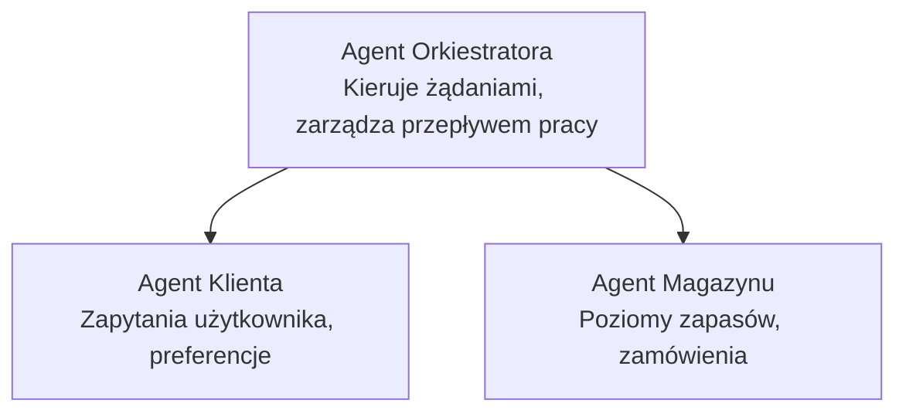

# Rozdział 5: Wieloagentowe rozwiązania AI

**📚 Kurs**: [AZD dla początkujących](../../README.md) | **⏱️ Czas trwania**: 2-3 godziny | **⭐ Poziom trudności**: Zaawansowany

---

## Przegląd

Ten rozdział obejmuje zaawansowane wzorce architektury wieloagentowej, orkiestrację agentów oraz wdrożenia AI gotowe do produkcji dla złożonych scenariuszy.

> Zweryfikowano na `azd 1.23.12` w marcu 2026.

## Cele nauki

Po ukończeniu tego rozdziału będziesz potrafił:
- Zrozumieć wzorce architektury wieloagentowej
- Wdrożyć skoordynowane systemy agentów AI
- Implementować komunikację między agentami
- Budować rozwiązania wieloagentowe gotowe do produkcji

---

## 📚 Lekcje

| # | Lekcja | Opis | Czas |
|---|--------|-------------|------|
| 1 | [Wieloagentowe rozwiązanie dla handlu detalicznego](../../examples/retail-scenario.md) | Kompletny przewodnik po implementacji | 90 min |
| 2 | [Wzorce koordynacji](../chapter-06-pre-deployment/coordination-patterns.md) | Strategie orkiestracji agentów | 30 min |
| 3 | [Wdrożenie szablonu ARM](../../examples/retail-multiagent-arm-template/README.md) | Wdrożenie jednoclickiem | 30 min |

---

## 🚀 Szybki start

```bash
# Opcja 1: Wdróż z szablonu
azd init --template agent-openai-python-prompty
azd up

# Opcja 2: Wdróż z manifestu agenta (wymaga rozszerzenia azure.ai.agents)
azd extension install azure.ai.agents
azd ai agent init -m agent-manifest.yaml
azd up
```

> **Które podejście?** Użyj `azd init --template`, aby rozpocząć od działającego przykładu. Użyj `azd ai agent init`, gdy masz własny manifest agenta. Zobacz [referencję AZD AI CLI](../chapter-08-production/production-ai-practices.md#azd-ai-cli-commands-and-extensions) dla pełnych informacji.

---

## 🤖 Architektura wieloagentowa


---

## 🎯 Prezentowane rozwiązanie: Wieloagentowe rozwiązanie dla handlu detalicznego

[Wieloagentowe rozwiązanie dla handlu detalicznego](../../examples/retail-scenario.md) demonstruje:

- **Agent klienta**: Obsługuje interakcje i preferencje użytkownika
- **Agent zapasów**: Zarządza stanem magazynowym i realizacją zamówień
- **Orkiestrator**: Koordynuje działanie agentów
- **Wspólna pamięć**: Zarządzanie kontekstem między agentami

### Używane usługi

| Usługa | Przeznaczenie |
|---------|---------|
| Modele Microsoft Foundry | Rozumienie języka |
| Azure AI Search | Katalog produktów |
| Cosmos DB | Stan i pamięć agenta |
| Container Apps | Hosting agentów |
| Application Insights | Monitorowanie |

---

## 🔗 Nawigacja

| Kierunek | Rozdział |
|-----------|---------|
| **Poprzedni** | [Rozdział 4: Infrastruktura](../chapter-04-infrastructure/README.md) |
| **Następny** | [Rozdział 6: Przed wdrożeniem](../chapter-06-pre-deployment/README.md) |

---

## 📖 Powiązane zasoby

- [Przewodnik po agentach AI](../chapter-02-ai-development/agents.md)
- [Praktyki AI w produkcji](../chapter-08-production/production-ai-practices.md)
- [Rozwiązywanie problemów AI](../chapter-07-troubleshooting/ai-troubleshooting.md)

---

<!-- CO-OP TRANSLATOR DISCLAIMER START -->
**Zastrzeżenie**:  
Ten dokument został przetłumaczony za pomocą usługi tłumaczenia AI [Co-op Translator](https://github.com/Azure/co-op-translator). Chociaż dążymy do dokładności, prosimy pamiętać, że automatyczne tłumaczenia mogą zawierać błędy lub niedokładności. Oryginalny dokument w języku źródłowym powinien być uważany za autorytatywne źródło. W przypadku informacji krytycznych zaleca się skorzystanie z profesjonalnego, ludzkiego tłumaczenia. Nie ponosimy odpowiedzialności za jakiekolwiek nieporozumienia lub błędne interpretacje wynikające z korzystania z tego tłumaczenia.
<!-- CO-OP TRANSLATOR DISCLAIMER END -->