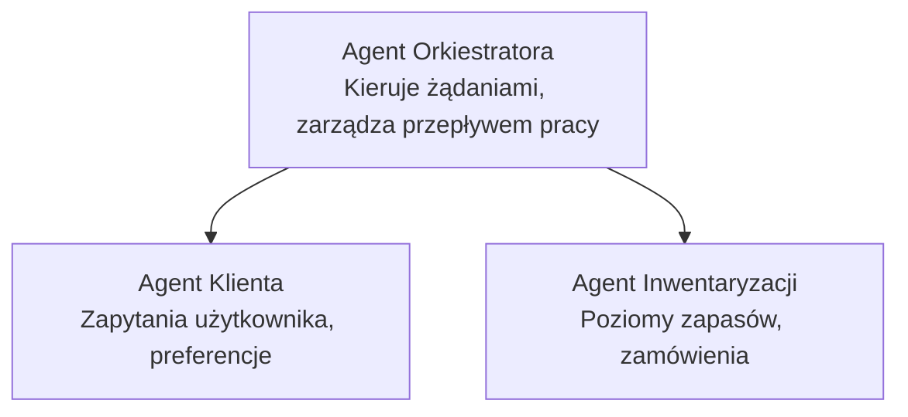

# Rozdział 5: Rozwiązania AI z wieloma agentami

**📚 Kurs**: [AZD dla początkujących](../../README.md) | **⏱️ Czas trwania**: 2-3 godziny | **⭐ Poziom trudności**: Zaawansowany

---

## Przegląd

Ten rozdział omawia zaawansowane wzorce architektury z wieloma agentami, orkiestrację agentów oraz gotowe do produkcji wdrożenia AI dla złożonych scenariuszy.

## Cele nauki

Po ukończeniu tego rozdziału będziesz:
- Rozumieć wzorce architektury wieloagentowej
- Wdrażać skoordynowane systemy agentów AI
- Implementować komunikację agent-agenta
- Budować gotowe do produkcji rozwiązania wieloagentowe

---

## 📚 Lekcje

| # | Lekcja | Opis | Czas |
|---|--------|-------------|------|
| 1 | [Rozwiązanie wieloagentowe dla handlu detalicznego](../../examples/retail-scenario.md) | Kompletny przegląd implementacji | 90 min |
| 2 | [Wzorce koordynacji](../chapter-06-pre-deployment/coordination-patterns.md) | Strategie orkiestracji agentów | 30 min |
| 3 | [Wdrożenie szablonu ARM](../../examples/retail-multiagent-arm-template/README.md) | Wdrożenie jednym kliknięciem | 30 min |

---

## 🚀 Szybki start

```bash
# Opcja 1: Wdrażaj z szablonu
azd init --template agent-openai-python-prompty
azd up

# Opcja 2: Wdrażaj z manifestu agenta (wymaga rozszerzenia azure.ai.agents)
azd extension install azure.ai.agents
azd ai agent init -m agent-manifest.yaml
azd up
```

> **Które podejście?** Użyj `azd init --template`, aby rozpocząć od działającego przykładu. Użyj `azd ai agent init`, gdy masz własny manifest agenta. Zobacz [referencję CLI AZD AI](../chapter-08-production/production-ai-practices.md#azd-ai-cli-commands-and-extensions) dla pełnych szczegółów.

---

## 🤖 Architektura wieloagentowa


---

## 🎯 Prezentowane rozwiązanie: Wieloagentowe rozwiązanie dla handlu detalicznego

[Wieloagentowe rozwiązanie dla handlu detalicznego](../../examples/retail-scenario.md) demonstruje:

- **Agent klienta**: Zarządza interakcjami z użytkownikiem i preferencjami
- **Agent magazynowy**: Zarządza zapasami i przetwarzaniem zamówień
- **Orkiestrator**: Koordynuje współpracę między agentami
- **Wspólna pamięć**: Zarządzanie kontekstem między agentami

### Używane usługi

| Usługa | Cel |
|---------|---------|
| Microsoft Foundry Models | Rozumienie języka |
| Azure AI Search | Katalog produktów |
| Cosmos DB | Stan i pamięć agenta |
| Container Apps | Hosting agentów |
| Application Insights | Monitorowanie |

---

## 🔗 Nawigacja

| Kierunek | Rozdział |
|-----------|---------|
| **Poprzedni** | [Rozdział 4: Infrastruktura](../chapter-04-infrastructure/README.md) |
| **Następny** | [Rozdział 6: Wstępne wdrożenie](../chapter-06-pre-deployment/README.md) |

---

## 📖 Powiązane zasoby

- [Przewodnik po agentach AI](../chapter-02-ai-development/agents.md)
- [Praktyki produkcyjne AI](../chapter-08-production/production-ai-practices.md)
- [Rozwiązywanie problemów z AI](../chapter-07-troubleshooting/ai-troubleshooting.md)

---

<!-- CO-OP TRANSLATOR DISCLAIMER START -->
**Zastrzeżenie**:
Niniejszy dokument został przetłumaczony za pomocą usługi tłumaczenia AI [Co-op Translator](https://github.com/Azure/co-op-translator). Chociaż dążymy do dokładności, prosimy pamiętać, że automatyczne tłumaczenia mogą zawierać błędy lub nieścisłości. Oryginalny dokument w jego rodzimym języku należy traktować jako źródło autorytatywne. W przypadku informacji kluczowych zalecane jest skorzystanie z profesjonalnego tłumaczenia wykonanego przez człowieka. Nie ponosimy odpowiedzialności za jakiekolwiek nieporozumienia lub błędne interpretacje wynikające z korzystania z tego tłumaczenia.
<!-- CO-OP TRANSLATOR DISCLAIMER END -->