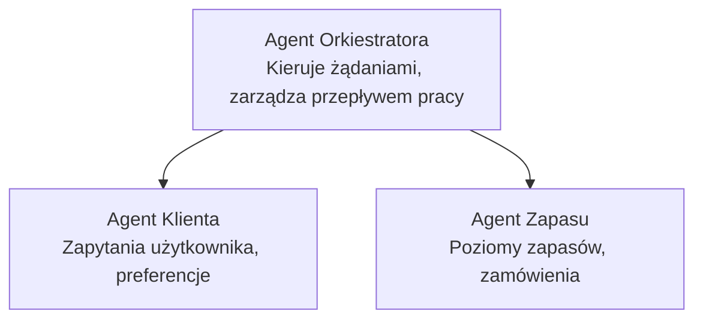

# Rozdział 5: Wieloagentowe rozwiązania AI

**📚 Kurs**: [AZD dla początkujących](../../README.md) | **⏱️ Czas trwania**: 2-3 godziny | **⭐ Poziom trudności**: Zaawansowany

---

## Przegląd

Ten rozdział omawia zaawansowane wzorce architektury wieloagentowej, koordynację agentów oraz wdrożenia AI gotowe do produkcji w złożonych scenariuszach.

> Zweryfikowano z `azd 1.27.1` w lipcu 2026.

## Cele nauki

Po ukończeniu tego rozdziału będziesz potrafił:
- Zrozumieć wzorce architektury wieloagentowej
- Wdrażać skoordynowane systemy agentów AI
- Implementować komunikację między agentami
- Budować rozwiązania wieloagentowe gotowe do produkcji

---

## 📚 Lekcje

| # | Lekcja | Opis | Czas |
|---|--------|-------------|------|
| 1 | [Podstawy wieloagentowości](multi-agent-basics.md) | Praktyczne: wdrożenie działającej aplikacji wieloagentowej za pomocą `azd up` | 45 min |
| 2 | [Wzorce koordynacji](../chapter-06-pre-deployment/coordination-patterns.md) | Strategie orkiestracji agentów (kontynuacja w Rozdziale 6) | 30 min |
| 3 | [Wdrożenie szablonu ARM](../../examples/retail-multiagent-arm-template/README.md) | Przykład wdrożenia jednym kliknięciem | 30 min |

> **Zacznij od Lekcji 1.** To jedyna w pełni praktyczna lekcja, którą można wdrożyć w tym rozdziale. Lekcja 2 znajduje się w Rozdziale 6 (jest współdzielona z planowaniem przedwdrożeniowym), a [Rozwiązanie wieloagentowe dla handlu detalicznego](../../examples/retail-scenario.md) to szablon architektury — odniesienie projektowe, a nie szablon do wykonania jednym poleceniem.

---

## 🚀 Szybki start

```bash
# Opcja 1: Wdróż z szablonu
azd init --template agent-openai-python-prompty
azd up

# Opcja 2: Wdróż z manifestu agenta (wymaga rozszerzenia azure.ai.agents)
azd extension install azure.ai.agents
azd ai agent init -m agent-manifest.yaml
azd up
```

> **Które podejście?** Użyj `azd init --template`, aby zacząć od działającego przykładu. Użyj `azd ai agent init`, gdy posiadasz własny manifest agenta. Zobacz [referencję AZD AI CLI](../chapter-08-production/production-ai-practices.md#azd-ai-cli-commands-and-extensions) dla pełnych szczegółów.

---

## 🤖 Architektura wieloagentowa



---

## 🎯 Wyróżnione rozwiązanie: wieloagentowy system dla handlu detalicznego

[Rozwiązanie wieloagentowe dla handlu detalicznego](../../examples/retail-scenario.md) demonstruje:

- **Agent klienta**: Obsługuje interakcje z użytkownikiem i jego preferencje
- **Agent zapasów**: Zarządza stanem magazynowym i obsługą zamówień
- **Orkiestrator**: Koordynuje działania między agentami
- **Wspólna pamięć**: Zarządzanie kontekstem pomiędzy agentami

### Używane usługi

| Usługa | Cel |
|---------|---------|
| Microsoft Foundry Models | Rozumienie języka |
| Azure AI Search | Katalog produktów |
| Cosmos DB | Stan i pamięć agenta |
| Container Apps | Hosting agenta |
| Application Insights | Monitorowanie |

---

## 🔗 Nawigacja

| Kierunek | Rozdział |
|-----------|---------|
| **Poprzedni** | [Rozdział 4: Infrastruktura](../chapter-04-infrastructure/README.md) |
| **Następny** | [Rozdział 6: Przed wdrożeniem](../chapter-06-pre-deployment/README.md) |

---

## 📖 Powiązane zasoby

- [Przewodnik po agentach AI](../chapter-02-ai-development/agents.md)
- [Praktyki AI w produkcji](../chapter-08-production/production-ai-practices.md)
- [Rozwiązywanie problemów AI](../chapter-07-troubleshooting/ai-troubleshooting.md)

---

<!-- CO-OP TRANSLATOR DISCLAIMER START -->
**Zastrzeżenie**:
Niniejszy dokument został przetłumaczony za pomocą usługi tłumaczenia AI [Co-op Translator](https://github.com/Azure/co-op-translator). Choć dążymy do dokładności, prosimy pamiętać, że automatyczne tłumaczenia mogą zawierać błędy lub niedokładności. Oryginalny dokument w jego języku źródłowym należy uznawać za autorytatywne źródło. W przypadku informacji krytycznych zalecane jest skorzystanie z profesjonalnego tłumaczenia wykonanego przez człowieka. Nie ponosimy odpowiedzialności za jakiekolwiek nieporozumienia lub błędne interpretacje wynikające z użycia tego tłumaczenia.
<!-- CO-OP TRANSLATOR DISCLAIMER END -->