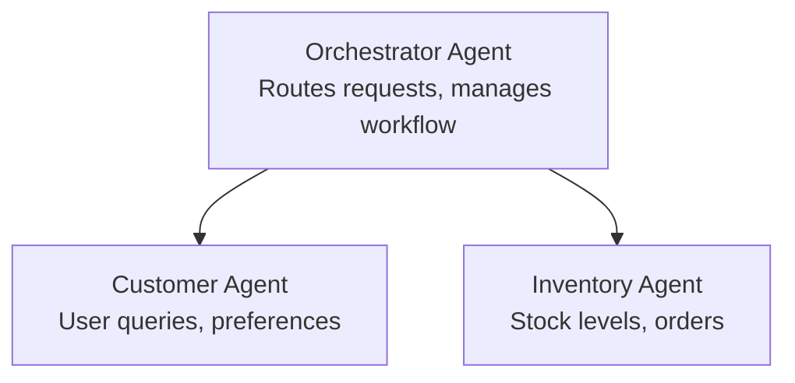

# Rozdział 5: Rozwiązania AI z wieloma agentami

**📚 Kurs**: [AZD dla początkujących](../../README.md) | **⏱️ Czas trwania**: 2-3 godziny | **⭐ Poziom trudności**: Zaawansowany

---

## Przegląd

Ten rozdział omawia zaawansowane wzorce architektury wieloagentowej, orkiestrację agentów oraz produkcyjne wdrożenia AI dla złożonych scenariuszy.

> Instrukcje poleceń sprawdzono względem udostępnionego odniesienia `azd 1.37.2`. Wdrożenia w chmurze nie zostały wykonane.

## Cele nauki

Po ukończeniu tego rozdziału będziesz:
- Rozumieć wzorce architektury wieloagentowej
- Wdrażać skoordynowane systemy agentów AI
- Implementować komunikację między agentami
- Budować produkcyjne rozwiązania wieloagentowe

---

## 📚 Lekcje

| # | Lekcja | Opis | Czas |
|---|--------|-------------|------|
| 1 | [Podstawy wieloagentowości](multi-agent-basics.md) | Praktycznie: wdrożenie działającej aplikacji wieloagentowej z `azd up` | 45 min |
| 2 | [Wzorce koordynacji](../chapter-06-pre-deployment/coordination-patterns.md) | Strategie orkiestracji agentów (kontynuowane w Rozdziale 6) | 30 min |
| 3 | [Wdrożenie szablonu ARM](../../examples/retail-multiagent-arm-template/README.md) | Przykład wdrożenia jednym kliknięciem | 30 min |

> **Rozpocznij od Lekcji 1.** Jest to jedyna w pełni praktyczna, gotowa do wdrożenia lekcja w tym rozdziale. Lekcja 2 znajduje się w Rozdziale 6 (jest współdzielona z planowaniem przedwdrożeniowym), a [Rozwiązanie wieloagentowe dla handlu detalicznego](../../examples/retail-scenario.md) to szablon architektury — odniesienie projektowe, a nie szablon jednego polecenia.

---

## 🚀 Szybki start

```bash
# Option 1: Deploy the multi-agent template used in Lesson 1
azd init --template Azure-Samples/contoso-creative-writer .
azd up

# Option 2: Initialize a Foundry agent interactively with the GA bundle
azd ext install microsoft.foundry
azd ai agent init
azd up
```

> **Które podejście?** Użyj `azd init --template`, aby zacząć od działającego przykładu. Użyj `azd ai agent init` interaktywnie lub `azd ai agent init --template <path-to-azure.yaml>`, aby zaadaptować obecny projekt agenta. Zobacz [odniesienie AZD AI CLI](../chapter-08-production/production-ai-practices.md#azd-ai-cli-commands-and-extensions) dla wymagań wersji i migracji oceny.

Uruchom te alternatywy w osobnych pustych folderach. Przepływ prac GA Foundry wymaga `azd >= 1.37.0`; jego interaktywny przebieg nie generuje niestandardowego potoku Service Bus w lekcji koordynacji. Do testów lokalnych, wdrożenia kodu i porządkowania nowych kontra ponownie używanych projektów, postępuj zgodnie z [przewodnikiem po hostowanym agencie](../chapter-02-ai-development/microsoft-foundry-integration.md#hosted-agent-walkthrough-ga).

---

## 🤖 Architektura wieloagentowa


```mermaid
graph TD
    Orchestrator[Orchestrator Agent<br/>Routes requests, manages workflow] --> Customer[Customer Agent<br/>User queries, preferences]
    Orchestrator --> Inventory[Inventory Agent<br/>Stock levels, orders]
```

---

## 🎯 Rozwiązanie wyróżnione: Wieloagent dla handlu detalicznego

Przykład [Retail Multi-Agent Solution](../../examples/retail-scenario.md) demonstruje:

- **Agent Klienta**: Obsługuje interakcje i preferencje użytkownika
- **Agent Inwentaryzacji**: Zarządza stanem magazynowym i realizacją zamówień
- **Orkiestrator**: Koordynuje działanie agentów
- **Wspólna Pamięć**: Zarządzanie kontekstem między agentami

### Użyte usługi

| Usługa | Cel |
|---------|---------|
| Microsoft Foundry Models | Rozumienie języka |
| Azure AI Search | Katalog produktów |
| Cosmos DB | Stan i pamięć agenta |
| Container Apps | Hostowanie agentów |
| Application Insights | Monitorowanie |

---

## 🔗 Nawigacja

| Kierunek | Rozdział |
|-----------|---------|
| **Poprzedni** | [Rozdział 4: Infrastruktura](../chapter-04-infrastructure/README.md) |
| **Następny** | [Rozdział 6: Przed wdrożeniem](../chapter-06-pre-deployment/README.md) |

---

## 📖 Powiązane zasoby

- [Przewodnik po agentach AI](../chapter-02-ai-development/agents.md)
- [Praktyki produkcji AI](../chapter-08-production/production-ai-practices.md)
- [Rozwiązywanie problemów AI](../chapter-07-troubleshooting/ai-troubleshooting.md)

---

<!-- CO-OP TRANSLATOR DISCLAIMER START -->
**Zastrzeżenie**:
Niniejszy dokument został przetłumaczony za pomocą usługi tłumaczenia AI [Co-op Translator](https://github.com/Azure/co-op-translator). Choć dążymy do dokładności, prosimy pamiętać, że automatyczne tłumaczenia mogą zawierać błędy lub niedokładności. Oryginalny dokument w jego języku źródłowym należy uznawać za autorytatywne źródło. W przypadku informacji krytycznych zalecane jest skorzystanie z profesjonalnego tłumaczenia wykonanego przez człowieka. Nie ponosimy odpowiedzialności za jakiekolwiek nieporozumienia lub błędne interpretacje wynikające z użycia tego tłumaczenia.
<!-- CO-OP TRANSLATOR DISCLAIMER END -->