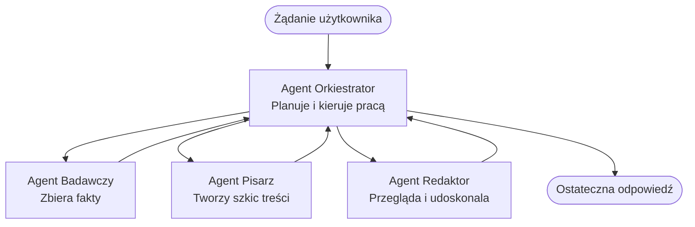

# Podstawy systemów wieloagentowych - Wdróż swój pierwszy skoordynowany system AI

**Nawigacja po rozdziale:**
- **📚 Strona główna kursu**: [AZD dla początkujących](../../README.md)
- **📖 Obecny rozdział**: Rozdział 5 - Rozwiązania AI wieloagentowe
- **⬅️ Poprzedni**: [Rozdział 4: Infrastruktura](../chapter-04-infrastructure/README.md)
- **➡️ Następny**: [Wzorce koordynacji](../chapter-06-pre-deployment/coordination-patterns.md)

> Sprawdzone w wersji `azd 1.27.1` w lipcu 2026.

## Wprowadzenie

W poprzednich rozdziałach wdrożyłeś pojedynczą aplikację — a w Rozdziale 2 wdrożyłeś pojedynczego agenta AI. Ta lekcja robi kolejny krok: wdrożenie **systemu wieloagentowego**, gdzie kilku wyspecjalizowanych agentów współpracuje, aby rozwiązać problem, z którym pojedynczy agent nie poradziłby sobie dobrze sam.

Dobra wiadomość dla początkujących: **nie potrzebujesz nowych poleceń.** Rozwiązanie wieloagentowe to nadal projekt azd. Będziesz używać `azd init`, `azd up`, testować i `azd down` — dokładnie ten sam proces, który już znasz. Zmienia się *kształt* aplikacji wewnątrz.

## Cele nauki

Pod koniec tej lekcji:
- Zrozumiesz, co oznacza "wieloagentowy" i kiedy warto zastosować tę dodatkową złożoność
- Rozpoznasz typowe role w systemie wieloagentowym (koordynator + specjaliści)
- Wdrożysz działający szablon wieloagentowy za pomocą `azd up`
- Poznasz zasoby Azure wspierające aplikację wieloagentową
- Będziesz wiedzieć, jak zweryfikować, dostosować i bezpiecznie zdemontować rozwiązanie

## Rezultaty nauki

Po ukończeniu tej lekcji będziesz potrafił:
- Wyjaśnić różnicę między pojedynczym agentem a systemem wieloagentowym
- Wybrać między pojedynczym agentem z narzędziami a prawdziwym projektem wieloagentowym
- Wdrożyć i przetestować szablon wieloagentowy od początku do końca za pomocą azd
- Zidentyfikować, gdzie działa każdy agent i jak się komunikują
- Usunąć wszystkie zasoby, aby uniknąć dalszych opłat

---

## Czym jest system wieloagentowy?

Pojedynczy agent AI to jeden model z zestawem instrukcji i (opcjonalnie) narzędzi. Dobrze działa w zadaniach skoncentrowanych. Ale gdy zadanie rośnie — badania, potem pisanie, potem redakcja, potem weryfikowanie faktów — upychanie wszystkiego do jednego prompta sprawia, że agent działa wolniej, jest mniej niezawodny i trudniejszy do debugowania.

**System wieloagentowy** dzieli pracę między specjalistów, którzy wykonują każde zadanie dobrze, koordynowanych przez koordynatora:



### Dwie role, które zawsze zobaczysz

| Rola | Zadanie | Przykład |
|------|---------|----------|
| **Koordynator** | Decyduje *co będzie dalej* i kieruje pracą między agentami | "Najpierw badania, potem pisanie, potem redakcja" |
| **Specjalista** | Wykonuje jedno skoncentrowane zadanie i zwraca wynik | "badacz", który tylko zbiera fakty |

### Czy naprawdę potrzebujesz wielu agentów?

Zacznij prosto. Sięgaj po wieloagentowość **tylko**, gdy zachodzi jedno z poniższych:

- ✅ Zadanie ma **wyraźne etapy**, które korzystają z różnych instrukcji (badania kontra pisanie kontra przegląd)
- ✅ Chcesz, aby specjaliści działali **równolegle**, oszczędzając czas
- ✅ Różne etapy potrzebują **różnych narzędzi lub źródeł danych**
- ✅ Potrzebujesz, aby każdy etap był **testowalny i debugowalny oddzielnie**

Jeśli twoje zadanie to pojedyncze pytanie i odpowiedź lub proste wywołanie narzędzia, **pojedynczy agent z narzędziami** (Rozdział 2) jest prostszy, tańszy i łatwiejszy w obsłudze.

> **Wskazówka dla początkujących:** "Więcej agentów" nie znaczy "lepiej." Każdy agent dodaje opóźnienie, koszt i kolejny element do monitorowania. Dodawaj agentów tylko, gdy problem wyraźnie dzieli się na części.

---

## Dwa sposoby budowy wieloagentowego systemu na Azure

| Podejście | Co to jest | Najlepsze dla |
|----------|------------|--------------|
| **Pojedynczy agent + narzędzia** | Jeden agent Foundry wywołujący funkcje/narzędzia | Proste przepływy pracy, zaczynanie |
| **Wielu skoordynowanych agentów** | Kilku agentów z koordynatorem | Wyraźne etapy, praca równoległa, specjalizacja |

Ta lekcja skupia się na drugim podejściu, wykorzystując **gotowy szablon**, abyś mógł zobaczyć działający system wieloagentowy, zanim zbudujesz własny.

---

## Praktyka: Wdróż działającą aplikację wieloagentową

Wdrożymy **Contoso Creative Writer**, oficjalny przykładowy projekt Azure, który używa wielu agentów (badacz, pisarz, redaktor) koordynowanych, aby stworzyć artykuł. To świetna pierwsza aplikacja wieloagentowa, gdyż role są łatwe do zrozumienia.

### Krok 1: Zainicjuj szablon

```bash
# Utwórz folder roboczy
mkdir creative-writer && cd creative-writer

# Zainicjuj z oficjalnego szablonu wieloagentowego
azd init --template contoso-creative-writer
```

> Przeglądaj więcej szablonów wieloagentowych w [Fascynującej galerii AZD AI](https://azure.github.io/awesome-azd/?tags=ai) w dowolnym momencie. Inne przyjazne dla początkujących opcje to `get-started-with-ai-agents` i `azure-ai-travel-agents`.

### Krok 2: Uwierzytelnij się

```bash
# Wymagane dla workflow azd
azd auth login
```

### Krok 3: Utwórz środowisko

```bash
azd env new dev
```

### Krok 4: Podgląd, a następnie wdrożenie

```bash
# Zobacz, co zostanie utworzone przed wydaniem czegokolwiek (zalecane)
azd provision --preview

# Przygotuj infrastrukturę i wdroż wszystkich agentów w jednym kroku
azd up
```

`azd up` poprosi o subskrypcję i region, a następnie utworzy zasoby Azure i wdroży aplikację. Wdrożenia AI mogą trwać dłużej niż prosta aplikacja webowa — jeśli wdrażasz większe modele, możesz wydłużyć limit czasu wdrożenia:

```bash
azd deploy --timeout 1800
```

> **Uwaga na koszty i pojemność:** Aplikacje wieloagentowe wdrażają modele AI, które zużywają limit i generują koszty. Jeśli `azd up` nie powiedzie się z powodu limitu modelu, zobacz [Rozwiązywanie problemów AI](../chapter-07-troubleshooting/ai-troubleshooting.md) dla poprawek regionu i limitu oraz Rozdział 6 [Planowanie pojemności](../chapter-06-pre-deployment/capacity-planning.md).

---

## Zrozumienie wdrożonych elementów

Typowa aplikacja wieloagentowa jak ta tworzy zestaw zasobów Azure, które odpowiadają bezpośrednio odpowiedzialnościom z powyższego diagramu:

| Zasób | Dlaczego jest |
|-------|--------------|
| **Microsoft Foundry / Modele** | Hostuje modele językowe, których używa każdy agent |
| **Azure AI Search** | Dostarcza agentowi badawczemu ugruntowane dane do wyszukiwania |
| **Container Apps** (lub App Service) | Hostuje kod koordynatora i agentów |
| **Cosmos DB** (w niektórych przykładach) | Przechowuje stan/wspólną pamięć przekazywaną między agentami |
| **Application Insights** | Śledzi żądania *między* agentami, by ułatwić debugowanie przepływu |

### Jak agenci się komunikują

W większości azd przykładów wieloagentowych **koordynator działa w twoim kodzie aplikacji** (na przykład używając frameworka takiego jak Semantic Kernel lub Microsoft Agent Framework). Koordynator wywołuje kolejnych specjalistycznych agentów, przekazuje wyniki i składa ostateczną odpowiedź. Agenci dzielą się kontekstem przez:

- **Wywołania funkcji/narzędzi** — koordynator wywołuje specjalistę i otrzymuje wynik
- **Wspólną pamięć** — baza danych (często Cosmos DB) przechowuje stan, który oba agenty mogą odczytać
- **Wiadomości/wydarzenia** — dla luźniejszego powiązania agenci komunikują się przez kolejkę lub Service Bus

> **Dlaczego to ma znaczenie przy debugowaniu:** ponieważ każdy etap jest osobny, Application Insights pokazuje *który* agent był wolny lub zawiódł. To jedna z głównych przyczyn podziału pracy między agentów.

---

## Zweryfikuj wdrożenie

Potwierdź, że system faktycznie działa przed kontynuacją:

```bash
# Pokaż wdrożone punkty końcowe
azd show

# Otwórz pulpit monitorowania aplikacji
azd monitor

# Śledź logi, jeśli coś wygląda podejrzanie
azd monitor --logs
```

Następnie otwórz URL aplikacji z `azd show` i wykonaj żądanie, które aktywuje wszystkich agentów (w Creative Writer, poproś o napisanie krótkiego artykułu na jakiś temat). W **wyszukiwaniu transakcji** w Application Insights powinieneś zobaczyć rozwidlenie żądania na kroki badacza, pisarza i redaktora.

**Kryteria sukcesu:**
- ✅ `azd show` wyświetla dostępny punkt końcowy
- ✅ Żądanie daje wynik, który wyraźnie przeszedł przez wiele etapów
- ✅ Application Insights pokazuje śledzenie dla więcej niż jednego etapu agenta

---

## Dostosuj: Dodaj lub zmodyfikuj agenta

Ponieważ każdy agent to po prostu instrukcje plus narzędzia, dostosowanie jest proste:

1. **Znajdź definicje agentów** w szablonie (często folder `prompts/`, `agents/` lub pliki `*.prompty`).
2. **Dostosuj instrukcje agenta** — na przykład, powiedz agentowi redakcyjnemu, by wymuszał określony ton lub liczbę słów.
3. **Wdroż ponownie tylko kod** (infrastruktura pozostaje bez zmian):

   ```bash
   azd deploy
   ```

Aby pójść dalej i budować agentów z *własnego* manifestu, użyj rozszerzenia agenta i całego cyklu życia:

```bash
azd extension install azure.ai.agents
azd ai agent init -m agent-manifest.yaml
azd up
azd ai agent invoke      # test, z pomiarem czasu odpowiedzi
```

Zobacz [Rozdział 2: Agenci](../chapter-02-ai-development/agents.md) oraz [referencję AZD AI CLI](../chapter-08-production/production-ai-practices.md#azd-ai-cli-commands-and-extensions) dla pełnego cyklu życia agenta (`invoke`, `eval generate`, `optimize`, `delete`).

---

## Sprzątanie

Aplikacje wieloagentowe uruchamiają wiele płatnych usług. Zniszcz wszystko, gdy skończysz:

```bash
azd down --force --purge
```

Flaga `--purge` usuwa także zasoby AI w stanie miękkiego usunięcia (np. konta Foundry/Azure AI Services), więc nie blokują przyszłego ponownego wdrożenia ani nie generują kosztów.

---

## Uwagi o produkcyjnych systemach wieloagentowych

[Retail Multi-Agent Solution](../../examples/retail-scenario.md) w tym repozytorium to **schemat architektury**, nie szablon jednopoleceniowy — dokumentuje jak system produkcyjny w handlu detalicznym *mógłby* być zbudowany (i zaznacza, że pełna budowa to poważne przedsięwzięcie). Użyj go jako odniesienie projektowego *po* wdrożeniu tu działającego przykładu. Dla zagadnień produkcyjnych (odporność, koszty, monitorowanie, zarządzanie) kontynuuj do [Rozdziału 8: Praktyki AI w produkcji](../chapter-08-production/production-ai-practices.md).

---

## Podsumowanie

- System wieloagentowy dzieli pracę między wyspecjalizowanych agentów koordynowanych przez koordynatora.
- Używaj go tylko wtedy, gdy zadanie ma wyraźne etapy, równoległość lub różne narzędzia na każdym etapie — w przeciwnym razie wybierz pojedynczego agenta.
- Proces azd jest taki sam: `azd init` → `azd up` → test → `azd down`.
- Prawdziwy szablon jak `contoso-creative-writer` pozwala dzisiaj zobaczyć i dostosować działającą aplikację wieloagentową.
- Śledzenie w Application Insights między agentami to jedna z największych praktycznych zalet projektu wieloagentowego.

---

## 🔗 Nawigacja

| Kierunek | Lekcja |
|-----------|--------|
| **Poprzedni** | [Rozdział 4: Infrastruktura](../chapter-04-infrastructure/README.md) |
| **Następny** | [Wzorce koordynacji](../chapter-06-pre-deployment/coordination-patterns.md) |

## 📖 Powiązane zasoby

- [Przewodnik po agentach AI](../chapter-02-ai-development/agents.md)
- [Wzorce koordynacji](../chapter-06-pre-deployment/coordination-patterns.md)
- [Praktyki AI w produkcji](../chapter-08-production/production-ai-practices.md)
- [Rozwiązywanie problemów AI](../chapter-07-troubleshooting/ai-troubleshooting.md)

---

<!-- CO-OP TRANSLATOR DISCLAIMER START -->
**Zastrzeżenie**:
Niniejszy dokument został przetłumaczony za pomocą usługi tłumaczenia AI [Co-op Translator](https://github.com/Azure/co-op-translator). Choć dążymy do dokładności, prosimy pamiętać, że automatyczne tłumaczenia mogą zawierać błędy lub niedokładności. Oryginalny dokument w jego języku źródłowym należy uznawać za autorytatywne źródło. W przypadku informacji krytycznych zalecane jest skorzystanie z profesjonalnego tłumaczenia wykonanego przez człowieka. Nie ponosimy odpowiedzialności za jakiekolwiek nieporozumienia lub błędne interpretacje wynikające z użycia tego tłumaczenia.
<!-- CO-OP TRANSLATOR DISCLAIMER END -->