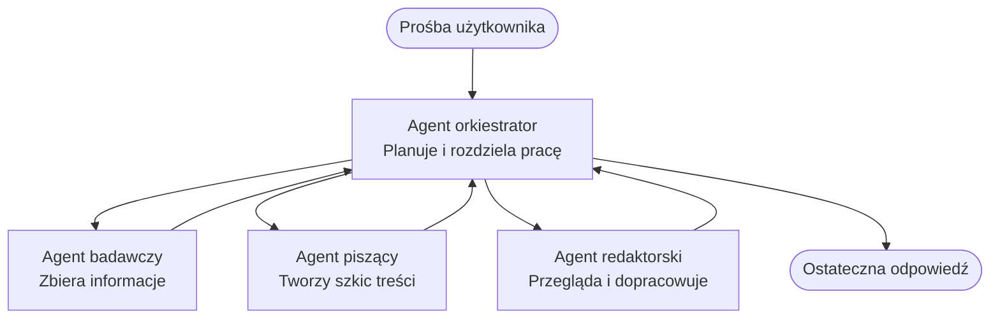

# Podstawy systemów wieloagentowych - Wdróż swój pierwszy skoordynowany system AI

**Nawigacja rozdziału:**
- **📚 Strona kursu**: [AZD For Beginners](../../README.md)
- **📖 Bieżący rozdział**: Rozdział 5 - Rozwiązania AI wieloagentowe
- **⬅️ Poprzedni**: [Rozdział 4: Infrastruktura](../chapter-04-infrastructure/README.md)
- **➡️ Następny**: [Wzorce koordynacji](../chapter-06-pre-deployment/coordination-patterns.md)

> Zwalidowano przy użyciu `azd 1.25.6` w czerwcu 2026.

## Wprowadzenie

W poprzednich rozdziałach wdrożyłeś jedną aplikację—a w Rozdziale 2 wdrożyłeś jednego agenta AI. Ta lekcja robi kolejny krok: wdrożenie **systemu wieloagentowego**, w którym kilku wyspecjalizowanych agentów współpracuje, aby rozwiązać problem, którego pojedynczy agent nie poradziłby sobie dobrze sam.

Dobra wiadomość dla początkujących: **nie potrzebujesz nowych poleceń.** Rozwiązanie wieloagentowe to nadal projekt azd. Będziesz wykonywać `azd init`, `azd up`, testować i `azd down`—dokładnie ten sam przebieg pracy, który już znasz. Zmienia się jedynie *kształt* aplikacji wewnątrz.

## Cele nauki

Po zakończeniu tej lekcji będziesz:
- Rozumieć, co oznacza „wieloagentowy” i kiedy warto ponieść dodatkową złożoność
- Rozpoznawać typowe role w systemie wieloagentowym (orchestrator + specjaliści)
- Wdrożyć rzeczywisty, działający szablon wieloagentowy za pomocą `azd up`
- Rozumieć zasoby Azure obsługujące aplikację wieloagentową
- Wiedzieć, jak zweryfikować, spersonalizować i bezpiecznie usunąć rozwiązanie

## Rezultaty nauczania

Po ukończeniu tej lekcji będziesz potrafić:
- Wyjaśnić różnicę między pojedynczym agentem a systemem wieloagentowym
- Wybrać między pojedynczym agentem z narzędziami a prawdziwym projektem wieloagentowym
- Wdrożyć i przetestować szablon wieloagentowy end-to-end przy użyciu azd
- Zidentyfikować, gdzie działa każdy agent i jak się komunikują
- Usunąć wszystkie zasoby, aby uniknąć dalszych opłat

---

## Czym jest system wieloagentowy?

Pojedynczy agent AI to jeden model z zestawem instrukcji i (opcjonalnie) pewnymi narzędziami. Dobrze sprawdza się w ukierunkowanych zadaniach. Ale w miarę jak zadanie rośnie—badania, potem pisanie, potem redakcja, potem sprawdzanie faktów—upychając wszystko do jednego prompta sprawiasz, że agent staje się wolniejszy, mniej niezawodny i trudniejszy do debugowania.

System wieloagentowy dzieli pracę na specjalistów, z których każdy wykonuje jedno zadanie dobrze, koordynowanych przez orchestratora:



### Dwie role, które zawsze zobaczysz

| Role | Zadanie | Przykład |
|------|---------|---------|
| **Orchestrator** | Decyduje *co dzieje się dalej* i kieruje pracą między agentami | "Najpierw badania, potem pisanie, potem redakcja" |
| **Specjalista** | Wykonuje jedno skoncentrowane zadanie i zwraca wynik | "badacz", który jedynie zbiera fakty |

### Czy rzeczywiście potrzebujesz wielu agentów?

Zacznij prosto. Sięgaj po wieloagentowość **tylko** wtedy, gdy spełniony jest jeden z poniższych warunków:

- ✅ Zadanie ma **wyraźne etapy**, które korzystają z różnych instrukcji (badania vs. pisanie vs. przegląd)
- ✅ Chcesz, aby specjaliści działali **równolegle**, aby oszczędzić czas
- ✅ Różne kroki wymagają **różnych narzędzi lub źródeł danych**
- ✅ Potrzebujesz, aby każdy etap był **niezależnie testowalny i debugowalny**

Jeśli Twoje zadanie to pojedyncze pytanie i odpowiedź lub proste wywołanie narzędzia, **pojedynczy agent z narzędziami** (Rozdział 2) jest prostszy, tańszy i łatwiejszy w obsłudze.

> **Wskazówka dla początkujących:** „Więcej agentów” nie znaczy „lepiej.” Każdy agent dodaje opóźnienie, koszt i nowe rzeczy do monitorowania. Dodawaj agentów tylko wtedy, gdy problem wyraźnie dzieli się na części.

---

## Dwa sposoby budowy systemu wieloagentowego w Azure

| Podejście | Co to jest | Najlepsze zastosowanie |
|----------|-----------|------------------------|
| **Pojedynczy agent + narzędzia** | Jeden agent Foundry, który wywołuje funkcje/narzędzia | Proste przepływy pracy, początki |
| **Wiele skoordynowanych agentów** | Kilku agentów z orchestrator`em | Wyraźne etapy, praca równoległa, specjalizacja |

Ta lekcja koncentruje się na drugim podejściu, używając **gotowego szablonu**, abyś mógł zobaczyć działający system wieloagentowy zanim zbudujesz własny.

---

## Praktyczne ćwiczenie: Wdróż działającą aplikację wieloagentową

Wdrożymy **Contoso Creative Writer**, oficjalny przykład Azure, który używa wielu agentów (badacz, autor, redaktor) skoordynowanych w celu wygenerowania artykułu. To doskonała pierwsza aplikacja wieloagentowa, ponieważ role są łatwe do zrozumienia.

### Krok 1: Zainicjuj szablon

```bash
# Utwórz folder roboczy
mkdir creative-writer && cd creative-writer

# Zainicjalizuj na podstawie oficjalnego szablonu wieloagentowego
azd init --template contoso-creative-writer
```

> Przeglądaj więcej szablonów wieloagentowych w dowolnym momencie w [Awesome AZD AI gallery](https://azure.github.io/awesome-azd/?tags=ai). Inne przyjazne dla początkujących opcje to `get-started-with-ai-agents` i `azure-ai-travel-agents`.

### Krok 2: Uwierzytelnianie

```bash
# Wymagane dla przepływów pracy azd
azd auth login
```

### Krok 3: Utwórz środowisko

```bash
azd env new dev
```

### Krok 4: Podejrzyj, a następnie wdroż

```bash
# Zobacz, co zostanie utworzone, zanim wydasz cokolwiek (zalecane)
azd provision --preview

# Utwórz infrastrukturę i wdroż wszystkie agenty w jednym kroku
azd up
```

`azd up` poprosi o wybranie subskrypcji i regionu, a następnie zinfrastrukturuje zasoby Azure i wdroży aplikację. Wdrożenia AI mogą potrwać dłużej niż prosta aplikacja webowa—jeśli wdrażasz większe modele, możesz przedłużyć timeout wdrożenia:

```bash
azd deploy --timeout 1800
```

> **Uwaga dotycząca kosztów i zasobów:** Aplikacje wieloagentowe wdrażają modele AI, które wykorzystują limity i generują koszty. Jeśli `azd up` zakończy się niepowodzeniem z powodu limitu modeli, zobacz [AI Troubleshooting](../chapter-07-troubleshooting/ai-troubleshooting.md) w celu naprawy regionu i limitów oraz Rozdział 6 [Planowanie pojemności](../chapter-06-pre-deployment/capacity-planning.md).

---

## Zrozumienie tego, co wdrożyłeś

Typowa aplikacja wieloagentowa, taka jak ta, tworzy zestaw zasobów Azure, które odpowiadają odpowiedzialnościom pokazanym na powyższym diagramie:

| Zasób | Dlaczego jest potrzebny |
|-------|-------------------------|
| **Microsoft Foundry / Models** | Hostuje modele językowe, których używa każdy agent |
| **Azure AI Search** | Dostarcza agentowi badawczemu ugruntowane dane do wyszukiwania |
| **Container Apps** (lub App Service) | Hostuje orchestratora i kod agentów |
| **Cosmos DB** (w niektórych przykładach) | Przechowuje współdzielony stan/pamięć przekazywaną między agentami |
| **Application Insights** | Śledzi żądania *między* agentami, abyś mógł debugować przepływ |

### Jak agenci się komunikują

W większości przykładów azd wieloagentowych, **orchestrator działa w kodzie Twojej aplikacji** (na przykład przy użyciu frameworka takiego jak Semantic Kernel lub Microsoft Agent Framework). Orchestrator wywołuje każdego specjalistycznego agenta po kolei, przekazuje wyniki i składa końcową odpowiedź. Agenci współdzielą kontekst poprzez:

- **Wywołania funkcji/narzędzi** — orchestrator wywołuje specjalistę i otrzymuje wynik zwrotny
- **Wspólną pamięć** — baza danych (często Cosmos DB) przechowuje stan, który mogą odczytywać oba agenty
- **Wiadomości/zdarzenia** — przy luźniejszym powiązaniu agenci komunikują się za pomocą kolejki lub Service Bus

> **Dlaczego to ma znaczenie dla debugowania:** ponieważ każdy krok jest oddzielny, Application Insights pokaże Ci *który* agent był wolny lub zawiódł. To główny powód dzielenia pracy między agentów.

---

## Weryfikacja wdrożenia

Potwierdź, że system faktycznie działa, zanim przejdziesz dalej:

```bash
# Pokaż wdrożone punkty końcowe
azd show

# Otwórz panel monitorowania aplikacji
azd monitor

# Śledź logi, jeśli coś wygląda nie tak
azd monitor --logs
```

Następnie otwórz adres URL aplikacji z `azd show` i wypróbuj żądanie, które angażuje wszystkich agentów (dla Creative Writer poproś o napisanie krótkiego artykułu na dany temat). W **wyszukiwaniu transakcji** w Application Insights powinieneś zobaczyć, że żądanie rozchodzi się na kroki badacza, autora i redaktora.

**Kryteria sukcesu:**
- ✅ `azd show` wymienia osiągalny endpoint
- ✅ Żądanie generuje wynik, który ewidentnie przeszedł przez wiele etapów
- ✅ Application Insights pokazuje ślady dla więcej niż jednego kroku agenta

---

## Dostosuj: Dodaj lub zmodyfikuj agenta

Ponieważ każdy agent to po prostu instrukcje plus narzędzia, dostosowywanie jest przystępne:

1. **Znajdź definicje agentów** w szablonie (często zestaw plików `prompts/`, `agents/` lub `*.prompty`).
2. **Dopasuj instrukcje agenta** — na przykład powiedz agentowi redakcyjnemu, aby wymuszał konkretny ton lub liczbę słów.
3. **Wdroż ponownie tylko kod** (infrastruktura pozostaje bez zmian):

   ```bash
   azd deploy
   ```

Aby pójść dalej i budować agentów z własnego manifestu, użyj rozszerzenia agenta i jego pełnego cyklu życia:

```bash
azd extension install azure.ai.agents
azd ai agent init -m agent-manifest.yaml
azd up
azd ai agent invoke      # test, z pomiarem czasu odpowiedzi
```

Zobacz [Rozdział 2: Agenci](../chapter-02-ai-development/agents.md) oraz [AZD AI CLI reference](../chapter-08-production/production-ai-practices.md#azd-ai-cli-commands-and-extensions) po kompletne informacje o cyklu życia agenta (`invoke`, `eval generate`, `optimize`, `delete`).

---

## Sprzątanie

Aplikacje wieloagentowe uruchamiają wiele rozliczanych serwisów. Usuń wszystko, gdy skończysz:

```bash
azd down --force --purge
```

Flaga `--purge` dodatkowo usuwa miękko usunięte zasoby AI (takie jak konta Foundry/Azure AI Services), aby nie blokowały przyszłego ponownego wdrożenia ani nie generowały dalszych kosztów.

---

## Uwaga dotycząca systemów wieloagentowych w środowisku produkcyjnym

[Rozwiązanie wieloagentowe dla handlu detalicznego](../../examples/retail-scenario.md) w tym repozytorium to **schemat architektoniczny**, a nie szablon jednego polecenia—dokumentuje, jak system produkcyjny dla handlu detalicznego *byłby* zbudowany (i jasno stwierdza, że pełna budowa to znaczący wysiłek). Używaj go jako odniesienia projektowego *po* wdrożeniu działającego przykładu tutaj. W kwestiach produkcyjnych (odporność, koszty, monitorowanie, zarządzanie) kontynuuj w [Rozdziale 8: Praktyki AI w produkcji](../chapter-08-production/production-ai-practices.md).

---

## Podsumowanie

- System wieloagentowy dzieli pracę między specjalistów koordynowanych przez orchestratora.
- Używaj go tylko wtedy, gdy zadanie ma wyraźne etapy, wymaga równoległości lub różnych narzędzi na poszczególnych etapach—w przeciwnym razie preferuj pojedynczego agenta.
- Przebieg pracy azd pozostaje niezmieniony: `azd init` → `azd up` → test → `azd down`.
- Rzeczywisty szablon taki jak `contoso-creative-writer` pozwala zobaczyć i dostosować działającą aplikację wieloagentową już dziś.
- Śledzenie w Application Insights między agentami to jedna z największych praktycznych korzyści projektu wieloagentowego.

---

## 🔗 Nawigacja

| Kierunek | Lekcja |
|----------|--------|
| **Poprzedni** | [Rozdział 4: Infrastruktura](../chapter-04-infrastructure/README.md) |
| **Następny** | [Wzorce koordynacji](../chapter-06-pre-deployment/coordination-patterns.md) |

## 📖 Powiązane zasoby

- [Przewodnik po agentach AI](../chapter-02-ai-development/agents.md)
- [Wzorce koordynacji](../chapter-06-pre-deployment/coordination-patterns.md)
- [Praktyki AI w produkcji](../chapter-08-production/production-ai-practices.md)
- [Rozwiązywanie problemów z AI](../chapter-07-troubleshooting/ai-troubleshooting.md)

---

<!-- CO-OP TRANSLATOR DISCLAIMER START -->
**Zastrzeżenie**:
Niniejszy dokument został przetłumaczony za pomocą usługi tłumaczenia AI [Co-op Translator](https://github.com/Azure/co-op-translator). Choć dążymy do dokładności, prosimy pamiętać, że automatyczne tłumaczenia mogą zawierać błędy lub niedokładności. Oryginalny dokument w jego języku źródłowym należy uznawać za autorytatywne źródło. W przypadku informacji krytycznych zalecane jest skorzystanie z profesjonalnego tłumaczenia wykonanego przez człowieka. Nie ponosimy odpowiedzialności za jakiekolwiek nieporozumienia lub błędne interpretacje wynikające z użycia tego tłumaczenia.
<!-- CO-OP TRANSLATOR DISCLAIMER END -->