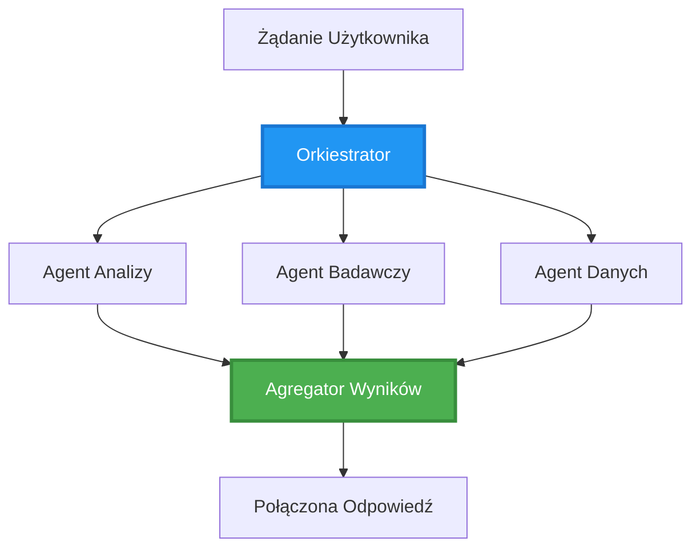
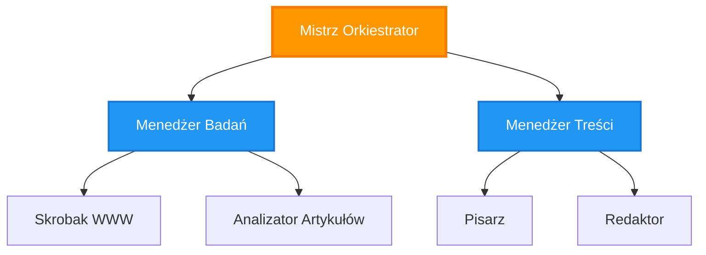
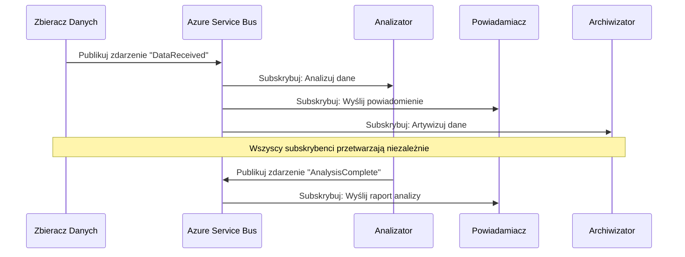
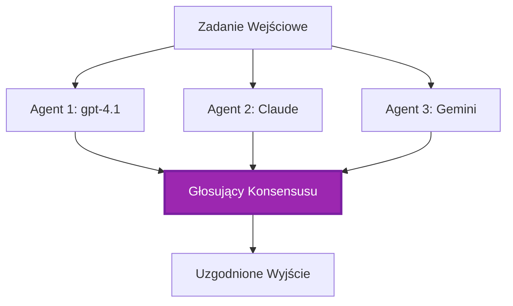
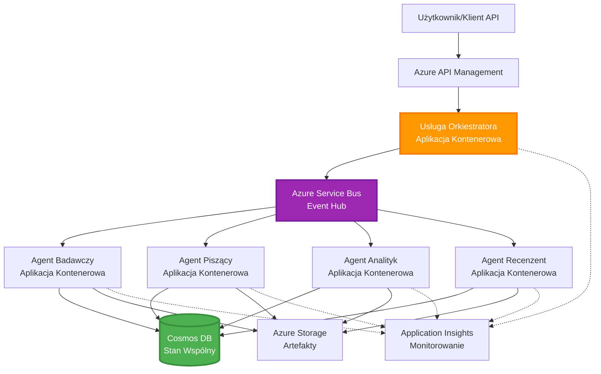

# Wzorce Koordynacji Wieloagentowej

⏱️ **Szacowany Czas**: 60-75 minut | 💰 **Szacowany Koszt**: ~100-300 USD/miesiąc | ⭐ **Złożoność**: Zaawansowany

**📚 Ścieżka Nauki:**
- ← Poprzedni: [Planowanie Pojemności](capacity-planning.md) - Strategie doboru zasobów i skalowania
- 🎯 **Jesteś tutaj**: Wzorce Koordynacji Wieloagentowej (Orkiestracja, komunikacja, zarządzanie stanem)
- → Następny: [Wybór SKU](sku-selection.md) - Dobór odpowiednich usług Azure
- 🏠 [Strona kursu](../../README.md)

---

## Czego się nauczysz

Po ukończeniu tej lekcji:
- Zrozumiesz wzorce architektury **wieloagentowej** i kiedy je stosować
- Zaimplementujesz **wzorce orkiestracji** (centralizowana, zdecentralizowana, hierarchiczna)
- Zaprojektujesz strategie **komunikacji agentów** (synchroniczna, asynchroniczna, zdarzeniowa)
- Zarządzisz **wspólnym stanem** między rozproszonymi agentami
- Wdrożysz **systemy wieloagentowe** w Azure przy pomocy AZD
- Zastosujesz **wzorce koordynacji** w rzeczywistych scenariuszach AI
- Monitorujesz i debugujesz rozproszone systemy agentów

## Dlaczego Koordynacja Wieloagentowa ma Znaczenie

### Ewolucja: od Pojedynczego Agenta do Wielu Agentów

**Pojedynczy Agent (Prosty):**
```
User → Agent → Response
```
- ✅ Łatwy do zrozumienia i implementacji
- ✅ Szybki dla prostych zadań
- ❌ Ograniczony możliwościami pojedynczego modelu
- ❌ Nie można zrównoleglić zadań złożonych
- ❌ Brak specjalizacji

**System Wieloagentowy (Zaawansowany):**
```mermaid
graph TD
    Orchestrator[Orkiestrator] --> Agent1[Agent1<br/>Plan]
    Orchestrator --> Agent2[Agent2<br/>Kod]
    Orchestrator --> Agent3[Agent3<br/>Przegląd]
```- ✅ Agenci wyspecjalizowani w konkretnych zadaniach
- ✅ Wykonanie równoległe dla szybkości
- ✅ Modułowy i łatwy w utrzymaniu
- ✅ Lepszy dla złożonych przepływów pracy
- ⚠️ Wymaga logiki koordynacji

**Analogia**: Pojedynczy agent to jak jedna osoba wykonująca wszystkie zadania. Wieloagentowy to jak zespół, gdzie każdy ma wyspecjalizowane umiejętności (badacz, programista, recenzent, pisarz) pracujący razem.

---

## Główne Wzorce Koordynacji

### Wzorzec 1: Koordynacja Sekwencyjna (Łańcuch Odpowiedzialności)

**Kiedy używać**: Zadania muszą być wykonane w określonej kolejności, każdy agent wykorzystuje wyniki poprzedniego.

```mermaid
sequenceDiagram
    participant User
    participant Orchestrator
    participant Agent1 as Agent Badawczy
    participant Agent2 as Agent Piszący
    participant Agent3 as Agent Redaktor
    
    User->>Orchestrator: "Napisz artykuł o SI"
    Orchestrator->>Agent1: Zbadaj temat
    Agent1-->>Orchestrator: Wyniki badań
    Orchestrator->>Agent2: Napisz szkic (na podstawie badań)
    Agent2-->>Orchestrator: Szkic artykułu
    Orchestrator->>Agent3: Edytuj i popraw
    Agent3-->>Orchestrator: Ostateczny artykuł
    Orchestrator-->>User: Wypolerowany artykuł
    
    Note over User,Agent3: Sekwencyjnie: każdy krok czeka na poprzedni
```
**Korzyści:**
- ✅ Jasny przepływ danych
- ✅ Łatwe do debugowania
- ✅ Przewidywalna kolejność wykonania

**Ograniczenia:**
- ❌ Wolniejsze (brak równoległości)
- ❌ Jeden błąd blokuje cały łańcuch
- ❌ Nie radzi sobie z zadaniami współzależnymi

**Przykładowe zastosowania:**
- Pipeline tworzenia treści (badania → pisanie → redakcja → publikacja)
- Generowanie kodu (planowanie → implementacja → testowanie → wdrożenie)
- Tworzenie raportów (zbieranie danych → analiza → wizualizacja → podsumowanie)

---

### Wzorzec 2: Koordynacja Równoległa (Fan-Out/Fan-In)

**Kiedy używać**: Niezależne zadania mogą być uruchomione jednocześnie, wyniki są łączone na końcu.


**Korzyści:**
- ✅ Szybkie (wykonywanie równoległe)
- ✅ Odporne na błędy (akceptowalne częściowe wyniki)
- ✅ Skalowalne horyzontalnie

**Ograniczenia:**
- ⚠️ Wyniki mogą przychodzić nie w kolejności
- ⚠️ Potrzebna logika agregacji
- ⚠️ Złożone zarządzanie stanem

**Przykładowe zastosowania:**
- Zbieranie danych z wielu źródeł (API + bazy danych + scraping)
- Analiza konkurencji (wiele modeli generuje rozwiązania, wybierany najlepszy)
- Usługi tłumaczeniowe (tłumaczenie na wiele języków jednocześnie)

---

### Wzorzec 3: Koordynacja Hierarchiczna (Menedżer-Pracownik)

**Kiedy używać**: Złożone przepływy pracy z podzadaniami, wymagana delegacja.


**Korzyści:**
- ✅ Obsługa złożonych przepływów pracy
- ✅ Modułowy i łatwy w utrzymaniu
- ✅ Jasny podział odpowiedzialności

**Ograniczenia:**
- ⚠️ Bardziej złożona architektura
- ⚠️ Wyższe opóźnienia (wiele warstw koordynacji)
- ⚠️ Wymaga zaawansowanej orkiestracji

**Przykładowe zastosowania:**
- Przetwarzanie dokumentów korporacyjnych (klasyfikacja → routing → przetwarzanie → archiwizacja)
- Wieloetapowe pipeline'y danych (pobieranie → czyszczenie → transformacja → analiza → raport)
- Złożone przepływy automatyzacji (planowanie → alokacja zasobów → wykonanie → monitorowanie)

---

### Wzorzec 4: Koordynacja Zdarzeniowa (Publish-Subscribe)

**Kiedy używać**: Agenci muszą reagować na zdarzenia, pożądane luźne sprzężenie.


**Korzyści:**
- ✅ Luźne powiązanie między agentami
- ✅ Łatwo dodać nowych agentów (wystarczy subskrypcja)
- ✅ Przetwarzanie asynchroniczne
- ✅ Odporność (trwałość wiadomości)

**Ograniczenia:**
- ⚠️ Ostateczna spójność
- ⚠️ Trudności w debugowaniu
- ⚠️ Problemy z kolejnością wiadomości

**Przykładowe zastosowania:**
- Systemy monitoringu w czasie rzeczywistym (alerty, dashboardy, logi)
- Powiadomienia wielokanałowe (email, SMS, push, Slack)
- Pipeline'y przetwarzania danych (wielu konsumentów tych samych danych)

---

### Wzorzec 5: Koordynacja Konsensusu (Głosowanie/Kworum)

**Kiedy używać**: Potrzebna zgoda wielu agentów przed kontynuacją.


**Korzyści:**
- ✅ Wyższa dokładność (wiele opinii)
- ✅ Odporność na błędy (akceptowalna mniejszość awarii)
- ✅ Wbudowana kontrola jakości

**Ograniczenia:**
- ❌ Drogi (wiele wywołań modeli)
- ❌ Wolniejszy (oczekiwanie na wszystkich agentów)
- ⚠️ Wymaga rozwiązywania konfliktów

**Przykładowe zastosowania:**
- Moderacja treści (wiele modeli ocenia treść)
- Przegląd kodu (wiele linterów/analityków)
- Diagnostyka medyczna (wiele modeli AI, walidacja ekspertów)

---

## Przegląd Architektury

### Kompletny System Wieloagentowy na Azure


**Kluczowe Komponenty:**

| Komponent | Przeznaczenie | Usługa Azure |
|-----------|---------------|--------------|
| **API Gateway** | Punkt wejścia, ograniczanie ruchu, uwierzytelnianie | API Management |
| **Orkiestrator** | Koordynuje przepływy pracy agentów | Container Apps |
| **Kolejka Wiadomości** | Komunikacja asynchroniczna | Service Bus / Event Hubs |
| **Agenci** | Wyspecjalizowani pracownicy AI | Container Apps / Functions |
| **Magazyn Stanu** | Wspólny stan, śledzenie zadań | Cosmos DB |
| **Magazyn Artefaktów** | Dokumenty, wyniki, logi | Blob Storage |
| **Monitorowanie** | Śledzenie rozproszone, logi | Application Insights |

---

## Wymagania Wstępne

### Wymagane Narzędzia

```bash
# Zweryfikuj Azure Developer CLI
azd version
# ✅ Oczekiwane: wersja azd 1.0.0 lub wyższa

# Zweryfikuj Azure CLI
az --version
# ✅ Oczekiwane: wersja azure-cli 2.50.0 lub wyższa

# Zweryfikuj Docker (do testów lokalnych)
docker --version
# ✅ Oczekiwane: wersja Dockera 20.10 lub wyższa
```

### Wymagania Azure

- Aktywna subskrypcja Azure
- Uprawnienia do tworzenia:
  - Container Apps
  - Namespace Service Bus
  - Konta Cosmos DB
  - Konta Storage
  - Application Insights

### Wiedza Wstępna

Powinieneś ukończyć:
- [Zarządzanie Konfiguracją](../chapter-03-configuration/configuration.md)
- [Uwierzytelnianie i Bezpieczeństwo](../chapter-03-configuration/authsecurity.md)
- [Przykład Mikroserwisów](../../../../examples/microservices)

---

## Przewodnik Implementacji

### Struktura Projektu

```
multi-agent-system/
├── azure.yaml                    # AZD configuration
├── infra/
│   ├── main.bicep               # Main infrastructure
│   ├── core/
│   │   ├── servicebus.bicep     # Message queue
│   │   ├── cosmos.bicep         # State store
│   │   ├── storage.bicep        # Artifact storage
│   │   └── monitoring.bicep     # Application Insights
│   └── app/
│       ├── orchestrator.bicep   # Orchestrator service
│       └── agent.bicep          # Agent template
└── src/
    ├── orchestrator/            # Orchestration logic
    │   ├── app.py
    │   ├── workflows.py
    │   └── Dockerfile
    ├── agents/
    │   ├── research/            # Research agent
    │   ├── writer/              # Writer agent
    │   ├── analyst/             # Analyst agent
    │   └── reviewer/            # Reviewer agent
    └── shared/
        ├── state_manager.py     # Shared state logic
        └── message_handler.py   # Message handling
```

---

## Lekcja 1: Wzorzec Koordynacji Sekwencyjnej

### Implementacja: Pipeline Tworzenia Treści

Zbudujmy pipeline sekwencyjny: Badanie → Pisanie → Edycja → Publikacja

### 1. Konfiguracja AZD

**Plik: `azure.yaml`**

```yaml
name: content-pipeline
metadata:
  template: multi-agent-sequential@1.0.0

services:
  orchestrator:
    project: ./src/orchestrator
    language: python
    host: containerapp
  
  research-agent:
    project: ./src/agents/research
    language: python
    host: containerapp
  
  writer-agent:
    project: ./src/agents/writer
    language: python
    host: containerapp
  
  editor-agent:
    project: ./src/agents/editor
    language: python
    host: containerapp
```

### 2. Infrastruktura: Service Bus dla Koordynacji

**Plik: `infra/core/servicebus.bicep`**

```bicep
param name string
param location string
param tags object = {}

resource serviceBusNamespace 'Microsoft.ServiceBus/namespaces@2022-10-01-preview' = {
  name: name
  location: location
  tags: tags
  sku: {
    name: 'Standard'
    tier: 'Standard'
  }
  properties: {
    minimumTlsVersion: '1.2'
  }
}

// Queue for orchestrator → research agent
resource researchQueue 'Microsoft.ServiceBus/namespaces/queues@2022-10-01-preview' = {
  parent: serviceBusNamespace
  name: 'research-tasks'
  properties: {
    maxDeliveryCount: 3
    lockDuration: 'PT5M'
    deadLetteringOnMessageExpiration: true
  }
}

// Queue for research agent → writer agent
resource writerQueue 'Microsoft.ServiceBus/namespaces/queues@2022-10-01-preview' = {
  parent: serviceBusNamespace
  name: 'writer-tasks'
  properties: {
    maxDeliveryCount: 3
    lockDuration: 'PT5M'
  }
}

// Queue for writer agent → editor agent
resource editorQueue 'Microsoft.ServiceBus/namespaces/queues@2022-10-01-preview' = {
  parent: serviceBusNamespace
  name: 'editor-tasks'
  properties: {
    maxDeliveryCount: 3
    lockDuration: 'PT5M'
  }
}

output namespace string = serviceBusNamespace.name
output connectionString string = listKeys('${serviceBusNamespace.id}/AuthorizationRules/RootManageSharedAccessKey', serviceBusNamespace.apiVersion).primaryConnectionString
```

### 3. Menedżer Stanu Wspólnego

**Plik: `src/shared/state_manager.py`**

```python
from azure.cosmos import CosmosClient, PartitionKey
from datetime import datetime
import os

class StateManager:
    """Manages shared state across agents using Cosmos DB"""
    
    def __init__(self):
        endpoint = os.environ['COSMOS_ENDPOINT']
        key = os.environ['COSMOS_KEY']
        
        self.client = CosmosClient(endpoint, key)
        self.database = self.client.get_database_client('agent-state')
        self.container = self.database.get_container_client('tasks')
    
    def create_task(self, task_id: str, task_type: str, input_data: dict):
        """Create a new task"""
        task = {
            'id': task_id,
            'type': task_type,
            'status': 'pending',
            'input': input_data,
            'created_at': datetime.utcnow().isoformat(),
            'steps': []
        }
        self.container.create_item(task)
        return task
    
    def update_task_step(self, task_id: str, step_name: str, result: dict):
        """Update task with completed step"""
        task = self.container.read_item(task_id, partition_key=task_id)
        
        task['steps'].append({
            'name': step_name,
            'completed_at': datetime.utcnow().isoformat(),
            'result': result
        })
        
        self.container.replace_item(task_id, task)
        return task
    
    def complete_task(self, task_id: str, final_result: dict):
        """Mark task as complete"""
        task = self.container.read_item(task_id, partition_key=task_id)
        task['status'] = 'completed'
        task['result'] = final_result
        task['completed_at'] = datetime.utcnow().isoformat()
        self.container.replace_item(task_id, task)
        return task
    
    def get_task(self, task_id: str):
        """Retrieve task state"""
        return self.container.read_item(task_id, partition_key=task_id)
```

### 4. Usługa Orkiestratora

**Plik: `src/orchestrator/app.py`**

```python
from flask import Flask, request, jsonify
from azure.servicebus import ServiceBusClient, ServiceBusMessage
import json
import uuid
import os
from shared.state_manager import StateManager

app = Flask(__name__)
state_manager = StateManager()

# Połączenie Service Bus
servicebus_connection_str = os.environ['SERVICEBUS_CONNECTION_STRING']
servicebus_client = ServiceBusClient.from_connection_string(servicebus_connection_str)

@app.route('/health', methods=['GET'])
def health():
    return jsonify({'status': 'healthy', 'service': 'orchestrator'})

@app.route('/create-content', methods=['POST'])
def create_content():
    """
    Sequential workflow: Research → Write → Edit → Publish
    """
    data = request.json
    topic = data.get('topic')
    
    if not topic:
        return jsonify({'error': 'Topic required'}), 400
    
    # Utwórz zadanie w magazynie stanu
    task_id = str(uuid.uuid4())
    task = state_manager.create_task(
        task_id=task_id,
        task_type='content_creation',
        input_data={'topic': topic}
    )
    
    # Wyślij wiadomość do agenta badawczego (pierwszy krok)
    sender = servicebus_client.get_queue_sender('research-tasks')
    message = ServiceBusMessage(
        body=json.dumps({
            'task_id': task_id,
            'topic': topic,
            'next_queue': 'writer-tasks'  # Gdzie wysłać wyniki
        }),
        content_type='application/json'
    )
    
    with sender:
        sender.send_messages(message)
    
    return jsonify({
        'task_id': task_id,
        'status': 'started',
        'workflow': 'sequential',
        'steps': ['research', 'write', 'edit', 'publish'],
        'message': 'Content creation pipeline initiated'
    }), 202

@app.route('/task/<task_id>', methods=['GET'])
def get_task_status(task_id):
    """Check task status"""
    try:
        task = state_manager.get_task(task_id)
        return jsonify(task)
    except Exception as e:
        return jsonify({'error': str(e)}), 404

if __name__ == '__main__':
    app.run(host='0.0.0.0', port=8080)
```

### 5. Agent Badawczy

**Plik: `src/agents/research/app.py`**

```python
from azure.servicebus import ServiceBusClient, ServiceBusMessage
from openai import AzureOpenAI
import json
import os
import time
from shared.state_manager import StateManager

# Inicjalizuj klientów
state_manager = StateManager()
servicebus_client = ServiceBusClient.from_connection_string(
    os.environ['SERVICEBUS_CONNECTION_STRING']
)

openai_client = AzureOpenAI(
    api_key=os.environ['AZURE_OPENAI_API_KEY'],
    api_version="2024-02-01",
    azure_endpoint=os.environ['AZURE_OPENAI_ENDPOINT']
)

def process_research_task(message_data):
    """Process research request and pass to writer"""
    task_id = message_data['task_id']
    topic = message_data['topic']
    next_queue = message_data['next_queue']
    
    print(f"🔬 Researching: {topic}")
    
    # Wywołaj modele Microsoft Foundry do badań
    response = openai_client.chat.completions.create(
        model="gpt-4.1",
        messages=[
            {"role": "system", "content": "You are a research assistant. Provide comprehensive research on the given topic."},
            {"role": "user", "content": f"Research this topic thoroughly: {topic}"}
        ],
        max_tokens=1500
    )
    
    research_results = response.choices[0].message.content
    
    # Zaktualizuj stan
    state_manager.update_task_step(
        task_id=task_id,
        step_name='research',
        result={'research': research_results}
    )
    
    # Wyślij do następnego agenta (pisarza)
    sender = servicebus_client.get_queue_sender(next_queue)
    message = ServiceBusMessage(
        body=json.dumps({
            'task_id': task_id,
            'topic': topic,
            'research': research_results,
            'next_queue': 'editor-tasks'
        }),
        content_type='application/json'
    )
    
    with sender:
        sender.send_messages(message)
    
    print(f"✅ Research complete for task {task_id}")

def main():
    """Listen to research queue"""
    receiver = servicebus_client.get_queue_receiver('research-tasks')
    
    print("🔬 Research Agent started, listening for tasks...")
    
    with receiver:
        while True:
            messages = receiver.receive_messages(max_wait_time=5)
            for message in messages:
                try:
                    message_data = json.loads(str(message))
                    process_research_task(message_data)
                    receiver.complete_message(message)
                except Exception as e:
                    print(f"❌ Error processing message: {e}")
                    receiver.abandon_message(message)

if __name__ == '__main__':
    main()
```

### 6. Agent Pisarza

**Plik: `src/agents/writer/app.py`**

```python
from azure.servicebus import ServiceBusClient, ServiceBusMessage
from openai import AzureOpenAI
import json
import os
from shared.state_manager import StateManager

state_manager = StateManager()
servicebus_client = ServiceBusClient.from_connection_string(
    os.environ['SERVICEBUS_CONNECTION_STRING']
)

openai_client = AzureOpenAI(
    api_key=os.environ['AZURE_OPENAI_API_KEY'],
    api_version="2024-02-01",
    azure_endpoint=os.environ['AZURE_OPENAI_ENDPOINT']
)

def process_writing_task(message_data):
    """Write article based on research"""
    task_id = message_data['task_id']
    topic = message_data['topic']
    research = message_data['research']
    next_queue = message_data['next_queue']
    
    print(f"✍️ Writing article: {topic}")
    
    # Wywołaj Microsoft Foundry Models, aby napisać artykuł
    response = openai_client.chat.completions.create(
        model="gpt-4.1",
        messages=[
            {"role": "system", "content": "You are a professional writer. Write engaging, well-structured articles."},
            {"role": "user", "content": f"Based on this research:\n\n{research}\n\nWrite a comprehensive article about: {topic}"}
        ],
        max_tokens=2000
    )
    
    article_draft = response.choices[0].message.content
    
    # Zaktualizuj stan
    state_manager.update_task_step(
        task_id=task_id,
        step_name='writing',
        result={'draft': article_draft}
    )
    
    # Wyślij do redaktora
    sender = servicebus_client.get_queue_sender(next_queue)
    message = ServiceBusMessage(
        body=json.dumps({
            'task_id': task_id,
            'topic': topic,
            'draft': article_draft
        }),
        content_type='application/json'
    )
    
    with sender:
        sender.send_messages(message)
    
    print(f"✅ Article draft complete for task {task_id}")

def main():
    """Listen to writer queue"""
    receiver = servicebus_client.get_queue_receiver('writer-tasks')
    
    print("✍️ Writer Agent started, listening for tasks...")
    
    with receiver:
        while True:
            messages = receiver.receive_messages(max_wait_time=5)
            for message in messages:
                try:
                    message_data = json.loads(str(message))
                    process_writing_task(message_data)
                    receiver.complete_message(message)
                except Exception as e:
                    print(f"❌ Error: {e}")
                    receiver.abandon_message(message)

if __name__ == '__main__':
    main()
```

### 7. Agent Redaktora

**Plik: `src/agents/editor/app.py`**

```python
from azure.servicebus import ServiceBusClient
from openai import AzureOpenAI
import json
import os
from shared.state_manager import StateManager

state_manager = StateManager()
servicebus_client = ServiceBusClient.from_connection_string(
    os.environ['SERVICEBUS_CONNECTION_STRING']
)

openai_client = AzureOpenAI(
    api_key=os.environ['AZURE_OPENAI_API_KEY'],
    api_version="2024-02-01",
    azure_endpoint=os.environ['AZURE_OPENAI_ENDPOINT']
)

def process_editing_task(message_data):
    """Edit and finalize article"""
    task_id = message_data['task_id']
    topic = message_data['topic']
    draft = message_data['draft']
    
    print(f"📝 Editing article: {topic}")
    
    # Wywołaj modele Microsoft Foundry, aby edytować
    response = openai_client.chat.completions.create(
        model="gpt-4.1",
        messages=[
            {"role": "system", "content": "You are an expert editor. Improve grammar, clarity, and structure."},
            {"role": "user", "content": f"Edit and improve this article:\n\n{draft}"}
        ],
        max_tokens=2000
    )
    
    final_article = response.choices[0].message.content
    
    # Oznacz zadanie jako ukończone
    state_manager.complete_task(
        task_id=task_id,
        final_result={
            'topic': topic,
            'final_article': final_article,
            'word_count': len(final_article.split())
        }
    )
    
    print(f"✅ Article finalized for task {task_id}")

def main():
    """Listen to editor queue"""
    receiver = servicebus_client.get_queue_receiver('editor-tasks')
    
    print("📝 Editor Agent started, listening for tasks...")
    
    with receiver:
        while True:
            messages = receiver.receive_messages(max_wait_time=5)
            for message in messages:
                try:
                    message_data = json.loads(str(message))
                    process_editing_task(message_data)
                    receiver.complete_message(message)
                except Exception as e:
                    print(f"❌ Error: {e}")
                    receiver.abandon_message(message)

if __name__ == '__main__':
    main()
```

### 8. Wdrożenie i Testy

```bash
# Opcja A: Wdrażanie oparte na szablonie
azd init
azd up

# Opcja B: Wdrażanie manifestu agenta (wymaga rozszerzenia)
azd extension install azure.ai.agents
azd ai agent init -m agent-manifest.yaml
azd up
```

> Zobacz [Polecenia AZD AI CLI](../chapter-08-production/production-ai-practices.md#azd-ai-cli-commands-and-extensions) dla wszystkich flag i opcji `azd ai`.

```bash
# Pobierz URL orkiestratora
ORCHESTRATOR_URL=$(azd env get-values | grep ORCHESTRATOR_URL | cut -d '=' -f2 | tr -d '"')

# Utwórz zawartość
curl -X POST $ORCHESTRATOR_URL/create-content \
  -H "Content-Type: application/json" \
  -d '{"topic": "The Future of AI in Healthcare"}'
```

**✅ Oczekiwany wyjście:**
```json
{
  "task_id": "a1b2c3d4-e5f6-7890-abcd-ef1234567890",
  "status": "started",
  "workflow": "sequential",
  "steps": ["research", "write", "edit", "publish"],
  "message": "Content creation pipeline initiated"
}
```

**Sprawdź postęp zadania:**
```bash
TASK_ID="a1b2c3d4-e5f6-7890-abcd-ef1234567890"
curl $ORCHESTRATOR_URL/task/$TASK_ID
```

**✅ Oczekiwany wyjście (ukończone):**
```json
{
  "id": "a1b2c3d4-e5f6-7890-abcd-ef1234567890",
  "type": "content_creation",
  "status": "completed",
  "steps": [
    {
      "name": "research",
      "completed_at": "2025-11-19T10:30:00Z",
      "result": {"research": "..."}
    },
    {
      "name": "writing",
      "completed_at": "2025-11-19T10:32:00Z",
      "result": {"draft": "..."}
    }
  ],
  "result": {
    "topic": "The Future of AI in Healthcare",
    "final_article": "...",
    "word_count": 1500
  }
}
```

---

## Lekcja 2: Wzorzec Koordynacji Równoległej

### Implementacja: Agregator Badań Wieloźródłowych

Zbudujmy system równoległy, który zbiera dane z wielu źródeł jednocześnie.

### Orkiestrator Równoległy

**Plik: `src/orchestrator/parallel_workflow.py`**

```python
from flask import Flask, request, jsonify
from azure.servicebus import ServiceBusClient, ServiceBusMessage
import json
import uuid
import os
from shared.state_manager import StateManager

app = Flask(__name__)
state_manager = StateManager()

servicebus_client = ServiceBusClient.from_connection_string(
    os.environ['SERVICEBUS_CONNECTION_STRING']
)

@app.route('/research-parallel', methods=['POST'])
def research_parallel():
    """
    Parallel workflow: Multiple agents work simultaneously
    """
    data = request.json
    query = data.get('query')
    
    task_id = str(uuid.uuid4())
    task = state_manager.create_task(
        task_id=task_id,
        task_type='parallel_research',
        input_data={
            'query': query,
            'agents': ['web', 'academic', 'news', 'social']
        }
    )
    
    # Rozgłoszenie: Wyślij do wszystkich agentów jednocześnie
    agents = [
        ('web-research-queue', 'web'),
        ('academic-research-queue', 'academic'),
        ('news-research-queue', 'news'),
        ('social-research-queue', 'social')
    ]
    
    for queue_name, agent_type in agents:
        sender = servicebus_client.get_queue_sender(queue_name)
        message = ServiceBusMessage(
            body=json.dumps({
                'task_id': task_id,
                'query': query,
                'agent_type': agent_type,
                'result_queue': 'aggregation-queue'
            }),
            content_type='application/json'
        )
        
        with sender:
            sender.send_messages(message)
    
    return jsonify({
        'task_id': task_id,
        'status': 'started',
        'workflow': 'parallel',
        'agents_dispatched': 4,
        'message': 'Parallel research initiated'
    }), 202

if __name__ == '__main__':
    app.run(host='0.0.0.0', port=8080)
```

### Logika Agregacji

**Plik: `src/agents/aggregator/app.py`**

```python
from azure.servicebus import ServiceBusClient
import json
import os
from collections import defaultdict
from shared.state_manager import StateManager

state_manager = StateManager()
servicebus_client = ServiceBusClient.from_connection_string(
    os.environ['SERVICEBUS_CONNECTION_STRING']
)

# Śledź wyniki dla każdego zadania
task_results = defaultdict(list)
expected_agents = 4  # sieć, akademickie, wiadomości, społeczność

def process_result(message_data):
    """Aggregate results from parallel agents"""
    task_id = message_data['task_id']
    agent_type = message_data['agent_type']
    result = message_data['result']
    
    # Zapisz wynik
    task_results[task_id].append({
        'agent': agent_type,
        'data': result
    })
    
    print(f"📊 Received result from {agent_type} agent ({len(task_results[task_id])}/{expected_agents})")
    
    # Sprawdź, czy wszyscy agenci zakończyli (fan-in)
    if len(task_results[task_id]) == expected_agents:
        print(f"✅ All agents completed for task {task_id}. Aggregating...")
        
        # Połącz wyniki
        aggregated = {
            'query': message_data['query'],
            'sources': task_results[task_id],
            'summary': generate_summary(task_results[task_id])
        }
        
        # Oznacz jako zakończone
        state_manager.complete_task(task_id, aggregated)
        
        # Posprzątaj
        del task_results[task_id]
        
        print(f"✅ Aggregation complete for task {task_id}")

def generate_summary(results):
    """Generate summary from all sources"""
    summaries = [r['data'].get('summary', '') for r in results]
    return '\n\n'.join(summaries)

def main():
    """Listen to aggregation queue"""
    receiver = servicebus_client.get_queue_receiver('aggregation-queue')
    
    print("📊 Aggregator started, listening for results...")
    
    with receiver:
        while True:
            messages = receiver.receive_messages(max_wait_time=5)
            for message in messages:
                try:
                    message_data = json.loads(str(message))
                    process_result(message_data)
                    receiver.complete_message(message)
                except Exception as e:
                    print(f"❌ Error: {e}")
                    receiver.abandon_message(message)

if __name__ == '__main__':
    main()
```

**Zalety wzorca równoległego:**
- ⚡ **4 razy szybciej** (ageni działają jednocześnie)
- 🔄 **Odporność na błędy** (akceptowalne wyniki częściowe)
- 📈 **Skalowalność** (łatwe dodawanie agentów)

---

## Ćwiczenia Praktyczne

### Ćwiczenie 1: Dodaj Obsługę Limitów Czasu ⭐⭐ (Średniozaawansowane)

**Cel**: Zaimplementować logikę limitu czasu, aby agregator nie czekał w nieskończoność na wolnych agentów.

**Kroki**:

1. **Dodaj śledzenie limitu czasu do agregatora:**

```python
from datetime import datetime, timedelta

task_timeouts = {}  # task_id -> czas_wygasania

def process_result(message_data):
    task_id = message_data['task_id']
    
    # Ustaw limit czasu na pierwszy wynik
    if task_id not in task_timeouts:
        task_timeouts[task_id] = datetime.utcnow() + timedelta(seconds=30)
    
    task_results[task_id].append({
        'agent': message_data['agent_type'],
        'data': message_data['result']
    })
    
    # Sprawdź, czy zakończono LUB upłynął limit czasu
    if len(task_results[task_id]) == expected_agents or \
       datetime.utcnow() > task_timeouts[task_id]:
        
        print(f"📊 Aggregating with {len(task_results[task_id])}/{expected_agents} results")
        
        aggregated = {
            'query': message_data['query'],
            'sources': task_results[task_id],
            'completed_agents': len(task_results[task_id]),
            'timed_out': len(task_results[task_id]) < expected_agents
        }
        
        state_manager.complete_task(task_id, aggregated)
        
        # Czyszczenie
        del task_results[task_id]
        del task_timeouts[task_id]
```

2. **Testuj z opóźnieniami sztucznymi:**

```python
# W jednym agencie dodaj opóźnienie, aby zasymulować wolne przetwarzanie
import time
time.sleep(35)  # Przekroczono limit czasu 30 sekund
```

3. **Wdróż i zweryfikuj:**

```bash
azd deploy aggregator

# Prześlij zadanie
curl -X POST $ORCHESTRATOR_URL/research-parallel \
  -H "Content-Type: application/json" \
  -d '{"query": "AI safety research"}'

# Sprawdź wyniki po 30 sekundach
curl $ORCHESTRATOR_URL/task/$TASK_ID
```

**✅ Kryteria sukcesu:**
- ✅ Zadanie kończy się po 30 sekundach nawet jeśli agenci nie skończyli
- ✅ Odpowiedź wskazuje częściowe wyniki (`"timed_out": true`)
- ✅ Zwracane są dostępne wyniki (3 z 4 agentów)

**Czas**: 20-25 minut

---

### Ćwiczenie 2: Implementacja Logiki Ponawiania ⭐⭐⭐ (Zaawansowane)

**Cel**: Automatycznie ponawiać nieudane zadania agentów przed poddaniem się.

**Kroki**:

1. **Dodaj śledzenie ponowień do orkiestratora:**

```python
from dataclasses import dataclass
from typing import Dict

@dataclass
class RetryConfig:
    max_retries: int = 3
    backoff_seconds: int = 5

retry_counts: Dict[str, int] = {}  # message_id -> liczba_prób

def send_with_retry(queue_name: str, message_data: dict, retry_config: RetryConfig):
    """Send message with retry metadata"""
    message_id = message_data.get('message_id', str(uuid.uuid4()))
    message_data['message_id'] = message_id
    message_data['retry_count'] = retry_counts.get(message_id, 0)
    message_data['max_retries'] = retry_config.max_retries
    
    sender = servicebus_client.get_queue_sender(queue_name)
    message = ServiceBusMessage(
        body=json.dumps(message_data),
        content_type='application/json',
        message_id=message_id
    )
    
    with sender:
        sender.send_messages(message)
```

2. **Dodaj obsługę ponawiań w agentach:**

```python
def process_with_retry(message, receiver, process_func):
    """Process message with automatic retry on failure"""
    try:
        message_data = json.loads(str(message))
        
        # Przetwórz wiadomość
        process_func(message_data)
        
        # Sukces - zakończono
        receiver.complete_message(message)
        
    except Exception as e:
        message_id = message.message_id
        retry_count = message_data.get('retry_count', 0)
        max_retries = message_data.get('max_retries', 3)
        
        if retry_count < max_retries:
            # Ponów próbę: porzuć i ponownie umieść w kolejce z inkrementowaną liczbą prób
            print(f"⚠️ Retry {retry_count + 1}/{max_retries} for message {message_id}")
            
            message_data['retry_count'] = retry_count + 1
            
            # Wyślij z powrotem do tej samej kolejki z opóźnieniem
            time.sleep(5 * (retry_count + 1))  # Wykładnicze opóźnienie
            send_with_retry(queue_name, message_data, RetryConfig())
            
            receiver.complete_message(message)  # Usuń oryginał
        else:
            # Przekroczono maksymalną liczbę prób - przenieś do kolejki martwych liter
            print(f"❌ Max retries exceeded for message {message_id}")
            receiver.dead_letter_message(
                message,
                reason="MaxRetriesExceeded",
                error_description=str(e)
            )
```

3. **Monitoruj kolejkę dead letter:**

```python
def monitor_dead_letters():
    """Check dead letter queue for failed messages"""
    receiver = servicebus_client.get_queue_receiver(
        'research-queue',
        sub_queue='deadletter'
    )
    
    with receiver:
        messages = receiver.receive_messages(max_wait_time=5)
        for message in messages:
            print(f"☠️ Dead letter: {message.message_id}")
            print(f"Reason: {message.dead_letter_reason}")
            print(f"Description: {message.dead_letter_error_description}")
```

**✅ Kryteria sukcesu:**
- ✅ Nieudane zadania są automatycznie ponawiane (maksymalnie 3 razy)
- ✅ Wykorzystywany jest wykładniczy backoff między ponowieniami (5s, 10s, 15s)
- ✅ Po maksymalnej liczbie ponowień, wiadomości trafiają do kolejki dead letter
- ✅ Możliwość monitorowania i ponownego odtwarzania dead letter queue

**Czas**: 30-40 minut

---

### Ćwiczenie 3: Implementacja Wyłącznika Obwodu (Circuit Breaker) ⭐⭐⭐ (Zaawansowane)

**Cel**: Zapobiec kaskadowym awariom przez blokowanie zapytań do zawodzących agentów.

**Kroki**:

1. **Utwórz klasę wyłącznika obwodu:**

```python
from enum import Enum
from datetime import datetime, timedelta

class CircuitState(Enum):
    CLOSED = "closed"      # Normalne działanie
    OPEN = "open"          # Awaria, odrzuć żądania
    HALF_OPEN = "half_open"  # Testowanie, czy odzyskano

class CircuitBreaker:
    def __init__(self, failure_threshold=5, timeout_seconds=60):
        self.failure_threshold = failure_threshold
        self.timeout_seconds = timeout_seconds
        self.failure_count = 0
        self.last_failure_time = None
        self.state = CircuitState.CLOSED
    
    def call(self, func):
        """Execute function with circuit breaker protection"""
        if self.state == CircuitState.OPEN:
            # Sprawdź, czy czas oczekiwania upłynął
            if datetime.utcnow() - self.last_failure_time > timedelta(seconds=self.timeout_seconds):
                self.state = CircuitState.HALF_OPEN
                print("🔄 Circuit breaker: HALF_OPEN (testing)")
            else:
                raise Exception(f"Circuit breaker OPEN for agent. Try again in {self.timeout_seconds}s")
        
        try:
            result = func()
            
            # Sukces
            if self.state == CircuitState.HALF_OPEN:
                self.state = CircuitState.CLOSED
                self.failure_count = 0
                print("✅ Circuit breaker: CLOSED (recovered)")
            
            return result
            
        except Exception as e:
            self.failure_count += 1
            self.last_failure_time = datetime.utcnow()
            
            if self.failure_count >= self.failure_threshold:
                self.state = CircuitState.OPEN
                print(f"🔴 Circuit breaker: OPEN (too many failures)")
            
            raise e
```

2. **Zastosuj do wywołań agentów:**

```python
# W orkiestratorze
agent_circuits = {
    'web': CircuitBreaker(failure_threshold=5, timeout_seconds=60),
    'academic': CircuitBreaker(failure_threshold=5, timeout_seconds=60),
    'news': CircuitBreaker(failure_threshold=5, timeout_seconds=60),
    'social': CircuitBreaker(failure_threshold=5, timeout_seconds=60)
}

def send_to_agent(agent_type, message_data):
    """Send with circuit breaker protection"""
    circuit = agent_circuits[agent_type]
    
    try:
        circuit.call(lambda: send_message(agent_type, message_data))
    except Exception as e:
        print(f"⚠️ Skipping {agent_type} agent: {e}")
        # Kontynuuj z innymi agentami
```

3. **Testuj działanie wyłącznika:**

```bash
# Symuluj powtarzające się awarie (zatrzymaj jednego agenta)
az containerapp stop --name web-research-agent --resource-group rg-agents

# Wyślij wiele żądań
for i in {1..10}; do
  curl -X POST $ORCHESTRATOR_URL/research-parallel \
    -H "Content-Type: application/json" \
    -d '{"query": "test query '$i'"}'
  sleep 2
done

# Sprawdź logi - powinieneś zobaczyć, że obwód jest otwarty po 5 awariach
# Użyj Azure CLI do logów Container App:
az containerapp logs show --name orchestrator --resource-group $RG_NAME --tail 50
```

**✅ Kryteria sukcesu:**
- ✅ Po 5 awariach obwód się otwiera (odrzuca zapytania)
- ✅ Po 60 sekundach obwód przechodzi w tryb częściowo otwarty (testowanie odzysku)
- ✅ Inni agenci działają normalnie
- ✅ Obwód automatycznie się zamyka gdy agent się regeneruje

**Czas**: 40-50 minut

---

## Monitorowanie i Debugowanie

### Śledzenie Rozproszone za pomocą Application Insights

**Plik: `src/shared/tracing.py`**

```python
from opencensus.ext.azure.log_exporter import AzureLogHandler
from opencensus.ext.azure.trace_exporter import AzureExporter
from opencensus.trace import config_integration
from opencensus.trace.tracer import Tracer
from opencensus.trace.samplers import AlwaysOnSampler
import logging
import os

# Skonfiguruj śledzenie
config_integration.trace_integrations(['requests', 'logging'])

connection_string = os.environ.get('APPLICATIONINSIGHTS_CONNECTION_STRING')

# Utwórz tracer
tracer = Tracer(
    exporter=AzureExporter(connection_string=connection_string),
    sampler=AlwaysOnSampler()
)

# Skonfiguruj logowanie
logger = logging.getLogger(__name__)
logger.addHandler(AzureLogHandler(connection_string=connection_string))
logger.setLevel(logging.INFO)

def trace_agent_call(agent_name, task_id, operation):
    """Trace agent operations"""
    with tracer.span(name=f'{agent_name}.{operation}') as span:
        span.add_attribute('agent', agent_name)
        span.add_attribute('task_id', task_id)
        span.add_attribute('operation', operation)
        
        try:
            result = operation()
            span.add_attribute('status', 'success')
            return result
        except Exception as e:
            span.add_attribute('status', 'error')
            span.add_attribute('error', str(e))
            raise
```

### Zapytania w Application Insights

**Śledź przepływy wieloagentowe:**

```kusto
// Trace complete workflow for a task
traces
| where customDimensions.task_id == "a1b2c3d4-..."
| project timestamp, message, customDimensions.agent, customDimensions.operation
| order by timestamp asc
```

**Porównanie wydajności agentów:**

```kusto
// Compare agent execution times
dependencies
| where name contains "agent"
| summarize 
    avg_duration = avg(duration),
    p95_duration = percentile(duration, 95),
    count = count()
  by agent = tostring(customDimensions.agent)
| order by avg_duration desc
```

**Analiza awarii:**

```kusto
// Find which agents fail most
exceptions
| where customDimensions.agent != ""
| summarize 
    failure_count = count(),
    unique_errors = dcount(outerMessage)
  by agent = tostring(customDimensions.agent)
| order by failure_count desc
```

---

## Analiza Kosztów

### Koszty Systemu Wieloagentowego (Szacunkowo Miesięczne)

| Komponent | Konfiguracja | Koszt |
|-----------|--------------|-------|
| **Orkiestrator** | 1 Container App (1 vCPU, 2GB) | 30-50 USD |
| **4 Agenci** | 4 Container Apps (0.5 vCPU, 1GB każdy) | 60-120 USD |
| **Service Bus** | Standard tier, 10M wiadomości | 10-20 USD |
| **Cosmos DB** | Serverless, 5GB storage, 1M RUs | 25-50 USD |
| **Blob Storage** | 10GB storage, 100K operacji | 5-10 USD |
| **Application Insights** | 5GB ingest | 10-15 USD |
| **Modele Microsoft Foundry** | gpt-4.1, 10M tokenów | 100-300 USD |
| **Suma** | | **240-565 USD/miesiąc** |

### Strategie Optymalizacji Kosztów

1. **Używaj serverless tam gdzie to możliwe:**
   ```bicep
   // Cosmos DB serverless (no minimum cost)
   properties: {
     databaseAccountOfferType: 'Standard'
     capabilities: [{ name: 'EnableServerless' }]
   }
   ```

2. **Skaluj agentów do zera w okresach bezczynności:**
   ```bicep
   scale: {
     minReplicas: 0  // Scale to zero when no messages
     maxReplicas: 10
   }
   ```

3. **Wykorzystuj batch processing w Service Bus:**
   ```python
   # Wysyłaj wiadomości partiami (taniej)
   sender.send_messages([message1, message2, message3])
   ```

4. **Buforuj często używane wyniki:**
   ```python
   # Użyj Azure Cache for Redis
   if cache.exists(query_hash):
       return cache.get(query_hash)
   ```

---

## Najlepsze Praktyki

### ✅ Rób:

1. **Używaj operacji idempotentnych**
   ```python
   # Agent może bezpiecznie przetwarzać tę samą wiadomość wielokrotnie
   def process_task(task_id):
       if state_manager.task_exists(task_id):
           print(f"Task {task_id} already processed, skipping")
           return
       # Przetwarzanie zadania...
   ```

2. **Implementuj kompleksowe logowanie**
   ```python
   logger.info(f"Agent: {agent_name}, Task: {task_id}, Action: {action}")
   ```

3. **Stosuj identyfikatory korelacji**
   ```python
   # Przekaż task_id przez cały przepływ pracy
   message_data = {
       'task_id': task_id,  # Identyfikator korelacji
       'timestamp': datetime.utcnow().isoformat()
   }
   ```

4. **Ustawiaj TTL (czas życia) dla wiadomości**
   ```bicep
   properties: {
     defaultMessageTimeToLive: 'PT1H'  // 1 hour max
   }
   ```

5. **Monitoruj kolejki dead letter**
   ```python
   # Regularne monitorowanie nieudanych wiadomości
   monitor_dead_letters()
   ```

### ❌ Nie rób:

1. **Nie twórz cyklicznych zależności**
   ```python
   # ❌ ZŁE: Agent A → Agent B → Agent A (nieskończona pętla)
   # ✅ DOBRE: Zdefiniuj wyraźny skierowany acykliczny graf (DAG)
   ```

2. **Nie blokuj wątków agentów**
   ```python
   # ❌ ZŁE: Synchronizujące oczekiwanie
   while not task_complete:
       time.sleep(1)
   
   # ✅ DOBRE: Używaj wywołań zwrotnych kolejki wiadomości
   ```

3. **Nie ignoruj częściowych awarii**
   ```python
   # ❌ ZŁE: Zakończ cały proces, jeśli jeden agent zawiedzie
   # ✅ DOBRE: Zwróć częściowe wyniki z wskaźnikami błędów
   ```

4. **Nie używaj nieskończonych ponowień**
   ```python
   # ❌ ŹLE: ponawiaj bez końca
   # ✅ DOBRZE: max_retries = 3, potem dead letter
   ```

---

## Przewodnik rozwiązywania problemów

### Problem: Wiadomości utknęły w kolejce

**Objawy:**
- Wiadomości gromadzą się w kolejce
- Agenci nie przetwarzają
- Status zadania utknął na "pending"

**Diagnoza:**
```bash
# Sprawdź głębokość kolejki
az servicebus queue show \
  --namespace-name mybus \
  --name research-tasks \
  --query "countDetails"

# Sprawdź logi agenta za pomocą Azure CLI
az containerapp logs show --name research-agent --resource-group $RG_NAME --tail 50
```

**Rozwiązania:**

1. **Zwiększ liczbę replik agentów:**
   ```bash
   az containerapp update \
     --name research-agent \
     --min-replicas 3 \
     --max-replicas 10
   ```

2. **Sprawdź martwą kolejkę (dead letter queue):**
   ```bash
   az servicebus queue show \
     --namespace-name mybus \
     --name research-tasks \
     --query "countDetails.deadLetterMessageCount"
   ```

---

### Problem: Zadanie przekracza czas lub nigdy nie kończy się

**Objawy:**
- Status zadania pozostaje "in_progress"
- Niektórzy agenci kończą, inni nie
- Brak komunikatów o błędach

**Diagnoza:**
```bash
# Sprawdź stan zadania
curl $ORCHESTRATOR_URL/task/$TASK_ID

# Sprawdź Application Insights
# Uruchom zapytanie: traces | where customDimensions.task_id == "..."
```

**Rozwiązania:**

1. **Zaimplementuj limit czasu w agregatorze (Ćwiczenie 1)**

2. **Sprawdź awarie agentów za pomocą Azure Monitor:**
   ```bash
   # Przeglądaj logi za pomocą azd monitor
   azd monitor --logs
   
   # Lub użyj Azure CLI, aby sprawdzić konkretne logi aplikacji kontenera
   az containerapp logs show --name <agent-name> --resource-group $RG_NAME --follow | grep "ERROR\|FAIL"
   ```

3. **Zweryfikuj, że wszyscy agenci działają:**
   ```bash
   az containerapp list \
     --resource-group rg-agents \
     --query "[].{name:name, status:properties.runningStatus}"
   ```

---

## Dowiedz się więcej

### Oficjalna dokumentacja
- [Azure Service Bus](https://learn.microsoft.com/azure/service-bus-messaging/service-bus-messaging-overview)
- [Cosmos DB](https://learn.microsoft.com/azure/cosmos-db/introduction)
- [Container Apps DAPR](https://learn.microsoft.com/azure/container-apps/dapr-overview)
- [Wzorce projektowe systemów wieloagentowych](https://learn.microsoft.com/azure/architecture/guide/ai/multi-agent-systems)

### Kolejne kroki w tym kursie
- ← Poprzedni: [Planowanie pojemności](capacity-planning.md)
- → Następny: [Wybór SKU](sku-selection.md)
- 🏠 [Strona kursu głównego](../../README.md)

### Powiązane przykłady
- [Przykład mikroserwisów](../../../../examples/microservices) - Wzorce komunikacji między usługami
- [Przykład modeli Foundry Microsoft](../../../../examples/azure-openai-chat) - Integracja AI

---

## Podsumowanie

**Nauczyłeś się:**
- ✅ Pięciu wzorców koordynacji (sekwencyjny, równoległy, hierarchiczny, zdarzeniowy, konsensus)
- ✅ Architektury wieloagentowej na Azure (Service Bus, Cosmos DB, Container Apps)
- ✅ Zarządzania stanem wśród rozproszonych agentów
- ✅ Obsługi limitów czasu, ponowień i przełączników awaryjnych
- ✅ Monitorowania i debugowania systemów rozproszonych
- ✅ Strategii optymalizacji kosztów

**Kluczowe wnioski:**
1. **Wybierz właściwy wzorzec** - Sekwencyjny dla uporządkowanych przepływów, równoległy dla szybkości, zdarzeniowy dla elastyczności
2. **Uważnie zarządzaj stanem** - Używaj Cosmos DB lub podobnego dla współdzielonego stanu
3. **Radź sobie z awariami z wdziękiem** - Limity czasu, ponowienia, przełączniki awaryjne, martwe kolejki
4. **Monitoruj wszystko** - Śledzenie rozproszone jest niezbędne do debugowania
5. **Optymalizuj koszty** - Skaluj do zera, korzystaj z bezserwerowych rozwiązań, implementuj pamięć podręczną

**Kolejne kroki:**
1. Ukończ ćwiczenia praktyczne
2. Zbuduj system wieloagentowy dla swojego przypadku użycia
3. Przestudiuj [Wybór SKU](sku-selection.md), aby zoptymalizować wydajność i koszty

---

<!-- CO-OP TRANSLATOR DISCLAIMER START -->
**Zastrzeżenie**:  
Ten dokument został przetłumaczony za pomocą usługi tłumaczeń AI [Co-op Translator](https://github.com/Azure/co-op-translator). Chociaż staramy się zapewnić dokładność, prosimy mieć na uwadze, że tłumaczenia automatyczne mogą zawierać błędy lub nieścisłości. Oryginalny dokument w języku źródłowym powinien być uznawany za wiarygodne źródło. W przypadku kluczowych informacji zalecane jest skorzystanie z profesjonalnego tłumaczenia wykonanego przez człowieka. Nie ponosimy odpowiedzialności za jakiekolwiek nieporozumienia lub błędne interpretacje wynikające z użycia tego tłumaczenia.
<!-- CO-OP TRANSLATOR DISCLAIMER END -->