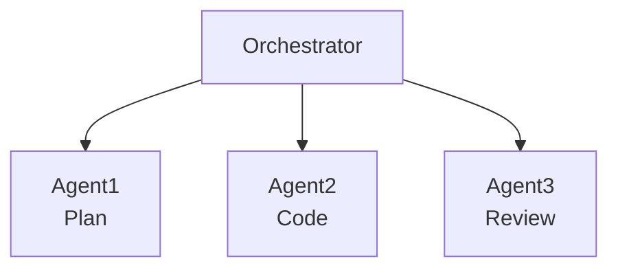
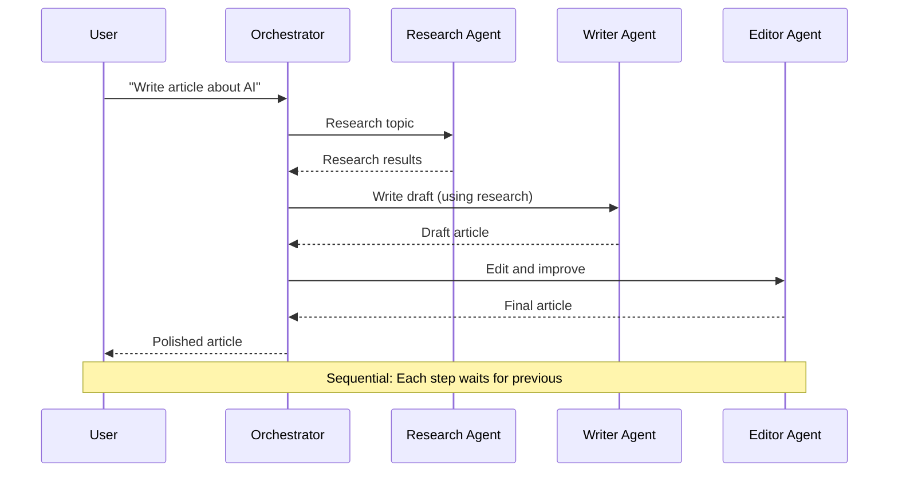
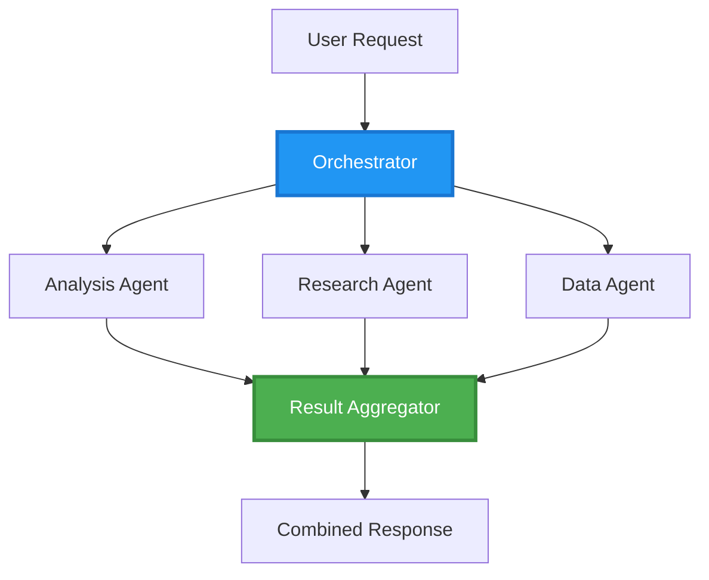
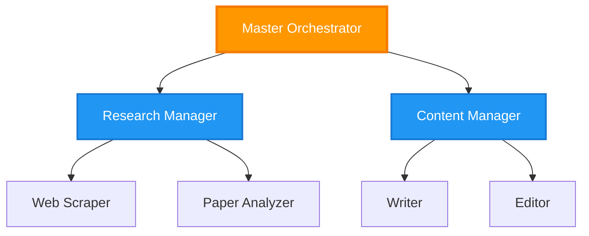
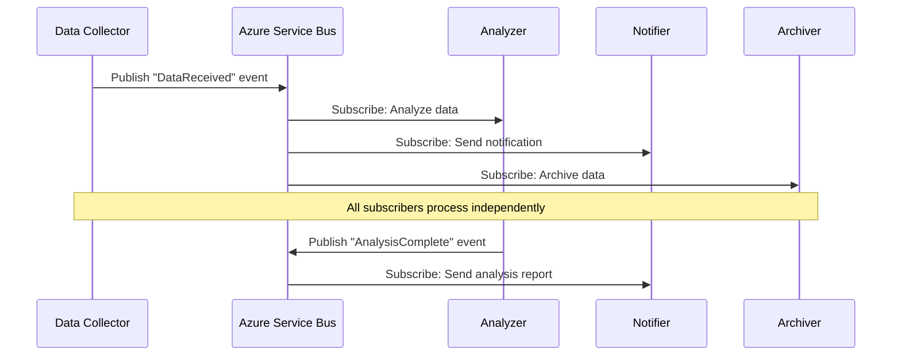
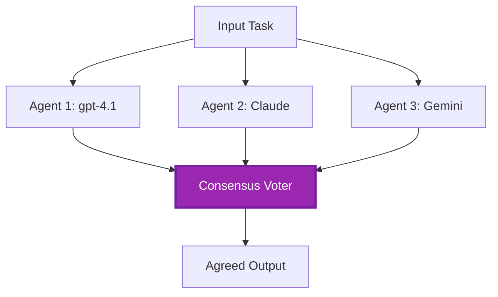
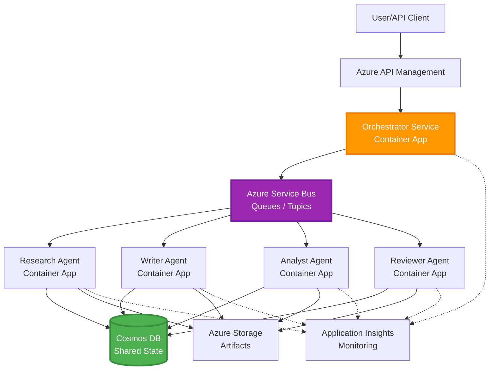

# Wzorce koordynacji wielu agentów

⏱️ **Przewidywany czas**: 60-75 minut czytania; kilka godzin na implementację | 💰 **Szacowany koszt**: zależny od nakładu pracy | ⭐ **Złożoność**: Zaawansowany

**📚 Ścieżka nauki:**
- ← Poprzedni: [Planowanie pojemności](capacity-planning.md) - strategie doboru zasobów i skalowania
- 🎯 **Jesteś tutaj**: Wzorce koordynacji wielu agentów (orkiestracja, komunikacja, zarządzanie stanem)
- → Następny: [Wybór SKU](sku-selection.md) - Wybór odpowiednich usług Azure
- 🏠 [Strona kursu](../../README.md)

---

## Czego się nauczysz

Po ukończeniu tej lekcji będziesz potrafił:
- Zrozumieć wzorce **architektury wielu agentów** oraz kiedy ich używać
- Zaimplementować **wzorce orkiestracji** (zcentralizowane, zdecentralizowane, hierarchiczne)
- Zaprojektować strategie **komunikacji agentów** (synchronizowana, asynchroniczna, sterowana zdarzeniami)
- Zarządzać **wspólnym stanem** w rozproszonych agentach
- Wdrożyć **systemy wielu agentów** na Azure za pomocą AZD
- Stosować **wzorce koordynacji** w scenariuszach AI z prawdziwego świata
- Monitorować i debugować rozproszone systemy agentów

## Dlaczego koordynacja wielu agentów jest ważna

### Ewolucja: Od pojedynczego agenta do wielu agentów

**Pojedynczy agent (prosty):**
```
User → Agent → Response
```
- ✅ Łatwy do zrozumienia i implementacji
- ✅ Szybki dla prostych zadań
- ❌ Ograniczony możliwościami jednego modelu
- ❌ Nie można równolegle wykonywać złożonych zadań
- ❌ Brak specjalizacji

**System wielu agentów (zaawansowany):**

```mermaid
graph TD
    Orchestrator[Orchestrator] --> Agent1[Agent1<br/>Plan]
    Orchestrator --> Agent2[Agent2<br/>Code]
    Orchestrator --> Agent3[Agent3<br/>Review]
```
- ✅ Agenci wyspecjalizowani w określonych zadaniach
- ✅ Równoległe wykonywanie dla szybkości
- ✅ Modularny i łatwy w utrzymaniu
- ✅ Lepszy w złożonych przepływach pracy
- ⚠️ Wymaga logiki koordynacji

**Analogia**: pojedynczy agent to jak jedna osoba wykonująca wszystkie zadania. Wielu agentów to jak zespół, gdzie każdy członek ma specjalistyczne umiejętności (badacz, programista, recenzent, pisarz) i pracują razem.

---

## Podstawowe wzorce koordynacji

### Wzorzec 1: Koordynacja sekwencyjna (Łańcuch odpowiedzialności)

**Kiedy używać**: Zadania muszą być wykonane w określonej kolejności, każdy agent korzysta z outputu poprzedniego.


```mermaid
sequenceDiagram
    participant User
    participant Orchestrator
    participant Agent1 as Research Agent
    participant Agent2 as Writer Agent
    participant Agent3 as Editor Agent
    
    User->>Orchestrator: "Write article about AI"
    Orchestrator->>Agent1: Research topic
    Agent1-->>Orchestrator: Research results
    Orchestrator->>Agent2: Write draft (using research)
    Agent2-->>Orchestrator: Draft article
    Orchestrator->>Agent3: Edit and improve
    Agent3-->>Orchestrator: Final article
    Orchestrator-->>User: Polished article
    
    Note over User,Agent3: Sequential: Each step waits for previous
```

**Korzyści:**
- ✅ Jasny przepływ danych
- ✅ Łatwe do debugowania
- ✅ Przewidywalna kolejność wykonania

**Ograniczenia:**
- ❌ Wolniejsze (brak równoległości)
- ❌ Jeden błąd blokuje cały łańcuch
- ❌ Nie radzi sobie z zadaniami wzajemnie zależnymi

**Przykładowe zastosowania:**
- Pipeline tworzenia treści (badania → pisanie → edycja → publikacja)
- Generowanie kodu (planowanie → implementacja → testy → wdrożenie)
- Generowanie raportów (zbieranie danych → analiza → wizualizacja → podsumowanie)

---

### Wzorzec 2: Koordynacja równoległa (Fan-Out/Fan-In)

**Kiedy używać**: Niezależne zadania mogą działać jednocześnie, wyniki są scalane na końcu.


```mermaid
graph TB
    User[User Request]
    Orchestrator[Orchestrator]
    Agent1[Analysis Agent]
    Agent2[Research Agent]
    Agent3[Data Agent]
    Aggregator[Result Aggregator]
    Response[Combined Response]
    
    User --> Orchestrator
    Orchestrator --> Agent1
    Orchestrator --> Agent2
    Orchestrator --> Agent3
    Agent1 --> Aggregator
    Agent2 --> Aggregator
    Agent3 --> Aggregator
    Aggregator --> Response
    
    style Orchestrator fill:#2196F3,stroke:#1976D2,stroke-width:3px,color:#fff
    style Aggregator fill:#4CAF50,stroke:#388E3C,stroke-width:3px,color:#fff
```

**Korzyści:**
- ✅ Szybkie (wykonanie równoległe)
- ✅ Odporne na błędy (akceptowalne częściowe wyniki)
- ✅ Skalowalne poziomo

**Ograniczenia:**
- ⚠️ Wyniki mogą przychodzić poza kolejnością
- ⚠️ Wymaga logiki agregacji
- ⚠️ Złożone zarządzanie stanem

**Przykładowe zastosowania:**
- Gromadzenie danych z wielu źródeł (API + bazy danych + web scraping)
- Analiza konkurencji (wiele modeli generuje rozwiązania, wybierany najlepszy)
- Usługi tłumaczeń (równoczesne tłumaczenie na wiele języków)

---

### Wzorzec 3: Koordynacja hierarchiczna (Manager-Pracownik)

**Kiedy używać**: Złożone przepływy pracy z podzadaniami, konieczność delegacji.


```mermaid
graph TB
    Master[Master Orchestrator]
    Manager1[Research Manager]
    Manager2[Content Manager]
    W1[Web Scraper]
    W2[Paper Analyzer]
    W3[Writer]
    W4[Editor]
    
    Master --> Manager1
    Master --> Manager2
    Manager1 --> W1
    Manager1 --> W2
    Manager2 --> W3
    Manager2 --> W4
    
    style Master fill:#FF9800,stroke:#F57C00,stroke-width:3px,color:#fff
    style Manager1 fill:#2196F3,stroke:#1976D2,stroke-width:2px,color:#fff
    style Manager2 fill:#2196F3,stroke:#1976D2,stroke-width:2px,color:#fff
```

**Korzyści:**
- ✅ Radzi sobie ze złożonymi przepływami pracy
- ✅ Modularny i łatwy w utrzymaniu
- ✅ Jasne granice odpowiedzialności

**Ograniczenia:**
- ⚠️ Bardziej skomplikowana architektura
- ⚠️ Wyższa latencja (wielowarstwowa koordynacja)
- ⚠️ Wymaga zaawansowanej orkiestracji

**Przykładowe zastosowania:**
- Przetwarzanie dokumentów korporacyjnych (klasyfikacja → kierowanie → przetwarzanie → archiwizacja)
- Wieloetapowe pipeline’y danych (pobieranie → czyszczenie → transformacja → analiza → raport)
- Złożone przepływy automatyzacji (planowanie → alokacja zasobów → wykonanie → monitoring)

---

### Wzorzec 4: Koordynacja zdarzeniowa (Publish-Subscribe)

**Kiedy używać**: Agenci muszą reagować na zdarzenia, pożądane jest luźne powiązanie.


```mermaid
sequenceDiagram
    participant Agent1 as Data Collector
    participant EventBus as Azure Service Bus
    participant Agent2 as Analyzer
    participant Agent3 as Notifier
    participant Agent4 as Archiver
    
    Agent1->>EventBus: Publish "DataReceived" event
    EventBus->>Agent2: Subscribe: Analyze data
    EventBus->>Agent3: Subscribe: Send notification
    EventBus->>Agent4: Subscribe: Archive data
    
    Note over Agent1,Agent4: All subscribers process independently
    
    Agent2->>EventBus: Publish "AnalysisComplete" event
    EventBus->>Agent3: Subscribe: Send analysis report
```

**Korzyści:**
- ✅ Luźne powiązanie między agentami
- ✅ Łatwe dodawanie nowych agentów (wystarczy subskrypcja)
- ✅ Asynchroniczne przetwarzanie
- ✅ Odporność (utrwalanie wiadomości)

**Ograniczenia:**
- ⚠️ Ostateczna spójność
- ⚠️ Trudne debugowanie
- ⚠️ Problemy z kolejnością wiadomości

**Przykładowe zastosowania:**
- Systemy monitoringu w czasie rzeczywistym (alerty, dashboardy, logi)
- Powiadomienia wielokanałowe (email, SMS, push, Slack)
- Pipeline’y przetwarzania danych (wielu konsumentów tych samych danych)

---

### Wzorzec 5: Koordynacja oparta na konsensusie (głosowanie/kworum)

**Kiedy używać**: Potrzeba uzyskania zgody od wielu agentów przed kontynuacją.


```mermaid
graph TB
    Input[Input Task]
    Agent1[Agent 1: gpt-4.1]
    Agent2[Agent 2: Claude]
    Agent3[Agent 3: Gemini]
    Voter[Consensus Voter]
    Output[Agreed Output]
    
    Input --> Agent1
    Input --> Agent2
    Input --> Agent3
    Agent1 --> Voter
    Agent2 --> Voter
    Agent3 --> Voter
    Voter --> Output
    
    style Voter fill:#9C27B0,stroke:#7B1FA2,stroke-width:3px,color:#fff
```

**Korzyści:**
- ✅ Wyższa dokładność (wiele opinii)
- ✅ Odporność na błędy (dopuszczalne awarie mniejszości)
- ✅ Wbudowana kontrola jakości

**Ograniczenia:**
- ❌ Drogi (wiele wywołań modeli)
- ❌ Wolniejszy (czekanie na wszystkich agentów)
- ⚠️ Wymaga rozwiązywania konfliktów

**Przykładowe zastosowania:**
- Moderacja treści (wiele modeli ocenia treść)
- Przegląd kodu (wiele linterów/analityków)
- Diagnostyka medyczna (wiele modeli AI, walidacja ekspercka)

---

## Przegląd architektury

### Kompletny system wielu agentów na Azure


```mermaid
graph TB
    User[User/API Client]
    APIM[Azure API Management]
    Orchestrator[Orchestrator Service<br/>Container App]
    ServiceBus[Azure Service Bus<br/>Queues / Topics]
    
    Agent1[Research Agent<br/>Container App]
    Agent2[Writer Agent<br/>Container App]
    Agent3[Analyst Agent<br/>Container App]
    Agent4[Reviewer Agent<br/>Container App]
    
    CosmosDB[(Cosmos DB<br/>Shared State)]
    Storage[Azure Storage<br/>Artifacts]
    AppInsights[Application Insights<br/>Monitoring]
    
    User --> APIM
    APIM --> Orchestrator
    
    Orchestrator --> ServiceBus
    ServiceBus --> Agent1
    ServiceBus --> Agent2
    ServiceBus --> Agent3
    ServiceBus --> Agent4
    
    Agent1 --> CosmosDB
    Agent2 --> CosmosDB
    Agent3 --> CosmosDB
    Agent4 --> CosmosDB
    
    Agent1 --> Storage
    Agent2 --> Storage
    Agent3 --> Storage
    Agent4 --> Storage
    
    Orchestrator -.-> AppInsights
    Agent1 -.-> AppInsights
    Agent2 -.-> AppInsights
    Agent3 -.-> AppInsights
    Agent4 -.-> AppInsights
    
    style Orchestrator fill:#FF9800,stroke:#F57C00,stroke-width:3px,color:#fff
    style ServiceBus fill:#9C27B0,stroke:#7B1FA2,stroke-width:3px,color:#fff
    style CosmosDB fill:#4CAF50,stroke:#388E3C,stroke-width:3px,color:#fff
```

**Kluczowe komponenty:**

| Komponent | Przeznaczenie | Usługa Azure |
|-----------|--------------|--------------|
| **API Gateway** | Punkt wejścia, ograniczanie przepływu, uwierzytelnianie | API Management |
| **Orkiestrator** | Koordynacja przepływów pracy agentów | Container Apps |
| **Kolejka wiadomości** | Komunikacja asynchroniczna | Service Bus / Event Hubs |
| **Agenci** | Wyspecjalizowani pracownicy AI | Container Apps / Functions |
| **Magazyn stanu** | Wspólny stan, śledzenie zadań | Cosmos DB |
| **Magazyn artefaktów** | Dokumenty, wyniki, logi | Blob Storage |
| **Monitorowanie** | Śledzenie rozproszone, logi | Application Insights |

Kolejki/tematy Service Bus i Event Hubs to różne usługi o różnych modelach dostarczania/konsumpcji; Event Hubs nie jest bezpośrednim zamiennikiem kodu pracownika Service Bus poniżej. Równoległość, utrwalone wiadomości i głosowanie modeli same w sobie nie gwarantują odporności na błędy ani wyższej dokładności.

---

## Wymagania wstępne

### Wymagane narzędzia

```bash
# Verify Azure Developer CLI
azd version
# Command reference baseline: azd 1.37.2

# Verify Azure CLI
az --version
# ✅ Expected: azure-cli 2.50.0 or higher

# Verify Docker (for local testing)
docker --version
# ✅ Expected: Docker version 20.10 or higher
```

### Wymagania Azure

- Aktywna subskrypcja Azure
- Uprawnienia do tworzenia:
  - Container Apps
  - Namespace Service Bus
  - Konta Cosmos DB
  - Konta Storage
  - Application Insights

### Wymagania wiedzy

Powinieneś ukończyć:
- [Zarządzanie konfiguracją](../chapter-03-configuration/configuration.md)
- [Uwierzytelnianie i bezpieczeństwo](../chapter-03-configuration/authsecurity.md)
- [Przykład mikrousług](../../../../examples/microservices)

---

## Przewodnik po implementacji

> **Fragmenty projektowe, a nie wdrażalny lab:** Drzewo projektu i etykiety `File:` poniżej opisują pliki do utworzenia we własnym projekcie; to repozytorium nie zawiera kompletnej aplikacji `multi-agent-system`. Brakujące elementy to szablony main/parameter, środowisko/registry Container Apps, Dockerfile i pliki blokujące zależności, konfiguracja bazy danych Cosmos, wdrożenia modeli, konfiguracja tożsamości/rola, reguły skalowania oraz równolegli pracownicy/kolejki. Nie oczekuj, że `azd init` wygeneruje te pliki ani, że `azd up` wdroży niezmienione fragmenty. Dla wykonalnego punktu wyjścia ukończ [Podstawy wielu agentów](../chapter-05-multi-agent/multi-agent-basics.md).

**Założenia środowiskowe:** Python 3.10+, `azure-servicebus`, `azure-cosmos`, `openai`, Flask oraz (do monitoringu) `azure-monitor-opentelemetry`; umieść `shared` na ścieżce importu Pythona w każdym obrazie usługi. Kontener Cosmos `agent-state/tasks` musi już istnieć z kluczem partycji `/id`. Połączenia oparte na kluczach upraszczają te fragmenty, to nie wskazania produkcyjne: preferuj tożsamości zarządzane z rolami poziomu danych Service Bus/Cosmos/OpenAI. Nie ujawniaj kluczy w outputach ani logach.

Dostarczanie Service Bus jest **przynajmniej raz**. Zachowaj idempotencję na poziomie zadania **i kroku**, stosuj optymistyczną współbieżność (ETagi) do odczytu/modyfikacji/zapisu stanu i odnawiaj blokady wiadomości przy długim przetwarzaniu. Poniższy prosty menedżer stanu obsługuje tylko sekwencje i nie implementuje tych gwarancji produkcyjnych.

### Struktura projektu

```
multi-agent-system/
├── azure.yaml                    # AZD configuration
├── infra/
│   ├── main.bicep               # Main infrastructure
│   ├── core/
│   │   ├── servicebus.bicep     # Message queue
│   │   ├── cosmos.bicep         # State store
│   │   ├── storage.bicep        # Artifact storage
│   │   └── monitoring.bicep     # Application Insights
│   └── app/
│       ├── orchestrator.bicep   # Orchestrator service
│       └── agent.bicep          # Agent template
└── src/
    ├── orchestrator/            # Orchestration logic
    │   ├── app.py
    │   ├── workflows.py
    │   └── Dockerfile
    ├── agents/
    │   ├── research/            # Research agent
    │   ├── writer/              # Writer agent
    │   ├── analyst/             # Analyst agent
    │   └── reviewer/            # Reviewer agent
    └── shared/
        ├── state_manager.py     # Shared state logic
        └── message_handler.py   # Message handling
```

---

## Lekcja 1: Wzorzec koordynacji sekwencyjnej

### Implementacja: Pipeline tworzenia treści

Zaprojektujmy pipeline sekwencyjny: Badania → Pisanie → Edycja. Publikacja poza tym przykładem.

### 1. Konfiguracja AZD

**Plik: `azure.yaml`**

```yaml
name: content-pipeline
metadata:
  template: multi-agent-sequential@1.0.0

services:
  orchestrator:
    project: ./src/orchestrator
    language: python
    host: containerapp
  
  research-agent:
    project: ./src/agents/research
    language: python
    host: containerapp
  
  writer-agent:
    project: ./src/agents/writer
    language: python
    host: containerapp
  
  editor-agent:
    project: ./src/agents/editor
    language: python
    host: containerapp
```

### 2. Infrastruktura: Service Bus dla koordynacji

**Plik: `infra/core/servicebus.bicep`**

```bicep
param name string
param location string
param tags object = {}

resource serviceBusNamespace 'Microsoft.ServiceBus/namespaces@2022-10-01-preview' = {
  name: name
  location: location
  tags: tags
  sku: {
    name: 'Standard'
    tier: 'Standard'
  }
  properties: {
    minimumTlsVersion: '1.2'
  }
}

// Queue for orchestrator → research agent
resource researchQueue 'Microsoft.ServiceBus/namespaces/queues@2022-10-01-preview' = {
  parent: serviceBusNamespace
  name: 'research-tasks'
  properties: {
    maxDeliveryCount: 3
    lockDuration: 'PT5M'
    deadLetteringOnMessageExpiration: true
  }
}

// Queue for research agent → writer agent
resource writerQueue 'Microsoft.ServiceBus/namespaces/queues@2022-10-01-preview' = {
  parent: serviceBusNamespace
  name: 'writer-tasks'
  properties: {
    maxDeliveryCount: 3
    lockDuration: 'PT5M'
  }
}

// Queue for writer agent → editor agent
resource editorQueue 'Microsoft.ServiceBus/namespaces/queues@2022-10-01-preview' = {
  parent: serviceBusNamespace
  name: 'editor-tasks'
  properties: {
    maxDeliveryCount: 3
    lockDuration: 'PT5M'
  }
}

output namespace string = serviceBusNamespace.name
// Do not output RootManageSharedAccessKey. Resolve scoped credentials
// securely or use managed identity in the application and scale rules.
```

### 3. Menedżer stanu współdzielonego

**Plik: `src/shared/state_manager.py`**

```python
from azure.cosmos import CosmosClient, PartitionKey
from datetime import datetime, timezone
import os

class StateManager:
    """Manages shared state across agents using Cosmos DB"""
    
    def __init__(self):
        endpoint = os.environ['COSMOS_ENDPOINT']
        key = os.environ['COSMOS_KEY']
        
        self.client = CosmosClient(endpoint, key)
        self.database = self.client.get_database_client('agent-state')
        self.container = self.database.get_container_client('tasks')
    
    def create_task(self, task_id: str, task_type: str, input_data: dict):
        """Create a new task"""
        task = {
            'id': task_id,
            'type': task_type,
            'status': 'pending',
            'input': input_data,
            'created_at': datetime.now(timezone.utc).isoformat(),
            'steps': []
        }
        self.container.create_item(task)
        return task
    
    def update_task_step(self, task_id: str, step_name: str, result: dict):
        """Update task with completed step"""
        task = self.container.read_item(task_id, partition_key=task_id)
        
        task['steps'].append({
            'name': step_name,
            'completed_at': datetime.now(timezone.utc).isoformat(),
            'result': result
        })
        
        self.container.replace_item(task_id, task)
        return task
    
    def complete_task(self, task_id: str, final_result: dict):
        """Mark task as complete"""
        task = self.container.read_item(task_id, partition_key=task_id)
        task['status'] = 'completed'
        task['result'] = final_result
        task['completed_at'] = datetime.now(timezone.utc).isoformat()
        self.container.replace_item(task_id, task)
        return task
    
    def get_task(self, task_id: str):
        """Retrieve task state"""
        return self.container.read_item(task_id, partition_key=task_id)
```

### 4. Usługa orkiestratora

**Plik: `src/orchestrator/app.py`**

```python
from flask import Flask, request, jsonify
from azure.servicebus import ServiceBusClient, ServiceBusMessage
import json
import uuid
import os
from shared.state_manager import StateManager

app = Flask(__name__)
state_manager = StateManager()

# Service Bus connection
servicebus_connection_str = os.environ['SERVICEBUS_CONNECTION_STRING']
servicebus_client = ServiceBusClient.from_connection_string(servicebus_connection_str)

@app.route('/health', methods=['GET'])
def health():
    return jsonify({'status': 'healthy', 'service': 'orchestrator'})

@app.route('/create-content', methods=['POST'])
def create_content():
    """
    Sequential workflow: Research → Write → Edit (returns a draft; no publishing)
    """
    data = request.get_json(silent=True) or {}
    topic = data.get('topic')
    
    if not topic:
        return jsonify({'error': 'Topic required'}), 400
    
    # Create task in state store
    task_id = str(uuid.uuid4())
    task = state_manager.create_task(
        task_id=task_id,
        task_type='content_creation',
        input_data={'topic': topic}
    )
    
    # Send message to research agent (first step)
    sender = servicebus_client.get_queue_sender('research-tasks')
    message = ServiceBusMessage(
        body=json.dumps({
            'task_id': task_id,
            'topic': topic,
            'next_queue': 'writer-tasks'  # Where to send results
        }),
        content_type='application/json'
    )
    
    with sender:
        sender.send_messages(message)
    
    return jsonify({
        'task_id': task_id,
        'status': 'started',
        'workflow': 'sequential',
        'steps': ['research', 'write', 'edit'],
        'message': 'Content creation pipeline initiated'
    }), 202

@app.route('/task/<task_id>', methods=['GET'])
def get_task_status(task_id):
    """Check task status"""
    try:
        task = state_manager.get_task(task_id)
        return jsonify(task)
    except Exception as e:
        return jsonify({'error': str(e)}), 404

if __name__ == '__main__':
    app.run(host='0.0.0.0', port=8080)
```

### 5. Agent badawczy

**Plik: `src/agents/research/app.py`**

```python
from azure.servicebus import ServiceBusClient, ServiceBusMessage
from openai import AzureOpenAI
import json
import os
import time
from shared.state_manager import StateManager

# Initialize clients
state_manager = StateManager()
servicebus_client = ServiceBusClient.from_connection_string(
    os.environ['SERVICEBUS_CONNECTION_STRING']
)

openai_client = AzureOpenAI(
    api_key=os.environ['AZURE_OPENAI_API_KEY'],
    api_version="2024-10-21",
    azure_endpoint=os.environ['AZURE_OPENAI_ENDPOINT']
)

def process_research_task(message_data):
    """Process research request and pass to writer"""
    task_id = message_data['task_id']
    topic = message_data['topic']
    next_queue = message_data['next_queue']
    
    print(f"🔬 Researching: {topic}")
    
    # Call Microsoft Foundry Models for research
    response = openai_client.chat.completions.create(
        model=os.environ['AZURE_OPENAI_DEPLOYMENT'],
        messages=[
            {"role": "system", "content": "You are a research assistant. Provide comprehensive research on the given topic."},
            {"role": "user", "content": f"Research this topic thoroughly: {topic}"}
        ],
        max_tokens=1500
    )
    
    research_results = response.choices[0].message.content
    
    # Update state
    state_manager.update_task_step(
        task_id=task_id,
        step_name='research',
        result={'research': research_results}
    )
    
    # Send to next agent (writer)
    sender = servicebus_client.get_queue_sender(next_queue)
    message = ServiceBusMessage(
        body=json.dumps({
            'task_id': task_id,
            'topic': topic,
            'research': research_results,
            'next_queue': 'editor-tasks'
        }),
        content_type='application/json'
    )
    
    with sender:
        sender.send_messages(message)
    
    print(f"✅ Research complete for task {task_id}")

def main():
    """Listen to research queue"""
    receiver = servicebus_client.get_queue_receiver('research-tasks')
    
    print("🔬 Research Agent started, listening for tasks...")
    
    with receiver:
        while True:
            messages = receiver.receive_messages(max_wait_time=5)
            for message in messages:
                try:
                    message_data = json.loads(str(message))
                    process_research_task(message_data)
                    receiver.complete_message(message)
                except Exception as e:
                    print(f"❌ Error processing message: {e}")
                    receiver.abandon_message(message)

if __name__ == '__main__':
    main()
```

### 6. Agent pisarz

**Plik: `src/agents/writer/app.py`**

```python
from azure.servicebus import ServiceBusClient, ServiceBusMessage
from openai import AzureOpenAI
import json
import os
from shared.state_manager import StateManager

state_manager = StateManager()
servicebus_client = ServiceBusClient.from_connection_string(
    os.environ['SERVICEBUS_CONNECTION_STRING']
)

openai_client = AzureOpenAI(
    api_key=os.environ['AZURE_OPENAI_API_KEY'],
    api_version="2024-10-21",
    azure_endpoint=os.environ['AZURE_OPENAI_ENDPOINT']
)

def process_writing_task(message_data):
    """Write article based on research"""
    task_id = message_data['task_id']
    topic = message_data['topic']
    research = message_data['research']
    next_queue = message_data['next_queue']
    
    print(f"✍️ Writing article: {topic}")
    
    # Call Microsoft Foundry Models to write article
    response = openai_client.chat.completions.create(
        model=os.environ['AZURE_OPENAI_DEPLOYMENT'],
        messages=[
            {"role": "system", "content": "You are a professional writer. Write engaging, well-structured articles."},
            {"role": "user", "content": f"Based on this research:\n\n{research}\n\nWrite a comprehensive article about: {topic}"}
        ],
        max_tokens=2000
    )
    
    article_draft = response.choices[0].message.content
    
    # Update state
    state_manager.update_task_step(
        task_id=task_id,
        step_name='writing',
        result={'draft': article_draft}
    )
    
    # Send to editor
    sender = servicebus_client.get_queue_sender(next_queue)
    message = ServiceBusMessage(
        body=json.dumps({
            'task_id': task_id,
            'topic': topic,
            'draft': article_draft
        }),
        content_type='application/json'
    )
    
    with sender:
        sender.send_messages(message)
    
    print(f"✅ Article draft complete for task {task_id}")

def main():
    """Listen to writer queue"""
    receiver = servicebus_client.get_queue_receiver('writer-tasks')
    
    print("✍️ Writer Agent started, listening for tasks...")
    
    with receiver:
        while True:
            messages = receiver.receive_messages(max_wait_time=5)
            for message in messages:
                try:
                    message_data = json.loads(str(message))
                    process_writing_task(message_data)
                    receiver.complete_message(message)
                except Exception as e:
                    print(f"❌ Error: {e}")
                    receiver.abandon_message(message)

if __name__ == '__main__':
    main()
```

### 7. Agent redaktor

**Plik: `src/agents/editor/app.py`**

```python
from azure.servicebus import ServiceBusClient
from openai import AzureOpenAI
import json
import os
from shared.state_manager import StateManager

state_manager = StateManager()
servicebus_client = ServiceBusClient.from_connection_string(
    os.environ['SERVICEBUS_CONNECTION_STRING']
)

openai_client = AzureOpenAI(
    api_key=os.environ['AZURE_OPENAI_API_KEY'],
    api_version="2024-10-21",
    azure_endpoint=os.environ['AZURE_OPENAI_ENDPOINT']
)

def process_editing_task(message_data):
    """Edit and finalize article"""
    task_id = message_data['task_id']
    topic = message_data['topic']
    draft = message_data['draft']
    
    print(f"📝 Editing article: {topic}")
    
    # Call Microsoft Foundry Models to edit
    response = openai_client.chat.completions.create(
        model=os.environ['AZURE_OPENAI_DEPLOYMENT'],
        messages=[
            {"role": "system", "content": "You are an expert editor. Improve grammar, clarity, and structure."},
            {"role": "user", "content": f"Edit and improve this article:\n\n{draft}"}
        ],
        max_tokens=2000
    )
    
    final_article = response.choices[0].message.content
    
    # Mark task as complete
    state_manager.complete_task(
        task_id=task_id,
        final_result={
            'topic': topic,
            'final_article': final_article,
            'word_count': len(final_article.split())
        }
    )
    
    print(f"✅ Article finalized for task {task_id}")

def main():
    """Listen to editor queue"""
    receiver = servicebus_client.get_queue_receiver('editor-tasks')
    
    print("📝 Editor Agent started, listening for tasks...")
    
    with receiver:
        while True:
            messages = receiver.receive_messages(max_wait_time=5)
            for message in messages:
                try:
                    message_data = json.loads(str(message))
                    process_editing_task(message_data)
                    receiver.complete_message(message)
                except Exception as e:
                    print(f"❌ Error: {e}")
                    receiver.abandon_message(message)

if __name__ == '__main__':
    main()
```

### 8. Wdrażanie i testowanie

Te polecenia stosuj **tylko po implementacji brakujących plików projektu**. Inicjalizacja agenta interaktywnego Foundry to osobny workflow; nie generuje tego projektu Service Bus.

```bash
# In your completed custom project
azd up

# Alternative in a SEPARATE empty folder (agents beta.23 requires azd >= 1.37)
azd extension install azure.ai.agents
azd ai agent init
azd up
```

> Zobacz [polecenia AZD AI CLI](../chapter-08-production/production-ai-practices.md#azd-ai-cli-commands-and-extensions) dla wszystkich flag i opcji `azd ai`.

```bash
# Get orchestrator URL
ORCHESTRATOR_URL=$(azd env get-values | grep ORCHESTRATOR_URL | cut -d '=' -f2 | tr -d '"')

# Create content
curl -X POST $ORCHESTRATOR_URL/create-content \
  -H "Content-Type: application/json" \
  -d '{"topic": "The Future of AI in Healthcare"}'
```

**✅ Oczekiwany output:**
```json
{
  "task_id": "a1b2c3d4-e5f6-7890-abcd-ef1234567890",
  "status": "started",
  "workflow": "sequential",
  "steps": ["research", "write", "edit"],
  "message": "Content creation pipeline initiated"
}
```

**Sprawdź postęp zadań:**
```bash
TASK_ID="a1b2c3d4-e5f6-7890-abcd-ef1234567890"
curl $ORCHESTRATOR_URL/task/$TASK_ID
```

**✅ Oczekiwany output (ukończone):**
```json
{
  "id": "a1b2c3d4-e5f6-7890-abcd-ef1234567890",
  "type": "content_creation",
  "status": "completed",
  "steps": [
    {
      "name": "research",
      "completed_at": "2025-11-19T10:30:00Z",
      "result": {"research": "..."}
    },
    {
      "name": "writing",
      "completed_at": "2025-11-19T10:32:00Z",
      "result": {"draft": "..."}
    }
  ],
  "result": {
    "topic": "The Future of AI in Healthcare",
    "final_article": "...",
    "word_count": 1500
  }
}
```

---

## Lekcja 2: Wzorzec koordynacji równoległej

### Implementacja: Agregator badań z wielu źródeł

Zbudujmy system równoległy, który zbiera informacje z wielu źródeł jednocześnie.

### Orkiestrator równoległy

**Plik: `src/orchestrator/parallel_workflow.py`**

```python
from flask import Flask, request, jsonify
from azure.servicebus import ServiceBusClient, ServiceBusMessage
import json
import uuid
import os
from shared.state_manager import StateManager

app = Flask(__name__)
state_manager = StateManager()

servicebus_client = ServiceBusClient.from_connection_string(
    os.environ['SERVICEBUS_CONNECTION_STRING']
)

@app.route('/research-parallel', methods=['POST'])
def research_parallel():
    """
    Parallel workflow: Multiple agents work simultaneously
    """
    data = request.json
    query = data.get('query')
    
    task_id = str(uuid.uuid4())
    task = state_manager.create_task(
        task_id=task_id,
        task_type='parallel_research',
        input_data={
            'query': query,
            'agents': ['web', 'academic', 'news', 'social']
        }
    )
    
    # Fan-out: publish sequentially; workers may process concurrently.
    agents = [
        ('web-research-queue', 'web'),
        ('academic-research-queue', 'academic'),
        ('news-research-queue', 'news'),
        ('social-research-queue', 'social')
    ]
    
    for queue_name, agent_type in agents:
        sender = servicebus_client.get_queue_sender(queue_name)
        message = ServiceBusMessage(
            body=json.dumps({
                'task_id': task_id,
                'query': query,
                'agent_type': agent_type,
                'result_queue': 'aggregation-queue'
            }),
            content_type='application/json'
        )
        
        with sender:
            sender.send_messages(message)
    
    return jsonify({
        'task_id': task_id,
        'status': 'started',
        'workflow': 'parallel',
        'agents_dispatched': 4,
        'message': 'Parallel research initiated'
    }), 202

if __name__ == '__main__':
    app.run(host='0.0.0.0', port=8080)
```

### Logika agregacji

**Plik: `src/agents/aggregator/app.py`**

```python
from azure.servicebus import ServiceBusClient
import json
import os
from collections import defaultdict
from shared.state_manager import StateManager

state_manager = StateManager()
servicebus_client = ServiceBusClient.from_connection_string(
    os.environ['SERVICEBUS_CONNECTION_STRING']
)

# Single-process demo only: not durable or shared across replicas.
# Production: use durable unique (task_id, agent_type) result records.
task_results = defaultdict(dict)
expected_agents = 4  # web, academic, news, social

def process_result(message_data):
    """Aggregate results from parallel agents"""
    task_id = message_data['task_id']
    agent_type = message_data['agent_type']
    result = message_data['result']
    
    # Store result
    task_results[task_id][agent_type] = {
        'agent': agent_type,
        'data': result
    }
    
    print(f"📊 Received result from {agent_type} agent ({len(task_results[task_id])}/{expected_agents})")
    
    # Check if all agents completed (fan-in)
    if len(task_results[task_id]) == expected_agents:
        print(f"✅ All agents completed for task {task_id}. Aggregating...")
        
        # Combine results
        aggregated = {
            'query': message_data['query'],
            'sources': list(task_results[task_id].values()),
            'summary': generate_summary(list(task_results[task_id].values()))
        }
        
        # Mark complete
        state_manager.complete_task(task_id, aggregated)
        
        # Clean up
        del task_results[task_id]
        
        print(f"✅ Aggregation complete for task {task_id}")

def generate_summary(results):
    """Generate summary from all sources"""
    summaries = [r['data'].get('summary', '') for r in results]
    return '\n\n'.join(summaries)

def main():
    """Listen to aggregation queue"""
    receiver = servicebus_client.get_queue_receiver('aggregation-queue')
    
    print("📊 Aggregator started, listening for results...")
    
    with receiver:
        while True:
            messages = receiver.receive_messages(max_wait_time=5)
            for message in messages:
                try:
                    message_data = json.loads(str(message))
                    process_result(message_data)
                    receiver.complete_message(message)
                except Exception as e:
                    print(f"❌ Error: {e}")
                    receiver.abandon_message(message)

if __name__ == '__main__':
    main()
```

**Korzyści wzorca równoległego:**
- ⚡ **Potencjalnie niższa latencja** (ograniczona przez najwolniejszego pracownika plus narzut koordynacji)
- 🔄 **Może obsługiwać wyniki częściowe** z określonymi deadline'ami i polityką awarii (niezaimplementowane przez podstawowy agregator)
- 📈 **Skalowalny** (łatwe dodawanie agentów)

---

## Ćwiczenia praktyczne

### Ćwiczenie 1: Dodaj obsługę timeoutu ⭐⭐ (średni)

**Cel**: Zaimplementuj logikę timeoutu, aby agregator nie czekał wiecznie na wolnych agentów.

**Punkt startowy:** Uruchom symulację lokalnego deadline przed integracją z workerem kolejki. Timeout sprawdzany tylko przy nadejściu innej wiadomości nigdy nie zadziała, jeśli brakujący pracownik nic nie wyśle.

**Kroki**:

1. **Dodaj śledzenie timeoutu do agregatora:**

```python
import asyncio

async def simulated_agent(name, delay):
    await asyncio.sleep(delay)
    return {'agent': name, 'result': 'done'}

async def main():
    tasks = [asyncio.create_task(simulated_agent(name, delay))
             for name, delay in [('web', 0.1), ('academic', 0.2),
                                 ('news', 0.3), ('social', 3)]]
    done, pending = await asyncio.wait(tasks, timeout=1)
    results = [task.result() for task in done]
    for task in pending:
        task.cancel()
    await asyncio.gather(*pending, return_exceptions=True)
    print({'completed_agents': len(results), 'timed_out': bool(pending)})
    assert len(results) == 3 and pending

asyncio.run(main())
```

2. **Oczekiwany output:**

```text
{'completed_agents': 3, 'timed_out': True}
```

3. **Integracja z systemem kolejki (zadanie projektowe):** Zachowaj deadline dispatchu i oczekiwanych agentów przy tworzeniu zadania, uruchamiaj cykliczne sprawdzanie deadline’u niezależnie od nadejścia wyników, atomowo finalizuj częściowe wyniki, ignoruj spóźnione/duplikaty dla ukończonych zadań. Lokalny timeout nie anuluje zdalnych pracowników.

Tylko dla swojego zaimplementowanego projektu:

```bash
azd deploy aggregator

# Submit task
curl -X POST $ORCHESTRATOR_URL/research-parallel \
  -H "Content-Type: application/json" \
  -d '{"query": "AI safety research"}'

# Check results after 30 seconds
curl $ORCHESTRATOR_URL/task/$TASK_ID
```

**✅ Kryteria sukcesu:**
- ✅ Test lokalny kończy się po jednej sekundzie, nawet jeśli agent jest nieukończony
- ✅ Odpowiedź wskazuje częściowe wyniki (`"timed_out": true`)
- ✅ Zwracane są dostępne wyniki (3 z 4 agentów)

**Czas**: 20-25 minut

---

### Ćwiczenie 2: Wdroż retry logic ⭐⭐⭐ (zaawansowany)

**Cel**: Automatycznie powtarzaj nieudane zadania agentów przed poddaniem się.

**Kroki**:

1. **Wykorzystaj licznik dostarczeń Service Bus zamiast własnych liczników retry w kolejkach:**

```python
import json
import time
# Integration fragment: use a live peek-lock ServiceBusReceiver.
# Set queue maxDeliveryCount to 4 for one attempt + up to three retries.
```

2. **Dodaj obsługę retry do agentów:**

```python
def process_with_retry(message, receiver, process_func):
    """Process message with automatic retry on failure"""
    try:
        message_data = json.loads(str(message))
        
        # Process the message
        process_func(message_data)
        
        # Success - complete
        receiver.complete_message(message)
        
    except Exception as e:
        if message.delivery_count < 4:
            # Bounded exponential delay: 5s, 10s, 20s.
            # Renew the lock if processing + waiting can exceed its duration.
            time.sleep(5 * 2 ** (message.delivery_count - 1))
            receiver.abandon_message(message)
        else:
            # Max retries exceeded - move to dead letter queue
            print(f"❌ Max attempts exceeded for message {message.message_id}")
            receiver.dead_letter_message(
                message,
                reason="MaxRetriesExceeded",
                error_description=str(e)
            )
```

3. **Monitoruj kolejkę dead letter:**

```python
def monitor_dead_letters():
    """Check dead letter queue for failed messages"""
    receiver = servicebus_client.get_queue_receiver(
        'research-tasks',
        sub_queue='deadletter'
    )
    
    with receiver:
        messages = receiver.receive_messages(max_wait_time=5)
        for message in messages:
            print(f"☠️ Dead letter: {message.message_id}")
            print(f"Reason: {message.dead_letter_reason}")
            print(f"Description: {message.dead_letter_error_description}")
```

**✅ Kryteria sukcesu:**
- ✅ Nieudane zadania retry automatycznie (do 3 razy)
- ✅ Eksponencjalne opóźnienie między powtórkami (5s, 10s, 20s), z odnawianiem blokad wiadomości gdy potrzebne
- ✅ Po maksymalnej liczbie retry wiadomości trafiają do kolejki dead letter
- ✅ Wiadomości z dead letter można analizować; replay wymaga osobnego workflow odzyskiwania idempotentnego

**Czas**: 30-40 minut

---

### Ćwiczenie 3: Wdroż circuit breaker ⭐⭐⭐ (zaawansowany)

**Cel**: Zapobiegać kaskadowym awariom, zatrzymując żądania do zawodzących agentów.

**Kroki**:

1. **Utwórz klasę circuit breaker:**

```python
from enum import Enum
from datetime import datetime, timedelta, timezone

class CircuitState(Enum):
    CLOSED = "closed"      # Normal operation
    OPEN = "open"          # Failing, reject requests
    HALF_OPEN = "half_open"  # Testing if recovered

class CircuitBreaker:
    def __init__(self, failure_threshold=5, timeout_seconds=60):
        self.failure_threshold = failure_threshold
        self.timeout_seconds = timeout_seconds
        self.failure_count = 0
        self.last_failure_time = None
        self.state = CircuitState.CLOSED
    
    def call(self, func):
        """Execute function with circuit breaker protection"""
        if self.state == CircuitState.OPEN:
            # Check if timeout expired
            if datetime.now(timezone.utc) - self.last_failure_time > timedelta(seconds=self.timeout_seconds):
                self.state = CircuitState.HALF_OPEN
                print("🔄 Circuit breaker: HALF_OPEN (testing)")
            else:
                raise Exception(f"Circuit breaker OPEN for agent. Try again in {self.timeout_seconds}s")
        
        try:
            result = func()
            
            # Success
            self.failure_count = 0 # Count consecutive failures only
            if self.state == CircuitState.HALF_OPEN:
                self.state = CircuitState.CLOSED
                self.failure_count = 0
                print("✅ Circuit breaker: CLOSED (recovered)")
            
            return result
            
        except Exception as e:
            self.failure_count += 1
            self.last_failure_time = datetime.now(timezone.utc)
            
            if self.failure_count >= self.failure_threshold:
                self.state = CircuitState.OPEN
                print(f"🔴 Circuit breaker: OPEN (too many failures)")
            
            raise
```

2. **Zastosuj do wywołań agentów:**

```python
# In orchestrator
agent_circuits = {
    'web': CircuitBreaker(failure_threshold=5, timeout_seconds=60),
    'academic': CircuitBreaker(failure_threshold=5, timeout_seconds=60),
    'news': CircuitBreaker(failure_threshold=5, timeout_seconds=60),
    'social': CircuitBreaker(failure_threshold=5, timeout_seconds=60)
}

def send_to_agent(agent_type, message_data):
    """Send with circuit breaker protection"""
    circuit = agent_circuits[agent_type]
    
    try:
        circuit.call(lambda: send_message(agent_type, message_data))
    except Exception as e:
        print(f"⚠️ Skipping {agent_type} agent: {e}")
        # Continue with other agents
```

Ten obwód chroni **operację wysyłania**, a nie zakończenie przez zdalnego pracownika: pomyślne dodanie wiadomości do kolejki nic nie mówi o tym, czy agent jest aktywny. `send_message` to funkcja wysyłkowa Twojej aplikacji. Dla obwodów wykonawczych wprowadź zaobserwowane błędy/zapomnienia zadań do trwałego koordynatora. Ta klasa w pamięci jest demonstracją jednowątkową, a nie rozproszonym wyłącznikiem obwodów.

3. **Testuj wyłącznik obwodu lokalnie:**

```python
# Run after the class definition; no Azure changes required.
circuit = CircuitBreaker(failure_threshold=5, timeout_seconds=0)
def fail():
    raise RuntimeError("simulated failure")
for _ in range(5):
    try:
        circuit.call(fail)
    except RuntimeError:
        pass
assert circuit.state == CircuitState.OPEN
assert circuit.call(lambda: "recovered") == "recovered"
assert circuit.state == CircuitState.CLOSED
print("Circuit breaker recovery verified")
```

**✅ Kryteria sukcesu:**
- ✅ Po 5 niepowodzeniach, obwód się otwiera (odrzuca żądania)
- ✅ Po 60 sekundach obwód przechodzi w stan półotwarty (testuje odzyskiwanie)
- ✅ Inni agenci działają normalnie
- ✅ Obwód zamyka się automatycznie, gdy agent się odzyskuje

**Czas**: 40-50 minut

---

## Monitorowanie i debugowanie

### Rozproszone śledzenie w Application Insights

**Plik: `src/shared/tracing.py`**

```python
from azure.monitor.opentelemetry import configure_azure_monitor
from opentelemetry import trace
from opentelemetry.trace import SpanKind
import logging
import os

connection_string = os.environ.get('APPLICATIONINSIGHTS_CONNECTION_STRING')

# Configure once per process. Message send/receive trace-context propagation
# and agent attributes on exceptions need explicit instrumentation.
if connection_string:
    configure_azure_monitor(connection_string=connection_string, logger_name=__name__)
tracer = trace.get_tracer(__name__)

# Configure logging
logger = logging.getLogger(__name__)
logger.setLevel(logging.INFO)

def trace_agent_call(agent_name, task_id, operation_name, operation):
    """Trace agent operations"""
    with tracer.start_as_current_span(f'agent.{agent_name}.{operation_name}', kind=SpanKind.CLIENT) as span:
        span.set_attribute('agent', agent_name)
        span.set_attribute('task_id', task_id)
        span.set_attribute('operation', operation_name)
        
        try:
            result = operation()
            span.set_attribute('status', 'success')
            logger.info('Agent operation completed', extra={
                'agent': agent_name, 'task_id': task_id, 'operation': operation_name
            })
            return result
        except Exception as e:
            span.set_attribute('status', 'error')
            logger.exception('Agent operation failed', extra={
                'agent': agent_name, 'task_id': task_id, 'operation': operation_name
            })
            raise
```

### Zapytania do Application Insights

**Śledź przepływy pracy wieloagentowe:**

```kusto
// Trace complete workflow for a task
traces
| where customDimensions.task_id == "a1b2c3d4-..."
| project timestamp, message, customDimensions.agent, customDimensions.operation
| order by timestamp asc
```

**Porównanie wydajności agentów:**

```kusto
// Compare agent execution times
dependencies
| where name contains "agent"
| summarize 
    avg_duration = avg(duration),
    p95_duration = percentile(duration, 95),
    count = count()
  by agent = tostring(customDimensions.agent)
| order by avg_duration desc
```

**Analiza niepowodzeń:**

```kusto
// Find which agents fail most
exceptions
| where customDimensions.agent != ""
| summarize 
    failure_count = count(),
    unique_errors = dcount(outerMessage)
  by agent = tostring(customDimensions.agent)
| order by failure_count desc
```

---

## Analiza kosztów

### Koszty systemu wieloagentowego (miesięczne szacunki)

Przykładowe dane planistyczne, nie oferty: suma poniżej to **240-565 USD/miesiąc**. Zweryfikuj aktualne stawki regionalne, godziny aktywne/bezużyteczne replik, miks tokenów wejścia/wyjścia, przechowywanie i telemetrię. Serverless nie ma minimalnego przezroczystości przepustowości, ale wciąż nalicza opłaty za żądania i przechowywanie.

| Komponent | Konfiguracja | Koszt |
|-----------|--------------|------|
| **Orkiestrator** | 1 Container App (1 vCPU, 2GB) | 30-50 USD |
| **4 Agenci** | 4 Container Apps (0.5 vCPU, 1GB każdy) | 60-120 USD |
| **Service Bus** | Standard tier, 10M wiadomości | 10-20 USD |
| **Cosmos DB** | Serverless, 5GB przechowywania, 1M RUs | 25-50 USD |
| **Blob Storage** | 10GB przechowywania, 100K operacji | 5-10 USD |
| **Application Insights** | 5GB przetwarzania danych | 10-15 USD |
| **Microsoft Foundry Models** | gpt-4.1, 10M tokenów | 100-300 USD |
| **Razem** | | **240-565 USD/miesiąc** |

### Strategie optymalizacji kosztów

1. **Używaj serverless tam, gdzie możliwe:**
   ```bicep
   // Cosmos DB serverless (no minimum cost)
   properties: {
     databaseAccountOfferType: 'Standard'
     capabilities: [{ name: 'EnableServerless' }]
   }
   ```

2. **Skaluj agentów do zera, gdy są nieaktywne:**
   ```bicep
   scale: {
     minReplicas: 0  // Requires a Service Bus/KEDA scale rule to wake workers
     maxReplicas: 10
   }
   ```

3. **Używaj grupowania dla Service Bus:**
   ```python
   # Send messages in batches (cheaper)
   sender.send_messages([message1, message2, message3])
   ```

4. **Buforuj często używane wyniki:**
   ```python
   # Use Azure Cache for Redis
   if cache.exists(query_hash):
       return cache.get(query_hash)
   ```

---

## Najlepsze praktyki

### ✅ Rób:

1. **Używaj operacji idempotentnych**
   ```python
   # Pseudocode: implement a durable, atomic per-step deduplication claim.
   def process_task(task_id):
       raise NotImplementedError("Claim (task_id, step) atomically, execute, persist outcome")
   ```

2. **Wdrażaj kompleksowe logowanie**
   ```python
   logger.info(f"Agent: {agent_name}, Task: {task_id}, Action: {action}")
   ```

3. **Używaj ID korelacji**
   ```python
   # Pass task_id through entire workflow
   message_data = {
       'task_id': task_id,  # Correlation ID
       'timestamp': datetime.utcnow().isoformat()
   }
   ```

4. **Ustaw czas życia wiadomości (TTL)**
   ```bicep
   properties: {
     defaultMessageTimeToLive: 'PT1H'  // 1 hour max
   }
   ```

5. **Monitoruj kolejki martwych wiadomości**
   ```python
   # Regular monitoring of failed messages
   monitor_dead_letters()
   ```

### ❌ Nie rób:

1. **Nie twórz zależności cyklicznych**
   ```python
   # ❌ BAD: Agent A → Agent B → Agent A (infinite loop)
   # ✅ GOOD: Define clear directed acyclic graph (DAG)
   ```

2. **Nie blokuj wątków agentów**
   ```python
   # ❌ BAD: Synchronous wait
   while not task_complete:
       time.sleep(1)
   
   # ✅ GOOD: Use message queue callbacks
   ```

3. **Nie ignoruj częściowych niepowodzeń**
   ```python
   # ❌ BAD: Fail entire workflow if one agent fails
   # ✅ GOOD: Return partial results with error indicators
   ```

4. **Nie używaj nieskończonych powtórzeń**
   ```python
   # ❌ BAD: retry forever
   # ✅ GOOD: max_retries = 3, then dead letter
   ```

---

## Przewodnik rozwiązywania problemów

### Problem: Wiadomości utkwiły w kolejce

**Objawy:**
- Wiadomości gromadzą się w kolejce
- Agenci nie przetwarzają
- Status zadania utknął na "oczekujące"

**Diagnoza:**
```bash
# Check queue depth
az servicebus queue show \
  --resource-group "$RG_NAME" \
  --namespace-name mybus \
  --name research-tasks \
  --query "countDetails"

# Check agent logs using Azure CLI
az containerapp logs show --name research-agent --resource-group $RG_NAME --tail 50
```

**Rozwiązania:**

1. **Zwiększ liczbę replik agentów:**
   ```bash
   az containerapp update \
     --resource-group "$RG_NAME" \
     --name research-agent \
     --min-replicas 3 \
     --max-replicas 10
   ```

2. **Sprawdź kolejkę martwych wiadomości:**
   ```bash
   az servicebus queue show \
     --resource-group "$RG_NAME" \
     --namespace-name mybus \
     --name research-tasks \
     --query "countDetails.deadLetterMessageCount"
   ```

---

### Problem: Czas wykonania zadania minął/nie kończy się

**Objawy:**
- Status zadania pozostaje "w trakcie"
- Niektórzy agenci kończą, inni nie
- Brak komunikatów o błędach

**Diagnoza:**
```bash
# Check task state
curl $ORCHESTRATOR_URL/task/$TASK_ID

# Check Application Insights
# Run query: traces | where customDimensions.task_id == "..."
```

**Rozwiązania:**

1. **Wdroż timeout w agregatorze (Ćwiczenie 1)**

2. **Sprawdź awarie agentów za pomocą Azure Monitor:**
   ```bash
   # View logs via azd monitor
   azd monitor --logs
   
   # Or use Azure CLI to check specific container app logs
   az containerapp logs show --name <agent-name> --resource-group $RG_NAME --follow | grep "ERROR\|FAIL"
   ```

3. **Zweryfikuj, czy wszyscy agenci działają:**
   ```bash
   az containerapp list \
     --resource-group rg-agents \
     --query "[].{name:name, status:properties.runningStatus}"
   ```

---

## Dowiedz się więcej

### Oficjalna dokumentacja
- [Azure Service Bus](https://learn.microsoft.com/azure/service-bus-messaging/service-bus-messaging-overview)
- [Cosmos DB](https://learn.microsoft.com/azure/cosmos-db/introduction)
- [Container Apps DAPR](https://learn.microsoft.com/azure/container-apps/dapr-overview)
- [AI Agent Orchestration Patterns](https://learn.microsoft.com/azure/architecture/ai-ml/guide/ai-agent-design-patterns)

### Kolejne kroki w tym kursie
- ← Poprzedni: [Planowanie pojemności](capacity-planning.md)
- → Następny: [Wybór SKU](sku-selection.md)
- 🏠 [Strona główna kursu](../../README.md)

### Powiązane przykłady
- [Przykład mikroserwisów](../../../../examples/microservices) - Wzorce komunikacji usług
- [Przykład Microsoft Foundry Models](../../../../examples/azure-openai-chat) - Integracja AI

---

## Podsumowanie

**Nauczyłeś się:**
- ✅ Pięciu wzorców koordynacji (sekwencyjny, równoległy, hierarchiczny, zdarzeniowy, konsensus)
- ✅ Architektury wieloagentowej na Azure (Service Bus, Cosmos DB, Container Apps)
- ✅ Zarządzania stanem w agentach rozproszonych
- ✅ Obsługi limitów czasowych, ponowień i wyłączników obwodów
- ✅ Monitorowania i debugowania systemów rozproszonych
- ✅ Strategii optymalizacji kosztów

**Kluczowe wnioski:**
1. **Wybierz odpowiedni wzorzec** - sekwencyjny dla uporządkowanych przepływów, równoległy dla szybkości, zdarzeniowy dla elastyczności
2. **Uważnie zarządzaj stanem** - używaj Cosmos DB lub podobnych do wspólnego stanu
3. **Radź sobie z niepowodzeniami z wdziękiem** - limity czasowe, ponowienia, wyłączniki, kolejki martwych wiadomości
4. **Monitoruj wszystko** - rozproszone śledzenie jest niezbędne do debugowania
5. **Optymalizuj koszty** - skaluj do zera, używaj serverless, wdrażaj buforowanie

**Kolejne kroki:**
1. Wykonaj praktyczne ćwiczenia
2. Zbuduj system wieloagentowy dla swojego przypadku użycia
3. Przestudiuj [Wybór SKU](sku-selection.md), aby zoptymalizować wydajność i koszty

---

<!-- CO-OP TRANSLATOR DISCLAIMER START -->
**Zastrzeżenie**:
Niniejszy dokument został przetłumaczony za pomocą usługi tłumaczenia AI [Co-op Translator](https://github.com/Azure/co-op-translator). Choć dążymy do dokładności, prosimy pamiętać, że automatyczne tłumaczenia mogą zawierać błędy lub niedokładności. Oryginalny dokument w jego języku źródłowym należy uznawać za autorytatywne źródło. W przypadku informacji krytycznych zalecane jest skorzystanie z profesjonalnego tłumaczenia wykonanego przez człowieka. Nie ponosimy odpowiedzialności za jakiekolwiek nieporozumienia lub błędne interpretacje wynikające z użycia tego tłumaczenia.
<!-- CO-OP TRANSLATOR DISCLAIMER END -->