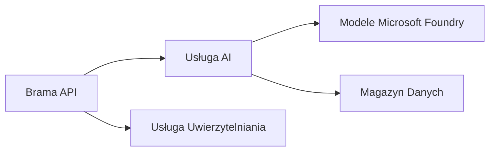
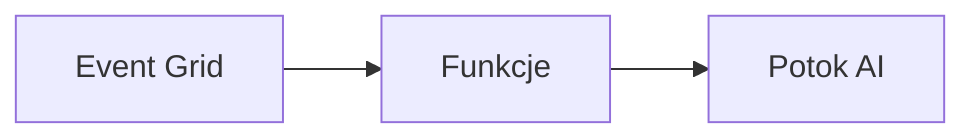

# Rozdział 8: Wzorce produkcyjne i korporacyjne

**📚 Kurs**: [AZD dla początkujących](../../README.md) | **⏱️ Czas trwania**: 2-3 godziny | **⭐ Poziom trudności**: Zaawansowany

---

## Przegląd

Ten rozdział omawia wzorce wdrożeń gotowych do zastosowań korporacyjnych, zabezpieczanie, monitorowanie oraz optymalizację kosztów dla produkcyjnych obciążeń AI.

> Zweryfikowano za pomocą `azd 1.23.12` w marcu 2026.

## Cele nauki

Po ukończeniu tego rozdziału będziesz potrafił:
- Wdrażać odporne aplikacje wieloregionowe
- Implementować wzorce zabezpieczeń korporacyjnych
- Konfigurować wszechstronne monitorowanie
- Optymalizować koszty na dużą skalę
- Ustawiać potoki CI/CD za pomocą AZD

---

## 📚 Lekcje

| # | Lekcja | Opis | Czas |
|---|--------|-------------|------|
| 1 | [Praktyki produkcyjne AI](production-ai-practices.md) | Wzorce wdrożeń korporacyjnych | 90 min |

---

## 🚀 Lista kontrolna produkcji

- [ ] Wdrożenie wieloregionowe dla odporności
- [ ] Zarządzana tożsamość do uwierzytelniania (bez kluczy)
- [ ] Application Insights do monitorowania
- [ ] Skonfigurowane budżety i alerty kosztów
- [ ] Włączone skanowanie bezpieczeństwa
- [ ] Integracja potoku CI/CD
- [ ] Plan odzyskiwania po awarii

---

## 🏗️ Wzorce architektoniczne

### Wzorzec 1: Microservices AI


### Wzorzec 2: AI zdarzeniowy


---

## 🔐 Najlepsze praktyki bezpieczeństwa

```bicep
// Use managed identity
identity: {
  type: 'SystemAssigned'
}

// Private endpoints for AI services
properties: {
  publicNetworkAccess: 'Disabled'
  networkAcls: {
    defaultAction: 'Deny'
  }
}
```

---

## 💰 Optymalizacja kosztów

| Strategia | Oszczędności |
|----------|--------------|
| Skalowanie do zera (Container Apps) | 60-80% |
| Użycie warstw konsumpcyjnych w dev | 50-70% |
| Skalowanie zaplanowane | 30-50% |
| Zarezerwowana pojemność | 20-40% |

```bash
# Ustaw alerty budżetowe
az consumption budget create \
  --budget-name "AI-Budget" \
  --amount 500 \
  --category Cost \
  --time-grain Monthly
```

---

## 📊 Konfiguracja monitorowania

```bash
# Strumieniuj logi
azd monitor --logs

# Sprawdź Application Insights
azd monitor --overview

# Zobacz metryki
az monitor metrics list --resource <resource-id>
```

---

## 🔗 Nawigacja

| Kierunek | Rozdział |
|-----------|---------|
| **Poprzedni** | [Rozdział 7: Rozwiązywanie problemów](../chapter-07-troubleshooting/README.md) |
| **Koniec kursu** | [Strona główna kursu](../../README.md) |

---

## 📖 Powiązane zasoby

- [Przewodnik agentów AI](../chapter-02-ai-development/agents.md)
- [Application Insights](../chapter-06-pre-deployment/application-insights.md)
- [Rozwiązania wieloagentowe](../chapter-05-multi-agent/README.md)
- [Przykład mikroserwisów](../../examples/microservices/README.md)

---

<!-- CO-OP TRANSLATOR DISCLAIMER START -->
**Zastrzeżenie**:  
Dokument ten został przetłumaczony przy użyciu usługi tłumaczenia AI [Co-op Translator](https://github.com/Azure/co-op-translator). Chociaż dążymy do jak największej dokładności, prosimy mieć na uwadze, że automatyczne tłumaczenia mogą zawierać błędy lub nieścisłości. Oryginalny dokument w języku źródłowym powinien być uważany za źródło autorytatywne. W przypadku informacji krytycznych zalecane jest skorzystanie z profesjonalnego tłumaczenia wykonane przez człowieka. Nie ponosimy odpowiedzialności za jakiekolwiek nieporozumienia lub błędne interpretacje wynikające z korzystania z tego tłumaczenia.
<!-- CO-OP TRANSLATOR DISCLAIMER END -->