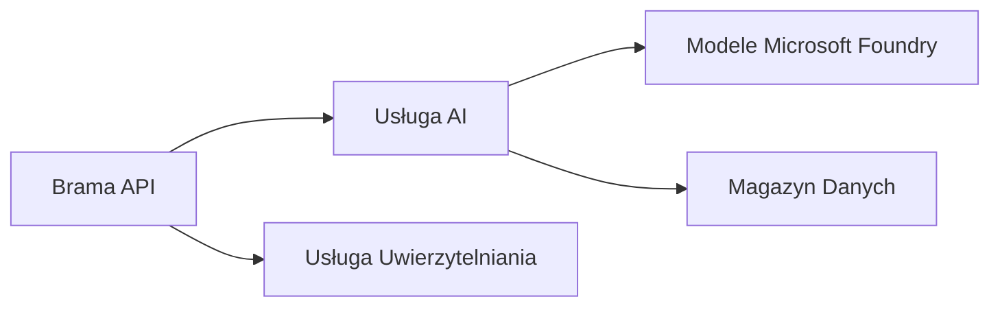
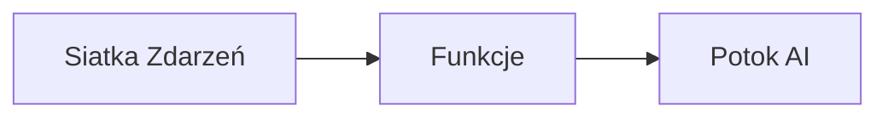

# Chapter 8: Production & Enterprise Patterns

**📚 Course**: [AZD For Beginners](../../README.md) | **⏱️ Duration**: 2-3 godziny | **⭐ Complexity**: Zaawansowany

---

## Overview

Ten rozdział obejmuje wzorce wdrożeń gotowych do zastosowań korporacyjnych, zabezpieczenia, monitorowanie oraz optymalizację kosztów dla produkcyjnych obciążeń AI.

> Zatwierdzono dla `azd 1.25.6` w czerwcu 2026.

## Learning Objectives

Po ukończeniu tego rozdziału będziesz potrafić:
- Wdrażać aplikacje odporne na awarie w wielu regionach
- Wdrażać wzorce bezpieczeństwa korporacyjnego
- Konfigurować kompleksowe monitorowanie
- Optymalizować koszty na dużą skalę
- Konfigurować pipeline’y CI/CD z AZD

---

## 📚 Lessons

| # | Lekcja | Opis | Czas |
|---|--------|-------------|------|
| 1 | [Production AI Practices](production-ai-practices.md) | Wzorce wdrożeń korporacyjnych | 90 min |

---

## 🚀 Production Checklist

- [ ] Wdrażanie wieloregionalne dla odporności
- [ ] Managed identity do uwierzytelniania (bez kluczy)
- [ ] Application Insights do monitorowania
- [ ] Budżety kosztów i alerty skonfigurowane
- [ ] Włączone skanowanie bezpieczeństwa
- [ ] Integracja pipeline’u CI/CD
- [ ] Plan odzyskiwania po awarii

---

## 🏗️ Architecture Patterns

### Wzorzec 1: Mikroserwisy AI



### Wzorzec 2: AI sterowane zdarzeniami



---

## 🔐 Security Best Practices

```bicep
// Use managed identity
identity: {
  type: 'SystemAssigned'
}

// Private endpoints for AI services
properties: {
  publicNetworkAccess: 'Disabled'
  networkAcls: {
    defaultAction: 'Deny'
  }
}
```

---

## 💰 Cost Optimization

| Strategia | Oszczędności |
|----------|--------------|
| Skalowanie do zera (Container Apps) | 60-80% |
| Użycie poziomów konsumpcyjnych dla środowisk deweloperskich | 50-70% |
| Skalowanie według harmonogramu | 30-50% |
| Zarezerwowana pojemność | 20-40% |

```bash
# Ustaw alerty budżetowe
az consumption budget create \
  --budget-name "AI-Budget" \
  --amount 500 \
  --category Cost \
  --time-grain Monthly
```

---

## 📊 Monitoring Setup

```bash
# Transmituj logi
azd monitor --logs

# Sprawdź Application Insights
azd monitor --overview

# Zobacz metryki
az monitor metrics list --resource <resource-id>
```

---

## 🔗 Navigation

| Kierunek | Rozdział |
|-----------|---------|
| **Poprzedni** | [Chapter 7: Troubleshooting](../chapter-07-troubleshooting/README.md) |
| **Koniec kursu** | [Course Home](../../README.md) |

---

## 📖 Related Resources

- [AI Agents Guide](../chapter-02-ai-development/agents.md)
- [Application Insights](../chapter-06-pre-deployment/application-insights.md)
- [Multi-Agent Solutions](../chapter-05-multi-agent/README.md)
- [Microservices Example](../../examples/microservices/README.md)

---

<!-- CO-OP TRANSLATOR DISCLAIMER START -->
**Zastrzeżenie**:
Niniejszy dokument został przetłumaczony za pomocą usługi tłumaczenia AI [Co-op Translator](https://github.com/Azure/co-op-translator). Choć dążymy do dokładności, prosimy pamiętać, że automatyczne tłumaczenia mogą zawierać błędy lub niedokładności. Oryginalny dokument w jego języku źródłowym należy uznawać za autorytatywne źródło. W przypadku informacji krytycznych zalecane jest skorzystanie z profesjonalnego tłumaczenia wykonanego przez człowieka. Nie ponosimy odpowiedzialności za jakiekolwiek nieporozumienia lub błędne interpretacje wynikające z użycia tego tłumaczenia.
<!-- CO-OP TRANSLATOR DISCLAIMER END -->