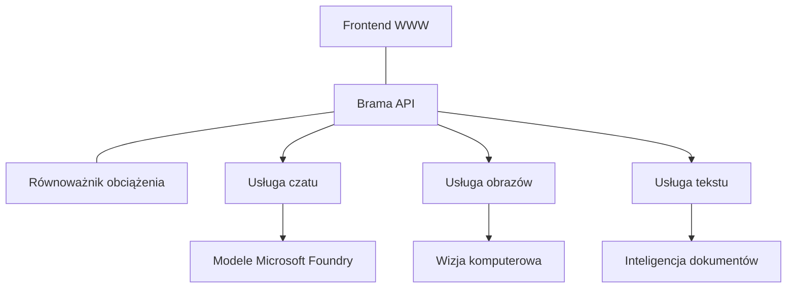

# Najlepsze praktyki dla produkcyjnych obciążeń AI z AZD

**Nawigacja po rozdziale:**
- **📚 Strona główna kursu**: [AZD For Beginners](../../README.md)
- **📖 Bieżący rozdział**: Rozdział 8 - Wzorce produkcyjne i korporacyjne
- **⬅️ Poprzedni rozdział**: [Rozdział 7: Rozwiązywanie problemów](../chapter-07-troubleshooting/debugging.md)
- **⬅️ Również powiązane**: [AI Workshop Lab](ai-workshop-lab.md)
- **🎯 Kurs zakończony**: [AZD For Beginners](../../README.md)

## Przegląd

Ten przewodnik zawiera kompleksowe najlepsze praktyki dotyczące wdrażania produkcyjnych obciążeń AI przy użyciu Azure Developer CLI (AZD). Oparte na opiniach społeczności Microsoft Foundry Discord i rzeczywistych wdrożeniach klientów, praktyki te adresują najczęstsze wyzwania w produkcyjnych systemach AI.

## Kluczowe wyzwania, które rozwiązujemy

Na podstawie wyników ankiety w naszej społeczności, oto najważniejsze wyzwania, z którymi mierzą się deweloperzy:

- **45%** ma trudności z wdrożeniami AI z wieloma usługami
- **38%** zmaga się z zarządzaniem poświadczeniami i sekretami  
- **35%** uważa, że gotowość produkcyjna i skalowanie są trudne
- **32%** potrzebuje lepszych strategii optymalizacji kosztów
- **29%** wymaga usprawnionego monitoringu i rozwiązywania problemów

## Wzorce architektury dla produkcyjnego AI

### Wzorzec 1: Architektura AI oparta na mikrousługach

**Kiedy stosować**: Złożone aplikacje AI z wieloma funkcjonalnościami



**Implementacja AZD**:

```yaml
# azure.yaml
name: enterprise-ai-platform
services:
  web:
    project: ./web
    host: staticwebapp
  api-gateway:
    project: ./api-gateway
    host: containerapp
  chat-service:
    project: ./services/chat
    host: containerapp
  vision-service:
    project: ./services/vision
    host: containerapp
  text-service:
    project: ./services/text
    host: containerapp
```

### Wzorzec 2: Przetwarzanie AI zdarzeniowe

**Kiedy stosować**: Przetwarzanie wsadowe, analiza dokumentów, asynchroniczne workflowy

```bicep
// Event Hub for AI processing pipeline
resource eventHub 'Microsoft.EventHub/namespaces@2023-01-01-preview' = {
  name: eventHubNamespaceName
  location: location
  sku: {
    name: 'Standard'
    tier: 'Standard'
    capacity: 1
  }
}

// Service Bus for reliable message processing
resource serviceBus 'Microsoft.ServiceBus/namespaces@2022-10-01-preview' = {
  name: serviceBusNamespaceName
  location: location
  sku: {
    name: 'Premium'
    tier: 'Premium'
    capacity: 1
  }
}

// Function App for processing
resource functionApp 'Microsoft.Web/sites@2023-01-01' = {
  name: functionAppName
  location: location
  kind: 'functionapp,linux'
  properties: {
    siteConfig: {
      appSettings: [
        {
          name: 'FUNCTIONS_EXTENSION_VERSION'
          value: '~4'
        }
        {
          name: 'AZURE_OPENAI_ENDPOINT'
          value: '@Microsoft.KeyVault(VaultName=${keyVault.name};SecretName=openai-endpoint)'
        }
      ]
    }
  }
}
```

## Myślenie o zdrowiu agenta AI

Gdy tradycyjna aplikacja webowa przestaje działać, objawy są znane: strona się nie ładuje, API zwraca błąd lub wdrożenie się nie powiodło. Aplikacje oparte na AI mogą się psuć w tych samych sposób — ale też mogą działać nieprawidłowo w subtelny sposób, który nie generuje oczywistych komunikatów o błędach.

Ta sekcja pomaga zbudować mentalny model monitoringu obciążeń AI, dzięki czemu wiesz, gdzie szukać problemów, gdy coś wydaje się nie tak.

### Jak zdrowie agenta różni się od tradycyjnego zdrowia aplikacji

Tradycyjna aplikacja albo działa, albo nie. Agent AI może wyglądać na działającego, ale generować słabe wyniki. Myśl o zdrowiu agenta w dwóch warstwach:

| Warstwa | Na co zwracać uwagę | Gdzie patrzeć |
|---------|---------------------|---------------|
| **Zdrowie infrastruktury** | Czy usługa działa? Czy zasoby są dostępne? Czy punkty końcowe są osiągalne? | `azd monitor`, zdrowie zasobów w Azure Portal, logi kontenera/aplikacji |
| **Zdrowie zachowania** | Czy agent odpowiada poprawnie? Czy odpowiedzi są na czas? Czy model jest wywoływany prawidłowo? | Ślady Application Insights, metryki opóźnienia wywołań modelu, logi jakości odpowiedzi |

Zdrowie infrastruktury jest znane — to to samo w każdej aplikacji azd. Zdrowie zachowania to nowa warstwa wnoszona przez obciążenia AI.

### Gdzie patrzeć, gdy aplikacje AI zachowują się nieoczekiwanie

Jeśli Twoja aplikacja AI nie generuje oczekiwanych wyników, oto koncepcyjna lista kontrolna:

1. **Zacznij od podstaw.** Czy aplikacja działa? Czy może osiągnąć swoje zależności? Sprawdź `azd monitor` i zdrowie zasobów tak samo jak w przypadku każdej aplikacji.
2. **Sprawdź połączenie z modelem.** Czy aplikacja poprawnie wywołuje model AI? Nieudane lub przeterminowane wywołania modelu są najczęstszą przyczyną problemów z aplikacjami AI i pojawią się w logach aplikacji.
3. **Przyjrzyj się, co dostał model.** Odpowiedzi AI zależą od danych wejściowych (promptu i ewentualnego kontekstu). Jeśli wynik jest błędny, wejście zwykle też jest błędne. Sprawdź, czy aplikacja wysyła poprawne dane do modelu.
4. **Przeanalizuj opóźnienia odpowiedzi.** Wywołania modeli AI są wolniejsze niż typowe wywołania API. Jeśli aplikacja działa opornie, sprawdź, czy czas odpowiedzi modelu wzrósł — może to wskazywać na ograniczenia, limity mocy lub zatory regionalne.
5. **Obserwuj sygnały kosztowe.** Niespodziewane skoki w zużyciu tokenów lub wywołaniach API mogą oznaczać pętlę, błędnie skonfigurowany prompt lub nadmierne ponawianie prób.

Nie musisz od razu opanować narzędzi obserwowalności. Kluczowym wnioskiem jest to, że aplikacje AI mają dodatkową warstwę zachowania do monitorowania, a wbudowany monitoring azd (`azd monitor`) daje punkt wyjścia do badania obu warstw.

---

## Najlepsze praktyki bezpieczeństwa

### 1. Model bezpieczeństwa zero-trust

**Strategia wdrożenia**:
- Brak komunikacji między usługami bez uwierzytelnienia
- Wszystkie wywołania API korzystają z zarządzanych tożsamości
- Izolacja sieci z prywatnymi punktami końcowymi
- Kontrola dostępu z zasadą najmniejszych uprawnień

```bicep
// Managed Identity for each service
resource chatServiceIdentity 'Microsoft.ManagedIdentity/userAssignedIdentities@2023-01-31' = {
  name: 'chat-service-identity'
  location: location
}

// Role assignments with minimal permissions
resource openAIUserRole 'Microsoft.Authorization/roleAssignments@2022-04-01' = {
  scope: openAIAccount
  name: guid(openAIAccount.id, chatServiceIdentity.id, openAIUserRoleDefinitionId)
  properties: {
    roleDefinitionId: subscriptionResourceId('Microsoft.Authorization/roleDefinitions', '5e0bd9bd-7b93-4f28-af87-19fc36ad61bd')
    principalId: chatServiceIdentity.properties.principalId
    principalType: 'ServicePrincipal'
  }
}
```

### 2. Bezpieczne zarządzanie sekretami

**Wzorzec integracji z Key Vault**:

```bicep
// Key Vault with proper access policies
resource keyVault 'Microsoft.KeyVault/vaults@2023-02-01' = {
  name: keyVaultName
  location: location
  properties: {
    tenantId: tenant().tenantId
    sku: {
      family: 'A'
      name: 'premium'  // Use premium for production
    }
    enableRbacAuthorization: true  // Use RBAC instead of access policies
    enablePurgeProtection: true    // Prevent accidental deletion
    enableSoftDelete: true
    softDeleteRetentionInDays: 90
  }
}

// Store all AI service credentials
resource openAIKeySecret 'Microsoft.KeyVault/vaults/secrets@2023-02-01' = {
  parent: keyVault
  name: 'openai-api-key'
  properties: {
    value: openAIAccount.listKeys().key1
    attributes: {
      enabled: true
    }
  }
}
```

### 3. Bezpieczeństwo sieci

**Konfiguracja prywatnego punktu końcowego**:

```bicep
// Virtual Network for AI services
resource virtualNetwork 'Microsoft.Network/virtualNetworks@2023-04-01' = {
  name: vnetName
  location: location
  properties: {
    addressSpace: {
      addressPrefixes: ['10.0.0.0/16']
    }
    subnets: [
      {
        name: 'ai-services-subnet'
        properties: {
          addressPrefix: '10.0.1.0/24'
          privateEndpointNetworkPolicies: 'Disabled'
        }
      }
      {
        name: 'app-services-subnet'
        properties: {
          addressPrefix: '10.0.2.0/24'
          delegations: [
            {
              name: 'Microsoft.Web/serverFarms'
              properties: {
                serviceName: 'Microsoft.Web/serverFarms'
              }
            }
          ]
        }
      }
    ]
  }
}

// Private endpoints for all AI services
resource openAIPrivateEndpoint 'Microsoft.Network/privateEndpoints@2023-04-01' = {
  name: '${openAIAccountName}-pe'
  location: location
  properties: {
    subnet: {
      id: virtualNetwork.properties.subnets[0].id
    }
    privateLinkServiceConnections: [
      {
        name: 'openai-connection'
        properties: {
          privateLinkServiceId: openAIAccount.id
          groupIds: ['account']
        }
      }
    ]
  }
}
```

## Wydajność i skalowanie

### 1. Strategie autoskalowania

**Autoskalowanie kontenerów**:

```bicep
resource containerApp 'Microsoft.App/containerApps@2023-05-01' = {
  name: containerAppName
  location: location
  properties: {
    configuration: {
      ingress: {
        external: true
        targetPort: 8000
        transport: 'http'
      }
    }
    template: {
      scale: {
        minReplicas: 2  // Always have 2 instances minimum
        maxReplicas: 50 // Scale up to 50 for high load
        rules: [
          {
            name: 'http-scaling'
            http: {
              metadata: {
                concurrentRequests: '20'  // Scale when >20 concurrent requests
              }
            }
          }
          {
            name: 'cpu-scaling'
            custom: {
              type: 'cpu'
              metadata: {
                type: 'Utilization'
                value: '70'  // Scale when CPU >70%
              }
            }
          }
        ]
      }
    }
  }
}
```

### 2. Strategie buforowania

**Redis Cache dla odpowiedzi AI**:

```bicep
// Redis Premium for production workloads
resource redisCache 'Microsoft.Cache/redis@2023-04-01' = {
  name: redisCacheName
  location: location
  properties: {
    sku: {
      name: 'Premium'
      family: 'P'
      capacity: 1
    }
    enableNonSslPort: false
    minimumTlsVersion: '1.2'
    redisConfiguration: {
      'maxmemory-policy': 'allkeys-lru'
    }
    // Enable clustering for high availability
    redisVersion: '6.0'
    shardCount: 2
  }
}

// Cache configuration in application
var cacheConnectionString = '${redisCache.properties.hostName}:6380,password=${redisCache.listKeys().primaryKey},ssl=True,abortConnect=False'
```

### 3. Równoważenie obciążenia i zarządzanie ruchem

**Application Gateway z WAF**:

```bicep
// Application Gateway with Web Application Firewall
resource applicationGateway 'Microsoft.Network/applicationGateways@2023-04-01' = {
  name: appGatewayName
  location: location
  properties: {
    sku: {
      name: 'WAF_v2'
      tier: 'WAF_v2'
      capacity: 2
    }
    webApplicationFirewallConfiguration: {
      enabled: true
      firewallMode: 'Prevention'
      ruleSetType: 'OWASP'
      ruleSetVersion: '3.2'
    }
    // Backend pools for AI services
    backendAddressPools: [
      {
        name: 'ai-services-pool'
        properties: {
          backendAddresses: [
            {
              fqdn: '${containerApp.properties.configuration.ingress.fqdn}'
            }
          ]
        }
      }
    ]
  }
}
```

## 💰 Optymalizacja kosztów

### 1. Właściwe dopasowanie zasobów

**Konfiguracje specyficzne dla środowiska**:

```bash
# Środowisko programistyczne
azd env new development
azd env set AZURE_OPENAI_SKU "S0"
azd env set AZURE_OPENAI_CAPACITY 10
azd env set AZURE_SEARCH_SKU "basic"
azd env set CONTAINER_CPU 0.5
azd env set CONTAINER_MEMORY 1.0

# Środowisko produkcyjne
azd env new production
azd env set AZURE_OPENAI_SKU "S0"
azd env set AZURE_OPENAI_CAPACITY 100
azd env set AZURE_SEARCH_SKU "standard"
azd env set CONTAINER_CPU 2.0
azd env set CONTAINER_MEMORY 4.0
```

### 2. Monitorowanie kosztów i budżety

```bicep
// Cost management and budgets
resource budget 'Microsoft.Consumption/budgets@2023-05-01' = {
  name: 'ai-workload-budget'
  properties: {
    timePeriod: {
      startDate: '2024-01-01'
      endDate: '2024-12-31'
    }
    timeGrain: 'Monthly'
    amount: 2000  // $2000 monthly budget
    category: 'Cost'
    notifications: {
      warning: {
        enabled: true
        operator: 'GreaterThan'
        threshold: 80
        contactEmails: [
          'finance@company.com'
          'engineering@company.com'
        ]
        contactRoles: [
          'Owner'
          'Contributor'
        ]
      }
      critical: {
        enabled: true
        operator: 'GreaterThan'
        threshold: 95
        contactEmails: [
          'cto@company.com'
        ]
      }
    }
  }
}
```

### 3. Optymalizacja zużycia tokenów

**Zarządzanie kosztami OpenAI**:

```typescript
// Optymalizacja tokenów na poziomie aplikacji
class TokenOptimizer {
  private readonly maxTokens = 4000;
  private readonly reserveTokens = 500;
  
  optimizePrompt(userInput: string, context: string): string {
    const availableTokens = this.maxTokens - this.reserveTokens;
    const estimatedTokens = this.estimateTokens(userInput + context);
    
    if (estimatedTokens > availableTokens) {
      // Skróć kontekst, nie dane wejściowe użytkownika
      context = this.truncateContext(context, availableTokens - this.estimateTokens(userInput));
    }
    
    return `${context}\n\nUser: ${userInput}`;
  }
  
  private estimateTokens(text: string): number {
    // Wstępne oszacowanie: 1 token ≈ 4 znaki
    return Math.ceil(text.length / 4);
  }
}
```

## Monitoring i obserwowalność

### 1. Kompleksowe Application Insights

```bicep
// Application Insights with advanced features
resource applicationInsights 'Microsoft.Insights/components@2020-02-02' = {
  name: applicationInsightsName
  location: location
  kind: 'web'
  properties: {
    Application_Type: 'web'
    WorkspaceResourceId: logAnalyticsWorkspace.id
    SamplingPercentage: 100  // Full sampling for AI apps
    DisableIpMasking: false  // Enable for security
  }
}

// Custom metrics for AI operations
resource aiMetricAlerts 'Microsoft.Insights/metricAlerts@2018-03-01' = {
  name: 'ai-high-error-rate'
  location: 'global'
  properties: {
    description: 'Alert when AI service error rate is high'
    severity: 2
    enabled: true
    scopes: [
      applicationInsights.id
    ]
    evaluationFrequency: 'PT1M'
    windowSize: 'PT5M'
    criteria: {
      'odata.type': 'Microsoft.Azure.Monitor.SingleResourceMultipleMetricCriteria'
      allOf: [
        {
          name: 'high-error-rate'
          metricName: 'requests/failed'
          operator: 'GreaterThan'
          threshold: 10
          timeAggregation: 'Count'
        }
      ]
    }
  }
}
```

### 2. Monitorowanie specyficzne dla AI

**Niestandardowe pulpity nawigacyjne dla metryk AI**:

```json
// Dashboard configuration for AI workloads
{
  "dashboard": {
    "name": "AI Application Monitoring",
    "tiles": [
      {
        "name": "OpenAI Request Volume",
        "query": "requests | where name contains 'openai' | summarize count() by bin(timestamp, 5m)"
      },
      {
        "name": "AI Response Latency",
        "query": "requests | where name contains 'openai' | summarize avg(duration) by bin(timestamp, 5m)"
      },
      {
        "name": "Token Usage",
        "query": "customMetrics | where name == 'openai_tokens_used' | summarize sum(value) by bin(timestamp, 1h)"
      },
      {
        "name": "Cost per Hour",
        "query": "customMetrics | where name == 'openai_cost' | summarize sum(value) by bin(timestamp, 1h)"
      }
    ]
  }
}
```

### 3. Kontrole stanu i monitorowanie dostępności

```bicep
// Application Insights availability tests
resource availabilityTest 'Microsoft.Insights/webtests@2022-06-15' = {
  name: 'ai-app-availability-test'
  location: location
  tags: {
    'hidden-link:${applicationInsights.id}': 'Resource'
  }
  properties: {
    SyntheticMonitorId: 'ai-app-availability-test'
    Name: 'AI Application Availability Test'
    Description: 'Tests AI application endpoints'
    Enabled: true
    Frequency: 300  // 5 minutes
    Timeout: 120    // 2 minutes
    Kind: 'ping'
    Locations: [
      {
        Id: 'us-east-2-azr'
      }
      {
        Id: 'us-west-2-azr'
      }
    ]
    Configuration: {
      WebTest: '''
        <WebTest Name="AI Health Check" 
                 Id="8d2de8d2-a2b0-4c2e-9a0d-8f9c9a0b8c8d" 
                 Enabled="True" 
                 CssProjectStructure="" 
                 CssIteration="" 
                 Timeout="120" 
                 WorkItemIds="" 
                 xmlns="http://microsoft.com/schemas/VisualStudio/TeamTest/2010" 
                 Description="" 
                 CredentialUserName="" 
                 CredentialPassword="" 
                 PreAuthenticate="True" 
                 Proxy="default" 
                 StopOnError="False" 
                 RecordedResultFile="" 
                 ResultsLocale="">
          <Items>
            <Request Method="GET" 
                     Guid="a5f10126-e4cd-570d-961c-cea43999a200" 
                     Version="1.1" 
                     Url="${webApp.properties.defaultHostName}/health" 
                     ThinkTime="0" 
                     Timeout="120" 
                     ParseDependentRequests="True" 
                     FollowRedirects="True" 
                     RecordResult="True" 
                     Cache="False" 
                     ResponseTimeGoal="0" 
                     Encoding="utf-8" 
                     ExpectedHttpStatusCode="200" 
                     ExpectedResponseUrl="" 
                     ReportingName="" 
                     IgnoreHttpStatusCode="False" />
          </Items>
        </WebTest>
      '''
    }
  }
}
```

## Odzyskiwanie po awarii i wysoka dostępność

### 1. Wdrożenie wieloregionalne

```yaml
# azure.yaml - Multi-region configuration
name: ai-app-multiregion
services:
  api-primary:
    project: ./api
    host: containerapp
    env:
      - AZURE_REGION=eastus
  api-secondary:
    project: ./api
    host: containerapp
    env:
      - AZURE_REGION=westus2
```

```bicep
// Traffic Manager for global load balancing
resource trafficManager 'Microsoft.Network/trafficManagerProfiles@2022-04-01' = {
  name: trafficManagerProfileName
  location: 'global'
  properties: {
    profileStatus: 'Enabled'
    trafficRoutingMethod: 'Priority'
    dnsConfig: {
      relativeName: trafficManagerProfileName
      ttl: 30
    }
    monitorConfig: {
      protocol: 'HTTPS'
      port: 443
      path: '/health'
      intervalInSeconds: 30
      toleratedNumberOfFailures: 3
      timeoutInSeconds: 10
    }
    endpoints: [
      {
        name: 'primary-endpoint'
        type: 'Microsoft.Network/trafficManagerProfiles/azureEndpoints'
        properties: {
          targetResourceId: primaryAppService.id
          endpointStatus: 'Enabled'
          priority: 1
        }
      }
      {
        name: 'secondary-endpoint'
        type: 'Microsoft.Network/trafficManagerProfiles/azureEndpoints'
        properties: {
          targetResourceId: secondaryAppService.id
          endpointStatus: 'Enabled'
          priority: 2
        }
      }
    ]
  }
}
```

### 2. Backup danych i odzyskiwanie

```bicep
// Backup configuration for critical data
resource backupVault 'Microsoft.DataProtection/backupVaults@2023-05-01' = {
  name: backupVaultName
  location: location
  identity: {
    type: 'SystemAssigned'
  }
  properties: {
    storageSettings: [
      {
        datastoreType: 'VaultStore'
        type: 'LocallyRedundant'
      }
    ]
  }
}

// Backup policy for AI models and data
resource backupPolicy 'Microsoft.DataProtection/backupVaults/backupPolicies@2023-05-01' = {
  parent: backupVault
  name: 'ai-data-backup-policy'
  properties: {
    policyRules: [
      {
        backupParameters: {
          backupType: 'Full'
          objectType: 'AzureBackupParams'
        }
        trigger: {
          schedule: {
            repeatingTimeIntervals: [
              'R/2024-01-01T02:00:00+00:00/P1D'  // Daily at 2 AM
            ]
          }
          objectType: 'ScheduleBasedTriggerContext'
        }
        dataStore: {
          datastoreType: 'VaultStore'
          objectType: 'DataStoreInfoBase'
        }
        name: 'BackupDaily'
        objectType: 'AzureBackupRule'
      }
    ]
  }
}
```

## Integracja DevOps i CI/CD

### 1. Workflow GitHub Actions

```yaml
# .github/workflows/deploy-ai-app.yml
name: Deploy AI Application

on:
  push:
    branches: [main]
  pull_request:
    branches: [main]

jobs:
  test:
    runs-on: ubuntu-latest
    steps:
      - uses: actions/checkout@v4
      
      - name: Setup Python
        uses: actions/setup-python@v4
        with:
          python-version: '3.11'
          
      - name: Install dependencies
        run: |
          pip install -r requirements.txt
          pip install pytest
          
      - name: Run tests
        run: pytest tests/
        
      - name: AI Safety Tests
        run: |
          python scripts/test_ai_safety.py
          python scripts/validate_prompts.py

  deploy-staging:
    needs: test
    if: github.event_name == 'pull_request'
    runs-on: ubuntu-latest
    steps:
      - uses: actions/checkout@v4
      
      - name: Setup AZD
        uses: Azure/setup-azd@v2
        
      - name: Login to Azure
        uses: azure/login@v1
        with:
          creds: ${{ secrets.AZURE_CREDENTIALS }}
          
      - name: Deploy to Staging
        run: |
          azd env select staging
          azd deploy

  deploy-production:
    needs: test
    if: github.ref == 'refs/heads/main'
    runs-on: ubuntu-latest
    steps:
      - uses: actions/checkout@v4
      
      - name: Setup AZD
        uses: Azure/setup-azd@v2
        
      - name: Login to Azure
        uses: azure/login@v1
        with:
          creds: ${{ secrets.AZURE_CREDENTIALS }}
          
      - name: Deploy to Production
        run: |
          azd env select production
          azd deploy
          
      - name: Run Production Health Checks
        run: |
          python scripts/health_check.py --env production
```

### 2. Walidacja infrastruktury

```bash
# scripts/validate_infrastructure.sh
#!/bin/bash

echo "Validating AI infrastructure deployment..."

# Sprawdź, czy wszystkie wymagane usługi działają
services=("openai" "search" "storage" "keyvault")
for service in "${services[@]}"; do
    echo "Checking $service..."
    if ! az resource list --resource-type "Microsoft.CognitiveServices/accounts" --query "[?contains(name, '$service')]" -o tsv; then
        echo "ERROR: $service not found"
        exit 1
    fi
done

# Waliduj wdrożenia modelu OpenAI
echo "Validating OpenAI model deployments..."
models=$(az cognitiveservices account deployment list --name $AZURE_OPENAI_NAME --resource-group $AZURE_RESOURCE_GROUP --query "[].name" -o tsv)
if [[ ! $models == *"gpt-4.1-mini"* ]]; then
  echo "ERROR: Required model gpt-4.1-mini not deployed"
    exit 1
fi

# Przetestuj łączność usługi AI
echo "Testing AI service connectivity..."
python scripts/test_connectivity.py

echo "Infrastructure validation completed successfully!"
```

## Lista kontrolna gotowości produkcyjnej

### Bezpieczeństwo ✅
- [ ] Wszystkie usługi korzystają z zarządzanych tożsamości
- [ ] Sekrety przechowywane w Key Vault
- [ ] Skonfigurowane prywatne punkty końcowe
- [ ] Wdrożone grupy bezpieczeństwa sieci
- [ ] RBAC zgodnie z zasadą najmniejszych uprawnień
- [ ] Włączony WAF na publicznych punktach końcowych

### Wydajność ✅
- [ ] Skonfigurowane autoskalowanie
- [ ] Wdrożone buforowanie
- [ ] Ustawione równoważenie obciążenia
- [ ] CDN dla statycznych zasobów
- [ ] Puli połączeń do bazy danych
- [ ] Optymalizacja użycia tokenów

### Monitoring ✅
- [ ] Skonfigurowane Application Insights
- [ ] Zdefiniowane niestandardowe metryki
- [ ] Ustawione reguły alertów
- [ ] Stworzony pulpit nawigacyjny
- [ ] Wdrożone kontrole zdrowia
- [ ] Polityki retencji logów

### Niezawodność ✅
- [ ] Wdrożenie wieloregionalne
- [ ] Plan backupu i odzyskiwania
- [ ] Wdrożone bezpieczniki (circuit breakers)
- [ ] Skonfigurowane polityki ponownych prób
- [ ] Łagodne degradacje
- [ ] Punkty końcowe kontroli zdrowia

### Zarządzanie kosztami ✅
- [ ] Ustawione alerty budżetowe
- [ ] Dopasowanie zasobów do potrzeb
- [ ] Rabaty dla środowisk deweloperskich/testowych
- [ ] Zakupione zarezerwowane instancje
- [ ] Pulpit monitoringu kosztów
- [ ] Regularne przeglądy kosztów

### Zgodność ✅
- [ ] Spełnienie wymogów lokalizacji danych
- [ ] Włączone logowanie audytu
- [ ] Zastosowane polityki zgodności
- [ ] Wdrożone podstawy bezpieczeństwa
- [ ] Regularne oceny bezpieczeństwa
- [ ] Plan reagowania na incydenty

## Benchmarki wydajności

### Typowe metryki produkcyjne

| Metryka | Cel | Monitoring |
|---------|-----|------------|
| **Czas odpowiedzi** | < 2 sekundy | Application Insights |
| **Dostępność** | 99,9% | Monitorowanie dostępności |
| **Wskaźnik błędów** | < 0,1% | Logi aplikacji |
| **Zużycie tokenów** | < 500 USD/miesiąc | Zarządzanie kosztami |
| **Równoczesni użytkownicy** | 1000+ | Testy obciążeniowe |
| **Czas odzyskiwania** | < 1 godzina | Testy odzyskiwania po awarii |

### Testy obciążeniowe

```bash
# Skrypt do testowania obciążenia dla aplikacji AI
python scripts/load_test.py \
  --endpoint https://your-ai-app.azurewebsites.net \
  --concurrent-users 100 \
  --duration 300 \
  --ramp-up 60
```

## 🤝 Najlepsze praktyki społeczności

Na podstawie opinii społeczności Microsoft Foundry Discord:

### Najważniejsze rekomendacje społeczności:

1. **Zacznij od małego, skaluj stopniowo**: Zacznij od podstawowych SKU i skaluj w oparciu o rzeczywiste użycie
2. **Monitoruj wszystko**: Skonfiguruj kompleksowy monitoring od pierwszego dnia
3. **Automatyzuj bezpieczeństwo**: Używaj infrastruktury jako kodu dla spójnego bezpieczeństwa
4. **Testuj dokładnie**: Włącz testowanie specyficzne dla AI w swoim pipeline
5. **Planuj koszty**: Monitoruj zużycie tokenów i ustawiaj alerty budżetowe wcześnie

### Typowe pułapki do uniknięcia:

- ❌ Twarde kodowanie kluczy API w kodzie
- ❌ Brak poprawnego monitoringu
- ❌ Ignorowanie optymalizacji kosztów
- ❌ Brak testów scenariuszy awaryjnych
- ❌ Wdrażanie bez kontroli stanu

## Komendy i rozszerzenia AZD AI CLI

AZD zawiera rosnący zestaw komend i rozszerzeń specyficznych dla AI, które usprawniają produkcyjne workflowy AI. Narzędzia te łączą rozwój lokalny z produkcyjnym wdrożeniem obciążeń AI.

### Rozszerzenia AZD dla AI

AZD wykorzystuje system rozszerzeń do dodawania funkcji specyficznych dla AI. Instaluj i zarządzaj rozszerzeniami za pomocą:

```bash
# Wyświetl wszystkie dostępne rozszerzenia (w tym AI)
azd extension list

# Sprawdź szczegóły zainstalowanego rozszerzenia
azd extension show azure.ai.agents

# Zainstaluj rozszerzenie agentów Foundry
azd extension install azure.ai.agents

# Zainstaluj rozszerzenie do dostrajania
azd extension install azure.ai.finetune

# Zainstaluj rozszerzenie do modeli niestandardowych
azd extension install azure.ai.models

# Zaktualizuj wszystkie zainstalowane rozszerzenia
azd extension upgrade --all
```

**Dostępne rozszerzenia AI:**

| Rozszerzenie | Cel | Status |
|--------------|-----|--------|
| `azure.ai.agents` | Zarządzanie usługą Foundry Agent | Preview |
| `azure.ai.skills` | Wielokrotne umiejętności agenta | Preview |
| `azure.ai.connections` | Połączenia Foundry (źródła danych, narzędzia) | Preview |
| `azure.ai.finetune` | Fine-tuning modeli Foundry | Preview |
| `azure.ai.models` | Własne modele Foundry | Preview |
| `azure.coding-agent` | Konfiguracja agenta kodującego | Dostępne |

> Rozszerzenie `azure.ai.agents` szybko ewoluuje. Ten kurs zweryfikowano pod kątem wersji `0.1.40-preview`. Uruchom `azd extension upgrade --all`, aby pobrać najnowszy zestaw komend, oraz `azd extension show azure.ai.agents`, aby potwierdzić zainstalowaną wersję.

**Czym są nowsze rozszerzenia `skills` i `connections`?**

Dwa rozszerzenia preview pojawiły się równolegle z narzędziami agenta i warto je znać już na początku:

- **`azure.ai.skills`** — **umiejętność** to wielokrotna zdolność (spakowane narzędzie lub zachowanie), które możesz dołączyć do jednego lub więcej agentów zamiast implementować od nowa za każdym razem. Pomyśl o tym jako o wspólnym elemencie budującym: zdefiniuj raz umiejętność „przeszukuj dokumentację” lub „sprawdzaj zamówienie”, a potem używaj jej w wielu agentach. To zapewnia spójność systemom wieloagentowym (rozdział 5) i eliminuje kopiuj-wklej.
- **`azure.ai.connections`** — **połączenie** to zarządzany link twojego projektu Foundry do zewnętrznego zasobu, którego agenci potrzebują — źródło danych (np. Azure AI Search), punkt końcowy narzędzia lub inna usługa. Połączenia centralizują *gdzie* i *jak* agenci mają dostęp do danych, więc poświadczenia i punkty końcowe są w jednym zarządzanym miejscu, a nie powycinane w kodzie.

Nie potrzebujesz ich do wdrożenia pierwszych agentów — pozostań przy `azure.ai.agents` podczas nauki. Sięgnij po `skills`, gdy zaczniesz powielać te same narzędzia w wielu agentach, a po `connections`, gdy kilku agentów dzieli to samo źródło danych.

### Inicjalizacja projektów agentów za pomocą `azd ai agent init`

Polecenie `azd ai agent init` tworzy szkielet produkcyjnego projektu agenta AI zintegrowanego z Microsoft Foundry Agent Service:

```bash
# Zainicjuj nowy projekt agenta na podstawie manifestu agenta
azd ai agent init -m <manifest-path-or-uri>

# Zainicjuj i skieruj na konkretny projekt Foundry
azd ai agent init -m agent-manifest.yaml --project-id <foundry-project-id>

# Zainicjuj z niestandardowym katalogiem źródłowym
azd ai agent init -m agent-manifest.yaml --src ./agents/my-agent

# Skieruj na Container Apps jako hosta
azd ai agent init -m agent-manifest.yaml --host containerapp
```

**Kluczowe flagi:**

| Flaga | Opis |
|-------|-------|
| `-m, --manifest` | Ścieżka lub URI do manifestu agenta, który dodasz do projektu |
| `-p, --project-id` | Istniejące ID projektu Microsoft Foundry dla środowiska azd |
| `-s, --src` | Katalog do pobrania definicji agenta (domyślnie `src/<agent-id>`) |
| `--host` | Nadpisanie domyślnego hosta (np. `containerapp`) |
| `-e, --environment` | Środowisko azd, którego używasz |

**Wskazówka produkcyjna**: Użyj `--project-id`, aby połączyć się bezpośrednio z istniejącym projektem Foundry, utrzymując kod agenta i zasoby chmurowe powiązane od początku.

### Zarządzanie cyklem życia agenta

Poza `init`, rozszerzenie `azure.ai.agents` udostępnia komendy do pełnego cyklu życia hostowanego agenta — testowania, oceny, optymalizacji oraz wycofywania:

```bash
# Wywołaj wdrożonego agenta i wyświetl czas odpowiedzi serwera
# (całkowite opóźnienie i czas do pierwszego bajtu)
azd ai agent invoke

# Pokaż konfigurację punktu końcowego na żywo przed jej zmianą
azd ai agent endpoint show

# Wygeneruj zestaw danych do oceny dla agenta
azd ai agent eval generate --dataset ./eval/dataset.jsonl

# Optymalizuj instrukcje agenta na podstawie twoich danych oceny
# (wymaga modelu optymalizacyjnego w projekcie agenta)
azd ai agent optimize

# Pobierz wdrożone źródło agenta opartego na kodzie
# (z weryfikacją SHA-256)
azd ai agent code download

# Usuń hostowanego agenta oraz wszystkie jego wersje
# (--force zakończy aktywne sesje)
azd ai agent delete --force
```

**Przegląd cyklu życia:**

| Etap | Komenda | Użycie produkcyjne |
|-------|---------|--------------------|
| Test | `azd ai agent invoke` | Walidacja odpowiedzi i pomiar opóźnień przed wydaniem |
| Inspekcja | `azd ai agent endpoint show` | Przegląd autoryzacji i konfiguracji endpointu; wykrywanie zmian mogących powodować błędy |
| Pomiar | `azd ai agent eval generate` | Budowanie powtarzalnego zestawu ewaluacyjnego na bazie rzeczywistych śladów |
| Poprawa | `azd ai agent optimize` | Strojenie instrukcji na podstawie zmierzonej jakości |
| Odzyskanie | `azd ai agent code download` | Pobranie dokładnego wdrożonego źródła do audytu/rollbacku |
| Wycofanie | `azd ai agent delete --force` | Czyste usunięcie agenta i jego wersji |

> To komendy w wersji preview, mogą się zmieniać wraz z kolejnymi wydaniami rozszerzeń. Uruchom `azd ai agent --help`, aby zobaczyć dokładne podkomendy dostępne w Twojej wersji.

### Protokół kontekstu modelu (MCP) z `azd mcp`
AZD zawiera wbudowane wsparcie serwera MCP (Alpha), umożliwiające agentom AI i narzędziom interakcję z zasobami Azure za pomocą ustandaryzowanego protokołu:

```bash
# Uruchom serwer MCP dla swojego projektu
azd mcp start

# Przejrzyj aktualne zasady zgody Copilota dotyczące wykonywania narzędzi
azd copilot consent list
```

Serwer MCP udostępnia kontekst projektu azd — środowiska, usługi i zasoby Azure — narzędziom do tworzenia wspieranym przez AI. Umożliwia to:

- **Wdrażanie z asystą AI**: pozwól agentom kodującym zapytywać o stan projektu i inicjować wdrożenia
- **Odkrywanie zasobów**: narzędzia AI mogą wykrywać, jakie zasoby Azure wykorzystuje Twój projekt
- **Zarządzanie środowiskami**: agenci mogą przełączać się między środowiskami dev/staging/production

### Generowanie infrastruktury za pomocą `azd infra generate`

Dla produkcyjnych obciążeń AI możesz generować i dostosowywać infrastrukturę jako kod, zamiast polegać na automatycznym udostępnianiu:

```bash
# Generuj pliki Bicep/Terraform z definicji projektu
azd infra generate
```

To zapisuje IaC na dysku, dzięki czemu możesz:
- Przejrzeć i audytować infrastrukturę przed wdrożeniem
- Dodać niestandardowe polityki bezpieczeństwa (reguły sieciowe, prywatne punkty końcowe)
- Zintegrować się z istniejącymi procesami przeglądu IaC
- Zarządzać wersjami zmian infrastruktury niezależnie od kodu aplikacji

### Haki cyklu życia produkcji

Haki AZD pozwalają na wstrzyknięcie własnej logiki na każdym etapie cyklu życia wdrożenia — co jest krytyczne dla produkcyjnych obciążeń AI:

```yaml
# azure.yaml - Production hooks example
name: ai-production-app
hooks:
  preprovision:
    shell: sh
    run: scripts/validate-quotas.sh    # Check AI model quota before provisioning
  postprovision:
    shell: sh
    run: scripts/configure-networking.sh  # Set up private endpoints
  predeploy:
    shell: sh
    run: scripts/run-ai-safety-tests.sh  # Run prompt safety checks
  postdeploy:
    shell: sh
    run: scripts/smoke-test.sh           # Verify agent responses post-deploy
services:
  agent-api:
    project: ./src/agent
    host: containerapp
    hooks:
      predeploy:
        shell: sh
        run: scripts/validate-model-access.sh  # Per-service hook
```

```bash
# Ręczne uruchomienie określonego hooka podczas tworzenia aplikacji
azd hooks run predeploy
```

**Zalecane haki produkcyjne dla obciążeń AI:**

| Hak | Przypadek użycia |
|------|-----------------|
| `preprovision` | Walidacja limitów subskrypcji dla pojemności modeli AI |
| `postprovision` | Konfiguracja prywatnych punktów końcowych, wdrażanie wag modeli |
| `predeploy` | Uruchamianie testów bezpieczeństwa AI, walidacja szablonów promptów |
| `postdeploy` | Testy dymne odpowiedzi agenta, weryfikacja łączności modelu |

### Konfiguracja pipeline CI/CD

Użyj `azd pipeline config` do połączenia projektu z GitHub Actions lub Azure Pipelines za pomocą bezpiecznego uwierzytelniania Azure:

```bash
# Skonfiguruj pipeline CI/CD (interaktywnie)
azd pipeline config

# Skonfiguruj z określonym dostawcą
azd pipeline config --provider github
```

To polecenie:
- Tworzy service principal z dostępem o minimalnych uprawnieniach
- Konfiguruje uwierzytelnianie federacyjne (bez przechowywanych sekretów)
- Generuje lub aktualizuje plik definicji pipeline'u
- Ustawia wymagane zmienne środowiskowe w systemie CI/CD

#### Krok po kroku: Twój pierwszy pipeline GitHub Actions

Oto pełny przewodnik od działającego projektu azd do automatycznych wdrożeń przy każdym pushu.

**1. Upewnij się, że Twój projekt jest na GitHub**

```bash
git init
git add .
git commit -m "Initial azd project"
gh repo create my-ai-app --private --source=. --push
```

**2. Uruchom pipeline config**

```bash
azd pipeline config --provider github
```

azd interaktywnie:
- Pyta, którą subskrypcję Azure i środowisko chcesz wybrać
- Tworzy rejestrację aplikacji Entra oraz service principal dla pipeline'u
- Konfiguruje federowane poświadczenia (OIDC) — dzięki czemu GitHub uwierzytelnia się w Azure przy pomocy krótkotrwałych tokenów i **nie są przechowywane żadne sekrety**
- Wysyła wymagane **zmienne** do Twojego repozytorium GitHub (`AZURE_CLIENT_ID`, `AZURE_TENANT_ID`, `AZURE_SUBSCRIPTION_ID`, `AZURE_ENV_NAME`, `AZURE_LOCATION`)

**3. Zapoznaj się z wygenerowanym workflow**

azd dodaje `.github/workflows/azure-dev.yml`. Kluczowe elementy wyglądają tak:

```yaml
# .github/workflows/azure-dev.yml
on:
  push:
    branches: [ main ]
  workflow_dispatch:        # lets you run it manually too

permissions:
  id-token: write           # required for OIDC federated login
  contents: read

jobs:
  build:
    runs-on: ubuntu-latest
    env:
      AZURE_CLIENT_ID: ${{ vars.AZURE_CLIENT_ID }}
      AZURE_TENANT_ID: ${{ vars.AZURE_TENANT_ID }}
      AZURE_SUBSCRIPTION_ID: ${{ vars.AZURE_SUBSCRIPTION_ID }}
      AZURE_ENV_NAME: ${{ vars.AZURE_ENV_NAME }}
      AZURE_LOCATION: ${{ vars.AZURE_LOCATION }}
    steps:
      - uses: actions/checkout@v4
      - name: Install azd
        uses: Azure/setup-azd@v2
      - name: Log in with OIDC
        run: azd auth login --client-id "$AZURE_CLIENT_ID" --federated-credential-provider "github" --tenant-id "$AZURE_TENANT_ID"
      - name: Provision infrastructure
        run: azd provision --no-prompt
      - name: Deploy application
        run: azd deploy --no-prompt
```

**4. Sprawdź, czy działa**

```bash
# Wypchnij zmianę, aby uruchomić pipeline
git commit -am "Trigger pipeline" --allow-empty
git push
```

Otwórz zakładkę **Actions** w repozytorium GitHub i obserwuj, jak workflow automatycznie uruchamia `azd provision` oraz `azd deploy`.

> **Dlaczego federowane poświadczenia są ważne:** starsze pipeline’y przechowywały sekret klienta w GitHub. Federowane poświadczenia OIDC całkowicie eliminują ten sekret — GitHub żąda krótkotrwałego tokenu podczas działania, co jest bezpieczniejsze i nie wymaga rotacji lub ryzyka wycieku. To ustawienie domyślne konfiguracji `azd pipeline config`.

> **Sekrety vs zmienne:** niepoufne identyfikatory (`AZURE_CLIENT_ID` itd.) trafiają do zmiennych repozytorium. Jeśli aplikacja naprawdę potrzebuje sekretu podczas budowania, dodaj go jako sekret GitHub i odwołuj się przez `${{ secrets.NAME }}` — jednak preferuj Key Vault + zarządzaną tożsamość podczas uruchamiania (zobacz [Rozdział 3](../chapter-03-configuration/authsecurity.md)).

**Produkcjny workflow z pipeline config:**

```bash
# 1. Skonfiguruj środowisko produkcyjne
azd env new production
azd env set AZURE_OPENAI_CAPACITY 100

# 2. Skonfiguruj pipeline
azd pipeline config --provider github

# 3. Pipeline uruchamia azd deploy przy każdym pushu do main
```

#### Krok po kroku: Azure DevOps Pipelines

Wolisz Azure DevOps zamiast GitHub Actions? azd wspiera go natywnie przez provider `azdo`. Przebieg jest niemal identyczny — azd generuje plik pipeline, tworzy połączenie serwisowe i konfiguruje uwierzytelnianie.

**1. Upewnij się, że masz projekt w Azure DevOps**

Potrzebujesz organizacji i projektu pod `https://dev.azure.com/<your-org>`. Wygeneruj token dostępu osobistego (PAT) z uprawnieniami **Build (Read & execute)**, **Code (Read & write)** oraz **Service Connections (Read, query & manage)** — azd poprosi Cię o niego.

**2. Skonfiguruj pipeline**

```bash
azd pipeline config --provider azdo
```

azd:
- Poprosi o podanie organizacji Azure DevOps i projektu
- Utworzy (lub użyje istniejącego) **połączenia serwisowego** do Azure za pomocą service principal
- Skonfiguruje **workload identity federation (OIDC)**, aby nie przechowywać sekretu klienta
- Zatwierdzi plik definicji pipeline `azure-dev.yml` do Twojego repozytorium

**3. Przejrzyj wygenerowany `azure-dev.yml`**

azd tworzy pipeline, który przy każdym pushu do `main` wykonuje provisioning i deployment:

```yaml
# azure-dev.yml
trigger:
  - main

pool:
  vmImage: ubuntu-latest

steps:
  - task: setup-azd@1
    displayName: Install azd

  - script: azd provision --no-prompt
    displayName: Provision Infrastructure
    env:
      AZURE_SUBSCRIPTION_ID: $(AZURE_SUBSCRIPTION_ID)
      AZURE_ENV_NAME: $(AZURE_ENV_NAME)
      AZURE_LOCATION: $(AZURE_LOCATION)

  - script: azd deploy --no-prompt
    displayName: Deploy Application
    env:
      AZURE_SUBSCRIPTION_ID: $(AZURE_SUBSCRIPTION_ID)
      AZURE_ENV_NAME: $(AZURE_ENV_NAME)
      AZURE_LOCATION: $(AZURE_LOCATION)
```

**4. Skąd pochodzą zmienne**

azd przechowuje wartości środowiskowe (`AZURE_ENV_NAME`, `AZURE_LOCATION`, `AZURE_SUBSCRIPTION_ID`) jako **grupę zmiennych** w Azure DevOps, dzięki czemu pipeline może je odczytać. Możesz je przeglądać i edytować w **Pipelines → Library**.

> **Takie same korzyści OIDC jak w GitHub:** provider `azdo` również domyślnie konfiguruje workload identity federation, więc w połączeniu serwisowym nie ma przechowywanego sekretu — Azure DevOps wymienia krótkotrwały token podczas działania. Używaj `--auth-type client-credentials` tylko, gdy Twoja organizacja nie może jeszcze korzystać z OIDC.

**5. Uruchom pipeline**

```bash
git commit -am "Add Azure DevOps pipeline" --allow-empty
git push
```

Otwórz **Pipelines** w Azure DevOps i obserwuj działanie `azd provision` oraz `azd deploy`.

### Dodawanie komponentów za pomocą `azd add`

Dodawaj stopniowo usługi Azure do istniejącego projektu:

```bash
# Dodaj nowy komponent usługi interaktywnie
azd add
```

Jest to szczególnie przydatne przy rozbudowie produkcyjnych aplikacji AI — na przykład dodanie usługi wyszukiwania wektorowego, nowego punktu końcowego agenta lub komponentu monitorowania do istniejącego wdrożenia.

## Dodatkowe zasoby

- **Azure Well-Architected Framework**: [Wskazówki dotyczące obciążeń AI](https://learn.microsoft.com/azure/well-architected/ai/)
- **Dokumentacja Microsoft Foundry**: [Oficjalna dokumentacja](https://learn.microsoft.com/azure/ai-studio/)
- **Szablony społecznościowe**: [Azure Samples](https://github.com/Azure-Samples)
- **Społeczność Discord**: [Kanał #Azure](https://discord.gg/microsoft-azure)
- **Agent Skills for Azure**: [microsoft/github-copilot-for-azure na skills.sh](https://skills.sh/microsoft/github-copilot-for-azure) — 37 otwartych umiejętności agenta dla AI Azure, Foundry, wdrożeń, optymalizacji kosztów i diagnostyki. Zainstaluj w swoim edytorze:
  ```bash
  npx skills add microsoft/github-copilot-for-azure
  ```

---

**Nawigacja po rozdziale:**
- **📚 Strona główna kursu**: [AZD Dla Początkujących](../../README.md)
- **📖 Aktualny rozdział**: Rozdział 8 - Wzorce produkcyjne i korporacyjne
- **⬅️ Poprzedni rozdział**: [Rozdział 7: Rozwiązywanie problemów](../chapter-07-troubleshooting/debugging.md)
- **⬅️ Powiązane tematy**: [AI Workshop Lab](ai-workshop-lab.md)
- **� Koniec kursu**: [AZD Dla Początkujących](../../README.md)

**Pamiętaj**: Produkcyjne obciążenia AI wymagają starannego planowania, monitorowania i ciągłej optymalizacji. Zacznij od tych wzorców i dostosuj je do swoich wymagań.

---

<!-- CO-OP TRANSLATOR DISCLAIMER START -->
**Zastrzeżenie**:
Niniejszy dokument został przetłumaczony za pomocą usługi tłumaczenia AI [Co-op Translator](https://github.com/Azure/co-op-translator). Choć dążymy do dokładności, prosimy pamiętać, że automatyczne tłumaczenia mogą zawierać błędy lub niedokładności. Oryginalny dokument w jego języku źródłowym należy uznawać za autorytatywne źródło. W przypadku informacji krytycznych zalecane jest skorzystanie z profesjonalnego tłumaczenia wykonanego przez człowieka. Nie ponosimy odpowiedzialności za jakiekolwiek nieporozumienia lub błędne interpretacje wynikające z użycia tego tłumaczenia.
<!-- CO-OP TRANSLATOR DISCLAIMER END -->