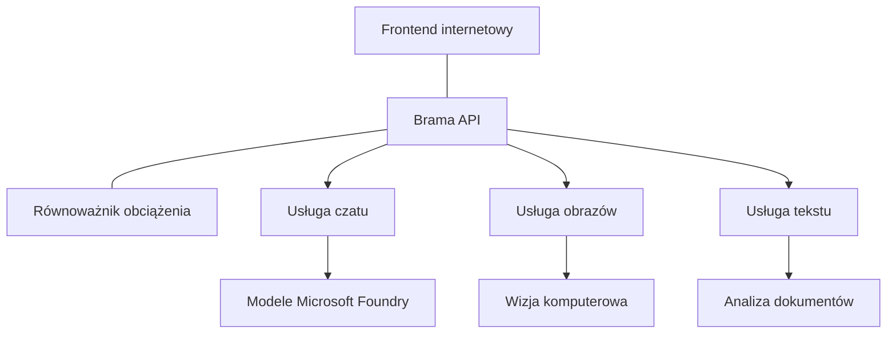

# Najlepsze praktyki dla produkcyjnych obciążeń AI z użyciem AZD

**Nawigacja po rozdziale:**
- **📚 Strona kursu**: [AZD dla początkujących](../../README.md)
- **📖 Aktualny rozdział**: Rozdział 8 - Wzorce produkcyjne i korporacyjne
- **⬅️ Poprzedni rozdział**: [Rozdział 7: Rozwiązywanie problemów](../chapter-07-troubleshooting/debugging.md)
- **⬅️ Powiązane także**: [Laboratorium warsztatów AI](ai-workshop-lab.md)
- **🎯 Kurs ukończony**: [AZD dla początkujących](../../README.md)

## Przegląd

Ten przewodnik przedstawia kompleksowe najlepsze praktyki dotyczące wdrażania produkcyjnych obciążeń AI z użyciem Azure Developer CLI (AZD). Oparte na opinii społeczności Microsoft Foundry Discord oraz rzeczywistych wdrożeniach klientów, te praktyki rozwiązują najczęstsze wyzwania w produkcyjnych systemach AI.

## Kluczowe wyzwania, które są adresowane

Na podstawie wyników naszej ankiety społecznościowej, oto główne problemy, z jakimi mierzą się deweloperzy:

- **45%** ma trudności z wdrożeniami AI wieloserwisowymi
- **38%** napotyka problemy z zarządzaniem poświadczeniami i sekretami  
- **35%** uważa, że gotowość produkcyjna i skalowanie są trudne
- **32%** potrzebuje lepszych strategii optymalizacji kosztów
- **29%** wymaga usprawnionego monitorowania i rozwiązywania problemów

## Wzorce architektury dla produkcyjnego AI

### Wzorzec 1: Architektura AI oparta na mikroserwisach

**Kiedy używać**: Złożone aplikacje AI z wieloma funkcjonalnościami


**Implementacja AZD**:

```yaml
# azure.yaml
name: enterprise-ai-platform
services:
  web:
    project: ./web
    host: staticwebapp
  api-gateway:
    project: ./api-gateway
    host: containerapp
  chat-service:
    project: ./services/chat
    host: containerapp
  vision-service:
    project: ./services/vision
    host: containerapp
  text-service:
    project: ./services/text
    host: containerapp
```

### Wzorzec 2: Przetwarzanie AI oparte na zdarzeniach

**Kiedy używać**: Przetwarzanie wsadowe, analiza dokumentów, asynchroniczne workflowy

```bicep
// Event Hub for AI processing pipeline
resource eventHub 'Microsoft.EventHub/namespaces@2023-01-01-preview' = {
  name: eventHubNamespaceName
  location: location
  sku: {
    name: 'Standard'
    tier: 'Standard'
    capacity: 1
  }
}

// Service Bus for reliable message processing
resource serviceBus 'Microsoft.ServiceBus/namespaces@2022-10-01-preview' = {
  name: serviceBusNamespaceName
  location: location
  sku: {
    name: 'Premium'
    tier: 'Premium'
    capacity: 1
  }
}

// Function App for processing
resource functionApp 'Microsoft.Web/sites@2023-01-01' = {
  name: functionAppName
  location: location
  kind: 'functionapp,linux'
  properties: {
    siteConfig: {
      appSettings: [
        {
          name: 'FUNCTIONS_EXTENSION_VERSION'
          value: '~4'
        }
        {
          name: 'AZURE_OPENAI_ENDPOINT'
          value: '@Microsoft.KeyVault(VaultName=${keyVault.name};SecretName=openai-endpoint)'
        }
      ]
    }
  }
}
```

## Myślenie o zdrowiu agenta AI

Gdy tradycyjna aplikacja webowa przestaje działać, symptomy są znane: strona się nie ładuje, API zwraca błąd lub wdrożenie kończy się niepowodzeniem. Aplikacje oparte na AI mogą psuć się w tych samych sposób—ale mogą też działać nieprawidłowo w subtelniejszy sposób, który nie generuje oczywistych komunikatów o błędach.

Ta sekcja pomaga zbudować mentalny model monitorowania obciążeń AI, abyś wiedział, gdzie szukać problemów, gdy coś wygląda na nieprawidłowe.

### Jak zdrowie agenta różni się od zdrowia tradycyjnej aplikacji

Tradycyjna aplikacja albo działa, albo nie. Agent AI może wyglądać na działającego, ale generować słabe wyniki. Myśl o zdrowiu agenta w dwóch warstwach:

| Warstwa | Na co zwracać uwagę | Gdzie patrzeć |
|---------|---------------------|---------------|
| **Zdrowie infrastruktury** | Czy usługa działa? Czy zasoby są przydzielone? Czy punkty końcowe są osiągalne? | `azd monitor`, zdrowie zasobów w Azure Portal, logi kontenerów/aplikacji |
| **Zdrowie zachowania** | Czy agent odpowiada poprawnie? Czy odpowiedzi są terminowe? Czy model jest wywoływany prawidłowo? | Ślady Application Insights, metryki opóźnień wywołań modelu, logi jakości odpowiedzi |

Zdrowie infrastruktury jest znane — takie samo dla każdej aplikacji azd. Zdrowie zachowania to nowa warstwa, którą wprowadzają obciążenia AI.

### Gdzie patrzeć, gdy aplikacje AI działają nieprawidłowo

Jeśli Twoja aplikacja AI nie generuje oczekiwanych wyników, oto koncepcyjna lista kontrolna:

1. **Zacznij od podstaw.** Czy aplikacja działa? Czy może połączyć się ze swoimi zależnościami? Sprawdź `azd monitor` i zdrowie zasobów tak jak w przypadku każdej aplikacji.
2. **Sprawdź połączenie z modelem.** Czy Twoja aplikacja poprawnie wywołuje model AI? Nieudane lub przekroczone limit czasu wywołań modelu to najczęstsza przyczyna problemów z aplikacjami AI i pojawią się w logach aplikacji.
3. **Spójrz, co model otrzymał.** Odpowiedzi AI zależą od wejścia (promptu i ewentualnego kontekstu). Jeśli wynik jest błędny, zazwyczaj wejście jest błędne. Sprawdź, czy aplikacja wysyła poprawne dane do modelu.
4. **Przeanalizuj opóźnienie odpowiedzi.** Wywołania modelu AI są wolniejsze niż typowe wywołania API. Jeśli aplikacja wydaje się wolna, sprawdź czy czasy odpowiedzi modelu wzrosły — może to wskazywać na ograniczenia przepustowości, limity pojemności lub zatłoczenie regionu.
5. **Obserwuj sygnały kosztowe.** Niespodziewane skoki zużycia tokenów lub wywołań API mogą oznaczać pętlę, niepoprawnie skonfigurowany prompt lub nadmierne próby ponownego wywołania.

Nie musisz od razu mistrzowsko obsługiwać narzędzi do obserwowalności. Kluczowa zasada to to, że aplikacje AI mają dodatkową warstwę zachowania do monitorowania, a wbudowany monitoring azd (`azd monitor`) daje punkt startowy do badania obu warstw.

---

## Najlepsze praktyki bezpieczeństwa

### 1. Model bezpieczeństwa Zero-Trust

**Strategia wdrożenia**:
- Brak komunikacji serwis-serwis bez uwierzytelnienia
- Wszystkie wywołania API używają tożsamości zarządzanych
- Izolacja sieciowa z prywatnymi punktami końcowymi
- Kontrola dostępu na zasadzie najmniejszych uprawnień

```bicep
// Managed Identity for each service
resource chatServiceIdentity 'Microsoft.ManagedIdentity/userAssignedIdentities@2023-01-31' = {
  name: 'chat-service-identity'
  location: location
}

// Role assignments with minimal permissions
resource openAIUserRole 'Microsoft.Authorization/roleAssignments@2022-04-01' = {
  scope: openAIAccount
  name: guid(openAIAccount.id, chatServiceIdentity.id, openAIUserRoleDefinitionId)
  properties: {
    roleDefinitionId: subscriptionResourceId('Microsoft.Authorization/roleDefinitions', '5e0bd9bd-7b93-4f28-af87-19fc36ad61bd')
    principalId: chatServiceIdentity.properties.principalId
    principalType: 'ServicePrincipal'
  }
}
```

### 2. Bezpieczne zarządzanie sekretami

**Wzorzec integracji z Key Vault**:

```bicep
// Key Vault with proper access policies
resource keyVault 'Microsoft.KeyVault/vaults@2023-02-01' = {
  name: keyVaultName
  location: location
  properties: {
    tenantId: tenant().tenantId
    sku: {
      family: 'A'
      name: 'premium'  // Use premium for production
    }
    enableRbacAuthorization: true  // Use RBAC instead of access policies
    enablePurgeProtection: true    // Prevent accidental deletion
    enableSoftDelete: true
    softDeleteRetentionInDays: 90
  }
}

// Store all AI service credentials
resource openAIKeySecret 'Microsoft.KeyVault/vaults/secrets@2023-02-01' = {
  parent: keyVault
  name: 'openai-api-key'
  properties: {
    value: openAIAccount.listKeys().key1
    attributes: {
      enabled: true
    }
  }
}
```

### 3. Bezpieczeństwo sieci

**Konfiguracja prywatnych punktów końcowych**:

```bicep
// Virtual Network for AI services
resource virtualNetwork 'Microsoft.Network/virtualNetworks@2023-04-01' = {
  name: vnetName
  location: location
  properties: {
    addressSpace: {
      addressPrefixes: ['10.0.0.0/16']
    }
    subnets: [
      {
        name: 'ai-services-subnet'
        properties: {
          addressPrefix: '10.0.1.0/24'
          privateEndpointNetworkPolicies: 'Disabled'
        }
      }
      {
        name: 'app-services-subnet'
        properties: {
          addressPrefix: '10.0.2.0/24'
          delegations: [
            {
              name: 'Microsoft.Web/serverFarms'
              properties: {
                serviceName: 'Microsoft.Web/serverFarms'
              }
            }
          ]
        }
      }
    ]
  }
}

// Private endpoints for all AI services
resource openAIPrivateEndpoint 'Microsoft.Network/privateEndpoints@2023-04-01' = {
  name: '${openAIAccountName}-pe'
  location: location
  properties: {
    subnet: {
      id: virtualNetwork.properties.subnets[0].id
    }
    privateLinkServiceConnections: [
      {
        name: 'openai-connection'
        properties: {
          privateLinkServiceId: openAIAccount.id
          groupIds: ['account']
        }
      }
    ]
  }
}
```

## Wydajność i skalowanie

### 1. Strategie autoskalowania

**Autoskalowanie aplikacji kontenerowych**:

```bicep
resource containerApp 'Microsoft.App/containerApps@2023-05-01' = {
  name: containerAppName
  location: location
  properties: {
    configuration: {
      ingress: {
        external: true
        targetPort: 8000
        transport: 'http'
      }
    }
    template: {
      scale: {
        minReplicas: 2  // Always have 2 instances minimum
        maxReplicas: 50 // Scale up to 50 for high load
        rules: [
          {
            name: 'http-scaling'
            http: {
              metadata: {
                concurrentRequests: '20'  // Scale when >20 concurrent requests
              }
            }
          }
          {
            name: 'cpu-scaling'
            custom: {
              type: 'cpu'
              metadata: {
                type: 'Utilization'
                value: '70'  // Scale when CPU >70%
              }
            }
          }
        ]
      }
    }
  }
}
```

### 2. Strategie cache'owania

**Redis Cache dla odpowiedzi AI**:

```bicep
// Redis Premium for production workloads
resource redisCache 'Microsoft.Cache/redis@2023-04-01' = {
  name: redisCacheName
  location: location
  properties: {
    sku: {
      name: 'Premium'
      family: 'P'
      capacity: 1
    }
    enableNonSslPort: false
    minimumTlsVersion: '1.2'
    redisConfiguration: {
      'maxmemory-policy': 'allkeys-lru'
    }
    // Enable clustering for high availability
    redisVersion: '6.0'
    shardCount: 2
  }
}

// Cache configuration in application
var cacheConnectionString = '${redisCache.properties.hostName}:6380,password=${redisCache.listKeys().primaryKey},ssl=True,abortConnect=False'
```

### 3. Równoważenie obciążenia i zarządzanie ruchem

**Application Gateway z WAF**:

```bicep
// Application Gateway with Web Application Firewall
resource applicationGateway 'Microsoft.Network/applicationGateways@2023-04-01' = {
  name: appGatewayName
  location: location
  properties: {
    sku: {
      name: 'WAF_v2'
      tier: 'WAF_v2'
      capacity: 2
    }
    webApplicationFirewallConfiguration: {
      enabled: true
      firewallMode: 'Prevention'
      ruleSetType: 'OWASP'
      ruleSetVersion: '3.2'
    }
    // Backend pools for AI services
    backendAddressPools: [
      {
        name: 'ai-services-pool'
        properties: {
          backendAddresses: [
            {
              fqdn: '${containerApp.properties.configuration.ingress.fqdn}'
            }
          ]
        }
      }
    ]
  }
}
```

## 💰 Optymalizacja kosztów

### 1. Prawidłowe dobieranie zasobów

**Konfiguracje specyficzne dla środowiska**:

```bash
# Środowisko deweloperskie
azd env new development
azd env set AZURE_OPENAI_SKU "S0"
azd env set AZURE_OPENAI_CAPACITY 10
azd env set AZURE_SEARCH_SKU "basic"
azd env set CONTAINER_CPU 0.5
azd env set CONTAINER_MEMORY 1.0

# Środowisko produkcyjne
azd env new production
azd env set AZURE_OPENAI_SKU "S0"
azd env set AZURE_OPENAI_CAPACITY 100
azd env set AZURE_SEARCH_SKU "standard"
azd env set CONTAINER_CPU 2.0
azd env set CONTAINER_MEMORY 4.0
```

### 2. Monitorowanie kosztów i budżety

```bicep
// Cost management and budgets
resource budget 'Microsoft.Consumption/budgets@2023-05-01' = {
  name: 'ai-workload-budget'
  properties: {
    timePeriod: {
      startDate: '2024-01-01'
      endDate: '2024-12-31'
    }
    timeGrain: 'Monthly'
    amount: 2000  // $2000 monthly budget
    category: 'Cost'
    notifications: {
      warning: {
        enabled: true
        operator: 'GreaterThan'
        threshold: 80
        contactEmails: [
          'finance@company.com'
          'engineering@company.com'
        ]
        contactRoles: [
          'Owner'
          'Contributor'
        ]
      }
      critical: {
        enabled: true
        operator: 'GreaterThan'
        threshold: 95
        contactEmails: [
          'cto@company.com'
        ]
      }
    }
  }
}
```

### 3. Optymalizacja zużycia tokenów

**Zarządzanie kosztami OpenAI**:

```typescript
// Optymalizacja tokenów na poziomie aplikacji
class TokenOptimizer {
  private readonly maxTokens = 4000;
  private readonly reserveTokens = 500;
  
  optimizePrompt(userInput: string, context: string): string {
    const availableTokens = this.maxTokens - this.reserveTokens;
    const estimatedTokens = this.estimateTokens(userInput + context);
    
    if (estimatedTokens > availableTokens) {
      // Ograniczaj kontekst, nie dane wejściowe użytkownika
      context = this.truncateContext(context, availableTokens - this.estimateTokens(userInput));
    }
    
    return `${context}\n\nUser: ${userInput}`;
  }
  
  private estimateTokens(text: string): number {
    // Przybliżone oszacowanie: 1 token ≈ 4 znaki
    return Math.ceil(text.length / 4);
  }
}
```

## Monitorowanie i obserwowalność

### 1. Kompleksowe Application Insights

```bicep
// Application Insights with advanced features
resource applicationInsights 'Microsoft.Insights/components@2020-02-02' = {
  name: applicationInsightsName
  location: location
  kind: 'web'
  properties: {
    Application_Type: 'web'
    WorkspaceResourceId: logAnalyticsWorkspace.id
    SamplingPercentage: 100  // Full sampling for AI apps
    DisableIpMasking: false  // Enable for security
  }
}

// Custom metrics for AI operations
resource aiMetricAlerts 'Microsoft.Insights/metricAlerts@2018-03-01' = {
  name: 'ai-high-error-rate'
  location: 'global'
  properties: {
    description: 'Alert when AI service error rate is high'
    severity: 2
    enabled: true
    scopes: [
      applicationInsights.id
    ]
    evaluationFrequency: 'PT1M'
    windowSize: 'PT5M'
    criteria: {
      'odata.type': 'Microsoft.Azure.Monitor.SingleResourceMultipleMetricCriteria'
      allOf: [
        {
          name: 'high-error-rate'
          metricName: 'requests/failed'
          operator: 'GreaterThan'
          threshold: 10
          timeAggregation: 'Count'
        }
      ]
    }
  }
}
```

### 2. Monitorowanie specyficzne dla AI

**Własne panele metryk AI**:

```json
// Dashboard configuration for AI workloads
{
  "dashboard": {
    "name": "AI Application Monitoring",
    "tiles": [
      {
        "name": "OpenAI Request Volume",
        "query": "requests | where name contains 'openai' | summarize count() by bin(timestamp, 5m)"
      },
      {
        "name": "AI Response Latency",
        "query": "requests | where name contains 'openai' | summarize avg(duration) by bin(timestamp, 5m)"
      },
      {
        "name": "Token Usage",
        "query": "customMetrics | where name == 'openai_tokens_used' | summarize sum(value) by bin(timestamp, 1h)"
      },
      {
        "name": "Cost per Hour",
        "query": "customMetrics | where name == 'openai_cost' | summarize sum(value) by bin(timestamp, 1h)"
      }
    ]
  }
}
```

### 3. Kontrole zdrowia i monitorowanie dostępności

```bicep
// Application Insights availability tests
resource availabilityTest 'Microsoft.Insights/webtests@2022-06-15' = {
  name: 'ai-app-availability-test'
  location: location
  tags: {
    'hidden-link:${applicationInsights.id}': 'Resource'
  }
  properties: {
    SyntheticMonitorId: 'ai-app-availability-test'
    Name: 'AI Application Availability Test'
    Description: 'Tests AI application endpoints'
    Enabled: true
    Frequency: 300  // 5 minutes
    Timeout: 120    // 2 minutes
    Kind: 'ping'
    Locations: [
      {
        Id: 'us-east-2-azr'
      }
      {
        Id: 'us-west-2-azr'
      }
    ]
    Configuration: {
      WebTest: '''
        <WebTest Name="AI Health Check" 
                 Id="8d2de8d2-a2b0-4c2e-9a0d-8f9c9a0b8c8d" 
                 Enabled="True" 
                 CssProjectStructure="" 
                 CssIteration="" 
                 Timeout="120" 
                 WorkItemIds="" 
                 xmlns="http://microsoft.com/schemas/VisualStudio/TeamTest/2010" 
                 Description="" 
                 CredentialUserName="" 
                 CredentialPassword="" 
                 PreAuthenticate="True" 
                 Proxy="default" 
                 StopOnError="False" 
                 RecordedResultFile="" 
                 ResultsLocale="">
          <Items>
            <Request Method="GET" 
                     Guid="a5f10126-e4cd-570d-961c-cea43999a200" 
                     Version="1.1" 
                     Url="${webApp.properties.defaultHostName}/health" 
                     ThinkTime="0" 
                     Timeout="120" 
                     ParseDependentRequests="True" 
                     FollowRedirects="True" 
                     RecordResult="True" 
                     Cache="False" 
                     ResponseTimeGoal="0" 
                     Encoding="utf-8" 
                     ExpectedHttpStatusCode="200" 
                     ExpectedResponseUrl="" 
                     ReportingName="" 
                     IgnoreHttpStatusCode="False" />
          </Items>
        </WebTest>
      '''
    }
  }
}
```

## Odzyskiwanie po awarii i wysoka dostępność

### 1. Wdrożenia wieloregionowe

```yaml
# azure.yaml - Multi-region configuration
name: ai-app-multiregion
services:
  api-primary:
    project: ./api
    host: containerapp
    env:
      - AZURE_REGION=eastus
  api-secondary:
    project: ./api
    host: containerapp
    env:
      - AZURE_REGION=westus2
```

```bicep
// Traffic Manager for global load balancing
resource trafficManager 'Microsoft.Network/trafficManagerProfiles@2022-04-01' = {
  name: trafficManagerProfileName
  location: 'global'
  properties: {
    profileStatus: 'Enabled'
    trafficRoutingMethod: 'Priority'
    dnsConfig: {
      relativeName: trafficManagerProfileName
      ttl: 30
    }
    monitorConfig: {
      protocol: 'HTTPS'
      port: 443
      path: '/health'
      intervalInSeconds: 30
      toleratedNumberOfFailures: 3
      timeoutInSeconds: 10
    }
    endpoints: [
      {
        name: 'primary-endpoint'
        type: 'Microsoft.Network/trafficManagerProfiles/azureEndpoints'
        properties: {
          targetResourceId: primaryAppService.id
          endpointStatus: 'Enabled'
          priority: 1
        }
      }
      {
        name: 'secondary-endpoint'
        type: 'Microsoft.Network/trafficManagerProfiles/azureEndpoints'
        properties: {
          targetResourceId: secondaryAppService.id
          endpointStatus: 'Enabled'
          priority: 2
        }
      }
    ]
  }
}
```

### 2. Kopie zapasowe i odzyskiwanie danych

```bicep
// Backup configuration for critical data
resource backupVault 'Microsoft.DataProtection/backupVaults@2023-05-01' = {
  name: backupVaultName
  location: location
  identity: {
    type: 'SystemAssigned'
  }
  properties: {
    storageSettings: [
      {
        datastoreType: 'VaultStore'
        type: 'LocallyRedundant'
      }
    ]
  }
}

// Backup policy for AI models and data
resource backupPolicy 'Microsoft.DataProtection/backupVaults/backupPolicies@2023-05-01' = {
  parent: backupVault
  name: 'ai-data-backup-policy'
  properties: {
    policyRules: [
      {
        backupParameters: {
          backupType: 'Full'
          objectType: 'AzureBackupParams'
        }
        trigger: {
          schedule: {
            repeatingTimeIntervals: [
              'R/2024-01-01T02:00:00+00:00/P1D'  // Daily at 2 AM
            ]
          }
          objectType: 'ScheduleBasedTriggerContext'
        }
        dataStore: {
          datastoreType: 'VaultStore'
          objectType: 'DataStoreInfoBase'
        }
        name: 'BackupDaily'
        objectType: 'AzureBackupRule'
      }
    ]
  }
}
```

## Integracja DevOps i CI/CD

### 1. Workflow GitHub Actions

```yaml
# .github/workflows/deploy-ai-app.yml
name: Deploy AI Application

on:
  push:
    branches: [main]
  pull_request:
    branches: [main]

jobs:
  test:
    runs-on: ubuntu-latest
    steps:
      - uses: actions/checkout@v4
      
      - name: Setup Python
        uses: actions/setup-python@v4
        with:
          python-version: '3.11'
          
      - name: Install dependencies
        run: |
          pip install -r requirements.txt
          pip install pytest
          
      - name: Run tests
        run: pytest tests/
        
      - name: AI Safety Tests
        run: |
          python scripts/test_ai_safety.py
          python scripts/validate_prompts.py

  deploy-staging:
    needs: test
    if: github.event_name == 'pull_request'
    runs-on: ubuntu-latest
    steps:
      - uses: actions/checkout@v4
      
      - name: Setup AZD
        uses: Azure/setup-azd@v1.0.0
        
      - name: Login to Azure
        uses: azure/login@v1
        with:
          creds: ${{ secrets.AZURE_CREDENTIALS }}
          
      - name: Deploy to Staging
        run: |
          azd env select staging
          azd deploy

  deploy-production:
    needs: test
    if: github.ref == 'refs/heads/main'
    runs-on: ubuntu-latest
    steps:
      - uses: actions/checkout@v4
      
      - name: Setup AZD
        uses: Azure/setup-azd@v1.0.0
        
      - name: Login to Azure
        uses: azure/login@v1
        with:
          creds: ${{ secrets.AZURE_CREDENTIALS }}
          
      - name: Deploy to Production
        run: |
          azd env select production
          azd deploy
          
      - name: Run Production Health Checks
        run: |
          python scripts/health_check.py --env production
```

### 2. Walidacja infrastruktury

```bash
# scripts/validate_infrastructure.sh
#!/bin/bash

echo "Validating AI infrastructure deployment..."

# Sprawdź, czy wszystkie wymagane usługi działają
services=("openai" "search" "storage" "keyvault")
for service in "${services[@]}"; do
    echo "Checking $service..."
    if ! az resource list --resource-type "Microsoft.CognitiveServices/accounts" --query "[?contains(name, '$service')]" -o tsv; then
        echo "ERROR: $service not found"
        exit 1
    fi
done

# Zweryfikuj wdrożenia modeli OpenAI
echo "Validating OpenAI model deployments..."
models=$(az cognitiveservices account deployment list --name $AZURE_OPENAI_NAME --resource-group $AZURE_RESOURCE_GROUP --query "[].name" -o tsv)
if [[ ! $models == *"gpt-35-turbo"* ]]; then
    echo "ERROR: Required model gpt-35-turbo not deployed"
    exit 1
fi

# Przetestuj łączność z usługą AI
echo "Testing AI service connectivity..."
python scripts/test_connectivity.py

echo "Infrastructure validation completed successfully!"
```

## Lista kontrolna gotowości produkcyjnej

### Bezpieczeństwo ✅
- [ ] Wszystkie usługi korzystają z tożsamości zarządzanych
- [ ] Sekrety przechowywane w Key Vault
- [ ] Skonfigurowane prywatne punkty końcowe
- [ ] Wdrożone grupy zabezpieczeń sieciowych
- [ ] RBAC z zasadą najmniejszych uprawnień
- [ ] WAF włączony na publicznych punktach końcowych

### Wydajność ✅
- [ ] Skonfigurowane autoskalowanie
- [ ] Implementacja cache'owania
- [ ] Skonfigurowane równoważenie obciążenia
- [ ] CDN dla treści statycznych
- [ ] Poolowanie połączeń z bazą danych
- [ ] Optymalizacja zużycia tokenów

### Monitorowanie ✅
- [ ] Skonfigurowane Application Insights
- [ ] Zdefiniowane metryki niestandardowe
- [ ] Skonfigurowane reguły alertów
- [ ] Stworzony panel kontrolny
- [ ] Wdrożone kontrole zdrowia
- [ ] Polityki retencji logów

### Niezawodność ✅
- [ ] Wdrożenie wieloregionowe
- [ ] Plan kopii zapasowej i odzyskiwania
- [ ] Implementacja wyłączników bezpieczeństwa
- [ ] Skonfigurowane polityki ponawiania
- [ ] Stopniowa degradacja usługi
- [ ] Punkty końcowe kontroli zdrowia

### Zarządzanie kosztami ✅
- [ ] Skonfigurowane alerty budżetowe
- [ ] Prawidłowe dobieranie zasobów
- [ ] Zastosowane zniżki deweloperskie/testowe
- [ ] Zakupione instancje rezerwowe
- [ ] Panel monitorowania kosztów
- [ ] Regularne przeglądy kosztów

### Zgodność ✅
- [ ] Spełnione wymagania dotyczące lokalizacji danych
- [ ] Włączone logowanie audytowe
- [ ] Zastosowane polityki zgodności
- [ ] Wdrożone podstawy bezpieczeństwa
- [ ] Regularne oceny bezpieczeństwa
- [ ] Plan reagowania na incydenty

## Wskaźniki wydajności

### Typowe metryki produkcyjne

| Metryka | Cel | Monitorowanie |
|---------|-----|---------------|
| **Czas odpowiedzi** | < 2 sekundy | Application Insights |
| **Dostępność** | 99,9% | Monitorowanie dostępności |
| **Wskaźnik błędów** | < 0,1% | Logi aplikacji |
| **Zużycie tokenów** | < 500 USD/miesiąc | Zarządzanie kosztami |
| **Równoczesni użytkownicy** | 1000+ | Testy obciążeniowe |
| **Czas odzyskiwania** | < 1 godzina | Testy odzyskiwania po awarii |

### Testy obciążeniowe

```bash
# Skrypt testu obciążeniowego dla aplikacji AI
python scripts/load_test.py \
  --endpoint https://your-ai-app.azurewebsites.net \
  --concurrent-users 100 \
  --duration 300 \
  --ramp-up 60
```

## 🤝 Najlepsze praktyki społeczności

Na podstawie opinii społeczności Microsoft Foundry Discord:

### Najważniejsze rekomendacje społeczności:

1. **Zacznij od małego, skaluj stopniowo**: Zacznij od podstawowych SKU i skaluj w oparciu o faktyczne zużycie
2. **Monitoruj wszystko**: Skonfiguruj kompleksowy monitoring od pierwszego dnia
3. **Automatyzuj bezpieczeństwo**: Używaj infrastruktury jako kodu dla spójnego bezpieczeństwa
4. **Testuj gruntownie**: Uwzględniaj testowanie specyficzne dla AI w pipeline
5. **Planuj koszty**: Monitoruj zużycie tokenów i wcześnie ustaw alerty budżetowe

### Typowe pułapki do unikania:

- ❌ Twarde kodowanie kluczy API w kodzie
- ❌ Brak właściwego monitorowania
- ❌ Ignorowanie optymalizacji kosztów
- ❌ Brak testów scenariuszy awaryjnych
- ❌ Wdrażanie bez kontroli zdrowia

## Polecenia i rozszerzenia AI AZD CLI

AZD zawiera rosnącą liczbę poleceń i rozszerzeń specyficznych dla AI, które usprawniają produkcyjne workflowy AI. Te narzędzia łączą lokalny rozwój z produkcyjnym wdrożeniem obciążeń AI.

### Rozszerzenia AZD dla AI

AZD używa systemu rozszerzeń do dodawania funkcji specyficznych dla AI. Instaluj i zarządzaj rozszerzeniami za pomocą:

```bash
# Wypisz wszystkie dostępne rozszerzenia (w tym AI)
azd extension list

# Zainstaluj rozszerzenie agentów Foundry
azd extension install azure.ai.agents

# Zainstaluj rozszerzenie do fine-tuningu
azd extension install azure.ai.finetune

# Zainstaluj rozszerzenie do modeli niestandardowych
azd extension install azure.ai.models

# Zaktualizuj wszystkie zainstalowane rozszerzenia
azd extension upgrade --all
```

**Dostępne rozszerzenia AI:**

| Rozszerzenie | Cel | Status |
|--------------|-----|--------|
| `azure.ai.agents` | Zarządzanie Foundry Agent Service | Preview |
| `azure.ai.finetune` | Dostosowywanie modeli Foundry | Preview |
| `azure.ai.models` | Niestandardowe modele Foundry | Preview |
| `azure.coding-agent` | Konfiguracja agenta kodowania | Dostępne |

### Inicjalizacja projektów agentów za pomocą `azd ai agent init`

Polecenie `azd ai agent init` tworzy projekt agenta AI gotowego do produkcji, zintegrowanego z Microsoft Foundry Agent Service:

```bash
# Zainicjuj nowy projekt agenta z manifestu agenta
azd ai agent init -m <manifest-path-or-uri>

# Zainicjuj i kieruj na konkretny projekt Foundry
azd ai agent init -m agent-manifest.yaml --project-id <foundry-project-id>

# Zainicjuj z niestandardowym katalogiem źródłowym
azd ai agent init -m agent-manifest.yaml --src ./agents/my-agent

# Kieruj na Container Apps jako hosta
azd ai agent init -m agent-manifest.yaml --host containerapp
```

**Kluczowe flagi:**

| Flaga | Opis |
|-------|-------|
| `-m, --manifest` | Ścieżka lub URI do manifestu agenta do dodania do projektu |
| `-p, --project-id` | Istniejące ID projektu Microsoft Foundry dla środowiska azd |
| `-s, --src` | Katalog do pobrania definicji agenta (domyślnie `src/<agent-id>`) |
| `--host` | Nadpisuje domyślny host (np. `containerapp`) |
| `-e, --environment` | Środowisko azd do użycia |

**Wskazówka produkcyjna**: Użyj `--project-id`, aby bezpośrednio połączyć się z istniejącym projektem Foundry, utrzymując kod agenta i zasoby w chmurze powiązane od samego początku.

### Protokół kontekstu modelu (MCP) z `azd mcp`

AZD zawiera wbudowane wsparcie serwera MCP (Alpha), umożliwiające agentom AI i narzędziom interakcję z Twoimi zasobami Azure poprzez ustandaryzowany protokół:

```bash
# Uruchom serwer MCP dla swojego projektu
azd mcp start

# Zarządzaj zgodą na narzędzia dla operacji MCP
azd mcp consent
```

Serwer MCP udostępnia kontekst projektu azd — środowiska, usługi i zasoby Azure — narzędziom programistycznym wspieranym przez AI. Pozwala to na:

- **Wspomagane wdrożenie AI**: Pozwól agentom kodującym zapytywać stan Twojego projektu i wyzwalać wdrożenia
- **Odkrywanie zasobów**: Narzędzia AI mogą odnajdywać, jakich zasobów Azure używa Twój projekt
- **Zarządzanie środowiskami**: Agenci mogą przełączać się między środowiskami dev/staging/production

### Generowanie infrastruktury z `azd infra generate`

Dla produkcyjnych obciążeń AI możesz generować i dostosowywać Infrastrukturę jako Kod zamiast polegać na automatycznym provisioningu:

```bash
# Generuj pliki Bicep/Terraform z definicji Twojego projektu
azd infra generate
```

To zapisuje IaC na dysku, abyś mógł:
- Przejrzeć i audytować infrastrukturę przed wdrożeniem
- Dodawać niestandardowe polityki bezpieczeństwa (reguły sieciowe, prywatne punkty końcowe)
- integrować z istniejącymi procesami przeglądu IaC
- wersjonować zmiany infrastruktury oddzielnie od kodu aplikacji

### Hooki cyklu życia produkcji

Hooki AZD pozwalają na wstrzykiwanie niestandardowej logiki na każdym etapie cyklu wdrożenia — kluczowe w produkcyjnych workflowach AI:

```yaml
# azure.yaml - Production hooks example
name: ai-production-app
hooks:
  preprovision:
    shell: sh
    run: scripts/validate-quotas.sh    # Check AI model quota before provisioning
  postprovision:
    shell: sh
    run: scripts/configure-networking.sh  # Set up private endpoints
  predeploy:
    shell: sh
    run: scripts/run-ai-safety-tests.sh  # Run prompt safety checks
  postdeploy:
    shell: sh
    run: scripts/smoke-test.sh           # Verify agent responses post-deploy
services:
  agent-api:
    project: ./src/agent
    host: containerapp
    hooks:
      predeploy:
        shell: sh
        run: scripts/validate-model-access.sh  # Per-service hook
```

```bash
# Ręczne uruchomienie konkretnego haka podczas tworzenia oprogramowania
azd hooks run predeploy
```

**Zalecane hooki produkcyjne dla obciążeń AI:**

| Hook | Przypadek użycia |
|------|------------------|
| `preprovision` | Walidacja limitów subskrypcji dla pojemności modeli AI |
| `postprovision` | Konfiguracja prywatnych punktów końcowych, wdrożenie wag modeli |
| `predeploy` | Uruchamianie testów bezpieczeństwa AI, walidacja szablonów promptów |
| `postdeploy` | Testy dymne odpowiedzi agenta, weryfikacja łączności z modelem |

### Konfiguracja pipeline CI/CD

Użyj `azd pipeline config`, aby połączyć swój projekt z GitHub Actions lub Azure Pipelines z bezpiecznym uwierzytelnianiem Azure:

```bash
# Skonfiguruj pipeline CI/CD (interaktywnie)
azd pipeline config

# Skonfiguruj z określonym dostawcą
azd pipeline config --provider github
```

To polecenie:
- Tworzy service principal z minimalnym dostępem
- Konfiguruje federowane poświadczenia (bez przechowywanych sekretów)
- Generuje lub aktualizuje plik definicji pipeline
- Ustawia wymagane zmienne środowiskowe w systemie CI/CD

**Produkcjny workflow z konfiguracją pipeline:**

```bash
# 1. Skonfiguruj środowisko produkcyjne
azd env new production
azd env set AZURE_OPENAI_CAPACITY 100

# 2. Skonfiguruj potok
azd pipeline config --provider github

# 3. Potok uruchamia azd deploy przy każdym pushu do main
```

### Dodawanie komponentów z `azd add`

Stopniowo dodawaj usługi Azure do istniejącego projektu:

```bash
# Dodaj nowy komponent usługi interaktywnie
azd add
```

To szczególnie przydatne przy rozbudowie produkcyjnych aplikacji AI — na przykład dodanie usługi wyszukiwania wektorowego, nowego punktu końcowego agenta czy komponentu monitorowania do istniejącego wdrożenia.

## Dodatkowe zasoby
- **Azure Well-Architected Framework**: [Wytyczne dotyczące obciążeń AI](https://learn.microsoft.com/azure/well-architected/ai/)
- **Microsoft Foundry Documentation**: [Oficjalna dokumentacja](https://learn.microsoft.com/azure/ai-studio/)
- **Szablony społecznościowe**: [Azure Samples](https://github.com/Azure-Samples)
- **Społeczność Discord**: [Kanał #Azure](https://discord.gg/microsoft-azure)
- **Umiejętności Agenta dla Azure**: [microsoft/github-copilot-for-azure na skills.sh](https://skills.sh/microsoft/github-copilot-for-azure) - 37 dostępnych umiejętności agenta dla Azure AI, Foundry, wdrożeń, optymalizacji kosztów i diagnostyki. Zainstaluj w swoim edytorze:
  ```bash
  npx skills add microsoft/github-copilot-for-azure
  ```

---

**Nawigacja rozdziałów:**
- **📚 Strona kursu głównego**: [AZD dla początkujących](../../README.md)
- **📖 Bieżący rozdział**: Rozdział 8 - Wzorce produkcyjne i korporacyjne
- **⬅️ Poprzedni rozdział**: [Rozdział 7: Rozwiązywanie problemów](../chapter-07-troubleshooting/debugging.md)
- **⬅️ Również powiązane**: [Warsztat AI](ai-workshop-lab.md)
- **� Kurs zakończony**: [AZD dla początkujących](../../README.md)

**Pamiętaj**: Produkcyjne obciążenia AI wymagają starannego planowania, monitorowania i ciągłej optymalizacji. Zacznij od tych wzorców i dostosuj je do swoich specyficznych wymagań.

---

<!-- CO-OP TRANSLATOR DISCLAIMER START -->
**Zastrzeżenie**:  
Dokument ten został przetłumaczony za pomocą usługi tłumaczenia AI [Co-op Translator](https://github.com/Azure/co-op-translator). Chociaż staramy się zapewnić dokładność, prosimy pamiętać, że automatyczne tłumaczenia mogą zawierać błędy lub niedokładności. Oryginalny dokument w języku źródłowym powinien być uważany za autorytatywne źródło. W przypadku informacji krytycznych zalecane jest skorzystanie z profesjonalnego tłumaczenia wykonanego przez człowieka. Nie ponosimy odpowiedzialności za jakiekolwiek nieporozumienia lub błędne interpretacje wynikające z użycia tego tłumaczenia.
<!-- CO-OP TRANSLATOR DISCLAIMER END -->