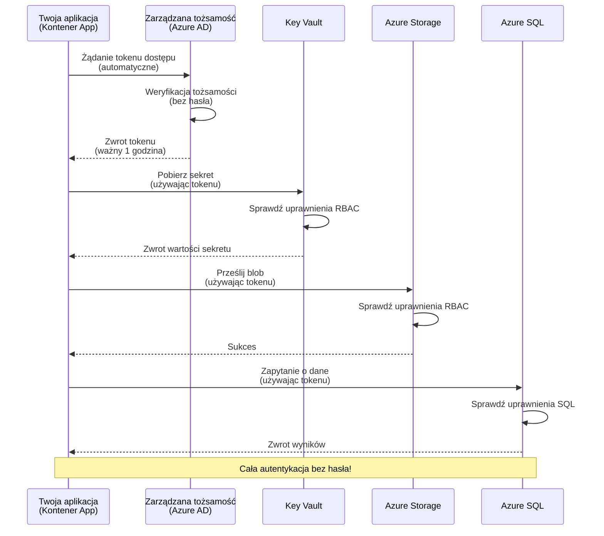
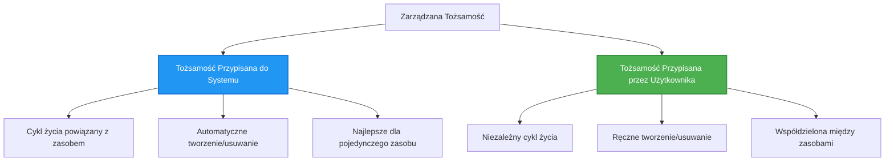

# Wzorce uwierzytelniania i Zarządzana Tożsamość

⏱️ **Szacowany czas**: 45-60 minut | 💰 **Koszt**: Bez dodatkowych opłat | ⭐ **Poziom trudności**: Średni

**📚 Ścieżka nauki:**
- ← Poprzedni: [Zarządzanie konfiguracją](configuration.md) - Zarządzanie zmiennymi środowiskowymi i sekretami
- 🎯 **Jesteś tutaj**: Uwierzytelnianie i bezpieczeństwo (Zarządzana Tożsamość, Key Vault, bezpieczne wzorce)
- → Następny: [Pierwszy projekt](first-project.md) - Zbuduj swoją pierwszą aplikację AZD
- 🏠 [Strona główna kursu](../../README.md)

---

## Czego się nauczysz

Po ukończeniu tej lekcji:
- Zrozumiesz wzorce uwierzytelniania w Azure (klucze, ciągi połączeń, zarządzana tożsamość)
- Zaimplementujesz **Zarządzaną Tożsamość** dla uwierzytelniania bez haseł
- Zabezpieczysz sekrety dzięki integracji z **Azure Key Vault**
- Skonfigurujesz **kontrolę dostępu opartą na rolach (RBAC)** dla wdrożeń AZD
- Zastosujesz najlepsze praktyki bezpieczeństwa w Container Apps i usługach Azure
- Przejdziesz z uwierzytelniania opartego na kluczach na uwierzytelnianie oparte na tożsamości

## Dlaczego Zarządzana Tożsamość jest ważna

### Problem: Tradycyjne uwierzytelnianie

**Przed Zarządzaną Tożsamością:**
```javascript
// ❌ RYZYKO BEZPIECZEŃSTWA: Wbudowane tajne dane w kodzie
const connectionString = "Server=mydb.database.windows.net;User=admin;Password=P@ssw0rd123";
const storageKey = "xK7mN9pQ2wR5tY8uI0oP3aS6dF1gH4jK...";
const cosmosKey = "C2x7B9n4M1p8Q5w3E6r0T2y5U8i1O4p7...";
```

**Problemy:**
- 🔴 **Eksponowane sekrety** w kodzie, plikach konfiguracyjnych, zmiennych środowiskowych
- 🔴 **Rotacja poświadczeń** wymaga zmian w kodzie i ponownego wdrożenia
- 🔴 **Koszmar audytów** - kto uzyskał dostęp, kiedy?
- 🔴 **Rozproszenie** - sekrety rozrzucone po wielu systemach
- 🔴 **Ryzyko zgodności** - nie spełnia wymagań audytów bezpieczeństwa

### Rozwiązanie: Zarządzana Tożsamość

**Po Zarządzanej Tożsamości:**
```javascript
// ✅ BEZPIECZNE: Brak tajemnic w kodzie
const credential = new DefaultAzureCredential();
const client = new BlobServiceClient(
  "https://mystorageaccount.blob.core.windows.net",
  credential  // Azure automatycznie obsługuje uwierzytelnianie
);
```

**Korzyści:**
- ✅ **Brak sekretów** w kodzie lub konfiguracji
- ✅ **Automatyczna rotacja** - obsługiwana przez Azure
- ✅ **Pełny ślad audytu** w logach Azure AD
- ✅ **Centralne zarządzanie bezpieczeństwem** - zarządzanie w Azure Portal
- ✅ **Gotowość do zgodności** - spełnia standardy bezpieczeństwa

**Analogicznie**: Tradycyjne uwierzytelnianie jest jak noszenie wielu fizycznych kluczy do różnych drzwi. Zarządzana Tożsamość to jak posiadanie identyfikatora bezpieczeństwa, który automatycznie przyznaje dostęp na podstawie tego, kim jesteś—bez kluczy do zgubienia, kopiowania czy rotacji.

---

## Przegląd architektury

### Przepływ uwierzytelniania z Zarządzaną Tożsamością


### Rodzaje Zarządzanych Tożsamości


| Funkcja | Przypisana do systemu | Przypisana do użytkownika |
|---------|-----------------------|--------------------------|
| **Cykl życia** | Powiązany z zasobem | Niezależny |
| **Tworzenie** | Automatyczne z zasobem | Ręczne tworzenie |
| **Usuwanie** | Usuwane z zasobem | Pozostaje po usunięciu zasobu |
| **Udostępnianie** | Tylko jeden zasób | Wiele zasobów |
| **Przypadek użycia** | Proste scenariusze | Złożone scenariusze wielozasobowe |
| **Domyślnie w AZD** | ✅ Zalecane | Opcjonalne |

---

## Wymagania wstępne

### Wymagane narzędzia

Powinieneś już mieć zainstalowane te narzędzia z poprzednich lekcji:

```bash
# Zweryfikuj Azure Developer CLI
azd version
# ✅ Oczekiwane: azd wersja 1.0.0 lub wyższa

# Zweryfikuj Azure CLI
az --version
# ✅ Oczekiwane: azure-cli 2.50.0 lub wyższa
```

### Wymagania Azure

- Aktywna subskrypcja Azure
- Uprawnienia do:
  - Tworzenia zarządzanych tożsamości
  - Przypisywania ról RBAC
  - Tworzenia zasobów Key Vault
  - Wdrażania Container Apps

### Wymagana wiedza

Powinieneś ukończyć:
- [Przewodnik instalacji](installation.md) - konfiguracja AZD
- [Podstawy AZD](azd-basics.md) - podstawowe pojęcia
- [Zarządzanie konfiguracją](configuration.md) - zmienne środowiskowe

---

## Lekcja 1: Zrozumienie wzorców uwierzytelniania

### Wzorzec 1: Ciągi połączeń (Legacy - Unikaj)

**Jak to działa:**
```bash
# Ciąg połączenia zawiera dane uwierzytelniające
STORAGE_CONNECTION_STRING="DefaultEndpointsProtocol=https;AccountName=myaccount;AccountKey=xK7mN9pQ2wR5..."
COSMOS_CONNECTION_STRING="AccountEndpoint=https://myaccount.documents.azure.com:443/;AccountKey=C2x7..."
SQL_CONNECTION_STRING="Server=myserver.database.windows.net;User=admin;Password=P@ssw0rd..."
```

**Problemy:**
- ❌ Sekrety widoczne w zmiennych środowiskowych
- ❌ Logowane w systemach wdrożeniowych
- ❌ Trudne do rotacji
- ❌ Brak śladu audytu dostępu

**Kiedy używać:** Tylko do lokalnego rozwoju, nigdy w produkcji.

---

### Wzorzec 2: Odwołania do Key Vault (Lepsze)

**Jak to działa:**
```bicep
// Store secret in Key Vault
resource keyVault 'Microsoft.KeyVault/vaults@2023-02-01' = {
  name: 'mykv'
  properties: {
    enableRbacAuthorization: true
  }
}

// Reference in Container App
env: [
  {
    name: 'STORAGE_KEY'
    secretRef: 'storage-key'  // References Key Vault
  }
]
```

**Korzyści:**
- ✅ Sekrety przechowywane bezpiecznie w Key Vault
- ✅ Centralne zarządzanie sekretami
- ✅ Rotacja bez zmian w kodzie

**Ograniczenia:**
- ⚠️ Nadal używane klucze/hasła
- ⚠️ Konieczność zarządzania dostępem do Key Vault

**Kiedy używać:** Etap przejściowy z ciągów połączeń do zarządzanej tożsamości.

---

### Wzorzec 3: Zarządzana Tożsamość (Najlepsza praktyka)

**Jak to działa:**
```bicep
// Enable managed identity
resource containerApp 'Microsoft.App/containerApps@2023-05-01' = {
  name: 'myapp'
  identity: {
    type: 'SystemAssigned'  // Automatically creates identity
  }
}

// Grant permissions
resource roleAssignment 'Microsoft.Authorization/roleAssignments@2022-04-01' = {
  scope: storageAccount
  properties: {
    roleDefinitionId: storageBlobDataContributorRole
    principalId: containerApp.identity.principalId
  }
}
```

**Kod aplikacji:**
```javascript
// Nie potrzeba żadnych tajemnic!
const { DefaultAzureCredential } = require('@azure/identity');
const { BlobServiceClient } = require('@azure/storage-blob');

const credential = new DefaultAzureCredential();
const blobServiceClient = new BlobServiceClient(
  'https://mystorageaccount.blob.core.windows.net',
  credential
);
```

**Korzyści:**
- ✅ Brak sekretów w kodzie/konfiguracji
- ✅ Automatyczna rotacja poświadczeń
- ✅ Pełny ślad audytu
- ✅ Uprawnienia oparte na RBAC
- ✅ Gotowość do zgodności

**Kiedy używać:** Zawsze, dla aplikacji produkcyjnych.

---

## Lekcja 2: Implementacja Zarządzanej Tożsamości z AZD

### Implementacja krok po kroku

Zbudujmy bezpieczną aplikację Container App, która używa zarządzanej tożsamości do uzyskania dostępu do Azure Storage i Key Vault.

### Struktura projektu

```
secure-app/
├── azure.yaml                 # AZD configuration
├── infra/
│   ├── main.bicep            # Main infrastructure
│   ├── core/
│   │   ├── identity.bicep    # Managed identity setup
│   │   ├── keyvault.bicep    # Key Vault configuration
│   │   └── storage.bicep     # Storage with RBAC
│   └── app/
│       └── container-app.bicep
└── src/
    ├── app.js                # Application code
    ├── package.json
    └── Dockerfile
```

### 1. Konfiguracja AZD (azure.yaml)

```yaml
name: secure-app
metadata:
  template: secure-app@1.0.0

services:
  api:
    project: ./src
    language: js
    host: containerapp

# Enable managed identity (AZD handles this automatically)
```

### 2. Infrastruktura: Włącz Zarządzaną Tożsamość

**Plik: `infra/main.bicep`**

```bicep
targetScope = 'subscription'

param environmentName string
param location string = 'eastus'

var tags = { 'azd-env-name': environmentName }

// Resource group
resource rg 'Microsoft.Resources/resourceGroups@2021-04-01' = {
  name: 'rg-${environmentName}'
  location: location
  tags: tags
}

// Storage Account
module storage './core/storage.bicep' = {
  name: 'storage'
  scope: rg
  params: {
    name: 'st${uniqueString(rg.id)}'
    location: location
    tags: tags
  }
}

// Key Vault
module keyVault './core/keyvault.bicep' = {
  name: 'keyvault'
  scope: rg
  params: {
    name: 'kv-${uniqueString(rg.id)}'
    location: location
    tags: tags
  }
}

// Container App with Managed Identity
module containerApp './app/container-app.bicep' = {
  name: 'container-app'
  scope: rg
  params: {
    name: 'ca-${environmentName}'
    location: location
    tags: tags
    storageAccountName: storage.outputs.name
    keyVaultName: keyVault.outputs.name
  }
}

// Grant Container App access to Storage
module storageRoleAssignment './core/role-assignment.bicep' = {
  name: 'storage-role'
  scope: rg
  params: {
    principalId: containerApp.outputs.identityPrincipalId
    roleDefinitionId: 'ba92f5b4-2d11-453d-a403-e96b0029c9fe'  // Storage Blob Data Contributor
    targetResourceId: storage.outputs.id
  }
}

// Grant Container App access to Key Vault
module kvRoleAssignment './core/role-assignment.bicep' = {
  name: 'kv-role'
  scope: rg
  params: {
    principalId: containerApp.outputs.identityPrincipalId
    roleDefinitionId: '4633458b-17de-408a-b874-0445c86b69e6'  // Key Vault Secrets User
    targetResourceId: keyVault.outputs.id
  }
}

// Outputs
output AZURE_STORAGE_ACCOUNT_NAME string = storage.outputs.name
output AZURE_KEY_VAULT_NAME string = keyVault.outputs.name
output APP_URL string = containerApp.outputs.url
```

### 3. Container App z tożsamością przypisaną do systemu

**Plik: `infra/app/container-app.bicep`**

```bicep
param name string
param location string
param tags object = {}
param storageAccountName string
param keyVaultName string

resource containerApp 'Microsoft.App/containerApps@2023-05-01' = {
  name: name
  location: location
  tags: tags
  identity: {
    type: 'SystemAssigned'  // 🔑 Enable managed identity
  }
  properties: {
    configuration: {
      ingress: {
        external: true
        targetPort: 3000
      }
    }
    template: {
      containers: [
        {
          name: 'api'
          image: 'myregistry.azurecr.io/api:latest'
          resources: {
            cpu: json('0.5')
            memory: '1Gi'
          }
          env: [
            {
              name: 'AZURE_STORAGE_ACCOUNT_NAME'
              value: storageAccountName
            }
            {
              name: 'AZURE_KEY_VAULT_NAME'
              value: keyVaultName
            }
            // 🔑 No secrets - managed identity handles authentication!
          ]
        }
      ]
    }
  }
}

// Output the identity for RBAC assignments
output identityPrincipalId string = containerApp.identity.principalId
output id string = containerApp.id
output url string = 'https://${containerApp.properties.configuration.ingress.fqdn}'
```

### 4. Moduł przypisania ról RBAC

**Plik: `infra/core/role-assignment.bicep`**

```bicep
param principalId string
param roleDefinitionId string  // Azure built-in role ID
param targetResourceId string

resource roleAssignment 'Microsoft.Authorization/roleAssignments@2022-04-01' = {
  name: guid(principalId, roleDefinitionId, targetResourceId)
  scope: resourceId('Microsoft.Resources/resourceGroups', resourceGroup().name)
  properties: {
    roleDefinitionId: subscriptionResourceId('Microsoft.Authorization/roleDefinitions', roleDefinitionId)
    principalId: principalId
    principalType: 'ServicePrincipal'
  }
}

output id string = roleAssignment.id
```

### 5. Kod aplikacji z Zarządzaną Tożsamością

**Plik: `src/app.js`**

```javascript
const express = require('express');
const { DefaultAzureCredential } = require('@azure/identity');
const { BlobServiceClient } = require('@azure/storage-blob');
const { SecretClient } = require('@azure/keyvault-secrets');

const app = express();
const PORT = process.env.PORT || 3000;

// 🔑 Zainicjuj poświadczenie (działa automatycznie z zarządzaną tożsamością)
const credential = new DefaultAzureCredential();

// Konfiguracja Azure Storage
const storageAccountName = process.env.AZURE_STORAGE_ACCOUNT_NAME;
const blobServiceClient = new BlobServiceClient(
  `https://${storageAccountName}.blob.core.windows.net`,
  credential  // Nie potrzeba kluczy!
);

// Konfiguracja Key Vault
const keyVaultName = process.env.AZURE_KEY_VAULT_NAME;
const secretClient = new SecretClient(
  `https://${keyVaultName}.vault.azure.net`,
  credential  // Nie potrzeba kluczy!
);

// Sprawdzenie stanu
app.get('/health', (req, res) => {
  res.json({ status: 'healthy', authentication: 'managed-identity' });
});

// Prześlij plik do blob storage
app.post('/upload', async (req, res) => {
  try {
    const containerClient = blobServiceClient.getContainerClient('uploads');
    await containerClient.createIfNotExists();
    
    const blobName = `file-${Date.now()}.txt`;
    const blockBlobClient = containerClient.getBlockBlobClient(blobName);
    
    await blockBlobClient.upload('Hello from managed identity!', 30);
    
    res.json({
      success: true,
      blobName: blobName,
      message: 'File uploaded using managed identity!'
    });
  } catch (error) {
    console.error('Upload error:', error);
    res.status(500).json({ error: error.message });
  }
});

// Pobierz sekret z Key Vault
app.get('/secret/:name', async (req, res) => {
  try {
    const secretName = req.params.name;
    const secret = await secretClient.getSecret(secretName);
    
    res.json({
      name: secretName,
      value: secret.value,
      message: 'Secret retrieved using managed identity!'
    });
  } catch (error) {
    console.error('Secret error:', error);
    res.status(500).json({ error: error.message });
  }
});

// Wyświetl listę kontenerów blob (pokazuje dostęp do odczytu)
app.get('/containers', async (req, res) => {
  try {
    const containers = [];
    for await (const container of blobServiceClient.listContainers()) {
      containers.push(container.name);
    }
    
    res.json({
      containers: containers,
      count: containers.length,
      message: 'Containers listed using managed identity!'
    });
  } catch (error) {
    console.error('List error:', error);
    res.status(500).json({ error: error.message });
  }
});

app.listen(PORT, () => {
  console.log(`Secure API listening on port ${PORT}`);
  console.log('Authentication: Managed Identity (passwordless)');
});
```

**Plik: `src/package.json`**

```json
{
  "name": "secure-app",
  "version": "1.0.0",
  "dependencies": {
    "express": "^4.18.2",
    "@azure/identity": "^4.0.0",
    "@azure/storage-blob": "^12.17.0",
    "@azure/keyvault-secrets": "^4.7.0"
  },
  "scripts": {
    "start": "node app.js"
  }
}
```

### 6. Wdrażanie i testowanie

```bash
# Zainicjuj środowisko AZD
azd init

# Wdróż infrastrukturę i aplikację
azd up

# Pobierz URL aplikacji
APP_URL=$(azd env get-values | grep APP_URL | cut -d '=' -f2 | tr -d '"')

# Przetestuj kontrolę stanu
curl $APP_URL/health
```

**✅ Oczekiwany wynik:**
```json
{
  "status": "healthy",
  "authentication": "managed-identity"
}
```

**Test przesyłania blobów:**
```bash
curl -X POST $APP_URL/upload
```

**✅ Oczekiwany wynik:**
```json
{
  "success": true,
  "blobName": "file-1700404800000.txt",
  "message": "File uploaded using managed identity!"
}
```

**Test listowania kontenerów:**
```bash
curl $APP_URL/containers
```

**✅ Oczekiwany wynik:**
```json
{
  "containers": ["uploads"],
  "count": 1,
  "message": "Containers listed using managed identity!"
}
```

---

## Wbudowane role RBAC w Azure

### Wbudowane identyfikatory ról dla Zarządzanej Tożsamości

| Usługa | Nazwa roli | ID roli | Uprawnienia |
|--------|------------|---------|-------------|
| **Storage** | Storage Blob Data Reader | `2a2b9908-6b94-4a3d-8e5a-a7d8f8cc8a12` | Odczyt blobów i kontenerów |
| **Storage** | Storage Blob Data Contributor | `ba92f5b4-2d11-453d-a403-e96b0029c9fe` | Odczyt, zapis, usuwanie blobów |
| **Storage** | Storage Queue Data Contributor | `974c5e8b-45b9-4653-ba55-5f855dd0fb88` | Odczyt, zapis, usuwanie wiadomości w kolejce |
| **Key Vault** | Key Vault Secrets User | `4633458b-17de-408a-b874-0445c86b69e6` | Odczyt sekretów |
| **Key Vault** | Key Vault Secrets Officer | `b86a8fe4-44ce-4948-aee5-eccb2c155cd7` | Odczyt, zapis, usuwanie sekretów |
| **Cosmos DB** | Cosmos DB Built-in Data Reader | `00000000-0000-0000-0000-000000000001` | Odczyt danych Cosmos DB |
| **Cosmos DB** | Cosmos DB Built-in Data Contributor | `00000000-0000-0000-0000-000000000002` | Odczyt, zapis danych Cosmos DB |
| **SQL Database** | SQL DB Contributor | `9b7fa17d-e63e-47b0-bb0a-15c516ac86ec` | Zarządzanie bazami danych SQL |
| **Service Bus** | Azure Service Bus Data Owner | `090c5cfd-751d-490a-894a-3ce6f1109419` | Wysyłanie, odbieranie, zarządzanie wiadomościami |

### Jak znaleźć identyfikatory ról

```bash
# Wymień wszystkie wbudowane role
az role definition list --query "[].{Name:roleName, ID:name}" --output table

# Wyszukaj konkretną rolę
az role definition list --query "[?contains(roleName, 'Storage Blob')].{Name:roleName, ID:name}" --output table

# Pobierz szczegóły roli
az role definition list --name "Storage Blob Data Contributor"
```

---

## Ćwiczenia praktyczne

### Ćwiczenie 1: Włącz Zarządzaną Tożsamość dla istniejącej aplikacji ⭐⭐ (Średni)

**Cel**: Dodaj zarządzaną tożsamość do istniejącego wdrożenia Container App

**Scenariusz**: Masz Container App używającą ciągów połączeń. Przekształć ją na zarządzaną tożsamość.

**Punkt startowy**: Container App z taką konfiguracją:

```bicep
// ❌ Current: Using connection string
env: [
  {
    name: 'STORAGE_CONNECTION_STRING'
    secretRef: 'storage-connection'
  }
]
```

**Kroki**:

1. **Włącz zarządzaną tożsamość w Bicep:**

```bicep
resource containerApp 'Microsoft.App/containerApps@2023-05-01' = {
  name: 'myapp'
  identity: {
    type: 'SystemAssigned'  // Add this
  }
  // ... rest of configuration
}
```

2. **Przyznaj dostęp do Storage:**

```bicep
// Get storage account reference
resource storageAccount 'Microsoft.Storage/storageAccounts@2023-01-01' existing = {
  name: storageAccountName
}

// Assign role
resource roleAssignment 'Microsoft.Authorization/roleAssignments@2022-04-01' = {
  name: guid(containerApp.id, 'ba92f5b4-2d11-453d-a403-e96b0029c9fe', storageAccount.id)
  scope: storageAccount
  properties: {
    roleDefinitionId: subscriptionResourceId('Microsoft.Authorization/roleDefinitions', 'ba92f5b4-2d11-453d-a403-e96b0029c9fe')
    principalId: containerApp.identity.principalId
    principalType: 'ServicePrincipal'
  }
}
```

3. **Zaktualizuj kod aplikacji:**

**Przed (ciąg połączenia):**
```javascript
const { BlobServiceClient } = require('@azure/storage-blob');

const blobServiceClient = BlobServiceClient.fromConnectionString(
  process.env.STORAGE_CONNECTION_STRING
);
```

**Po (zarządzana tożsamość):**
```javascript
const { DefaultAzureCredential } = require('@azure/identity');
const { BlobServiceClient } = require('@azure/storage-blob');

const credential = new DefaultAzureCredential();
const blobServiceClient = new BlobServiceClient(
  `https://${process.env.STORAGE_ACCOUNT_NAME}.blob.core.windows.net`,
  credential
);
```

4. **Zaktualizuj zmienne środowiskowe:**

```bicep
env: [
  {
    name: 'STORAGE_ACCOUNT_NAME'
    value: storageAccountName  // Just the name, no secrets!
  }
  // Remove STORAGE_CONNECTION_STRING
]
```

5. **Wdrażanie i testowanie:**

```bash
# Ponowne wdrożenie
azd up

# Przetestuj, czy nadal działa
curl https://myapp.azurecontainerapps.io/upload
```

**✅ Kryteria sukcesu:**
- ✅ Aplikacja wdrożona bez błędów
- ✅ Operacje na Storage działają (przesyłanie, listowanie, pobieranie)
- ✅ Brak ciągów połączeń w zmiennych środowiskowych
- ✅ Tożsamość widoczna w Azure Portal w sekcji "Identity"

**Weryfikacja:**

```bash
# Sprawdź, czy zarządzana tożsamość jest włączona
az containerapp show \
  --name myapp \
  --resource-group rg-myapp \
  --query "identity.type"
# ✅ Oczekiwane: "SystemAssigned"

# Sprawdź przypisanie roli
az role assignment list \
  --assignee $(az containerapp show --name myapp --resource-group rg-myapp --query "identity.principalId" -o tsv) \
  --scope /subscriptions/{sub-id}/resourceGroups/rg-myapp/providers/Microsoft.Storage/storageAccounts/mystorageaccount
# ✅ Oczekiwane: Pokazuje rolę "Storage Blob Data Contributor"
```

**Czas**: 20-30 minut

---

### Ćwiczenie 2: Dostęp do wielu usług z tożsamością przypisaną do użytkownika ⭐⭐⭐ (Zaawansowany)

**Cel**: Utwórz tożsamość przypisaną do użytkownika, współdzieloną przez wiele aplikacji Container Apps

**Scenariusz**: Masz 3 mikrousługi, które wszystkie potrzebują dostępu do tego samego konta Storage i Key Vault.

**Kroki**:

1. **Utwórz tożsamość przypisaną do użytkownika:**

**Plik: `infra/core/identity.bicep`**

```bicep
param name string
param location string
param tags object = {}

resource userAssignedIdentity 'Microsoft.ManagedIdentity/userAssignedIdentities@2023-01-31' = {
  name: name
  location: location
  tags: tags
}

output id string = userAssignedIdentity.id
output principalId string = userAssignedIdentity.properties.principalId
output clientId string = userAssignedIdentity.properties.clientId
```

2. **Przypisz role do tożsamości przypisanej do użytkownika:**

```bicep
// In main.bicep
module userIdentity './core/identity.bicep' = {
  name: 'user-identity'
  scope: rg
  params: {
    name: 'id-${environmentName}'
    location: location
    tags: tags
  }
}

// Grant Storage access
resource storageRoleAssignment 'Microsoft.Authorization/roleAssignments@2022-04-01' = {
  name: guid(userIdentity.outputs.principalId, 'storage-contributor')
  scope: storageAccount
  properties: {
    roleDefinitionId: subscriptionResourceId('Microsoft.Authorization/roleDefinitions', 'ba92f5b4-2d11-453d-a403-e96b0029c9fe')
    principalId: userIdentity.outputs.principalId
    principalType: 'ServicePrincipal'
  }
}

// Grant Key Vault access
resource kvRoleAssignment 'Microsoft.Authorization/roleAssignments@2022-04-01' = {
  name: guid(userIdentity.outputs.principalId, 'kv-secrets-user')
  scope: keyVault
  properties: {
    roleDefinitionId: subscriptionResourceId('Microsoft.Authorization/roleDefinitions', '4633458b-17de-408a-b874-0445c86b69e6')
    principalId: userIdentity.outputs.principalId
    principalType: 'ServicePrincipal'
  }
}
```

3. **Przypisz tożsamość do wielu aplikacji Container Apps:**

```bicep
resource apiGateway 'Microsoft.App/containerApps@2023-05-01' = {
  name: 'api-gateway'
  identity: {
    type: 'UserAssigned'
    userAssignedIdentities: {
      '${userIdentity.outputs.id}': {}
    }
  }
  // ... rest of config
}

resource productService 'Microsoft.App/containerApps@2023-05-01' = {
  name: 'product-service'
  identity: {
    type: 'UserAssigned'
    userAssignedIdentities: {
      '${userIdentity.outputs.id}': {}
    }
  }
  // ... rest of config
}

resource orderService 'Microsoft.App/containerApps@2023-05-01' = {
  name: 'order-service'
  identity: {
    type: 'UserAssigned'
    userAssignedIdentities: {
      '${userIdentity.outputs.id}': {}
    }
  }
  // ... rest of config
}
```

4. **Kod aplikacji (wszystkie usługi używają tego samego wzorca):**

```javascript
const { DefaultAzureCredential, ManagedIdentityCredential } = require('@azure/identity');

// Dla przypisanej przez użytkownika tożsamości określ identyfikator klienta
const credential = new ManagedIdentityCredential(
  process.env.AZURE_CLIENT_ID  // Identyfikator klienta przypisanej przez użytkownika tożsamości
);

// Lub użyj DefaultAzureCredential (automatyczne wykrywanie)
const credential = new DefaultAzureCredential();

const blobServiceClient = new BlobServiceClient(
  `https://${process.env.STORAGE_ACCOUNT_NAME}.blob.core.windows.net`,
  credential
);
```

5. **Wdrażanie i weryfikacja:**

```bash
azd up

# Przetestuj, czy wszystkie usługi mają dostęp do magazynu
curl https://api-gateway.azurecontainerapps.io/upload
curl https://product-service.azurecontainerapps.io/upload
curl https://order-service.azurecontainerapps.io/upload
```

**✅ Kryteria sukcesu:**
- ✅ Jedna tożsamość współdzielona przez 3 usługi
- ✅ Wszystkie usługi mają dostęp do Storage i Key Vault
- ✅ Tożsamość pozostaje po usunięciu jednej usługi
- ✅ Centralne zarządzanie uprawnieniami

**Korzyści z tożsamości przypisanej do użytkownika:**
- Jedna tożsamość do zarządzania
- Spójne uprawnienia dla usług
- Przetrwa usunięcie usługi
- Lepsze dla złożonych architektur

**Czas**: 30-40 minut

---

### Ćwiczenie 3: Implementacja rotacji sekretów w Key Vault ⭐⭐⭐ (Zaawansowany)

**Cel**: Przechowuj klucze API zewnętrznych usług w Key Vault i uzyskuj do nich dostęp za pomocą zarządzanej tożsamości

**Scenariusz**: Twoja aplikacja musi wywoływać zewnętrzne API (OpenAI, Stripe, SendGrid), które wymagają kluczy API.

**Kroki**:

1. **Utwórz Key Vault z RBAC:**

**Plik: `infra/core/keyvault.bicep`**

```bicep
param name string
param location string
param tags object = {}

resource keyVault 'Microsoft.KeyVault/vaults@2023-02-01' = {
  name: name
  location: location
  tags: tags
  properties: {
    enableRbacAuthorization: true  // Use RBAC instead of access policies
    sku: {
      family: 'A'
      name: 'standard'
    }
    tenantId: subscription().tenantId
    enableSoftDelete: true
    softDeleteRetentionInDays: 90
  }
}

// Allow Container App to read secrets
output id string = keyVault.id
output name string = keyVault.name
output uri string = keyVault.properties.vaultUri
```

2. **Przechowuj sekrety w Key Vault:**

```bash
# Pobierz nazwę Key Vault
KV_NAME=$(azd env get-values | grep AZURE_KEY_VAULT_NAME | cut -d '=' -f2 | tr -d '"')

# Przechowuj klucze API stron trzecich
az keyvault secret set \
  --vault-name $KV_NAME \
  --name "OpenAI-ApiKey" \
  --value "sk-proj-xxxxxxxxxxxxx"

az keyvault secret set \
  --vault-name $KV_NAME \
  --name "Stripe-ApiKey" \
  --value "sk_live_xxxxxxxxxxxxx"

az keyvault secret set \
  --vault-name $KV_NAME \
  --name "SendGrid-ApiKey" \
  --value "SG.xxxxxxxxxxxxx"
```

3. **Kod aplikacji do pobierania sekretów:**

**Plik: `src/config.js`**

```javascript
const { DefaultAzureCredential } = require('@azure/identity');
const { SecretClient } = require('@azure/keyvault-secrets');

class Config {
  constructor() {
    this.credential = new DefaultAzureCredential();
    this.secretClient = new SecretClient(
      `https://${process.env.AZURE_KEY_VAULT_NAME}.vault.azure.net`,
      this.credential
    );
    this.cache = {};
  }

  async getSecret(secretName) {
    // Najpierw sprawdź pamięć podręczną
    if (this.cache[secretName]) {
      return this.cache[secretName];
    }

    try {
      const secret = await this.secretClient.getSecret(secretName);
      this.cache[secretName] = secret.value;
      console.log(`✅ Retrieved secret: ${secretName}`);
      return secret.value;
    } catch (error) {
      console.error(`❌ Failed to get secret ${secretName}:`, error.message);
      throw error;
    }
  }

  async getOpenAIKey() {
    return this.getSecret('OpenAI-ApiKey');
  }

  async getStripeKey() {
    return this.getSecret('Stripe-ApiKey');
  }

  async getSendGridKey() {
    return this.getSecret('SendGrid-ApiKey');
  }
}

module.exports = new Config();
```

4. **Użyj sekretów w aplikacji:**

**Plik: `src/app.js`**

```javascript
const express = require('express');
const config = require('./config');
const { OpenAI } = require('openai');

const app = express();

// Zainicjuj OpenAI za pomocą klucza z Key Vault
let openaiClient;

async function initializeServices() {
  const openaiKey = await config.getOpenAIKey();
  openaiClient = new OpenAI({ apiKey: openaiKey });
  console.log('✅ Services initialized with secrets from Key Vault');
}

// Wywołaj przy uruchomieniu
initializeServices().catch(console.error);

app.post('/chat', async (req, res) => {
  try {
    const completion = await openaiClient.chat.completions.create({
      model: 'gpt-4',
      messages: [{ role: 'user', content: 'Hello!' }]
    });
    
    res.json({
      response: completion.choices[0].message.content,
      authentication: 'Key from Key Vault via Managed Identity'
    });
  } catch (error) {
    res.status(500).json({ error: error.message });
  }
});

app.listen(3000, () => {
  console.log('Secure API with Key Vault integration running');
});
```

5. **Wdrażanie i testowanie:**

```bash
azd up

# Testuj, czy klucze API działają
curl -X POST https://myapp.azurecontainerapps.io/chat \
  -H "Content-Type: application/json" \
  -d '{"message":"Hello AI"}'
```

**✅ Kryteria sukcesu:**
- ✅ Brak kluczy API w kodzie lub zmiennych środowiskowych
- ✅ Aplikacja pobiera klucze z Key Vault
- ✅ Zewnętrzne API działają poprawnie
- ✅ Możliwość rotacji kluczy bez zmian w kodzie

**Rotacja sekretu:**

```bash
# Zaktualizuj sekret w Key Vault
az keyvault secret set \
  --vault-name $KV_NAME \
  --name "OpenAI-ApiKey" \
  --value "sk-proj-NEW_KEY_HERE"

# Uruchom ponownie aplikację, aby pobrać nowy klucz
az containerapp revision restart \
  --name myapp \
  --resource-group rg-myapp
```

**Czas**: 25-35 minut

---

## Punkt kontrolny wiedzy

### 1. Wzorce uwierzytelniania ✓

Sprawdź swoją wiedzę:

- [ ] **P1**: Jakie są trzy główne wzorce uwierzytelniania? 
  - **O**: Ciągi połączeń (legacy), Odwołania do Key Vault (przejściowe), Zarządzana Tożsamość (najlepsze)

- [ ] **P2**: Dlaczego zarządzana tożsamość jest lepsza od ciągów połączeń?
  - **O**: Brak sekretów w kodzie, automatyczna rotacja, pełny ślad audytu, uprawnienia RBAC

- [ ] **P3**: Kiedy użyć tożsamości przypisanej do użytkownika zamiast przypisanej do systemu?
  - **O**: Gdy tożsamość jest współdzielona między wieloma zasobami lub gdy cykl życia tożsamości jest niezależny od cyklu życia zasobu

**Weryfikacja praktyczna:**
```bash
# Sprawdź, jakiego typu tożsamości używa Twoja aplikacja
az containerapp show \
  --name myapp \
  --resource-group rg-myapp \
  --query "identity.type"

# Wymień wszystkie przypisania ról dla tożsamości
az role assignment list \
  --assignee $(az containerapp show --name myapp --resource-group rg-myapp --query "identity.principalId" -o tsv)
```

---

### 2. RBAC i uprawnienia ✓

Sprawdź swoją wiedzę:

- [ ] **P1**: Jaki jest identyfikator roli dla "Storage Blob Data Contributor"?
  - **O**: `ba92f5b4-2d11-453d-a403-e96b0029c9fe`

- [ ] **P2**: Jakie uprawnienia zapewnia "Key Vault Secrets User"?
  - **O**: Dostęp tylko do odczytu sekretów (brak możliwości tworzenia, aktualizacji lub usuwania)

- [ ] **P3**: Jak przyznać aplikacji Container App dostęp do Azure SQL?
  - **O**: Przypisz rolę "SQL DB Contributor" lub skonfiguruj uwierzytelnianie Azure AD dla SQL

**Weryfikacja praktyczna:**
```bash
# Znajdź konkretną rolę
az role definition list --name "Storage Blob Data Contributor"

# Sprawdź, jakie role są przypisane do Twojej tożsamości
PRINCIPAL_ID=$(az containerapp show --name myapp --resource-group rg-myapp --query "identity.principalId" -o tsv)
az role assignment list --assignee $PRINCIPAL_ID --output table
```

---

### 3. Integracja z Key Vault ✓

Sprawdź swoją wiedzę:
- [ ] **P1**: Jak włączyć RBAC dla Key Vault zamiast polityk dostępu?
  - **O**: Ustaw `enableRbacAuthorization: true` w Bicep

- [ ] **P2**: Która biblioteka Azure SDK obsługuje uwierzytelnianie za pomocą zarządzanej tożsamości?
  - **O**: `@azure/identity` z klasą `DefaultAzureCredential`

- [ ] **P3**: Jak długo sekrety w Key Vault pozostają w pamięci podręcznej?
  - **O**: Zależy od aplikacji; zaimplementuj własną strategię pamięci podręcznej

**Weryfikacja praktyczna:**
```bash
# Przetestuj dostęp do Key Vault
az keyvault secret show \
  --vault-name $KV_NAME \
  --name "OpenAI-ApiKey" \
  --query "value"

# Sprawdź, czy RBAC jest włączony
az keyvault show \
  --name $KV_NAME \
  --query "properties.enableRbacAuthorization"
# ✅ Oczekiwane: prawda
```

---

## Najlepsze praktyki bezpieczeństwa

### ✅ ZALECANE:

1. **Zawsze używaj zarządzanej tożsamości w środowisku produkcyjnym**
   ```bicep
   identity: {
     type: 'SystemAssigned'
   }
   ```

2. **Używaj ról RBAC o minimalnych uprawnieniach**
   - W miarę możliwości używaj ról "Reader"
   - Unikaj ról "Owner" lub "Contributor", chyba że są konieczne

3. **Przechowuj klucze zewnętrznych dostawców w Key Vault**
   ```javascript
   const apiKey = await secretClient.getSecret('ThirdPartyApiKey');
   ```

4. **Włącz rejestrowanie audytowe**
   ```bicep
   diagnosticSettings: {
     logs: [{ category: 'AuditEvent', enabled: true }]
   }
   ```

5. **Używaj różnych tożsamości dla środowisk dev/staging/prod**
   ```bash
   azd env new dev
   azd env new staging
   azd env new prod
   ```

6. **Regularnie rotuj sekrety**
   - Ustaw daty wygaśnięcia dla sekretów w Key Vault
   - Automatyzuj rotację za pomocą Azure Functions

### ❌ NIE ZALECANE:

1. **Nigdy nie zapisuj sekretów w kodzie**
   ```javascript
   // ❌ ZŁE
   const apiKey = "sk-proj-xxxxxxxxxxxxx";
   ```

2. **Nie używaj ciągów połączeń w środowisku produkcyjnym**
   ```javascript
   // ❌ ZŁE
   BlobServiceClient.fromConnectionString(process.env.STORAGE_CONNECTION_STRING)
   ```

3. **Nie przyznawaj nadmiernych uprawnień**
   ```bicep
   // ❌ BAD - too much access
   roleDefinitionId: 'Owner'
   
   // ✅ GOOD - least privilege
   roleDefinitionId: 'Storage Blob Data Reader'
   ```

4. **Nie loguj sekretów**
   ```javascript
   // ❌ ZŁE
   console.log('API Key:', apiKey);
   
   // ✅ DOBRE
   console.log('API Key retrieved successfully');
   ```

5. **Nie używaj tych samych tożsamości produkcyjnych w różnych środowiskach**
   ```bicep
   // ❌ BAD - same identity for dev and prod
   // ✅ GOOD - separate identities per environment
   ```

---

## Przewodnik rozwiązywania problemów

### Problem: "Unauthorized" podczas dostępu do Azure Storage

**Objawy:**
```
Error: Unauthorized (403)
AuthorizationPermissionMismatch: This request is not authorized to perform this operation
```

**Diagnoza:**

```bash
# Sprawdź, czy zarządzana tożsamość jest włączona
az containerapp show \
  --name myapp \
  --resource-group rg-myapp \
  --query "identity.type"
# ✅ Oczekiwane: "SystemAssigned" lub "UserAssigned"

# Sprawdź przypisania ról
PRINCIPAL_ID=$(az containerapp show --name myapp --resource-group rg-myapp --query "identity.principalId" -o tsv)
az role assignment list --assignee $PRINCIPAL_ID

# Oczekiwane: Powinno być widoczne "Storage Blob Data Contributor" lub podobna rola
```

**Rozwiązania:**

1. **Przyznaj odpowiednią rolę RBAC:**
```bash
STORAGE_ID=$(az storage account show --name mystorageaccount --resource-group rg-myapp --query "id" -o tsv)
az role assignment create \
  --assignee $PRINCIPAL_ID \
  --role "Storage Blob Data Contributor" \
  --scope $STORAGE_ID
```

2. **Poczekaj na propagację (może potrwać 5-10 minut):**
```bash
# Sprawdź status przypisania roli
az role assignment list --assignee $PRINCIPAL_ID --scope $STORAGE_ID
```

3. **Zweryfikuj, czy kod aplikacji używa poprawnych poświadczeń:**
```javascript
// Upewnij się, że używasz DefaultAzureCredential
const credential = new DefaultAzureCredential();
```

---

### Problem: Odmowa dostępu do Key Vault

**Objawy:**
```
Error: Forbidden (403)
The user, group or application does not have secrets get permission
```

**Diagnoza:**

```bash
# Sprawdź, czy RBAC dla Key Vault jest włączony
az keyvault show \
  --name $KV_NAME \
  --query "properties.enableRbacAuthorization"
# ✅ Oczekiwane: prawda

# Sprawdź przypisania ról
az role assignment list \
  --assignee $PRINCIPAL_ID \
  --scope /subscriptions/{sub-id}/resourceGroups/rg-myapp/providers/Microsoft.KeyVault/vaults/$KV_NAME
```

**Rozwiązania:**

1. **Włącz RBAC w Key Vault:**
```bash
az keyvault update \
  --name $KV_NAME \
  --enable-rbac-authorization true
```

2. **Przyznaj rolę Key Vault Secrets User:**
```bash
KV_ID=$(az keyvault show --name $KV_NAME --query "id" -o tsv)
az role assignment create \
  --assignee $PRINCIPAL_ID \
  --role "Key Vault Secrets User" \
  --scope $KV_ID
```

---

### Problem: DefaultAzureCredential nie działa lokalnie

**Objawy:**
```
Error: DefaultAzureCredential failed to retrieve a token
CredentialUnavailableError: No credential available
```

**Diagnoza:**

```bash
# Sprawdź, czy jesteś zalogowany
az account show

# Sprawdź uwierzytelnienie Azure CLI
az ad signed-in-user show
```

**Rozwiązania:**

1. **Zaloguj się do Azure CLI:**
```bash
az login
```

2. **Ustaw subskrypcję Azure:**
```bash
az account set --subscription "Your Subscription Name"
```

3. **Dla lokalnego rozwoju użyj zmiennych środowiskowych:**
```bash
export AZURE_TENANT_ID="your-tenant-id"
export AZURE_CLIENT_ID="your-client-id"
export AZURE_CLIENT_SECRET="your-client-secret"
```

4. **Lub użyj innego poświadczenia lokalnie:**
```javascript
const { DefaultAzureCredential, AzureCliCredential } = require('@azure/identity');

// Użyj AzureCliCredential do lokalnego rozwoju
const credential = process.env.NODE_ENV === 'production' 
  ? new DefaultAzureCredential()
  : new AzureCliCredential();
```

---

### Problem: Propagacja przypisania roli trwa zbyt długo

**Objawy:**
- Rola została przypisana pomyślnie
- Nadal występują błędy 403
- Dostęp jest nieregularny (czasami działa, czasami nie)

**Wyjaśnienie:**
Zmiany w Azure RBAC mogą globalnie propagować się przez 5-10 minut.

**Rozwiązanie:**

```bash
# Poczekaj i spróbuj ponownie
echo "Waiting for RBAC propagation..."
sleep 300  # Poczekaj 5 minut

# Przetestuj dostęp
curl https://myapp.azurecontainerapps.io/upload

# Jeśli nadal nie działa, uruchom aplikację ponownie
az containerapp revision restart \
  --name myapp \
  --resource-group rg-myapp
```

---

## Rozważania dotyczące kosztów

### Koszty zarządzanej tożsamości

| Zasób | Koszt |
|-------|-------|
| **Zarządzana tożsamość** | 🆓 **BEZPŁATNE** - Brak opłat |
| **Przypisania ról RBAC** | 🆓 **BEZPŁATNE** - Brak opłat |
| **Żądania tokenów Azure AD** | 🆓 **BEZPŁATNE** - Wliczone |
| **Operacje Key Vault** | $0.03 za 10,000 operacji |
| **Przechowywanie w Key Vault** | $0.024 za sekret miesięcznie |

**Zarządzana tożsamość oszczędza pieniądze dzięki:**
- ✅ Eliminacji operacji Key Vault dla uwierzytelniania między usługami
- ✅ Redukcji incydentów bezpieczeństwa (brak wycieków poświadczeń)
- ✅ Zmniejszeniu nakładu operacyjnego (brak ręcznej rotacji)

**Przykładowe porównanie kosztów (miesięczne):**

| Scenariusz | Ciągi połączeń | Zarządzana tożsamość | Oszczędności |
|------------|----------------|----------------------|--------------|
| Mała aplikacja (1M żądań) | ~$50 (Key Vault + operacje) | ~$0 | $50/miesiąc |
| Średnia aplikacja (10M żądań) | ~$200 | ~$0 | $200/miesiąc |
| Duża aplikacja (100M żądań) | ~$1,500 | ~$0 | $1,500/miesiąc |

---

## Dowiedz się więcej

### Oficjalna dokumentacja
- [Azure Managed Identity](https://learn.microsoft.com/entra/identity/managed-identities-azure-resources/overview)
- [Azure RBAC](https://learn.microsoft.com/azure/role-based-access-control/overview)
- [Azure Key Vault](https://learn.microsoft.com/azure/key-vault/general/overview)
- [DefaultAzureCredential](https://learn.microsoft.com/dotnet/api/azure.identity.defaultazurecredential)

### Dokumentacja SDK
- [@azure/identity (Node.js)](https://www.npmjs.com/package/@azure/identity)
- [Azure.Identity (C#)](https://www.nuget.org/packages/Azure.Identity/)
- [azure-identity (Python)](https://pypi.org/project/azure-identity/)

### Kolejne kroki w tym kursie
- ← Poprzedni: [Zarządzanie konfiguracją](configuration.md)
- → Następny: [Pierwszy projekt](first-project.md)
- 🏠 [Strona główna kursu](../../README.md)

### Powiązane przykłady
- [Przykład Azure OpenAI Chat](../../../../examples/azure-openai-chat) - Używa zarządzanej tożsamości dla Azure OpenAI
- [Przykład mikroserwisów](../../../../examples/microservices) - Wzorce uwierzytelniania dla wielu usług

---

## Podsumowanie

**Nauczyłeś się:**
- ✅ Trzech wzorców uwierzytelniania (ciągi połączeń, Key Vault, zarządzana tożsamość)
- ✅ Jak włączyć i skonfigurować zarządzaną tożsamość w AZD
- ✅ Przypisania ról RBAC dla usług Azure
- ✅ Integracji Key Vault dla sekretów zewnętrznych dostawców
- ✅ Różnic między tożsamościami przypisanymi użytkownikowi a systemowi
- ✅ Najlepszych praktyk bezpieczeństwa i rozwiązywania problemów

**Najważniejsze wnioski:**
1. **Zawsze używaj zarządzanej tożsamości w produkcji** - Brak sekretów, automatyczna rotacja
2. **Używaj ról RBAC o minimalnych uprawnieniach** - Przyznawaj tylko niezbędne uprawnienia
3. **Przechowuj klucze zewnętrznych dostawców w Key Vault** - Centralne zarządzanie sekretami
4. **Oddziel tożsamości dla każdego środowiska** - Izolacja dev, staging, prod
5. **Włącz rejestrowanie audytowe** - Śledź, kto uzyskał dostęp do czego

**Kolejne kroki:**
1. Ukończ powyższe ćwiczenia praktyczne
2. Przenieś istniejącą aplikację z ciągów połączeń na zarządzaną tożsamość
3. Zbuduj swój pierwszy projekt AZD z bezpieczeństwem od samego początku: [Pierwszy projekt](first-project.md)

---

<!-- CO-OP TRANSLATOR DISCLAIMER START -->
**Zastrzeżenie**:  
Ten dokument został przetłumaczony za pomocą usługi tłumaczenia AI [Co-op Translator](https://github.com/Azure/co-op-translator). Chociaż staramy się zapewnić dokładność, prosimy pamiętać, że automatyczne tłumaczenia mogą zawierać błędy lub nieścisłości. Oryginalny dokument w jego rodzimym języku powinien być uznawany za wiarygodne źródło. W przypadku kluczowych informacji zaleca się skorzystanie z profesjonalnego tłumaczenia przez człowieka. Nie ponosimy odpowiedzialności za jakiekolwiek nieporozumienia lub błędne interpretacje wynikające z użycia tego tłumaczenia.
<!-- CO-OP TRANSLATOR DISCLAIMER END -->