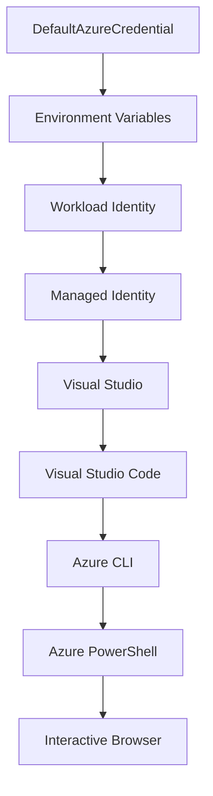

<!--
CO_OP_TRANSLATOR_METADATA:
{
  "original_hash": "4dc26ed8004b58a51875efd07203340f",
  "translation_date": "2025-09-26T18:35:09+00:00",
  "source_file": "docs/getting-started/azd-basics.md",
  "language_code": "pl"
}
-->
# AZD Podstawy - Zrozumienie Azure Developer CLI

# AZD Podstawy - Kluczowe Koncepcje i Fundamenty

**Nawigacja Rozdziału:**
- **📚 Strona Główna Kursu**: [AZD dla Początkujących](../../README.md)
- **📖 Obecny Rozdział**: Rozdział 1 - Podstawy i Szybki Start
- **⬅️ Poprzedni**: [Przegląd Kursu](../../README.md#-chapter-1-foundation--quick-start)
- **➡️ Następny**: [Instalacja i Konfiguracja](installation.md)
- **🚀 Następny Rozdział**: [Rozdział 2: Rozwój z AI](../ai-foundry/azure-ai-foundry-integration.md)

## Wprowadzenie

W tej lekcji poznasz Azure Developer CLI (azd), potężne narzędzie wiersza poleceń, które przyspiesza przejście od lokalnego rozwoju do wdrożenia w Azure. Dowiesz się o podstawowych koncepcjach, kluczowych funkcjach i zrozumiesz, jak azd upraszcza wdrażanie aplikacji natywnych dla chmury.

## Cele Nauki

Po zakończeniu tej lekcji będziesz:
- Rozumieć, czym jest Azure Developer CLI i jego główny cel
- Poznać kluczowe koncepcje, takie jak szablony, środowiska i usługi
- Zbadać kluczowe funkcje, w tym rozwój oparty na szablonach i Infrastructure as Code
- Zrozumieć strukturę projektu azd i przepływ pracy
- Przygotowany do instalacji i konfiguracji azd w swoim środowisku programistycznym

## Efekty Nauki

Po ukończeniu tej lekcji będziesz w stanie:
- Wyjaśnić rolę azd w nowoczesnych przepływach pracy związanych z rozwojem w chmurze
- Zidentyfikować komponenty struktury projektu azd
- Opisać, jak szablony, środowiska i usługi współpracują ze sobą
- Zrozumieć korzyści z Infrastructure as Code z azd
- Rozpoznać różne polecenia azd i ich zastosowania

## Czym jest Azure Developer CLI (azd)?

Azure Developer CLI (azd) to narzędzie wiersza poleceń zaprojektowane, aby przyspieszyć przejście od lokalnego rozwoju do wdrożenia w Azure. Upraszcza proces budowania, wdrażania i zarządzania aplikacjami natywnymi dla chmury w Azure.

## Kluczowe Koncepcje

### Szablony
Szablony są podstawą azd. Zawierają:
- **Kod aplikacji** - Twój kod źródłowy i zależności
- **Definicje infrastruktury** - Zasoby Azure zdefiniowane w Bicep lub Terraform
- **Pliki konfiguracyjne** - Ustawienia i zmienne środowiskowe
- **Skrypty wdrożeniowe** - Zautomatyzowane przepływy pracy wdrożeniowe

### Środowiska
Środowiska reprezentują różne cele wdrożeniowe:
- **Rozwój** - Do testowania i rozwoju
- **Staging** - Środowisko przedprodukcyjne
- **Produkcja** - Środowisko produkcyjne na żywo

Każde środowisko utrzymuje własne:
- Grupę zasobów Azure
- Ustawienia konfiguracyjne
- Stan wdrożenia

### Usługi
Usługi są elementami składowymi Twojej aplikacji:
- **Frontend** - Aplikacje webowe, SPA
- **Backend** - API, mikrousługi
- **Baza danych** - Rozwiązania do przechowywania danych
- **Przechowywanie** - Przechowywanie plików i blobów

## Kluczowe Funkcje

### 1. Rozwój oparty na szablonach
```bash
# Browse available templates
azd template list

# Initialize from a template
azd init --template <template-name>
```

### 2. Infrastructure as Code
- **Bicep** - Specjalistyczny język Azure
- **Terraform** - Narzędzie do infrastruktury wielochmurowej
- **ARM Templates** - Szablony Azure Resource Manager

### 3. Zintegrowane przepływy pracy
```bash
# Complete deployment workflow
azd up            # Provision + Deploy this is hands off for first time setup
azd provision     # Create Azure resources if you update the infrastructure use this
azd deploy        # Deploy application code or redeploy application code once update
azd down          # Clean up resources
```

### 4. Zarządzanie środowiskami
```bash
# Create and manage environments
azd env new <environment-name>
azd env select <environment-name>
azd env list
```

## 📁 Struktura Projektu

Typowa struktura projektu azd:
```
my-app/
├── .azd/                    # azd configuration
│   └── config.json
├── .azure/                  # Azure deployment artifacts
├── .devcontainer/          # Development container config
├── .github/workflows/      # GitHub Actions
├── .vscode/               # VS Code settings
├── infra/                 # Infrastructure code
│   ├── main.bicep        # Main infrastructure template
│   ├── main.parameters.json
│   └── modules/          # Reusable modules
├── src/                  # Application source code
│   ├── api/             # Backend services
│   └── web/             # Frontend application
├── azure.yaml           # azd project configuration
└── README.md
```

## 🔧 Pliki Konfiguracyjne

### azure.yaml
Główny plik konfiguracyjny projektu:
```yaml
name: my-awesome-app
metadata:
  template: my-template@1.0.0

services:
  web:
    project: ./src/web
    language: js
    host: appservice
  api:
    project: ./src/api
    language: js
    host: appservice

hooks:
  preprovision:
    shell: pwsh
    run: echo "Preparing to provision..."
```

### .azure/config.json
Konfiguracja specyficzna dla środowiska:
```json
{
  "version": 1,
  "defaultEnvironment": "dev",
  "environments": {
    "dev": {
      "subscriptionId": "your-subscription-id",
      "location": "eastus"
    }
  }
}
```

## 🎪 Typowe Przepływy Pracy

### Rozpoczęcie Nowego Projektu
```bash
# Method 1: Use existing template
azd init --template todo-nodejs-mongo

# Method 2: Start from scratch
azd init

# Method 3: Use current directory
azd init .
```

### Cykl Rozwoju
```bash
# Set up development environment
azd auth login
azd env new dev
azd env select dev

# Deploy everything
azd up

# Make changes and redeploy
azd deploy

# Clean up when done
azd down --force --purge # command in the Azure Developer CLI is a **hard reset** for your environment—especially useful when you're troubleshooting failed deployments, cleaning up orphaned resources, or prepping for a fresh redeploy.
```

## Zrozumienie `azd down --force --purge`
Polecenie `azd down --force --purge` to potężny sposób na całkowite usunięcie środowiska azd i wszystkich powiązanych zasobów. Oto szczegóły dotyczące każdego flagi:
```
--force
```
- Pomija potwierdzenia.
- Przydatne w automatyzacji lub skryptach, gdzie ręczne wprowadzanie nie jest możliwe.
- Zapewnia, że proces usuwania przebiega bez przerw, nawet jeśli CLI wykryje niespójności.

```
--purge
```
Usuwa **wszystkie powiązane metadane**, w tym:
Stan środowiska
Lokalny folder `.azure`
Zbuforowane informacje o wdrożeniu
Zapobiega "zapamiętywaniu" przez azd poprzednich wdrożeń, co może powodować problemy, takie jak niedopasowane grupy zasobów lub przestarzałe odwołania do rejestru.

### Dlaczego używać obu?
Gdy napotkasz problemy z `azd up` z powodu pozostałego stanu lub częściowych wdrożeń, ta kombinacja zapewnia **czystą kartę**.

Jest szczególnie przydatna po ręcznym usunięciu zasobów w portalu Azure lub podczas zmiany szablonów, środowisk lub konwencji nazewnictwa grup zasobów.

### Zarządzanie Wieloma Środowiskami
```bash
# Create staging environment
azd env new staging
azd env select staging
azd up

# Switch back to dev
azd env select dev

# Compare environments
azd env list
```

## 🔐 Uwierzytelnianie i Poświadczenia

Zrozumienie uwierzytelniania jest kluczowe dla udanych wdrożeń azd. Azure używa wielu metod uwierzytelniania, a azd korzysta z tego samego łańcucha poświadczeń, co inne narzędzia Azure.

### Uwierzytelnianie Azure CLI (`az login`)

Przed użyciem azd musisz uwierzytelnić się w Azure. Najczęściej stosowaną metodą jest użycie Azure CLI:

```bash
# Interactive login (opens browser)
az login

# Login with specific tenant
az login --tenant <tenant-id>

# Login with service principal
az login --service-principal -u <app-id> -p <password> --tenant <tenant-id>

# Check current login status
az account show

# List available subscriptions
az account list --output table

# Set default subscription
az account set --subscription <subscription-id>
```

### Przepływ Uwierzytelniania
1. **Interaktywne Logowanie**: Otwiera domyślną przeglądarkę w celu uwierzytelnienia
2. **Przepływ Kodów Urządzeń**: Dla środowisk bez dostępu do przeglądarki
3. **Service Principal**: Dla automatyzacji i scenariuszy CI/CD
4. **Managed Identity**: Dla aplikacji hostowanych w Azure

### Łańcuch DefaultAzureCredential

`DefaultAzureCredential` to typ poświadczenia, który zapewnia uproszczone doświadczenie uwierzytelniania, automatycznie próbując wielu źródeł poświadczeń w określonej kolejności:

#### Kolejność Łańcucha Poświadczeń


#### 1. Zmienne Środowiskowe
```bash
# Set environment variables for service principal
export AZURE_CLIENT_ID="<app-id>"
export AZURE_CLIENT_SECRET="<password>"
export AZURE_TENANT_ID="<tenant-id>"
```

#### 2. Workload Identity (Kubernetes/GitHub Actions)
Używane automatycznie w:
- Azure Kubernetes Service (AKS) z Workload Identity
- GitHub Actions z federacją OIDC
- Inne scenariusze federacji tożsamości

#### 3. Managed Identity
Dla zasobów Azure, takich jak:
- Maszyny Wirtualne
- App Service
- Azure Functions
- Container Instances

```bash
# Check if running on Azure resource with managed identity
az account show --query "user.type" --output tsv
# Returns: "servicePrincipal" if using managed identity
```

#### 4. Integracja z Narzędziami Deweloperskimi
- **Visual Studio**: Automatycznie używa zalogowanego konta
- **VS Code**: Używa poświadczeń rozszerzenia Azure Account
- **Azure CLI**: Używa poświadczeń `az login` (najczęściej stosowane w lokalnym rozwoju)

### Konfiguracja Uwierzytelniania AZD

```bash
# Method 1: Use Azure CLI (Recommended for development)
az login
azd auth login  # Uses existing Azure CLI credentials

# Method 2: Direct azd authentication
azd auth login --use-device-code  # For headless environments

# Method 3: Check authentication status
azd auth login --check-status

# Method 4: Logout and re-authenticate
azd auth logout
azd auth login
```

### Najlepsze Praktyki Uwierzytelniania

#### Dla Lokalnego Rozwoju
```bash
# 1. Login with Azure CLI
az login

# 2. Verify correct subscription
az account show
az account set --subscription "Your Subscription Name"

# 3. Use azd with existing credentials
azd auth login
```

#### Dla Pipeline'ów CI/CD
```yaml
# GitHub Actions example
- name: Azure Login
  uses: azure/login@v1
  with:
    creds: ${{ secrets.AZURE_CREDENTIALS }}

- name: Deploy with azd
  run: |
    azd auth login --client-id ${{ secrets.AZURE_CLIENT_ID }} \
                    --client-secret ${{ secrets.AZURE_CLIENT_SECRET }} \
                    --tenant-id ${{ secrets.AZURE_TENANT_ID }}
    azd up --no-prompt
```

#### Dla Środowisk Produkcyjnych
- Używaj **Managed Identity** podczas pracy na zasobach Azure
- Używaj **Service Principal** w scenariuszach automatyzacji
- Unikaj przechowywania poświadczeń w kodzie lub plikach konfiguracyjnych
- Używaj **Azure Key Vault** do przechowywania wrażliwych konfiguracji

### Typowe Problemy z Uwierzytelnianiem i Rozwiązania

#### Problem: "Nie znaleziono subskrypcji"
```bash
# Solution: Set default subscription
az account list --output table
az account set --subscription "<subscription-id>"
azd env set AZURE_SUBSCRIPTION_ID "<subscription-id>"
```

#### Problem: "Brak wystarczających uprawnień"
```bash
# Solution: Check and assign required roles
az role assignment list --assignee $(az account show --query user.name --output tsv)

# Common required roles:
# - Contributor (for resource management)
# - User Access Administrator (for role assignments)
```

#### Problem: "Token wygasł"
```bash
# Solution: Re-authenticate
az logout
az login
azd auth logout
azd auth login
```

### Uwierzytelnianie w Różnych Scenariuszach

#### Lokalny Rozwój
```bash
# Personal development account
az login
azd auth login
```

#### Rozwój Zespołowy
```bash
# Use specific tenant for organization
az login --tenant contoso.onmicrosoft.com
azd auth login
```

#### Scenariusze Wielotenantowe
```bash
# Switch between tenants
az login --tenant tenant1.onmicrosoft.com
# Deploy to tenant 1
azd up

az login --tenant tenant2.onmicrosoft.com  
# Deploy to tenant 2
azd up
```

### Rozważania Bezpieczeństwa

1. **Przechowywanie Poświadczeń**: Nigdy nie przechowuj poświadczeń w kodzie źródłowym
2. **Ograniczenie Zakresu**: Używaj zasady najmniejszych uprawnień dla Service Principal
3. **Rotacja Tokenów**: Regularnie rotuj sekrety Service Principal
4. **Ślad Audytu**: Monitoruj aktywności uwierzytelniania i wdrożenia
5. **Bezpieczeństwo Sieci**: Używaj prywatnych punktów końcowych, gdy to możliwe

### Rozwiązywanie Problemów z Uwierzytelnianiem

```bash
# Debug authentication issues
azd auth login --check-status
az account show
az account get-access-token

# Common diagnostic commands
whoami                          # Current user context
az ad signed-in-user show      # Azure AD user details
az group list                  # Test resource access
```

## Zrozumienie `azd down --force --purge`

### Odkrywanie
```bash
azd template list              # Browse templates
azd template show <template>   # Template details
azd init --help               # Initialization options
```

### Zarządzanie Projektem
```bash
azd show                     # Project overview
azd env show                 # Current environment
azd config list             # Configuration settings
```

### Monitorowanie
```bash
azd monitor                  # Open Azure portal
azd pipeline config          # Set up CI/CD
azd logs                     # View application logs
```

## Najlepsze Praktyki

### 1. Używaj Znaczących Nazw
```bash
# Good
azd env new production-east
azd init --template web-app-secure

# Avoid
azd env new env1
azd init --template template1
```

### 2. Wykorzystuj Szablony
- Rozpocznij od istniejących szablonów
- Dostosuj do swoich potrzeb
- Twórz szablony wielokrotnego użytku dla swojej organizacji

### 3. Izolacja Środowisk
- Używaj oddzielnych środowisk dla dev/staging/prod
- Nigdy nie wdrażaj bezpośrednio do produkcji z lokalnej maszyny
- Używaj pipeline'ów CI/CD do wdrożeń produkcyjnych

### 4. Zarządzanie Konfiguracją
- Używaj zmiennych środowiskowych dla wrażliwych danych
- Przechowuj konfigurację w kontroli wersji
- Dokumentuj ustawienia specyficzne dla środowiska

## Postęp w Nauce

### Początkujący (Tydzień 1-2)
1. Zainstaluj azd i uwierzytelnij się
2. Wdróż prosty szablon
3. Zrozum strukturę projektu
4. Naucz się podstawowych poleceń (up, down, deploy)

### Średniozaawansowany (Tydzień 3-4)
1. Dostosuj szablony
2. Zarządzaj wieloma środowiskami
3. Zrozum kod infrastruktury
4. Skonfiguruj pipeline'y CI/CD

### Zaawansowany (Tydzień 5+)
1. Twórz własne szablony
2. Zaawansowane wzorce infrastruktury
3. Wdrożenia wieloregionowe
4. Konfiguracje na poziomie przedsiębiorstwa

## Kolejne Kroki

**📖 Kontynuuj naukę w Rozdziale 1:**
- [Instalacja i Konfiguracja](installation.md) - Zainstaluj i skonfiguruj azd
- [Twój Pierwszy Projekt](first-project.md) - Ukończ praktyczny tutorial
- [Przewodnik Konfiguracji](configuration.md) - Zaawansowane opcje konfiguracji

**🎯 Gotowy na kolejny rozdział?**
- [Rozdział 2: Rozwój z AI](../ai-foundry/azure-ai-foundry-integration.md) - Zacznij budować aplikacje AI

## Dodatkowe Zasoby

- [Przegląd Azure Developer CLI](https://learn.microsoft.com/en-us/azure/developer/azure-developer-cli/)
- [Galeria Szablonów](https://azure.github.io/awesome-azd/)
- [Przykłady Społeczności](https://github.com/Azure-Samples)

---

**Nawigacja Rozdziału:**
- **📚 Strona Główna Kursu**: [AZD dla Początkujących](../../README.md)
- **📖 Obecny Rozdział**: Rozdział 1 - Podstawy i Szybki Start  
- **⬅️ Poprzedni**: [Przegląd Kursu](../../README.md#-chapter-1-foundation--quick-start)
- **➡️ Następny**: [Instalacja i Konfiguracja](installation.md)
- **🚀 Następny Rozdział**: [Rozdział 2: Rozwój z AI](../ai-foundry/azure-ai-foundry-integration.md)

---

