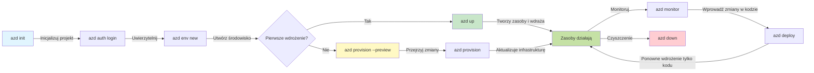
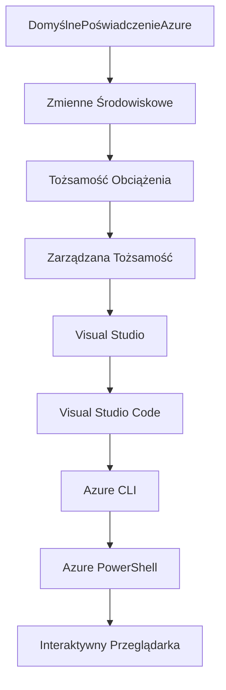

# AZD Podstawy - Zrozumienie Azure Developer CLI

# AZD Podstawy - Kluczowe Koncepcje i Podstawy

**Nawigacja Rozdziału:**
- **📚 Strona Główna Kursu**: [AZD dla Początkujących](../../README.md)
- **📖 Obecny Rozdział**: Rozdział 1 - Podstawy i Szybki Start
- **⬅️ Poprzedni**: [Przegląd Kursu](../../README.md#-chapter-1-foundation--quick-start)
- **➡️ Następny**: [Instalacja i Konfiguracja](installation.md)
- **🚀 Następny Rozdział**: [Rozdział 2: Rozwój z AI](../microsoft-foundry/microsoft-foundry-integration.md)

## Wprowadzenie

W tej lekcji poznasz Azure Developer CLI (azd), potężne narzędzie wiersza poleceń, które przyspiesza przejście od lokalnego rozwoju do wdrożenia w Azure. Dowiesz się o podstawowych koncepcjach, kluczowych funkcjach i zrozumiesz, jak azd upraszcza wdrażanie aplikacji natywnych dla chmury.

## Cele Nauki

Pod koniec tej lekcji będziesz:
- Rozumieć, czym jest Azure Developer CLI i jego główny cel
- Poznać podstawowe koncepcje szablonów, środowisk i usług
- Zbadać kluczowe funkcje, takie jak rozwój oparty na szablonach i Infrastructure as Code
- Zrozumieć strukturę projektu azd i przepływ pracy
- Przygotowany do instalacji i konfiguracji azd w swoim środowisku deweloperskim

## Efekty Nauki

Po ukończeniu tej lekcji będziesz w stanie:
- Wyjaśnić rolę azd w nowoczesnych przepływach pracy związanych z rozwojem w chmurze
- Zidentyfikować komponenty struktury projektu azd
- Opisać, jak szablony, środowiska i usługi współpracują ze sobą
- Zrozumieć korzyści z Infrastructure as Code z azd
- Rozpoznać różne polecenia azd i ich zastosowania

## Co to jest Azure Developer CLI (azd)?

Azure Developer CLI (azd) to narzędzie wiersza poleceń zaprojektowane, aby przyspieszyć przejście od lokalnego rozwoju do wdrożenia w Azure. Upraszcza proces budowy, wdrażania i zarządzania aplikacjami natywnymi dla chmury w Azure.

### 🎯 Dlaczego warto używać AZD? Porównanie z rzeczywistością

Porównajmy wdrożenie prostej aplikacji webowej z bazą danych:

#### ❌ BEZ AZD: Ręczne wdrożenie w Azure (30+ minut)

```bash
# Krok 1: Utwórz grupę zasobów
az group create --name myapp-rg --location eastus

# Krok 2: Utwórz plan usługi App Service
az appservice plan create --name myapp-plan \
  --resource-group myapp-rg \
  --sku B1 --is-linux

# Krok 3: Utwórz aplikację internetową
az webapp create --name myapp-web-unique123 \
  --resource-group myapp-rg \
  --plan myapp-plan \
  --runtime "NODE:18-lts"

# Krok 4: Utwórz konto Cosmos DB (10-15 minut)
az cosmosdb create --name myapp-cosmos-unique123 \
  --resource-group myapp-rg \
  --kind MongoDB

# Krok 5: Utwórz bazę danych
az cosmosdb mongodb database create \
  --account-name myapp-cosmos-unique123 \
  --resource-group myapp-rg \
  --name tododb

# Krok 6: Utwórz kolekcję
az cosmosdb mongodb collection create \
  --account-name myapp-cosmos-unique123 \
  --resource-group myapp-rg \
  --database-name tododb \
  --name todos

# Krok 7: Pobierz ciąg połączenia
CONN_STR=$(az cosmosdb keys list \
  --name myapp-cosmos-unique123 \
  --resource-group myapp-rg \
  --type connection-strings \
  --query "connectionStrings[0].connectionString" -o tsv)

# Krok 8: Skonfiguruj ustawienia aplikacji
az webapp config appsettings set \
  --name myapp-web-unique123 \
  --resource-group myapp-rg \
  --settings MONGODB_URI="$CONN_STR"

# Krok 9: Włącz logowanie
az webapp log config --name myapp-web-unique123 \
  --resource-group myapp-rg \
  --application-logging filesystem \
  --detailed-error-messages true

# Krok 10: Skonfiguruj Application Insights
az monitor app-insights component create \
  --app myapp-insights \
  --location eastus \
  --resource-group myapp-rg

# Krok 11: Połącz App Insights z aplikacją internetową
INSTRUMENTATION_KEY=$(az monitor app-insights component show \
  --app myapp-insights \
  --resource-group myapp-rg \
  --query "instrumentationKey" -o tsv)

az webapp config appsettings set \
  --name myapp-web-unique123 \
  --resource-group myapp-rg \
  --settings APPINSIGHTS_INSTRUMENTATIONKEY="$INSTRUMENTATION_KEY"

# Krok 12: Zbuduj aplikację lokalnie
npm install
npm run build

# Krok 13: Utwórz pakiet wdrożeniowy
zip -r app.zip . -x "*.git*" "node_modules/*"

# Krok 14: Wdróż aplikację
az webapp deployment source config-zip \
  --resource-group myapp-rg \
  --name myapp-web-unique123 \
  --src app.zip

# Krok 15: Czekaj i módl się, żeby działało 🙏
# (Brak automatycznej walidacji, wymaga testowania manualnego)
```

**Problemy:**
- ❌ 15+ poleceń do zapamiętania i wykonania w odpowiedniej kolejności
- ❌ 30-45 minut ręcznej pracy
- ❌ Łatwo o błędy (literówki, złe parametry)
- ❌ Łańcuchy połączeń widoczne w historii terminala
- ❌ Brak automatycznego wycofania w przypadku niepowodzenia
- ❌ Trudne do odtworzenia dla członków zespołu
- ❌ Za każdym razem inne (brak powtarzalności)

#### ✅ Z AZD: Automatyczne wdrożenie (5 poleceń, 10-15 minut)

```bash
# Krok 1: Zainicjuj z szablonu
azd init --template todo-nodejs-mongo

# Krok 2: Uwierzytelnij
azd auth login

# Krok 3: Utwórz środowisko
azd env new dev

# Krok 4: Podgląd zmian (opcjonalne, ale zalecane)
azd provision --preview

# Krok 5: Wdróż wszystko
azd up

# ✨ Gotowe! Wszystko zostało wdrożone, skonfigurowane i monitorowane
```

**Korzyści:**
- ✅ **5 poleceń** zamiast 15+ ręcznych kroków
- ✅ **10-15 minut** całkowitego czasu (głównie oczekiwanie na Azure)
- ✅ **Zero błędów** - automatyzacja i testy
- ✅ **Bezpieczne zarządzanie sekretami** dzięki Key Vault
- ✅ **Automatyczne wycofanie** w przypadku niepowodzenia
- ✅ **Całkowita powtarzalność** - ten sam wynik za każdym razem
- ✅ **Gotowe dla zespołu** - każdy może wdrożyć za pomocą tych samych poleceń
- ✅ **Infrastructure as Code** - wersjonowane szablony Bicep
- ✅ **Wbudowany monitoring** - automatyczna konfiguracja Application Insights

### 📊 Redukcja czasu i błędów

| Metryka | Ręczne wdrożenie | Wdrożenie z AZD | Poprawa |
|:-------|:------------------|:---------------|:------------|
| **Polecenia** | 15+ | 5 | 67% mniej |
| **Czas** | 30-45 min | 10-15 min | 60% szybciej |
| **Wskaźnik błędów** | ~40% | <5% | 88% redukcji |
| **Powtarzalność** | Niska (ręczna) | 100% (automatyczna) | Perfekcyjna |
| **Onboarding zespołu** | 2-4 godziny | 30 minut | 75% szybciej |
| **Czas wycofania** | 30+ min (ręczne) | 2 min (automatyczne) | 93% szybciej |

## Kluczowe Koncepcje

### Szablony
Szablony są podstawą azd. Zawierają:
- **Kod aplikacji** - Twój kod źródłowy i zależności
- **Definicje infrastruktury** - Zasoby Azure zdefiniowane w Bicep lub Terraform
- **Pliki konfiguracyjne** - Ustawienia i zmienne środowiskowe
- **Skrypty wdrożeniowe** - Zautomatyzowane przepływy wdrożeniowe

### Środowiska
Środowiska reprezentują różne cele wdrożeniowe:
- **Rozwój** - Do testowania i rozwoju
- **Staging** - Środowisko przedprodukcyjne
- **Produkcja** - Środowisko produkcyjne

Każde środowisko utrzymuje własne:
- Grupę zasobów Azure
- Ustawienia konfiguracyjne
- Stan wdrożenia

### Usługi
Usługi są elementami składowymi Twojej aplikacji:
- **Frontend** - Aplikacje webowe, SPA
- **Backend** - API, mikrousługi
- **Baza danych** - Rozwiązania do przechowywania danych
- **Przechowywanie** - Przechowywanie plików i blobów

## Kluczowe Funkcje

### 1. Rozwój oparty na szablonach
```bash
# Przeglądaj dostępne szablony
azd template list

# Zainicjuj z szablonu
azd init --template <template-name>
```

### 2. Infrastructure as Code
- **Bicep** - Specyficzny dla Azure język
- **Terraform** - Narzędzie do infrastruktury wielochmurowej
- **ARM Templates** - Szablony Azure Resource Manager

### 3. Zintegrowane Przepływy
```bash
# Ukończ przepływ pracy wdrożenia
azd up            # Przygotowanie + Wdrożenie, to jest bezobsługowe przy pierwszej konfiguracji

# 🧪 NOWE: Podgląd zmian infrastruktury przed wdrożeniem (BEZPIECZNE)
azd provision --preview    # Symuluj wdrożenie infrastruktury bez wprowadzania zmian

azd provision     # Utwórz zasoby Azure, jeśli zaktualizujesz infrastrukturę, użyj tego
azd deploy        # Wdróż kod aplikacji lub ponownie wdróż kod aplikacji po aktualizacji
azd down          # Wyczyść zasoby
```

#### 🛡️ Bezpieczne planowanie infrastruktury z Preview
Polecenie `azd provision --preview` to przełom w bezpiecznych wdrożeniach:
- **Analiza na sucho** - Pokazuje, co zostanie utworzone, zmodyfikowane lub usunięte
- **Zero ryzyka** - Żadne rzeczywiste zmiany nie są wprowadzane w środowisku Azure
- **Współpraca zespołowa** - Udostępnij wyniki preview przed wdrożeniem
- **Szacowanie kosztów** - Zrozum koszty zasobów przed zobowiązaniem

```bash
# Przykładowy przepływ pracy podglądu
azd provision --preview           # Zobacz, co się zmieni
# Przejrzyj wynik, omów z zespołem
azd provision                     # Wprowadź zmiany z pewnością
```

### 📊 Wizualizacja: Przepływ Rozwoju AZD


**Wyjaśnienie Przepływu:**
1. **Init** - Rozpocznij od szablonu lub nowego projektu
2. **Auth** - Uwierzytelnij się w Azure
3. **Środowisko** - Utwórz izolowane środowisko wdrożeniowe
4. **Preview** - 🆕 Zawsze najpierw podglądaj zmiany infrastruktury (bezpieczna praktyka)
5. **Provision** - Utwórz/zaktualizuj zasoby Azure
6. **Deploy** - Wdróż kod aplikacji
7. **Monitor** - Obserwuj wydajność aplikacji
8. **Iterate** - Wprowadzaj zmiany i ponownie wdrażaj kod
9. **Cleanup** - Usuń zasoby po zakończeniu

### 4. Zarządzanie Środowiskami
```bash
# Twórz i zarządzaj środowiskami
azd env new <environment-name>
azd env select <environment-name>
azd env list
```

## 📁 Struktura Projektu

Typowa struktura projektu azd:
```
my-app/
├── .azd/                    # azd configuration
│   └── config.json
├── .azure/                  # Azure deployment artifacts
├── .devcontainer/          # Development container config
├── .github/workflows/      # GitHub Actions
├── .vscode/               # VS Code settings
├── infra/                 # Infrastructure code
│   ├── main.bicep        # Main infrastructure template
│   ├── main.parameters.json
│   └── modules/          # Reusable modules
├── src/                  # Application source code
│   ├── api/             # Backend services
│   └── web/             # Frontend application
├── azure.yaml           # azd project configuration
└── README.md
```

## 🔧 Pliki Konfiguracyjne

### azure.yaml
Główny plik konfiguracyjny projektu:
```yaml
name: my-awesome-app
metadata:
  template: my-template@1.0.0

services:
  web:
    project: ./src/web
    language: js
    host: appservice
  api:
    project: ./src/api
    language: js
    host: appservice

hooks:
  preprovision:
    shell: pwsh
    run: echo "Preparing to provision..."
```

### .azure/config.json
Konfiguracja specyficzna dla środowiska:
```json
{
  "version": 1,
  "defaultEnvironment": "dev",
  "environments": {
    "dev": {
      "subscriptionId": "your-subscription-id",
      "location": "eastus"
    }
  }
}
```

## 🎪 Typowe Przepływy Pracy z Ćwiczeniami Praktycznymi

> **💡 Wskazówka Edukacyjna:** Wykonuj te ćwiczenia w kolejności, aby stopniowo budować swoje umiejętności AZD.

### 🎯 Ćwiczenie 1: Zainicjuj Swój Pierwszy Projekt

**Cel:** Utwórz projekt AZD i zbadaj jego strukturę

**Kroki:**
```bash
# Użyj sprawdzonego szablonu
azd init --template todo-nodejs-mongo

# Przeglądaj wygenerowane pliki
ls -la  # Wyświetl wszystkie pliki, w tym ukryte

# Utworzone kluczowe pliki:
# - azure.yaml (główna konfiguracja)
# - infra/ (kod infrastruktury)
# - src/ (kod aplikacji)
```

**✅ Sukces:** Masz katalogi azure.yaml, infra/ i src/

---

### 🎯 Ćwiczenie 2: Wdróż do Azure

**Cel:** Wykonaj pełne wdrożenie od początku do końca

**Kroki:**
```bash
# 1. Uwierzytelnij się
az login && azd auth login

# 2. Utwórz środowisko
azd env new dev
azd env set AZURE_LOCATION eastus

# 3. Podgląd zmian (ZALECANE)
azd provision --preview

# 4. Wdróż wszystko
azd up

# 5. Zweryfikuj wdrożenie
azd show    # Zobacz URL swojej aplikacji
```

**Oczekiwany Czas:** 10-15 minut  
**✅ Sukces:** URL aplikacji otwiera się w przeglądarce

---

### 🎯 Ćwiczenie 3: Wiele Środowisk

**Cel:** Wdróż do dev i staging

**Kroki:**
```bash
# Już mamy dev, utwórz staging
azd env new staging
azd env set AZURE_LOCATION westus2
azd up

# Przełączaj się między nimi
azd env list
azd env select dev
```

**✅ Sukces:** Dwie oddzielne grupy zasobów w Azure Portal

---

### 🛡️ Czysty Start: `azd down --force --purge`

Kiedy potrzebujesz całkowitego resetu:

```bash
azd down --force --purge
```

**Co robi:**
- `--force`: Brak potwierdzeń
- `--purge`: Usuwa cały lokalny stan i zasoby Azure

**Użyj, gdy:**
- Wdrożenie nie powiodło się w połowie
- Zmieniasz projekty
- Potrzebujesz świeżego startu

---

## 🎪 Oryginalny Przepływ Pracy Referencyjny

### Rozpoczęcie Nowego Projektu
```bash
# Metoda 1: Użyj istniejącego szablonu
azd init --template todo-nodejs-mongo

# Metoda 2: Zacznij od zera
azd init

# Metoda 3: Użyj bieżącego katalogu
azd init .
```

### Cykl Rozwoju
```bash
# Skonfiguruj środowisko deweloperskie
azd auth login
azd env new dev
azd env select dev

# Wdróż wszystko
azd up

# Wprowadź zmiany i ponownie wdroż
azd deploy

# Posprzątaj po zakończeniu
azd down --force --purge # polecenie w Azure Developer CLI to **twardy reset** dla twojego środowiska—szczególnie przydatne podczas rozwiązywania problemów z nieudanymi wdrożeniami, czyszczenia osieroconych zasobów lub przygotowywania do nowego wdrożenia.
```

## Zrozumienie `azd down --force --purge`
Polecenie `azd down --force --purge` to potężny sposób na całkowite usunięcie środowiska azd i wszystkich powiązanych zasobów. Oto szczegóły, co robi każda flaga:
```
--force
```
- Pomija potwierdzenia.
- Przydatne w automatyzacji lub skryptach, gdzie ręczne wejście nie jest możliwe.
- Zapewnia, że proces usuwania przebiega bez przerw, nawet jeśli CLI wykryje niespójności.

```
--purge
```
Usuwa **wszystkie powiązane metadane**, w tym:
Stan środowiska
Lokalny folder `.azure`
Zbuforowane informacje o wdrożeniu
Zapobiega "zapamiętywaniu" przez azd poprzednich wdrożeń, co może powodować problemy, takie jak niedopasowane grupy zasobów lub przestarzałe odniesienia do rejestru.


### Dlaczego używać obu?
Kiedy napotkasz problemy z `azd up` z powodu pozostałego stanu lub częściowych wdrożeń, ta kombinacja zapewnia **czysty start**.

Jest szczególnie pomocna po ręcznym usunięciu zasobów w Azure Portal lub podczas zmiany szablonów, środowisk lub konwencji nazewnictwa grup zasobów.


### Zarządzanie Wieloma Środowiskami
```bash
# Utwórz środowisko stagingowe
azd env new staging
azd env select staging
azd up

# Przełącz z powrotem na dev
azd env select dev

# Porównaj środowiska
azd env list
```

## 🔐 Uwierzytelnianie i Poświadczenia

Zrozumienie uwierzytelniania jest kluczowe dla udanych wdrożeń azd. Azure używa wielu metod uwierzytelniania, a azd korzysta z tego samego łańcucha poświadczeń, co inne narzędzia Azure.

### Uwierzytelnianie Azure CLI (`az login`)

Przed użyciem azd musisz uwierzytelnić się w Azure. Najczęstszą metodą jest użycie Azure CLI:

```bash
# Interaktywne logowanie (otwiera przeglądarkę)
az login

# Logowanie z określonym dzierżawcą
az login --tenant <tenant-id>

# Logowanie za pomocą głównego użytkownika usługi
az login --service-principal -u <app-id> -p <password> --tenant <tenant-id>

# Sprawdź bieżący status logowania
az account show

# Wyświetl dostępne subskrypcje
az account list --output table

# Ustaw domyślną subskrypcję
az account set --subscription <subscription-id>
```

### Przepływ Uwierzytelniania
1. **Interaktywne Logowanie**: Otwiera domyślną przeglądarkę w celu uwierzytelnienia
2. **Przepływ Kodów Urządzeń**: Dla środowisk bez dostępu do przeglądarki
3. **Service Principal**: Dla automatyzacji i scenariuszy CI/CD
4. **Managed Identity**: Dla aplikacji hostowanych w Azure

### Łańcuch DefaultAzureCredential

`DefaultAzureCredential` to typ poświadczenia, który zapewnia uproszczone doświadczenie uwierzytelniania, automatycznie próbując wielu źródeł poświadczeń w określonej kolejności:

#### Kolejność Łańcucha Poświadczeń

#### 1. Zmienne Środowiskowe
```bash
# Ustaw zmienne środowiskowe dla głównego użytkownika usługi
export AZURE_CLIENT_ID="<app-id>"
export AZURE_CLIENT_SECRET="<password>"
export AZURE_TENANT_ID="<tenant-id>"
```

#### 2. Workload Identity (Kubernetes/GitHub Actions)
Używane automatycznie w:
- Azure Kubernetes Service (AKS) z Workload Identity
- GitHub Actions z federacją OIDC
- Inne scenariusze federacji tożsamości

#### 3. Managed Identity
Dla zasobów Azure takich jak:
- Maszyny Wirtualne
- App Service
- Azure Functions
- Container Instances

```bash
# Sprawdź, czy działa na zasobie Azure z zarządzaną tożsamością
az account show --query "user.type" --output tsv
# Zwraca: "servicePrincipal", jeśli używana jest zarządzana tożsamość
```

#### 4. Integracja z Narzędziami Deweloperskimi
- **Visual Studio**: Automatycznie używa zalogowanego konta
- **VS Code**: Używa poświadczeń rozszerzenia Azure Account
- **Azure CLI**: Używa poświadczeń `az login` (najczęstsze dla lokalnego rozwoju)

### Konfiguracja Uwierzytelniania AZD

```bash
# Metoda 1: Użyj Azure CLI (Zalecane do rozwoju)
az login
azd auth login  # Używa istniejących poświadczeń Azure CLI

# Metoda 2: Bezpośrednie uwierzytelnianie azd
azd auth login --use-device-code  # Dla środowisk bez interfejsu graficznego

# Metoda 3: Sprawdź status uwierzytelnienia
azd auth login --check-status

# Metoda 4: Wyloguj się i uwierzytelnij ponownie
azd auth logout
azd auth login
```

### Najlepsze Praktyki Uwierzytelniania

#### Dla Lokalnego Rozwoju
```bash
# 1. Zaloguj się za pomocą Azure CLI
az login

# 2. Zweryfikuj poprawną subskrypcję
az account show
az account set --subscription "Your Subscription Name"

# 3. Użyj azd z istniejącymi poświadczeniami
azd auth login
```

#### Dla Pipeline'ów CI/CD
```yaml
# GitHub Actions example
- name: Azure Login
  uses: azure/login@v1
  with:
    creds: ${{ secrets.AZURE_CREDENTIALS }}

- name: Deploy with azd
  run: |
    azd auth login --client-id ${{ secrets.AZURE_CLIENT_ID }} \
                    --client-secret ${{ secrets.AZURE_CLIENT_SECRET }} \
                    --tenant-id ${{ secrets.AZURE_TENANT_ID }}
    azd up --no-prompt
```

#### Dla Środowisk Produkcyjnych
- Używaj **Managed Identity** podczas pracy na zasobach Azure
- Używaj **Service Principal** dla scenariuszy automatyzacji
- Unikaj przechowywania poświadczeń w kodzie lub plikach konfiguracyjnych
- Używaj **Azure Key Vault** dla wrażliwej konfiguracji

### Typowe Problemy z Uwierzytelnianiem i Rozwiązania

#### Problem: "Nie znaleziono subskrypcji"
```bash
# Rozwiązanie: Ustaw domyślną subskrypcję
az account list --output table
az account set --subscription "<subscription-id>"
azd env set AZURE_SUBSCRIPTION_ID "<subscription-id>"
```

#### Problem: "Brak wystarczających uprawnień"
```bash
# Rozwiązanie: Sprawdź i przypisz wymagane role
az role assignment list --assignee $(az account show --query user.name --output tsv)

# Wspólne wymagane role:
# - Współtwórca (do zarządzania zasobami)
# - Administrator dostępu użytkownika (do przypisywania ról)
```

#### Problem: "Token wygasł"
```bash
# Rozwiązanie: Ponowna autoryzacja
az logout
az login
azd auth logout
azd auth login
```

### Uwierzytelnianie w Różnych Scenariuszach

#### Lokalny Rozwój
```bash
# Konto rozwoju osobistego
az login
azd auth login
```

#### Rozwój Zespołowy
```bash
# Użyj konkretnego najemcy dla organizacji
az login --tenant contoso.onmicrosoft.com
azd auth login
```

#### Scenariusze Multi-tenant
```bash
# Przełącz między najemcami
az login --tenant tenant1.onmicrosoft.com
# Wdróż do najemcy 1
azd up

az login --tenant tenant2.onmicrosoft.com  
# Wdróż do najemcy 2
azd up
```

### Rozważania Bezpieczeństwa

1. **Przechowywanie Poświadczeń**: Nigdy nie przechowuj poświadczeń w kodzie źródłowym
2. **Ograniczenie Zakresu**: Używaj zasady najmniejszych uprawnień dla Service Principal
3. **Rotacja Tokenów**: Regularnie rotuj sekrety Service Principal
4. **Ślad Audytu**: Monitoruj aktywności uwierzytelniania i wdrożenia
5. **Bezpieczeństwo Sieci**: Używaj prywatnych punktów końcowych, gdy to możliwe

### Rozwiązywanie Problemów z Uwierzytelnianiem

```bash
# Debugowanie problemów z uwierzytelnianiem
azd auth login --check-status
az account show
az account get-access-token

# Typowe polecenia diagnostyczne
whoami                          # Bieżący kontekst użytkownika
az ad signed-in-user show      # Szczegóły użytkownika Azure AD
az group list                  # Testowanie dostępu do zasobów
```

## Zrozumienie `azd down --force --purge`

### Odkrywanie
```bash
azd template list              # Przeglądaj szablony
azd template show <template>   # Szczegóły szablonu
azd init --help               # Opcje inicjalizacji
```

### Zarządzanie Projektem
```bash
azd show                     # Przegląd projektu
azd env show                 # Obecne środowisko
azd config list             # Ustawienia konfiguracji
```

### Monitoring
```bash
azd monitor                  # Otwórz portal Azure
azd pipeline config          # Skonfiguruj CI/CD
azd logs                     # Wyświetl logi aplikacji
```

## Najlepsze Praktyki

### 1. Używaj Znaczących Nazw
```bash
# Dobry
azd env new production-east
azd init --template web-app-secure

# Unikaj
azd env new env1
azd init --template template1
```

### 2. Wykorzystuj Szablony
- Rozpocznij od istniejących szablonów
- Dostosuj do swoich potrzeb
- Twórz szablony wielokrotnego użytku dla swojej organizacji

### 3. Izolacja Środowisk
- Używaj oddzielnych środowisk dla dev/staging/prod
- Nigdy nie wdrażaj bezpośrednio do produkcji z lokalnej maszyny
- Używaj pipeline'ów CI/CD dla wdrożeń produkcyjnych

### 4. Zarządzanie Konfiguracją
- Używaj zmiennych środowiskowych dla wrażliwych danych
- Przechowuj konfigurację w
- [Instalacja i konfiguracja](installation.md) - Zainstaluj i skonfiguruj azd
- [Twój pierwszy projekt](first-project.md) - Kompletny praktyczny samouczek
- [Przewodnik konfiguracji](configuration.md) - Zaawansowane opcje konfiguracji

**🎯 Gotowy na kolejny rozdział?**
- [Rozdział 2: Rozwój oparty na AI](../microsoft-foundry/microsoft-foundry-integration.md) - Zacznij budować aplikacje AI

## Dodatkowe zasoby

- [Przegląd Azure Developer CLI](https://learn.microsoft.com/en-us/azure/developer/azure-developer-cli/)
- [Galeria szablonów](https://azure.github.io/awesome-azd/)
- [Przykłady społeczności](https://github.com/Azure-Samples)

---

## 🙋 Najczęściej zadawane pytania

### Pytania ogólne

**P: Jaka jest różnica między AZD a Azure CLI?**

O: Azure CLI (`az`) służy do zarządzania pojedynczymi zasobami Azure. AZD (`azd`) służy do zarządzania całymi aplikacjami:

```bash
# Azure CLI - Zarządzanie zasobami na niskim poziomie
az webapp create --name myapp --resource-group rg
az sql server create --name myserver --resource-group rg
# ...potrzebnych wiele więcej poleceń

# AZD - Zarządzanie na poziomie aplikacji
azd up  # Wdraża całą aplikację ze wszystkimi zasobami
```

**Pomyśl o tym w ten sposób:**
- `az` = Operowanie na pojedynczych klockach Lego
- `azd` = Praca z kompletnymi zestawami Lego

---

**P: Czy muszę znać Bicep lub Terraform, aby korzystać z AZD?**

O: Nie! Zacznij od szablonów:
```bash
# Użyj istniejącego szablonu - nie jest wymagana wiedza o IaC
azd init --template todo-nodejs-mongo
azd up
```

Możesz później nauczyć się Bicep, aby dostosować infrastrukturę. Szablony dostarczają działające przykłady, z których można się uczyć.

---

**P: Ile kosztuje uruchomienie szablonów AZD?**

O: Koszty różnią się w zależności od szablonu. Większość szablonów deweloperskich kosztuje $50-150 miesięcznie:

```bash
# Przejrzyj koszty przed wdrożeniem
azd provision --preview

# Zawsze sprzątaj, gdy nie używasz
azd down --force --purge  # Usuwa wszystkie zasoby
```

**Porada:** Korzystaj z darmowych poziomów, gdzie to możliwe:
- App Service: Poziom F1 (darmowy)
- Azure OpenAI: 50,000 tokenów miesięcznie za darmo
- Cosmos DB: 1000 RU/s darmowy poziom

---

**P: Czy mogę używać AZD z istniejącymi zasobami Azure?**

O: Tak, ale łatwiej jest zacząć od nowa. AZD działa najlepiej, gdy zarządza pełnym cyklem życia. W przypadku istniejących zasobów:

```bash
# Opcja 1: Importuj istniejące zasoby (zaawansowane)
azd init
# Następnie zmodyfikuj infra/, aby odwoływało się do istniejących zasobów

# Opcja 2: Rozpocznij od nowa (zalecane)
azd init --template matching-your-stack
azd up  # Tworzy nowe środowisko
```

---

**P: Jak mogę udostępnić mój projekt współpracownikom?**

O: Zapisz projekt AZD w Git (ale NIE folder .azure):

```bash
# Już domyślnie w .gitignore
.azure/        # Zawiera sekrety i dane środowiskowe
*.env          # Zmienne środowiskowe

# Członkowie zespołu wtedy:
git clone <your-repo>
azd auth login
azd env new <their-name>-dev
azd up
```

Każdy otrzymuje identyczną infrastrukturę z tych samych szablonów.

---

### Pytania dotyczące rozwiązywania problemów

**P: "azd up" nie powiodło się w połowie. Co mam zrobić?**

O: Sprawdź błąd, napraw go, a następnie spróbuj ponownie:

```bash
# Wyświetl szczegółowe logi
azd show

# Typowe rozwiązania:

# 1. Jeśli przekroczono limit:
azd env set AZURE_LOCATION "westus2"  # Spróbuj inny region

# 2. Jeśli konflikt nazw zasobów:
azd down --force --purge  # Wyczyść wszystko
azd up  # Spróbuj ponownie

# 3. Jeśli autoryzacja wygasła:
az login
azd auth login
azd up
```

**Najczęstszy problem:** Wybrano niewłaściwą subskrypcję Azure
```bash
az account list --output table
az account set --subscription "<correct-subscription>"
```

---

**P: Jak wdrożyć tylko zmiany w kodzie bez ponownego provisioningu?**

O: Użyj `azd deploy` zamiast `azd up`:

```bash
azd up          # Pierwszy raz: przygotowanie + wdrożenie (wolno)

# Wprowadź zmiany w kodzie...

azd deploy      # Kolejne razy: tylko wdrożenie (szybko)
```

Porównanie szybkości:
- `azd up`: 10-15 minut (provisioning infrastruktury)
- `azd deploy`: 2-5 minut (tylko kod)

---

**P: Czy mogę dostosować szablony infrastruktury?**

O: Tak! Edytuj pliki Bicep w `infra/`:

```bash
# Po azd init
cd infra/
code main.bicep  # Edytuj w VS Code

# Podgląd zmian
azd provision --preview

# Zastosuj zmiany
azd provision
```

**Porada:** Zacznij od małych zmian - zmień najpierw SKUs:
```bicep
// infra/main.bicep
sku: {
  name: 'B1'  // Change to 'P1V2' for production
}
```

---

**P: Jak usunąć wszystko, co stworzył AZD?**

O: Jedno polecenie usuwa wszystkie zasoby:

```bash
azd down --force --purge

# To usuwa:
# - Wszystkie zasoby Azure
# - Grupę zasobów
# - Stan lokalnego środowiska
# - Pamięć podręczną danych wdrożenia
```

**Zawsze uruchamiaj to, gdy:**
- Zakończysz testowanie szablonu
- Przełączasz się na inny projekt
- Chcesz zacząć od nowa

**Oszczędności:** Usunięcie nieużywanych zasobów = brak opłat

---

**P: Co jeśli przypadkowo usunąłem zasoby w Azure Portal?**

O: Stan AZD może się rozjechać. Podejście "czysta karta":

```bash
# 1. Usuń stan lokalny
azd down --force --purge

# 2. Zacznij od nowa
azd up

# Alternatywa: Pozwól AZD wykryć i naprawić
azd provision  # Utworzy brakujące zasoby
```

---

### Pytania zaawansowane

**P: Czy mogę używać AZD w pipeline'ach CI/CD?**

O: Tak! Przykład GitHub Actions:

```yaml
# .github/workflows/deploy.yml
name: Deploy with AZD

on:
  push:
    branches: [main]

jobs:
  deploy:
    runs-on: ubuntu-latest
    steps:
      - uses: actions/checkout@v2
      
      - name: Install azd
        run: curl -fsSL https://aka.ms/install-azd.sh | bash
      
      - name: Azure Login
        run: |
          azd auth login \
            --client-id ${{ secrets.AZURE_CLIENT_ID }} \
            --client-secret ${{ secrets.AZURE_CLIENT_SECRET }} \
            --tenant-id ${{ secrets.AZURE_TENANT_ID }}
      
      - name: Deploy
        run: azd up --no-prompt
```

---

**P: Jak obsługiwać tajne dane i wrażliwe informacje?**

O: AZD automatycznie integruje się z Azure Key Vault:

```bash
# Sekrety są przechowywane w Key Vault, a nie w kodzie
azd env set DATABASE_PASSWORD "$(openssl rand -base64 32)"

# AZD automatycznie:
# 1. Tworzy Key Vault
# 2. Przechowuje sekret
# 3. Przyznaje aplikacji dostęp za pomocą Managed Identity
# 4. Wstrzykuje podczas działania
```

**Nigdy nie zapisuj:**
- Folderu `.azure` (zawiera dane środowiska)
- Plików `.env` (lokalne tajne dane)
- Ciągów połączeń

---

**P: Czy mogę wdrażać do wielu regionów?**

O: Tak, utwórz środowisko dla każdego regionu:

```bash
# Środowisko Wschodniego USA
azd env new prod-eastus
azd env set AZURE_LOCATION eastus
azd up

# Środowisko Zachodniej Europy
azd env new prod-westeurope
azd env set AZURE_LOCATION westeurope
azd up

# Każde środowisko jest niezależne
azd env list
```

W przypadku prawdziwych aplikacji wieloregionalnych dostosuj szablony Bicep, aby wdrażać jednocześnie w wielu regionach.

---

**P: Gdzie mogę uzyskać pomoc, jeśli utknę?**

1. **Dokumentacja AZD:** https://learn.microsoft.com/azure/developer/azure-developer-cli/
2. **Problemy na GitHub:** https://github.com/Azure/azure-dev/issues
3. **Discord:** [Azure Discord](https://discord.gg/microsoft-azure) - kanał #azure-developer-cli
4. **Stack Overflow:** Tag `azure-developer-cli`
5. **Ten kurs:** [Przewodnik rozwiązywania problemów](../troubleshooting/common-issues.md)

**Porada:** Przed zadaniem pytania uruchom:
```bash
azd show       # Pokazuje aktualny stan
azd version    # Pokazuje twoją wersję
```
Dołącz te informacje do pytania, aby uzyskać szybszą pomoc.

---

## 🎓 Co dalej?

Teraz rozumiesz podstawy AZD. Wybierz swoją ścieżkę:

### 🎯 Dla początkujących:
1. **Następnie:** [Instalacja i konfiguracja](installation.md) - Zainstaluj AZD na swoim komputerze
2. **Potem:** [Twój pierwszy projekt](first-project.md) - Wdróż swoją pierwszą aplikację
3. **Ćwicz:** Ukończ wszystkie 3 ćwiczenia w tej lekcji

### 🚀 Dla deweloperów AI:
1. **Przejdź do:** [Rozdział 2: Rozwój oparty na AI](../microsoft-foundry/microsoft-foundry-integration.md)
2. **Wdróż:** Zacznij od `azd init --template get-started-with-ai-chat`
3. **Ucz się:** Buduj podczas wdrażania

### 🏗️ Dla doświadczonych deweloperów:
1. **Przejrzyj:** [Przewodnik konfiguracji](configuration.md) - Zaawansowane ustawienia
2. **Eksploruj:** [Infrastruktura jako kod](../deployment/provisioning.md) - Głębsze spojrzenie na Bicep
3. **Buduj:** Twórz własne szablony dla swojego stacka

---

**Nawigacja po rozdziałach:**
- **📚 Strona główna kursu**: [AZD dla początkujących](../../README.md)
- **📖 Obecny rozdział**: Rozdział 1 - Podstawy i szybki start  
- **⬅️ Poprzedni**: [Przegląd kursu](../../README.md#-chapter-1-foundation--quick-start)
- **➡️ Następny**: [Instalacja i konfiguracja](installation.md)
- **🚀 Następny rozdział**: [Rozdział 2: Rozwój oparty na AI](../microsoft-foundry/microsoft-foundry-integration.md)

---

<!-- CO-OP TRANSLATOR DISCLAIMER START -->
**Zastrzeżenie**:  
Ten dokument został przetłumaczony za pomocą usługi tłumaczenia AI [Co-op Translator](https://github.com/Azure/co-op-translator). Chociaż staramy się zapewnić dokładność, prosimy mieć na uwadze, że automatyczne tłumaczenia mogą zawierać błędy lub nieścisłości. Oryginalny dokument w jego rodzimym języku powinien być uznawany za wiarygodne źródło. W przypadku informacji krytycznych zaleca się skorzystanie z profesjonalnego tłumaczenia przez człowieka. Nie ponosimy odpowiedzialności za jakiekolwiek nieporozumienia lub błędne interpretacje wynikające z użycia tego tłumaczenia.
<!-- CO-OP TRANSLATOR DISCLAIMER END -->