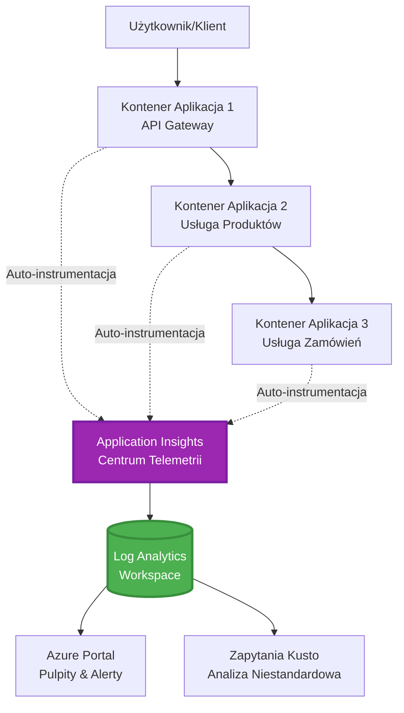
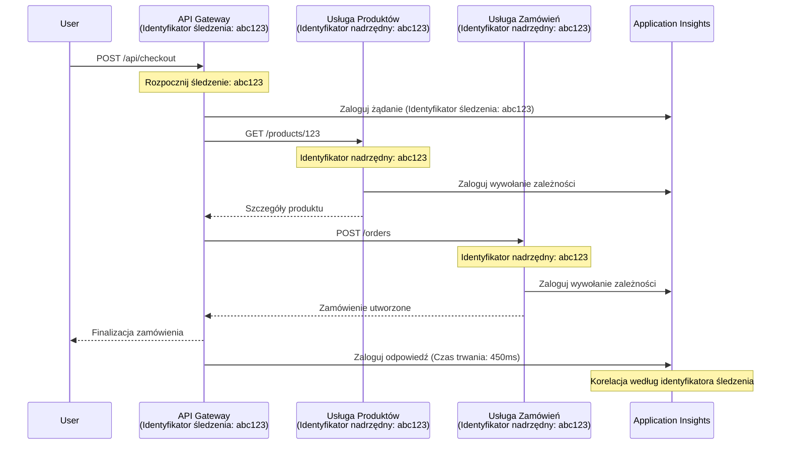

<!--
CO_OP_TRANSLATOR_METADATA:
{
  "original_hash": "e5aa37cdb6378c09099500ac31600b8c",
  "translation_date": "2025-11-20T02:38:06+00:00",
  "source_file": "docs/pre-deployment/application-insights.md",
  "language_code": "pl"
}
-->
# Integracja Application Insights z AZD

⏱️ **Szacowany czas**: 40-50 minut | 💰 **Koszt**: ~5-15 USD/miesiąc | ⭐ **Poziom trudności**: Średni

**📚 Ścieżka nauki:**
- ← Poprzedni: [Preflight Checks](preflight-checks.md) - Walidacja przed wdrożeniem
- 🎯 **Tu jesteś**: Integracja Application Insights (monitorowanie, telemetria, debugowanie)
- → Następny: [Deployment Guide](../deployment/deployment-guide.md) - Wdrożenie do Azure
- 🏠 [Strona główna kursu](../../README.md)

---

## Czego się nauczysz

Po ukończeniu tej lekcji:
- Zintegrujesz **Application Insights** z projektami AZD automatycznie
- Skonfigurujesz **śledzenie rozproszone** dla mikrousług
- Wdrożysz **niestandardową telemetrię** (metryki, zdarzenia, zależności)
- Ustawisz **metryki na żywo** do monitorowania w czasie rzeczywistym
- Stworzysz **alerty i pulpity** z wdrożeń AZD
- Zdebugujesz problemy produkcyjne za pomocą **zapytania telemetrii**
- Zoptymalizujesz **koszty i strategie próbkowania**
- Będziesz monitorować **aplikacje AI/LLM** (tokeny, opóźnienia, koszty)

## Dlaczego Application Insights z AZD jest ważne

### Wyzwanie: Obserwowalność w produkcji

**Bez Application Insights:**
```
❌ No visibility into production behavior
❌ Manual log aggregation across services
❌ Reactive debugging (wait for customer complaints)
❌ No performance metrics
❌ Cannot trace requests across services
❌ Unknown failure rates and bottlenecks
```

**Z Application Insights + AZD:**
```
✅ Automatic telemetry collection
✅ Centralized logs from all services
✅ Proactive issue detection
✅ End-to-end request tracing
✅ Performance metrics and insights
✅ Real-time dashboards
✅ AZD provisions everything automatically
```

**Analogicznie**: Application Insights to jak "czarna skrzynka" i kokpit dla Twojej aplikacji. Widzisz wszystko, co się dzieje w czasie rzeczywistym i możesz odtworzyć każdy incydent.

---

## Przegląd architektury

### Application Insights w architekturze AZD


### Co jest monitorowane automatycznie

| Typ telemetrii | Co rejestruje | Zastosowanie |
|----------------|---------------|--------------|
| **Żądania** | Żądania HTTP, kody statusu, czas trwania | Monitorowanie wydajności API |
| **Zależności** | Zewnętrzne wywołania (DB, API, magazyn) | Identyfikacja wąskich gardeł |
| **Wyjątki** | Nieobsługiwane błędy ze stosami wywołań | Debugowanie awarii |
| **Zdarzenia niestandardowe** | Zdarzenia biznesowe (rejestracja, zakup) | Analiza i lejki |
| **Metryki** | Liczniki wydajności, metryki niestandardowe | Planowanie pojemności |
| **Ślady** | Wiadomości logów z poziomem ważności | Debugowanie i audyt |
| **Dostępność** | Testy czasu działania i odpowiedzi | Monitorowanie SLA |

---

## Wymagania wstępne

### Wymagane narzędzia

```bash
# Zweryfikuj Azure Developer CLI
azd version
# ✅ Oczekiwane: azd wersja 1.0.0 lub wyższa

# Zweryfikuj Azure CLI
az --version
# ✅ Oczekiwane: azure-cli 2.50.0 lub wyższa
```

### Wymagania Azure

- Aktywna subskrypcja Azure
- Uprawnienia do tworzenia:
  - Zasobów Application Insights
  - Obszarów roboczych Log Analytics
  - Aplikacji kontenerowych
  - Grup zasobów

### Wymagana wiedza

Powinieneś ukończyć:
- [AZD Basics](../getting-started/azd-basics.md) - Podstawowe pojęcia AZD
- [Configuration](../getting-started/configuration.md) - Konfiguracja środowiska
- [First Project](../getting-started/first-project.md) - Podstawowe wdrożenie

---

## Lekcja 1: Automatyczne Application Insights z AZD

### Jak AZD tworzy Application Insights

AZD automatycznie tworzy i konfiguruje Application Insights podczas wdrożenia. Zobaczmy, jak to działa.

### Struktura projektu

```
monitored-app/
├── azure.yaml                     # AZD configuration
├── infra/
│   ├── main.bicep                # Main infrastructure
│   ├── core/
│   │   └── monitoring.bicep      # Application Insights + Log Analytics
│   └── app/
│       └── api.bicep             # Container App with monitoring
└── src/
    ├── app.py                    # Application with telemetry
    ├── requirements.txt
    └── Dockerfile
```

---

### Krok 1: Konfiguracja AZD (azure.yaml)

**Plik: `azure.yaml`**

```yaml
name: monitored-app
metadata:
  template: monitored-app@1.0.0

services:
  api:
    project: ./src
    language: python
    host: containerapp

# AZD automatically provisions monitoring!
```

**To wszystko!** AZD domyślnie utworzy Application Insights. Nie jest potrzebna dodatkowa konfiguracja dla podstawowego monitorowania.

---

### Krok 2: Infrastruktura monitorowania (Bicep)

**Plik: `infra/core/monitoring.bicep`**

```bicep
param logAnalyticsName string
param applicationInsightsName string
param location string = resourceGroup().location
param tags object = {}

// Log Analytics Workspace (required for Application Insights)
resource logAnalytics 'Microsoft.OperationalInsights/workspaces@2022-10-01' = {
  name: logAnalyticsName
  location: location
  tags: tags
  properties: {
    sku: {
      name: 'PerGB2018'  // Pay-as-you-go pricing
    }
    retentionInDays: 30  // Keep logs for 30 days
    features: {
      enableLogAccessUsingOnlyResourcePermissions: true
    }
  }
}

// Application Insights
resource applicationInsights 'Microsoft.Insights/components@2020-02-02' = {
  name: applicationInsightsName
  location: location
  tags: tags
  kind: 'web'
  properties: {
    Application_Type: 'web'
    WorkspaceResourceId: logAnalytics.id
    IngestionMode: 'LogAnalytics'
    publicNetworkAccessForIngestion: 'Enabled'
    publicNetworkAccessForQuery: 'Enabled'
  }
}

// Outputs for Container Apps
output logAnalyticsWorkspaceId string = logAnalytics.id
output logAnalyticsWorkspaceName string = logAnalytics.name
output applicationInsightsConnectionString string = applicationInsights.properties.ConnectionString
output applicationInsightsInstrumentationKey string = applicationInsights.properties.InstrumentationKey
output applicationInsightsName string = applicationInsights.name
```

---

### Krok 3: Połączenie aplikacji kontenerowej z Application Insights

**Plik: `infra/app/api.bicep`**

```bicep
param name string
param location string
param tags object = {}
param containerAppsEnvironmentName string
param applicationInsightsConnectionString string

resource containerApp 'Microsoft.App/containerApps@2023-05-01' = {
  name: name
  location: location
  tags: tags
  properties: {
    configuration: {
      ingress: {
        external: true
        targetPort: 8000
      }
      secrets: [
        {
          name: 'appinsights-connection-string'
          value: applicationInsightsConnectionString
        }
      ]
    }
    template: {
      containers: [
        {
          name: 'api'
          image: 'myregistry.azurecr.io/api:latest'
          resources: {
            cpu: json('0.5')
            memory: '1Gi'
          }
          env: [
            {
              name: 'APPLICATIONINSIGHTS_CONNECTION_STRING'
              secretRef: 'appinsights-connection-string'
            }
            {
              name: 'APPLICATIONINSIGHTS_ENABLED'
              value: 'true'
            }
          ]
        }
      ]
    }
  }
}

output uri string = 'https://${containerApp.properties.configuration.ingress.fqdn}'
```

---

### Krok 4: Kod aplikacji z telemetrią

**Plik: `src/app.py`**

```python
from flask import Flask, request, jsonify
from opencensus.ext.azure.log_exporter import AzureLogHandler
from opencensus.ext.azure.trace_exporter import AzureExporter
from opencensus.ext.flask.flask_middleware import FlaskMiddleware
from opencensus.trace.samplers import ProbabilitySampler
import logging
import os

app = Flask(__name__)

# Pobierz ciąg połączenia Application Insights
connection_string = os.environ.get('APPLICATIONINSIGHTS_CONNECTION_STRING')

if connection_string:
    # Skonfiguruj rozproszone śledzenie
    middleware = FlaskMiddleware(
        app,
        exporter=AzureExporter(connection_string=connection_string),
        sampler=ProbabilitySampler(rate=1.0)  # 100% próbkowanie dla środowiska deweloperskiego
    )
    
    # Skonfiguruj logowanie
    logger = logging.getLogger(__name__)
    logger.addHandler(AzureLogHandler(connection_string=connection_string))
    logger.setLevel(logging.INFO)
    
    print("✅ Application Insights enabled")
else:
    logger = logging.getLogger(__name__)
    logger.setLevel(logging.INFO)
    print("⚠️ Application Insights not configured")

@app.route('/health')
def health():
    logger.info('Health check endpoint called')
    return jsonify({'status': 'healthy', 'monitoring': 'enabled'})

@app.route('/api/products')
def get_products():
    logger.info('Fetching products')
    
    # Symuluj wywołanie bazy danych (automatycznie śledzone jako zależność)
    products = [
        {'id': 1, 'name': 'Laptop', 'price': 999.99},
        {'id': 2, 'name': 'Mouse', 'price': 29.99},
        {'id': 3, 'name': 'Keyboard', 'price': 79.99}
    ]
    
    logger.info(f'Returned {len(products)} products')
    return jsonify(products)

@app.route('/api/error-test')
def error_test():
    """Test error tracking"""
    logger.error('Testing error tracking')
    try:
        raise ValueError('This is a test exception')
    except Exception as e:
        logger.exception('Exception occurred in error-test endpoint')
        return jsonify({'error': str(e)}), 500

@app.route('/api/slow')
def slow_endpoint():
    """Test performance tracking"""
    import time
    logger.info('Slow endpoint called')
    time.sleep(3)  # Symuluj wolną operację
    logger.warning('Endpoint took 3 seconds to respond')
    return jsonify({'message': 'Slow operation completed'})

if __name__ == '__main__':
    app.run(host='0.0.0.0', port=8000)
```

**Plik: `src/requirements.txt`**

```txt
Flask==3.0.0
opencensus-ext-azure==1.1.13
opencensus-ext-flask==0.8.1
gunicorn==21.2.0
```

---

### Krok 5: Wdrożenie i weryfikacja

```bash
# Zainicjuj AZD
azd init

# Wdróż (automatycznie udostępnia Application Insights)
azd up

# Pobierz URL aplikacji
APP_URL=$(azd env get-values | grep API_URL | cut -d '=' -f2 | tr -d '"')

# Generuj telemetrię
curl $APP_URL/health
curl $APP_URL/api/products
curl $APP_URL/api/error-test
curl $APP_URL/api/slow
```

**✅ Oczekiwany wynik:**
```json
{
  "status": "healthy",
  "monitoring": "enabled"
}
```

---

### Krok 6: Przeglądanie telemetrii w Azure Portal

```bash
# Pobierz szczegóły Application Insights
azd env get-values | grep APPLICATIONINSIGHTS

# Otwórz w Azure Portal
az monitor app-insights component show \
  --app $(azd env get-values | grep APPLICATIONINSIGHTS_NAME | cut -d '=' -f2 | tr -d '"') \
  --resource-group $(azd env get-values | grep AZURE_RESOURCE_GROUP | cut -d '=' -f2 | tr -d '"') \
  --query "appId" -o tsv
```

**Przejdź do Azure Portal → Application Insights → Transaction Search**

Powinieneś zobaczyć:
- ✅ Żądania HTTP z kodami statusu
- ✅ Czas trwania żądań (3+ sekundy dla `/api/slow`)
- ✅ Szczegóły wyjątków z `/api/error-test`
- ✅ Niestandardowe wiadomości logów

---

## Lekcja 2: Telemetria niestandardowa i zdarzenia

### Śledzenie zdarzeń biznesowych

Dodajmy niestandardową telemetrię dla kluczowych zdarzeń biznesowych.

**Plik: `src/telemetry.py`**

```python
from opencensus.ext.azure import metrics_exporter
from opencensus.stats import aggregation as aggregation_module
from opencensus.stats import measure as measure_module
from opencensus.stats import stats as stats_module
from opencensus.stats import view as view_module
from opencensus.tags import tag_map as tag_map_module
from opencensus.ext.azure.log_exporter import AzureLogHandler
from opencensus.ext.azure.trace_exporter import AzureExporter
from opencensus.trace import tracer as tracer_module
import logging
import os

class TelemetryClient:
    """Custom telemetry client for Application Insights"""
    
    def __init__(self, connection_string=None):
        self.connection_string = connection_string or os.environ.get('APPLICATIONINSIGHTS_CONNECTION_STRING')
        
        if not self.connection_string:
            print("⚠️ Application Insights connection string not found")
            return
        
        # Konfiguracja loggera
        self.logger = logging.getLogger(__name__)
        self.logger.addHandler(AzureLogHandler(connection_string=self.connection_string))
        self.logger.setLevel(logging.INFO)
        
        # Konfiguracja eksportera metryk
        self.stats = stats_module.stats
        self.view_manager = self.stats.view_manager
        self.stats_recorder = self.stats.stats_recorder
        
        exporter = metrics_exporter.new_metrics_exporter(
            connection_string=self.connection_string
        )
        self.view_manager.register_exporter(exporter)
        
        # Konfiguracja trasera
        self.tracer = tracer_module.Tracer(
            exporter=AzureExporter(connection_string=self.connection_string)
        )
        
        print("✅ Custom telemetry client initialized")
    
    def track_event(self, event_name: str, properties: dict = None):
        """Track custom business event"""
        properties = properties or {}
        self.logger.info(
            f"CustomEvent: {event_name}",
            extra={
                'custom_dimensions': {
                    'event_name': event_name,
                    **properties
                }
            }
        )
    
    def track_metric(self, metric_name: str, value: float, properties: dict = None):
        """Track custom metric"""
        properties = properties or {}
        self.logger.info(
            f"CustomMetric: {metric_name} = {value}",
            extra={
                'custom_dimensions': {
                    'metric_name': metric_name,
                    'value': value,
                    **properties
                }
            }
        )
    
    def track_dependency(self, name: str, dependency_type: str, duration: float, success: bool):
        """Track external dependency call"""
        with self.tracer.span(name=name) as span:
            span.add_attribute('dependency.type', dependency_type)
            span.add_attribute('duration', duration)
            span.add_attribute('success', success)

# Globalny klient telemetrii
telemetry = TelemetryClient()
```

### Aktualizacja aplikacji o zdarzenia niestandardowe

**Plik: `src/app.py` (rozszerzony)**

```python
from flask import Flask, request, jsonify
from telemetry import telemetry
import time
import random

app = Flask(__name__)

@app.route('/api/purchase', methods=['POST'])
def purchase():
    """Track purchase event with custom telemetry"""
    data = request.json
    product_id = data.get('product_id')
    quantity = data.get('quantity', 1)
    price = data.get('price', 0)
    
    # Śledź wydarzenie biznesowe
    telemetry.track_event('Purchase', {
        'product_id': product_id,
        'quantity': quantity,
        'total_amount': price * quantity,
        'user_id': request.headers.get('X-User-Id', 'anonymous')
    })
    
    # Śledź metrykę przychodów
    telemetry.track_metric('Revenue', price * quantity, {
        'product_id': product_id,
        'currency': 'USD'
    })
    
    return jsonify({
        'order_id': f'ORD-{random.randint(1000, 9999)}',
        'status': 'confirmed',
        'total': price * quantity
    })

@app.route('/api/search')
def search():
    """Track search queries"""
    query = request.args.get('q', '')
    
    start_time = time.time()
    
    # Symuluj wyszukiwanie (byłoby to rzeczywiste zapytanie do bazy danych)
    results = [{'id': 1, 'name': f'Result for {query}'}]
    
    duration = (time.time() - start_time) * 1000  # Przekształć na ms
    
    # Śledź wydarzenie wyszukiwania
    telemetry.track_event('Search', {
        'query': query,
        'results_count': len(results),
        'duration_ms': duration
    })
    
    # Śledź metrykę wydajności wyszukiwania
    telemetry.track_metric('SearchDuration', duration, {
        'query_length': len(query)
    })
    
    return jsonify({'results': results, 'count': len(results)})

@app.route('/api/external-call')
def external_call():
    """Track external API dependency"""
    import requests
    
    start_time = time.time()
    success = True
    
    try:
        # Symuluj zewnętrzne wywołanie API
        response = requests.get('https://api.example.com/data', timeout=5)
        result = response.json()
    except Exception as e:
        success = False
        result = {'error': str(e)}
    
    duration = (time.time() - start_time) * 1000
    
    # Śledź zależność
    telemetry.track_dependency(
        name='ExternalAPI',
        dependency_type='HTTP',
        duration=duration,
        success=success
    )
    
    return jsonify(result)

if __name__ == '__main__':
    app.run(host='0.0.0.0', port=8000)
```

### Testowanie telemetrii niestandardowej

```bash
# Śledź zdarzenie zakupu
curl -X POST $APP_URL/api/purchase \
  -H "Content-Type: application/json" \
  -H "X-User-Id: user123" \
  -d '{"product_id": 1, "quantity": 2, "price": 29.99}'

# Śledź zdarzenie wyszukiwania
curl "$APP_URL/api/search?q=laptop"

# Śledź zewnętrzną zależność
curl $APP_URL/api/external-call
```

**Przegląd w Azure Portal:**

Przejdź do Application Insights → Logs, a następnie uruchom:

```kusto
// View purchase events
traces
| where customDimensions.event_name == "Purchase"
| project 
    timestamp,
    product_id = tostring(customDimensions.product_id),
    total_amount = todouble(customDimensions.total_amount),
    user_id = tostring(customDimensions.user_id)
| order by timestamp desc

// View revenue metrics
traces
| where customDimensions.metric_name == "Revenue"
| summarize TotalRevenue = sum(todouble(customDimensions.value)) by bin(timestamp, 1h)
| render timechart

// View search performance
traces
| where customDimensions.event_name == "Search"
| summarize 
    AvgDuration = avg(todouble(customDimensions.duration_ms)),
    SearchCount = count()
  by bin(timestamp, 5m)
| render timechart
```

---

## Lekcja 3: Śledzenie rozproszone dla mikrousług

### Włączanie śledzenia między usługami

Dla mikrousług Application Insights automatycznie koreluje żądania między usługami.

**Plik: `infra/main.bicep`**

```bicep
targetScope = 'subscription'

param environmentName string
param location string = 'eastus'

var tags = { 'azd-env-name': environmentName }

resource rg 'Microsoft.Resources/resourceGroups@2021-04-01' = {
  name: 'rg-${environmentName}'
  location: location
  tags: tags
}

// Monitoring (shared by all services)
module monitoring './core/monitoring.bicep' = {
  name: 'monitoring'
  scope: rg
  params: {
    logAnalyticsName: 'log-${environmentName}'
    applicationInsightsName: 'appi-${environmentName}'
    location: location
    tags: tags
  }
}

// API Gateway
module apiGateway './app/api-gateway.bicep' = {
  name: 'api-gateway'
  scope: rg
  params: {
    name: 'ca-gateway-${environmentName}'
    location: location
    tags: union(tags, { 'azd-service-name': 'gateway' })
    applicationInsightsConnectionString: monitoring.outputs.applicationInsightsConnectionString
  }
}

// Product Service
module productService './app/product-service.bicep' = {
  name: 'product-service'
  scope: rg
  params: {
    name: 'ca-products-${environmentName}'
    location: location
    tags: union(tags, { 'azd-service-name': 'products' })
    applicationInsightsConnectionString: monitoring.outputs.applicationInsightsConnectionString
  }
}

// Order Service
module orderService './app/order-service.bicep' = {
  name: 'order-service'
  scope: rg
  params: {
    name: 'ca-orders-${environmentName}'
    location: location
    tags: union(tags, { 'azd-service-name': 'orders' })
    applicationInsightsConnectionString: monitoring.outputs.applicationInsightsConnectionString
  }
}

output APPLICATIONINSIGHTS_CONNECTION_STRING string = monitoring.outputs.applicationInsightsConnectionString
output GATEWAY_URL string = apiGateway.outputs.uri
```

### Przegląd transakcji end-to-end


**Zapytanie o ślad end-to-end:**

```kusto
// Find complete request flow
let traceId = "abc123...";  // Get from response header
dependencies
| union requests
| where operation_Id == traceId
| project 
    timestamp,
    type = itemType,
    name,
    duration,
    success,
    cloud_RoleName
| order by timestamp asc
```

---

## Lekcja 4: Metryki na żywo i monitorowanie w czasie rzeczywistym

### Włączanie strumienia metryk na żywo

Live Metrics dostarcza telemetrię w czasie rzeczywistym z opóźnieniem <1 sekundy.

**Dostęp do metryk na żywo:**

```bash
# Pobierz zasób Application Insights
APPI_NAME=$(azd env get-values | grep APPLICATIONINSIGHTS_NAME | cut -d '=' -f2 | tr -d '"')

# Pobierz grupę zasobów
RG_NAME=$(azd env get-values | grep AZURE_RESOURCE_GROUP | cut -d '=' -f2 | tr -d '"')

echo "Navigate to: Azure Portal → Resource Groups → $RG_NAME → $APPI_NAME → Live Metrics"
```

**Co widzisz w czasie rzeczywistym:**
- ✅ Liczba przychodzących żądań (żądania/sekundę)
- ✅ Wychodzące wywołania zależności
- ✅ Liczba wyjątków
- ✅ Zużycie CPU i pamięci
- ✅ Liczba aktywnych serwerów
- ✅ Próbkowana telemetria

### Generowanie obciążenia do testów

```bash
# Generuj obciążenie, aby zobaczyć bieżące metryki
for i in {1..100}; do
  curl $APP_URL/api/products &
  curl $APP_URL/api/search?q=test$i &
done

# Obserwuj bieżące metryki w Azure Portal
# Powinieneś zobaczyć wzrost liczby żądań
```

---

## Ćwiczenia praktyczne

### Ćwiczenie 1: Ustawianie alertów ⭐⭐ (Średni)

**Cel**: Utwórz alerty dla wysokich wskaźników błędów i wolnych odpowiedzi.

**Kroki:**

1. **Utwórz alert dla wskaźnika błędów:**

```bash
# Pobierz identyfikator zasobu Application Insights
APPI_ID=$(az monitor app-insights component show \
  --app $APPI_NAME \
  --resource-group $RG_NAME \
  --query "id" -o tsv)

# Utwórz alert metryczny dla nieudanych żądań
az monitor metrics alert create \
  --name "High-Error-Rate" \
  --resource-group $RG_NAME \
  --scopes $APPI_ID \
  --condition "count requests/failed > 10" \
  --window-size 5m \
  --evaluation-frequency 1m \
  --description "Alert when error rate exceeds 10 per 5 minutes"
```

2. **Utwórz alert dla wolnych odpowiedzi:**

```bash
az monitor metrics alert create \
  --name "Slow-Responses" \
  --resource-group $RG_NAME \
  --scopes $APPI_ID \
  --condition "avg requests/duration > 3000" \
  --window-size 5m \
  --evaluation-frequency 1m \
  --description "Alert when average response time exceeds 3 seconds"
```

3. **Utwórz alert za pomocą Bicep (zalecane dla AZD):**

**Plik: `infra/core/alerts.bicep`**

```bicep
param applicationInsightsId string
param actionGroupId string = ''
param location string = resourceGroup().location

// High error rate alert
resource errorRateAlert 'Microsoft.Insights/metricAlerts@2018-03-01' = {
  name: 'high-error-rate'
  location: 'global'
  properties: {
    description: 'Alert when error rate exceeds threshold'
    severity: 2
    enabled: true
    scopes: [
      applicationInsightsId
    ]
    evaluationFrequency: 'PT1M'
    windowSize: 'PT5M'
    criteria: {
      'odata.type': 'Microsoft.Azure.Monitor.SingleResourceMultipleMetricCriteria'
      allOf: [
        {
          name: 'Error rate'
          metricName: 'requests/failed'
          operator: 'GreaterThan'
          threshold: 10
          timeAggregation: 'Count'
        }
      ]
    }
    actions: actionGroupId != '' ? [
      {
        actionGroupId: actionGroupId
      }
    ] : []
  }
}

// Slow response alert
resource slowResponseAlert 'Microsoft.Insights/metricAlerts@2018-03-01' = {
  name: 'slow-responses'
  location: 'global'
  properties: {
    description: 'Alert when response time is too high'
    severity: 3
    enabled: true
    scopes: [
      applicationInsightsId
    ]
    evaluationFrequency: 'PT1M'
    windowSize: 'PT5M'
    criteria: {
      'odata.type': 'Microsoft.Azure.Monitor.SingleResourceMultipleMetricCriteria'
      allOf: [
        {
          name: 'Response duration'
          metricName: 'requests/duration'
          operator: 'GreaterThan'
          threshold: 3000
          timeAggregation: 'Average'
        }
      ]
    }
  }
}

output errorAlertId string = errorRateAlert.id
output slowResponseAlertId string = slowResponseAlert.id
```

4. **Przetestuj alerty:**

```bash
# Generuj błędy
for i in {1..20}; do
  curl $APP_URL/api/error-test
done

# Generuj wolne odpowiedzi
for i in {1..10}; do
  curl $APP_URL/api/slow
done

# Sprawdź status alertu (czekaj 5-10 minut)
az monitor metrics alert list \
  --resource-group $RG_NAME \
  --query "[].{Name:name, Enabled:enabled, State:properties.enabled}" \
  --output table
```

**✅ Kryteria sukcesu:**
- ✅ Alerty utworzone pomyślnie
- ✅ Alerty uruchamiają się po przekroczeniu progów
- ✅ Można przeglądać historię alertów w Azure Portal
- ✅ Zintegrowane z wdrożeniem AZD

**Czas**: 20-25 minut

---

### Ćwiczenie 2: Tworzenie niestandardowego pulpitu ⭐⭐ (Średni)

**Cel**: Zbuduj pulpit wyświetlający kluczowe metryki aplikacji.

**Kroki:**

1. **Utwórz pulpit w Azure Portal:**

Przejdź do: Azure Portal → Dashboards → New Dashboard

2. **Dodaj kafelki dla kluczowych metryk:**

- Liczba żądań (ostatnie 24 godziny)
- Średni czas odpowiedzi
- Wskaźnik błędów
- 5 najwolniejszych operacji
- Rozkład geograficzny użytkowników

3. **Utwórz pulpit za pomocą Bicep:**

**Plik: `infra/core/dashboard.bicep`**

```bicep
param dashboardName string
param applicationInsightsId string
param location string = resourceGroup().location

resource dashboard 'Microsoft.Portal/dashboards@2020-09-01-preview' = {
  name: dashboardName
  location: location
  properties: {
    lenses: [
      {
        order: 0
        parts: [
          // Request count
          {
            position: { x: 0, y: 0, rowSpan: 4, colSpan: 6 }
            metadata: {
              type: 'Extension/Microsoft_OperationsManagementSuite_Workspace/PartType/LogsDashboardPart'
              inputs: [
                {
                  name: 'resourceId'
                  value: applicationInsightsId
                }
                {
                  name: 'query'
                  value: '''
                    requests
                    | summarize RequestCount = count() by bin(timestamp, 1h)
                    | render timechart
                  '''
                }
              ]
            }
          }
          // Error rate
          {
            position: { x: 6, y: 0, rowSpan: 4, colSpan: 6 }
            metadata: {
              type: 'Extension/Microsoft_OperationsManagementSuite_Workspace/PartType/LogsDashboardPart'
              inputs: [
                {
                  name: 'resourceId'
                  value: applicationInsightsId
                }
                {
                  name: 'query'
                  value: '''
                    requests
                    | summarize 
                        Total = count(),
                        Failed = countif(success == false)
                    | extend ErrorRate = (Failed * 100.0) / Total
                    | project ErrorRate
                  '''
                }
              ]
            }
          }
        ]
      }
    ]
  }
}

output dashboardId string = dashboard.id
```

4. **Wdróż pulpit:**

```bash
# Dodaj do main.bicep
module dashboard './core/dashboard.bicep' = {
  name: 'dashboard'
  scope: rg
  params: {
    dashboardName: 'dashboard-${environmentName}'
    applicationInsightsId: monitoring.outputs.applicationInsightsId
    location: location
  }
}

# Wdróż
azd up
```

**✅ Kryteria sukcesu:**
- ✅ Pulpit wyświetla kluczowe metryki
- ✅ Można przypiąć do strony głównej Azure Portal
- ✅ Aktualizuje się w czasie rzeczywistym
- ✅ Możliwość wdrożenia przez AZD

**Czas**: 25-30 minut

---

### Ćwiczenie 3: Monitorowanie aplikacji AI/LLM ⭐⭐⭐ (Zaawansowane)

**Cel**: Śledź użycie Azure OpenAI (tokeny, koszty, opóźnienia).

**Kroki:**

1. **Utwórz wrapper do monitorowania AI:**

**Plik: `src/ai_telemetry.py`**

```python
from telemetry import telemetry
from openai import AzureOpenAI
import time

class MonitoredAzureOpenAI:
    """Azure OpenAI client with automatic telemetry"""
    
    def __init__(self, api_key, endpoint, api_version="2024-02-01"):
        self.client = AzureOpenAI(
            api_key=api_key,
            api_version=api_version,
            azure_endpoint=endpoint
        )
    
    def chat_completion(self, model: str, messages: list, **kwargs):
        """Track chat completion with telemetry"""
        start_time = time.time()
        
        try:
            # Wywołaj Azure OpenAI
            response = self.client.chat.completions.create(
                model=model,
                messages=messages,
                **kwargs
            )
            
            duration = (time.time() - start_time) * 1000  # ms
            
            # Wyodrębnij użycie
            usage = response.usage
            prompt_tokens = usage.prompt_tokens
            completion_tokens = usage.completion_tokens
            total_tokens = usage.total_tokens
            
            # Oblicz koszt (cennik GPT-4)
            prompt_cost = (prompt_tokens / 1000) * 0.03  # $0.03 za 1K tokenów
            completion_cost = (completion_tokens / 1000) * 0.06  # $0.06 za 1K tokenów
            total_cost = prompt_cost + completion_cost
            
            # Śledź niestandardowe zdarzenie
            telemetry.track_event('OpenAI_Request', {
                'model': model,
                'prompt_tokens': prompt_tokens,
                'completion_tokens': completion_tokens,
                'total_tokens': total_tokens,
                'duration_ms': duration,
                'cost_usd': total_cost,
                'success': True
            })
            
            # Śledź metryki
            telemetry.track_metric('OpenAI_Tokens', total_tokens, {
                'model': model,
                'type': 'total'
            })
            
            telemetry.track_metric('OpenAI_Cost', total_cost, {
                'model': model,
                'currency': 'USD'
            })
            
            telemetry.track_metric('OpenAI_Duration', duration, {
                'model': model
            })
            
            return response
            
        except Exception as e:
            duration = (time.time() - start_time) * 1000
            
            telemetry.track_event('OpenAI_Request', {
                'model': model,
                'duration_ms': duration,
                'success': False,
                'error': str(e)
            })
            
            raise
```

2. **Użyj monitorowanego klienta:**

```python
from flask import Flask, request, jsonify
from ai_telemetry import MonitoredAzureOpenAI
import os

app = Flask(__name__)

# Zainicjuj monitorowanego klienta OpenAI
openai_client = MonitoredAzureOpenAI(
    api_key=os.environ['AZURE_OPENAI_API_KEY'],
    endpoint=os.environ['AZURE_OPENAI_ENDPOINT']
)

@app.route('/api/chat', methods=['POST'])
def chat():
    data = request.json
    user_message = data.get('message')
    
    # Wywołaj z automatycznym monitorowaniem
    response = openai_client.chat_completion(
        model='gpt-4',
        messages=[
            {'role': 'user', 'content': user_message}
        ]
    )
    
    return jsonify({
        'response': response.choices[0].message.content,
        'tokens': response.usage.total_tokens
    })
```

3. **Zapytaj o metryki AI:**

```kusto
// Total AI spend over time
traces
| where customDimensions.event_name == "OpenAI_Request"
| where customDimensions.success == "True"
| summarize TotalCost = sum(todouble(customDimensions.cost_usd)) by bin(timestamp, 1h)
| render timechart

// Token usage by model
traces
| where customDimensions.event_name == "OpenAI_Request"
| summarize 
    TotalTokens = sum(toint(customDimensions.total_tokens)),
    RequestCount = count()
  by Model = tostring(customDimensions.model)

// Average latency
traces
| where customDimensions.event_name == "OpenAI_Request"
| summarize AvgDuration = avg(todouble(customDimensions.duration_ms))
| project AvgDurationSeconds = AvgDuration / 1000

// Cost per request
traces
| where customDimensions.event_name == "OpenAI_Request"
| extend Cost = todouble(customDimensions.cost_usd)
| summarize 
    TotalCost = sum(Cost),
    RequestCount = count(),
    AvgCostPerRequest = avg(Cost)
```

**✅ Kryteria sukcesu:**
- ✅ Każde wywołanie OpenAI śledzone automatycznie
- ✅ Widoczne użycie tokenów i koszty
- ✅ Monitorowane opóźnienia
- ✅ Możliwość ustawienia alertów budżetowych

**Czas**: 35-45 minut

---

## Optymalizacja kosztów

### Strategie próbkowania

Kontroluj koszty, próbkując telemetrię:

```python
from opencensus.trace.samplers import ProbabilitySampler

# Rozwój: 100% próbkowanie
sampler = ProbabilitySampler(rate=1.0)

# Produkcja: 10% próbkowanie (zmniejszenie kosztów o 90%)
sampler = ProbabilitySampler(rate=0.1)

# Adaptacyjne próbkowanie (automatycznie dostosowuje)
from opencensus.trace.samplers import AdaptiveSampler
sampler = AdaptiveSampler()
```

**W Bicep:**

```bicep
resource applicationInsights 'Microsoft.Insights/components@2020-02-02' = {
  name: applicationInsightsName
  properties: {
    SamplingPercentage: 10  // 10% sampling
  }
}
```

### Retencja danych

```bicep
resource logAnalytics 'Microsoft.OperationalInsights/workspaces@2022-10-01' = {
  name: logAnalyticsName
  properties: {
    retentionInDays: 30  // Minimum (cheapest)
    // Options: 30, 31, 60, 90, 120, 180, 270, 365, 550, 730
  }
}
```

### Szacunkowe koszty miesięczne

| Wolumen danych | Retencja | Koszt miesięczny |
|----------------|----------|------------------|
| 1 GB/miesiąc | 30 dni | ~2-5 USD |
| 5 GB/miesiąc | 30 dni | ~10-15 USD |
| 10 GB/miesiąc | 90 dni | ~25-40 USD |
| 50 GB/miesiąc | 90 dni | ~100-150 USD |

**Darmowy plan**: 5 GB/miesiąc wliczone

---

## Sprawdzenie wiedzy

### 1. Podstawowa integracja ✓

Sprawdź swoją wiedzę:

- [ ] **P1**: Jak AZD tworzy Application Insights?
  - **O**: Automatycznie za pomocą szablonów Bicep w `infra/core/monitoring.bicep`

- [ ] **P2**: Jaka zmienna środowiskowa włącza Application Insights?
  - **O**: `APPLICATIONINSIGHTS_CONNECTION_STRING`

- [ ] **P3**: Jakie są trzy główne typy telemetrii?
  - **O**: Żądania (wywołania HTTP), Zależności (wywołania zewnętrzne), Wyjątki (błędy)

**Weryfikacja praktyczna:**
```bash
# Sprawdź, czy Application Insights jest skonfigurowany
azd env get-values | grep APPLICATIONINSIGHTS

# Zweryfikuj, czy telemetria działa
az monitor app-insights metrics show \
  --app $APPI_NAME \
  --resource-group $RG_NAME \
  --metric "requests/count"
```

---

### 2. Telemetria niestandardowa ✓

Sprawdź swoją wiedzę:

- [ ] **P1**: Jak śledzić niestandardowe zdarzenia biznesowe?
  - **O**: Użyj loggera z `custom_dimensions` lub `TelemetryClient.track_event()`

- [ ] **P2**: Jaka jest różnica między zdarzeniami a metrykami?
  - **O**: Zdarzenia to pojedyncze wystąpienia, metryki to pomiary liczbowe

- [ ] **P3**: Jak korelować telemetrię między usługami?
  - **O**: Application Insights automatycznie używa `operation_Id` do korelacji

**Weryfikacja praktyczna:**
```kusto
// Verify custom events
traces
| where customDimensions.event_name != ""
| summarize count() by tostring(customDimensions.event_name)
```

---

### 3. Monitorowanie produkcji ✓

Sprawdź swoją wiedzę:

- [ ] **P1**: Czym jest próbkowanie i dlaczego się je stosuje?
  - **O**: Próbkowanie zmniejsza wolumen danych (i koszty), rejestrując tylko procent telemetrii

- [ ] **P2**: Jak ustawić alerty?
  - **O**: Użyj alertów metrycznych w Bicep lub Azure Portal na podstawie metryk Application Insights

- [ ] **P3**: Jaka jest różnica między Log Analytics a Application Insights?
  - **O**: Application Insights przechowuje dane w obszarze roboczym Log Analytics; App Insights oferuje widoki specyficzne dla aplikacji

**Weryfikacja praktyczna:**
```bash
# Sprawdź konfigurację próbkowania
az monitor app-insights component show \
  --app $APPI_NAME \
  --resource-group $RG_NAME \
  --query "properties.SamplingPercentage"
```

---

## Najlepsze praktyki

### ✅ ZALECANE:

1. **Używaj identyfikatorów korelacji**
   ```python
   logger.info('Processing order', extra={
       'custom_dimensions': {
           'order_id': order_id,
           'user_id': user_id
       }
   })
   ```

2. **Ustaw alerty dla kluczowych metryk**
   ```bicep
   // Error rate, slow responses, availability
   ```

3. **Używaj strukturalnego logowania**
   ```python
   # ✅ DOBRZE: Strukturalny
   logger.info('User signup', extra={'custom_dimensions': {'user_id': 123}})
   
   # ❌ ŹLE: Niestrukturalny
   logger.info(f'User 123 signed up')
   ```

4. **Monitoruj zależności**
   ```python
   # Automatycznie śledź wywołania bazy danych, żądania HTTP itp.
   ```

5. **Korzystaj z metryk na żywo podczas wdrożeń**

### ❌ NIE ZALECANE:

1. **Nie loguj danych wrażliwych**
   ```python
   # ❌ ZŁE
   logger.info(f'Login: {username}:{password}')
   
   # ✅ DOBRE
   logger.info('Login attempt', extra={'custom_dimensions': {'username': username}})
   ```

2. **Nie używaj 100% próbkowania w produkcji**
   ```python
   # ❌ Drogie
   sampler = ProbabilitySampler(rate=1.0)
   
   # ✅ Opłacalne
   sampler = ProbabilitySampler(rate=0.1)
   ```

3. **Nie ignoruj kolejek martwych listów**

4. **Nie zapominaj o ustawieniu limitów retencji danych**

---

## Rozwiązywanie problemów

### Problem: Brak telemetrii

**Diagnoza:**
```bash
# Sprawdź, czy ustawiono ciąg połączenia
azd env get-values | grep APPLICATIONINSIGHTS

# Sprawdź dzienniki aplikacji
azd logs api --tail 50
```

**Rozwiązanie:**
```bash
# Zweryfikuj ciąg połączenia w aplikacji kontenerowej
az containerapp show \
  --name $APP_NAME \
  --resource-group $RG_NAME \
  --query "properties.template.containers[0].env" \
  | grep -i applicationinsights
```

---

### Problem: Wysokie koszty

**Diagnoza:**
```bash
# Sprawdź pobieranie danych
az monitor app-insights metrics show \
  --app $APPI_NAME \
  --resource-group $RG_NAME \
  --metric "availabilityResults/count"
```

**Rozwiązanie:**
- Zmniejsz wskaźnik próbkowania
- Skróć okres retencji
- Usuń szczegółowe logowanie

---

## Dowiedz się więcej

### Oficjalna dokumentacja
- [Application Insights Overview](https://learn.microsoft.com/azure/azure-monitor/app/app-insights-overview)
- [Application Insights for Python](https://learn.microsoft.com/azure/azure-monitor/app/opencensus-python)
- [Kusto Query Language](https://learn.microsoft.com/azure/data-explorer/kusto/query/)
- [AZD Monitoring](https://learn.microsoft.com/azure/developer/azure-developer-cli/monitor-your-app)

### Kolejne kroki w tym kursie
- ← Poprzedni: [Preflight Checks](preflight-checks.md)
- → Następny: [Deployment Guide](../deployment/deployment-guide.md)
- 🏠 [Strona główna kursu](../../README.md)

### Powiązane przykłady
- [Azure OpenAI Example](../../../../examples/azure-openai-chat) - Telemetria AI
- [Microservices Example](../../../../examples/microservices) - Śledzenie rozproszone

---

## Podsumowanie

**Nauczyłeś się:**
- ✅ Automatycznego tworzenia Application Insights z AZD
- ✅ Telemetrii niestandardowej (zdarzenia, metryki, zależności)
- ✅ Śledzenia rozproszonego w mikrousługach
- ✅ Metryk na żywo i monitorowania w czasie rzeczywistym
- ✅ Alertów i pulpitów
- ✅ Monitorowanie aplikacji AI/LLM  
- ✅ Strategie optymalizacji kosztów  

**Najważniejsze wnioski:**  
1. **AZD automatycznie konfiguruje monitorowanie** - Bez ręcznego ustawiania  
2. **Używaj logowania strukturalnego** - Ułatwia zapytania  
3. **Śledź zdarzenia biznesowe** - Nie tylko metryki techniczne  
4. **Monitoruj koszty AI** - Śledź tokeny i wydatki  
5. **Ustaw alerty** - Działaj proaktywnie, nie reaktywnie  
6. **Optymalizuj koszty** - Korzystaj z próbkowania i limitów przechowywania  

**Kolejne kroki:**  
1. Ukończ ćwiczenia praktyczne  
2. Dodaj Application Insights do swoich projektów AZD  
3. Stwórz niestandardowe pulpity dla swojego zespołu  
4. Zapoznaj się z [Przewodnikiem wdrożeniowym](../deployment/deployment-guide.md)  

---

<!-- CO-OP TRANSLATOR DISCLAIMER START -->
**Zastrzeżenie**:  
Ten dokument został przetłumaczony za pomocą usługi tłumaczenia AI [Co-op Translator](https://github.com/Azure/co-op-translator). Chociaż staramy się zapewnić dokładność, prosimy pamiętać, że automatyczne tłumaczenia mogą zawierać błędy lub nieścisłości. Oryginalny dokument w jego rodzimym języku powinien być uznawany za wiarygodne źródło. W przypadku informacji krytycznych zaleca się skorzystanie z profesjonalnego tłumaczenia przez człowieka. Nie ponosimy odpowiedzialności za jakiekolwiek nieporozumienia lub błędne interpretacje wynikające z użycia tego tłumaczenia.
<!-- CO-OP TRANSLATOR DISCLAIMER END -->