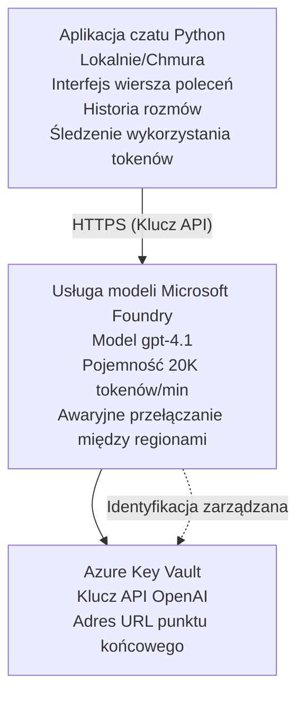

# Microsoft Foundry Models Chat Application

**Ścieżka nauki:** Średniozaawansowany ⭐⭐ | **Czas:** 35-45 minut | **Koszt:** 50-200 USD/miesiąc

Kompletna aplikacja chatowa Microsoft Foundry Models wdrożona za pomocą Azure Developer CLI (azd). Ten przykład demonstruje wdrożenie gpt-4.1, bezpieczny dostęp do API oraz prosty interfejs czatu.

## 🎯 Czego się nauczysz

- Wdrożysz usługę Microsoft Foundry Models z modelem gpt-4.1  
- Zabezpieczysz klucze API OpenAI za pomocą Key Vault  
- Zbudujesz prosty interfejs czatu w Pythonie  
- Będziesz monitorować zużycie tokenów i koszty  
- Zaimplementujesz limitowanie zapytań i obsługę błędów  

## 📦 Co jest w zestawie

✅ **Usługa Microsoft Foundry Models** - wdrożenie modelu gpt-4.1  
✅ **Aplikacja czatu w Pythonie** - prosty interfejs wiersza poleceń  
✅ **Integracja Key Vault** - bezpieczne przechowywanie kluczy API  
✅ **Szablony ARM** - kompletna infrastruktura jako kod  
✅ **Monitorowanie kosztów** - śledzenie użycia tokenów  
✅ **Limitowanie zapytań** - zapobiega wyczerpaniu limitów  

## Architektura



## Wymagania wstępne

### Wymagane

- **Azure Developer CLI (azd)** - [Przewodnik instalacji](https://learn.microsoft.com/azure/developer/azure-developer-cli/install-azd)  
- **Subskrypcja Azure** z dostępem do OpenAI - [Złóż wniosek o dostęp](https://aka.ms/oai/access)  
- **Python 3.9+** - [Pobierz i zainstaluj Python](https://www.python.org/downloads/)  

### Sprawdź wymagania

```bash
# Sprawdź wersję azd (wymagana 1.5.0 lub wyższa)
azd version

# Zweryfikuj logowanie do Azure
azd auth login

# Sprawdź wersję Pythona
python --version  # lub python3 --version

# Zweryfikuj dostęp do OpenAI (sprawdź w Azure Portal)
az cognitiveservices account list-skus \
  --kind OpenAI \
  --location eastus
```

> **⚠️ Ważne:** Microsoft Foundry Models wymaga zatwierdzenia aplikacji. Jeśli jeszcze tego nie zrobiłeś, odwiedź [aka.ms/oai/access](https://aka.ms/oai/access). Zatwierdzenie zwykle zajmuje 1-2 dni robocze.

## ⏱️ Harmonogram wdrożenia

| Faza | Czas trwania | Co się dzieje |
|-------|--------------|---------------|
| Sprawdzenie wymagań | 2-3 minuty | Weryfikacja dostępności limitu OpenAI |
| Wdrożenie infrastruktury | 8-12 minut | Utworzenie usług OpenAI, Key Vault, wdrożenie modelu |
| Konfiguracja aplikacji | 2-3 minuty | Ustawienia środowiska i zależności |
| **Razem** | **12-18 minut** | Gotowe do czatu z gpt-4.1 |

**Uwaga:** Pierwsze wdrożenie OpenAI może potrwać dłużej ze względu na provisioning modelu.

## Szybki start

```bash
# Przejdź do przykładu
cd examples/azure-openai-chat

# Zainicjuj środowisko
azd env new myopenai

# Wdróż wszystko (infrastruktura + konfiguracja)
azd up
# Zostaniesz poproszony o:
# 1. Wybierz subskrypcję Azure
# 2. Wybierz lokalizację z dostępnością OpenAI (np. eastus, eastus2, westus)
# 3. Poczekaj 12-18 minut na wdrożenie

# Zainstaluj zależności Pythona
pip install -r requirements.txt

# Zacznij rozmawiać!
python chat.py
```

**Oczekiwany wynik:**  
```
🤖 Microsoft Foundry Models Chat Application
Connected to: gpt-4.1 (eastus)
Type your message (or 'quit' to exit)

You: Hello! Tell me about Microsoft Foundry Models.
Assistant: Microsoft Foundry Models Service provides REST API access to OpenAI's powerful language models including gpt-4.1, GPT-3.5-Turbo, and Embeddings...

[Tokens used: 145 | Estimated cost: $0.0044]
```

## ✅ Sprawdź wdrożenie

### Krok 1: Sprawdź zasoby Azure

```bash
# Wyświetl wdrożone zasoby
azd show

# Oczekiwane wyjście pokazuje:
# - Usługa OpenAI: (nazwa zasobu)
# - Key Vault: (nazwa zasobu)
# - Wdrożenie: gpt-4.1
# - Lokalizacja: eastus (lub wybrany region)
```

### Krok 2: Przetestuj API OpenAI

```bash
# Pobierz punkt końcowy i klucz OpenAI
OPENAI_ENDPOINT=$(azd env get-value AZURE_OPENAI_ENDPOINT)
OPENAI_KEY=$(azd env get-value AZURE_OPENAI_API_KEY)

# Przetestuj wywołanie API
curl "$OPENAI_ENDPOINT/openai/deployments/gpt-4.1/chat/completions?api-version=2024-08-01-preview" \
  -H "Content-Type: application/json" \
  -H "api-key: $OPENAI_KEY" \
  -d '{
    "messages": [{"role": "user", "content": "Say hello!"}],
    "max_tokens": 50
  }'
```

**Oczekiwana odpowiedź:**  
```json
{
  "choices": [
    {
      "message": {
        "role": "assistant",
        "content": "Hello! How can I assist you today?"
      }
    }
  ],
  "usage": {
    "prompt_tokens": 8,
    "completion_tokens": 9,
    "total_tokens": 17
  }
}
```

### Krok 3: Zweryfikuj dostęp do Key Vault

```bash
# Wyświetl listę sekretów w Key Vault
KV_NAME=$(azd env get-value AZURE_KEY_VAULT_NAME)

az keyvault secret list \
  --vault-name $KV_NAME \
  --query "[].name" \
  --output table
```

**Oczekiwane sekrety:**  
- `openai-api-key`  
- `openai-endpoint`  

**Kryteria sukcesu:**  
- ✅ Usługa OpenAI wdrożona z gpt-4.1  
- ✅ Wywołanie API zwraca prawidłowe uzupełnienie  
- ✅ Sekrety zapisane w Key Vault  
- ✅ Działa śledzenie użycia tokenów  

## Struktura projektu

```
azure-openai-chat/
├── README.md                   ✅ This guide
├── azure.yaml                  ✅ AZD configuration
├── infra/                      ✅ Infrastructure as Code
│   ├── main.bicep             ✅ Main Bicep template
│   ├── main.parameters.json   ✅ Parameters
│   └── openai.bicep           ✅ OpenAI resource definition
├── src/                        ✅ Application code
│   ├── chat.py                ✅ Chat interface
│   ├── config.py              ✅ Configuration loader
│   └── requirements.txt       ✅ Python dependencies
└── .gitignore                  ✅ Git ignore rules
```

## Funkcje aplikacji

### Interfejs czatu (`chat.py`)

Aplikacja czatu zawiera:

- **Historia rozmowy** - utrzymuje kontekst między wiadomościami  
- **Liczenie tokenów** - śledzi zużycie i szacuje koszty  
- **Obsługa błędów** - łagodna obsługa limitów i błędów API  
- **Szacowanie kosztów** - kalkulacja kosztów w czasie rzeczywistym dla każdej wiadomości  
- **Wsparcie dla streamingu** - opcjonalne odpowiedzi strumieniowe  

### Komendy

Podczas czatu możesz używać:  
- `quit` lub `exit` - zakończ sesję  
- `clear` - wyczyść historię rozmowy  
- `tokens` - pokaż całkowite zużycie tokenów  
- `cost` - pokaż szacowane całkowite koszty  

### Konfiguracja (`config.py`)

Ładuje konfigurację ze zmiennych środowiskowych:  
```python
AZURE_OPENAI_ENDPOINT  # Z Key Vault
AZURE_OPENAI_API_KEY   # Z Key Vault
AZURE_OPENAI_MODEL     # Domyślnie: gpt-4.1
AZURE_OPENAI_MAX_TOKENS # Domyślnie: 800
```

## Przykłady użycia

### Podstawowy czat

```bash
python chat.py
```

### Czat z niestandardowym modelem

```bash
export AZURE_OPENAI_MODEL=gpt-35-turbo
python chat.py
```

### Czat z streamingiem

```bash
python chat.py --stream
```

### Przykładowa rozmowa

```
You: Explain Microsoft Foundry Models Service in 3 sentences.
Assistant: Microsoft Foundry Models Service is Microsoft Azure's cloud platform offering 
that provides access to OpenAI's powerful language models. It enables developers 
to integrate capabilities like gpt-4.1 into their applications with enterprise-grade 
security and compliance. The service includes features for content filtering, 
abuse monitoring, and responsible AI practices.

[Tokens used: 89 | Estimated cost: $0.0027]

You: What models are available?
Assistant: Microsoft Foundry Models Service offers several model families including gpt-4.1 
(most capable), GPT-3.5-Turbo (faster and cost-effective), and Embeddings models 
for vector search. Each model has different capabilities, pricing, and token limits.

[Tokens used: 67 | Estimated cost: $0.0020]

Total session: 156 tokens | $0.0047
```

## Zarządzanie kosztami

### Cennik tokenów (gpt-4.1)

| Model | Wejście (za 1K tokenów) | Wyjście (za 1K tokenów) |
|--------|-------------------------|-------------------------|
| gpt-4.1 | 0,03 USD | 0,06 USD |
| GPT-3.5-Turbo | 0,0015 USD | 0,002 USD |

### Szacowane miesięczne koszty

Na podstawie wzorców użycia:

| Poziom użycia | Wiadomości/dzień | Tokeny/dzień | Miesięczny koszt |
|---------------|------------------|--------------|------------------|
| **Lekki** | 20 wiadomości | 3 000 tokenów | 3-5 USD |
| **Umiarkowany** | 100 wiadomości | 15 000 tokenów | 15-25 USD |
| **Duży** | 500 wiadomości | 75 000 tokenów | 75-125 USD |

**Podstawowy koszt infrastruktury:** 1-2 USD/miesiąc (Key Vault + minimalne obliczenia)

### Wskazówki optymalizacji kosztów

```bash
# 1. Używaj GPT-3.5-Turbo do prostszych zadań (20x tańszy)
export AZURE_OPENAI_MODEL=gpt-35-turbo

# 2. Zmniejsz maksymalną liczbę tokenów dla krótszych odpowiedzi
export AZURE_OPENAI_MAX_TOKENS=400

# 3. Monitoruj zużycie tokenów
python chat.py --show-tokens

# 4. Skonfiguruj alerty budżetowe
az consumption budget create \
  --budget-name "openai-budget" \
  --amount 50 \
  --time-grain Monthly
```

## Monitorowanie

### Podgląd zużycia tokenów

```bash
# W Azure Portal:
# Zasób OpenAI → Metryki → Wybierz "Token Transaction"

# Lub przez Azure CLI:
az monitor metrics list \
  --resource $(azd env get-value AZURE_OPENAI_RESOURCE_ID) \
  --metric "TokenTransaction" \
  --start-time $(date -u -d '1 hour ago' '+%Y-%m-%dT%H:%M:%S') \
  --interval PT1M
```

### Podgląd logów API

```bash
# Strumieniuj dzienniki diagnostyczne
az monitor diagnostic-settings create \
  --resource $(azd env get-value AZURE_OPENAI_RESOURCE_ID) \
  --name openai-logs \
  --logs '[{"category": "Audit", "enabled": true}]' \
  --workspace $(azd env get-value LOG_ANALYTICS_WORKSPACE_ID)

# Dzienniki zapytań
az monitor log-analytics query \
  --workspace $(azd env get-value LOG_ANALYTICS_WORKSPACE_ID) \
  --analytics-query "AzureDiagnostics | where Category == 'Audit' | top 10 by TimeGenerated"
```

## Rozwiązywanie problemów

### Problem: Błąd „Access Denied”

**Objawy:** 403 Forbidden przy wywołaniu API

**Rozwiązania:**  
```bash
# 1. Sprawdź, czy dostęp do OpenAI jest zatwierdzony
az cognitiveservices account show \
  --name $(azd env get-value AZURE_OPENAI_NAME) \
  --resource-group $(azd env get-value AZURE_RESOURCE_GROUP)

# 2. Sprawdź, czy klucz API jest poprawny
azd env get-value AZURE_OPENAI_API_KEY

# 3. Zweryfikuj format adresu URL punktu końcowego
azd env get-value AZURE_OPENAI_ENDPOINT
# Powinno być: https://[name].openai.azure.com/
```

### Problem: „Przekroczony limit zapytań”

**Objawy:** 429 Too Many Requests

**Rozwiązania:**  
```bash
# 1. Sprawdź aktualny limit
az cognitiveservices account deployment show \
  --name $(azd env get-value AZURE_OPENAI_NAME) \
  --resource-group $(azd env get-value AZURE_RESOURCE_GROUP) \
  --deployment-name gpt-4.1

# 2. Złóż wniosek o zwiększenie limitu (jeśli potrzebne)
# Przejdź do Azure Portal → Zasób OpenAI → Limity → Złóż wniosek o zwiększenie

# 3. Zaimplementuj logikę ponawiania prób (już w chat.py)
# Aplikacja automatycznie ponawia próby z wykładniczym opóźnieniem
```

### Problem: „Nie znaleziono modelu”

**Objawy:** błąd 404 przy wdrożeniu

**Rozwiązania:**  
```bash
# 1. Wyświetl dostępne wdrożenia
az cognitiveservices account deployment list \
  --name $(azd env get-value AZURE_OPENAI_NAME) \
  --resource-group $(azd env get-value AZURE_RESOURCE_GROUP)

# 2. Zweryfikuj nazwę modelu w środowisku
echo $AZURE_OPENAI_MODEL

# 3. Zaktualizuj do poprawnej nazwy wdrożenia
export AZURE_OPENAI_MODEL=gpt-4.1  # lub gpt-35-turbo
```

### Problem: Wysokie opóźnienia

**Objawy:** Wolne odpowiedzi (>5 sekund)

**Rozwiązania:**  
```bash
# 1. Sprawdź opóźnienia w regionie
# Wdróż do regionu najbliższego użytkownikom

# 2. Zmniejsz max_tokens dla szybszych odpowiedzi
export AZURE_OPENAI_MAX_TOKENS=400

# 3. Użyj streamingu dla lepszej wygody użytkownika
python chat.py --stream
```

## Najlepsze praktyki bezpieczeństwa

### 1. Chroń klucze API

```bash
# Nigdy nie zapisuj kluczy w systemie kontroli wersji
# Używaj Key Vault (już skonfigurowany)

# Regularnie zmieniaj klucze
az cognitiveservices account keys regenerate \
  --name $(azd env get-value AZURE_OPENAI_NAME) \
  --resource-group $(azd env get-value AZURE_RESOURCE_GROUP) \
  --key-name key1
```

### 2. Wdrażaj filtrowanie treści

```python
# Microsoft Foundry Models zawiera wbudowane filtrowanie treści
# Skonfiguruj w Azure Portal:
# Zasób OpenAI → Filtry treści → Utwórz filtr niestandardowy

# Kategorie: Nienawiść, Seksualne, Przemoc, Samookaleczenie
# Poziomy: Niskie, Średnie, Wysokie filtrowanie
```

### 3. Używaj tożsamości zarządzanej (produkcja)

```bash
# Do produkcyjnych wdrożeń używaj zarządzanej tożsamości
# zamiast kluczy API (wymaga hostingu aplikacji na Azure)

# Zaktualizuj infra/openai.bicep, aby uwzględnić:
# identity: { type: 'SystemAssigned' }
```

## Rozwój

### Uruchom lokalnie

```bash
# Zainstaluj zależności
pip install -r src/requirements.txt

# Ustaw zmienne środowiskowe
export AZURE_OPENAI_ENDPOINT="https://[name].openai.azure.com/"
export AZURE_OPENAI_API_KEY="your-api-key"
export AZURE_OPENAI_MODEL="gpt-4.1"

# Uruchom aplikację
python src/chat.py
```

### Uruchom testy

```bash
# Zainstaluj zależności testowe
pip install pytest pytest-cov

# Uruchom testy
pytest tests/ -v

# Z pokryciem
pytest tests/ --cov=src --cov-report=html
```

### Aktualizuj wdrożenie modelu

```bash
# Wdróż różną wersję modelu
az cognitiveservices account deployment create \
  --name $(azd env get-value AZURE_OPENAI_NAME) \
  --resource-group $(azd env get-value AZURE_RESOURCE_GROUP) \
  --deployment-name gpt-35-turbo \
  --model-name gpt-35-turbo \
  --model-version "0613" \
  --model-format OpenAI \
  --sku-capacity 20 \
  --sku-name "Standard"
```

## Sprzątanie

```bash
# Usuń wszystkie zasoby Azure
azd down --force --purge

# To usuwa:
# - Usługę OpenAI
# - Key Vault (z 90-dniowym miękkim usuwaniem)
# - Grupę zasobów
# - Wszystkie wdrożenia i konfiguracje
```

## Kolejne kroki

### Rozszerz ten przykład

1. **Dodaj interfejs webowy** - zbuduj frontend w React/Vue  
   ```bash
   # Dodaj usługę frontend do azure.yaml
   # Wdróż do Azure Static Web Apps
   ```
  
2. **Wdrażaj RAG** - dodaj wyszukiwanie dokumentów z Azure AI Search  
   ```python
   # Zintegruj Azure AI Search
   # Prześlij dokumenty i stwórz indeks wektorowy
   ```
  
3. **Dodaj wywoływanie funkcji** - włącz użycie narzędzi  
   ```python
   # Zdefiniuj funkcje w chat.py
   # Pozwól gpt-4.1 wywoływać zewnętrzne API
   ```
  
4. **Wsparcie multi-modeli** - wdroż wiele modeli  
   ```bash
   # Dodaj modele gpt-35-turbo, embeddowania
   # Zaimplementuj logikę routingu modeli
   ```
  
### Powiązane przykłady

- **[Retail Multi-Agent](../retail-scenario.md)** - Zaawansowana architektura multi-agentów  
- **[Database App](../../../../examples/database-app)** - Dodaj trwałą bazę danych  
- **[Container Apps](../../../../examples/container-app)** - Wdroż jako usługę kontenerową  

### Zasoby edukacyjne

- 📚 [Kurs AZD dla początkujących](../../README.md) - Strona główna kursu  
- 📚 [Dokumentacja Microsoft Foundry Models](https://learn.microsoft.com/azure/ai-services/openai/) - Oficjalna dokumentacja  
- 📚 [Referencja API OpenAI](https://platform.openai.com/docs/api-reference) - Szczegóły API  
- 📚 [Odpowiedzialna AI](https://www.microsoft.com/ai/responsible-ai) - Najlepsze praktyki  

## Dodatkowe zasoby

### Dokumentacja
- **[Usługa Microsoft Foundry Models](https://learn.microsoft.com/azure/ai-services/openai/)** - Kompletny przewodnik  
- **[Modele gpt-4.1](https://learn.microsoft.com/azure/ai-services/openai/concepts/models)** - Możliwości modeli  
- **[Filtrowanie treści](https://learn.microsoft.com/azure/ai-services/openai/concepts/content-filter)** - Funkcje bezpieczeństwa  
- **[Azure Developer CLI](https://learn.microsoft.com/azure/developer/azure-developer-cli/)** - Referencja azd  

### Samouczki
- **[Szybki start z OpenAI](https://learn.microsoft.com/azure/ai-services/openai/quickstart)** - Pierwsze wdrożenie  
- **[Czat Completions](https://learn.microsoft.com/azure/ai-services/openai/how-to/chatgpt)** - Budowa aplikacji chat  
- **[Wywoływanie funkcji](https://learn.microsoft.com/azure/ai-services/openai/how-to/function-calling)** - Zaawansowane funkcje  

### Narzędzia
- **[Microsoft Foundry Models Studio](https://oai.azure.com/)** - Playground webowy  
- **[Przewodnik po promptach](https://platform.openai.com/docs/guides/prompt-engineering)** - Pisanie lepszych promptów  
- **[Kalkulator tokenów](https://platform.openai.com/tokenizer)** - Oszacuj zużycie tokenów  

### Społeczność  
- **[Discord Azure AI](https://discord.gg/azure)** - Pomoc ze społeczności  
- **[Dyskusje GitHub](https://github.com/Azure-Samples/openai/discussions)** - Forum pytań i odpowiedzi  
- **[Blog Azure](https://azure.microsoft.com/blog/tag/azure-openai-service/)** - Najnowsze aktualizacje  

---

**🎉 Sukces!** Wdrożyłeś Microsoft Foundry Models i zbudowałeś działającą aplikację czatu. Zacznij eksplorować możliwości gpt-4.1 i eksperymentować z różnymi promptami oraz scenariuszami użycia.

**Masz pytania?** [Zgłoś problem](https://github.com/microsoft/AZD-for-beginners/issues) lub sprawdź [FAQ](../../resources/faq.md)

**Alert kosztowy:** Pamiętaj, aby po testach uruchomić `azd down`, aby uniknąć dalszych opłat (~50-100 USD/miesiąc przy aktywnym użyciu).

---

<!-- CO-OP TRANSLATOR DISCLAIMER START -->
**Zastrzeżenie**:
Niniejszy dokument został przetłumaczony za pomocą usługi tłumaczenia AI [Co-op Translator](https://github.com/Azure/co-op-translator). Choć dążymy do dokładności, prosimy pamiętać, że automatyczne tłumaczenia mogą zawierać błędy lub niedokładności. Oryginalny dokument w jego języku źródłowym należy uznawać za autorytatywne źródło. W przypadku informacji krytycznych zalecane jest skorzystanie z profesjonalnego tłumaczenia wykonanego przez człowieka. Nie ponosimy odpowiedzialności za jakiekolwiek nieporozumienia lub błędne interpretacje wynikające z użycia tego tłumaczenia.
<!-- CO-OP TRANSLATOR DISCLAIMER END -->