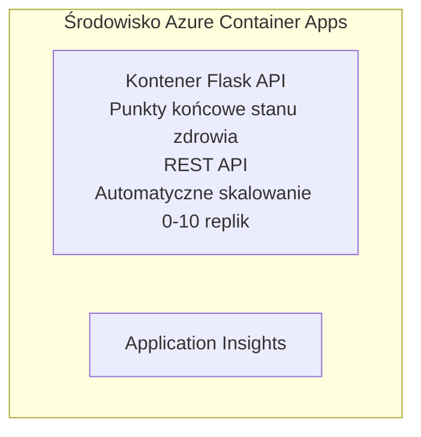

# Prosty API Flask - Przykład aplikacji kontenerowej

**Ścieżka nauki:** Początkujący ⭐ | **Czas:** 25-35 minut | **Koszt:** 0-15 USD/miesiąc

Kompletny, działający Python Flask REST API wdrożony do Azure Container Apps przy użyciu Azure Developer CLI (azd). Ten przykład pokazuje wdrażanie kontenera, automatyczne skalowanie oraz podstawy monitorowania.

## 🎯 Czego się nauczysz

- Wdrażać aplikację Python w kontenerze do Azure
- Konfigurować automatyczne skalowanie z możliwością skalowania do zera
- Implementować sondy zdrowia i sprawdzenia gotowości
- Monitorować dzienniki i metryki aplikacji
- Korzystać z Azure Developer CLI do szybkiego wdrażania

## 📦 Co jest dołączone

✅ **Aplikacja Flask** - Kompletny REST API z operacjami CRUD (`src/app.py`)  
✅ **Dockerfile** - Konfiguracja kontenera gotowa do produkcji  
✅ **Infrastruktura Bicep** - Środowisko Container Apps i wdrożenie API  
✅ **Konfiguracja AZD** - Przygotowanie wdrożenia jednym poleceniem  
✅ **Sondy zdrowia** - Skonfigurowane sprawdzenia żywotności i gotowości  
✅ **Automatyczne skalowanie** - 0-10 replik w oparciu o ruch HTTP  

## Architektura


## Wymagania wstępne

### Wymagane
- **Azure Developer CLI (azd)** - [Przewodnik instalacji](https://learn.microsoft.com/azure/developer/azure-developer-cli/install-azd)
- **Subskrypcja Azure** - [Konto bezpłatne](https://azure.microsoft.com/free/)
- **Docker Desktop** - [Zainstaluj Docker](https://www.docker.com/products/docker-desktop/) (do testów lokalnych)

### Sprawdź wymagania wstępne

```bash
# Sprawdź wersję azd (wymagana 1.5.0 lub wyższa)
azd version

# Zweryfikuj logowanie do Azure
azd auth login

# Sprawdź Dockera (opcjonalnie, do testów lokalnych)
docker --version
```

## ⏱️ Czas wdrożenia

| Faza | Czas trwania | Co się dzieje |
|-------|-------------|---------------|
| Konfiguracja środowiska | 30 sekund | Utworzenie środowiska azd |
| Budowa kontenera | 2-3 minuty | Docker buduje aplikację Flask |
| Przygotowanie infrastruktury | 3-5 minut | Tworzenie Container Apps, rejestru, monitoringu |
| Wdrożenie aplikacji | 2-3 minuty | Wysyłanie obrazu i wdrożenie do Container Apps |
| **Razem** | **8-12 minut** | Gotowe wdrożenie |

## Szybki start

```bash
# Przejdź do przykładu
cd examples/container-app/simple-flask-api

# Zainicjuj środowisko (wybierz unikalną nazwę)
azd env new myflaskapi

# Wdróż wszystko (infrastrukturę + aplikację)
azd up
# Zostaniesz poproszony o:
# 1. Wybierz subskrypcję Azure
# 2. Wybierz lokalizację (np. eastus2)
# 3. Poczekaj 8-12 minut na wdrożenie

# Pobierz punkt końcowy API
azd env get-values

# Przetestuj API
curl $(azd env get-value API_ENDPOINT)/health
```

**Oczekiwany wynik:**
```json
{
  "status": "healthy",
  "timestamp": "2025-11-19T10:30:00Z",
  "service": "simple-flask-api",
  "version": "1.0.0"
}
```

## ✅ Sprawdź wdrożenie

### Krok 1: Sprawdź status wdrożenia

```bash
# Wyświetl wdrożone usługi
azd show

# Oczekiwany wynik pokazuje:
# - Usługa: api
# - Punkt końcowy: https://ca-api-[env].xxx.azurecontainerapps.io
# - Status: Działa
```

### Krok 2: Testuj punkty końcowe API

```bash
# Pobierz punkt końcowy API
API_URL=$(azd env get-value API_ENDPOINT)

# Testuj stan zdrowia
curl $API_URL/health

# Testuj punkt końcowy główny
curl $API_URL/

# Utwórz element
curl -X POST $API_URL/api/items \
  -H "Content-Type: application/json" \
  -d '{"name": "Test Item", "description": "My first item"}'

# Pobierz wszystkie elementy
curl $API_URL/api/items
```

**Kryteria sukcesu:**
- ✅ Punkt /health zwraca HTTP 200
- ✅ Punkt główny pokazuje informacje o API
- ✅ POST tworzy element i zwraca HTTP 201
- ✅ GET zwraca utworzone elementy

### Krok 3: Przeglądaj dzienniki

```bash
# Strumieniuj na żywo logi za pomocą azd monitor
azd monitor --logs

# Lub użyj Azure CLI:
az containerapp logs show --name api --resource-group $RG_NAME --follow

# Powinieneś zobaczyć:
# - Komunikaty uruchomienia Gunicorn
# - Logi żądań HTTP
# - Logi informacji o aplikacji
```

## Struktura projektu

```
simple-flask-api/
├── azure.yaml              # AZD configuration
├── infra/
│   ├── main.bicep         # Main infrastructure
│   ├── main.parameters.json
│   └── app/
│       ├── container-env.bicep
│       └── api.bicep
└── src/
    ├── app.py             # Flask application
    ├── requirements.txt
    └── Dockerfile
```

## Punkty końcowe API

| Punkt końcowy | Metoda | Opis |
|---------------|--------|------|
| `/health` | GET | Sprawdzenie stanu zdrowia |
| `/api/items` | GET | Lista wszystkich elementów |
| `/api/items` | POST | Utworzenie nowego elementu |
| `/api/items/{id}` | GET | Pobranie konkretnego elementu |
| `/api/items/{id}` | PUT | Aktualizacja elementu |
| `/api/items/{id}` | DELETE | Usunięcie elementu |

## Konfiguracja

### Zmienne środowiskowe

```bash
# Ustaw niestandardową konfigurację
azd env set PORT 8000
azd env set LOG_LEVEL info
azd env set MAX_REPLICAS 20
```

### Konfiguracja skalowania

API automatycznie skaluje się na podstawie ruchu HTTP:
- **Min. liczba replik**: 0 (skaluje do zera podczas bezczynności)
- **Max. liczba replik**: 10
- **Współbieżne zapytania na replikę**: 50

## Rozwój

### Uruchom lokalnie

```bash
# Zainstaluj zależności
cd src
pip install -r requirements.txt

# Uruchom aplikację
python app.py

# Przetestuj lokalnie
curl http://localhost:8000/health
```

### Buduj i testuj kontener

```bash
# Zbuduj obraz Dockera
docker build -t flask-api:local ./src

# Uruchom kontener lokalnie
docker run -p 8000:8000 flask-api:local

# Przetestuj kontener
curl http://localhost:8000/health
```

## Wdrożenie

### Pełne wdrożenie

```bash
# Wdróż infrastrukturę i aplikację
azd up
```

### Wdrożenie samego kodu

```bash
# Wdrażaj tylko kod aplikacji (infrastruktura bez zmian)
azd deploy api
```

### Aktualizacja konfiguracji

```bash
# Aktualizuj zmienne środowiskowe
azd env set API_KEY "new-api-key"

# Ponownie wdroż z nową konfiguracją
azd deploy api
```

## Monitorowanie

### Przeglądaj dzienniki

```bash
# Transmituj na żywo logi za pomocą azd monitor
azd monitor --logs

# Lub użyj Azure CLI dla Container Apps:
az containerapp logs show --name api --resource-group $RG_NAME --follow

# Wyświetl ostatnie 100 linii
az containerapp logs show --name api --resource-group $RG_NAME --tail 100
```

### Monitoruj metryki

```bash
# Otwórz panel Azure Monitor
azd monitor --overview

# Wyświetl konkretne metryki
az monitor metrics list \
  --resource $(azd show --output json | jq -r '.services.api.resourceId') \
  --metric "Requests,ResponseTime"
```

## Testowanie

### Sprawdzenie stanu zdrowia

```bash
curl $(azd show --output json | jq -r '.services.api.endpoint')/health
```

Oczekiwana odpowiedź:
```json
{
  "status": "healthy",
  "timestamp": "2025-11-19T10:30:00Z"
}
```

### Utwórz element

```bash
curl -X POST $(azd show --output json | jq -r '.services.api.endpoint')/api/items \
  -H "Content-Type: application/json" \
  -d '{"name": "Test Item", "description": "A test item"}'
```

### Pobierz wszystkie elementy

```bash
curl $(azd show --output json | jq -r '.services.api.endpoint')/api/items
```

## Optymalizacja kosztów

To wdrożenie korzysta ze skalowania do zera, więc płacisz tylko podczas obsługi zapytań:

- **Koszt bezczynności**: ~0 USD/miesiąc (skalowanie do zera)
- **Koszt aktywności**: ~0,000024 USD/sekundę na replikę
- **Szacowany koszt miesięczny** (niewielkie użycie): 5-15 USD

### Dalsza redukcja kosztów

```bash
# Zmniejsz maksymalną liczbę replik dla deweloperki
azd env set MAX_REPLICAS 3

# Użyj krótszego czasu bezczynności
azd env set SCALE_TO_ZERO_TIMEOUT 300  # 5 minut
```

## Rozwiązywanie problemów

### Kontener nie uruchamia się

```bash
# Sprawdź logi kontenera za pomocą Azure CLI
az containerapp logs show --name api --resource-group $RG_NAME --tail 100

# Zweryfikuj lokalne tworzenie obrazu Dockera
docker build -t test ./src
```

### API niedostępne

```bash
# Zweryfikuj, czy wejście jest zewnętrzne
az containerapp show --name api --resource-group rg-simple-flask-api \
  --query properties.configuration.ingress.external
```

### Długie czasy odpowiedzi

```bash
# Sprawdź użycie CPU/Pamięci
az monitor metrics list \
  --resource $(azd show --output json | jq -r '.services.api.resourceId') \
  --metric "CPUPercentage,MemoryPercentage"

# Zwiększ zasoby w razie potrzeby
az containerapp update --name api --resource-group rg-simple-flask-api \
  --cpu 1.0 --memory 2Gi
```

## Sprzątanie

```bash
# Usuń wszystkie zasoby
azd down --force --purge
```

## Kolejne kroki

### Rozbuduj ten przykład

1. **Dodaj bazę danych** - Integracja z Azure Cosmos DB lub SQL Database  
   ```bash
   # Dodaj moduł Cosmos DB do infra/main.bicep
   # Zaktualizuj app.py o połączenie z bazą danych
   ```

2. **Dodaj uwierzytelnianie** - Implementacja Azure AD lub kluczy API  
   ```python
   # Dodaj middleware uwierzytelniania do app.py
   from functools import wraps
   ```

3. **Ustaw CI/CD** - Workflow GitHub Actions  
   ```yaml
   # Create .github/workflows/deploy.yml
   name: Deploy to Azure
   on: [push]
   ```

4. **Dodaj tożsamość zarządzaną** - Bezpieczny dostęp do usług Azure  
   ```bicep
   # Update infra/app/api.bicep
   identity: { type: 'SystemAssigned' }
   ```

### Powiązane przykłady

- **[Aplikacja z bazą danych](../../../../../examples/database-app)** - Kompletny przykład z SQL Database  
- **[Mikroserwisy](../../../../../examples/container-app/microservices)** - Architektura wieloserwisowa  
- **[Przewodnik po Container Apps](../README.md)** - Wszystkie wzorce kontenerowe  

### Materiały edukacyjne

- 📚 [Kurs AZD dla początkujących](../../../README.md) - Główna strona kursu  
- 📚 [Wzorce Container Apps](../README.md) - Więcej wzorców wdrożeń  
- 📚 [Galeria szablonów AZD](https://azure.github.io/awesome-azd/) - Szablony społeczności  

## Dodatkowe zasoby

### Dokumentacja
- **[Dokumentacja Flask](https://flask.palletsprojects.com/)** - Przewodnik frameworka Flask  
- **[Azure Container Apps](https://learn.microsoft.com/azure/container-apps/)** - Oficjalna dokumentacja Azure  
- **[Azure Developer CLI](https://learn.microsoft.com/azure/developer/azure-developer-cli/)** - Referencja poleceń azd  

### Samouczki
- **[Szybki start z Container Apps](https://learn.microsoft.com/azure/container-apps/quickstart-portal)** - Wdrożenie pierwszej aplikacji  
- **[Python w Azure](https://learn.microsoft.com/azure/developer/python/)** - Przewodnik programowania w Pythonie  
- **[Język Bicep](https://learn.microsoft.com/azure/azure-resource-manager/bicep/)** - Infrastruktura jako kod  

### Narzędzia
- **[Azure Portal](https://portal.azure.com)** - Zarządzanie zasobami wizualnie  
- **[Rozszerzenie VS Code Azure](https://marketplace.visualstudio.com/items?itemName=ms-azuretools.vscode-azurecontainerapps)** - Integracja IDE  

---

**🎉 Gratulacje!** Wdrożyłeś produkcyjne API Flask do Azure Container Apps z automatycznym skalowaniem i monitorowaniem.

**Masz pytania?** [Zgłoś problem](https://github.com/microsoft/AZD-for-beginners/issues) lub sprawdź [FAQ](../../../resources/faq.md)

---

<!-- CO-OP TRANSLATOR DISCLAIMER START -->
**Zastrzeżenie**:  
Dokument ten został przetłumaczony przy użyciu usługi tłumaczenia AI [Co-op Translator](https://github.com/Azure/co-op-translator). Chociaż dążymy do dokładności, prosimy mieć na uwadze, że automatyczne tłumaczenia mogą zawierać błędy lub nieścisłości. Oryginalny dokument w języku źródłowym powinien być uznawany za źródło autorytatywne. W przypadku informacji krytycznych zaleca się skorzystanie z profesjonalnego tłumaczenia przez człowieka. Nie ponosimy odpowiedzialności za jakiekolwiek nieporozumienia lub błędne interpretacje wynikające z korzystania z tego tłumaczenia.
<!-- CO-OP TRANSLATOR DISCLAIMER END -->