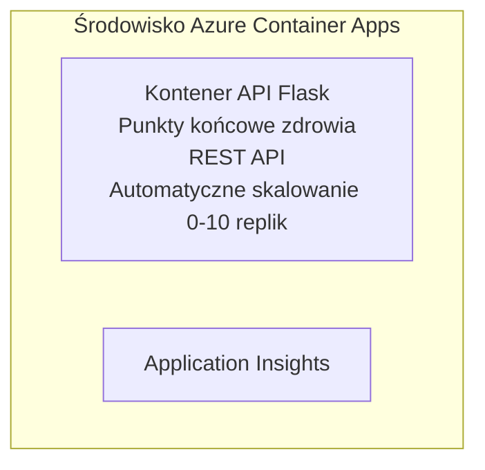

# Prosty API Flask - Przykład aplikacji kontenerowej

**Ścieżka nauki:** Początkujący ⭐ | **Czas:** 25-35 minut | **Koszt:** 0-15 USD/miesiąc

Kompletny, działający Python Flask REST API wdrożony do Azure Container Apps za pomocą Azure Developer CLI (azd). Ten przykład demonstruje wdrażanie kontenerów, automatyczne skalowanie i podstawy monitorowania.

## 🎯 Czego się nauczysz

- Wdrażać konteneryzowaną aplikację Python do Azure  
- Konfigurować automatyczne skalowanie z trybem scale-to-zero  
- Implementować sondy zdrowotne i kontrole gotowości  
- Monitorować logi i metryki aplikacji  
- Używać Azure Developer CLI do szybkiego wdrażania

## 📦 Co jest zawarte

✅ **Aplikacja Flask** - Kompletny REST API z operacjami CRUD (`src/app.py`)  
✅ **Dockerfile** - Konfiguracja kontenera gotowa do produkcji  
✅ **Infrastruktura Bicep** - Środowisko Container Apps i wdrożenie API  
✅ **Konfiguracja AZD** - Wdrożenie jednym poleceniem  
✅ **Sondy zdrowotne** - Skonfigurowane liveness i readiness  
✅ **Automatyczne skalowanie** - 0-10 replik w zależności od obciążenia HTTP  

## Architektura



## Wymagania wstępne

### Wymagane
- **Azure Developer CLI (azd)** - [Przewodnik instalacji](https://learn.microsoft.com/azure/developer/azure-developer-cli/install-azd)
- **Subskrypcja Azure** - [Konto darmowe](https://azure.microsoft.com/free/)
- **Docker Desktop** - [Zainstaluj Docker](https://www.docker.com/products/docker-desktop/) (do testów lokalnych)

### Weryfikacja wymagań

```bash
# Sprawdź wersję azd (wymagana 1.5.0 lub wyższa)
azd version

# Zweryfikuj logowanie do Azure
azd auth login

# Sprawdź Dockera (opcjonalnie, do testów lokalnych)
docker --version
```

## ⏱️ Harmonogram wdrożenia

| Faza | Czas trwania | Co się dzieje |
|-------|----------|--------------||
| Konfiguracja środowiska | 30 sekund | Utworzenie środowiska azd |
| Budowa kontenera | 2-3 minuty | Budowa aplikacji Flask za pomocą Dockera |
| Provisioning infrastruktury | 3-5 minut | Utworzenie Container Apps, rejestru, monitoringu |
| Wdrożenie aplikacji | 2-3 minuty | Wysyłka obrazu i wdrożenie do Container Apps |
| **Razem** | **8-12 minut** | Gotowe pełne wdrożenie |

## Szybki start

```bash
# Przejdź do przykładu
cd examples/container-app/simple-flask-api

# Zainicjuj środowisko (wybierz unikalną nazwę)
azd env new myflaskapi

# Wdróż wszystko (infrastrukturę + aplikację)
azd up
# Zostaniesz poproszony o:
# 1. Wybierz subskrypcję Azure
# 2. Wybierz lokalizację (np. eastus2)
# 3. Poczekaj 8-12 minut na wdrożenie

# Pobierz swój punkt końcowy API
azd env get-values

# Przetestuj API
curl $(azd env get-value API_ENDPOINT)/health
```

**Oczekiwany wynik:**
```json
{
  "status": "healthy",
  "timestamp": "2025-11-19T10:30:00Z",
  "service": "simple-flask-api",
  "version": "1.0.0"
}
```

## ✅ Weryfikacja wdrożenia

### Krok 1: Sprawdź status wdrożenia

```bash
# Wyświetl wdrożone usługi
azd show

# Oczekiwany wynik pokazuje:
# - Usługa: api
# - Punkt końcowy: https://ca-api-[env].xxx.azurecontainerapps.io
# - Status: Działa
```

### Krok 2: Testuj punkty końcowe API

```bash
# Pobierz punkt końcowy API
API_URL=$(azd env get-value API_ENDPOINT)

# Testuj stan zdrowia
curl $API_URL/health

# Testuj punkt końcowy root
curl $API_URL/

# Utwórz element
curl -X POST $API_URL/api/items \
  -H "Content-Type: application/json" \
  -d '{"name": "Test Item", "description": "My first item"}'

# Pobierz wszystkie elementy
curl $API_URL/api/items
```

**Kryteria sukcesu:**
- ✅ Punkt zdrowia zwraca HTTP 200
- ✅ Punkt główny pokazuje informacje o API
- ✅ POST tworzy element i zwraca HTTP 201
- ✅ GET zwraca utworzone elementy

### Krok 3: Przeglądanie logów

```bash
# Przesyłaj na żywo logi za pomocą azd monitor
azd monitor --logs

# Lub użyj Azure CLI:
az containerapp logs show --name api --resource-group $RG_NAME --follow

# Powinieneś zobaczyć:
# - Komunikaty startowe Gunicorna
# - Logi żądań HTTP
# - Logi informacji aplikacji
```

## Struktura projektu

```
simple-flask-api/
├── azure.yaml              # AZD configuration
├── infra/
│   ├── main.bicep         # Main infrastructure
│   ├── main.parameters.json
│   └── app/
│       ├── container-env.bicep
│       └── api.bicep
└── src/
    ├── app.py             # Flask application
    ├── requirements.txt
    └── Dockerfile
```

## Punkty końcowe API

| Punkt końcowy | Metoda | Opis |
|----------|--------|-------------|
| `/health` | GET | Sprawdzenie stanu zdrowia |
| `/api/items` | GET | Lista wszystkich elementów |
| `/api/items` | POST | Utworzenie nowego elementu |
| `/api/items/{id}` | GET | Pobierz konkretny element |
| `/api/items/{id}` | PUT | Aktualizuj element |
| `/api/items/{id}` | DELETE | Usuń element |

## Konfiguracja

### Zmienne środowiskowe

```bash
# Ustaw niestandardową konfigurację
azd env set PORT 8000
azd env set LOG_LEVEL info
azd env set MAX_REPLICAS 20
```

### Konfiguracja skalowania

API automatycznie się skaluje w zależności od ruchu HTTP:
- **Min. replik**: 0 (skalowanie do zera przy bezczynności)
- **Max. replik**: 10
- **Równoczesne żądania na replikę**: 50

## Rozwój

### Uruchamianie lokalne

```bash
# Zainstaluj zależności
cd src
pip install -r requirements.txt

# Uruchom aplikację
python app.py

# Testuj lokalnie
curl http://localhost:8000/health
```

### Budowa i test kontenera

```bash
# Zbuduj obraz Dockera
docker build -t flask-api:local ./src

# Uruchom kontener lokalnie
docker run -p 8000:8000 flask-api:local

# Przetestuj kontener
curl http://localhost:8000/health
```

## Wdrożenie

### Pełne wdrożenie

```bash
# Wdróż infrastrukturę i aplikację
azd up
```

### Wdrożenie tylko kodu

```bash
# Wdrażaj tylko kod aplikacji (infrastruktura bez zmian)
azd deploy api
```

### Aktualizacja konfiguracji

```bash
# Zaktualizuj zmienne środowiskowe
azd env set API_KEY "new-api-key"

# Ponownie wdroż z nową konfiguracją
azd deploy api
```

## Monitorowanie

### Przeglądanie logów

```bash
# Przesyłaj na żywo logi za pomocą azd monitor
azd monitor --logs

# Lub użyj Azure CLI dla Container Apps:
az containerapp logs show --name api --resource-group $RG_NAME --follow

# Wyświetl ostatnie 100 linii
az containerapp logs show --name api --resource-group $RG_NAME --tail 100
```

### Monitorowanie metryk

```bash
# Otwórz pulpit nawigacyjny Azure Monitor
azd monitor --overview

# Wyświetl konkretne metryki
az monitor metrics list \
  --resource $(azd show --output json | jq -r '.services.api.resourceId') \
  --metric "Requests,ResponseTime"
```

## Testowanie

### Sprawdzenie zdrowia

```bash
curl $(azd show --output json | jq -r '.services.api.endpoint')/health
```

Oczekiwana odpowiedź:
```json
{
  "status": "healthy",
  "timestamp": "2025-11-19T10:30:00Z"
}
```

### Utwórz element

```bash
curl -X POST $(azd show --output json | jq -r '.services.api.endpoint')/api/items \
  -H "Content-Type: application/json" \
  -d '{"name": "Test Item", "description": "A test item"}'
```

### Pobierz wszystkie elementy

```bash
curl $(azd show --output json | jq -r '.services.api.endpoint')/api/items
```

## Optymalizacja kosztów

To wdrożenie korzysta ze skalowania do zera, więc płacisz tylko, gdy API przetwarza żądania:

- **Koszt bezczynności**: ~0 USD/miesiąc (skalowanie do zera)
- **Koszt aktywności**: ~0,000024 USD/sekundę na replikę
- **Oczekiwany miesięczny koszt** (lekka eksploatacja): 5-15 USD

### Dalsza redukcja kosztów

```bash
# Zmniejsz maksymalną liczbę replik dla środowiska deweloperskiego
azd env set MAX_REPLICAS 3

# Użyj krótszego czasu oczekiwania na bezczynność
azd env set SCALE_TO_ZERO_TIMEOUT 300  # 5 minut
```

## Rozwiązywanie problemów

### Kontener nie uruchamia się

```bash
# Sprawdź logi kontenera za pomocą Azure CLI
az containerapp logs show --name api --resource-group $RG_NAME --tail 100

# Zweryfikuj lokalne budowanie obrazów Dockera
docker build -t test ./src
```

### API niedostępne

```bash
# Sprawdź, czy ingress jest zewnętrzny
az containerapp show --name api --resource-group rg-simple-flask-api \
  --query properties.configuration.ingress.external
```

### Wysokie czasy odpowiedzi

```bash
# Sprawdź zużycie CPU/Pamięci
az monitor metrics list \
  --resource $(azd show --output json | jq -r '.services.api.resourceId') \
  --metric "CPUPercentage,MemoryPercentage"

# Zwiększ zasoby w razie potrzeby
az containerapp update --name api --resource-group rg-simple-flask-api \
  --cpu 1.0 --memory 2Gi
```

## Sprzątanie

```bash
# Usuń wszystkie zasoby
azd down --force --purge
```

## Kolejne kroki

### Rozszerz ten przykład

1. **Dodaj bazę danych** - Integracja z Azure Cosmos DB lub SQL Database  
   ```bash
   # Dodaj moduł Cosmos DB do infra/main.bicep
   # Zaktualizuj app.py o połączenie z bazą danych
   ```

2. **Dodaj uwierzytelnianie** - Implementacja Microsoft Entra ID lub kluczy API  
   ```python
   # Dodaj pośrednika uwierzytelniania do app.py
   from functools import wraps
   ```

3. **Skonfiguruj CI/CD** - Workflow GitHub Actions  
   ```yaml
   # Create .github/workflows/deploy.yml
   name: Deploy to Azure
   on: [push]
   ```

4. **Dodaj tożsamość zarządzaną** - Bezpieczny dostęp do usług Azure  
   ```bicep
   # Update infra/app/api.bicep
   identity: { type: 'SystemAssigned' }
   ```

### Powiązane przykłady

- **[Aplikacja bazodanowa](../../../../../examples/database-app)** - Kompletny przykład z SQL Database  
- **[Mikrousługi](../../../../../examples/container-app/microservices)** - Architektura wieloserwisowa  
- **[Przewodnik po Container Apps](../README.md)** - Wszystkie wzorce kontenerów

### Materiały do nauki

- 📚 [Kurs AZD dla początkujących](../../../README.md) - Strona główna kursu  
- 📚 [Wzorce Container Apps](../README.md) - Więcej wzorców wdrożeń  
- 📚 [Galeria szablonów AZD](https://azure.github.io/awesome-azd/) - Szablony społeczności

## Dodatkowe zasoby

### Dokumentacja
- **[Dokumentacja Flask](https://flask.palletsprojects.com/)** - Przewodnik po frameworku Flask  
- **[Azure Container Apps](https://learn.microsoft.com/azure/container-apps/)** - Oficjalna dokumentacja Azure  
- **[Azure Developer CLI](https://learn.microsoft.com/azure/developer/azure-developer-cli/)** - Referencja poleceń azd

### Samouczki
- **[Szybki start Container Apps](https://learn.microsoft.com/azure/container-apps/quickstart-portal)** - Wdróż swoją pierwszą aplikację  
- **[Python w Azure](https://learn.microsoft.com/azure/developer/python/)** - Przewodnik po rozwoju w Python  
- **[Język Bicep](https://learn.microsoft.com/azure/azure-resource-manager/bicep/)** - Infrastruktura jako kod

### Narzędzia
- **[Portal Azure](https://portal.azure.com)** - Zarządzanie zasobami wizualnie  
- **[Rozszerzenie Azure do VS Code](https://marketplace.visualstudio.com/items?itemName=ms-azuretools.vscode-azurecontainerapps)** - Integracja z IDE

---

**🎉 Gratulacje!** Wdrożyłeś produkcyjną API Flask do Azure Container Apps z automatycznym skalowaniem i monitoringiem.

**Masz pytania?** [Zgłoś problem](https://github.com/microsoft/AZD-for-beginners/issues) lub sprawdź [FAQ](../../../resources/faq.md)

---

<!-- CO-OP TRANSLATOR DISCLAIMER START -->
**Zastrzeżenie**:
Niniejszy dokument został przetłumaczony za pomocą usługi tłumaczenia AI [Co-op Translator](https://github.com/Azure/co-op-translator). Choć dążymy do dokładności, prosimy pamiętać, że automatyczne tłumaczenia mogą zawierać błędy lub niedokładności. Oryginalny dokument w jego języku źródłowym należy uznawać za autorytatywne źródło. W przypadku informacji krytycznych zalecane jest skorzystanie z profesjonalnego tłumaczenia wykonanego przez człowieka. Nie ponosimy odpowiedzialności za jakiekolwiek nieporozumienia lub błędne interpretacje wynikające z użycia tego tłumaczenia.
<!-- CO-OP TRANSLATOR DISCLAIMER END -->