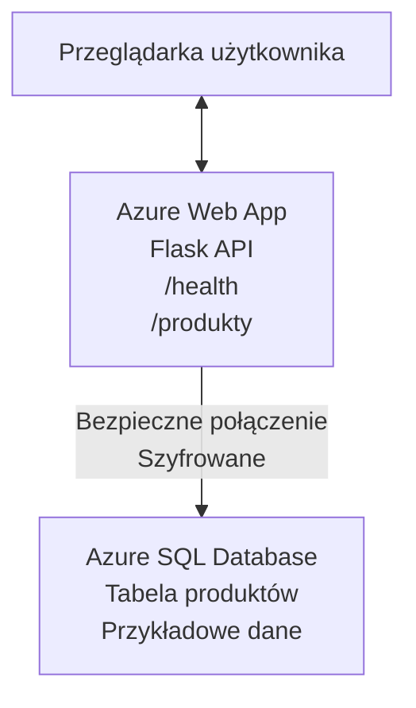

# Wdrażanie bazy danych Microsoft SQL i aplikacji internetowej za pomocą AZD

⏱️ **Szacowany czas**: 20–30 minut | 💰 **Szacowany koszt**: ~15–25 USD/miesiąc | ⭐ **Poziom trudności**: Średniozaawansowany

Ten **kompletny, działający przykład** pokazuje, jak użyć [Azure Developer CLI (azd)](https://learn.microsoft.com/azure/developer/azure-developer-cli/) do wdrożenia internetowej aplikacji Python Flask z bazą danych Microsoft SQL w Azure. Wszystkie fragmenty kodu są zawarte i przetestowane — nie wymagane są żadne zewnętrzne zależności.

## Czego się nauczysz

Realizując ten przykład, będziesz potrafił:
- Wdrażać aplikację wielowarstwową (web + baza danych) z wykorzystaniem infrastructure-as-code
- Konfigurować bezpieczne połączenia z bazą danych bez wklejania sekretów na stałe
- Monitorować stan aplikacji za pomocą Application Insights
- Efektywnie zarządzać zasobami Azure z użyciem AZD CLI
- Postępować zgodnie z najlepszymi praktykami Azure w kwestii bezpieczeństwa, optymalizacji kosztów i obserwowalności

## Przegląd scenariusza
- **Aplikacja webowa**: Python Flask REST API z połączeniem do bazy danych
- **Baza danych**: Azure SQL Database z danymi przykładowymi
- **Infrastruktura**: Tworzona za pomocą Bicep (modułowe, wielokrotnego użycia szablony)
- **Wdrożenie**: W pełni zautomatyzowane poleceniami `azd`
- **Monitorowanie**: Application Insights do logów i telemetrii

## Wymagania wstępne

### Wymagane narzędzia

Przed rozpoczęciem sprawdź, czy masz zainstalowane następujące narzędzia:

1. **[Azure CLI](https://learn.microsoft.com/cli/azure/install-azure-cli)** (wersja 2.50.0 lub nowsza)
   ```sh
   az --version
   # Oczekiwany wynik: azure-cli 2.50.0 lub nowszy
   ```

2. **[Azure Developer CLI (azd)](https://learn.microsoft.com/azure/developer/azure-developer-cli/install-azd)** (wersja 1.0.0 lub nowsza)
   ```sh
   azd version
   # Oczekiwany wynik: wersja azd 1.0.0 lub wyższa
   ```

3. **[Python 3.8+](https://www.python.org/downloads/)** (do lokalnego rozwoju)
   ```sh
   python --version
   # Oczekiwany wynik: Python 3.8 lub wyższy
   ```

4. **[Docker](https://www.docker.com/get-started)** (opcjonalnie, do lokalnego rozwoju w kontenerze)
   ```sh
   docker --version
   # Oczekiwany wynik: wersja Dockera 20.10 lub wyższa
   ```

### Wymagania Azure

- Aktywna **subskrypcja Azure** ([załóż darmowe konto](https://azure.microsoft.com/free/))
- Uprawnienia do tworzenia zasobów w subskrypcji
- Rola **Właściciel** lub **Kontrybutor** na subskrypcji lub grupie zasobów

### Wymagana wiedza

To przykład na poziomie **średniozaawansowanym**. Powinieneś znać:
- Podstawowe operacje wiersza poleceń
- Podstawy chmury (zasoby, grupy zasobów)
- Podstawy aplikacji internetowych i baz danych

**Nowy w AZD?** Zacznij od [przewodnika wprowadzającego](../../docs/chapter-01-foundation/azd-basics.md).

## Architektura

Przykład wdraża architekturę dwuwarstwową z aplikacją webową i bazą SQL:


**Wdrażane zasoby:**
- **Grupa zasobów**: kontener na wszystkie zasoby
- **Plan usługi aplikacji**: hosting Linux (poziom B1 dla oszczędności)
- **Aplikacja webowa**: środowisko Python 3.11 z aplikacją Flask
- **Serwer SQL**: zarządzany serwer z TLS w wersji co najmniej 1.2
- **Baza danych SQL**: podstawowy tier (2GB, odpowiedni do testów i rozwoju)
- **Application Insights**: monitorowanie i logowanie
- **Workspace Log Analytics**: centralne przechowywanie logów

**Analogia**: To jak restauracja (aplikacja webowa) z chłodnią (baza danych). Klienci zamawiają z menu (punkty końcowe API), a kuchnia (aplikacja Flask) pobiera składniki (dane) z chłodni. Kierownik restauracji (Application Insights) śledzi wszystko, co się dzieje.

## Struktura folderów

Wszystkie pliki w tym przykładzie są zawarte — brak zależności zewnętrznych:

```
examples/database-app/
│
├── README.md                    # This file
├── azure.yaml                   # AZD configuration file
├── .env.sample                  # Sample environment variables
├── .gitignore                   # Git ignore patterns
│
├── infra/                       # Infrastructure as Code (Bicep)
│   ├── main.bicep              # Main orchestration template
│   ├── abbreviations.json      # Azure naming conventions
│   └── resources/              # Modular resource templates
│       ├── sql-server.bicep    # SQL Server configuration
│       ├── sql-database.bicep  # Database configuration
│       ├── app-service-plan.bicep  # Hosting plan
│       ├── app-insights.bicep  # Monitoring setup
│       └── web-app.bicep       # Web application
│
└── src/
    └── web/                    # Application source code
        ├── app.py              # Flask REST API
        ├── requirements.txt    # Python dependencies
        └── Dockerfile          # Container definition
```

**Co robi każdy plik:**
- **azure.yaml**: mówi AZD, co i gdzie wdrażać
- **infra/main.bicep**: orkiestruje wszystkie zasoby Azure
- **infra/resources/*.bicep**: definicje poszczególnych zasobów (modułowe, do wielokrotnego użytku)
- **src/web/app.py**: aplikacja Flask z logiką bazy danych
- **requirements.txt**: zależności Pythona
- **Dockerfile**: instrukcje do konteneryzacji i wdrożenia

## Szybki start (krok po kroku)

### Krok 1: Sklonuj i przejdź do katalogu

```sh
git clone https://github.com/microsoft/AZD-for-beginners.git
cd AZD-for-beginners/examples/database-app
```

**✓ Sprawdzenie sukcesu**: Sprawdź, czy widzisz `azure.yaml` i folder `infra/`:
```sh
ls
# Oczekiwane: README.md, azure.yaml, infra/, src/
```

### Krok 2: Zaloguj się do Azure

```sh
azd auth login
```

Otworzy się przeglądarka do logowania w Azure. Zaloguj się swoimi danymi.

**✓ Sprawdzenie sukcesu**: Powinieneś zobaczyć:
```
Logged in to Azure.
```

### Krok 3: Zainicjuj środowisko

```sh
azd init
```

**Co się dzieje**: AZD tworzy lokalną konfigurację dla wdrożenia.

**Pojawią się pytania**:
- **Nazwa środowiska**: wpisz krótką nazwę (np. `dev`, `myapp`)
- **Subskrypcja Azure**: wybierz subskrypcję z listy
- **Region Azure**: wybierz region (np. `eastus`, `westeurope`)

**✓ Sprawdzenie sukcesu**: Powinieneś zobaczyć:
```
SUCCESS: New project initialized!
```

### Krok 4: Utwórz zasoby Azure

```sh
azd provision
```

**Co się dzieje**: AZD wdraża całą infrastrukturę (5-8 minut):
1. Tworzy grupę zasobów
2. Tworzy serwer i bazę SQL
3. Tworzy plan usługi aplikacji
4. Tworzy aplikację webową
5. Tworzy Application Insights
6. Konfiguruje sieć i bezpieczeństwo

**Będziesz proszony o**:
- **Nazwa użytkownika admina SQL**: wpisz nazwę (np. `sqladmin`)
- **Hasło admina SQL**: wpisz silne hasło (zachowaj je!)

**✓ Sprawdzenie sukcesu**: Powinieneś zobaczyć:
```
SUCCESS: Your application was provisioned in Azure in X minutes Y seconds.
You can view the resources created under the resource group rg-<env-name> in Azure Portal:
https://portal.azure.com/#@/resource/subscriptions/.../resourceGroups/rg-<env-name>
```

**⏱️ Czas**: 5–8 minut

### Krok 5: Wdróż aplikację

```sh
azd deploy
```

**Co się dzieje**: AZD buduje i wdraża Twoją aplikację Flask:
1. Pakuje aplikację Python
2. Buduje kontener Docker
3. Wysyła do Azure Web App
4. Inicjuje bazę danymi przykładowymi
5. Uruchamia aplikację

**✓ Sprawdzenie sukcesu**: Powinieneś zobaczyć:
```
SUCCESS: Your application was deployed to Azure in X minutes Y seconds.
You can view the resources created under the resource group rg-<env-name> in Azure Portal:
https://portal.azure.com/#@/resource/subscriptions/.../resourceGroups/rg-<env-name>
```

**⏱️ Czas**: 3–5 minut

### Krok 6: Przejdź do aplikacji

```sh
azd browse
```

Otworzy Twoją wdrożoną aplikację w przeglądarce pod adresem `https://app-<unique-id>.azurewebsites.net`

**✓ Sprawdzenie sukcesu**: Powinieneś zobaczyć dane w formacie JSON:
```json
{
  "message": "Welcome to the Database App API",
  "endpoints": {
    "/": "This help message",
    "/health": "Health check endpoint",
    "/products": "List all products",
    "/products/<id>": "Get product by ID"
  }
}
```

### Krok 7: Przetestuj końcówki API

**Sprawdzenie stanu** (weryfikacja połączenia do bazy):
```sh
curl https://app-<your-id>.azurewebsites.net/health
```

**Oczekiwana odpowiedź**:
```json
{
  "status": "healthy",
  "database": "connected"
}
```

**Lista produktów** (dane przykładowe):
```sh
curl https://app-<your-id>.azurewebsites.net/products
```

**Oczekiwana odpowiedź**:
```json
[
  {
    "id": 1,
    "name": "Laptop",
    "description": "High-performance laptop",
    "price": 1299.99,
    "created_at": "2025-11-19T10:30:00"
  },
  ...
]
```

**Szczegóły pojedynczego produktu**:
```sh
curl https://app-<your-id>.azurewebsites.net/products/1
```

**✓ Sprawdzenie sukcesu**: Wszystkie końcówki zwracają dane JSON bez błędów.

---

**🎉 Gratulacje!** Pomyślnie wdrożyłeś aplikację webową z bazą danych w Azure za pomocą AZD.

## Szczegóły konfiguracji

### Zmienne środowiskowe

Sekrety są bezpiecznie zarządzane przez konfigurację Azure App Service — **nigdy nie są wpisywane na stałe w kodzie źródłowym**.

**Konfigurowane automatycznie przez AZD**:
- `SQL_CONNECTION_STRING`: Połączenie do bazy danych z zaszyfrowanymi poświadczeniami
- `APPLICATIONINSIGHTS_CONNECTION_STRING`: Punkt końcowy telemetrii monitorowania
- `SCM_DO_BUILD_DURING_DEPLOYMENT`: Włącza automatyczną instalację zależności

**Gdzie są przechowywane sekrety**:
1. Podczas `azd provision` podajesz poświadczenia SQL w bezpiecznych pytaniach
2. AZD zapisuje je lokalnie w pliku `.azure/<env-name>/.env` (wyłączonym z Git)
3. AZD wstrzykuje je do konfiguracji Azure App Service (zaszyfrowane na dysku)
4. Aplikacja odczytuje je przez `os.getenv()` w czasie działania

### Lokalny rozwój

Do testów lokalnych utwórz plik `.env` według przykładu:

```sh
cp .env.sample .env
# Edytuj plik .env z połączeniem do lokalnej bazy danych
```

**Przepływ pracy lokalnego rozwoju**:
```sh
# Zainstaluj zależności
cd src/web
pip install -r requirements.txt

# Ustaw zmienne środowiskowe
export SQL_CONNECTION_STRING="your-local-connection-string"

# Uruchom aplikację
python app.py
```

**Testy lokalne**:
```sh
curl http://localhost:8000/health
# Oczekiwano: {"status": "zdrowy", "database": "połączona"}
```

### Infrastructure as Code

Wszystkie zasoby Azure są definiowane w **szablonach Bicep** (`infra/` folder):

- **Modułowa budowa**: Każdy typ zasobu ma osobny plik, aby można było użyć go wielokrotnie
- **Parametryzacja**: Możliwość dostosowania SKU, regionów i nazewnictwa
- **Najlepsze praktyki**: Zgodność ze standardami nazw i bezpieczeństwa Azure
- **Kontrola wersji**: Zmiany infrastruktury śledzone w Git

**Przykład dostosowania**:
Aby zmienić poziom bazy danych, edytuj `infra/resources/sql-database.bicep`:
```bicep
sku: {
  name: 'Standard'  // Changed from 'Basic'
  tier: 'Standard'
  capacity: 10
}
```

## Najlepsze praktyki bezpieczeństwa

Ten przykład stosuje najlepsze praktyki zabezpieczeń Azure:

### 1. **Brak sekretów w kodzie źródłowym**
- ✅ Poświadczenia przechowywane w konfiguracji Azure App Service (zaszyfrowane)
- ✅ Pliki `.env` wykluczone z Git przez `.gitignore`
- ✅ Sekrety przekazywane przez bezpieczne parametry podczas provisioning

### 2. **Połączenia szyfrowane**
- ✅ TLS 1.2 minimalny poziom dla serwera SQL
- ✅ HTTPS wymuszony dla aplikacji webowej
- ✅ Połączenia z bazą przez zaszyfrowane kanały

### 3. **Bezpieczeństwo sieci**
- ✅ Zapora SQL skonfigurowana na dostęp tylko z usług Azure
- ✅ Publiczny dostęp sieciowy ograniczony (możliwość dalszego ograniczenia przez Private Endpoints)
- ✅ FTPS wyłączone dla aplikacji webowej

### 4. **Uwierzytelnianie i autoryzacja**
- ⚠️ **Obecnie**: Uwierzytelnianie SQL (login/hasło)
- ✅ **Zalecenie produkcyjne**: Użyj zarządzanej tożsamości Azure (Managed Identity) dla bezhasłowego uwierzytelniania

**Aby przejść na Managed Identity** (w produkcji):
1. Włącz zarządzaną tożsamość na Web App
2. Nadaj jej uprawnienia do SQL
3. Zaktualizuj łańcuch połączenia, aby używał Managed Identity
4. Usuń uwierzytelnianie oparte na haśle

### 5. **Audyt i zgodność**
- ✅ Application Insights rejestruje wszystkie żądania i błędy
- ✅ Audyt SQL Database włączony (konfigurowalny dla wymagań prawnych)
- ✅ Wszystkie zasoby oznakowane w celach zarządzania

**Lista kontrolna bezpieczeństwa przed produkcją**:
- [ ] Włącz Azure Defender dla SQL
- [ ] Skonfiguruj Private Endpoints dla bazy SQL
- [ ] Włącz zaporę aplikacji webowej (WAF)
- [ ] Wdroż Azure Key Vault do rotacji sekretów
- [ ] Skonfiguruj uwierzytelnianie Azure AD
- [ ] Włącz diagnostykę dla wszystkich zasobów

## Optymalizacja kosztów

**Szacunkowe miesięczne koszty** (stan na listopad 2025):

| Zasób | SKU/Tier | Szacowany koszt |
|----------|----------|----------------|
| Plan usługi aplikacji | B1 (podstawowy) | ~13 USD/miesiąc |
| Baza SQL | Podstawowa (2GB) | ~5 USD/miesiąc |
| Application Insights | Płać za użycie | ~2 USD/miesiąc (niski ruch) |
| **Razem** | | **~20 USD/miesiąc** |

**💡 Wskazówki oszczędzania kosztów**:

1. **Użyj warstwy darmowej do nauki**:
   - App Service: poziom F1 (darmowy, ograniczona liczba godzin)
   - Baza SQL: użyj wersji serverless Azure SQL Database
   - Application Insights: 5GB/miesiąc darmowego wczytywania

2. **Wyłączaj zasoby, gdy nie są używane**:
   ```sh
   # Zatrzymaj aplikację webową (baza danych nadal nalicza opłaty)
   az webapp stop --name <app-name> --resource-group <rg-name>
   
   # Uruchom ponownie w razie potrzeby
   az webapp start --name <app-name> --resource-group <rg-name>
   ```

3. **Usuń wszystko po testach**:
   ```sh
   azd down
   ```
   Usuwa WSZYSTKIE zasoby i zatrzymuje naliczanie opłat.

4. **SKU dla rozwoju i produkcji**:
   - **Rozwój**: podstawowy tier (użyty w tym przykładzie)
   - **Produkcja**: standardowy/premium z redundancją

**Monitorowanie kosztów**:
- Sprawdzaj koszty w [Azure Cost Management](https://portal.azure.com/#view/Microsoft_Azure_CostManagement)
- Ustaw alerty kosztowe, aby uniknąć niespodzianek
- Oznaczaj wszystkie zasoby tagiem `azd-env-name` do monitoringu

**Alternatywa darmowa**:
Na cele nauki możesz zmodyfikować `infra/resources/app-service-plan.bicep`:
```bicep
sku: {
  name: 'F1'  // Free tier
  tier: 'Free'
}
```
**Uwaga**: Darmowa warstwa ma ograniczenia (60 min/dzień CPU, brak always-on).

## Monitorowanie i obserwowalność

### Integracja Application Insights

Ten przykład zawiera **Application Insights** dla kompleksowego monitorowania:

**Co jest monitorowane**:
- ✅ Żądania HTTP (opóźnienia, statusy, końcówki)
- ✅ Błędy i wyjątki aplikacji
- ✅ Niestandardowe logi z aplikacji Flask
- ✅ Stan połączenia z bazą danych
- ✅ Metryki wydajności (CPU, pamięć)

**Dostęp do Application Insights**:
1. Otwórz [Azure Portal](https://portal.azure.com)
2. Przejdź do swojej grupy zasobów (`rg-<env-name>`)
3. Kliknij zasób Application Insights (`appi-<unique-id>`)

**Przydatne zapytania** (Application Insights → Logi):

**Zobacz wszystkie żądania**:
```kusto
requests
| where timestamp > ago(1h)
| order by timestamp desc
| project timestamp, name, url, resultCode, duration
```

**Znajdź błędy**:
```kusto
exceptions
| where timestamp > ago(24h)
| order by timestamp desc
| project timestamp, type, outerMessage, operation_Name
```

**Sprawdź punkt końcowy zdrowia**:
```kusto
requests
| where name contains "health"
| summarize count() by resultCode, bin(timestamp, 1h)
```

### Audyt bazy SQL

**Audyt bazy SQL jest włączony**, by śledzić:
- Wzorce dostępu do bazy
- Nieudane próby logowania
- Zmiany schematu
- Dostęp do danych (dla zgodności)

**Dostęp do logów audytu**:
1. Azure Portal → Baza SQL → Audyt
2. Przeglądaj logi w Log Analytics workspace

### Monitorowanie w czasie rzeczywistym

**Podgląd statystyk na żywo**:
1. Application Insights → Live Metrics
2. Obserwuj żądania, błędy i wydajność w czasie rzeczywistym

**Tworzenie alertów**:
Ustaw alerty na krytyczne zdarzenia:
- Błędy HTTP 500 > 5 w ciągu 5 minut
- Problemy z połączeniem do bazy
- Wysokie czasy odpowiedzi (>2 sekundy)

**Przykład tworzenia alertu**:
```sh
az monitor metrics alert create \
  --name "High-Response-Time" \
  --resource-group <rg-name> \
  --scopes <app-insights-resource-id> \
  --condition "avg requests/duration > 2000" \
  --description "Alert when response time exceeds 2 seconds"
```

## Rozwiązywanie problemów
### Częste problemy i rozwiązania

#### 1. `azd provision` kończy się błędem "Location not available"

**Objaw**:  
```
Error: The subscription is not registered for the resource type 'components' in the location 'centralus'.
```
  
**Rozwiązanie**:  
Wybierz inny region Azure lub zarejestruj dostawcę zasobów:  
```sh
az provider register --namespace Microsoft.Insights
```
  
#### 2. Błąd połączenia SQL podczas wdrażania

**Objaw**:  
```
pyodbc.OperationalError: ('08001', '[08001] [Microsoft][ODBC Driver 18 for SQL Server]TCP Provider...')
```
  
**Rozwiązanie**:  
- Sprawdź, czy zapora SQL Server pozwala usługom Azure (ustawiane automatycznie)  
- Upewnij się, że hasło administratora SQL zostało poprawnie wpisane podczas `azd provision`  
- Upewnij się, że SQL Server jest w pełni przygotowany (może to potrwać 2-3 minuty)  

**Sprawdź połączenie**:  
```sh
# Z portalu Azure przejdź do SQL Database → Edytor zapytań
# Spróbuj połączyć się swoimi danymi uwierzytelniającymi
```
  
#### 3. Aplikacja webowa pokazuje "Application Error"

**Objaw**:  
Przeglądarka wyświetla ogólną stronę błędu.

**Rozwiązanie**:  
Sprawdź logi aplikacji:  
```sh
# Wyświetl ostatnie logi
az webapp log tail --name <app-name> --resource-group <rg-name>
```
  
**Typowe przyczyny**:  
- Brakujące zmienne środowiskowe (sprawdź App Service → Konfiguracja)  
- Nieudana instalacja pakietów Pythona (sprawdź logi wdrożenia)  
- Błąd inicjalizacji bazy danych (sprawdź łączność z SQL)  

#### 4. `azd deploy` kończy się błędem "Build Error"

**Objaw**:  
```
Error: Failed to build project
```
  
**Rozwiązanie**:  
- Upewnij się, że `requirements.txt` nie zawiera błędów składni  
- Sprawdź, czy Python 3.11 jest określony w `infra/resources/web-app.bicep`  
- Zweryfikuj, czy Dockerfile zawiera poprawny obraz bazowy  

**Debugowanie lokalne**:  
```sh
cd src/web
docker build -t test-app .
docker run -p 8000:8000 test-app
```
  
#### 5. "Unauthorized" podczas uruchamiania komend AZD

**Objaw**:  
```
ERROR: (Unauthorized) The client '<id>' with object id '<id>' does not have authorization
```
  
**Rozwiązanie**:  
Zaloguj się ponownie do Azure:  
```sh
azd auth login
az login
```
  
Zweryfikuj, czy posiadasz odpowiednie uprawnienia (rola Contributor) na subskrypcji.

#### 6. Wysokie koszty bazy danych

**Objaw**:  
Nieoczekiwany rachunek Azure.

**Rozwiązanie**:  
- Sprawdź, czy nie zapomniałeś uruchomić `azd down` po testach  
- Upewnij się, że baza SQL używa poziomu Basic (nie Premium)  
- Przejrzyj koszty w Azure Cost Management  
- Skonfiguruj alerty kosztowe  

### Jak uzyskać pomoc

**Wyświetl wszystkie zmienne środowiskowe AZD**:  
```sh
azd env get-values
```
  
**Sprawdź status wdrożenia**:  
```sh
az webapp show --name <app-name> --resource-group <rg-name> --query state
```
  
**Dostęp do logów aplikacji**:  
```sh
az webapp log download --name <app-name> --resource-group <rg-name> --log-file app-logs.zip
```
  
**Potrzebujesz więcej pomocy?**  
- [Przewodnik rozwiązywania problemów AZD](../../docs/chapter-07-troubleshooting/common-issues.md)  
- [Rozwiązywanie problemów w Azure App Service](https://learn.microsoft.com/azure/app-service/troubleshoot-diagnostic-logs)  
- [Rozwiązywanie problemów z Azure SQL](https://learn.microsoft.com/azure/azure-sql/database/troubleshoot-common-errors-issues)  

## Ćwiczenia praktyczne

### Ćwiczenie 1: Zweryfikuj swoje wdrożenie (Początkujący)

**Cel**: Potwierdź, że wszystkie zasoby zostały wdrożone i aplikacja działa.

**Kroki**:  
1. Wyświetl listę zasobów w swojej grupie zasobów:  
   ```sh
   az resource list --resource-group rg-<env-name> --output table
   ```
   **Oczekiwane**: 6-7 zasobów (Web App, SQL Server, SQL Database, App Service Plan, Application Insights, Log Analytics)  

2. Przetestuj wszystkie końcówki API:  
   ```sh
   curl https://app-<your-id>.azurewebsites.net/
   curl https://app-<your-id>.azurewebsites.net/health
   curl https://app-<your-id>.azurewebsites.net/products
   curl https://app-<your-id>.azurewebsites.net/products/1
   ```
   **Oczekiwane**: Wszystkie zwracają prawidłowy JSON bez błędów  

3. Sprawdź Application Insights:  
   - Wejdź do Application Insights w Azure Portal  
   - Przejdź do "Live Metrics"  
   - Odśwież stronę aplikacji w przeglądarce  
   **Oczekiwane**: Widoczne w czasie rzeczywistym zapytania  

**Kryteria sukcesu**: Istnieje wszystkie 6-7 zasobów, wszystkie końcówki zwracają dane, Live Metrics pokazuje aktywność.

---

### Ćwiczenie 2: Dodaj nową końcówkę API (Średniozaawansowany)

**Cel**: Rozszerz aplikację Flask o nową końcówkę.

**Kod startowy**: Obecne końcówki w `src/web/app.py`

**Kroki**:  
1. Edytuj `src/web/app.py` i dodaj nową końcówkę po funkcji `get_product()`:  
   ```python
   @app.route('/products/search/<keyword>')
   def search_products(keyword):
       """Search products by name or description."""
       try:
           conn = get_db_connection()
           cursor = conn.cursor()
           cursor.execute(
               "SELECT id, name, description, price, created_at FROM products WHERE name LIKE ? OR description LIKE ?",
               (f'%{keyword}%', f'%{keyword}%')
           )
           
           products = []
           for row in cursor.fetchall():
               products.append({
                   'id': row[0],
                   'name': row[1],
                   'description': row[2],
                   'price': float(row[3]) if row[3] else None,
                   'created_at': row[4].isoformat() if row[4] else None
               })
           
           cursor.close()
           conn.close()
           
           logger.info(f"Search for '{keyword}' returned {len(products)} results")
           return jsonify(products), 200
           
       except Exception as e:
           logger.error(f"Error searching products: {str(e)}")
           return jsonify({'error': str(e)}), 500
   ```
  
2. Wdróż zaktualizowaną aplikację:  
   ```sh
   azd deploy
   ```
  
3. Przetestuj nową końcówkę:  
   ```sh
   curl https://app-<your-id>.azurewebsites.net/products/search/laptop
   ```
   **Oczekiwane**: Zwraca produkty zawierające "laptop"  

**Kryteria sukcesu**: Nowa końcówka działa, zwraca filtrowane wyniki, pojawia się w logach Application Insights.

---

### Ćwiczenie 3: Dodaj monitoring i alerty (Zaawansowany)

**Cel**: Skonfiguruj proaktywne monitorowanie z alertami.

**Kroki**:  
1. Utwórz alert dla błędów HTTP 500:  
   ```sh
   # Pobierz identyfikator zasobu Application Insights
   AI_ID=$(az monitor app-insights component show \
     --app appi-<your-id> \
     --resource-group rg-<env-name> \
     --query id -o tsv)
   
   # Utwórz alert
   az monitor metrics alert create \
     --name "High-Error-Rate" \
     --resource-group rg-<env-name> \
     --scopes $AI_ID \
     --condition "count requests/failed > 5" \
     --window-size 5m \
     --evaluation-frequency 1m \
     --description "Alert when >5 failed requests in 5 minutes"
   ```
  
2. Wywołaj alert generując błędy:  
   ```sh
   # Żądanie nieistniejącego produktu
   for i in {1..10}; do curl https://app-<your-id>.azurewebsites.net/products/999; done
   ```
  
3. Sprawdź, czy alert został wyzwolony:  
   - Portal Azure → Alerty → Reguły alertów  
   - Sprawdź e-mail (jeśli skonfigurowany)  

**Kryteria sukcesu**: Reguła alertu utworzona, reaguje na błędy, powiadomienia otrzymywane.

---

### Ćwiczenie 4: Zmiany w schemacie bazy danych (Zaawansowany)

**Cel**: Dodaj nową tabelę i zmodyfikuj aplikację, aby z niej korzystała.

**Kroki**:  
1. Połącz się z bazą SQL za pomocą Query Editor w Azure Portal  

2. Utwórz nową tabelę `categories`:  
   ```sql
   CREATE TABLE categories (
       id INT PRIMARY KEY IDENTITY(1,1),
       name NVARCHAR(50) NOT NULL,
       description NVARCHAR(200)
   );
   
   INSERT INTO categories (name, description) VALUES
   ('Electronics', 'Electronic devices and accessories'),
   ('Office Supplies', 'Office equipment and supplies');
   
   -- Add category to products table
   ALTER TABLE products ADD category_id INT;
   UPDATE products SET category_id = 1; -- Set all to Electronics
   ```
  
3. Zaktualizuj `src/web/app.py`, aby zwracać informacje o kategoriach  

4. Wdróż i przetestuj  

**Kryteria sukcesu**: Nowa tabela istnieje, produkty pokazują kategorię, aplikacja działa poprawnie.

---

### Ćwiczenie 5: Wprowadź cache'owanie (Ekspert)

**Cel**: Dodaj Azure Redis Cache, aby poprawić wydajność.

**Kroki**:  
1. Dodaj Redis Cache do `infra/main.bicep`  
2. Zaktualizuj `src/web/app.py`, aby cache'ować zapytania o produkty  
3. Zmierz poprawę wydajności w Application Insights  
4. Porównaj czasy odpowiedzi przed i po cache'owaniu  

**Kryteria sukcesu**: Redis został wdrożony, cache działa, czas odpowiedzi poprawił się o >50%.

**Podpowiedź**: Zacznij od [dokumentacji Azure Cache for Redis](https://learn.microsoft.com/azure/azure-cache-for-redis/).

---

## Sprzątanie

Aby uniknąć dalszych opłat, usuń wszystkie zasoby po zakończeniu:

```sh
azd down
```
  
**Potwierdzenie**:  
```
? Total resources to delete: 7, are you sure you want to continue? (y/N)
```
  
Wpisz `y`, aby potwierdzić.

**✓ Sprawdzenie sukcesu**:  
- Wszystkie zasoby usunięte w Azure Portal  
- Brak bieżących opłat  
- Lokalny folder `.azure/<nazwa-środowiska>` może zostać usunięty  

**Alternatywa** (zachowaj infrastrukturę, usuń dane):  
```sh
# Usuń tylko grupę zasobów (zachowaj konfigurację AZD)
az group delete --name rg-<env-name> --yes
```
## Dowiedz się więcej

### Powiązana dokumentacja
- [Dokumentacja Azure Developer CLI](https://learn.microsoft.com/azure/developer/azure-developer-cli/)  
- [Dokumentacja Azure SQL Database](https://learn.microsoft.com/azure/azure-sql/database/)  
- [Dokumentacja Azure App Service](https://learn.microsoft.com/azure/app-service/)  
- [Dokumentacja Application Insights](https://learn.microsoft.com/azure/azure-monitor/app/app-insights-overview)  
- [Referencja języka Bicep](https://learn.microsoft.com/azure/azure-resource-manager/bicep/)  

### Kolejne kroki w tym kursie
- **[Przykład Container Apps](../../../../examples/container-app)**: Wdrażanie mikroserwisów za pomocą Azure Container Apps  
- **[Przewodnik Integracji AI](../../../../docs/ai-foundry)**: Dodaj możliwości AI do swojej aplikacji  
- **[Najlepsze praktyki wdrażania](../../docs/chapter-04-infrastructure/deployment-guide.md)**: Wzorce wdrożenia produkcyjnego  

### Tematy zaawansowane
- **Managed Identity**: Usuń hasła i używaj uwierzytelniania Azure AD  
- **Prywatne punkty końcowe**: Zabezpiecz połączenia do bazy w sieci wirtualnej  
- **Integracja CI/CD**: Automatyzuj wdrożenia z GitHub Actions lub Azure DevOps  
- **Środowiska wielofazowe**: Konfiguruj środowiska dev, staging i produkcyjne  
- **Migracje bazy danych**: Użyj Alembic lub Entity Framework do wersjonowania schematu  

### Porównanie do innych podejść

**AZD vs. szablony ARM**:  
- ✅ AZD: Abstrakcja na wyższym poziomie, prostsze polecenia  
- ⚠️ ARM: Bardziej rozbudowane, większa kontrola detaliczna  

**AZD vs. Terraform**:  
- ✅ AZD: Natywne dla Azure, zintegrowane z usługami Azure  
- ⚠️ Terraform: Obsługa wielu chmur, większy ekosystem  

**AZD vs. Portal Azure**:  
- ✅ AZD: Powtarzalne, kontrolowane wersjami, automatyzowalne  
- ⚠️ Portal: Ręczne klikanie, trudne do powtórzenia  

**Myśl o AZD jak**: Docker Compose dla Azure — uproszczona konfiguracja dla złożonych wdrożeń.

---

## Najczęściej zadawane pytania

**P: Czy mogę użyć innego języka programowania?**  
O: Tak! Zastąp `src/web/` Node.js, C#, Go lub dowolnym językiem. Zaktualizuj `azure.yaml` i Bicep odpowiednio.

**P: Jak dodać więcej baz danych?**  
O: Dodaj kolejny moduł SQL Database w `infra/main.bicep` lub skorzystaj z PostgreSQL/MySQL z usług Azure Database.

**P: Czy mogę używać tego w produkcji?**  
O: To punkt startowy. W produkcji dodaj: managed identity, prywatne punkty końcowe, redundancję, strategię backupu, WAF i rozszerzony monitoring.

**P: Co jeśli chcę używać kontenerów zamiast wdrożenia kodu?**  
O: Sprawdź [Przykład Container Apps](../../../../examples/container-app), który używa kontenerów Docker przez cały proces.

**P: Jak połączyć się do bazy z lokalnej maszyny?**  
O: Dodaj swój IP do zapory SQL Server:  
```sh
az sql server firewall-rule create \
  --resource-group rg-<env-name> \
  --server sql-<unique-id> \
  --name AllowMyIP \
  --start-ip-address <your-ip> \
  --end-ip-address <your-ip>
```
  
**P: Czy mogę używać istniejącej bazy zamiast tworzyć nową?**  
O: Tak, zmodyfikuj `infra/main.bicep`, aby odwoływał się do istniejącego SQL Server i zaktualizuj parametry łańcucha połączenia.

---

> **Uwaga:** Ten przykład demonstruje najlepsze praktyki wdrażania aplikacji webowej z bazą danych za pomocą AZD. Zawiera działający kod, obszerną dokumentację oraz ćwiczenia praktyczne wzmacniające naukę. Przy wdrożeniach produkcyjnych rozważ kwestie bezpieczeństwa, skalowania, zgodności i kosztów specyficzne dla Twojej organizacji.

**📚 Nawigacja po kursie:**  
- ← Poprzedni: [Przykład Container Apps](../../../../examples/container-app)  
- → Następny: [Przewodnik Integracji AI](../../../../docs/ai-foundry)  
- 🏠 [Strona główna kursu](../../README.md)

---

<!-- CO-OP TRANSLATOR DISCLAIMER START -->
**Zastrzeżenie**:  
Niniejszy dokument został przetłumaczony za pomocą automatycznej usługi tłumaczeniowej AI [Co-op Translator](https://github.com/Azure/co-op-translator). Chociaż dążymy do dokładności, prosimy pamiętać, że tłumaczenia automatyczne mogą zawierać błędy lub nieścisłości. Oryginalny dokument w jego języku źródłowym powinien być uważany za źródło wiążące. W przypadku informacji krytycznych zaleca się skorzystanie z profesjonalnego tłumaczenia wykonanego przez człowieka. Nie ponosimy odpowiedzialności za jakiekolwiek nieporozumienia lub błędne interpretacje wynikające z korzystania z tego tłumaczenia.
<!-- CO-OP TRANSLATOR DISCLAIMER END -->