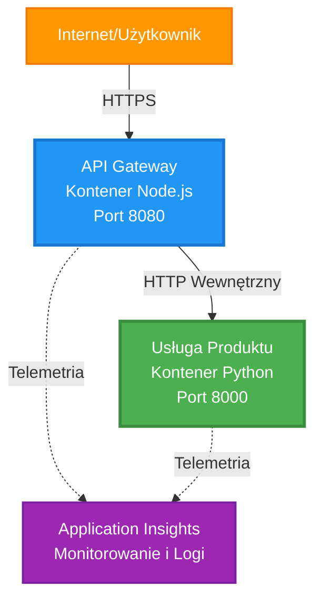
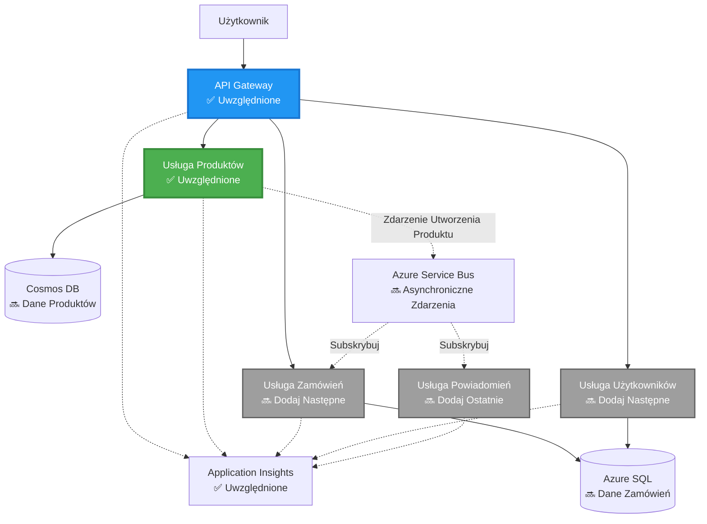
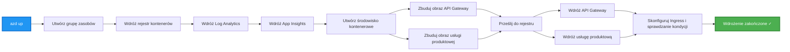
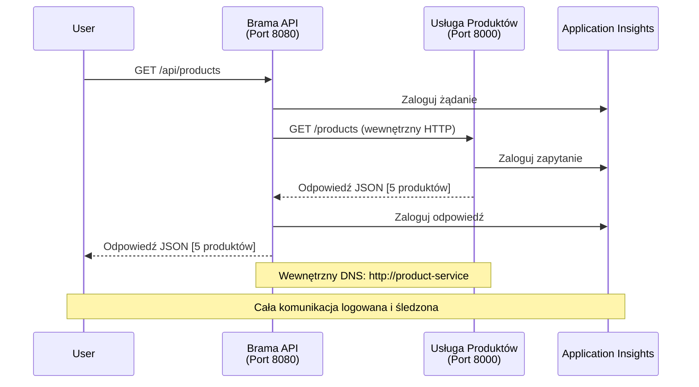

# Architektura Mikroserwisów - Przykład Aplikacji Kontenerowej

⏱️ **Szacowany czas**: 25-35 minut | 💰 **Szacowany koszt**: ~$50-100/miesiąc | ⭐ **Poziom trudności**: Zaawansowany

**📚 Ścieżka nauki:**
- ← Poprzedni: [Prosty Flask API](../../../../examples/container-app/simple-flask-api) - Podstawy pojedynczego kontenera
- 🎯 **Tu jesteś**: Architektura Mikroserwisów (podstawy z 2 usługami)
- → Następny: [Integracja AI](../../../../docs/ai-foundry) - Dodaj inteligencję do swoich usług
- 🏠 [Strona główna kursu](../../README.md)

---

**Uproszczona, ale funkcjonalna** architektura mikroserwisów wdrożona na Azure Container Apps za pomocą AZD CLI. Ten przykład pokazuje komunikację między usługami, orkiestrację kontenerów oraz monitorowanie w praktycznym układzie z 2 usługami.

> **📚 Podejście do nauki**: Ten przykład zaczyna się od minimalnej architektury z 2 usługami (API Gateway + Backend Service), którą można faktycznie wdrożyć i nauczyć się. Po opanowaniu tej podstawy, oferujemy wskazówki dotyczące rozbudowy do pełnego ekosystemu mikroserwisów.

## Czego się nauczysz

Po ukończeniu tego przykładu nauczysz się:
- Wdrażać wiele kontenerów na Azure Container Apps
- Implementować komunikację między usługami za pomocą wewnętrznej sieci
- Konfigurować skalowanie oparte na środowisku i sprawdzanie stanu
- Monitorować aplikacje rozproszone za pomocą Application Insights
- Rozumieć wzorce wdrażania mikroserwisów i najlepsze praktyki
- Rozwijać architekturę od prostych do bardziej złożonych układów

## Architektura

### Faza 1: Co budujemy (zawarte w tym przykładzie)


**Szczegóły komponentów:**

| Komponent | Cel | Dostęp | Zasoby |
|-----------|-----|--------|--------|
| **API Gateway** | Przekierowuje zewnętrzne żądania do usług backendowych | Publiczny (HTTPS) | 1 vCPU, 2GB RAM, 2-20 replik |
| **Product Service** | Zarządza katalogiem produktów z danymi w pamięci | Tylko wewnętrzny | 0.5 vCPU, 1GB RAM, 1-10 replik |
| **Application Insights** | Centralne logowanie i śledzenie rozproszone | Portal Azure | 1-2 GB/miesiąc przetwarzania danych |

**Dlaczego zaczynamy od prostego?**
- ✅ Szybkie wdrożenie i zrozumienie (25-35 minut)
- ✅ Nauka podstawowych wzorców mikroserwisów bez złożoności
- ✅ Działający kod, który można modyfikować i testować
- ✅ Niższy koszt nauki (~$50-100/miesiąc vs $300-1400/miesiąc)
- ✅ Budowanie pewności siebie przed dodaniem baz danych i kolejek wiadomości

**Analogicznie**: To jak nauka jazdy. Zaczynasz na pustym parkingu (2 usługi), opanowujesz podstawy, a potem przechodzisz do ruchu miejskiego (5+ usług z bazami danych).

### Faza 2: Rozbudowa w przyszłości (architektura referencyjna)

Po opanowaniu architektury z 2 usługami możesz ją rozbudować do:


Zobacz sekcję "Przewodnik rozbudowy" na końcu, aby uzyskać instrukcje krok po kroku.

## Uwzględnione funkcje

✅ **Odkrywanie usług**: Automatyczne odkrywanie DNS między kontenerami  
✅ **Równoważenie obciążenia**: Wbudowane równoważenie obciążenia między replikami  
✅ **Autoskalowanie**: Niezależne skalowanie każdej usługi na podstawie żądań HTTP  
✅ **Monitorowanie stanu**: Proby liveness i readiness dla obu usług  
✅ **Rozproszone logowanie**: Centralne logowanie za pomocą Application Insights  
✅ **Sieć wewnętrzna**: Bezpieczna komunikacja między usługami  
✅ **Orkiestracja kontenerów**: Automatyczne wdrażanie i skalowanie  
✅ **Aktualizacje bez przestojów**: Aktualizacje rolling z zarządzaniem wersjami  

## Wymagania wstępne

### Wymagane narzędzia

Przed rozpoczęciem upewnij się, że masz zainstalowane następujące narzędzia:

1. **[Azure Developer CLI (azd)](https://learn.microsoft.com/azure/developer/azure-developer-cli/install-azd)** (wersja 1.0.0 lub wyższa)  
   ```bash
   azd version
   # Oczekiwany wynik: wersja azd 1.0.0 lub wyższa
   ```

2. **[Azure CLI](https://learn.microsoft.com/cli/azure/install-azure-cli)** (wersja 2.50.0 lub wyższa)  
   ```bash
   az --version
   # Oczekiwany wynik: azure-cli 2.50.0 lub wyższy
   ```

3. **[Docker](https://www.docker.com/get-started)** (do lokalnego rozwoju/testowania - opcjonalnie)  
   ```bash
   docker --version
   # Oczekiwany wynik: wersja Dockera 20.10 lub wyższa
   ```

### Weryfikacja konfiguracji

Uruchom te polecenia, aby potwierdzić gotowość:

```bash
# Sprawdź Azure Developer CLI
azd version
# ✅ Oczekiwane: azd wersja 1.0.0 lub wyższa

# Sprawdź Azure CLI
az --version
# ✅ Oczekiwane: azure-cli 2.50.0 lub wyższa

# Sprawdź Docker (opcjonalne)
docker --version
# ✅ Oczekiwane: Docker wersja 20.10 lub wyższa
```

**Kryterium sukcesu**: Wszystkie polecenia zwracają numery wersji odpowiadające lub przekraczające minimalne wymagania.

### Wymagania Azure

- Aktywna **subskrypcja Azure** ([utwórz darmowe konto](https://azure.microsoft.com/free/))
- Uprawnienia do tworzenia zasobów w subskrypcji
- Rola **Contributor** w subskrypcji lub grupie zasobów

### Wymagana wiedza

To przykład na **poziomie zaawansowanym**. Powinieneś:
- Ukończyć [Prosty Flask API](../../../../examples/container-app/simple-flask-api) 
- Mieć podstawową wiedzę o architekturze mikroserwisów
- Znać podstawy REST API i HTTP
- Rozumieć koncepcje kontenerów

**Nowy w Container Apps?** Zacznij od [Prostego Flask API](../../../../examples/container-app/simple-flask-api), aby nauczyć się podstaw.

## Szybki start (krok po kroku)

### Krok 1: Klonowanie i nawigacja

```bash
git clone https://github.com/microsoft/AZD-for-beginners.git
cd AZD-for-beginners/examples/microservices
```

**✓ Sprawdzenie sukcesu**: Upewnij się, że widzisz `azure.yaml`:
```bash
ls
# Oczekiwane: README.md, azure.yaml, infra/, src/
```

### Krok 2: Uwierzytelnienie w Azure

```bash
azd auth login
```

Otworzy się przeglądarka do uwierzytelnienia w Azure. Zaloguj się swoimi danymi.

**✓ Sprawdzenie sukcesu**: Powinieneś zobaczyć:
```
Logged in to Azure.
```

### Krok 3: Inicjalizacja środowiska

```bash
azd init
```

**Pojawią się pytania**:
- **Nazwa środowiska**: Wprowadź krótką nazwę (np. `microservices-dev`)
- **Subskrypcja Azure**: Wybierz swoją subskrypcję
- **Lokalizacja Azure**: Wybierz region (np. `eastus`, `westeurope`)

**✓ Sprawdzenie sukcesu**: Powinieneś zobaczyć:
```
SUCCESS: New project initialized!
```

### Krok 4: Wdrożenie infrastruktury i usług

```bash
azd up
```

**Co się dzieje** (trwa 8-12 minut):


**✓ Sprawdzenie sukcesu**: Powinieneś zobaczyć:
```
SUCCESS: Your application was deployed to Azure in X minutes Y seconds.
Endpoint: https://api-gateway-<unique-id>.azurecontainerapps.io
```

**⏱️ Czas**: 8-12 minut

### Krok 5: Testowanie wdrożenia

```bash
# Pobierz punkt końcowy bramy
GATEWAY_URL=$(azd env get-values | grep API_GATEWAY_URL | cut -d '=' -f2 | tr -d '"')

# Przetestuj stan zdrowia API Gateway
curl $GATEWAY_URL/health
```

**✅ Oczekiwany wynik:**
```json
{
  "status": "healthy",
  "service": "api-gateway",
  "timestamp": "2025-11-19T10:30:00Z"
}
```

**Testowanie usługi produktów przez bramę**:
```bash
# Wymień produkty
curl $GATEWAY_URL/api/products
```

**✅ Oczekiwany wynik:**
```json
[
  {"id":1,"name":"Laptop","price":999.99,"stock":50},
  {"id":2,"name":"Mouse","price":29.99,"stock":200},
  {"id":3,"name":"Keyboard","price":79.99,"stock":150}
]
```

**✓ Sprawdzenie sukcesu**: Oba punkty końcowe zwracają dane JSON bez błędów.

---

**🎉 Gratulacje!** Wdrożyłeś architekturę mikroserwisów na Azure!

## Struktura projektu

Wszystkie pliki implementacyjne są zawarte—jest to kompletny, działający przykład:

```
microservices/
│
├── README.md                         # This file
├── azure.yaml                        # AZD configuration
├── .gitignore                        # Git ignore patterns
│
├── infra/                           # Infrastructure as Code (Bicep)
│   ├── main.bicep                   # Main orchestration
│   ├── abbreviations.json           # Naming conventions
│   ├── core/                        # Shared infrastructure
│   │   ├── container-apps-environment.bicep  # Container environment + registry
│   │   └── monitor.bicep            # Application Insights + Log Analytics
│   └── app/                         # Service definitions
│       ├── api-gateway.bicep        # API Gateway container app
│       └── product-service.bicep    # Product Service container app
│
└── src/                             # Application source code
    ├── api-gateway/                 # Node.js API Gateway
    │   ├── app.js                   # Express server with routing
    │   ├── package.json             # Node dependencies
    │   └── Dockerfile               # Container definition
    └── product-service/             # Python Product Service
        ├── main.py                  # Flask API with product data
        ├── requirements.txt         # Python dependencies
        └── Dockerfile               # Container definition
```

**Co robi każdy komponent:**

**Infrastruktura (infra/)**:
- `main.bicep`: Orkiestruje wszystkie zasoby Azure i ich zależności
- `core/container-apps-environment.bicep`: Tworzy środowisko Container Apps i Azure Container Registry
- `core/monitor.bicep`: Konfiguruje Application Insights do rozproszonego logowania
- `app/*.bicep`: Definicje poszczególnych aplikacji kontenerowych ze skalowaniem i sprawdzaniem stanu

**API Gateway (src/api-gateway/)**:
- Usługa publiczna, która przekierowuje żądania do usług backendowych
- Implementuje logowanie, obsługę błędów i przekazywanie żądań
- Pokazuje komunikację HTTP między usługami

**Product Service (src/product-service/)**:
- Usługa wewnętrzna z katalogiem produktów (dla uproszczenia w pamięci)
- REST API ze sprawdzaniem stanu
- Przykład wzorca mikroserwisu backendowego

## Przegląd usług

### API Gateway (Node.js/Express)

**Port**: 8080  
**Dostęp**: Publiczny (zewnętrzny ingress)  
**Cel**: Przekierowuje przychodzące żądania do odpowiednich usług backendowych  

**Punkty końcowe**:
- `GET /` - Informacje o usłudze
- `GET /health` - Punkt końcowy sprawdzania stanu
- `GET /api/products` - Przekierowanie do usługi produktów (lista wszystkich)
- `GET /api/products/:id` - Przekierowanie do usługi produktów (pobierz po ID)

**Kluczowe funkcje**:
- Przekierowanie żądań za pomocą axios
- Centralne logowanie
- Obsługa błędów i zarządzanie timeoutami
- Odkrywanie usług za pomocą zmiennych środowiskowych
- Integracja z Application Insights

**Fragment kodu** (`src/api-gateway/app.js`):
```javascript
// Komunikacja wewnętrzna usług
app.get('/api/products', async (req, res) => {
  const response = await axios.get(`${PRODUCT_SERVICE_URL}/products`, {
    timeout: 5000
  });
  res.json(response.data);
});
```

### Product Service (Python/Flask)

**Port**: 8000  
**Dostęp**: Tylko wewnętrzny (bez zewnętrznego ingressu)  
**Cel**: Zarządza katalogiem produktów z danymi w pamięci  

**Punkty końcowe**:
- `GET /` - Informacje o usłudze
- `GET /health` - Punkt końcowy sprawdzania stanu
- `GET /products` - Lista wszystkich produktów
- `GET /products/<id>` - Pobierz produkt po ID

**Kluczowe funkcje**:
- RESTful API z Flask
- Katalog produktów w pamięci (prosty, bez bazy danych)
- Monitorowanie stanu za pomocą probe
- Strukturalne logowanie
- Integracja z Application Insights

**Model danych**:
```python
{
  "id": 1,
  "name": "Laptop",
  "description": "High-performance laptop",
  "price": 999.99,
  "stock": 50
}
```

**Dlaczego tylko wewnętrzny?**
Usługa produktów nie jest publicznie dostępna. Wszystkie żądania muszą przechodzić przez API Gateway, co zapewnia:
- Bezpieczeństwo: Kontrolowany punkt dostępu
- Elastyczność: Możliwość zmiany backendu bez wpływu na klientów
- Monitorowanie: Centralne logowanie żądań

## Zrozumienie komunikacji między usługami

### Jak usługi komunikują się ze sobą


W tym przykładzie API Gateway komunikuje się z Product Service za pomocą **wewnętrznych wywołań HTTP**:

```javascript
// Brama API (src/api-gateway/app.js)
const PRODUCT_SERVICE_URL = process.env.PRODUCT_SERVICE_URL;

// Wykonaj wewnętrzne żądanie HTTP
const response = await axios.get(`${PRODUCT_SERVICE_URL}/products`);
```

**Kluczowe punkty**:

1. **Odkrywanie DNS**: Container Apps automatycznie zapewnia DNS dla usług wewnętrznych
   - FQDN usługi produktów: `product-service.internal.<environment>.azurecontainerapps.io`
   - Uproszczone jako: `http://product-service` (Container Apps rozwiązuje to)

2. **Brak publicznego dostępu**: Usługa produktów ma `external: false` w Bicep
   - Dostępna tylko w środowisku Container Apps
   - Nie można jej osiągnąć z internetu

3. **Zmienne środowiskowe**: URL usług są wstrzykiwane podczas wdrożenia
   - Bicep przekazuje wewnętrzny FQDN do bramy
   - Brak hardcodowanych URL w kodzie aplikacji

**Analogicznie**: To jak pokoje biurowe. API Gateway to recepcja (publiczna), a Product Service to pokój biurowy (tylko wewnętrzny). Odwiedzający muszą przejść przez recepcję, aby dotrzeć do jakiegokolwiek pokoju.

## Opcje wdrożenia

### Pełne wdrożenie (zalecane)

```bash
# Wdróż infrastrukturę i obie usługi
azd up
```

To wdraża:
1. Środowisko Container Apps
2. Application Insights
3. Container Registry
4. Kontener API Gateway
5. Kontener Product Service

**Czas**: 8-12 minut

### Wdrożenie pojedynczej usługi

```bash
# Wdróż tylko jedną usługę (po początkowym azd up)
azd deploy api-gateway

# Lub wdróż usługę produktu
azd deploy product-service
```

**Zastosowanie**: Gdy zaktualizowałeś kod w jednej usłudze i chcesz wdrożyć tylko tę usługę.

### Aktualizacja konfiguracji

```bash
# Zmień parametry skalowania
azd env set GATEWAY_MAX_REPLICAS 30

# Ponownie wdroż z nową konfiguracją
azd up
```

## Konfiguracja

### Konfiguracja skalowania

Obie usługi są skonfigurowane do autoskalowania opartego na HTTP w plikach Bicep:

**API Gateway**:
- Minimalna liczba replik: 2 (zawsze co najmniej 2 dla dostępności)
- Maksymalna liczba replik: 20
- Wyzwalacz skalowania: 50 równoczesnych żądań na replikę

**Product Service**:
- Minimalna liczba replik: 1 (może skalować się do zera, jeśli potrzebne)
- Maksymalna liczba replik: 10
- Wyzwalacz skalowania: 100 równoczesnych żądań na replikę

**Dostosowanie skalowania** (w `infra/app/*.bicep`):
```bicep
scale: {
  minReplicas: 1
  maxReplicas: 10
  rules: [
    {
      name: 'http-scale-rule'
      http: {
        metadata: {
          concurrentRequests: '100'  // Adjust this
        }
      }
    }
  ]
}
```

### Przydział zasobów

**API Gateway**:
- CPU: 1.0 vCPU
- Pamięć: 2 GiB
- Powód: Obsługuje cały ruch zewnętrzny

**Product Service**:
- CPU: 0.5 vCPU
- Pamięć: 1 GiB
- Powód: Lekka operacja w pamięci

### Sprawdzanie stanu

Obie usługi zawierają proby liveness i readiness:

```bicep
probes: [
  {
    type: 'Liveness'
    httpGet: {
      path: '/health'
      port: 8080
    }
    initialDelaySeconds: 10
    periodSeconds: 30
  }
  {
    type: 'Readiness'
    httpGet: {
      path: '/health'
      port: 8080
    }
    initialDelaySeconds: 5
    periodSeconds: 10
  }
]
```

**Co to oznacza**:
- **Liveness**: Jeśli sprawdzanie stanu się nie powiedzie, Container Apps restartuje kontener
- **Readiness**: Jeśli nie jest gotowy, Container Apps przestaje kierować ruch do tej repliki

## Monitorowanie i obserwowalność

### Wyświetlanie logów usług

```bash
# Przesyłaj logi z API Gateway
azd logs api-gateway --follow

# Wyświetl ostatnie logi usługi produktu
azd logs product-service --tail 100

# Wyświetl wszystkie logi z obu usług
azd logs --follow
```

**Oczekiwany wynik**:
```
[api-gateway] API Gateway listening on port 8080
[api-gateway] Product Service URL: http://product-service
[api-gateway] GET /api/products 200 - 45ms
[product-service] Retrieved 5 products
```

### Zapytania Application Insights

Uzyskaj dostęp do Application Insights w Azure Portal, a następnie uruchom te zapytania:

**Znajdź wolne żądania**:
```kusto
requests
| where timestamp > ago(1h)
| where duration > 1000  // Requests taking >1 second
| summarize count() by name, cloud_RoleName
| order by count_ desc
```

**Śledź wywołania między usługami**:
```kusto
dependencies
| where timestamp > ago(1h)
| where type == "Http"
| project timestamp, name, target, duration, success
| order by timestamp desc
```

**Wskaźnik błędów według usługi**:
```kusto
exceptions
| where timestamp > ago(24h)
| summarize errorCount = count() by cloud_RoleName, type
| order by errorCount desc
```

**Wolumen żądań w czasie**:
```kusto
requests
| where timestamp > ago(1h)
| summarize requestCount = count() by bin(timestamp, 5m), cloud_RoleName
| render timechart
```

### Dostęp do dashboardu monitorowania

```bash
# Pobierz szczegóły Application Insights
azd env get-values | grep APPLICATIONINSIGHTS

# Otwórz monitorowanie w Azure Portal
az monitor app-insights component show \
  --app $(azd env get-values | grep APPLICATIONINSIGHTS_CONNECTION_STRING | cut -d '=' -f2) \
  --resource-group $(azd env get-values | grep AZURE_RESOURCE_GROUP | cut -d '=' -f2) \
  --query "appId" -o tsv
```

### Metryki na żywo

1. Przejdź do Application Insights w Azure Portal
2. Kliknij "Live Metrics"
3. Zobacz żądania w czasie rzeczywistym, błędy i wydajność
4. Przetestuj, uruchamiając: `curl $(azd env get-values | grep API_GATEWAY_URL | cut -d '=' -f2 | tr -d '"')/api/products`

## Ćwiczenia praktyczne

### Ćwiczenie 1: Dodaj nowy punkt końcowy produktu ⭐ (Łatwe)

**Cel**: Dodaj punkt końcowy POST do tworzenia nowych produktów

**Punkt startowy**: `src/product-service/main.py`

**Kroki**:

1. Dodaj ten punkt końcowy po funkcji `get_product` w `main.py`:

```python
@app.route('/products', methods=['POST'])
def create_product():
    """Create a new product"""
    data = request.get_json()
    
    # Zweryfikuj wymagane pola
    if not data or 'name' not in data or 'price' not in data:
        return jsonify({'error': 'Missing required fields: name, price'}), 400
    
    new_id = max(p['id'] for p in products) + 1
    new_product = {
        'id': new_id,
        'name': data['name'],
        'description': data.get('description', ''),
        'price': float(data['price']),
        'stock': int(data.get('stock', 0))
    }
    products.append(new_product)
    logger.info(f"Created product {new_id}")
    return jsonify(new_product), 201
```

2. Dodaj trasę POST do API Gateway (`src/api-gateway/app.js`):

```javascript
// Dodaj to po trasie GET /api/products
app.post('/api/products', async (req, res) => {
  try {
    console.log(`Forwarding POST request to ${PRODUCT_SERVICE_URL}/products`);
    const response = await axios.post(`${PRODUCT_SERVICE_URL}/products`, req.body, {
      timeout: 5000
    });
    res.status(201).json(response.data);
  } catch (error) {
    console.error('Error calling product service:', error.message);
    res.status(503).json({
      error: 'Product service unavailable',
      message: error.message
    });
  }
});
```

3. Ponownie wdroż obie usługi:

```bash
azd deploy product-service
azd deploy api-gateway
```

4. Przetestuj nowy endpoint:

```bash
GATEWAY_URL=$(azd env get-values | grep API_GATEWAY_URL | cut -d '=' -f2 | tr -d '"')

# Utwórz nowy produkt
curl -X POST $GATEWAY_URL/api/products \
  -H "Content-Type: application/json" \
  -d '{"name":"USB Cable","price":9.99,"stock":500}'
```

**✅ Oczekiwany wynik:**
```json
{"id":6,"name":"USB Cable","description":"","price":9.99,"stock":500}
```

5. Zweryfikuj, czy pojawia się na liście:

```bash
curl $GATEWAY_URL/api/products
# Powinno teraz wyświetlać 6 produktów, w tym nowy kabel USB
```

**Kryteria sukcesu**:
- ✅ Żądanie POST zwraca HTTP 201
- ✅ Nowy produkt pojawia się na liście GET /api/products
- ✅ Produkt ma automatycznie inkrementowane ID

**Czas**: 10-15 minut

---

### Ćwiczenie 2: Modyfikacja zasad autoskalowania ⭐⭐ (Średni poziom)

**Cel**: Zmodyfikuj usługę Product Service, aby skalowała się bardziej agresywnie

**Punkt startowy**: `infra/app/product-service.bicep`

**Kroki**:

1. Otwórz `infra/app/product-service.bicep` i znajdź blok `scale` (około linii 95)

2. Zmień z:
```bicep
scale: {
  minReplicas: 1
  maxReplicas: 10
  rules: [
    {
      name: 'http-scale-rule'
      http: {
        metadata: {
          concurrentRequests: '100'  // OLD
        }
      }
    }
  ]
}
```

Na:
```bicep
scale: {
  minReplicas: 2  // Always have 2 running
  maxReplicas: 20  // Allow more scaling
  rules: [
    {
      name: 'http-scale-rule'
      http: {
        metadata: {
          concurrentRequests: '20'  // Scale at lower threshold
        }
      }
    }
  ]
}
```

3. Ponownie wdroż infrastrukturę:

```bash
azd up
```

4. Zweryfikuj nową konfigurację skalowania:

```bash
az containerapp show \
  --name $(azd env get-values | grep PRODUCT_SERVICE | head -1 | cut -d '/' -f5) \
  --resource-group $(azd env get-values | grep AZURE_RESOURCE_GROUP | cut -d '=' -f2 | tr -d '"') \
  --query "properties.template.scale" -o json
```

**✅ Oczekiwany wynik:**
```json
{
  "minReplicas": 2,
  "maxReplicas": 20,
  "rules": [...]
}
```

5. Przetestuj autoskalowanie pod obciążeniem:

```bash
# Generuj równoczesne żądania
for i in {1..500}; do curl $GATEWAY_URL/api/products & done

# Obserwuj skalowanie
azd logs product-service --follow
# Szukaj: Zdarzenia skalowania aplikacji kontenerowych
```

**Kryteria sukcesu**:
- ✅ Usługa Product Service zawsze działa z co najmniej 2 replikami
- ✅ Pod obciążeniem skaluje się do więcej niż 2 replik
- ✅ Portal Azure pokazuje nowe zasady skalowania

**Czas**: 15-20 minut

---

### Ćwiczenie 3: Dodanie niestandardowego zapytania monitorującego ⭐⭐ (Średni poziom)

**Cel**: Utwórz niestandardowe zapytanie w Application Insights, aby śledzić wydajność API produktu

**Kroki**:

1. Przejdź do Application Insights w Azure Portal:
   - Otwórz Azure Portal
   - Znajdź swoją grupę zasobów (rg-microservices-*)
   - Kliknij zasób Application Insights

2. Kliknij "Logs" w menu po lewej stronie

3. Utwórz to zapytanie:

```kusto
requests
| where timestamp > ago(1h)
| where name contains "products"
| summarize 
    RequestCount = count(),
    AvgDuration = avg(duration),
    P95Duration = percentile(duration, 95),
    SuccessRate = 100.0 * countif(success == true) / count()
  by bin(timestamp, 5m)
| render timechart
```

4. Kliknij "Run", aby uruchomić zapytanie

5. Zapisz zapytanie:
   - Kliknij "Save"
   - Nazwa: "Product API Performance"
   - Kategoria: "Performance"

6. Wygeneruj ruch testowy:

```bash
for i in {1..100}; do curl $GATEWAY_URL/api/products; sleep 1; done
```

7. Odśwież zapytanie, aby zobaczyć dane

**✅ Oczekiwany wynik:**
- Wykres pokazujący liczbę żądań w czasie
- Średni czas trwania < 500 ms
- Wskaźnik sukcesu = 100%
- Przedziały czasowe co 5 minut

**Kryteria sukcesu**:
- ✅ Zapytanie pokazuje 100+ żądań
- ✅ Wskaźnik sukcesu wynosi 100%
- ✅ Średni czas trwania < 500 ms
- ✅ Wykres wyświetla przedziały czasowe co 5 minut

**Efekt nauki**: Zrozumienie, jak monitorować wydajność usług za pomocą niestandardowych zapytań

**Czas**: 10-15 minut

---

### Ćwiczenie 4: Implementacja logiki ponawiania żądań ⭐⭐⭐ (Zaawansowane)

**Cel**: Dodaj logikę ponawiania żądań w API Gateway, gdy usługa Product Service jest tymczasowo niedostępna

**Punkt startowy**: `src/api-gateway/app.js`

**Kroki**:

1. Zainstaluj bibliotekę do ponawiania żądań:

```bash
cd src/api-gateway
npm install axios-retry --save
cd ../..
```

2. Zaktualizuj `src/api-gateway/app.js` (dodaj po imporcie axios):

```javascript
const axiosRetry = require('axios-retry');

// Skonfiguruj logikę ponawiania
axiosRetry(axios, {
  retries: 3,
  retryDelay: (retryCount) => {
    return retryCount * 1000; // 1s, 2s, 3s
  },
  retryCondition: (error) => {
    // Ponawiaj w przypadku błędów sieciowych lub odpowiedzi 5xx
    return axiosRetry.isNetworkOrIdempotentRequestError(error) ||
           (error.response && error.response.status >= 500);
  }
});

console.log('Retry logic configured: 3 retries with exponential backoff');
```

3. Ponownie wdroż API Gateway:

```bash
azd deploy api-gateway
```

4. Przetestuj zachowanie ponawiania żądań, symulując awarię usługi:

```bash
# Skaluj usługę produktu do 0 (symuluj awarię)
az containerapp update \
  --name $(azd env get-values | grep PRODUCT_SERVICE | head -1 | cut -d '/' -f5) \
  --resource-group $(azd env get-values | grep AZURE_RESOURCE_GROUP | cut -d '=' -f2 | tr -d '"') \
  --min-replicas 0 \
  --max-replicas 0

# Spróbuj uzyskać dostęp do produktów (spróbuje ponownie 3 razy)
time curl -v $GATEWAY_URL/api/products
# Obserwuj: Odpowiedź zajmuje ~6 sekund (1s + 2s + 3s ponowne próby)

# Przywróć usługę produktu
az containerapp update \
  --name $(azd env get-values | grep PRODUCT_SERVICE | head -1 | cut -d '/' -f5) \
  --resource-group $(azd env get-values | grep AZURE_RESOURCE_GROUP | cut -d '=' -f2 | tr -d '"') \
  --min-replicas 1 \
  --max-replicas 10
```

5. Sprawdź logi ponawiania żądań:

```bash
azd logs api-gateway --tail 50
# Szukaj: Wiadomości o próbie ponowienia
```

**✅ Oczekiwane zachowanie:**
- Żądania są ponawiane 3 razy przed niepowodzeniem
- Każde ponowienie czeka dłużej (1s, 2s, 3s)
- Żądania są udane po ponownym uruchomieniu usługi
- Logi pokazują próby ponawiania

**Kryteria sukcesu**:
- ✅ Żądania są ponawiane 3 razy przed niepowodzeniem
- ✅ Każde ponowienie czeka dłużej (eksponencjalne opóźnienie)
- ✅ Żądania są udane po ponownym uruchomieniu usługi
- ✅ Logi pokazują próby ponawiania

**Efekt nauki**: Zrozumienie wzorców odporności w mikrousługach (obwody, ponawianie, limity czasu)

**Czas**: 20-25 minut

---

## Punkt kontrolny wiedzy

Po ukończeniu tego przykładu zweryfikuj swoją wiedzę:

### 1. Komunikacja między usługami ✓

Sprawdź swoją wiedzę:
- [ ] Czy potrafisz wyjaśnić, jak API Gateway odnajduje usługę Product Service? (Oparte na DNS)
- [ ] Co się dzieje, gdy usługa Product Service jest niedostępna? (Gateway zwraca błąd 503)
- [ ] Jak dodać trzecią usługę? (Utwórz nowy plik Bicep, dodaj do main.bicep, utwórz folder src)

**Weryfikacja praktyczna:**
```bash
# Symuluj awarię usługi
az containerapp update --name <product-service-name> --min-replicas 0 --max-replicas 0
curl $GATEWAY_URL/api/products
# ✅ Oczekiwane: 503 Usługa niedostępna

# Przywróć usługę
az containerapp update --name <product-service-name> --min-replicas 1 --max-replicas 10
```

### 2. Monitorowanie i obserwowalność ✓

Sprawdź swoją wiedzę:
- [ ] Gdzie można zobaczyć rozproszone logi? (Application Insights w Azure Portal)
- [ ] Jak śledzić wolne żądania? (Zapytanie Kusto: `requests | where duration > 1000`)
- [ ] Czy potrafisz zidentyfikować, która usługa spowodowała błąd? (Sprawdź pole `cloud_RoleName` w logach)

**Weryfikacja praktyczna:**
```bash
# Wygeneruj symulację wolnego żądania
curl "$GATEWAY_URL/api/products?delay=2000"

# Zapytaj Application Insights o wolne żądania
# Przejdź do Azure Portal → Application Insights → Logs
# Uruchom: requests | where duration > 1000 | project timestamp, name, duration, cloud_RoleName
```

### 3. Skalowanie i wydajność ✓

Sprawdź swoją wiedzę:
- [ ] Co wyzwala autoskalowanie? (Zasady dotyczące równoczesnych żądań HTTP: 50 dla gateway, 100 dla produktu)
- [ ] Ile replik działa obecnie? (Sprawdź za pomocą `az containerapp revision list`)
- [ ] Jak skalować usługę Product Service do 5 replik? (Zaktualizuj minReplicas w Bicep)

**Weryfikacja praktyczna:**
```bash
# Generuj obciążenie, aby przetestować autoskalowanie
for i in {1..1000}; do curl $GATEWAY_URL/api/products & done

# Obserwuj wzrost liczby replik
azd logs api-gateway --follow
# ✅ Oczekiwane: Zobacz zdarzenia skalowania w logach
```

**Kryteria sukcesu**: Potrafisz odpowiedzieć na wszystkie pytania i zweryfikować za pomocą praktycznych poleceń.

---

## Analiza kosztów

### Szacowane miesięczne koszty (dla tego przykładu z 2 usługami)

| Zasób | Konfiguracja | Szacowany koszt |
|-------|--------------|-----------------|
| API Gateway | 2-20 replik, 1 vCPU, 2GB RAM | $30-150 |
| Product Service | 1-10 replik, 0.5 vCPU, 1GB RAM | $15-75 |
| Container Registry | Podstawowy poziom | $5 |
| Application Insights | 1-2 GB/miesiąc | $5-10 |
| Log Analytics | 1 GB/miesiąc | $3 |
| **Razem** | | **$58-243/miesiąc** |

### Podział kosztów według użycia

**Mały ruch** (testowanie/nauka): ~60 USD/miesiąc
- API Gateway: 2 repliki × 24/7 = $30
- Product Service: 1 replika × 24/7 = $15
- Monitorowanie + Rejestr = $13

**Średni ruch** (mała produkcja): ~120 USD/miesiąc
- API Gateway: średnio 5 replik = $75
- Product Service: średnio 3 repliki = $45
- Monitorowanie + Rejestr = $13

**Duży ruch** (okresy szczytowe): ~240 USD/miesiąc
- API Gateway: średnio 15 replik = $225
- Product Service: średnio 8 replik = $120
- Monitorowanie + Rejestr = $13

### Wskazówki dotyczące optymalizacji kosztów

1. **Skalowanie do zera w środowisku deweloperskim**:
   ```bicep
   scale: {
     minReplicas: 0  // Save $30-40/month when not in use
     maxReplicas: 10
   }
   ```

2. **Użyj planu konsumpcyjnego dla Cosmos DB** (gdy go dodasz):
   - Płać tylko za to, co używasz
   - Brak minimalnych opłat

3. **Ustaw próbkowanie w Application Insights**:
   ```javascript
   appInsights.defaultClient.config.samplingPercentage = 50; // Próbkuj 50% żądań
   ```

4. **Usuń zasoby, gdy nie są potrzebne**:
   ```bash
   azd down --force --purge
   ```

### Opcje darmowego poziomu

Do nauki/testowania rozważ:
- ✅ Użyj darmowych kredytów Azure ($200 przez pierwsze 30 dni dla nowych kont)
- ✅ Utrzymuj minimalną liczbę replik (oszczędza ~50% kosztów)
- ✅ Usuń po testach (brak opłat bieżących)
- ✅ Skaluj do zera między sesjami nauki

**Przykład**: Uruchomienie tego przykładu przez 2 godziny/dzień × 30 dni = ~5 USD/miesiąc zamiast 60 USD/miesiąc

---

## Szybki przewodnik rozwiązywania problemów

### Problem: `azd up` nie powiodło się z komunikatem "Subscription not found"

**Rozwiązanie**:
```bash
# Zaloguj się ponownie z wyraźną subskrypcją
az account set --subscription <your-subscription-id>
azd env set AZURE_SUBSCRIPTION_ID <your-subscription-id>
azd up
```

### Problem: API Gateway zwraca 503 "Product service unavailable"

**Diagnoza**:
```bash
# Sprawdź logi serwisu produktu
azd logs product-service --tail 50

# Sprawdź stan serwisu produktu
az containerapp show \
  --name $(azd env get-values | grep PRODUCT_SERVICE | head -1 | cut -d '/' -f5) \
  --resource-group $(azd env get-values | grep AZURE_RESOURCE_GROUP | cut -d '=' -f2 | tr -d '"') \
  --query "properties.runningStatus"
```

**Typowe przyczyny**:
1. Usługa Product Service nie uruchomiła się (sprawdź logi pod kątem błędów Pythona)
2. Niepowodzenie testu kondycji (zweryfikuj, czy endpoint `/health` działa)
3. Niepowodzenie budowy obrazu kontenera (sprawdź rejestr pod kątem obrazu)

### Problem: Autoskalowanie nie działa

**Diagnoza**:
```bash
# Sprawdź bieżącą liczbę replik
az containerapp revision list \
  --name $(azd env get-values | grep API_GATEWAY | head -1 | cut -d '/' -f5) \
  --resource-group $(azd env get-values | grep AZURE_RESOURCE_GROUP | cut -d '=' -f2 | tr -d '"') \
  --query "[].properties.replicas"

# Wygeneruj obciążenie do testu
for i in {1..1000}; do curl $GATEWAY_URL/api/products & done

# Obserwuj zdarzenia skalowania
azd logs api-gateway --follow | grep -i scale
```

**Typowe przyczyny**:
1. Obciążenie nie jest wystarczająco wysokie, aby wyzwolić regułę skalowania (potrzebne >50 równoczesnych żądań)
2. Osiągnięto maksymalną liczbę replik (sprawdź konfigurację Bicep)
3. Błędna konfiguracja reguły skalowania w Bicep (zweryfikuj wartość concurrentRequests)

### Problem: Application Insights nie pokazuje logów

**Diagnoza**:
```bash
# Zweryfikuj, czy ustawiono ciąg połączenia
azd env get-values | grep APPLICATIONINSIGHTS

# Sprawdź, czy usługi wysyłają telemetrię
az monitor app-insights component show \
  --app $(azd env get-values | grep APPLICATIONINSIGHTS_NAME | cut -d '=' -f2 | tr -d '"') \
  --resource-group $(azd env get-values | grep AZURE_RESOURCE_GROUP | cut -d '=' -f2 | tr -d '"') \
  --query "properties.InstrumentationKey"
```

**Typowe przyczyny**:
1. Ciąg połączenia nie został przekazany do kontenera (sprawdź zmienne środowiskowe)
2. SDK Application Insights nie jest skonfigurowane (zweryfikuj importy w kodzie)
3. Zapora blokuje telemetrię (rzadkie, sprawdź reguły sieciowe)

### Problem: Budowa Dockera lokalnie nie powiodła się

**Diagnoza**:
```bash
# Testuj budowę bramy API
cd src/api-gateway
docker build -t test-gateway .

# Testuj budowę usługi produktu
cd ../product-service
docker build -t test-product .
```

**Typowe przyczyny**:
1. Brakujące zależności w package.json/requirements.txt
2. Błędy składni w Dockerfile
3. Problemy z siecią podczas pobierania zależności

**Wciąż masz problem?** Zobacz [Przewodnik po typowych problemach](../../docs/troubleshooting/common-issues.md) lub [Rozwiązywanie problemów z Azure Container Apps](https://learn.microsoft.com/azure/container-apps/troubleshooting)

---

## Czyszczenie zasobów

Aby uniknąć bieżących opłat, usuń wszystkie zasoby:

```bash
azd down --force --purge
```

**Potwierdzenie**:
```
? Total resources to delete: 6, are you sure you want to continue? (y/N)
```

Wpisz `y`, aby potwierdzić.

**Co zostanie usunięte**:
- Środowisko Container Apps
- Obie aplikacje kontenerowe (gateway i product service)
- Rejestr kontenerów
- Application Insights
- Log Analytics Workspace
- Grupa zasobów

**✓ Weryfikacja czyszczenia**:
```bash
az group list --query "[?starts_with(name,'rg-microservices')]" --output table
```

Powinno zwrócić pustą listę.

---

## Przewodnik rozszerzenia: Od 2 do 5+ usług

Gdy opanujesz tę architekturę z 2 usługami, oto jak ją rozszerzyć:

### Faza 1: Dodanie trwałości bazy danych (następny krok)

**Dodaj Cosmos DB dla usługi Product Service**:

1. Utwórz `infra/core/cosmos.bicep`:
   ```bicep
   resource cosmosAccount 'Microsoft.DocumentDB/databaseAccounts@2023-04-15' = {
     name: name
     location: location
     kind: 'GlobalDocumentDB'
     properties: {
       databaseAccountOfferType: 'Standard'
       consistencyPolicy: { defaultConsistencyLevel: 'Session' }
       locations: [{ locationName: location, failoverPriority: 0 }]
     }
   }
   ```

2. Zaktualizuj usługę produktu, aby używała Azure Cosmos DB Python SDK zamiast danych w pamięci

3. Szacowany dodatkowy koszt: ~25 USD/miesiąc (serverless)

### Faza 2: Dodanie trzeciej usługi (Zarządzanie zamówieniami)

**Utwórz usługę Order Service**:

1. Nowy folder: `src/order-service/` (Python/Node.js/C#)
2. Nowy plik Bicep: `infra/app/order-service.bicep`
3. Zaktualizuj API Gateway, aby kierował `/api/orders`
4. Dodaj Azure SQL Database do przechowywania zamówień

**Architektura staje się**:
```
API Gateway → Product Service (Cosmos DB)
           → Order Service (Azure SQL)
```

### Faza 3: Dodanie komunikacji asynchronicznej (Service Bus)

**Wdrożenie architektury opartej na zdarzeniach**:

1. Dodaj Azure Service Bus: `infra/core/servicebus.bicep`
2. Usługa Product Service publikuje zdarzenia "ProductCreated"
3. Usługa Order Service subskrybuje zdarzenia produktów
4. Dodaj usługę Notification Service do przetwarzania zdarzeń

**Wzorzec**: Żądanie/odpowiedź (HTTP) + Oparte na zdarzeniach (Service Bus)

### Faza 4: Dodanie uwierzytelniania użytkowników

**Wdrożenie usługi User Service**:

1. Utwórz `src/user-service/` (Go/Node.js)
2. Dodaj Azure AD B2C lub niestandardowe uwierzytelnianie JWT
3. API Gateway weryfikuje tokeny przed przekierowaniem
4. Usługi sprawdzają uprawnienia użytkowników

### Faza 5: Gotowość produkcyjna

**Dodaj te komponenty**:
- ✅ Azure Front Door (globalne równoważenie obciążenia)
- ✅ Azure Key Vault (zarządzanie sekretami)
- ✅ Azure Monitor Workbooks (niestandardowe pulpity)
- ✅ Pipeline CI/CD (GitHub Actions)
- ✅ Wdrożenia Blue-Green
- ✅ Zarządzana tożsamość dla wszystkich usług

**Pełny koszt architektury produkcyjnej**: ~300-1,400 USD/miesiąc

---

## Dowiedz się więcej

### Powiązana dokumentacja
- [Dokumentacja Azure Container Apps](https://learn.microsoft.com/azure/container-apps/)
- [Przewodnik po architekturze mikrousług](https://learn.microsoft.com/azure/architecture/guide/architecture-styles/microservices)
- [Application Insights dla rozproszonego śledzenia](https://learn.microsoft.com/azure/azure-monitor/app/distributed-tracing)
- [Dokumentacja Azure Developer CLI](https://learn.microsoft.com/azure/developer/azure-developer-cli/)

### Kolejne kroki w tym kursie
- ← Poprzednie: [Prosty Flask API](../../../../examples/container-app/simple-flask-api) - Przykład dla początkujących z jedną usługą
- → Następne: [Przewodnik integracji AI](../../../../docs/ai-foundry) - Dodaj możliwości AI
- 🏠 [Strona główna kursu](../../README.md)

### Porównanie: Kiedy używać czego

| Funkcja | Pojedynczy kontener | Mikrousługi (ten przykład) | Kubernetes (AKS) |
|---------|---------------------|---------------------------|------------------|
| **Zastosowanie** | Proste aplikacje | Złożone aplikacje | Aplikacje korporacyjne |
| **Skalowalność** | Pojedyncza usługa | Skalowanie na poziomie usługi | Maksymalna elastyczność |
| **Złożoność** | Niska | Średnia | Wysoka |
| **Rozmiar zespołu** | 1-3 deweloperów | 3-10 deweloperów | 10+ deweloperów |
| **Koszt** | ~15-50 USD/miesiąc | ~60-250 USD/miesiąc | ~150-500 USD/miesiąc |
| **Czas wdrożenia** | 5-10 minut | 8-12 minut | 15-30 minut |
| **Najlepsze dla** | MVP, prototypy | Aplikacje produkcyjne | Multi-cloud, zaawansowane sieci |

**Rekomendacja**: Zacznij od Container Apps (ten przykład), przejdź do AKS tylko jeśli potrzebujesz funkcji specyficznych dla Kubernetes.

---

## Najczęściej zadawane pytania

**P: Dlaczego tylko 2 usługi zamiast 5+?**  
O: Edukacyjny postęp. Opanuj podstawy (komunikacja między usługami, monitorowanie, skalowanie) na prostym przykładzie, zanim dodasz złożoność. Wzorce, których się tutaj nauczysz, mają zastosowanie w architekturach z 100 usługami.

**P: Czy mogę samodzielnie dodać więcej usług?**  
O: Oczywiście! Skorzystaj z przewodnika rozbudowy powyżej. Każda nowa usługa podąża za tym samym schematem: utwórz folder src, utwórz plik Bicep, zaktualizuj azure.yaml, wdroż.

**P: Czy to jest gotowe do produkcji?**  
O: To solidna podstawa. Do produkcji dodaj: zarządzaną tożsamość, Key Vault, trwałe bazy danych, pipeline CI/CD, alerty monitorowania i strategię tworzenia kopii zapasowych.

**P: Dlaczego nie użyć Dapr lub innego service mesh?**  
O: Zachowaj prostotę dla nauki. Gdy zrozumiesz natywną sieć Container Apps, możesz dodać Dapr dla zaawansowanych scenariuszy (zarządzanie stanem, pub/sub, powiązania).

**P: Jak debugować lokalnie?**  
O: Uruchom usługi lokalnie za pomocą Dockera:  
```bash
cd src/api-gateway
docker build -t local-gateway .
docker run -p 8080:8080 -e PRODUCT_SERVICE_URL=http://localhost:8000 local-gateway
```
  
**P: Czy mogę używać różnych języków programowania?**  
O: Tak! Ten przykład pokazuje Node.js (gateway) + Python (usługa produktu). Możesz mieszać dowolne języki działające w kontenerach: C#, Go, Java, Ruby, PHP itd.

**P: Co jeśli nie mam kredytów Azure?**  
O: Skorzystaj z darmowego poziomu Azure (pierwsze 30 dni dla nowych kont daje $200 kredytów) lub wdrażaj na krótkie okresy testowe i natychmiast usuwaj. Ten przykład kosztuje ~2$/dzień.

**P: Czym to się różni od Azure Kubernetes Service (AKS)?**  
O: Container Apps jest prostsze (nie wymaga wiedzy o Kubernetes), ale mniej elastyczne. AKS daje pełną kontrolę nad Kubernetes, ale wymaga większej wiedzy. Zacznij od Container Apps, przejdź do AKS, jeśli zajdzie taka potrzeba.

**P: Czy mogę używać tego z istniejącymi usługami Azure?**  
O: Tak! Możesz połączyć się z istniejącymi bazami danych, kontami magazynowymi, Service Bus itd. Zaktualizuj pliki Bicep, aby odwoływać się do istniejących zasobów zamiast tworzyć nowe.

---

> **🎓 Podsumowanie ścieżki nauki**: Nauczyłeś się wdrażać architekturę wielousługową z automatycznym skalowaniem, wewnętrzną siecią, scentralizowanym monitorowaniem i wzorcami gotowymi do produkcji. Ta podstawa przygotowuje Cię do złożonych systemów rozproszonych i architektur mikroserwisów dla przedsiębiorstw.

**📚 Nawigacja po kursie:**
- ← Poprzedni: [Prosta API Flask](../../../../examples/container-app/simple-flask-api)
- → Następny: [Przykład integracji z bazą danych](../../../../database-app)
- 🏠 [Strona główna kursu](../../README.md)
- 📖 [Najlepsze praktyki Container Apps](../../docs/deployment/deployment-guide.md)

---

**✨ Gratulacje!** Ukończyłeś przykład mikroserwisów. Teraz rozumiesz, jak budować, wdrażać i monitorować aplikacje rozproszone na Azure Container Apps. Gotowy na dodanie możliwości AI? Sprawdź [Przewodnik integracji AI](../../../../docs/ai-foundry)!

---

<!-- CO-OP TRANSLATOR DISCLAIMER START -->
**Zastrzeżenie**:  
Ten dokument został przetłumaczony za pomocą usługi tłumaczenia AI [Co-op Translator](https://github.com/Azure/co-op-translator). Chociaż staramy się zapewnić dokładność, prosimy pamiętać, że automatyczne tłumaczenia mogą zawierać błędy lub nieścisłości. Oryginalny dokument w jego rodzimym języku powinien być uznawany za autorytatywne źródło. W przypadku informacji krytycznych zaleca się skorzystanie z profesjonalnego tłumaczenia przez człowieka. Nie ponosimy odpowiedzialności za jakiekolwiek nieporozumienia lub błędne interpretacje wynikające z użycia tego tłumaczenia.
<!-- CO-OP TRANSLATOR DISCLAIMER END -->