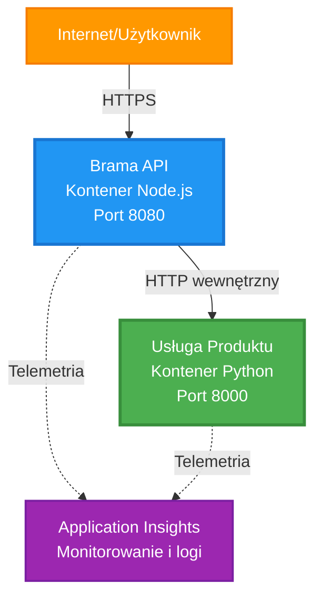
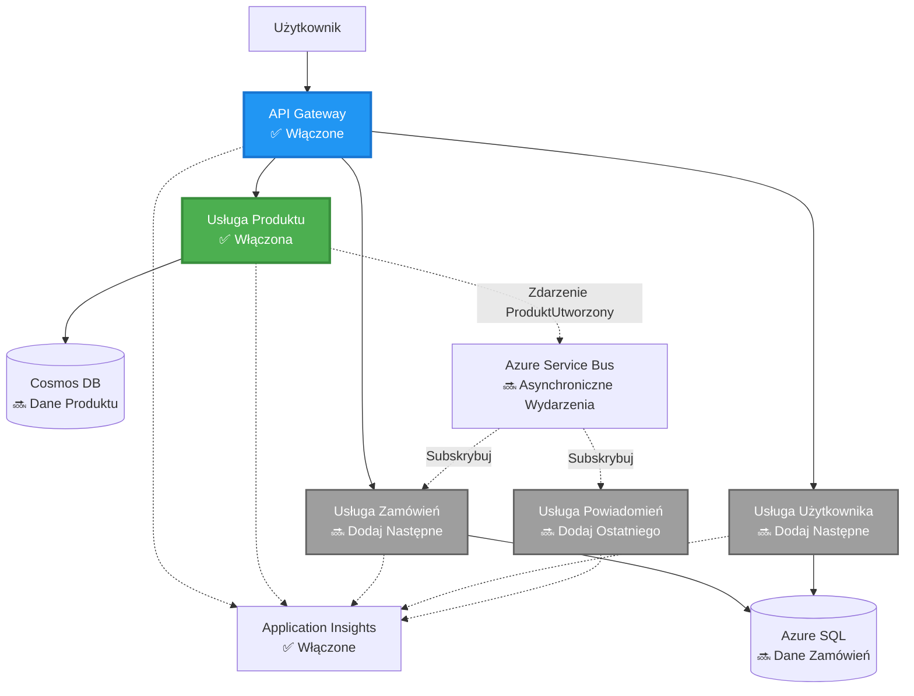
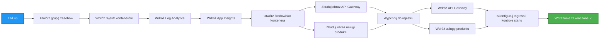
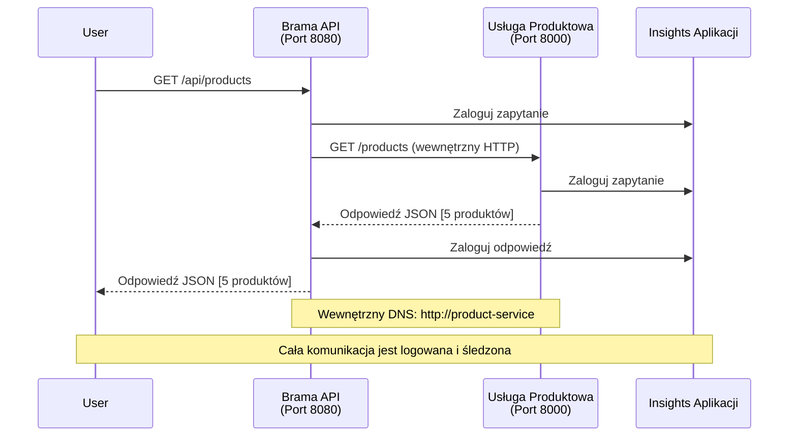

# Architektura Mikrousług – Przykład Aplikacji Kontenerowej

⏱️ **Szacowany czas**: 25-35 minut | 💰 **Szacowany koszt**: ~50-100 USD/miesiąc | ⭐ **Złożoność**: Zaawansowany

**📚 Ścieżka Nauki:**  
- ← Poprzedni: [Proste API Flask](../../../../examples/container-app/simple-flask-api) – podstawy pojedynczego kontenera  
- 🎯 **Jesteś tutaj**: Architektura mikrousług (podstawa 2-serwisowa)  
- → Następny: [Integracja AI](../../../../docs/ai-foundry) – Dodaj inteligencję do swoich usług  
- 🏠 [Strona główna kursu](../../README.md)

---

**Uproszczona lecz funkcjonalna** architektura mikrousług wdrożona w Azure Container Apps za pomocą AZD CLI. Ten przykład demonstruje komunikację serwis-serwis, orkiestrację kontenerów oraz monitorowanie na praktycznym przykładzie z dwoma usługami.

> **📚 Podejście do nauki:** Ten przykład zaczyna się od minimalnej architektury dwusystemowej (API Gateway + Backend Service), którą możesz faktycznie wdrożyć i z niej się uczyć. Po opanowaniu podstaw przedstawiamy wskazówki dotyczące rozszerzenia do pełnego ekosystemu mikrousług.

## Czego się nauczysz

Po ukończeniu tego przykładu:

- Wdrożysz wiele kontenerów do Azure Container Apps  
- Zaimplementujesz komunikację serwis-serwis z wykorzystaniem sieci wewnętrznej  
- Skonfigurujesz skalowanie oparte na środowisku oraz kontrole stanu zdrowia  
- Monitorujesz rozproszone aplikacje z Application Insights  
- Zrozumiesz wzorce wdrożeniowe mikrousług oraz najlepsze praktyki  
- Nauczysz się stopniowego rozszerzania architektury od prostych do złożonych

## Architektura

### Faza 1: Co Tworzymy (Zawarte w tym Przykładzie)


```mermaid
graph TB
    Internet[Internet/Użytkownik]
    Gateway[Brama API<br/>Kontener Node.js<br/>Port 8080]
    Product[Usługa Produktu<br/>Kontener Python<br/>Port 8000]
    AppInsights[Application Insights<br/>Monitorowanie i logi]
    
    Internet -->|HTTPS| Gateway
    Gateway -->|HTTP wewnętrzny| Product
    Gateway -.->|Telemetria| AppInsights
    Product -.->|Telemetria| AppInsights
    
    style Gateway fill:#2196F3,stroke:#1976D2,stroke-width:3px,color:#fff
    style Product fill:#4CAF50,stroke:#388E3C,stroke-width:3px,color:#fff
    style Internet fill:#FF9800,stroke:#F57C00,stroke-width:2px,color:#fff
    style AppInsights fill:#9C27B0,stroke:#7B1FA2,stroke-width:2px,color:#fff
```  
**Szczegóły komponentów:**

| Komponent | Cel | Dostęp | Zasoby |
|-----------|-----|--------|--------|
| **API Gateway** | Kieruje żądania zewnętrzne do usług backendowych | Publiczny (HTTPS) | 1 vCPU, 2GB RAM, 2-20 replik |
| **Usługa Produktowa** | Zarządza katalogiem produktów w pamięci | Tylko wewnętrzny | 0.5 vCPU, 1GB RAM, 1-10 replik |
| **Application Insights** | Centralne logowanie i rozproszone śledzenie | Portal Azure | 1-2 GB/mies. przetwarzania danych |

**Dlaczego zacząć od prostego?**  
- ✅ Szybkie wdrożenie i zrozumienie (25-35 minut)  
- ✅ Nauka podstawowych wzorców mikrousług bez złożoności  
- ✅ Działający kod, który możesz modyfikować i testować  
- ✅ Niższe koszty nauki (~50-100 USD/mies. zamiast 300-1400 USD/mies.)  
- ✅ Budowanie pewności przed dodaniem baz danych i kolejek komunikatów  

**Analogicznie:** To jak nauka jazdy. Zaczynasz na pustym parkingu (2 usługi), opanowujesz podstawy, potem przechodzisz do ruchu miejskiego (5+ usług z bazami danych).

### Faza 2: Przyszłe Rozszerzenia (Architektura referencyjna)

Po opanowaniu architektury dwusystemowej możesz rozszerzyć do:


```mermaid
graph TB
    User[Użytkownik]
    Gateway[API Gateway<br/>✅ Włączone]
    Product[Usługa Produktu<br/>✅ Włączona]
    Order[Usługa Zamówień<br/>🔜 Dodaj Następne]
    UserSvc[Usługa Użytkownika<br/>🔜 Dodaj Następne]
    Notify[Usługa Powiadomień<br/>🔜 Dodaj Ostatniego]
    
    CosmosDB[(Cosmos DB<br/>🔜 Dane Produktu)]
    AzureSQL[(Azure SQL<br/>🔜 Dane Zamówień)]
    ServiceBus[Azure Service Bus<br/>🔜 Asynchroniczne Wydarzenia]
    AppInsights[Application Insights<br/>✅ Włączone]
    
    User --> Gateway
    Gateway --> Product
    Gateway --> Order
    Gateway --> UserSvc
    
    Product --> CosmosDB
    Order --> AzureSQL
    UserSvc --> AzureSQL
    
    Product -.->|Zdarzenie ProduktUtworzony| ServiceBus
    ServiceBus -.->|Subskrybuj| Notify
    ServiceBus -.->|Subskrybuj| Order
    
    Gateway -.-> AppInsights
    Product -.-> AppInsights
    Order -.-> AppInsights
    UserSvc -.-> AppInsights
    Notify -.-> AppInsights
    
    style Product fill:#4CAF50,stroke:#388E3C,stroke-width:3px,color:#fff
    style Gateway fill:#2196F3,stroke:#1976D2,stroke-width:3px,color:#fff
    style Order fill:#9E9E9E,stroke:#616161,stroke-width:2px,color:#fff
    style UserSvc fill:#9E9E9E,stroke:#616161,stroke-width:2px,color:#fff
    style Notify fill:#9E9E9E,stroke:#616161,stroke-width:2px,color:#fff
```  
Zobacz sekcję "Przewodnik rozszerzeń" na końcu po szczegółowe instrukcje.

## Uwzględnione Funkcje

✅ **Odkrywanie usług**: Automatyczne odkrywanie oparte na DNS pomiędzy kontenerami  
✅ **Równoważenie obciążenia**: Wbudowane równoważenie obciążenia między replikami  
✅ **Auto-skalowanie**: Niezależne skalowanie każdej usługi w oparciu o zapytania HTTP  
✅ **Monitorowanie stanu zdrowia**: Proby liveness i readiness dla obu usług  
✅ **Rozproszone logowanie**: Centralne logowanie z Application Insights  
✅ **Sieć wewnętrzna**: Bezpieczna komunikacja serwis-serwis  
✅ **Orkiestracja kontenerów**: Automatyczne wdrożenie i skalowanie  
✅ **Aktualizacje bez przestojów**: Rolling updates z obsługą rewizji  

## Wymagania wstępne

### Potrzebne narzędzia

Przed rozpoczęciem upewnij się, że masz zainstalowane:

1. **[Azure Developer CLI (azd)](https://learn.microsoft.com/azure/developer/azure-developer-cli/install-azd)** (wersja 1.0.0 lub nowsza)  
   ```bash
   azd version
   # Oczekiwany wynik: wersja azd 1.0.0 lub nowsza
   ```
  
2. **[Azure CLI](https://learn.microsoft.com/cli/azure/install-azure-cli)** (wersja 2.50.0 lub nowsza)  
   ```bash
   az --version
   # Oczekiwany wynik: azure-cli 2.50.0 lub wyższy
   ```
  
3. **[Docker](https://www.docker.com/get-started)** (do lokalnego rozwoju/testów – opcjonalnie)  
   ```bash
   docker --version
   # Oczekiwany rezultat: wersja Dockera 20.10 lub wyższa
   ```


### Weryfikacja środowiska

Uruchom poniższe polecenia, aby sprawdzić gotowość:

```bash
# Sprawdź Azure Developer CLI
azd version
# ✅ Oczekiwane: wersja azd 1.0.0 lub nowsza

# Sprawdź Azure CLI
az --version
# ✅ Oczekiwane: azure-cli 2.50.0 lub nowsza

# Sprawdź Docker (opcjonalnie)
docker --version
# ✅ Oczekiwane: wersja Dockera 20.10 lub nowsza
```
  
**Kryterium sukcesu**: Wszystkie polecenia zwracają wersje co najmniej minimalne.

### Wymagania Azure

- Aktywna **subskrypcja Azure** ([załóż bezpłatne konto](https://azure.microsoft.com/free/))  
- Uprawnienia do tworzenia zasobów w subskrypcji  
- Rola **Współtwórcy** (Contributor) na subskrypcji lub grupie zasobów  

### Wiedza wstępna

To przykład na poziomie **zaawansowanym**. Powinieneś mieć:  
- Zakończony [przykład proste API Flask](../../../../examples/container-app/simple-flask-api)  
- Podstawową znajomość architektury mikrousług  
- Znajomość REST API i HTTP  
- Rozumienie koncepcji kontenerów  

**Nowy w Container Apps?** Zacznij od [prostego API Flask](../../../../examples/container-app/simple-flask-api), aby poznać podstawy.

## Szybki Start (krok po kroku)

### Krok 1: Sklonuj i przejdź do katalogu

```bash
git clone https://github.com/microsoft/AZD-for-beginners.git
cd AZD-for-beginners/examples/microservices
```
  
**✓ Sprawdzenie sukcesu**: Zweryfikuj obecność `azure.yaml`:  
```bash
ls
# Oczekiwane: README.md, azure.yaml, infra/, src/
```


### Krok 2: Autoryzacja w Azure

```bash
azd auth login
```
  
Przeglądarka otworzy się, aby zalogować się do Azure. Zaloguj się przy użyciu swoich danych.

**✓ Sprawdzenie sukcesu**: Powinieneś zobaczyć:  
```
Logged in to Azure.
```


### Krok 3: Inicjalizacja środowiska

```bash
azd init
```
  
**Zapytania, które zobaczysz**:  
- **Nazwa środowiska**: Podaj krótką nazwę (np. `microservices-dev`)  
- **Subskrypcja Azure**: Wybierz swoją subskrypcję  
- **Lokalizacja Azure**: Wybierz region (np. `eastus`, `westeurope`)  

**✓ Sprawdzenie sukcesu**: Powinieneś zobaczyć:  
```
SUCCESS: New project initialized!
```


### Krok 4: Wdrożenie infrastruktury i usług

```bash
azd up
```
  
**Co się dzieje** (potrwa 8-12 minut):  


```mermaid
graph LR
    A[azd up] --> B[Utwórz grupę zasobów]
    B --> C[Wdróż rejestr kontenerów]
    C --> D[Wdróż Log Analytics]
    D --> E[Wdróż App Insights]
    E --> F[Utwórz środowisko kontenera]
    F --> G[Zbuduj obraz API Gateway]
    F --> H[Zbuduj obraz usługi produktu]
    G --> I[Wypchnij do rejestru]
    H --> I
    I --> J[Wdróż API Gateway]
    I --> K[Wdróż usługę produktu]
    J --> L[Skonfiguruj Ingress i kontrole stanu]
    K --> L
    L --> M[Wdrażanie zakończone ✓]
    
    style A fill:#2196F3,stroke:#1976D2,stroke-width:3px,color:#fff
    style M fill:#4CAF50,stroke:#388E3C,stroke-width:3px,color:#fff
```  
**✓ Sprawdzenie sukcesu**: Powinieneś zobaczyć:  
```
SUCCESS: Your application was deployed to Azure in X minutes Y seconds.
Endpoint: https://api-gateway-<unique-id>.azurecontainerapps.io
```
  
**⏱️ Czas**: 8-12 minut  

### Krok 5: Test wdrożenia

```bash
# Pobierz punkt końcowy bramki
GATEWAY_URL=$(azd env get-values | grep API_GATEWAY_URL | cut -d '=' -f2 | tr -d '"')

# Przetestuj stan zdrowia API Gateway
curl $GATEWAY_URL/health
```
  
**✅ Oczekiwany wynik:**  
```json
{
  "status": "healthy",
  "service": "api-gateway",
  "timestamp": "2025-11-19T10:30:00Z"
}
```
  
**Test usługi produktowej przez gateway:**  
```bash
# Lista produktów
curl $GATEWAY_URL/api/products
```
  
**✅ Oczekiwany wynik:**  
```json
[
  {"id":1,"name":"Laptop","price":999.99,"stock":50},
  {"id":2,"name":"Mouse","price":29.99,"stock":200},
  {"id":3,"name":"Keyboard","price":79.99,"stock":150}
]
```
  
**✓ Sprawdzenie sukcesu**: Oba endpointy zwracają dane JSON bez błędów.

---

**🎉 Gratulacje!** Wdrożyłeś architekturę mikrousług w Azure!

## Struktura projektu

Wszystkie pliki implementacji są załączone – to kompletny, działający przykład:

```
microservices/
│
├── README.md                         # This file
├── azure.yaml                        # AZD configuration
├── .gitignore                        # Git ignore patterns
│
├── infra/                           # Infrastructure as Code (Bicep)
│   ├── main.bicep                   # Main orchestration
│   ├── abbreviations.json           # Naming conventions
│   ├── core/                        # Shared infrastructure
│   │   ├── container-apps-environment.bicep  # Container environment + registry
│   │   └── monitor.bicep            # Application Insights + Log Analytics
│   └── app/                         # Service definitions
│       ├── api-gateway.bicep        # API Gateway container app
│       └── product-service.bicep    # Product Service container app
│
└── src/                             # Application source code
    ├── api-gateway/                 # Node.js API Gateway
    │   ├── app.js                   # Express server with routing
    │   ├── package.json             # Node dependencies
    │   └── Dockerfile               # Container definition
    └── product-service/             # Python Product Service
        ├── main.py                  # Flask API with product data
        ├── requirements.txt         # Python dependencies
        └── Dockerfile               # Container definition
```
  
**Co robi każdy komponent:**

**Infrastruktura (infra/):**  
- `main.bicep`: Orkiestruje wszystkie zasoby Azure i ich zależności  
- `core/container-apps-environment.bicep`: Tworzy środowisko Container Apps i Azure Container Registry  
- `core/monitor.bicep`: Konfiguruje Application Insights do rozproszonego logowania  
- `app/*.bicep`: Definicje poszczególnych aplikacji kontenerowych z konfiguracją skalowania i kontroli stanu  

**API Gateway (src/api-gateway/):**  
- Usługa publiczna kierująca żądania do backendu  
- Implementuje logowanie, obsługę błędów i przekazywanie żądań  
- Demonstruje komunikację HTTP między usługami  

**Usługa Produktowa (src/product-service/):**  
- Usługa wewnętrzna z katalogiem produktów (w pamięci, dla prostoty)  
- REST API z kontrolami stanu zdrowia  
- Przykład wzorca mikrousługi backendowej  

## Przegląd usług

### API Gateway (Node.js/Express)

**Port**: 8080  
**Dostęp**: Publiczny (zewnętrzny ingress)  
**Cel**: Kieruje przychodzące żądania do odpowiednich usług backendowych  

**Endpointy**:  
- `GET /` – Informacje o usłudze  
- `GET /health` – Punkt kontroli stanu zdrowia  
- `GET /api/products` – Forward do usługi produktowej (lista wszystkich)  
- `GET /api/products/:id` – Forward do usługi produktowej (szczegóły produktu)  

**Kluczowe funkcje**:  
- Routowanie zapytań za pomocą axios  
- Centralne logowanie  
- Obsługa błędów i zarządzanie timeoutami  
- Odkrywanie usług przez zmienne środowiskowe  
- Integracja z Application Insights  

**Fragment kodu** (`src/api-gateway/app.js`):  
```javascript
// Wewnętrzna komunikacja serwisowa
app.get('/api/products', async (req, res) => {
  const response = await axios.get(`${PRODUCT_SERVICE_URL}/products`, {
    timeout: 5000
  });
  res.json(response.data);
});
```


### Usługa Produktowa (Python/Flask)

**Port**: 8000  
**Dostęp**: Tylko wewnętrzny (bez zewnętrznego ingressu)  
**Cel**: Zarządza katalogiem produktów w pamięci  

**Endpointy**:  
- `GET /` – Informacje o usłudze  
- `GET /health` – Punkt kontroli stanu zdrowia  
- `GET /products` – Lista wszystkich produktów  
- `GET /products/<id>` – Szczegóły produktu  

**Kluczowe funkcje**:  
- RESTful API z Flask  
- Sklep produktowy w pamięci (prosty, bez bazy danych)  
- Monitorowanie stanu zdrowia za pomocą probe’ów  
- Logowanie strukturalne  
- Integracja z Application Insights  

**Model danych:**  
```python
{
  "id": 1,
  "name": "Laptop",
  "description": "High-performance laptop",
  "price": 999.99,
  "stock": 50
}
```


**Dlaczego tylko wewnętrzny?**  
Usługa produktowa nie jest wystawiona publicznie. Wszystkie żądania muszą przechodzić przez API Gateway, który zapewnia:  
- Bezpieczeństwo: kontrolowany punkt dostępu  
- Elastyczność: zmiana backendu bez wpływu na klientów  
- Monitorowanie: centralne logowanie żądań  

## Zrozumienie komunikacji usług

### Jak usługi komunikują się między sobą


```mermaid
sequenceDiagram
    participant User
    participant Gateway as Brama API<br/>(Port 8080)
    participant Product as Usługa Produktowa<br/>(Port 8000)
    participant AI as Insights Aplikacji
    
    User->>Gateway: GET /api/products
    Gateway->>AI: Zaloguj zapytanie
    Gateway->>Product: GET /products (wewnętrzny HTTP)
    Product->>AI: Zaloguj zapytanie
    Product-->>Gateway: Odpowiedź JSON [5 produktów]
    Gateway->>AI: Zaloguj odpowiedź
    Gateway-->>User: Odpowiedź JSON [5 produktów]
    
    Note over Gateway,Product: Wewnętrzny DNS: http://product-service
    Note over User,AI: Cała komunikacja jest logowana i śledzona
```  
W tym przykładzie API Gateway komunikuje się z Usługą Produktową za pomocą **wewnętrznych wywołań HTTP**:

```javascript
// Brama API (src/api-gateway/app.js)
const PRODUCT_SERVICE_URL = process.env.PRODUCT_SERVICE_URL;

// Wykonaj wewnętrzne żądanie HTTP
const response = await axios.get(`${PRODUCT_SERVICE_URL}/products`);
```
  
**Kluczowe punkty**:

1. **Odkrywanie oparte na DNS**: Container Apps automatycznie zapewnia DNS dla usług wewnętrznych  
   - FQDN usługi produktowej: `product-service.internal.<environment>.azurecontainerapps.io`  
   - Upraszczając do: `http://product-service` (Container Apps sam rozwiązuje)  

2. **Brak ekspozycji publicznej**: Usługa produktowa ma `external: false` w Bicep  
   - Dostępna tylko w obrębie środowiska Container Apps  
   - Niedostępna z internetu  

3. **Zmienne środowiskowe**: URL-e usług są wstrzykiwane podczas wdrożenia  
   - Bicep przekazuje FQDN wewnętrzne do gateway  
   - Brak twardo zakodowanych adresów w kodzie aplikacji  

**Analogicznie:** To jak biuro z pokojami. API Gateway to recepcja (publiczna), a Usługa Produktowa to pokój w środku (tylko wewnętrzny). Goście muszą przejść przez recepcję, aby dotrzeć do pokoju.

## Opcje wdrożenia

### Pełne wdrożenie (zalecane)

```bash
# Wdróż infrastrukturę oraz obie usługi
azd up
```
  
To wdraża:  
1. Środowisko Container Apps  
2. Application Insights  
3. Container Registry  
4. Kontener API Gateway  
5. Kontener Usługi Produktowej  

**Czas**: 8-12 minut

### Wdrożenie pojedynczej usługi

```bash
# Wdróż tylko jedną usługę (po początkowym azd up)
azd deploy api-gateway

# Lub wdroż usługę produktu
azd deploy product-service
```
  
**Przypadek użycia:** Gdy zaktualizowałeś kod w jednej usłudze i chcesz ponownie wdrożyć tylko ją.

### Aktualizacja konfiguracji

```bash
# Zmień parametry skalowania
azd env set GATEWAY_MAX_REPLICAS 30

# Ponownie wdroż z nową konfiguracją
azd up
```
  
## Konfiguracja

### Konfiguracja skalowania

Obie usługi mają skonfigurowane autoskalowanie oparte na HTTP w plikach Bicep:

**API Gateway**:  
- Minimalna liczba replik: 2 (zawsze co najmniej 2 dla dostępności)  
- Maksymalna liczba replik: 20  
- Wyzwalacz skalowania: 50 równoczesnych zapytań na replikę  

**Usługa Produktowa**:  
- Minimalna liczba replik: 1 (może skalować do zera, jeśli to wymagane)  
- Maksymalna liczba replik: 10  
- Wyzwalacz skalowania: 100 równoczesnych zapytań na replikę  

**Dostosuj skalowanie** (w `infra/app/*.bicep`):  
```bicep
scale: {
  minReplicas: 1
  maxReplicas: 10
  rules: [
    {
      name: 'http-scale-rule'
      http: {
        metadata: {
          concurrentRequests: '100'  // Adjust this
        }
      }
    }
  ]
}
```


### Przydział zasobów

**API Gateway**:  
- CPU: 1.0 vCPU  
- Pamięć: 2 GiB  
- Powód: Obsługuje cały ruch zewnętrzny  

**Usługa Produktowa**:  
- CPU: 0.5 vCPU  
- Pamięć: 1 GiB  
- Powód: Lekka, operacje w pamięci  

### Kontrole stanu zdrowia

Obie usługi mają proby liveness i readiness:

```bicep
probes: [
  {
    type: 'Liveness'
    httpGet: {
      path: '/health'
      port: 8080
    }
    initialDelaySeconds: 10
    periodSeconds: 30
  }
  {
    type: 'Readiness'
    httpGet: {
      path: '/health'
      port: 8080
    }
    initialDelaySeconds: 5
    periodSeconds: 10
  }
]
```
  
**Co to oznacza**:  
- **Liveness:** jeśli kontrola zdrowia zawiedzie, Container Apps restartuje kontener  
- **Readiness:** jeśli usługa nie jest gotowa, Container Apps przestaje kierować ruch do tej repliki

## Monitorowanie i obserwowalność

### Przeglądanie logów usług

```bash
# Wyświetl logi za pomocą azd monitor
azd monitor --logs

# Lub użyj Azure CLI dla określonych aplikacji kontenerowych:
# Przesyłaj logi z API Gateway
az containerapp logs show --name api-gateway --resource-group $RG_NAME --follow

# Wyświetl niedawne logi usługi produktu
az containerapp logs show --name product-service --resource-group $RG_NAME --tail 100
```
  
**Oczekiwany wynik:**  
```
[api-gateway] API Gateway listening on port 8080
[api-gateway] Product Service URL: http://product-service
[api-gateway] GET /api/products 200 - 45ms
[product-service] Retrieved 5 products
```


### Zapytania do Application Insights

Zaloguj się do Application Insights w Azure Portal i uruchom te zapytania:

**Znajdź wolne zapytania:**  
```kusto
requests
| where timestamp > ago(1h)
| where duration > 1000  // Requests taking >1 second
| summarize count() by name, cloud_RoleName
| order by count_ desc
```
  
**Śledź wywołania serwis-serwis:**  
```kusto
dependencies
| where timestamp > ago(1h)
| where type == "Http"
| project timestamp, name, target, duration, success
| order by timestamp desc
```
  
**Wskaźnik błędów według usługi:**  
```kusto
exceptions
| where timestamp > ago(24h)
| summarize errorCount = count() by cloud_RoleName, type
| order by errorCount desc
```
  
**Wolumen zapytań w czasie:**  
```kusto
requests
| where timestamp > ago(1h)
| summarize requestCount = count() by bin(timestamp, 5m), cloud_RoleName
| render timechart
```


### Dostęp do panelu monitoringu

```bash
# Pobierz szczegóły Application Insights
azd env get-values | grep APPLICATIONINSIGHTS

# Otwórz monitorowanie w portalu Azure
az monitor app-insights component show \
  --app $(azd env get-values | grep APPLICATIONINSIGHTS_CONNECTION_STRING | cut -d '=' -f2) \
  --resource-group $(azd env get-values | grep AZURE_RESOURCE_GROUP | cut -d '=' -f2) \
  --query "appId" -o tsv
```


### Metryki na żywo

1. Przejdź do Application Insights w Azure Portal  
2. Kliknij „Live Metrics”  
3. Zobacz na bieżąco zapytania, błędy i wydajność  
4. Przetestuj, uruchamiając: `curl $(azd env get-values | grep API_GATEWAY_URL | cut -d '=' -f2 | tr -d '"')/api/products`

## Ćwiczenia praktyczne

### Ćwiczenie 1: Dodaj nowy endpoint produktu ⭐ (łatwe)

**Cel:** Dodaj endpoint POST do tworzenia nowych produktów  

**Punkt startowy:** `src/product-service/main.py`  

**Kroki:**

1. Dodaj ten endpoint po funkcji `get_product` w `main.py`:

```python
@app.route('/products', methods=['POST'])
def create_product():
    """Create a new product"""
    data = request.get_json()
    
    # Sprawdź wymagane pola
    if not data or 'name' not in data or 'price' not in data:
        return jsonify({'error': 'Missing required fields: name, price'}), 400
    
    new_id = max(p['id'] for p in products) + 1
    new_product = {
        'id': new_id,
        'name': data['name'],
        'description': data.get('description', ''),
        'price': float(data['price']),
        'stock': int(data.get('stock', 0))
    }
    products.append(new_product)
    logger.info(f"Created product {new_id}")
    return jsonify(new_product), 201
```
  
2. Dodaj ścieżkę POST do API Gateway (`src/api-gateway/app.js`):

```javascript
// Dodaj to po trasie GET /api/products
app.post('/api/products', async (req, res) => {
  try {
    console.log(`Forwarding POST request to ${PRODUCT_SERVICE_URL}/products`);
    const response = await axios.post(`${PRODUCT_SERVICE_URL}/products`, req.body, {
      timeout: 5000
    });
    res.status(201).json(response.data);
  } catch (error) {
    console.error('Error calling product service:', error.message);
    res.status(503).json({
      error: 'Product service unavailable',
      message: error.message
    });
  }
});
```

3. Ponownie wdroż oba serwisy:

```bash
azd deploy product-service
azd deploy api-gateway
```

4. Przetestuj nowy endpoint:

```bash
GATEWAY_URL=$(azd env get-values | grep API_GATEWAY_URL | cut -d '=' -f2 | tr -d '"')

# Utwórz nowy produkt
curl -X POST $GATEWAY_URL/api/products \
  -H "Content-Type: application/json" \
  -d '{"name":"USB Cable","price":9.99,"stock":500}'
```

**✅ Oczekiwany wynik:**
```json
{"id":6,"name":"USB Cable","description":"","price":9.99,"stock":500}
```

5. Sprawdź, czy pojawia się na liście:

```bash
curl $GATEWAY_URL/api/products
# Powinno teraz wyświetlać 6 produktów, w tym nowy kabel USB
```

**Kryteria sukcesu**:
- ✅ Żądanie POST zwraca HTTP 201
- ✅ Nowy produkt pojawia się na liście GET /api/products
- ✅ Produkt ma automatycznie inkrementowane ID

**Czas**: 10-15 minut

---

### Ćwiczenie 2: Modyfikacja reguł autoskalowania ⭐⭐ (Średni poziom)

**Cel**: Zmiana Product Service, aby skalował się bardziej agresywnie

**Punkt startowy**: `infra/app/product-service.bicep`

**Kroki**:

1. Otwórz `infra/app/product-service.bicep` i znajdź blok `scale` (około linia 95)

2. Zmień z:
```bicep
scale: {
  minReplicas: 1
  maxReplicas: 10
  rules: [
    {
      name: 'http-scale-rule'
      http: {
        metadata: {
          concurrentRequests: '100'  // OLD
        }
      }
    }
  ]
}
```

Na:
```bicep
scale: {
  minReplicas: 2  // Always have 2 running
  maxReplicas: 20  // Allow more scaling
  rules: [
    {
      name: 'http-scale-rule'
      http: {
        metadata: {
          concurrentRequests: '20'  // Scale at lower threshold
        }
      }
    }
  ]
}
```

3. Ponownie wdroż infrastrukturę:

```bash
azd up
```

4. Sprawdź nową konfigurację skalowania:

```bash
az containerapp show \
  --name $(azd env get-values | grep PRODUCT_SERVICE | head -1 | cut -d '/' -f5) \
  --resource-group $(azd env get-values | grep AZURE_RESOURCE_GROUP | cut -d '=' -f2 | tr -d '"') \
  --query "properties.template.scale" -o json
```

**✅ Oczekiwany wynik:**
```json
{
  "minReplicas": 2,
  "maxReplicas": 20,
  "rules": [...]
}
```

5. Przetestuj autoskalowanie pod obciążeniem:

```bash
# Generuj jednoczesne żądania
for i in {1..500}; do curl $GATEWAY_URL/api/products & done

# Obserwuj skalowanie za pomocą Azure CLI
az containerapp logs show --name product-service --resource-group $RG_NAME --follow
# Szukaj: zdarzenia skalowania aplikacji kontenerowych
```

**Kryteria sukcesu**:
- ✅ Product Service zawsze działa co najmniej z 2 replikami
- ✅ Pod obciążeniem skaluje się do więcej niż 2 replik
- ✅ Azure Portal pokazuje nowe reguły skalowania

**Czas**: 15-20 minut

---

### Ćwiczenie 3: Dodanie niestandardowego zapytania monitorującego ⭐⭐ (Średni poziom)

**Cel**: Utworzyć niestandardowe zapytanie Application Insights do śledzenia wydajności API produktu

**Kroki**:

1. Przejdź do Application Insights w Azure Portal:
   - Otwórz Azure Portal
   - Znajdź swoją grupę zasobów (rg-microservices-*)
   - Kliknij zasób Application Insights

2. Kliknij "Logs" w lewym menu

3. Utwórz to zapytanie:

```kusto
requests
| where timestamp > ago(1h)
| where name contains "products"
| summarize 
    RequestCount = count(),
    AvgDuration = avg(duration),
    P95Duration = percentile(duration, 95),
    SuccessRate = 100.0 * countif(success == true) / count()
  by bin(timestamp, 5m)
| render timechart
```

4. Kliknij "Run", aby wykonać zapytanie

5. Zapisz zapytanie:
   - Kliknij "Save"
   - Nazwa: "Product API Performance"
   - Kategoria: "Performance"

6. Wygeneruj ruch testowy:

```bash
for i in {1..100}; do curl $GATEWAY_URL/api/products; sleep 1; done
```

7. Odśwież zapytanie, aby zobaczyć dane

**✅ Oczekiwany wynik:**
- Wykres pokazujący liczbę zapytań w czasie
- Średni czas < 500ms
- Wskaźnik sukcesu = 100%
- Przedziały czasowe co 5 minut

**Kryteria sukcesu**:
- ✅ Zapytanie pokazuje ponad 100 zapytań
- ✅ Wskaźnik sukcesu wynosi 100%
- ✅ Średni czas < 500ms
- ✅ Wykres wyświetla przedziały czasowe co 5 minut

**Efekt nauki**: Zrozumienie, jak monitorować wydajność serwisu za pomocą niestandardowych zapytań

**Czas**: 10-15 minut

---

### Ćwiczenie 4: Implementacja logiki ponawiania prób ⭐⭐⭐ (Zaawansowany)

**Cel**: Dodanie logiki ponawiania prób w API Gateway, gdy Product Service jest tymczasowo niedostępny

**Punkt startowy**: `src/api-gateway/app.js`

**Kroki**:

1. Zainstaluj bibliotekę do ponawiania prób:

```bash
cd src/api-gateway
npm install axios-retry --save
cd ../..
```

2. Zaktualizuj `src/api-gateway/app.js` (dodaj po imporcie axios):

```javascript
const axiosRetry = require('axios-retry');

// Skonfiguruj logikę ponawiania prób
axiosRetry(axios, {
  retries: 3,
  retryDelay: (retryCount) => {
    return retryCount * 1000; // 1s, 2s, 3s
  },
  retryCondition: (error) => {
    // Ponów próbę przy błędach sieci lub odpowiedziach 5xx
    return axiosRetry.isNetworkOrIdempotentRequestError(error) ||
           (error.response && error.response.status >= 500);
  }
});

console.log('Retry logic configured: 3 retries with exponential backoff');
```

3. Ponownie wdroż API Gateway:

```bash
azd deploy api-gateway
```

4. Przetestuj zachowanie ponawiania prób, symulując awarię serwisu:

```bash
# Skaluj usługę produktu do 0 (symuluj awarię)
az containerapp update \
  --name $(azd env get-values | grep PRODUCT_SERVICE | head -1 | cut -d '/' -f5) \
  --resource-group $(azd env get-values | grep AZURE_RESOURCE_GROUP | cut -d '=' -f2 | tr -d '"') \
  --min-replicas 0 \
  --max-replicas 0

# Spróbuj uzyskać dostęp do produktów (będzie ponawiać 3 razy)
time curl -v $GATEWAY_URL/api/products
# Obserwuj: Odpowiedź zajmuje około 6 sekund (1s + 2s + 3s próby)

# Przywróć usługę produktu
az containerapp update \
  --name $(azd env get-values | grep PRODUCT_SERVICE | head -1 | cut -d '/' -f5) \
  --resource-group $(azd env get-values | grep AZURE_RESOURCE_GROUP | cut -d '=' -f2 | tr -d '"') \
  --min-replicas 1 \
  --max-replicas 10
```

5. Sprawdź logi ponawiania prób:

```bash
az containerapp logs show --name api-gateway --resource-group $RG_NAME --tail 50
# Szukaj: wiadomości o ponownych próbach
```

**✅ Oczekiwane zachowanie:**
- Żądania są ponawiane 3 razy przed porzuceniem
- Każda próba czeka coraz dłużej (1s, 2s, 3s)
- Udane żądania po restarcie serwisu
- Logi pokazują próby ponawiania

**Kryteria sukcesu**:
- ✅ Żądania ponawiane 3 razy przed porzuceniem
- ✅ Każda próba czeka dłużej (eksponencjalny backoff)
- ✅ Udane żądania po restarcie serwisu
- ✅ Logi pokazują próby ponawiania

**Efekt nauki**: Zrozumienie wzorców odporności w mikroserwisach (circuit breakers, retries, timeouts)

**Czas**: 20-25 minut

---

## Punkt kontrolny wiedzy

Po ukończeniu tego przykładu sprawdź swoją wiedzę:

### 1. Komunikacja serwisów ✓

Sprawdź wiedzę:
- [ ] Czy potrafisz wyjaśnić, jak API Gateway odnajduje Product Service? (odkrywanie usług oparte na DNS)
- [ ] Co się dzieje, jeśli Product Service jest niedostępny? (Gateway zwraca błąd 503)
- [ ] Jak dodałbyś trzeci serwis? (utwórz nowy plik Bicep, dodaj do main.bicep, utwórz folder src)

**Weryfikacja praktyczna:**
```bash
# Symuluj awarię usługi
az containerapp update --name <product-service-name> --min-replicas 0 --max-replicas 0
curl $GATEWAY_URL/api/products
# ✅ Oczekiwane: 503 Usługa niedostępna

# Przywróć usługę
az containerapp update --name <product-service-name> --min-replicas 1 --max-replicas 10
```

### 2. Monitorowanie i obserwowalność ✓

Sprawdź wiedzę:
- [ ] Gdzie widzisz rozproszone logi? (Application Insights w Azure Portal)
- [ ] Jak śledzisz powolne zapytania? (zapytanie Kusto: `requests | where duration > 1000`)
- [ ] Czy potrafisz zidentyfikować, który serwis wywołał błąd? (sprawdź pole `cloud_RoleName` w logach)

**Weryfikacja praktyczna:**
```bash
# Wygeneruj symulację wolnego żądania
curl "$GATEWAY_URL/api/products?delay=2000"

# Zapytaj Application Insights o wolne żądania
# Przejdź do Azure Portal → Application Insights → Logs
# Uruchom: requests | where duration > 1000 | project timestamp, name, duration, cloud_RoleName
```

### 3. Skalowanie i wydajność ✓

Sprawdź wiedzę:
- [ ] Co wyzwala autoskalowanie? (reguły concurrent request HTTP: 50 dla gateway, 100 dla produktu)
- [ ] Ile replik działa teraz? (sprawdź za pomocą `az containerapp revision list`)
- [ ] Jak skalować Product Service do 5 replik? (zmień minReplicas w Bicep)

**Weryfikacja praktyczna:**
```bash
# Generuj obciążenie do testowania autoskalowania
for i in {1..1000}; do curl $GATEWAY_URL/api/products & done

# Obserwuj wzrost replik za pomocą Azure CLI
az containerapp logs show --name api-gateway --resource-group $RG_NAME --follow
# ✅ Oczekiwane: Zobacz zdarzenia skalowania w logach
```

**Kryteria sukcesu**: Potrafisz odpowiedzieć na wszystkie pytania i zweryfikować je praktycznymi poleceniami.

---

## Analiza kosztów

### Szacowane miesięczne koszty (dla tego przykładu 2 serwisów)

| Zasób | Konfiguracja | Szacowany koszt |
|----------|--------------|----------------|
| API Gateway | 2-20 replik, 1 vCPU, 2GB RAM | 30-150 USD |
| Product Service | 1-10 replik, 0,5 vCPU, 1GB RAM | 15-75 USD |
| Container Registry | Poziom podstawowy | 5 USD |
| Application Insights | 1-2 GB/miesiąc | 5-10 USD |
| Log Analytics | 1 GB/miesiąc | 3 USD |
| **Razem** | | **58-243 USD/miesiąc** |

### Podział kosztów według użycia

**Niski ruch** (test/uczenie się): ~60 USD/miesiąc
- API Gateway: 2 repliki × 24/7 = 30 USD
- Product Service: 1 replika × 24/7 = 15 USD
- Monitoring + Registry = 13 USD

**Średni ruch** (mała produkcja): ~120 USD/miesiąc
- API Gateway: średnio 5 replik = 75 USD
- Product Service: średnio 3 repliki = 45 USD
- Monitoring + Registry = 13 USD

**Duży ruch** (okresy wzmożone): ~240 USD/miesiąc
- API Gateway: średnio 15 replik = 225 USD
- Product Service: średnio 8 replik = 120 USD
- Monitoring + Registry = 13 USD

### Wskazówki optymalizacji kosztów

1. **Skalowanie do zera na czas rozwoju**:
   ```bicep
   scale: {
     minReplicas: 0  // Save $30-40/month when not in use
     maxReplicas: 10
   }
   ```

2. **Użyj planu Consumption dla Cosmos DB** (po dodaniu):
   - Płacisz tylko za użycie
   - Brak minimalnych opłat

3. **Ustaw sampling w Application Insights**:
   ```javascript
   appInsights.defaultClient.config.samplingPercentage = 50; // Próbka 50% żądań
   ```

4. **Sprzątaj zasoby, gdy nie są potrzebne**:
   ```bash
   azd down --force --purge
   ```

### Opcje darmowego poziomu

Do nauki/testów rozważ:
- ✅ Wykorzystaj darmowe kredyty Azure (200 USD na pierwsze 30 dni nowych kont)
- ✅ Utrzymuj minimalną liczbę replik (oszczędza ~50% kosztów)
- ✅ Usuwaj po testach (brak ciągłych opłat)
- ✅ Skaluj do zera między sesjami nauki

**Przykład**: Uruchamianie tego przykładu 2 godziny/dzień × 30 dni = ~5 USD/miesiąc zamiast 60 USD/miesiąc

---

## Szybka pomoc przy rozwiązywaniu problemów

### Problem: `azd up` kończy się błędem "Subscription not found"

**Rozwiązanie**:
```bash
# Zaloguj się ponownie z wyraźną subskrypcją
az account set --subscription <your-subscription-id>
azd env set AZURE_SUBSCRIPTION_ID <your-subscription-id>
azd up
```

### Problem: API Gateway zwraca 503 "Product service unavailable"

**Diagnostyka**:
```bash
# Sprawdź dzienniki usług produktów za pomocą Azure CLI
az containerapp logs show --name product-service --resource-group $RG_NAME --tail 50

# Sprawdź stan zdrowia usług produktów
az containerapp show \
  --name $(azd env get-values | grep PRODUCT_SERVICE | head -1 | cut -d '/' -f5) \
  --resource-group $(azd env get-values | grep AZURE_RESOURCE_GROUP | cut -d '=' -f2 | tr -d '"') \
  --query "properties.runningStatus"
```

**Typowe przyczyny**:
1. Serwis produktu nie uruchomił się (sprawdź logi błędów Pythona)
2. Sprawdzenie zdrowia nie powiodło się (zweryfikuj działanie endpointu `/health`)
3. Budowanie obrazu kontenera nie powiodło się (sprawdź rejestr obrazów)

### Problem: Autoskalowanie nie działa

**Diagnostyka**:
```bash
# Sprawdź aktualną liczbę replik
az containerapp revision list \
  --name $(azd env get-values | grep API_GATEWAY | head -1 | cut -d '/' -f5) \
  --resource-group $(azd env get-values | grep AZURE_RESOURCE_GROUP | cut -d '=' -f2 | tr -d '"') \
  --query "[].properties.replicas"

# Wygeneruj obciążenie do testów
for i in {1..1000}; do curl $GATEWAY_URL/api/products & done

# Obserwuj zdarzenia skalowania za pomocą Azure CLI
az containerapp logs show --name api-gateway --resource-group $RG_NAME --follow | grep -i scale
```

**Typowe przyczyny**:
1. Obciążenie zbyt niskie, żeby wywołać regułę skalowania (>50 współbieżnych żądań)
2. Maksymalna liczba replik już osiągnięta (sprawdź konfigurację Bicep)
3. Zła konfiguracja reguły skalowania w Bicep (zweryfikuj wartość concurrentRequests)

### Problem: Application Insights nie pokazuje logów

**Diagnostyka**:
```bash
# Zweryfikuj, czy ciąg połączenia jest ustawiony
azd env get-values | grep APPLICATIONINSIGHTS

# Sprawdź, czy usługi wysyłają telemetrię
az monitor app-insights component show \
  --app $(azd env get-values | grep APPLICATIONINSIGHTS_NAME | cut -d '=' -f2 | tr -d '"') \
  --resource-group $(azd env get-values | grep AZURE_RESOURCE_GROUP | cut -d '=' -f2 | tr -d '"') \
  --query "properties.InstrumentationKey"
```

**Typowe przyczyny**:
1. Brak przekazanego connection stringa do kontenera (sprawdź zmienne środowiskowe)
2. SDK Application Insights nie skonfigurowane (zweryfikuj importy w kodzie)
3. Firewall blokuje telemetrię (rzadko, sprawdź reguły sieciowe)

### Problem: Błąd budowania Dockera lokalnie

**Diagnostyka**:
```bash
# Testowanie budowy API Gateway
cd src/api-gateway
docker build -t test-gateway .

# Testowanie budowy Product Service
cd ../product-service
docker build -t test-product .
```

**Typowe przyczyny**:
1. Brakujące zależności w package.json/requirements.txt
2. Błędy składniowe w Dockerfile
3. Problemy sieciowe podczas pobierania zależności

**Ciągle masz problem?** Zobacz [Przewodnik po typowych problemach](../../docs/chapter-07-troubleshooting/common-issues.md) lub [Rozwiązywanie problemów z Azure Container Apps](https://learn.microsoft.com/azure/container-apps/troubleshooting)

---

## Czyszczenie

Aby uniknąć dalszych opłat, usuń wszystkie zasoby:

```bash
azd down --force --purge
```

**Potwierdzenie**:
```
? Total resources to delete: 6, are you sure you want to continue? (y/N)
```

Wpisz `y`, aby potwierdzić.

**Co zostanie usunięte**:
- Środowisko Container Apps
- Oba Container Apps (gateway i product service)
- Container Registry
- Application Insights
- Log Analytics Workspace
- Grupa zasobów

**✓ Sprawdź czyszczenie**:
```bash
az group list --query "[?starts_with(name,'rg-microservices')]" --output table
```

Powinno zwrócić pustą listę.

---

## Przewodnik rozszerzenia: z 2 do 5+ serwisów

Gdy opanujesz architekturę z 2 serwisami, oto jak rozszerzyć:

### Faza 1: Dodaj trwałość bazy danych (następny krok)

**Dodaj Cosmos DB dla Product Service**:

1. Utwórz `infra/core/cosmos.bicep`:
   ```bicep
   resource cosmosAccount 'Microsoft.DocumentDB/databaseAccounts@2023-04-15' = {
     name: name
     location: location
     kind: 'GlobalDocumentDB'
     properties: {
       databaseAccountOfferType: 'Standard'
       consistencyPolicy: { defaultConsistencyLevel: 'Session' }
       locations: [{ locationName: location, failoverPriority: 0 }]
     }
   }
   ```

2. Zaktualizuj serwis produktu, aby używał Azure Cosmos DB Python SDK zamiast danych w pamięci

3. Szacunkowy dodatkowy koszt: ~25 USD/miesiąc (bezserwerowy)

### Faza 2: Dodaj trzeci serwis (Zarządzanie zamówieniami)

**Utwórz Order Service**:

1. Nowy folder: `src/order-service/` (Python/Node.js/C#)
2. Nowy Bicep: `infra/app/order-service.bicep`
3. Zaktualizuj API Gateway, aby kierował `/api/orders`
4. Dodaj Azure SQL Database dla trwałości zamówień

**Architektura będzie wyglądać tak**:
```
API Gateway → Product Service (Cosmos DB)
           → Order Service (Azure SQL)
```

### Faza 3: Dodaj komunikację asynchroniczną (Service Bus)

**Wdrożenie architektury zdarzeniowej**:

1. Dodaj Azure Service Bus: `infra/core/servicebus.bicep`
2. Product Service publikuje zdarzenia "ProductCreated"
3. Order Service subskrybuje zdarzenia produktu
4. Dodaj Notification Service do przetwarzania zdarzeń

**Wzorzec**: Request/Response (HTTP) + Event-Driven (Service Bus)

### Faza 4: Dodaj uwierzytelnianie użytkowników

**Wdrożenie User Service**:

1. Utwórz `src/user-service/` (Go/Node.js)
2. Dodaj Azure AD B2C lub własne uwierzytelnianie JWT
3. API Gateway weryfikuje tokeny przed przekierowaniem
4. Serwisy sprawdzają uprawnienia użytkowników

### Faza 5: Gotowość produkcyjna

**Dodaj następujące komponenty**:
- ✅ Azure Front Door (globalne równoważenie obciążenia)
- ✅ Azure Key Vault (zarządzanie sekretami)
- ✅ Azure Monitor Workbooks (niestandardowe pulpity)
- ✅ Pipeline CI/CD (GitHub Actions)
- ✅ Blue-Green Deployments
- ✅ Managed Identity dla wszystkich serwisów

**Pełny koszt architektury produkcyjnej**: ~300-1,400 USD/miesiąc

---

## Dowiedz się więcej

### Powiązana dokumentacja
- [Dokumentacja Azure Container Apps](https://learn.microsoft.com/azure/container-apps/)
- [Przewodnik architektury mikroserwisów](https://learn.microsoft.com/azure/architecture/guide/architecture-styles/microservices)
- [Application Insights dla rozproszonego śledzenia](https://learn.microsoft.com/azure/azure-monitor/app/distributed-tracing)
- [Dokumentacja Azure Developer CLI](https://learn.microsoft.com/azure/developer/azure-developer-cli/)

### Kolejne kroki w tym kursie
- ← Poprzedni: [Simple Flask API](../../../../examples/container-app/simple-flask-api) - Prosty przykład pojedynczego kontenera
- → Następny: [Przewodnik integracji AI](../../../../docs/ai-foundry) - Dodawanie funkcji AI
- 🏠 [Strona główna kursu](../../README.md)

### Porównanie: kiedy używać czego

| Funkcja | Pojedynczy kontener | Mikroserwisy (Ten kurs) | Kubernetes (AKS) |
|---------|---------------------|-------------------------|------------------|
| **Przypadek użycia** | Proste aplikacje | Złożone aplikacje | Aplikacje korporacyjne |
| **Skalowalność** | Pojedynczy serwis | Skalowanie per serwis | Maksymalna elastyczność |
| **Złożoność** | Niska | Średnia | Wysoka |
| **Rozmiar zespołu** | 1-3 programistów | 3-10 programistów | 10+ programistów |
| **Koszty** | ~15-50 USD/miesiąc | ~60-250 USD/miesiąc | ~150-500 USD/miesiąc |
| **Czas wdrożenia** | 5-10 minut | 8-12 minut | 15-30 minut |
| **Najlepsze dla** | MVP, prototypy | Aplikacje produkcyjne | Multi-cloud, zaawansowane sieci |

**Rekomendacja**: Zacznij od Container Apps (ten przykład), przejdź do AKS tylko jeśli potrzebujesz funkcji specyficznych dla Kubernetes.

---

## Najczęściej Zadawane Pytania

**P: Dlaczego tylko 2 usługi zamiast 5+?**  
O: Stopniowa nauka. Opanuj podstawy (komunikacja usług, monitorowanie, skalowanie) na prostym przykładzie, zanim dodasz złożoność. Wzorce, których tu się uczysz, mają zastosowanie w architekturach z 100 usługami.

**P: Czy mogę sam dodać więcej usług?**  
O: Absolutnie! Postępuj według przewodnika rozbudowy powyżej. Każda nowa usługa podąża tym samym wzorem: utwórz folder src, utwórz plik Bicep, zaktualizuj azure.yaml, wdroż.

**P: Czy to jest gotowe do produkcji?**  
O: To solidna podstawa. Do produkcji dodaj: zarządzaną tożsamość, Key Vault, trwałe bazy danych, pipeline CI/CD, alerty monitorujące i strategię tworzenia kopii zapasowych.

**P: Dlaczego nie używać Dapr lub innej siatki usług?**  
O: Zachowaj prostotę na potrzeby nauki. Gdy zrozumiesz natywną sieć Container Apps, możesz dodać Dapr dla zaawansowanych scenariuszy (zarządzanie stanem, pub/sub, bindings).

**P: Jak debugować lokalnie?**  
O: Uruchom usługi lokalnie z Dockerem:  
```bash
cd src/api-gateway
docker build -t local-gateway .
docker run -p 8080:8080 -e PRODUCT_SERVICE_URL=http://localhost:8000 local-gateway
```
  
**P: Czy mogę używać różnych języków programowania?**  
O: Tak! W tym przykładzie pokazano Node.js (gateway) + Python (usługa produktu). Możesz łączyć dowolne języki działające w kontenerach: C#, Go, Java, Ruby, PHP itd.

**P: Co jeśli nie mam kredytów Azure?**  
O: Skorzystaj z darmowego poziomu Azure (pierwsze 30 dni nowe konta dostają $200 kredytów) lub wdrażaj na krótkie testy i natychmiast usuwaj. Ten przykład kosztuje około $2/dzień.

**P: Czym to się różni od Azure Kubernetes Service (AKS)?**  
O: Container Apps jest prostsze (nie wymaga wiedzy o Kubernetes), ale mniej elastyczne. AKS daje pełną kontrolę nad Kubernetes, ale wymaga więcej wiedzy. Zacznij od Container Apps, przejdź do AKS w razie potrzeby.

**P: Czy mogę używać tego z istniejącymi usługami Azure?**  
O: Tak! Możesz łączyć się z istniejącymi bazami danych, kontami storage, Service Bus itd. Zaktualizuj pliki Bicep, aby odnosiły się do istniejących zasobów zamiast tworzyć nowe.

---

> **🎓 Podsumowanie ścieżki nauki**: Nauczyłeś się wdrażać architekturę wielousługową z automatycznym skalowaniem, siecią wewnętrzną, scentralizowanym monitoringiem i wzorcami gotowymi do produkcji. Ta podstawa przygotowuje Cię do zaawansowanych systemów rozproszonych i architektur mikroserwisów dla przedsiębiorstw.

**📚 Nawigacja kursu:**  
- ← Poprzedni: [Prosty API Flask](../../../../examples/container-app/simple-flask-api)  
- → Następny: [Przykład integracji bazy danych](../../../../database-app)  
- 🏠 [Strona główna kursu](../../README.md)  
- 📖 [Najlepsze praktyki Container Apps](../../docs/chapter-04-infrastructure/deployment-guide.md)

---

**✨ Gratulacje!** Ukończyłeś przykład mikroserwisów. Teraz wiesz, jak budować, wdrażać i monitorować rozproszone aplikacje na Azure Container Apps. Chcesz dodać możliwości AI? Sprawdź [Przewodnik Integracji AI](../../../../docs/ai-foundry)!

---

<!-- CO-OP TRANSLATOR DISCLAIMER START -->
**Zastrzeżenie**:  
Niniejszy dokument został przetłumaczony z użyciem automatycznej usługi tłumaczeniowej AI [Co-op Translator](https://github.com/Azure/co-op-translator). Mimo że dokładamy starań, aby tłumaczenie było jak najdokładniejsze, prosimy mieć na uwadze, że tłumaczenia automatyczne mogą zawierać błędy lub nieścisłości. Oryginalny dokument w języku źródłowym należy traktować jako źródło nadrzędne. W przypadku informacji krytycznych zalecane jest skorzystanie z profesjonalnego tłumaczenia wykonanego przez człowieka. Nie ponosimy odpowiedzialności za jakiekolwiek nieporozumienia lub błędne interpretacje wynikające z wykorzystania niniejszego tłumaczenia.
<!-- CO-OP TRANSLATOR DISCLAIMER END -->