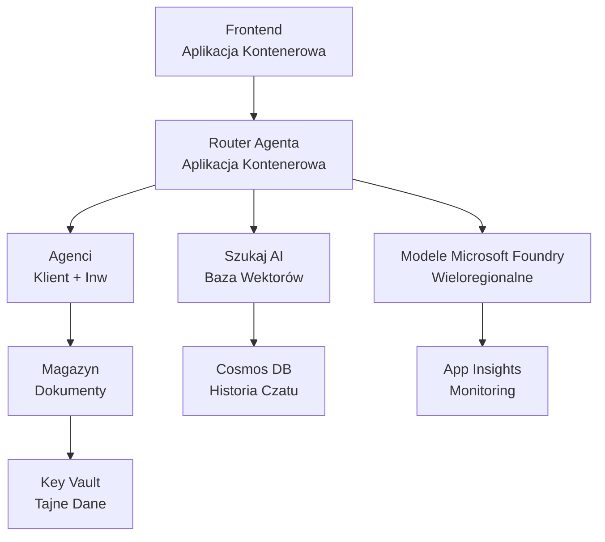

# Retail Multi-Agent Solution - Szablon infrastruktury

**Rozdział 5: Pakiet wdrożeniowy produkcji**  
- **📚 Strona kursu**: [AZD dla początkujących](../../README.md)  
- **📖 Powiązany rozdział**: [Rozdział 5: Wieloagentowe rozwiązania AI](../../README.md#-chapter-5-multi-agent-ai-solutions-advanced)  
- **📝 Przewodnik scenariusza**: [Kompletna architektura](../retail-scenario.md)  
- **🎯 Szybkie wdrożenie**: [Wdrożenie jednym kliknięciem](#-quick-deployment)  

> **⚠️ TYLKO SZABLON INFRASTRUKTURY**  
> Ten szablon ARM wdraża **zasoby Azure** dla systemu wieloagentowego.  
>  
> **Co jest wdrażane (15-25 minut):**  
> - ✅ Usługi Microsoft Foundry Models (gpt-4.1, gpt-4.1-mini, embeddings w 3 regionach)  
> - ✅ Usługa AI Search (pusta, gotowa do tworzenia indeksów)  
> - ✅ Container Apps (obrazy zastępcze, gotowe do twojego kodu)  
> - ✅ Storage, Cosmos DB, Key Vault, Application Insights  
>  
> **Co NIE jest uwzględnione (wymaga rozwoju):**  
> - ❌ Kod implementacji agentów (Agent klienta, Agent zapasów)  
> - ❌ Logika routingu i punkty końcowe API  
> - ❌ Interfejs czatu frontend  
> - ❌ Schematy indeksów wyszukiwania i potoki danych  
> - ❌ **Szacowany nakład pracy: 80-120 godzin**  
>  
> **Użyj tego szablonu jeśli:**  
> - ✅ Chcesz przygotować infrastrukturę Azure dla projektu wieloagentowego  
> - ✅ Planujesz osobno rozwijać implementację agentów  
> - ✅ Potrzebujesz bazy infrastruktury gotowej do produkcji  
>  
> **Nie używaj jeśli:**  
> - ❌ Oczekujesz działającego demo wieloagentowego natychmiast  
> - ❌ Szukasz pełnych przykładów kodu aplikacji  

## Przegląd

Ten katalog zawiera kompleksowy szablon Azure Resource Manager (ARM) do wdrożenia **podstaw infrastruktury** systemu wieloagentowego wsparcia klienta. Szablon przygotowuje wszystkie niezbędne usługi Azure, odpowiednio skonfigurowane i połączone, gotowe do rozwoju twojej aplikacji.  

**Po wdrożeniu będziesz mieć:** Infrastrukturę Azure gotową do produkcji  
**Aby ukończyć system, potrzebujesz:** kod agentów, frontend UI i konfigurację danych (patrz [Przewodnik architektury](../retail-scenario.md))  

## 🎯 Co jest wdrażane

### Podstawowa infrastruktura (Stan po wdrożeniu)

✅ **Usługi Microsoft Foundry Models** (gotowe do wywołań API)  
  - Region podstawowy: wdrożenie gpt-4.1 (pojemność 20K TPM)  
  - Region wtórny: wdrożenie gpt-4.1-mini (pojemność 10K TPM)  
  - Region trzeci: model embeddings tekstu (pojemność 30K TPM)  
  - Region ewaluacyjny: model gpt-4.1 grader (pojemność 15K TPM)  
  - **Status:** W pełni funkcjonalne - można natychmiast wywoływać API  

✅ **Azure AI Search** (pusty - gotowy do konfiguracji)  
  - Włączone możliwości wyszukiwania wektorowego  
  - Standardowy poziom z 1 partycją, 1 repliką  
  - **Status:** Usługa działa, wymaga utworzenia indeksu  
  - **Działanie:** Utwórz indeks wyszukiwania zgodny ze swoją schematyką  

✅ **Konto Storage Azure** (puste - gotowe do przesyłania plików)  
  - Kontenery Blob: `documents`, `uploads`  
  - Konfiguracja zabezpieczeń (tylko HTTPS, brak dostępu publicznego)  
  - **Status:** Gotowe do odbioru plików  
  - **Działanie:** Załaduj dane o produktach i dokumenty  

⚠️ **Środowisko Container Apps** (wdrożone obrazy zastępcze)  
  - Aplikacja routera agenta (domyślny obraz nginx)  
  - Aplikacja frontendowa (domyślny obraz nginx)  
  - Konfiguracja autoskalowania (0-10 instancji)  
  - **Status:** Działające kontenery zastępcze  
  - **Działanie:** Zbuduj i wdroż swoje aplikacje agentów  

✅ **Azure Cosmos DB** (puste - gotowe na dane)  
  - Wstępnie skonfigurowana baza danych i kontener  
  - Optymalizacja pod kątem niskich opóźnień  
  - Włączony TTL dla automatycznego czyszczenia  
  - **Status:** Gotowe do przechowywania historii czatów  

✅ **Azure Key Vault** (opcjonalnie - gotowe na sekrety)  
  - Włączona miękka usuwalność  
  - RBAC skonfigurowany dla zarządzanych tożsamości  
  - **Status:** Gotowe do przechowywania kluczy API i łańcuchów połączeń  

✅ **Application Insights** (opcjonalnie - aktywny monitoring)  
  - Połączone z przestrzenią Log Analytics  
  - Skonfigurowane metryki niestandardowe i alerty  
  - **Status:** Gotowe do odbierania telemetrii z twoich aplikacji  

✅ **Document Intelligence** (gotowe do wywołań API)  
  - Poziom S0 dla obciążeń produkcyjnych  
  - **Status:** Gotowe do przetwarzania przesłanych dokumentów  

✅ **Bing Search API** (gotowe do wywołań API)  
  - Poziom S1 dla wyszukiwań w czasie rzeczywistym  
  - **Status:** Gotowe do zapytań internetowych  

### Tryby wdrażania

| Tryb | Pojemność OpenAI | Instancje kontenerów | Poziom wyszukiwania | Redundancja Storage | Najlepsze do |
|------|------------------|---------------------|---------------------|---------------------|--------------|
| **Minimalny** | 10K-20K TPM | 0-2 repliki | Podstawowy | LRS (lokalna) | Dev/test, nauka, proof-of-concept |
| **Standardowy** | 30K-60K TPM | 2-5 replik | Standardowy | ZRS (strefowa) | Produkcja, umiarkowany ruch (<10K użytkowników) |
| **Premium** | 80K-150K TPM | 5-10 replik, redundancja strefowa | Premium | GRS (geograficzna) | Enterprise, duży ruch (>10K użytkowników), 99,99% SLA |

**Wpływ kosztów:**  
- **Minimalny → Standardowy:** ~4x wzrost kosztów (100-370 $/mies. → 420-1450 $/mies.)  
- **Standardowy → Premium:** ~3x wzrost kosztów (420-1450 $/mies. → 1150-3500 $/mies.)  
- **Wybór zależy od:** przewidywanego obciążenia, wymagań SLA, ograniczeń budżetowych  

**Planowanie pojemności:**  
- **TPM (Tokens Per Minute):** suma pojemności wszystkich wdrożeń modeli  
- **Instancje kontenerów:** zakres autoskalowania (min-max replik)  
- **Poziom wyszukiwania:** wpływa na wydajność zapytań i limit rozmiaru indeksu  

## 📋 Wymagania wstępne

### Wymagane narzędzia  
1. **Azure CLI** (wersja 2.50.0 lub wyższa)  
   ```bash
   az --version  # Sprawdź wersję
   az login      # Uwierzytelnij się
   ```
  
2. **Aktywny subskrypcja Azure** z rolą Owner albo Contributor  
   ```bash
   az account show  # Zweryfikuj subskrypcję
   ```
  
### Wymagane kwoty Azure  

Przed wdrożeniem sprawdź dostępne kwoty w docelowych regionach:  

```bash
# Sprawdź dostępność modeli Microsoft Foundry w Twoim regionie
az cognitiveservices account list-skus \
  --kind OpenAI \
  --location eastus2

# Zweryfikuj limit OpenAI (przykład dla gpt-4.1)
az cognitiveservices usage list \
  --location eastus2 \
  --query "[?name.value=='OpenAI.Standard.gpt-4.1']"

# Sprawdź limit kontenerowych aplikacji
az provider show \
  --namespace Microsoft.App \
  --query "resourceTypes[?resourceType=='managedEnvironments'].locations"
```
  
**Minimalne wymagane kwoty:**  
- **Microsoft Foundry Models:** 3-4 wdrożenia modeli w regionach  
  - gpt-4.1: 20K TPM (tokenów na minutę)  
  - gpt-4.1-mini: 10K TPM  
  - text-embedding-ada-002: 30K TPM  
  - **Uwaga:** gpt-4.1 może mieć listę oczekujących w niektórych regionach - sprawdź [dostępność modeli](https://learn.microsoft.com/azure/ai-services/openai/concepts/models)  
- **Container Apps:** zarządzane środowisko + 2-10 instancji kontenerów  
- **AI Search:** poziom standardowy (podstawowy niewystarczający do wyszukiwania wektorowego)  
- **Cosmos DB:** standardowy przepustowość  

**Jeśli kwota jest niewystarczająca:**  
1. Przejdź do Azure Portal → Kwoty → Poproś o zwiększenie  
2. Lub użyj Azure CLI:  
   ```bash
   az support tickets create \
     --ticket-name "OpenAI-Quota-Increase" \
     --severity "minimal" \
     --description "Request quota increase for Microsoft Foundry Models gpt-4.1 in eastus2"
   ```
  
3. Rozważ alternatywne regiony z dostępnością  

## 🚀 Szybkie wdrożenie

### Opcja 1: Za pomocą Azure CLI  

```bash
# Sklonuj lub pobierz pliki szablonu
git clone <repository-url>
cd examples/retail-multiagent-arm-template

# Uczyń skrypt wdrożeniowy wykonalnym
chmod +x deploy.sh

# Wdróż z ustawieniami domyślnymi
./deploy.sh -g myResourceGroup

# Wdróż dla produkcji z funkcjami premium
./deploy.sh -g myProdRG -e prod -m premium -l eastus2
```
  
### Opcja 2: Za pomocą Azure Portal  

[](https://portal.azure.com/#create/Microsoft.Template/uri/https%3A%2F%2Fraw.githubusercontent.com%2Fmicrosoft%2Fazd-for-beginners%2Fmain%2Fexamples%2Fretail-multiagent-arm-template%2Fazuredeploy.json)  

### Opcja 3: Bezpośrednio przez Azure CLI  

```bash
# Utwórz grupę zasobów
az group create --name myResourceGroup --location eastus2

# Wdróż szablon
az deployment group create \
  --resource-group myResourceGroup \
  --template-file azuredeploy.json \
  --parameters azuredeploy.parameters.json
```
  
## ⏱️ Czas wdrożenia

### Czego się spodziewać  

| Faza | Czas trwania | Co się dzieje |
|-------|--------------|---------------|  
| **Walidacja szablonu** | 30-60 sekund | Azure sprawdza składnię i parametry szablonu ARM |  
| **Tworzenie grupy zasobów** | 10-20 sekund | Tworzy grupę zasobów (jeśli potrzebna) |  
| **Provisioning OpenAI** | 5-8 minut | Tworzy 3-4 konta OpenAI i wdraża modele |  
| **Container Apps** | 3-5 minut | Tworzy środowisko i wdraża kontenery zastępcze |  
| **Wyszukiwanie i Storage** | 2-4 minuty | Przygotowuje usługę AI Search i konta Storage |  
| **Cosmos DB** | 2-3 minuty | Tworzy bazę danych i konfiguruje kontenery |  
| **Konfiguracja monitoringu** | 2-3 minuty | Ustawia Application Insights i Log Analytics |  
| **Konfiguracja RBAC** | 1-2 minuty | Konfiguruje zarządzane tożsamości i uprawnienia |  
| **Całkowity czas wdrożenia** | **15-25 minut** | Gotowa pełna infrastruktura |  

**Po wdrożeniu:**  
- ✅ **Infrastruktura Gotowa:** Wszystkie usługi Azure przygotowane i działające  
- ⏱️ **Rozwój aplikacji:** 80-120 godzin (po twojej stronie)  
- ⏱️ **Konfiguracja indeksów:** 15-30 minut (wymaga twojego schematu)  
- ⏱️ **Ładowanie danych:** Zależne od rozmiaru zbioru danych  
- ⏱️ **Testy i walidacja:** 2-4 godziny  

---

## ✅ Sprawdź sukces wdrożenia

### Krok 1: Sprawdź stworzenie zasobów (2 minuty)  

```bash
# Zweryfikuj, czy wszystkie zasoby zostały pomyślnie wdrożone
az resource list \
  --resource-group myResourceGroup \
  --query "[?provisioningState!='Succeeded'].{Name:name, Status:provisioningState, Type:type}" \
  --output table
```
  
**Oczekiwane:** Pusta tabela (wszystkie zasoby mają status „Succeeded”)  

### Krok 2: Zweryfikuj wdrożenia Microsoft Foundry Models (3 minuty)  

```bash
# Wypisz wszystkie konta OpenAI
az cognitiveservices account list \
  --resource-group myResourceGroup \
  --query "[?kind=='OpenAI'].{Name:name, Location:location, Status:properties.provisioningState}" \
  --output table

# Sprawdź wdrożenia modeli dla regionu podstawowego
OPENAI_NAME=$(az cognitiveservices account list \
  --resource-group myResourceGroup \
  --query "[?kind=='OpenAI'] | [0].name" -o tsv)

az cognitiveservices account deployment list \
  --name $OPENAI_NAME \
  --resource-group myResourceGroup \
  --output table
```
  
**Oczekiwane:**  
- 3-4 konta OpenAI (region podstawowy, wtórny, trzeci, ewaluacyjny)  
- 1-2 wdrożenia modeli na konto (gpt-4.1, gpt-4.1-mini, text-embedding-ada-002)  

### Krok 3: Przetestuj punkty końcowe infrastruktury (5 minut)  

```bash
# Pobierz adresy URL aplikacji kontenera
az containerapp list \
  --resource-group myResourceGroup \
  --query "[].{Name:name, URL:properties.configuration.ingress.fqdn, Status:properties.runningStatus}" \
  --output table

# Testuj punkt końcowy routera (odpowie zastępczy obraz)
ROUTER_URL=$(az containerapp show \
  --name retail-router \
  --resource-group myResourceGroup \
  --query "properties.configuration.ingress.fqdn" -o tsv)

echo "Testing: https://$ROUTER_URL"
curl -I https://$ROUTER_URL || echo "Container running (placeholder image - expected)"
```
  
**Oczekiwane:**  
- Container Apps pokazują status „Running”  
- Placeholder nginx odpowiada z HTTP 200 lub 404 (brak jeszcze kodu aplikacji)  

### Krok 4: Zweryfikuj dostęp do API Microsoft Foundry Models (3 minuty)  

```bash
# Pobierz punkt końcowy i klucz OpenAI
OPENAI_ENDPOINT=$(az cognitiveservices account show \
  --name $OPENAI_NAME \
  --resource-group myResourceGroup \
  --query "properties.endpoint" -o tsv)

OPENAI_KEY=$(az cognitiveservices account keys list \
  --name $OPENAI_NAME \
  --resource-group myResourceGroup \
  --query "key1" -o tsv)

# Przetestuj wdrożenie gpt-4.1
curl "${OPENAI_ENDPOINT}openai/deployments/gpt-4.1/chat/completions?api-version=2024-08-01-preview" \
  -H "Content-Type: application/json" \
  -H "api-key: $OPENAI_KEY" \
  -d '{
    "messages": [{"role": "user", "content": "Say hello"}],
    "max_tokens": 10
  }'
```
  
**Oczekiwane:** odpowiedź JSON z uzupełnieniem czatu (potwierdza, że OpenAI działa)  

### Co działa a co nie  

**✅ Działa po wdrożeniu:**  
- Modele Microsoft Foundry Models wdrożone i akceptujące połączenia API  
- Usługa AI Search działa (pusta, brak indeksów)  
- Container Apps działają (obrazy nginx zastępcze)  
- Konta Storage dostępne i gotowe do przesyłania  
- Cosmos DB gotowe do operacji na danych  
- Application Insights zbiera telemetrię infrastruktury  
- Key Vault gotowy na przechowywanie sekretów  

**❌ Jeszcze nie działa (wymaga rozwoju):**  
- Punkty końcowe agentów (brak wdrożonego kodu aplikacji)  
- Funkcjonalność czatu (wymaga frontend + backend)  
- Zapytania wyszukiwawcze (brak utworzonych indeksów)  
- Potok przetwarzania dokumentów (brak przesłanych danych)  
- Telemetria niestandardowa (wymaga instrumentacji aplikacji)  

**Kolejne kroki:** zobacz [Konfiguracja po wdrożeniu](#-post-deployment-next-steps) aby rozwijać i wdrażać aplikację  

---

## ⚙️ Opcje konfiguracji

### Parametry szablonu

| Parametr | Typ | Domyślnie | Opis |
|-----------|-----|-----------|------|
| `projectName` | string | "retail" | Prefiks dla nazw zasobów |
| `location` | string | Lokalizacja grupy zasobów | Region główny wdrożenia |
| `secondaryLocation` | string | "westus2" | Region wtórny do wdrożenia wieloregionowego |
| `tertiaryLocation` | string | "francecentral" | Region dla modelu embeddings |
| `environmentName` | string | "dev" | Nazwa środowiska (dev/staging/prod) |
| `deploymentMode` | string | "standard" | Konfiguracja wdrożenia (minimal/standard/premium) |
| `enableMultiRegion` | bool | true | Włącz wdrożenie wieloregionowe |
| `enableMonitoring` | bool | true | Włącz Application Insights i logowanie |
| `enableSecurity` | bool | true | Włącz Key Vault i rozszerzone zabezpieczenia |

### Dostosowywanie parametrów

Edytuj `azuredeploy.parameters.json`:

```json
{
  "$schema": "https://schema.management.azure.com/schemas/2019-04-01/deploymentParameters.json#",
  "contentVersion": "1.0.0.0",
  "parameters": {
    "projectName": {
      "value": "mycompany"
    },
    "environmentName": {
      "value": "prod"
    },
    "deploymentMode": {
      "value": "premium"
    },
    "location": {
      "value": "eastus2"
    }
  }
}
```
  
## 🏗️ Przegląd architektury


## 📖 Użycie skryptu wdrożeniowego

Skrypt `deploy.sh` zapewnia interaktywny proces wdrożenia:

```bash
# Pokaż pomoc
./deploy.sh --help

# Podstawowe wdrożenie
./deploy.sh -g myResourceGroup

# Zaawansowane wdrożenie z niestandardowymi ustawieniami
./deploy.sh \
  -g myProductionRG \
  -p companyname \
  -e prod \
  -m premium \
  -l eastus2

# Wdrożenie deweloperskie bez wielu regionów
./deploy.sh \
  -g myDevRG \
  -e dev \
  -m minimal \
  --no-multi-region \
  --no-security
```
  
### Funkcje skryptu

- ✅ **Walidacja wymagań** (Azure CLI, status logowania, pliki szablonów)  
- ✅ **Zarządzanie grupą zasobów** (tworzy jeśli nie istnieje)  
- ✅ **Walidacja szablonu** przed wdrożeniem  
- ✅ **Monitorowanie postępu** z kolorowym wyświetlaniem  
- ✅ **Wyświetlanie wyników wdrożenia**  
- ✅ **Wskazówki po wdrożeniu**  

## 📊 Monitorowanie wdrożenia

### Sprawdź status wdrożenia  

```bash
# Wyświetl listę wdrożeń
az deployment group list --resource-group myResourceGroup --output table

# Pobierz szczegóły wdrożenia
az deployment group show \
  --resource-group myResourceGroup \
  --name retail-deployment-YYYYMMDD-HHMMSS

# Obserwuj postęp wdrożenia
az deployment group create \
  --resource-group myResourceGroup \
  --template-file azuredeploy.json \
  --parameters azuredeploy.parameters.json \
  --verbose
```
  
### Wyniki wdrożenia  

Po pomyślnym wdrożeniu dostępne są następujące wyniki:  

- **URL frontendu**: publiczny punkt dostępu do interfejsu webowego  
- **URL routera**: punkt końcowy API routera agenta  
- **Punkty końcowe OpenAI**: podstawowy i wtórny endpoint usługi OpenAI  
- **Usługa wyszukiwania**: punkt końcowy usługi Azure AI Search  
- **Konto Storage**: nazwa konta storage na dokumenty  
- **Key Vault**: nazwa Key Vault (jeśli włączony)  
- **Application Insights**: nazwa usługi monitorującej (jeśli włączona)  

## 🔧 Po wdrożeniu: kolejne kroki  

> **📝 Ważne:** Infrastrukturę wdrożono, ale musisz opracować i wdrożyć kod aplikacji.

### Faza 1: Opracowanie aplikacji agentów (Twoja odpowiedzialność)

Szablon ARM tworzy **puste aplikacje kontenerowe** z obrazami nginx jako zastępczymi. Musisz:

**Wymagany rozwój:**
1. **Implementacja agenta** (30-40 godzin)
   - Agent obsługi klienta z integracją gpt-4.1
   - Agent zarządzania zapasami z integracją gpt-4.1-mini
   - Logika trasowania agentów

2. **Rozwój frontend** (20-30 godzin)
   - Interfejs czatu UI (React/Vue/Angular)
   - Funkcjonalność przesyłania plików
   - Renderowanie i formatowanie odpowiedzi

3. **Usługi backend** (12-16 godzin)
   - Router FastAPI lub Express
   - Middleware do uwierzytelniania
   - Integracja telemetrii

**Zobacz:** [Przewodnik architektury](../retail-scenario.md) po szczegółowe wzorce implementacji i przykłady kodu

### Faza 2: Skonfiguruj indeks wyszukiwania AI (15-30 minut)

Utwórz indeks wyszukiwania zgodny z modelem danych:

```bash
# Pobierz szczegóły usługi wyszukiwania
SEARCH_NAME=$(az search service list \
  --resource-group myResourceGroup \
  --query "[0].name" -o tsv)

SEARCH_KEY=$(az search admin-key show \
  --service-name $SEARCH_NAME \
  --resource-group myResourceGroup \
  --query "primaryKey" -o tsv)

# Utwórz indeks ze swoim schematem (przykład)
curl -X POST "https://${SEARCH_NAME}.search.windows.net/indexes?api-version=2023-11-01" \
  -H "Content-Type: application/json" \
  -H "api-key: ${SEARCH_KEY}" \
  -d '{
    "name": "products",
    "fields": [
      {"name": "id", "type": "Edm.String", "key": true},
      {"name": "title", "type": "Edm.String", "searchable": true},
      {"name": "content", "type": "Edm.String", "searchable": true},
      {"name": "category", "type": "Edm.String", "filterable": true},
      {"name": "content_vector", "type": "Collection(Edm.Single)", 
       "searchable": true, "dimensions": 1536, "vectorSearchProfile": "default"}
    ],
    "vectorSearch": {
      "algorithms": [{"name": "default", "kind": "hnsw"}],
      "profiles": [{"name": "default", "algorithm": "default"}]
    }
  }'
```

**Zasoby:**
- [Projektowanie schematu indeksu AI Search](https://learn.microsoft.com/azure/search/search-what-is-an-index)
- [Konfiguracja wyszukiwania wektorowego](https://learn.microsoft.com/azure/search/vector-search-how-to-create-index)

### Faza 3: Prześlij swoje dane (czas zależny)

Gdy masz już dane produktowe i dokumenty:

```bash
# Pobierz szczegóły konta magazynu
STORAGE_NAME=$(az storage account list \
  --resource-group myResourceGroup \
  --query "[0].name" -o tsv)

STORAGE_KEY=$(az storage account keys list \
  --account-name $STORAGE_NAME \
  --resource-group myResourceGroup \
  --query "[0].value" -o tsv)

# Prześlij swoje dokumenty
az storage blob upload-batch \
  --destination documents \
  --source /path/to/your/product/docs \
  --account-name $STORAGE_NAME \
  --account-key $STORAGE_KEY

# Przykład: Prześlij pojedynczy plik
az storage blob upload \
  --container-name documents \
  --name "product-manual.pdf" \
  --file /path/to/product-manual.pdf \
  --account-name $STORAGE_NAME \
  --account-key $STORAGE_KEY
```

### Faza 4: Zbuduj i wdroż swoje aplikacje (8-12 godzin)

Gdy opracujesz kod agenta:

```bash
# 1. Utwórz Azure Container Registry (jeśli to konieczne)
az acr create \
  --name myregistry \
  --resource-group myResourceGroup \
  --sku Basic

# 2. Zbuduj i wypchnij obraz routera agenta
docker build -t myregistry.azurecr.io/agent-router:v1 /path/to/your/router/code
az acr login --name myregistry
docker push myregistry.azurecr.io/agent-router:v1

# 3. Zbuduj i wypchnij obraz frontendu
docker build -t myregistry.azurecr.io/frontend:v1 /path/to/your/frontend/code
docker push myregistry.azurecr.io/frontend:v1

# 4. Zaktualizuj aplikacje kontenerowe za pomocą swoich obrazów
az containerapp update \
  --name retail-router \
  --resource-group myResourceGroup \
  --image myregistry.azurecr.io/agent-router:v1

az containerapp update \
  --name retail-frontend \
  --resource-group myResourceGroup \
  --image myregistry.azurecr.io/frontend:v1

# 5. Skonfiguruj zmienne środowiskowe
az containerapp update \
  --name retail-router \
  --resource-group myResourceGroup \
  --set-env-vars \
    OPENAI_ENDPOINT=secretref:openai-endpoint \
    OPENAI_KEY=secretref:openai-key \
    SEARCH_ENDPOINT=secretref:search-endpoint \
    SEARCH_KEY=secretref:search-key
```

### Faza 5: Przetestuj swoją aplikację (2-4 godziny)

```bash
# Pobierz adres URL swojej aplikacji
ROUTER_URL=$(az containerapp show \
  --name retail-router \
  --resource-group myResourceGroup \
  --query "properties.configuration.ingress.fqdn" -o tsv)

# Punkt końcowy agenta testowego (po wdrożeniu kodu)
curl -X POST "https://${ROUTER_URL}/chat" \
  -H "Content-Type: application/json" \
  -d '{
    "message": "Hello, I need help with my order",
    "agent": "customer"
  }'

# Sprawdź logi aplikacji
az containerapp logs show \
  --name retail-router \
  --resource-group myResourceGroup \
  --follow
```

### Zasoby do implementacji

**Architektura i projektowanie:**
- 📖 [Kompletny przewodnik architektury](../retail-scenario.md) - Szczegółowe wzorce implementacji
- 📖 [Wzorce projektowe systemów multi-agentowych](https://learn.microsoft.com/azure/architecture/ai-ml/guide/multi-agent-systems)

**Przykłady kodu:**
- 🔗 [Microsoft Foundry Models Chat Sample](https://github.com/Azure-Samples/azure-search-openai-demo) - wzorzec RAG
- 🔗 [Semantic Kernel](https://github.com/microsoft/semantic-kernel) - framework agentów (C#)
- 🔗 [LangChain Azure](https://github.com/langchain-ai/langchain) - orkiestracja agentów (Python)
- 🔗 [AutoGen](https://github.com/microsoft/autogen) - rozmowy multi-agentowe

**Szacowany całkowity nakład pracy:**
- Wdrożenie infrastruktury: 15-25 minut (✅ Zakończone)
- Rozwój aplikacji: 80-120 godzin (🔨 Twoja praca)
- Testowanie i optymalizacja: 15-25 godzin (🔨 Twoja praca)

## 🛠️ Rozwiązywanie problemów

### Częste problemy

#### 1. Przekroczenie limitu Microsoft Foundry Models

```bash
# Sprawdź aktualne wykorzystanie limitu
az cognitiveservices usage list --location eastus2

# Poproś o zwiększenie limitu
az support tickets create \
  --ticket-name "OpenAI-Quota-Increase" \
  --severity "minimal" \
  --description "Request quota increase for Microsoft Foundry Models in region X"
```

#### 2. Nieudane wdrożenie aplikacji kontenerowych

```bash
# Sprawdź logi aplikacji kontenera
az containerapp logs show \
  --name retail-router \
  --resource-group myResourceGroup \
  --follow

# Zrestartuj aplikację kontenera
az containerapp revision restart \
  --name retail-router \
  --resource-group myResourceGroup
```

#### 3. Inicjalizacja usługi wyszukiwania

```bash
# Sprawdź status usługi wyszukiwania
az search service show \
  --name <search-service-name> \
  --resource-group myResourceGroup

# Przetestuj łączność usługi wyszukiwania
curl -X GET "https://<search-service-name>.search.windows.net/indexes?api-version=2023-11-01" \
  -H "api-key: <search-admin-key>"
```

### Walidacja wdrożenia

```bash
# Sprawdź, czy wszystkie zasoby zostały utworzone
az resource list \
  --resource-group myResourceGroup \
  --output table

# Sprawdź stan zasobów
az resource list \
  --resource-group myResourceGroup \
  --query "[?provisioningState!='Succeeded'].{Name:name, Status:provisioningState, Type:type}" \
  --output table
```

## 🔐 Aspekty bezpieczeństwa

### Zarządzanie kluczami
- Wszystkie tajemnice są przechowywane w Azure Key Vault (jeśli włączone)
- Aplikacje kontenerowe używają zarządzanej tożsamości do uwierzytelniania
- Konta magazynowe mają bezpieczne ustawienia domyślne (tylko HTTPS, brak publicznego dostępu do blobów)

### Bezpieczeństwo sieci
- Aplikacje kontenerowe korzystają z sieci wewnętrznej tam, gdzie to możliwe
- Usługa wyszukiwania skonfigurowana z opcją prywatnych punktów końcowych
- Cosmos DB skonfigurowana z minimalnymi niezbędnymi uprawnieniami

### Konfiguracja RBAC
```bash
# Przypisz niezbędne role dla zarządzanej tożsamości
az role assignment create \
  --assignee <container-app-managed-identity> \
  --role "Cognitive Services OpenAI User" \
  --scope <openai-resource-id>
```

## 💰 Optymalizacja kosztów

### Szacunki kosztów (miesięcznie, USD)

| Tryb | OpenAI | Aplikacje kontenerowe | Wyszukiwanie | Magazyn | Szac. łączny |
|------|--------|----------------------|--------------|---------|--------------|
| Minimalny | 50-200 USD | 20-50 USD | 25-100 USD | 5-20 USD | 100-370 USD |
| Standardowy | 200-800 USD | 100-300 USD | 100-300 USD | 20-50 USD | 420-1450 USD |
| Premium | 500-2000 USD | 300-800 USD | 300-600 USD | 50-100 USD | 1150-3500 USD |

### Monitorowanie kosztów

```bash
# Ustaw alerty budżetowe
az consumption budget create \
  --account-name <subscription-id> \
  --budget-name "retail-budget" \
  --amount 500 \
  --time-grain Monthly \
  --start-date 2024-01-01 \
  --end-date 2024-12-31
```

## 🔄 Aktualizacje i konserwacja

### Aktualizacje szablonów
- Kontroluj wersje plików szablonów ARM
- Najpierw testuj zmiany w środowisku deweloperskim
- Używaj trybu wdrożenia przyrostowego do aktualizacji

### Aktualizacje zasobów
```bash
# Aktualizacja z nowymi parametrami
az deployment group create \
  --resource-group myResourceGroup \
  --template-file azuredeploy.json \
  --parameters azuredeploy.parameters.json \
  --mode Incremental
```

### Kopia zapasowa i odzyskiwanie
- Automatyczne kopie zapasowe Cosmos DB włączone
- Włączona miękka usuwanie w Key Vault
- Zachowywane rewizje aplikacji kontenerowych do cofania zmian

## 📞 Wsparcie

- **Problemy z szablonem**: [GitHub Issues](https://github.com/microsoft/azd-for-beginners/issues)
- **Wsparcie Azure**: [Portal wsparcia Azure](https://portal.azure.com/#blade/Microsoft_Azure_Support/HelpAndSupportBlade)
- **Społeczność**: [Azure AI Discord](https://discord.gg/microsoft-azure)

---

**⚡ Gotowy, aby wdrożyć swoje rozwiązanie multi-agentowe?**

Zacznij od: `./deploy.sh -g myResourceGroup`

---

<!-- CO-OP TRANSLATOR DISCLAIMER START -->
**Zrzeczenie się odpowiedzialności**:  
Niniejszy dokument został przetłumaczony za pomocą usługi tłumaczeń AI [Co-op Translator](https://github.com/Azure/co-op-translator). Chociaż dążymy do zachowania dokładności, prosimy pamiętać, że tłumaczenia automatyczne mogą zawierać błędy lub niedokładności. Oryginalny dokument w języku źródłowym powinien być traktowany jako dokument obowiązujący. W przypadku informacji krytycznych zalecane jest skorzystanie z profesjonalnego tłumaczenia wykonywanego przez człowieka. Nie ponosimy odpowiedzialności za jakiekolwiek nieporozumienia lub błędne interpretacje wynikające z korzystania z tego tłumaczenia.
<!-- CO-OP TRANSLATOR DISCLAIMER END -->